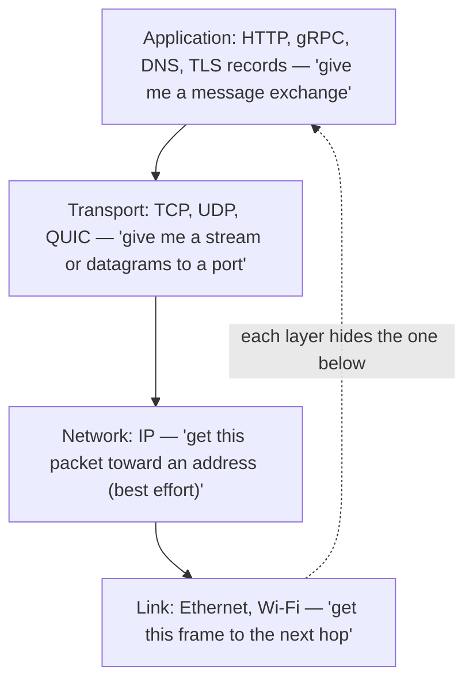
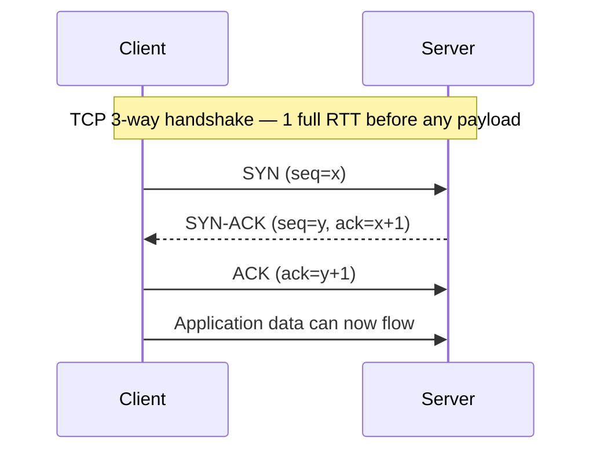
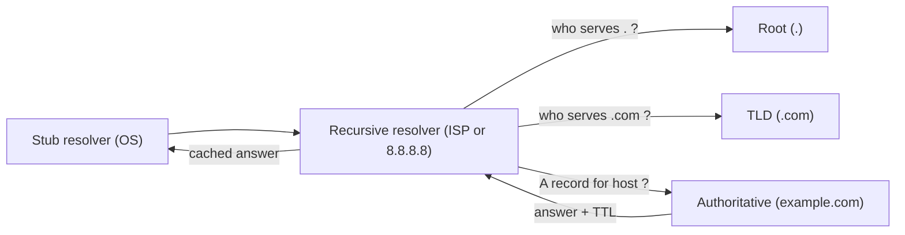
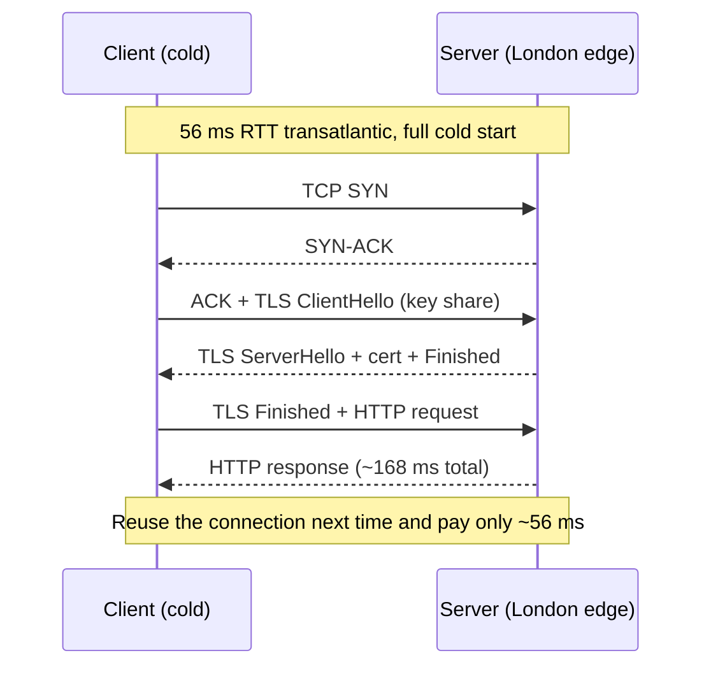
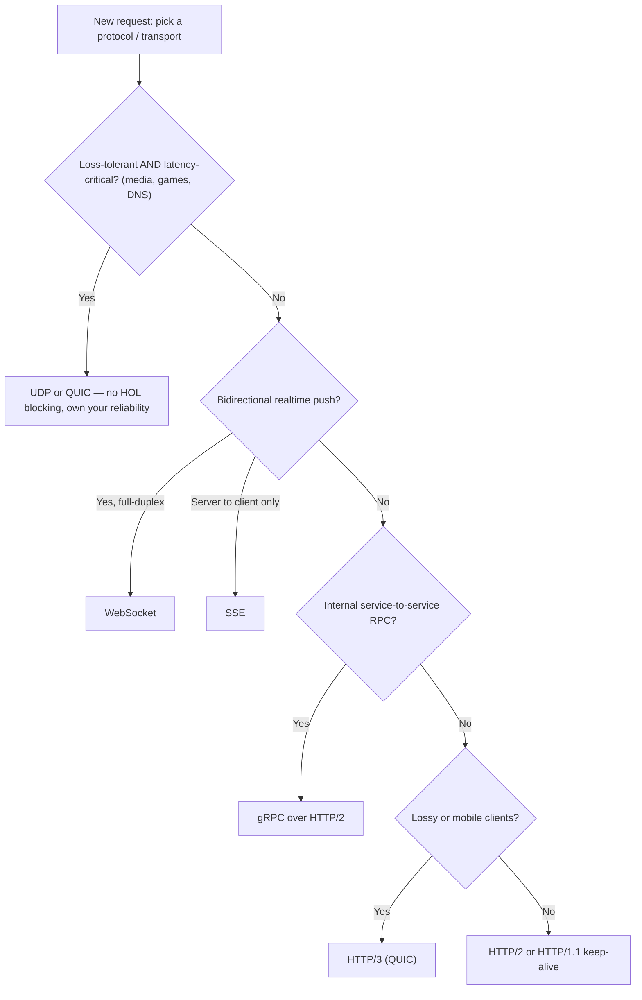

# Networking for System Design

> Where this fits: this is the *foundation* layer of the curriculum — every distributed system, every API call, every database replication stream rides on the network. Master this and the rest of HLD becomes "what do we do given that the network is slow, lossy, and adversarial?"
>
> **Principal-level takeaway:** The network is not a wire — it is a stack of stateful protocols with their own buffers, timers, and failure modes. You cannot predict a system's latency, choose a protocol, or debug "it's slow sometimes" until you can trace a single byte from `connect()` to the remote process and name every queue and round-trip it passed through. *Latency is set by physics and round-trips; throughput is set by bandwidth and windows; they are different problems and you fix them differently.*

---

## ⚡ 60-Second TL;DR

- **What/why:** layered stack (Link→IP→Transport→App) builds a reliable, ordered, encrypted byte stream over an unreliable, plaintext packet medium.
- **TCP** = reliable/ordered but pays handshake RTTs + **HOL blocking**; **UDP** = no setup/no HOL, you own reliability (media, DNS, QUIC).
- **HTTP/2** multiplexes over TCP (still TCP-level HOL on loss); **HTTP/3 (QUIC/UDP)** makes streams independent + survives IP changes.
- **TLS 1.3** = 1-RTT (0-RTT resume, replay-unsafe); decide **where you terminate** (edge vs end-to-end/mTLS).
- **#1 trap:** "more bandwidth fixes slow." No — **latency = RTT × round-trips**; single-stream throughput ≈ **window/RTT**.
- **Must-know numbers:** fiber ~5 µs/km → NY↔London ~56 ms RTT; ~64K ephemeral ports/pair; Nagle+delayed-ACK = ~40 ms stalls; MTU ~1500B.

**Remember one thing:** assign a protocol, an RTT, and a round-trip count to every arrow you draw — you cannot reason about a system until each hop has a number.

## The Mental Model — first principles: why does this thing exist?

Two processes on two machines want to exchange data. Between them sits a chain of fallible components: NICs, switches, routers, fiber, undersea cables, ISPs, firewalls, load balancers. None of them is reliable. Packets get dropped, duplicated, reordered, and delayed by arbitrary amounts. The fundamental problem networking solves is: **build a reliable, ordered, secured byte stream on top of an unreliable, unordered, plaintext packet medium** — and do it without melting the shared infrastructure when ten million machines try at once.

The industry's answer is *layering*. Each layer solves one problem and hands a clean abstraction to the layer above:



The genius and the curse of layering is the same: **each layer hides the one below.** TCP hides packet loss from HTTP — wonderful, until packet loss causes a latency spike your HTTP metrics can't explain. The principal skill is knowing when to *break* the abstraction and reason about the layer underneath.

A single mental anchor to carry everywhere: **light in fiber travels ~200,000 km/s (~5 µs/km).** New York to London is ~5,600 km, so the *theoretical minimum* one-way is ~28 ms, round-trip ~56 ms. No protocol, no money, no CDN beats the speed of light. When someone proposes "synchronous call across regions," that number is the conversation-ender.

---

## Core Concepts

### IP, ports, and NAT — the addressing layer

IP gives every interface an address (IPv4 `192.0.2.10`, or 128-bit IPv6) and promises *best-effort* delivery of a packet toward it. "Best effort" is literal: IP makes no promise of delivery, order, or non-duplication. Everything reliable is built above it.

A packet alone reaches a *machine*. To reach a *process* you need a **port** — a 16-bit number (0–65535). A TCP connection is uniquely identified by the **4-tuple** `(src IP, src port, dst IP, dst port)`. This is why one server on port 443 can hold millions of connections: each client contributes a distinct source IP/port, so the tuples stay unique. The practical limit per *single* client→server pair is ~64K ephemeral source ports, which is why connection-pool exhaustion and `TIME_WAIT` accumulation are real production problems behind load balancers.

**NAT (Network Address Translation)** exists because IPv4 ran out of addresses (only ~4.3 billion). Your laptop has a private address (`10.x`, `192.168.x`); a NAT gateway rewrites the source IP/port on the way out and keeps a translation table to route replies back. Consequences that bite system designers:

- NAT is *stateful*. The mapping has an idle timeout (often 30s–5min). This is why a long-lived idle connection silently dies and your next write hangs — and why **TCP keepalives / application heartbeats** exist.
- NAT breaks inbound connections (no public address to dial), which is why peer-to-peer needs **STUN/TURN/hole-punching** and why most architectures are client-initiated.

### TCP — turning chaos into a reliable ordered stream

TCP is the workhorse. It provides: reliable delivery (retransmit lost segments), ordering (sequence numbers reassemble out-of-order packets), and *flow + congestion control*. The cost is state, round-trips, and head-of-line blocking.

**The handshake (3-way).** Before any data flows:



That is **one full round-trip (1 RTT) of pure setup before a single byte of payload.** Add TLS and it gets worse (below). This is *the* reason connection reuse matters so much: on a 56 ms RTT transatlantic link, a fresh TCP connection costs you 56 ms before "hello."

**Flow control** stops a fast sender from drowning a slow receiver. The receiver advertises a **receive window** (`rwnd`) — "I have N bytes of buffer free." The sender never has more than `rwnd` unacknowledged bytes in flight. This is a *per-connection, receiver-driven* limit.

**Congestion control** stops senders from drowning the *network* (the shared core, which nobody owns). The sender maintains a **congestion window** (`cwnd`) and sends `min(rwnd, cwnd)`. The classic algorithm:

- **Slow start:** begin with a small `cwnd` (modern Linux: ~10 segments, ~14 KB) and *double it every RTT* until loss or a threshold. "Slow start" is a misnomer — it's exponential, but it *starts* small. The consequence: a brand-new connection cannot use full bandwidth immediately. Transferring a 1 MB file over a fat, high-RTT link can be dominated not by bandwidth but by the *number of RTTs slow-start needs to ramp up*. This is why CDNs and connection reuse matter even when bandwidth is plentiful.
- **Congestion avoidance:** after the threshold, grow `cwnd` linearly (additive increase) and on loss, cut it (multiplicative decrease — AIMD). Reno halves it; **CUBIC** (Linux default) uses a cubic function to recover faster on high-bandwidth links; **BBR** (Google) models bottleneck bandwidth and RTT directly instead of treating loss as the only congestion signal — a big deal on lossy mobile/transcontinental links where loss ≠ congestion.

**Head-of-line (HOL) blocking** is TCP's structural flaw for multiplexed workloads. Because TCP guarantees *in-order* delivery of the byte stream, **one lost segment stalls delivery of everything behind it** until the retransmit arrives — even bytes that already made it to the receiver's kernel buffer. If you multiplex 100 independent HTTP requests over one TCP connection (HTTP/2), a single dropped packet blocks *all 100*. Hold this thought; it's the entire reason HTTP/3 exists.

**Nagle's algorithm** batches small writes: it withholds a small segment until either the prior data is ACKed or enough data accumulates to fill a packet. It reduces the "tinygram" overhead of telnet-style traffic. But combined with **delayed ACKs** (the receiver waits up to ~40–200 ms before acking, hoping to piggyback) it produces a notorious ~40 ms stall: sender waits for ACK, receiver waits to send ACK. Latency-sensitive apps (databases, RPC, games) set **`TCP_NODELAY`** to disable Nagle. If you ever see suspiciously round ~40 ms latencies, suspect this interaction.

### UDP — and when "unreliable" is the right choice

UDP is TCP minus everything: no handshake, no ordering, no retransmit, no congestion control. You get datagrams to a port, best effort. Why would you want that?

- **Loss-tolerant, latency-critical traffic.** In live voice/video, a retransmitted packet arrives too late to matter — you'd rather conceal the gap and move on. Retransmission *adds* latency, which is the enemy.
- **You want to build your own reliability.** QUIC (HTTP/3) runs over UDP precisely so it can implement *better* reliability and multiplexing in userspace without TCP's HOL blocking and without waiting for kernel/OS upgrades.
- **Request/response with no setup cost.** DNS uses UDP: one packet out, one back, no handshake. Cheap and fast for small messages.
- **One-to-many.** Multicast/broadcast only exist over UDP.

The trade: you (or your protocol) now own loss recovery and congestion control. Roll your own carelessly and you become the jerk congesting everyone else's network.

### DNS — the resolution path nobody budgets for

DNS turns `api.example.com` into an IP. The full recursive path the first time:



Each hop can be a round-trip. A cold lookup can cost 20–120+ ms. But the system is saturated with **caching governed by TTL** (time-to-live): the authoritative server stamps each record with a TTL (e.g. 60s, 300s, 86400s) and every resolver caches until it expires. This is the central DNS trade-off:

- **Low TTL (e.g. 30–60s):** fast failover and traffic shifting (change the record, the world picks it up within a minute) — at the cost of more lookups and load.
- **High TTL (e.g. hours/days):** great caching, but you *cannot* quickly move traffic; clients keep hitting the dead IP. During an incident, a 24h TTL set last quarter is your enemy.

**Anycast** is the other DNS superpower: the *same* IP address is announced from many locations via BGP, and the network routes each client to the topologically nearest one. Root DNS servers, public resolvers (`1.1.1.1`, `8.8.8.8`), and CDN edges all use anycast so "one IP" transparently means "the closest of hundreds of POPs." Pair this with [load balancing](../01-building-blocks/05-load-balancing.md) and you have global traffic steering.

Misconception to kill now: **DNS does not load-balance reliably by handing out multiple A records.** Clients, OSes, and stub resolvers cache and pick inconsistently; TTLs lie (some clients ignore them). DNS is for coarse steering, not fine-grained balancing.

### TLS 1.3 — encryption, identity, and where you terminate it

TLS does two jobs: **confidentiality** (encrypt the bytes) and **authentication** (prove the server is who it claims, via certificates). 

**The 1.3 handshake is 1-RTT** (a major win over TLS 1.2's 2-RTT): the client sends its key-share guesses in the first flight, the server replies with its chosen share and certificate, and the *client* sends its first application data in its next flight — so encrypted payload flows after one round-trip. **0-RTT resumption** lets a returning client send data in the *very first* packet using a pre-shared key (PSK) from a prior session — at the cost of replay risk, since an on-path attacker can resend that first flight. 0-RTT data must be idempotent and replay-safe; never put a state-changing `POST` in it.

```
Full TCP+TLS1.3 cold start, 56ms RTT transatlantic:
  TCP SYN/SYN-ACK/ACK ........ 1 RTT  (56 ms)
  TLS 1.3 ClientHello→data ... 1 RTT  (56 ms)
  HTTP request→response ...... 1 RTT  (56 ms)
  ----------------------------------------
  ~168 ms before you see a byte of response body.
  Reuse the connection next time → ~56 ms. THIS is why pooling matters.
```

The same cold start as a message exchange — every arrow is one ~56 ms ocean crossing:



**Certificate chains.** A server presents a leaf cert signed by an intermediate CA, which chains up to a **root CA** in the client's trust store. Validation walks the chain to a trusted root and checks expiry, hostname (SAN), and revocation. The #1 production TLS outage is *forgetting to serve the intermediate cert* (works on your machine because your OS cached it, fails for fresh clients) or *letting a cert expire* (Slack, Spotify, and many others have had nationwide outages from exactly this — automate renewal with ACME/Let's Encrypt).

**mTLS (mutual TLS):** the *client* also presents a cert, so both sides authenticate. This is the backbone of zero-trust service meshes (Istio, Linkerd) — services prove identity to each other cryptographically instead of trusting the network. See [security](../03-architecture-and-apis/20-security.md).

**Where you terminate TLS** is an architectural decision:
- **At the load balancer / edge (termination):** simplest, offloads crypto from app servers, lets the LB inspect/route HTTP. But traffic is *plaintext* on the internal hop — fine inside a trusted VPC, not fine across zones for sensitive data.
- **End-to-end / re-encrypt (passthrough or re-encrypt):** the LB re-encrypts to the backend, or passes TLS straight through. Required for compliance (PCI, HIPAA) and zero-trust. Costs more CPU and prevents L7 inspection on passthrough.

### HTTP/1.1 vs HTTP/2 vs HTTP/3 — the multiplexing story

This is the single most-tested networking topic in design interviews, and the through-line is HOL blocking.

- **HTTP/1.1:** one request per connection at a time. **Keep-alive** reuses the TCP connection for sequential requests (saving handshakes), but requests are still serial on that connection. Browsers worked around this by opening ~6 parallel connections per origin — and engineers hacked around it with *domain sharding* and *sprite sheets*.
- **HTTP/2:** **multiplexing** — many concurrent *streams* over a single TCP connection, with header compression (HPACK) and server push (effectively dead — Chrome disabled it by default in v106, and RFC 9113 calls it "difficult to use effectively"; **103 Early Hints** is the modern replacement). Solves HTTP-level HOL blocking. But it sits on TCP, so it inherits **TCP-level HOL blocking**: one lost packet stalls *all* streams. On clean networks it's great; on lossy/mobile networks it can be *worse* than 6 separate HTTP/1.1 connections, because those 6 fail independently.
- **HTTP/3 (QUIC over UDP):** moves the transport into userspace over UDP. It keeps multiplexing but makes streams **independent** — a lost packet only stalls *its own* stream, finally killing transport HOL blocking. It folds the TLS 1.3 handshake into the transport handshake (**1-RTT, or 0-RTT on resume**) and survives IP changes via a **connection ID** (your phone switching Wi-Fi→cellular keeps the connection). Cost: UDP is sometimes throttled/blocked by middleboxes, and userspace congestion control burns more CPU than kernel TCP.

```
HOL blocking, visually:
HTTP/2 over TCP:  [stream A][stream B][stream C] all share ONE byte stream
                   └─ drop one packet → A, B, C all stall ─┘
HTTP/3 over QUIC: stream A | stream B | stream C  independent
                   └─ drop a packet in B → only B stalls ─┘
```

### Real-time & streaming patterns: WebSockets, SSE, long-polling, gRPC

HTTP is request/response and client-initiated. Pushing data *to* the client needs one of:

- **Long-polling:** client makes a request; server *holds* it open until there's data (or a timeout), then responds; client immediately re-requests. Works everywhere, but high overhead and awkward latency. The fallback of last resort.
- **Server-Sent Events (SSE):** one long-lived HTTP response that streams text events server→client. **Unidirectional**, text-only, auto-reconnects, dead simple over plain HTTP. Perfect for notifications, live scores, LLM token streaming. Can't send client→server (use a normal request for that).
- **WebSockets:** upgrade an HTTP connection to a **full-duplex** binary channel. Bidirectional, low overhead per message. The default for chat, multiplayer, collaborative editing. Cost: it's a stateful long-lived connection — your load balancer and autoscaling must handle sticky, long connections, and you must heartbeat to survive NAT timeouts. See [chat & notifications](../04-design-case-studies/24-chat-and-notifications.md).
- **gRPC over HTTP/2:** binary (Protobuf) RPC using HTTP/2 streams; supports unary and **streaming** (server, client, bidi) calls. Efficient, strongly typed, great for internal service-to-service. Weaker for browsers (needs grpc-web proxy) and harder to debug than JSON/REST. See [API design](../03-architecture-and-apis/17-api-design.md).

### Bandwidth vs latency vs throughput vs MTU — the words you must not confuse

These get conflated constantly, and the confusion produces wrong designs.

- **Latency:** time for one bit to travel A→B. Bounded by distance (speed of light) + queuing + processing. *You cannot buy your way under the speed of light.* You reduce it by moving closer (CDNs, edge, regional replicas) and removing round-trips.
- **Bandwidth:** the *capacity* of the pipe — bits/sec the link can carry. You can buy more.
- **Throughput:** the *actual* delivered rate, always ≤ bandwidth, and frequently capped by latency. The killer formula: over TCP, **max throughput ≈ window_size / RTT**. With a 64 KB window and 100 ms RTT, you cap at ~5 Mbps *no matter how fat the pipe* — this is the "long fat network" problem, solved by **window scaling** (and why high-RTT bulk transfers need large windows or parallel streams).

**MTU and fragmentation.** The **MTU** (Maximum Transmission Unit) is the largest frame a link carries — typically **1500 bytes** on Ethernet. A larger IP packet must be **fragmented** into MTU-sized pieces and reassembled. Fragments are fragile: lose one and the whole packet is lost; many firewalls drop fragments. Modern stacks use **Path MTU Discovery** to find the smallest MTU on the path and send packets that fit. The classic failure: a network where ICMP (which PMTUD needs) is blocked → a **PMTUD black hole** where small packets work, large ones vanish, and "the handshake completes but big responses hang." (VPNs/tunnels reduce effective MTU, making this common.) **Jumbo frames** (9000-byte MTU) boost throughput inside datacenters where you control every hop.

### Putting it in code — timeouts, retries, and connection setup

The concepts above become concrete the moment you write a client. Two principles dominate production networking code: **every network call needs a hard deadline** (because "the network is slow, lossy, and adversarial" means a call can hang indefinitely otherwise), and **a single retry is often worth it** (transient loss is real) — but only if the operation is idempotent, because as the misconceptions section warns, a dropped connection does not tell you whether the request was processed.

**Example 1 — HTTP client with a hard timeout and one retry.** The timeout bounds the *total* time per attempt (connect + TLS + request + response); the retry covers transient failures. Note that the underlying client reuses pooled connections, so the second attempt usually skips the TCP+TLS handshake cost we budgeted above.

```go
package main

import (
	"context"
	"fmt"
	"io"
	"net/http"
	"time"
)

// fetchWithRetry performs at most two attempts, each bounded by perTryTimeout.
// Only safe for idempotent requests (GET/PUT/DELETE), because a failed attempt
// may have been processed server-side before the response was lost.
func fetchWithRetry(client *http.Client, url string, perTryTimeout time.Duration) ([]byte, error) {
	var lastErr error
	for attempt := 1; attempt <= 2; attempt++ {
		ctx, cancel := context.WithTimeout(context.Background(), perTryTimeout)
		req, err := http.NewRequestWithContext(ctx, http.MethodGet, url, nil)
		if err != nil {
			cancel()
			return nil, err // non-retryable: bad request construction
		}

		resp, err := client.Do(req)
		if err != nil {
			cancel()
			lastErr = err
			continue // transient: timeout or connection error, retry once
		}

		body, err := io.ReadAll(resp.Body)
		resp.Body.Close()
		cancel()
		if err != nil {
			lastErr = err
			continue
		}
		if resp.StatusCode >= 500 {
			lastErr = fmt.Errorf("server error: %d", resp.StatusCode)
			continue // 5xx is worth one retry; 4xx is not
		}
		return body, nil
	}
	return nil, fmt.Errorf("both attempts failed: %w", lastErr)
}

func main() {
	// The Transport pools and reuses connections across calls.
	client := &http.Client{
		Transport: &http.Transport{
			MaxIdleConns:        100,
			MaxIdleConnsPerHost: 10,
			IdleConnTimeout:     90 * time.Second,
		},
	}
	body, err := fetchWithRetry(client, "https://example.com", 2*time.Second)
	if err != nil {
		fmt.Println("request failed:", err)
		return
	}
	fmt.Printf("got %d bytes\n", len(body))
}
```

```java
import java.net.URI;
import java.net.http.HttpClient;
import java.net.http.HttpRequest;
import java.net.http.HttpResponse;
import java.time.Duration;

public class FetchWithRetry {

    // At most two attempts, each bounded by perTryTimeout. Only safe for
    // idempotent requests: a failed attempt may have been processed server-side
    // before the response was lost.
    static String fetchWithRetry(HttpClient client, String url, Duration perTryTimeout)
            throws Exception {
        Exception lastErr = null;
        for (int attempt = 1; attempt <= 2; attempt++) {
            HttpRequest req = HttpRequest.newBuilder()
                    .uri(URI.create(url))
                    .timeout(perTryTimeout) // bounds this attempt end to end
                    .GET()
                    .build();
            try {
                HttpResponse<String> resp =
                        client.send(req, HttpResponse.BodyHandlers.ofString());
                if (resp.statusCode() >= 500) {
                    lastErr = new RuntimeException("server error: " + resp.statusCode());
                    continue; // 5xx is worth one retry; 4xx is not
                }
                return resp.body();
            } catch (java.io.IOException | InterruptedException e) {
                lastErr = e; // transient: timeout or connection error, retry once
            }
        }
        throw new RuntimeException("both attempts failed", lastErr);
    }

    public static void main(String[] args) throws Exception {
        // The client pools and reuses connections across calls.
        HttpClient client = HttpClient.newBuilder()
                .connectTimeout(Duration.ofSeconds(2)) // bounds TCP+TLS setup
                .build();
        String body = fetchWithRetry(client, "https://example.com", Duration.ofSeconds(2));
        System.out.println("got " + body.length() + " chars");
    }
}
```

**Example 2 — a tiny TCP echo server, to see connection setup directly.** This is the bare metal under everything above: `accept()` returns one connection per 4-tuple, and each is handled concurrently. Go spawns a goroutine per connection; Java uses a virtual thread per connection (Java 21+), which scales the same way for blocking I/O.

```go
package main

import (
	"bufio"
	"log"
	"net"
)

func handle(conn net.Conn) {
	defer conn.Close()
	scanner := bufio.NewScanner(conn) // reads line by line
	for scanner.Scan() {
		line := scanner.Text()
		if _, err := conn.Write([]byte(line + "\n")); err != nil {
			return // client gone
		}
	}
}

func main() {
	ln, err := net.Listen("tcp", ":9000")
	if err != nil {
		log.Fatal(err)
	}
	defer ln.Close()
	log.Println("echo server on :9000")
	for {
		conn, err := ln.Accept() // one Conn per (srcIP,srcPort,dstIP,dstPort)
		if err != nil {
			log.Println("accept:", err)
			continue
		}
		go handle(conn) // a goroutine per connection
	}
}
```

```java
import java.io.BufferedReader;
import java.io.InputStreamReader;
import java.io.OutputStream;
import java.net.ServerSocket;
import java.net.Socket;
import java.nio.charset.StandardCharsets;
import java.util.concurrent.ExecutorService;
import java.util.concurrent.Executors;

public class EchoServer {

    static void handle(Socket conn) {
        try (conn;
             BufferedReader in = new BufferedReader(
                     new InputStreamReader(conn.getInputStream(), StandardCharsets.UTF_8));
             OutputStream out = conn.getOutputStream()) {
            String line;
            while ((line = in.readLine()) != null) {
                out.write((line + "\n").getBytes(StandardCharsets.UTF_8));
                out.flush();
            }
        } catch (Exception e) {
            // client gone or read error: just drop the connection
        }
    }

    public static void main(String[] args) throws Exception {
        // One virtual thread per connection scales to many blocking connections.
        ExecutorService pool = Executors.newVirtualThreadPerTaskExecutor();
        try (ServerSocket server = new ServerSocket(9000)) {
            System.out.println("echo server on :9000");
            while (true) {
                Socket conn = server.accept(); // one Socket per 4-tuple
                pool.submit(() -> handle(conn));
            }
        }
    }
}
```

---

## Trade-offs at a Glance

Before the tables, a decision tree that captures the same logic as a single flow — start at the top and answer honestly about your *workload*, not your habits:



| Choice | Use when | Pros | Cons / Cost |
|---|---|---|---|
| **TCP** | You need reliable, ordered bytes (most APIs, DBs) | Reliability, ordering, congestion control for free | Handshake RTT, HOL blocking, connection state |
| **UDP** | Loss-tolerant + latency-critical (media, DNS, custom protocols) | No setup, no HOL blocking, full control | You build reliability/congestion yourself |
| **HTTP/1.1 keep-alive** | Simple APIs, max compatibility | Universal, easy to debug, cacheable | Serial per connection; needs many connections |
| **HTTP/2** | Many small requests, clean networks (internal, datacenter) | Multiplexing, header compression, one connection | TCP-level HOL blocking on packet loss |
| **HTTP/3 / QUIC** | Lossy/mobile clients, global edge | No transport HOL, 0-RTT resume, survives IP change | UDP middlebox issues, higher CPU, newer tooling |
| **SSE** | Server→client text stream (notifications, LLM tokens) | Dead simple, auto-reconnect, plain HTTP | Unidirectional, text only |
| **WebSocket** | Bidirectional real-time (chat, games, collab) | Full-duplex, low per-msg overhead | Stateful, LB/scaling complexity, needs heartbeats |
| **gRPC/HTTP2** | Internal service-to-service RPC | Binary, typed, streaming, efficient | Browser-hostile, harder to debug |
| **Long-polling** | Fallback where nothing else works | Works through anything | High overhead, latency, server-side hold cost |

| TLS termination | Where decrypted | Pick when |
|---|---|---|
| **At edge/LB** | Plaintext internally | Trusted internal network, want L7 routing, offload crypto |
| **Re-encrypt at LB** | Re-encrypted to backend | Compliance, zero-trust, but still want L7 features |
| **Passthrough / mTLS end-to-end** | Only at backend | Strict zero-trust, service mesh, no L7 inspection needed |

---

## How Real Systems Do It

- **Google** invented and deployed **QUIC/HTTP/3** at scale (search, YouTube) and authored **BBR** congestion control, now used across its edge — because for global, often-mobile traffic, loss-based congestion control under-utilizes links and TCP HOL blocking hurts.
- **Cloudflare / Fastly / Akamai** run **anycast** networks: a single IP fronts hundreds of POPs; BGP routes you to the nearest. They terminate TLS at the edge, keep warm connection pools back to origin (so your slow-start cost is paid once and reused), and were early HTTP/3 adopters.
- **AWS** issues DNS with deliberately low TTLs (often 60s) for failover, uses anycast for Route 53 and CloudFront, and ELB/ALB terminate or pass through TLS based on listener config. S3's massive throughput relies on **parallel connections** (multipart) to dodge the single-connection window/RTT cap. See [object & KV stores](../04-design-case-studies/26-object-store-and-kv-store.md).
- **Kafka** uses long-lived TCP connections with large socket buffers and batching to maximize throughput on a few connections rather than per-message round-trips — throughput over latency. See [messaging & streaming](../01-building-blocks/11-messaging-and-streaming.md).
- **PostgreSQL / MySQL** use a custom binary protocol over a single long-lived TCP connection per session and set **`TCP_NODELAY`** to avoid Nagle stalls on the chatty request/response RPC pattern. Connection setup (TCP + TLS + auth) is expensive, which is why **connection poolers** (PgBouncer) and app-side pools exist.
- **Service meshes (Istio/Linkerd)** inject sidecar proxies that do **mTLS** between every pod, giving cryptographic service identity independent of network location.

---

## Failure Modes & Common Misconceptions

**Failure modes that hit production:**
- **`TIME_WAIT` / ephemeral port exhaustion:** a service making many short outbound connections (e.g. to one upstream) burns through ~64K source ports and starts failing with `EADDRNOTAVAIL`. Fix: connection pooling, keep-alive, longer-lived connections.
- **NAT/firewall idle timeout kills "healthy" connections:** an idle pooled connection is silently dropped by a middlebox; the next write hangs until a long TCP timeout. Fix: keepalives shorter than the idle timeout, and validate-on-borrow in pools.
- **PMTUD black hole:** ICMP blocked → big packets vanish, handshake succeeds but large responses hang. Fix: clamp MSS, ensure ICMP passes.
- **Expired or incomplete cert chain:** nationwide outage from a missed renewal or a missing intermediate. Fix: automated renewal + monitoring + serve the full chain.
- **Nagle + delayed-ACK 40 ms stalls** on RPC traffic. Fix: `TCP_NODELAY`.
- **DNS TTL stuck high during an incident:** you flip the record but clients keep hitting the dead host for hours. Fix: keep failover-critical TTLs low *before* you need them.

**Misconceptions to call out and correct:**
- *"More bandwidth fixes slow requests."* No. Latency is set by RTT and round-trips; a fat pipe doesn't make light faster or remove a handshake. Throughput on a single TCP stream is capped by `window/RTT` regardless of bandwidth.
- *"TCP guarantees my message arrives."* It guarantees bytes are delivered *if the connection survives*. A connection can die mid-write; the kernel ACK only means *the remote kernel got it*, not that the remote *application processed* it. Application-level acks and [idempotency](../02-distributed-systems/15-distributed-transactions.md) are still required.
- *"HTTP/2 is always faster than HTTP/1.1."* On lossy networks, TCP HOL blocking can make multiplexed H2 slower than parallel H1.1 connections.
- *"HTTPS is slow."* TLS 1.3 is 1-RTT, hardware-accelerated, and reused across requests — overhead is negligible versus the RTTs you already pay.
- *"DNS round-robin load-balances evenly."* Caching and inconsistent client behavior make it coarse at best.
- *"A dropped connection means the request failed."* You often *don't know* — the request may have been processed and only the response lost. This is why retries need idempotency keys.

---

## In a Design Discussion

When you're whiteboarding, networking shows up the moment you draw an arrow between two boxes. Annotate every arrow with: *what protocol, how many round-trips, what RTT, is the connection reused, where does TLS terminate.*

**Junior take:** "The client calls the API, the API calls the database, the database returns the user." (Arrows with no cost. No latency budget. Assumes the network is instant and reliable.)

**Principal take:** "The client is mobile, so I'll assume ~80–150 ms RTT and occasional packet loss — HTTP/3 at the edge to avoid HOL blocking and survive network switches. The edge is anycast, TLS terminates there with 0-RTT resumption for repeat visitors, and we keep warm pooled connections to origin so we don't pay TCP slow-start and the TLS handshake per request. The API→DB hop is in-region (sub-millisecond RTT), one pooled long-lived connection per worker with `TCP_NODELAY`. If we *must* cross regions, each round-trip is ~70 ms one-way, so I'll fold N synchronous calls into one batched call or make it async — because three sequential cross-region calls is a quarter-second before we've done any work. And I'll set DNS TTLs to 60s now so failover is fast during an incident."

That difference — *assigning a number and a cost to every arrow* — is the judgment this chapter is training. Pair it with [capacity & latency estimation](../00-foundations/04-capacity-estimation.md).

---

## Self-Check

<details>
<summary>1. Why can adding bandwidth fail to speed up a large cross-region transfer?</summary>
Single-stream TCP throughput ≈ window/RTT. With high RTT and a modest window, you saturate the window before the pipe, so extra bandwidth goes unused. Plus slow-start needs several RTTs to ramp. Fix with larger windows (window scaling) or parallel streams — not a fatter link.
</details>

<details>
<summary>2. You see consistent ~40 ms latency spikes on small RPCs. First suspect?</summary>
Nagle's algorithm interacting with delayed ACKs. Set `TCP_NODELAY`.
</details>

<details>
<summary>3. Why does HTTP/3 exist if HTTP/2 already multiplexes?</summary>
HTTP/2 still rides TCP, which delivers bytes in order — one lost packet stalls *all* multiplexed streams (transport-level HOL blocking). HTTP/3 over QUIC makes streams independent, so a lost packet only stalls its own stream. It also gives 1-/0-RTT handshakes and connection migration.
</details>

<details>
<summary>4. A connection-pooled service starts throwing connection errors after weeks of uptime, only on idle pools. Why?</summary>
NAT/firewall idle timeout silently dropped the idle connections; the stale connection hangs on next use. Use keepalives shorter than the idle timeout and validate connections on borrow.
</details>

<details>
<summary>5. Where should TLS terminate, and what's the trade-off?</summary>
At the edge/LB (simple, offloads crypto, enables L7 routing, but plaintext internally) vs end-to-end/mTLS (compliance and zero-trust, but more CPU and no L7 inspection on passthrough). Depends on trust boundary and compliance needs.
</details>

<details>
<summary>6. Why is a low DNS TTL a double-edged sword?</summary>
Low TTL = fast failover/traffic shifting but more lookups and resolver load. High TTL = great caching but you can't move traffic quickly during an incident. Set failover-critical records low *before* you need them.
</details>

<details>
<summary>7. "Big responses hang but the handshake succeeds." What networking failure fits?</summary>
A PMTUD black hole: small packets fit, large ones exceed an MTU somewhere, and the ICMP "fragmentation needed" messages PMTUD relies on are being dropped. Clamp MSS / allow ICMP.
</details>

<details>
<summary>8. The TCP kernel ACK'd your write. Did the remote application process the request?</summary>
No — the ACK means the remote *kernel* buffered the bytes. The app may crash before processing. You need application-level acknowledgement and idempotency for correctness.
</details>

---

## Go Deeper

- **Designing Data-Intensive Applications (Kleppmann)** — Ch. 8 *The Trouble with Distributed Systems* (unreliable networks, unbounded delays) is the direct companion to this chapter; Ch. 9 for the consistency consequences.
- **High Performance Browser Networking (Ilya Grigorik)** — free online; the definitive practical treatment of TCP, TLS, HTTP/1.1/2, UDP, and latency budgets. Read the TCP and "Primer on Latency and Bandwidth" chapters first.
- **Computer Networking: A Top-Down Approach (Kurose & Ross)** — the canonical textbook for the layered model done right.
- **TCP/IP Illustrated, Vol. 1 (Stevens)** — when you need to read packets at the byte level.
- **RFC 9000 (QUIC)** and **RFC 9114 (HTTP/3)**; **RFC 8446 (TLS 1.3)**; **RFC 5681 (TCP congestion control)** — primary sources, surprisingly readable for the handshake/state sections.
- **"BBR: Congestion-Based Congestion Control"** (Cardwell et al., Google, ACM Queue 2016) — why loss isn't always congestion.
- Tools to build intuition: `mtr`/`traceroute` (path + per-hop RTT), `tcpdump`/Wireshark (read the handshake yourself), `ss -i` (live `cwnd`/`rtt`), `openssl s_client -connect host:443` (inspect the cert chain), `dig +trace` (watch the recursive DNS path).
- Next in the curriculum: [Compute, Concurrency & the Machine](../00-foundations/02-compute-and-concurrency.md), then [Load Balancing & Consistent Hashing](../01-building-blocks/05-load-balancing.md) and [Caching](../01-building-blocks/06-caching.md) — both lean directly on what you just learned. See also [the root index](../README.md) and [the roadmap](../ROADMAP.md).
