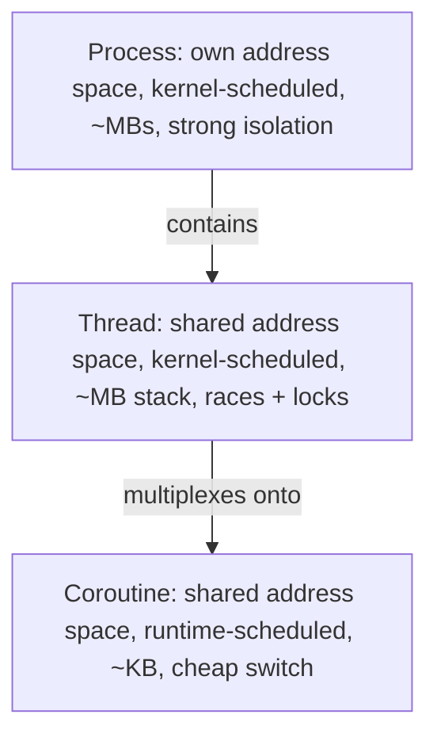
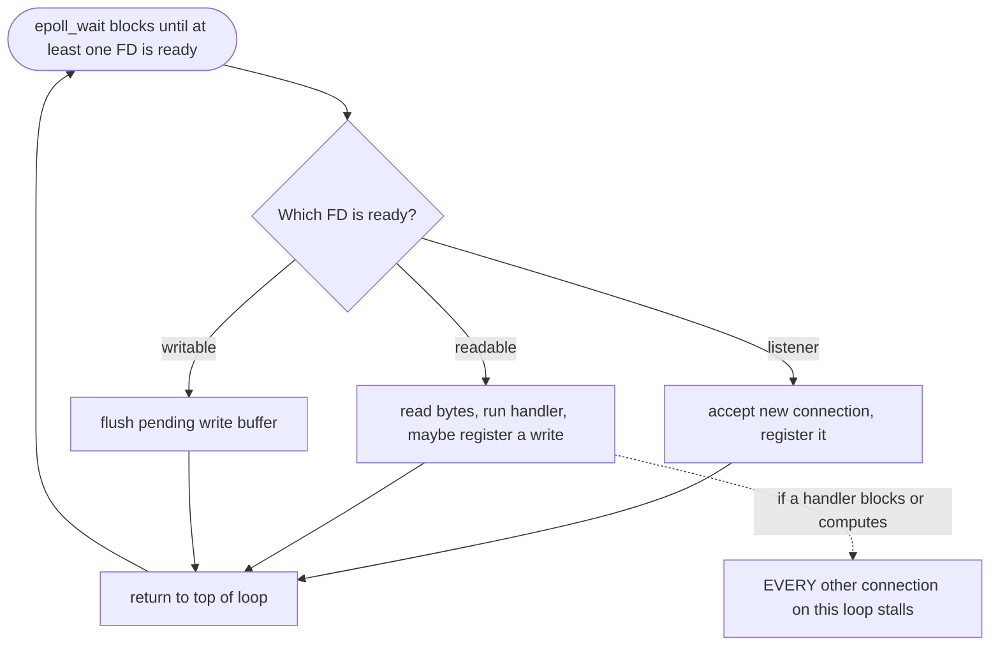
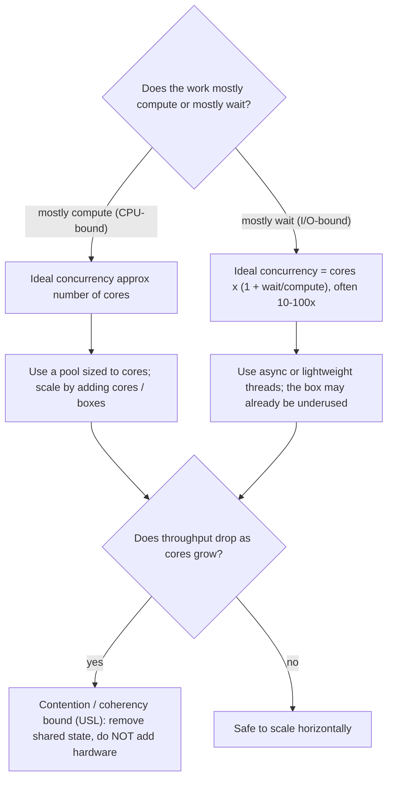
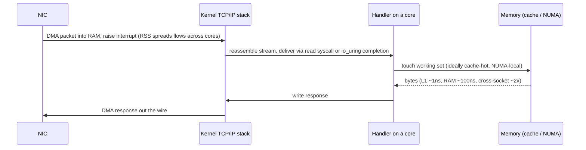

# Compute, Concurrency & the Machine

> Where this fits: before you can size a fleet, design a load balancer policy, or argue about microservices, you need a felt sense of what *one box* can actually do per second. This is the floor everything else is built on.
>
> **Principal-level takeaway:** A server's throughput is not a single number — it is set by whichever resource saturates first (CPU, memory bandwidth, the NIC, or a lock), and the dominant cost in modern services is *waiting*, not computing. Capacity planning is the discipline of finding the bottleneck before production does, and of knowing whether your work is CPU-bound or I/O-bound *before* you pick a concurrency model.

---

## ⚡ 60-Second TL;DR

- **Per-box physics**: throughput is set by whichever resource saturates first (CPU, memory bandwidth, NIC, or a lock) — never one magic RPS number.
- **CPU-bound vs I/O-bound** is the master question: CPU work scales with cores; I/O work mostly *waits*, so pile on concurrency. Sizing: **threads ≈ cores × (1 + wait/compute)**.
- **Concurrency units**, isolation → density: **process** (MBs) > **thread** (~MB, µs switch, races) > **coroutine** (KBs, ns switch, millions/box).
- **Three camps**: thread-per-request (simple, caps at ~thousands), async event loop (KB/conn, but *blocking a callback stalls everyone*), lightweight threads (Go/Loom — async density, blocking-style code).
- **#1 trap**: more cores/threads can make you *slower* — **USL's κ (N²) coherency term**; fix by removing shared state, not adding hardware.
- **Numbers**: DC round-trip ~0.5 ms ≈ 5,000× a RAM read; cache line = 64 B (false sharing); watch **p99/p99.9** (GC tail), not the mean.

**Remember one thing:** Name the bottleneck before you optimize — high CPU utilization is not the same as useful work, and the resource that saturates first is rarely the one you assumed.

## The Mental Model — first principles

A server is a machine that takes requests in and pushes responses out. Between those two events it does some mix of two things: it *computes* (burns CPU cycles transforming data) and it *waits* (for a disk, a database, another service, the network). Almost every interesting question in this chapter reduces to one observation:

> **In a typical web service, the CPU spends most of its time idle, waiting on I/O.** The art of server concurrency is keeping the machine busy with *other* work during those waits — without paying more to coordinate that work than the work itself is worth.

Why does this matter for high-level design? Because capacity numbers in interviews and design docs are usually *guessed* ("a server can do 10,000 RPS"). A principal engineer instead reasons: *what is one request's CPU cost, what does it wait on, how many can be in flight at once, and which resource runs out first?* That turns a guess into an estimate you can defend. (The arithmetic of turning these into a fleet size lives in [Back-of-the-Envelope](04-capacity-estimation.md); this chapter gives you the per-box physics that feeds it.)

To reason about a box, you need a rough cost hierarchy. Here is Jeff Dean's "latency numbers every engineer should know," updated to modern hardware (circa 2020s, order-of-magnitude):

| Operation | Time | In "human" scale (×1e9) |
|---|---|---|
| L1 cache reference | ~1 ns | 1 second |
| Branch mispredict | ~3 ns | 3 seconds |
| L2 cache reference | ~4 ns | 4 seconds |
| Mutex lock/unlock (uncontended) | ~17 ns | 17 seconds |
| Main memory (RAM) reference | ~100 ns | ~1.7 minutes |
| Context switch (thread) | ~1–5 µs | ~17 min – 1.4 hr |
| SSD random read (4 KB) | ~16 µs | ~4.5 hours |
| Read 1 MB sequentially from RAM | ~50 µs | ~14 hours |
| Read 1 MB sequentially from NVMe SSD | ~0.3 ms | ~3.5 days |
| Round trip within a datacenter | ~0.5 ms | ~5.8 days |
| Read 1 MB sequentially from SATA SSD | ~1 ms | ~11.6 days |
| Disk seek (spinning) | ~5–10 ms | ~2–4 months |
| Round trip CA → Netherlands → CA | ~150 ms | ~5 years |

The single most important takeaway from this table: **a network round trip inside a datacenter (~0.5 ms) is ~5,000× slower than a main-memory access, and an inter-region round trip is another ~300× slower than that.** If a request makes a database call, the CPU could have executed *millions* of instructions in the time it waits. That gap is the entire reason async/event-loop architectures exist.

---

## Core Concepts

### Processes, threads, and coroutines: three units of concurrency

A **process** is an OS-managed unit with its own virtual address space, file descriptor table, and memory protection. Isolation is strong (a crash or memory corruption in one process can't touch another), but that isolation costs: creating a process is expensive, and communication requires IPC (pipes, sockets, shared memory). A modern Linux process is a few MB of resident overhead minimum.

A **thread** lives inside a process and shares its address space and file descriptors with sibling threads. The kernel schedules threads (a "1:1" or kernel thread model on Linux via `clone()`). Threads are cheaper than processes but not free: each needs a stack (default ~1–8 MB of *virtual* address space on Linux, though only touched pages are resident), plus kernel bookkeeping. The shared address space is the double-edged sword — cheap communication, but you now own data races and need locks.

A **coroutine** (a.k.a. green thread, fiber, goroutine, virtual thread) is a *user-space* unit of execution. The language runtime, not the kernel, decides when to switch between them. A coroutine "yield" is a function call and a stack swap — tens of nanoseconds — versus a kernel context switch in the microseconds. Goroutines start with an ~8 KB stack that grows on demand; you can have *millions* of them on one box. The catch: the runtime must cooperate with the OS to avoid blocking a whole kernel thread when one coroutine does I/O (more below).



The nesting is the whole story: each level *contains and is cheaper than* the one above it, trading isolation for density. A process can hold many threads; the language runtime can multiplex thousands of coroutines onto a handful of threads. As you move down, switch cost falls from microseconds (kernel) to nanoseconds (user-space) and per-unit memory falls from megabytes to kilobytes — which is exactly why the units at the bottom let you keep a box busy through I/O waits without paying the scheduler tax.

### The cost of a context switch

When the kernel switches from thread A to thread B it must: save A's registers, load B's registers, switch the page-table base (only if a different process, which also flushes the TLB), and update scheduler bookkeeping. The *direct* cost is ~1–5 µs. The *indirect* cost is usually larger and invisible: B's working set is cold in the CPU caches, so the next several thousand memory accesses miss into L2/L3/RAM. A switch that pollutes the cache can effectively cost tens of microseconds of degraded throughput.

This is why "just spawn a thread per request and let the OS sort it out" stops scaling. At 10,000 threads, the scheduler thrashes: threads spend more time being switched in and out (and rewarming caches) than doing work. The CPU is busy, but busy *coordinating*, not *serving*.

### C10K and C10M: the problem that shaped modern servers

In 1999 Dan Kegel posed the **C10K problem**: how do you serve 10,000 *concurrent* connections on one machine? With one thread per connection and the old `select()`/`poll()` APIs, you can't — `select` is O(n) in the number of FDs *per call*, and 10K threads thrash the scheduler. The fixes that emerged are exactly the building blocks below: O(1) event notification (`epoll`/`kqueue`) and concurrency models that decouple "connections in flight" from "kernel threads."

A decade later, **C10M** (Robert Graham, ~2013) raised the bar to 10 *million* connections, and the answer turned out to require going *around* the kernel for the hottest paths: kernel-bypass networking (DPDK), user-space TCP stacks, and tight control over cores and memory. C10M is specialist territory (load balancers, packet processors), but the lesson generalizes: **past a certain scale the OS itself is the bottleneck, and you optimize by doing less per packet/request, not by adding hardware.**

### Blocking vs non-blocking I/O, and the event loop

A **blocking** read parks the calling thread until data arrives. Simple to reason about, but one thread is consumed per in-flight operation. A **non-blocking** socket returns immediately with `EWOULDBLOCK` if there's no data, so one thread can manage many sockets — but now *you* must track which sockets are ready.

That's what **readiness notification** APIs do. The old `select`/`poll` hand the kernel the full FD set on every call (O(n)). **`epoll`** (Linux) and **`kqueue`** (BSD/macOS) flip this: you register interest once, and the kernel hands you back *only the ready FDs* — effectively O(ready), not O(total). This is the core enabler of C10K. An **event loop** is the pattern built on top:

```
loop forever:
    ready = epoll_wait(epfd)        # blocks until ≥1 FD is ready, returns only those
    for fd in ready:
        if fd is listener:  accept new connection, register it
        if fd readable:     read, run handler, maybe register a write
        if fd writable:     write pending buffer
```

As a state/flow diagram, the loop and its one fatal failure mode look like this:



One thread, one loop, thousands of connections — *as long as each handler is short and never blocks.* The fatal sin in an event loop is doing slow synchronous work (a CPU-heavy hash, a blocking DB driver) inside a callback: it stalls *every* other connection on that loop (the dashed edge above). This is the "don't block the event loop" rule in Node.js.

**`io_uring`** (Linux 5.1+, 2019) is the next step. `epoll` tells you a socket is *ready*; you still issue the actual `read`/`write` syscall yourself. `io_uring` is *completion-based*: you submit operations into a shared ring buffer and the kernel posts results into a completion ring — batching many operations per syscall, and supporting disk I/O (which `epoll` never handled well). At high request rates the syscall savings are real (often 2–3× on I/O-heavy microbenchmarks). The trade-off: it's newer, has had a rocky security history (several distros restrict it), and the programming model is harder.

### Thread-per-request vs async: the two camps

| Model | What it is | Examples |
|---|---|---|
| **Thread-per-request** | One OS thread blocks through the whole request. | Classic Java servlets, Apache prefork, Ruby/Rails (Puma), most PHP-FPM |
| **Async / event loop** | One thread juggles many requests via callbacks/promises; never blocks. | Node.js, Nginx, Netty, Python asyncio, Rust Tokio |
| **Lightweight threads** | The runtime presents a *blocking* programming model but multiplexes coroutines onto a few OS threads under the hood. | Go goroutines, Java virtual threads (Project Loom, JDK 21), Erlang processes |

The async camp is memory-efficient and avoids context-switch overhead, but it's "viral": every library in the call chain must be non-blocking, and the code is harder to read (callback hell, or `async`/`await` everywhere). The thread-per-request camp is dead simple to write and debug (a real stack trace! a debugger that works!) but caps out at thousands of threads.

The lightweight-thread model is the modern synthesis: you write straightforward *blocking-style* code, and the runtime transparently parks the cheap coroutine (not the OS thread) when it hits I/O. **Go's runtime** schedules goroutines onto a pool of OS threads (the GMP scheduler); when a goroutine makes a blocking syscall, the runtime can detach the OS thread and run other goroutines on a fresh one. **Java's virtual threads** (Loom, 2023) do the same for the JVM — a `Thread.sleep` or socket read *unmounts* the virtual thread from its carrier thread instead of blocking it. This is arguably the biggest server-side concurrency shift of the last decade: it makes "millions of cheap threads" the default without forcing the async-coloring tax on your codebase.

### CPU-bound vs I/O-bound: the question that drives everything

This single distinction dictates your concurrency model, your core count, and your scaling strategy.

- **CPU-bound** work (image transcoding, compression, ML inference, JSON parsing at scale, crypto) keeps a core *busy*. Adding more concurrent tasks than you have cores does **not** help — it just adds context-switch overhead. Scale by adding cores/boxes; the ideal concurrency ≈ number of cores.
- **I/O-bound** work (a request that mostly waits on a DB or downstream service) leaves the core *idle* during waits. Here, concurrency far exceeding the core count is exactly right, because while one task waits, another can use the CPU. This is where async and lightweight threads shine.

A rule of thumb for thread pool sizing (Little's Law in disguise):

```
optimal_threads ≈ num_cores × (1 + wait_time / compute_time)
```

For pure CPU work (wait=0): threads ≈ cores. For a handler that computes 1 ms and waits 9 ms on a DB: threads ≈ cores × 10. Getting this number wrong is one of the most common production capacity bugs — a thread pool sized for CPU work will leave I/O-bound services running at 10% utilization while requests queue.

The whole decision — model, concurrency level, and how to scale — falls out of one question asked at the top:



#### Bounding concurrency: the worker pool

The most common way to put this chapter into code is a **bounded worker pool**: a fixed number of workers draining a queue of jobs. The bound *is* the concurrency-control knob from the rule of thumb above — set it to `cores` for CPU-bound work, or `cores × (1 + wait/compute)` for I/O-bound work. The anti-pattern to internalize is that **unbounded concurrency is the bug**: spawning one goroutine/thread per job with no ceiling looks fine in a load test and then, under a burst, opens 50,000 simultaneous database connections, exhausts file descriptors or memory, and takes down the very downstream you depend on. A pool turns an unbounded fan-out into a steady, predictable load.

**Bounded worker pool over a job queue**

In Go, a buffered channel doubles as the job queue, and a `sync.WaitGroup` lets the caller wait for completion. Concurrency is bounded simply by starting a fixed number of worker goroutines — there is never more in-flight work than there are workers.

```go
package main

import (
	"context"
	"fmt"
	"sync"
	"time"
)

// process is the per-job work. It returns an error as a value, the Go way.
func process(ctx context.Context, job int) (int, error) {
	select {
	case <-time.After(10 * time.Millisecond): // simulate an I/O wait
		return job * job, nil
	case <-ctx.Done():
		return 0, ctx.Err()
	}
}

func main() {
	const (
		numWorkers = 8   // THE bound: in-flight concurrency never exceeds this
		numJobs    = 100
	)

	ctx, cancel := context.WithTimeout(context.Background(), 5*time.Second)
	defer cancel()

	jobs := make(chan int, numJobs)    // buffered channel = the job queue
	results := make(chan int, numJobs) // collect results without blocking workers

	var wg sync.WaitGroup
	for w := 0; w < numWorkers; w++ {
		wg.Add(1)
		go func(id int) {
			defer wg.Done()
			for job := range jobs { // ranges until jobs is closed and drained
				r, err := process(ctx, job)
				if err != nil {
					fmt.Printf("worker %d: job %d failed: %v\n", id, job, err)
					continue
				}
				results <- r
			}
		}(w)
	}

	for j := 1; j <= numJobs; j++ {
		jobs <- j
	}
	close(jobs) // signal workers: no more jobs, drain and exit

	go func() { wg.Wait(); close(results) }() // close results once all workers done

	sum := 0
	for r := range results {
		sum += r
	}
	fmt.Println("sum of results:", sum)
}
```

In Java, a fixed-size `ExecutorService` is the pool and its internal queue is the job queue; the pool size is the bound. With JDK 21+ virtual threads you would instead create one virtual thread per job, but you *still* bound real concurrency with a `Semaphore` — otherwise you reintroduce the unbounded-fan-out bug. Both idioms are shown.

```java
import java.util.ArrayList;
import java.util.List;
import java.util.concurrent.*;

public class WorkerPool {

    // The per-job work. Throws checked exceptions, which Future surfaces.
    static int process(int job) throws InterruptedException {
        Thread.sleep(10); // simulate an I/O wait
        return job * job;
    }

    public static void main(String[] args) throws Exception {
        final int numWorkers = 8;   // THE bound: pool never runs more than this at once
        final int numJobs = 100;

        // Idiom A: a fixed thread pool. The pool size IS the concurrency bound.
        ExecutorService pool = Executors.newFixedThreadPool(numWorkers);
        List<Future<Integer>> futures = new ArrayList<>();
        for (int j = 1; j <= numJobs; j++) {
            final int job = j;
            futures.add(pool.submit(() -> process(job)));
        }
        long sum = 0;
        for (Future<Integer> f : futures) {
            sum += f.get(); // blocks for each result; propagates failures
        }
        pool.shutdown();
        pool.awaitTermination(5, TimeUnit.SECONDS);
        System.out.println("sum of results: " + sum);

        // Idiom B (JDK 21+): one virtual thread per job, but STILL bounded.
        // A Semaphore caps real concurrency so we don't hammer the downstream.
        Semaphore limit = new Semaphore(numWorkers);
        try (ExecutorService vt = Executors.newVirtualThreadPerTaskExecutor()) {
            List<Future<Integer>> vfutures = new ArrayList<>();
            for (int j = 1; j <= numJobs; j++) {
                final int job = j;
                vfutures.add(vt.submit(() -> {
                    limit.acquire();          // bound the fan-out, not the thread count
                    try { return process(job); }
                    finally { limit.release(); }
                }));
            }
            long vsum = 0;
            for (Future<Integer> f : vfutures) vsum += f.get();
            System.out.println("sum of results (virtual threads): " + vsum);
        }
    }
}
```

The bug to avoid in both languages is the same shape. In Go it is `for j := range jobs { go process(ctx, j) }` with no worker ceiling; in Java it is submitting to an *unbounded* `Executors.newCachedThreadPool()` or launching a raw virtual thread per job with no `Semaphore`. Each spawns work as fast as jobs arrive, so a burst of a million jobs means a million concurrent operations — and the resource that saturates first (DB connections, FDs, memory, the downstream) is what pages you at 3 a.m. The fix is always a bound, chosen from the rule of thumb, not from optimism.

### Amdahl's Law vs the Universal Scalability Law

Everyone learns **Amdahl's Law**: if a fraction *p* of work is parallelizable, the max speedup from *N* processors is `1 / ((1-p) + p/N)`. The lesson: the serial fraction caps you. If 5% is serial, you can never go faster than 20× no matter how many cores you throw at it.

But Amdahl is *optimistic* for real systems, because it ignores **coordination cost**. Neil Gunther's **Universal Scalability Law (USL)** adds a second penalty term:

```
Speedup(N) = N / (1 + σ(N−1) + κ·N(N−1))
                       │              │
              contention (σ):     coherency (κ):
              serial/queueing     cross-talk cost
              (Amdahl's term)     (cache sync, locks)
```

The killer term is **κ (coherency)**: the `N²` growth. When cores must *agree* on shared state — invalidating each other's cache lines, bouncing a hot lock — the cost grows with the number of *pairs* of cores, not the number of cores. The practical consequence is brutal and counter-intuitive: **adding cores can make a system slower.** USL curves rise, peak, and then *come back down*. A junior assumes more hardware always helps. A principal knows there's an optimal concurrency level, past which you're paying to make cores fight over a cache line. The fix is almost always to *remove* the shared state (sharding, per-core data structures, lock-free designs), not to add hardware.

### NUMA, cache lines, and false sharing

Modern multi-socket servers are **NUMA** (Non-Uniform Memory Access): each CPU socket has its own attached RAM. Accessing your *local* socket's memory is fast (~100 ns); reaching *across* the interconnect to the other socket's memory is noticeably slower (often 1.5–2×). High-performance systems pin threads and their data to the same NUMA node. Get this wrong and a "fast" in-memory cache silently runs at half speed.

Within a core, memory moves in **cache lines** (64 bytes on x86). **False sharing** is the classic trap: two threads update two *different* variables that happen to sit in the *same* cache line. Each write invalidates the other core's copy of the line, so the cores ping-pong the line across the interconnect even though they never touch the same data. The fix is padding hot per-thread variables onto separate cache lines (`@Contended` in Java, `#[repr(align(64))]` in Rust). This is exactly the κ term of USL made physical — coordination you didn't ask for.

### How one box uses cores, memory, and the NIC

Picture a single request's journey through the hardware:

1. A packet arrives at the **NIC**. The NIC DMAs it into RAM and raises an interrupt (modern NICs use **RSS** to spread flows across cores, and interrupt coalescing to avoid drowning in interrupts at high packet rates). A 25 GbE NIC can deliver millions of packets/sec — enough that *interrupt handling itself* becomes a CPU cost (the C10M concern).
2. The kernel TCP/IP stack reassembles the stream; your process reads it via a syscall (or `io_uring` completion).
3. Your handler runs on **some core**, touching **memory** (ideally hot in cache, ideally NUMA-local).
4. The response is written back down the stack and DMA'd out the NIC.



Each hop in that sequence is a candidate bottleneck, and they are not interchangeable. The bottleneck can be any of these: CPU (compute-bound handler), memory *bandwidth* (large copies saturate the memory bus before the CPU is busy), the NIC (line-rate streaming, video), or the kernel's per-packet overhead. **Principal skill: name the bottleneck before optimizing.** Doubling cores does nothing if you're NIC-bound.

### GC pauses and tail latency

Garbage-collected runtimes (JVM, Go, .NET, Node/V8) periodically reclaim memory. A "stop-the-world" pause freezes *all* application threads. Even modern low-latency collectors have costs: a "stop-the-world" full GC in a poorly tuned JVM can pause for **hundreds of milliseconds to seconds**; modern collectors (G1, ZGC, Shenandoah, Go's concurrent GC) push typical pauses into the sub-millisecond to low-single-digit-millisecond range — but at the cost of CPU overhead and throughput.

Why this matters for *design*: GC pauses are a primary driver of **tail latency** (p99/p99.9). Your average latency can look great while p99.9 spikes every time GC runs. In a fan-out architecture where one user request hits 100 services, the slowest of 100 responses dominates — so a 1-in-1000 GC pause on each backend means *most* user requests hit at least one pauser. This is Dean & Barroso's "**The Tail at Scale**": tail latency, not mean, is what users feel, and GC is a top contributor. It's why latency-critical systems sometimes choose non-GC languages (C++, Rust) or aggressively tune/avoid allocation.

---

## Trade-offs at a Glance

| Concurrency model | Memory/conn | Switch cost | Code simplicity | Best for | Watch out for |
|---|---|---|---|---|---|
| Process-per-request | High (MBs) | High (TLB flush) | Simple | Strong isolation, untrusted code | Doesn't scale past hundreds |
| Thread-per-request | ~MB stack | ~1–5 µs | Simple, real stack traces | CPU-bound, ≤ few thousand conns | Scheduler thrash at 10K+ |
| Event loop (async) | ~KB/conn | ~0 (no switch) | Hard (callbacks, coloring) | I/O-bound, huge fan-in (Nginx, Node) | Blocking a callback stalls everyone |
| Lightweight threads | ~KB stack | ~ns (user-space) | Simple *and* scalable | I/O-bound at scale (Go, Loom, Erlang) | Runtime maturity, blocking C calls |

| Scaling question | If CPU-bound | If I/O-bound |
|---|---|---|
| Ideal concurrency | ≈ number of cores | cores × (1 + wait/compute), often 10–100× |
| How to scale | Add cores / boxes (horizontal) | Add concurrency first; box may already be underused |
| Right model | Thread/process pool sized to cores | Async or lightweight threads |
| Bottleneck risk | Core count, memory bandwidth | Connection limits, FD limits, downstream saturation |

---

## How Real Systems Do It

- **Nginx** is the canonical event-loop server: one worker process *per core*, each running an `epoll`/`kqueue` loop, all sharing the listening socket. This is why a single Nginx box handles tens of thousands of concurrent connections with a flat memory footprint — there's no per-connection thread. It deliberately offloads slow/blocking work (e.g., disk-heavy operations) to a thread pool so the event loop never stalls.
- **Node.js** runs your JavaScript on a single event-loop thread (V8 + libuv), but pushes blocking file I/O and DNS to a small background **thread pool** (default 4 threads, `UV_THREADPOOL_SIZE`). Great for I/O-bound APIs; a CPU-heavy request (e.g., synchronous JSON.parse of a huge payload, or bcrypt) blocks the loop and tanks every concurrent request — the textbook Node footgun.
- **Go** multiplexes goroutines over OS threads with its GMP scheduler and a concurrent, low-pause GC (sub-millisecond target pauses since ~Go 1.8). It's the default for I/O-heavy backend services (Kubernetes, Docker, most cloud control planes) precisely because cheap goroutines + a blocking-style API hit the sweet spot.
- **Java / JVM**: traditionally thread-per-request (Tomcat) or async via Netty (used by Cassandra, Elasticsearch, gRPC-Java). **Virtual threads** (Project Loom; preview in JDK 19/20, final in JDK 21, Sept 2023) now let you write blocking code that scales like async. Latency-sensitive JVM shops obsess over GC: LinkedIn, Twitter, and others have publicly tuned G1/ZGC to keep p99 pauses low.
- **Redis** is single-threaded *by design* for command execution — no locks, no coordination cost (that κ term is zero), and it still does ~100K+ ops/sec because the work is tiny in-memory operations and the bottleneck is the network, not the CPU. Redis 6 added multi-threaded *I/O* (reading/writing sockets) while keeping command execution single-threaded. A beautiful illustration that single-threaded can *beat* multi-threaded when coordination cost would dominate.
- **Envoy / modern proxies** pin one worker thread per core, use thread-local stats and connection state to avoid cross-core sharing (minimizing the κ/false-sharing penalty), and lean on `epoll`. This is USL-aware design: scale by sharding work across cores with as little shared mutable state as possible.

---

## Failure Modes & Common Misconceptions

**Myth: "A server can do 10,000 RPS."** RPS is meaningless without the per-request cost and what it waits on. A request that does 200 µs of CPU and nothing else → ~5,000 RPS *per core*. A request that waits 50 ms on a DB → throughput is bounded by concurrency and the downstream, not your CPU at all. Always decompose.

**Myth: "More threads = more throughput."** Past the optimal count (≈ cores for CPU work), more threads *reduce* throughput via context-switch overhead and cache thrashing. The USL curve goes *down*. Sizing thread pools too large is as harmful as too small.

**Myth: "Async is always faster than threads."** Async wins for I/O-bound, high-connection-count workloads. For CPU-bound work it adds complexity for no benefit — a single event loop has exactly one core's worth of compute. And modern lightweight threads (Go, Loom) often match async throughput with far simpler code.

**Myth: "Adding cores always helps."** Only until you hit the serial fraction (Amdahl) or coherency cost (USL). A hot lock or a shared counter can make 32 cores slower than 8. Profile for contention before scaling up.

**Production failure: blocking the event loop.** One synchronous `crypto.pbkdf2Sync`, a giant regex (ReDoS), or a blocking DB driver inside a Node/Nginx callback freezes *all* concurrent requests. Symptom: latency for *every* request spikes in lockstep, not just the slow one.

**Production failure: thread pool exhaustion.** All threads blocked waiting on a slow downstream → new requests queue → timeouts cascade → the classic *retry storm* makes it worse. (See [Reliability](../02-distributed-systems/16-reliability-and-failure.md) for bulkheads and circuit breakers, the standard defenses.)

**Production failure: GC-driven tail latency.** Mean latency fine, p99.9 periodically spikes to hundreds of ms. Caused by stop-the-world pauses; amplified by fan-out. Diagnosed by correlating latency spikes with GC logs.

**Misconception: "the CPU is at 100%, so we need more CPUs."** Maybe — or maybe a busy-loop, lock spinning, or you're memory-bandwidth-bound and the CPU is "busy" stalling on RAM. High CPU *utilization* is not the same as high *useful work*.

---

## In a Design Discussion

When you're whiteboarding and someone says "we'll need N servers," the principal move is to ground that number in per-box physics rather than a round number.

**Junior take:** *"We have 100K RPS, a server does 10K RPS, so we need 10 servers (plus a couple for headroom)."*

**Principal take:** *"What does one request actually cost? Say it's ~1 ms of CPU and a ~20 ms wait on the database. That's I/O-bound — so per box, throughput is gated by concurrency and the DB, not raw CPU. With, say, 8 cores and ~21× wait/compute ratio, one box can hold ~170 in-flight requests; at 21 ms each that's ~8K RPS per box if the DB keeps up. But the DB almost certainly saturates first — so the real conversation is the data tier, not the app tier. Also: are we GC'd? Then I want to see p99, not mean, and I'll budget for tail amplification across our fan-out. And before we add boxes, I want to confirm we're not contention-bound on a shared lock or hot cache key, because that won't scale horizontally."*

Notice what the principal did: identified CPU-bound vs I/O-bound, found the *real* bottleneck (the DB, not the app servers), flagged tail latency as the metric that matters, and checked for coordination cost before reaching for more hardware. The number "10 servers" might still be right — but now it's defended, and the team's attention is on the thing that will actually break.

The other reflex: **state your bottleneck hypothesis out loud and say how you'd verify it.** "I think we're I/O-bound on the database; I'd confirm with CPU utilization sitting low while latency is high." That's the difference between guessing and engineering.

---

## Self-Check

<details>
<summary>1. A handler does 2 ms of CPU work and waits 18 ms on a downstream. On an 8-core box, roughly how many threads should the pool have, and what's the rough max RPS?</summary>

Threads ≈ cores × (1 + wait/compute) = 8 × (1 + 18/2) = 8 × 10 = **80 threads**. Each request takes ~20 ms wall-clock, so 80 in flight ÷ 20 ms ≈ **4,000 RPS** — *if* the downstream can absorb it. The downstream is the likely real ceiling.
</details>

<details>
<summary>2. Why can adding CPU cores make a system slower? Which law predicts this and Amdahl does not?</summary>

The **Universal Scalability Law's** coherency term (κ): when cores must synchronize on shared state (cache-line invalidation, a hot lock), cost grows as N². Past an optimal point, more cores spend more time coordinating than working, so total throughput *declines*. Amdahl only models the serial fraction and never predicts negative returns.
</details>

<details>
<summary>3. What's the difference between epoll and io_uring?</summary>

`epoll` is **readiness-based**: it tells you a socket is ready, then *you* make the read/write syscall. `io_uring` is **completion-based**: you submit operations into a shared ring and the kernel posts results back, batching many ops per syscall and supporting disk I/O. `io_uring` reduces syscall overhead at high rates but is newer with a harder model and a checkered security history.
</details>

<details>
<summary>4. You add a per-thread counter array `int counts[NUM_THREADS]` and throughput gets *worse* with more threads. What's happening?</summary>

**False sharing.** The counters sit within the same 64-byte cache line, so each thread's write invalidates the others' cached copy, ping-ponging the line across cores. Pad each counter onto its own cache line to fix it. This is USL's coherency cost made physical.
</details>

<details>
<summary>5. Why is Redis single-threaded for command execution, and why is that not a bottleneck?</summary>

Single-threaded execution means **zero coordination cost** — no locks, no cache-line contention (κ = 0). Each command is a tiny in-memory operation, so the bottleneck is the network/syscall overhead, not CPU. Redis 6 added multi-threaded socket I/O while keeping execution single-threaded to preserve that simplicity.
</details>

<details>
<summary>6. Mean latency is 5 ms but p99.9 is 300 ms on a GC'd service. What's the likely cause, and why does it matter more in a fan-out architecture?</summary>

Stop-the-world **GC pauses** are the classic cause of periodic tail spikes. In a fan-out where one user request hits many backends, the user waits on the *slowest* response (tail at scale). A 1-in-1000 pause per backend means most user requests hit at least one pauser — so the rare backend pause becomes the common user experience.
</details>

<details>
<summary>7. What is the single sin you must never commit inside a Node.js or Nginx callback, and why?</summary>

**Blocking synchronous work** (CPU-heavy compute, a synchronous/blocking I/O call). The event loop is one thread; blocking it stalls *every* concurrent connection, not just the one doing the work. Symptom: all requests' latency spikes together.
</details>

<details>
<summary>8. For a pure image-transcoding service (CPU-bound), should you use an async event loop? Why or why not?</summary>

No benefit. A single event loop is one core's worth of compute; async helps only when work *waits*. For CPU-bound work, use a worker pool sized to the core count and scale horizontally. Async would add complexity for zero throughput gain.
</details>

---

## Go Deeper

- **Designing Data-Intensive Applications (Kleppmann)** — Ch. 1 (reliability/scalability, percentiles & tail latency, "load parameters") directly underpins this chapter; Ch. 3 connects to how storage engines spend CPU vs I/O (see [Storage Engines](03-storage-engines.md)).
- **"The Tail at Scale"** — Dean & Barroso, CACM 2013. The definitive treatment of why tail latency dominates in fan-out systems and the role of GC/contention.
- **"The C10K problem"** — Dan Kegel's original write-up; still the clearest explanation of why event-driven I/O exists.
- **Universal Scalability Law** — Neil Gunther, *Guerrilla Capacity Planning*; Baron Schwartz's "Practical Scalability Analysis with the USL" (VividCortex) is a gentler intro.
- **"What every programmer should know about memory"** — Ulrich Drepper. Deep on cache lines, NUMA, false sharing.
- **Brendan Gregg, *Systems Performance*** — the reference for finding the actual bottleneck (USE method: Utilization, Saturation, Errors) on a real box.
- **The Linux `io_uring` docs & Jens Axboe's "Efficient IO with io_uring"** — for the completion-based model.
- **Project Loom (JEP 444, Virtual Threads)** and **Go's scheduler design docs** — for the lightweight-threads model in practice.

**Sibling writeups:** apply this to fleet sizing in [Back-of-the-Envelope](04-capacity-estimation.md); the I/O costs here feed [Storage Engines](03-storage-engines.md); per-box limits set what you spread across in [Load Balancing](../01-building-blocks/05-load-balancing.md) and [Partitioning & Sharding](../01-building-blocks/10-partitioning-sharding.md); tail latency and pool exhaustion connect to [Reliability](../02-distributed-systems/16-reliability-and-failure.md) and [Observability](../03-architecture-and-apis/19-observability.md). Back to the [root index](../README.md) and the [roadmap](../ROADMAP.md).
