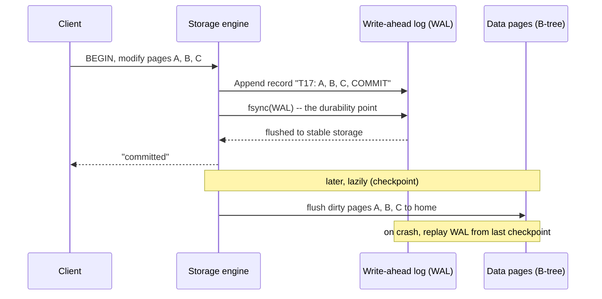
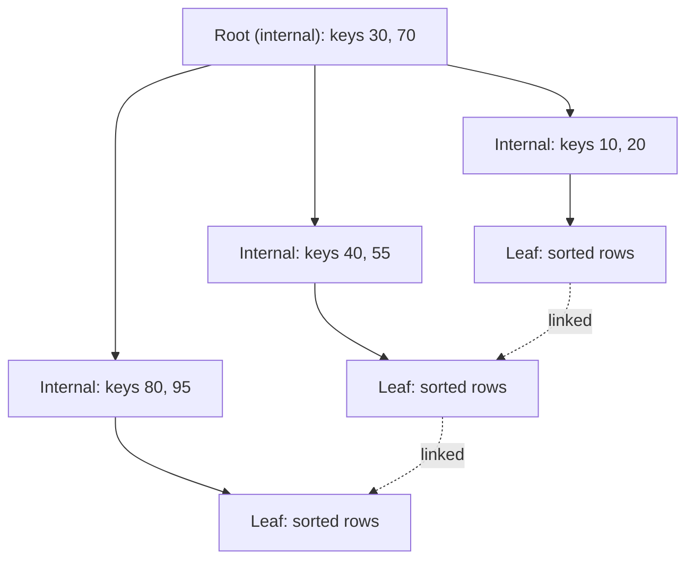
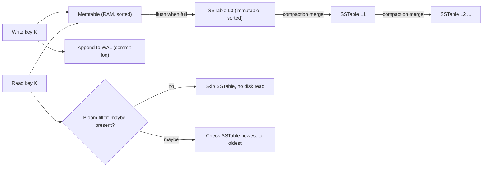
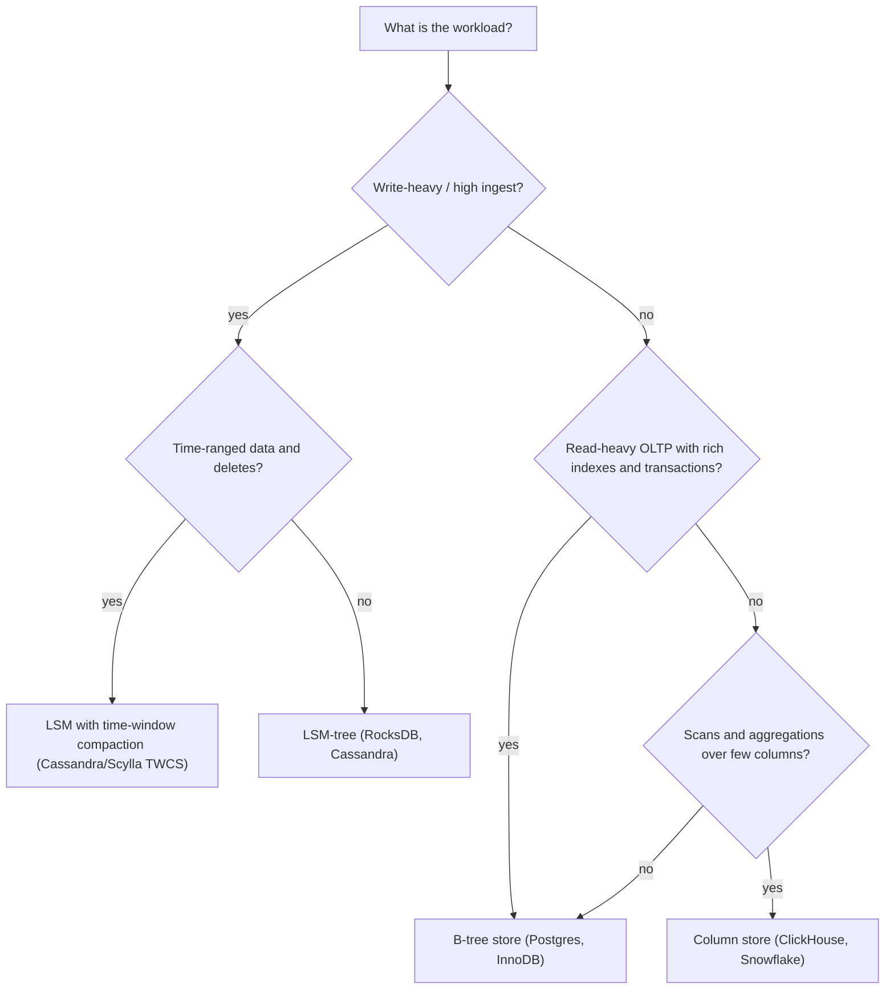

# Storage Engines: How Databases Actually Store Data

> Where this fits: every database, queue, and key-value store you will ever design around sits on top of a *storage engine* — the layer that turns logical rows into bytes on a physical device. ([root index](../README.md) · [roadmap](../ROADMAP.md))
>
> **Principal-level takeaway:** A database is mostly its storage engine. Once you know whether it uses a B-tree or an LSM-tree and how it reaches durability, you can predict its read/write/space amplification, its tail-latency shape, and the workloads it will be good or terrible at — *before* you run a single benchmark.

## ⚡ 60-Second TL;DR

- **Storage engine** = the layer turning logical rows into bytes on disk; it dictates a DB's speed, not the brand name.
- **WAL** (write-ahead log): sequential `fsync`'d append before touching data → cheap durable commits + crash replay; every durable system has one.
- **B-tree**: update-in-place, **low read amp**, great range scans, OLTP (Postgres, InnoDB). **LSM-tree**: append-only + compaction, **low write amp**, high ingest, spiky p99 (RocksDB, Cassandra).
- **Row vs column store**: rows = OLTP point access; columns = OLAP scans, **5–20× compression**.
- **#1 trap**: `write()` is *not* durable (page cache, volatile) — only `fsync` is; and "fast" is meaningless without naming the operation + percentile.
- **Rule of thumb**: **RUM** — you can't minimize read, write, *and* space amplification at once; pick a point. N indexes ≈ writing the row N+1×.

**Remember one thing:** Match the engine's *cheap* operation to your workload's hot path — characterize read/write ratio, access pattern, and retention, then map onto the amplification triangle.

## The Mental Model — first principles: why does this thing exist?

Strip away SQL, replication, and query planners, and every database faces the same brutal physical fact: **persistent storage is slow, fails in chunks, and likes some access patterns far more than others.** The storage engine is the code that mediates between "I want to store and retrieve records" and "I have a device that reads and writes blocks." Everything interesting about a database's performance is a consequence of how it resolves that tension.

The problem decomposes into three sub-problems, and you should hold all three in your head at once:

1. **Durability** — if I tell the client "committed," that data must survive a power loss *one millisecond later*. The hardware gives us no atomic "save my record" primitive; we have to build one.
2. **Layout** — how do I arrange bytes so the queries I care about touch as little of the disk as possible? Random access to spinning disks and even SSDs is expensive; sequential access is cheap. Layout is the difference between a 5 ms query and a 5 second one.
3. **Mutation** — data changes. The disk hardware *hates* in-place mutation (especially SSDs). So do I overwrite in place, or append and clean up later? That single choice — update-in-place vs. log-structured — is the great fork in storage-engine design, and it produces B-trees on one branch and LSM-trees on the other.

If you understand the hardware (next section) and you understand that fork, you understand 80% of why DynamoDB, Postgres, Cassandra, RocksDB, and Kafka behave the way they do.

## Core Concepts

### Disks vs. SSDs: the physics that dictates everything above

You cannot reason about a storage engine without a feel for the device underneath. Round numbers worth memorizing:

| Device | Random read latency | Sequential throughput | Random IOPS | Notes |
|---|---|---|---|---|
| HDD (7200 rpm) | ~5–10 ms (seek + rotation) | ~150–250 MB/s | ~100–200 | Random is ~1000× slower than sequential |
| SATA SSD | ~50–150 µs | ~500 MB/s | ~50k–100k | Erase-before-write, wears out |
| NVMe SSD | ~10–100 µs | ~3–7 GB/s | 500k–1M+ | Deep queues, parallel channels |

The single most important consequence: **on an HDD, a random 4 KB read costs roughly the same as reading a megabyte sequentially.** The arm has to physically move. This is why classic database design is obsessed with sequential I/O and large blocks. SSDs narrow the random/sequential gap enormously, but they do *not* close it, and they introduce a new problem of their own.

**Write amplification and wear (SSDs).** An SSD cannot overwrite a byte in place. It reads, erases, and rewrites at the granularity of an *erase block* (often 256 KB–4 MB), even though it reads/writes at the *page* granularity (4–16 KB). A flash cell tolerates a finite number of program/erase cycles (~1k–3k for consumer TLC, more for enterprise). So the drive runs a *Flash Translation Layer* (FTL) that remaps logical blocks to physical pages and does garbage collection in the background. The result: writing 4 KB from your application can cause the drive to physically write far more than 4 KB — that ratio is **write amplification**. High, churny random writes burn through endurance and trigger GC stalls that show up as latency spikes. This is *device-level* amplification, and it stacks on top of the *software-level* amplification your storage engine adds. Keep them mentally separate; they multiply.

The practical lesson principals carry: **sequential, batched, append-only writes are kind to SSDs.** That single fact is half the argument for LSM-trees.

### The page cache, fsync, and what "durable" actually means

When your process writes to a file, the bytes do **not** go to the device. They land in the OS **page cache** — RAM the kernel uses to buffer file data. The `write()` syscall returns as soon as the bytes are in that cache. This is fast and a lie: the data is not durable. A power loss now loses it.

`fsync(fd)` (and `fdatasync`) is the syscall that says "block until the kernel has actually flushed this file's dirty pages to the device's *stable* storage." Only after a successful `fsync` can you honestly tell a client "committed." This is the durability boundary, and it is shockingly subtle in production:

- An `fsync` costs anywhere from ~0.1 ms (fast NVMe with power-loss-protected cache) to **several milliseconds** (consumer SSD, or HDD). It is often the dominant cost of a small transaction.
- Many drives have a volatile **write cache**; an `fsync` that doesn't reach through it (misconfigured drive, lying firmware — historically common) reports success while data sits in volatile RAM. The 2018 "fsyncgate" episode in Postgres revealed that on some kernels, an `fsync` *failure* could be reported once and then the dirty page silently dropped, so a retried `fsync` returned success while data was lost. The fix changed Postgres to **panic** on `fsync` failure rather than risk it. The lesson: durability is a contract with the OS *and* the firmware, and the contract has had bugs.

This is why batching matters. If you `fsync` once per transaction you are seek/flush-bound; if you can **group-commit** many transactions into one `fsync`, throughput rises by an order of magnitude at the cost of a little latency. Nearly every serious engine does group commit.

### The Write-Ahead Log (WAL): why every durable system has one

Here is the core dilemma. Your real data structure (a B-tree, say) is spread across many pages all over the disk. A single transaction might need to modify three of them. You cannot update three random pages *atomically* — a crash in the middle leaves a half-applied, corrupt structure. And updating them in place involves random I/O, which is slow.

The universal answer is the **write-ahead log**: before touching the real data structure, **append a record of the change to a sequential log and `fsync` that log.** Only then is the transaction durable. The actual data pages can be updated later, lazily, in the background.



Read the sequence as six steps: (1) the transaction wants to change pages A, B, C; (2) the engine appends one record — `"T17: A=..., B=..., C=..., COMMIT"` — to the WAL as a single sequential write; (3) it calls `fsync(WAL)`, the durability point; (4) only now does it return "committed" to the client; (5) later, lazily, it flushes the dirty pages A, B, C to their real homes (a checkpoint); (6) on crash, it replays the WAL forward from the last checkpoint to reconstruct any lost in-flight changes.

Why this is a brilliant trade:
- **One sequential `fsync` replaces several random ones.** The expensive, durability-critical write is now an append.
- **Crash recovery becomes a replay.** On restart, replay the WAL forward from the last checkpoint; the log *is* the source of truth for recent changes (this is the *redo* log; engines also keep *undo* info to roll back uncommitted transactions). This algorithm, in full generality, is **ARIES**.
- It cleanly separates *durability* (log it now) from *layout maintenance* (organize the data later).

Once you internalize the WAL, you'll see it everywhere and under many names: Postgres's WAL, MySQL/InnoDB's redo log, SQLite's WAL mode, the **commit log** in Cassandra, the journal in a filesystem, the replication log in a distributed system (see [Replication](../01-building-blocks/09-replication.md)), and — taken to its logical extreme — **Kafka, where the log *is* the database**. A WAL is not an optimization bolted on; it is the foundational durability primitive.

> **Interactive:** [LSM-Tree vs B-Tree (interactive)](../animations/lsm-vs-btree.html) -- watch how an append-only WAL feeds a memtable while a B-tree mutates pages in place; toggle the workload to write-heavy and watch the curves diverge.

**Example: WAL append-then-apply.** The skeleton below shows the contract — append a record, `fsync`, *then* apply to in-memory state — plus the recovery replay. Note the deliberate ordering: durability happens before the visible state change, so a crash between the two simply replays on restart.

```go
package wal

import (
	"bufio"
	"encoding/binary"
	"hash/crc32"
	"io"
	"os"
)

// Record is one logical change: set key = value.
type Record struct {
	Key   string
	Value string
}

type WAL struct {
	f *os.File
	w *bufio.Writer
}

func Open(path string) (*WAL, error) {
	f, err := os.OpenFile(path, os.O_CREATE|os.O_APPEND|os.O_RDWR, 0o644)
	if err != nil {
		return nil, err
	}
	return &WAL{f: f, w: bufio.NewWriter(f)}, nil
}

// Append writes [crc][keyLen][key][valLen][val] and forces it to stable
// storage. Only after fsync returns may the caller treat it as committed.
func (l *WAL) Append(r Record) error {
	var buf []byte
	buf = binary.AppendUvarint(buf, uint64(len(r.Key)))
	buf = append(buf, r.Key...)
	buf = binary.AppendUvarint(buf, uint64(len(r.Value)))
	buf = append(buf, r.Value...)

	crc := crc32.ChecksumIEEE(buf)
	if err := binary.Write(l.w, binary.LittleEndian, crc); err != nil {
		return err
	}
	if _, err := l.w.Write(buf); err != nil {
		return err
	}
	if err := l.w.Flush(); err != nil { // push bufio into the page cache
		return err
	}
	return l.f.Sync() // fsync: the durability point
}

// Replay reads the log forward and applies each record to apply().
// Called once on startup to rebuild in-memory state after a crash.
func (l *WAL) Replay(apply func(Record)) error {
	if _, err := l.f.Seek(0, 0); err != nil {
		return err
	}
	r := bufio.NewReader(l.f)
	for {
		var crc uint32
		if err := binary.Read(r, binary.LittleEndian, &crc); err != nil {
			return nil // clean EOF: end of valid records
		}
		key, err := readField(r)
		if err != nil {
			return nil // torn tail record: stop replay here
		}
		val, err := readField(r)
		if err != nil {
			return nil
		}
		body := append(append(binary.AppendUvarint(nil, uint64(len(key))), key...),
			append(binary.AppendUvarint(nil, uint64(len(val))), val...)...)
		if crc32.ChecksumIEEE(body) != crc {
			return nil // corruption: ignore from here on
		}
		apply(Record{Key: string(key), Value: string(val)})
	}
}

func readField(r *bufio.Reader) ([]byte, error) {
	n, err := binary.ReadUvarint(r)
	if err != nil {
		return nil, err
	}
	b := make([]byte, n)
	_, err = io.ReadFull(r, b)
	return b, err
}
```

```java
import java.io.*;
import java.nio.charset.StandardCharsets;
import java.nio.file.*;
import java.util.function.Consumer;
import java.util.zip.CRC32;

/** Minimal write-ahead log: append-then-fsync, replay on startup. */
public final class Wal implements Closeable {
    public record Record(String key, String value) {}

    private final RandomAccessFile raf;
    private final FileChannel channel;

    public Wal(Path path) throws IOException {
        this.raf = new RandomAccessFile(path.toFile(), "rw");
        this.channel = raf.getChannel();
        raf.seek(raf.length()); // append at end
    }

    /** Write [crc][keyLen][key][valLen][val], then force to disk. */
    public synchronized void append(Record r) throws IOException {
        byte[] body = encode(r);
        CRC32 crc = new CRC32();
        crc.update(body);

        ByteArrayOutputStream out = new ByteArrayOutputStream();
        DataOutputStream dos = new DataOutputStream(out);
        dos.writeInt((int) crc.getValue());
        dos.write(body);

        raf.write(out.toByteArray());
        channel.force(true); // fsync: the durability point
    }

    /** Replay forward, applying each surviving record. Run once at startup. */
    public void replay(Consumer<Record> apply) throws IOException {
        raf.seek(0);
        DataInputStream in = new DataInputStream(
                new BufferedInputStream(new FileInputStream(raf.getFD())));
        while (true) {
            int storedCrc;
            try {
                storedCrc = in.readInt();
            } catch (EOFException eof) {
                return; // clean end of log
            }
            try {
                String key = readField(in);
                String val = readField(in);
                byte[] body = encode(new Record(key, val));
                CRC32 crc = new CRC32();
                crc.update(body);
                if ((int) crc.getValue() != storedCrc) return; // corruption
                apply.accept(new Record(key, val));
            } catch (EOFException eof) {
                return; // torn tail record
            }
        }
    }

    private static byte[] encode(Record r) throws IOException {
        ByteArrayOutputStream out = new ByteArrayOutputStream();
        DataOutputStream dos = new DataOutputStream(out);
        byte[] k = r.key().getBytes(StandardCharsets.UTF_8);
        byte[] v = r.value().getBytes(StandardCharsets.UTF_8);
        dos.writeInt(k.length);
        dos.write(k);
        dos.writeInt(v.length);
        dos.write(v);
        return out.toByteArray();
    }

    private static String readField(DataInputStream in) throws IOException {
        int n = in.readInt();
        byte[] b = new byte[n];
        in.readFully(b);
        return new String(b, StandardCharsets.UTF_8);
    }

    @Override public void close() throws IOException { raf.close(); }
}
```

### B-trees and B+trees: read-optimized, update-in-place

The B-tree (Bayer & McCreight, circulated 1970, published 1972) is the workhorse under most relational databases. The B+tree variant — where all values live in the leaves and internal nodes hold only keys — is what's actually used.

The structure: a balanced tree of fixed-size **pages** (commonly 4–16 KB, matching disk/SSD blocks). Internal pages hold keys + pointers to children; leaf pages hold the actual rows (or row pointers), sorted by key. Leaves are typically linked left-to-right for efficient range scans.



Key properties:
- **High fan-out, shallow tree.** With ~8 KB pages and ~128-byte keys, a node points to dozens-to-hundreds of children. A tree of a few levels indexes billions of keys. **Point lookups are O(log n) page reads** — typically **3–4 disk reads** for a huge table, and the upper levels stay cached in RAM, so often just 1 physical read at the leaf.
- **Updates happen in place.** To change a row, you find its leaf page and rewrite it. This is great for reads (data is always in one sorted, balanced place) but means **random writes** to scattered pages.
- **Page splits.** Insert into a full page → split it into two and push a key up; this can cascade to the root. Splits cause fragmentation and extra writes.
- **The torn-write problem.** A B-tree page (say 8 KB) is larger than the device's atomic write unit (often 4 KB). A crash mid-write can leave a *half-written page* — corruption. The WAL fixes this: InnoDB uses a **doublewrite buffer** (write the page to a scratch area first, then to its home); Postgres writes **full-page images** to the WAL the first time a page is touched after a checkpoint. Note the cost: this *amplifies* WAL writes.

B-tree amplification profile: **excellent read amplification** (data is one sorted lookup away), **moderate-to-poor write amplification** (random page writes + WAL + full-page images), **good space amplification** (pages are ~70% full on average; in-place updates don't leave garbage lying around for long).

### LSM-trees: write-optimized, log-structured

The Log-Structured Merge-tree (O'Neil et al., 1996; popularized by Google's Bigtable and the open-source LevelDB/RocksDB and Cassandra) makes the opposite bet: **never update in place; turn all writes into sequential appends, and pay the cost on the read side.**

The machinery:

1. **Memtable** — an in-memory sorted structure (skip list / balanced tree). Writes go here, *plus* an append to a WAL (the commit log) for durability. Because the memtable absorbs the write in RAM, **writes are extremely fast** and the only disk write is the sequential WAL append.
2. **Flush to SSTable** — when the memtable fills (e.g., 64 MB / 128 MB), it's written out as an immutable, sorted **SSTable** (Sorted String Table) file. This write is **purely sequential** — exactly what SSDs and HDDs love.
3. **Many SSTables accumulate.** A key can now exist in several SSTables (newest wins). A **delete** is a **tombstone** — a marker, not a removal.
4. **Compaction** — background threads merge SSTables together (merge-sort of sorted files), discarding overwritten values and expired tombstones, producing fewer/larger files. This is where the engine *pays back* its write debt and reclaims space.



The read problem and its fix: a point read might have to check the memtable *and* multiple SSTables. The cure is the **Bloom filter** — a small probabilistic bitmap per SSTable that answers "is key K possibly here?" with no false negatives. If the filter says "no," skip that SSTable entirely (no disk read). With well-tuned filters, a point lookup for a *present* key usually touches one SSTable; for an *absent* key, often zero. Bloom filters are why LSM reads are tolerable at all. (Note: they don't help **range scans**, which must merge across all overlapping SSTables — a real LSM weakness.)

> **Interactive:** [Bloom Filter (interactive)](../animations/bloom-filter.html) -- insert a few keys, then query an absent one and watch how all k bits being set produces a (rare) false positive while a single unset bit guarantees absence.

**Example: a Bloom filter (bit set + k hashes).** A Bloom filter is a bit array plus *k* independent hash functions. `Add` sets *k* bits; `MightContain` returns false the instant any of those bits is unset (a guaranteed negative) and true otherwise (a *possible* positive). We derive the two hashes from one 64-bit hash via the standard double-hashing trick `h_i = h1 + i*h2`.

```go
package bloom

import (
	"hash/fnv"
	"math"
)

type BloomFilter struct {
	bits []uint64 // packed bit array
	m    uint     // number of bits
	k    uint     // number of hash functions
}

// New sizes the filter for n expected items at false-positive rate p,
// using the optimal m and k formulas.
func New(n uint, p float64) *BloomFilter {
	m := uint(math.Ceil(-float64(n) * math.Log(p) / (math.Ln2 * math.Ln2)))
	k := uint(math.Max(1, math.Round(float64(m)/float64(n)*math.Ln2)))
	return &BloomFilter{bits: make([]uint64, (m+63)/64), m: m, k: k}
}

func (f *BloomFilter) hashes(data []byte) (uint64, uint64) {
	h := fnv.New64a()
	h.Write(data)
	sum := h.Sum64()
	return sum & 0xffffffff, sum >> 32 // split into two 32-bit halves
}

func (f *BloomFilter) Add(data []byte) {
	h1, h2 := f.hashes(data)
	for i := uint(0); i < f.k; i++ {
		bit := (h1 + uint64(i)*h2) % uint64(f.m)
		f.bits[bit/64] |= 1 << (bit % 64)
	}
}

// MightContain: false means definitely absent; true means possibly present.
func (f *BloomFilter) MightContain(data []byte) bool {
	h1, h2 := f.hashes(data)
	for i := uint(0); i < f.k; i++ {
		bit := (h1 + uint64(i)*h2) % uint64(f.m)
		if f.bits[bit/64]&(1<<(bit%64)) == 0 {
			return false
		}
	}
	return true
}
```

```java
import java.nio.charset.StandardCharsets;
import java.util.BitSet;

/** Bit set + k hash functions. No false negatives; tunable false positives. */
public final class BloomFilter {
    private final BitSet bits;
    private final int m; // number of bits
    private final int k; // number of hash functions

    /** Size for n expected items at false-positive rate p. */
    public BloomFilter(int n, double p) {
        this.m = (int) Math.ceil(-n * Math.log(p) / (Math.log(2) * Math.log(2)));
        this.k = Math.max(1, (int) Math.round((double) m / n * Math.log(2)));
        this.bits = new BitSet(m);
    }

    private long[] hashes(byte[] data) {
        long h = 1125899906842597L; // FNV-like 64-bit accumulator
        for (byte b : data) h = 31 * h + b;
        return new long[] { h & 0xffffffffL, (h >>> 32) & 0xffffffffL };
    }

    public void add(String key) {
        long[] h = hashes(key.getBytes(StandardCharsets.UTF_8));
        for (int i = 0; i < k; i++) {
            int bit = (int) (Math.floorMod(h[0] + (long) i * h[1], m));
            bits.set(bit);
        }
    }

    /** false = definitely absent; true = possibly present. */
    public boolean mightContain(String key) {
        long[] h = hashes(key.getBytes(StandardCharsets.UTF_8));
        for (int i = 0; i < k; i++) {
            int bit = (int) (Math.floorMod(h[0] + (long) i * h[1], m));
            if (!bits.get(bit)) return false;
        }
        return true;
    }
}
```

**Compaction strategy is the single most important LSM tuning knob**, and it directly sets the amplification trade-off:

- **Leveled compaction** (RocksDB default, Cassandra LCS): each level holds non-overlapping SSTables, each ~10× the previous. Keeps few SSTables per key → **low read & space amplification**, but **high write amplification** (a key may be rewritten ~10–30× over its life as it migrates down levels). Good for read-heavy workloads.
- **Size-tiered compaction** (Cassandra STCS default historically): merge SSTables of similar size. **Low write amplification**, but **high read & space amplification** (more SSTables to check; up to ~2× space during a major compaction). Good for write-heavy workloads.

LSM amplification profile: **excellent write amplification at the WAL/flush level** (sequential appends), but **compaction adds significant background write amplification**; **read amplification is higher** than a B-tree (multiple SSTables, mitigated by Bloom filters and block cache); **space amplification varies with strategy** (tombstones and overwritten copies linger until compaction).

### The unavoidable triangle: read vs. write vs. space amplification

Define the three precisely — they are the lingua franca of storage-engine reasoning:

- **Read amplification** — bytes read from disk ÷ bytes the query logically needed.
- **Write amplification** — bytes written to disk ÷ bytes the application logically wrote (sum of WAL + flushes + compaction + device FTL).
- **Space amplification** — bytes on disk ÷ bytes of live logical data.

**You cannot minimize all three at once — improving one usually worsens another (the "RUM conjecture").** A B-tree minimizes read amp; an LSM with size-tiered compaction minimizes write amp; leveled compaction trades write amp for read+space amp. Every storage engine is a *point* chosen in this triangle, and most expose knobs to move along its edges. When someone asks "is this database fast?" the principal's reflex is "*at which amplification, for which workload?*"

### Row stores vs. column stores

Orthogonal to B-tree-vs-LSM is **how you lay out a row across the page**.

- **Row store** (Postgres, MySQL, most OLTP): all columns of a row are stored contiguously. Fetching or updating a whole row touches one place — ideal for transactional point/CRUD access.
- **Column store** (Parquet, ORC, ClickHouse, Redshift, Snowflake, DuckDB; Cassandra is "column-family," a different beast): all values of *one column* are stored contiguously. A query like `SELECT AVG(price) FROM sales` reads only the `price` column off disk — not the 40 other columns. And because a column holds homogeneous, similar values, it compresses ferociously (run-length, dictionary, delta, frame-of-reference encoding) — often **5–20×**, sometimes more. Columnar layout also feeds **vectorized**, SIMD-friendly execution.

The trade is symmetric: column stores are murder for OLTP. Inserting one row means writing to many separate column files; updating one row likewise. Column stores therefore favor append/batch-load + read-mostly analytics. This split *is* the OLTP-vs-OLAP divide. (More on choosing models in [NoSQL & Data Models](../01-building-blocks/08-databases-nosql.md).)

### How indexes are physically stored

An index is just *another data structure keyed by something other than the primary key*, pointing back at rows. Concretely:

- A **secondary B-tree index** stores `(indexed_column → row locator)`. The locator is either a **physical pointer** (Postgres: a TID = page#, slot#) or the **primary key** (MySQL/InnoDB: the secondary index stores the PK, so a secondary lookup does *two* B-tree descents — one in the secondary index, one in the clustered PK index).
- **Clustered vs. heap.** In a **clustered index** (InnoDB's PK), the table *is* the B-tree — leaves hold the full rows, sorted by PK. In a **heap** (Postgres), rows live in an unordered heap and *every* index (including the PK) points into it. Trade-off: clustered = fast PK range scans, slower secondary lookups; heap = uniform index cost, but no inherent ordering.
- **Covering index.** If an index includes all columns a query needs, the query is answered from the index alone — no trip to the table ("index-only scan").
- In an **LSM engine**, secondary indexes are themselves stored as more SSTables/keyspaces, and stay eventually consistent with the base table until compaction/flush catches up.

The cost nobody mentions to juniors: **every index multiplies write amplification.** Five indexes ≈ writing the row six times (once for the table, once per index), each with its own WAL traffic and page splits. Indexes are not free reads; they are bought with writes and space. Deeper treatment in [Relational Databases](../01-building-blocks/07-databases-relational.md).

## Trade-offs at a Glance

| Dimension | B-tree (update-in-place) | LSM-tree (log-structured) |
|---|---|---|
| Write path | Random page writes + WAL | Sequential WAL + memtable, then sequential flush |
| Write amplification | Moderate (WAL + full-page images + splits) | Low at ingest, **high from compaction** |
| Read amplification | **Low** (~3–4 page reads, mostly cached) | Higher (multiple SSTables; cut by Bloom filters) |
| Range scans | **Excellent** (sorted, linked leaves) | OK but must merge SSTables; tombstones hurt |
| Space amplification | Low (pages ~70% full) | Higher (overwrites + tombstones until compaction) |
| Tail latency | Steadier | **Spiky** (compaction/flush stalls, write stalls) |
| Best workload | Read-heavy, point + range, OLTP | Write-heavy, high ingest, time-series |
| Examples | Postgres, InnoDB, SQLite, BoltDB | RocksDB, Cassandra, LevelDB, ScyllaDB, HBase |

| Layout | Row store | Column store |
|---|---|---|
| Reads | Whole-row, point lookups | A few columns over many rows |
| Writes/updates | Cheap (one place) | Expensive (touch many column files) |
| Compression | Modest | **5–20×** (homogeneous values) |
| Best workload | OLTP / transactional | OLAP / analytics, scans, aggregations |
| Examples | Postgres, MySQL | ClickHouse, Snowflake, Redshift, Parquet, DuckDB |

## How Real Systems Do It

- **PostgreSQL** — heap tables + B-tree indexes, classic WAL, MVCC where `UPDATE` writes a *new row version* and `VACUUM` reclaims dead tuples later (its own flavor of space amplification and a famous operational footgun). Writes full-page images into the WAL after each checkpoint for torn-write safety. Default page size 8 KB.
- **MySQL / InnoDB** — **clustered** B+tree keyed on the PK (so PK choice dictates physical order — random UUID PKs cause page-split churn; this is real, measurable advice). Redo log + the **doublewrite buffer** for torn pages. Buffer pool is its page cache.
- **RocksDB / LevelDB** — the canonical embeddable LSM; RocksDB powers MySQL's MyRocks, TiKV, Kafka Streams state stores, and countless others. (CockroachDB *began* on RocksDB but migrated to **Pebble**, its own Go reimplementation of the same LSM design, as the default since v20.2 — a useful reminder that "RocksDB-shaped" is a design, not one binary.) Leveled compaction by default; heavily tunable Bloom filters, block cache, and compaction.
- **Apache Cassandra / ScyllaDB** — LSM with commit log (WAL) + memtable + SSTables; pluggable compaction (STCS, LCS, TWCS for time-series). Tombstones and their grace period (`gc_grace_seconds`) are a notorious operational landmine — too many tombstones make reads crawl.
- **Amazon DynamoDB** — per the 2022 USENIX ATC paper, each storage node uses a **B-tree** (plus a replication/WAL log), a deliberate choice for *predictable* single-digit-millisecond read latency over raw write throughput — the opposite of the "big NoSQL = LSM" assumption. You pay for the write/read units precisely because amplification has a dollar cost. Pairs with [the Dynamo case study](../04-design-case-studies/26-object-store-and-kv-store.md).
- **Apache Kafka** — takes "the log is the truth" literally: an append-only segmented log per partition, relying on **sequential disk I/O + the OS page cache** (zero-copy `sendfile`) to hit GB/s on commodity disks. The storage engine *is* a WAL. See [Messaging & Streaming](../01-building-blocks/11-messaging-and-streaming.md).
- **ClickHouse** — column store with its own LSM-like **MergeTree**: sorted, compressed column parts merged in the background. Routinely scans **billions of rows/sec/node** because it reads only the needed columns and vectorizes execution.

## Failure Modes & Common Misconceptions

- **Myth: "`write()` means it's saved."** No — it's in the page cache, volatile. Durability requires `fsync`, and `fsync` is one of the most expensive things a small transaction does. Many "fast database" demos are silently running without real fsync (`fsync=off`, or a lying drive cache).
- **Myth: "SSDs make random I/O free, so layout doesn't matter."** SSDs shrink the random penalty ~100× vs HDDs but not to zero, and they add **write amplification + GC stalls + wear**. Churny random writes still hurt — they just hurt differently. Sequential is still king.
- **Myth: "LSM = fast, B-tree = slow."** LSMs win on *write throughput and ingest*; they often *lose* on read latency, range scans, and especially **tail latency** (compaction storms cause write stalls and p99 spikes). "Fast" is meaningless without naming the operation and percentile.
- **Compaction debt / write stalls.** If write rate exceeds compaction throughput, L0 SSTables pile up, reads slow, and the engine eventually **throttles or blocks writes** to let compaction catch up — a classic, surprising production cliff in Cassandra/RocksDB.
- **Tombstone pileup.** In LSMs, deletes don't free space immediately; reading a range full of un-compacted tombstones can be catastrophically slow. Range-deleting time-series data in Cassandra without TWCS is a known outage pattern.
- **Index over-provisioning.** Adding an index to "make reads faster" silently taxes every write and consumes space; on write-heavy tables this can be a net loss.
- **Torn pages / fsyncgate.** Crashes mid-page-write corrupt B-trees unless the engine uses doublewrite/full-page-image protection. Durability is a contract with firmware, and firmware has lied.
- **Myth: "MVCC means no locking and no garbage."** MVCC keeps old row versions around; someone (VACUUM, compaction) must clean them, and if they fall behind you get bloat or, in Postgres, the dreaded transaction-ID wraparound risk.

## In a Design Discussion

When you're whiteboarding a system and reach "what database/store," the conversation should route through the storage engine — not the brand name.

> **Junior take:** "We'll use Postgres because it's reliable / Cassandra because it scales." (Brand-driven, no model of the access pattern.)
>
> **Principal take:** "The workload is write-heavy ingest — IoT telemetry, ~80% writes, mostly recent-data reads, deletes by time range. That's an LSM shape: sequential write absorption, and time-window compaction so old data is cheap to drop. Reads are point and recent-range, so Bloom filters cover us and we avoid LSM's range-scan weakness. I'd reach for Cassandra/Scylla with TWCS, *not* a B-tree store whose random-write amplification and page splits we'd be fighting. If this were instead a read-heavy OLTP app with rich secondary-index queries and strong transactions, I'd flip to Postgres/InnoDB — B-tree read amp is unbeatable there. And the analytics dashboard on top is a *separate* column-store concern (ClickHouse), because forcing OLAP scans onto a row store is the classic mistake."

Notice the moves: (1) characterize the workload as a **read/write ratio + access pattern + retention policy**; (2) map that onto the **amplification triangle**; (3) pick the engine family that puts the cheap operation on the hot path; (4) separate OLTP from OLAP rather than torturing one engine into both. Tie this to [capacity estimation](../00-foundations/04-capacity-estimation.md) (will your write rate exceed compaction throughput?) and document the call as an ADR ([Trade-offs & ADRs](../05-principal-skills/29-tradeoffs-and-adrs.md)).

The routing itself collapses to a short decision tree — useful as a whiteboard reflex, with the caveat that every leaf is a *starting hypothesis* to validate against the amplification triangle, not a final answer:



## Self-Check

<details>
<summary>1. Why does nearly every durable storage system have a write-ahead log?</summary>
To convert several random, non-atomic page updates into a single sequential, fsync'd append — making commits cheap and durable, and making crash recovery a forward replay. It decouples durability from data-layout maintenance.
</details>

<details>
<summary>2. Your app calls write() and the process crashes before fsync. Is the data safe?</summary>
No. The bytes are in the OS page cache (volatile RAM). Only a successful fsync/fdatasync (that actually reaches stable storage past any drive cache) guarantees durability.
</details>

<details>
<summary>3. A point lookup is slower on an LSM than a B-tree. Why, and what mitigates it?</summary>
The key may live in the memtable plus several SSTables, so reads may check multiple places (read amplification). Bloom filters per SSTable let the engine skip files that definitely lack the key; a block cache keeps hot data in RAM.
</details>

<details>
<summary>4. Define read, write, and space amplification, and state why you can't minimize all three.</summary>
Read amp = bytes read ÷ bytes needed; write amp = bytes written ÷ bytes logically written (WAL + flush + compaction + FTL); space amp = bytes on disk ÷ live bytes. The RUM conjecture: optimizing one generally worsens another — a B-tree minimizes read amp, size-tiered LSM minimizes write amp, leveled LSM trades write amp for read/space amp.
</details>

<details>
<summary>5. Why does choosing a random UUID as an InnoDB primary key hurt write performance?</summary>
InnoDB clusters the table on the PK as a B+tree. Random PKs scatter inserts across the whole tree, causing constant page splits, poor cache locality, and high write amplification. Monotonic keys (auto-increment, ULID, time-ordered) append to the right edge and avoid most of this.
</details>

<details>
<summary>6. Why is a column store great for analytics but bad for OLTP?</summary>
Columns of a single attribute are stored contiguously, so a scan/aggregation reads only the needed columns and compresses 5–20×. But writing or updating one row touches many separate column files, making transactional point writes expensive. Analytics scan; OLTP mutates single rows — opposite layouts.
</details>

<details>
<summary>7. What is a compaction write stall, and when does it happen?</summary>
In an LSM, if incoming write rate exceeds the rate at which background compaction can merge SSTables, L0 files pile up and read amp climbs; the engine then throttles or blocks writes to let compaction catch up — a sudden throughput cliff and p99 spike.
</details>

<details>
<summary>8. Why does adding a secondary index slow down writes?</summary>
Each index is a separate data structure that must be updated on every insert/update/delete, with its own WAL traffic, page splits (B-tree) or SSTable writes (LSM), and disk space. N indexes ≈ writing the row N+1 times.
</details>

## Go Deeper

- **Designing Data-Intensive Applications** (Kleppmann), **Chapter 3 — "Storage and Retrieval"**: the definitive accessible treatment of B-trees, LSM-trees, SSTables, and column stores. Chapter 2 (data models) and the OLTP/OLAP discussion at the end of Ch. 3 pair directly with this writeup. **Chapter 7** (transactions) explains the WAL/MVCC mechanics in context.
- **The original papers**: *Organization and Maintenance of Large Ordered Indices* (Bayer & McCreight, 1972) for B-trees; *The Log-Structured Merge-Tree* (O'Neil, Cheng, Gawlick, O'Neil, 1996); *Bigtable* (Chang et al., OSDI 2006) for the real-world SSTable/memtable/compaction design; *ARIES* (Mohan et al., 1992) for WAL-based recovery done right.
- **The RUM Conjecture** (Athanassoulis et al., EDBT 2016) — the formal statement of the read/update/memory (space) trade-off triangle.
- **RocksDB wiki** (compaction styles, Bloom filters, tuning) — the best free, concrete documentation of a production LSM engine; reading it makes the abstract concepts here load-bearing.
- **Postgres internals**: the WAL and "fsyncgate" write-up (PGCon 2018) for a real, scarring lesson in how durability contracts break.
- **Next in this curriculum**: [Capacity & Latency Estimation](../00-foundations/04-capacity-estimation.md) (turn these numbers into back-of-envelope math), then [Relational](../01-building-blocks/07-databases-relational.md) and [NoSQL](../01-building-blocks/08-databases-nosql.md) databases, which build directly on this engine-level understanding.
