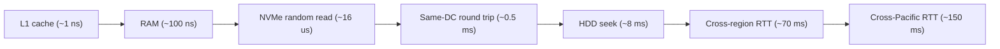
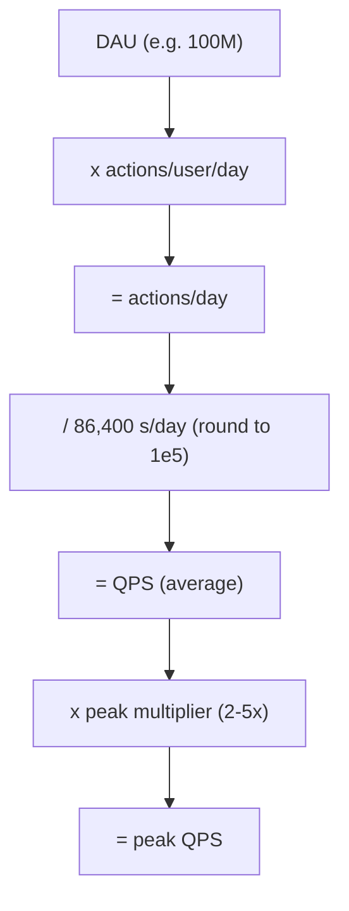
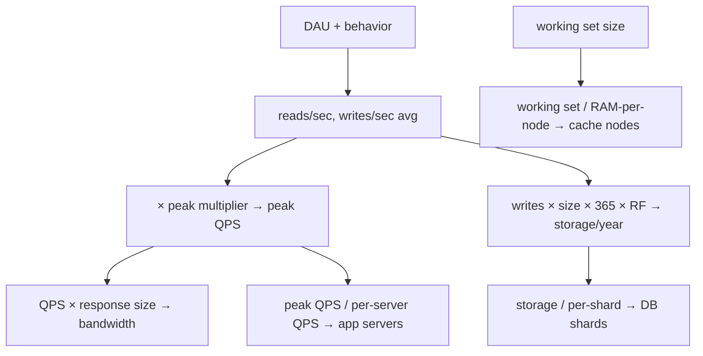
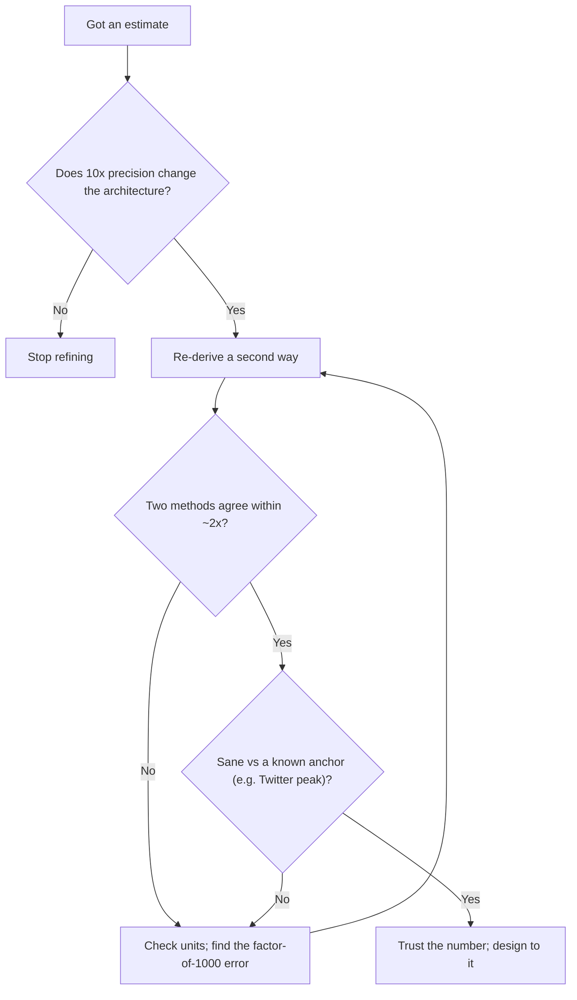

# Back-of-the-Envelope: Capacity & Latency Estimation

> Where this fits: this is the foundational arithmetic that turns "build me Twitter" into numbers a room of engineers can argue about — QPS, terabytes, gigabits, and machine counts. It sits underneath every other chapter in this curriculum; you will use it in the [interview framework](../04-design-case-studies/21-interview-framework.md) and every [case study](../04-design-case-studies/23-news-feed-and-timeline.md).
>
> **Principal-level takeaway:** The goal of a capacity estimate is *not* a precise answer — it is to find the **order of magnitude** that decides the architecture. Whether a system serves 100 QPS or 100,000 QPS changes everything; whether it's 80,000 or 120,000 changes almost nothing. Estimate to the nearest 10x, state your assumptions out loud, and use the number to *eliminate* designs, not to size hardware.

## The Mental Model — first principles: why does this thing exist, what problem does it solve?

Every design discussion starts with a vague sentence: "We need a service that lets users upload photos." That sentence is unfalsifiable. You cannot tell whether it needs one server or ten thousand, a single Postgres box or a globally-sharded object store, until you attach numbers to it. Back-of-the-envelope (BOTE) estimation is the discipline of going from a vague requirement to those numbers in roughly two minutes, on a whiteboard, without a spreadsheet.

The reason this matters is **architecture is decided by scale, and scale is decided by arithmetic you can do in your head.** A system at 50 reads/second is a laptop. The same system at 5,000,000 reads/second is a distributed cache fleet, a CDN, and a sharded database with a dedicated on-call rotation. The two are not the same system with "more servers" — they are categorically different designs. If you cannot estimate which regime you're in, you cannot design.

There is a second, subtler reason. Estimation is a **bullshit detector**, pointed both at others and at yourself. When someone proposes "let's just store every event forever in Postgres," a 30-second estimate showing 40 TB/year tells you whether that's fine or insane. When *you* propose a design, sanity-checking the numbers catches the error where you confidently sized a cache at 100 GB but the working set is actually 100 TB. Principals are trusted in design reviews largely because they instinctively reach for the envelope before the architecture.

The skill rests on three pillars, and we'll build each from scratch:

1. **Latency numbers** — knowing roughly how long each operation takes, so you can reason about what's achievable.
2. **Data-size and powers-of-two intuition** — translating "a billion users" or "a 4 KB record" into bytes, and bytes into machines.
3. **Workload arithmetic** — turning users and behavior into QPS, then QPS and object sizes into storage, bandwidth, and node counts.

None of this requires a calculator. It requires memorized anchors and the willingness to round aggressively.

## Core Concepts — the deep technical content

### Latency numbers every engineer should know

The single most useful table in systems engineering is the rough cost of common operations, originally popularized by Jeff Dean. Memorize the *shape* of it — the relative gaps matter far more than the exact figures.

| Operation | Rough latency | In human terms (×10⁹) |
|---|---|---|
| L1 cache reference | ~1 ns | 1 second |
| Branch mispredict | ~3 ns | 3 seconds |
| L2 cache reference | ~4 ns | 4 seconds |
| Mutex lock/unlock | ~17 ns | 17 seconds |
| Main memory (RAM) reference | ~100 ns | 1.5 minutes |
| Compress 1 KB (e.g. Snappy) | ~2 µs | ~30 minutes |
| Read 1 MB sequentially from RAM | ~3 µs | ~50 minutes |
| SSD random read (4 KB, NVMe) | ~16 µs | ~4.5 hours |
| Read 1 MB sequentially from SSD (NVMe) | ~50 µs | ~14 hours |
| Round trip within same datacenter | ~0.5 ms | ~6 days |
| Read 1 MB sequentially from disk (HDD) | ~1–2 ms | ~2–3 weeks |
| Disk (HDD) seek | ~5–10 ms | ~2–4 months |
| Round trip US East ↔ US West | ~60–80 ms | ~2–2.5 years |
| Round trip cross-Atlantic (US ↔ Europe) | ~70–90 ms | ~2.5 years |
| Round trip cross-Pacific / antipodal | ~150–200 ms | ~5–6 years |

The "human terms" column scales every number up by a billion so you can *feel* the gaps. The point isn't trivia; it's that **the gaps span roughly eight orders of magnitude** — from a ~1 ns L1 hit to a ~150 ms intercontinental round trip — and crossing a gap is what kills your latency budget. A few load-bearing facts fall out:

- **RAM is ~5,000× faster than a same-DC round trip and ~50,000–100,000× faster than an HDD seek** (a cross-*region* round trip is a full ~700,000× slower than RAM). This is the entire reason [caching](../01-building-blocks/06-caching.md) exists. A cache hit is nanoseconds-to-microseconds; a cache miss that hits disk is milliseconds. That's why a 99% hit rate isn't "10× better" than 90% — it can be the difference between p99 of 2 ms and p99 of 20 ms.
- **SSDs killed the random-vs-sequential penalty that HDDs imposed.** On spinning disk, a random seek (~8 ms) dwarfs sequential read; this is *why* [storage engines](../00-foundations/03-storage-engines.md) like LSM-trees batch writes sequentially. NVMe SSDs do random 4 KB reads in tens of microseconds, ~100–500× faster than an HDD seek. If your design says "disk," ask: spinning or solid-state? It changes the math by two orders of magnitude.
- **Geography is latency.** Light in fiber travels ~200,000 km/s (≈ ⅔ of c in vacuum, ~5 µs/km). NYC↔LA is ~4,000 km one-way, so a round trip covers ~8,000 km of cable and the *theoretical floor* is ~40 ms; real measured RTT is ~60–80 ms once you add routing and switching overhead — it's physics, not engineering. **No amount of money makes a synchronous cross-region call fast.** This single fact drives the entire CAP/[consistency](../02-distributed-systems/12-consistency-and-cap.md) discussion: cross-region coordination is expensive *because the speed of light is finite.* See [networking](../00-foundations/01-networking.md) for the propagation-vs-bandwidth breakdown.

A practical corollary: **count your round trips.** If a request fans out to 3 sequential same-DC services (0.5 ms each) plus one cross-region DB read (70 ms), your floor is ~71.5 ms regardless of how fast your code is. Latency budgets are dominated by the slowest serial hop, not by CPU.

The ladder below arranges the anchors from fastest to slowest so you can *see* the gaps you're crossing. Each step rightward is a different tier of the memory/network hierarchy; every time a request "falls down a rung," its cost jumps by roughly an order of magnitude. Caching, locality, and replication strategy are all attempts to keep requests on the left.



### Powers of two and data-size intuition

Computers count in powers of two, but humans round in powers of ten — and the two are close enough to exploit. The anchor:

```
2^10 = 1,024        ≈ 1 thousand   (Kilo)
2^20 = 1,048,576    ≈ 1 million    (Mega)
2^30 ≈ 1.07 billion ≈ 1 billion    (Giga)
2^40 ≈ 1.1 trillion ≈ 1 trillion   (Tera)
2^50 ≈ ...          ≈ 1 quadrillion (Peta)
```

So 2³² ≈ 4 billion (the reason a 32-bit integer / IPv4 space tops out near 4.3 B), and 2⁶⁴ ≈ 1.8 × 10¹⁹ (astronomically large — why 64-bit IDs essentially never run out; see the [ID generator case study](../04-design-case-studies/22-url-shortener-rate-limiter-id-gen.md)).

For data, memorize a few **typical object sizes** so you never freeze on the whiteboard:

| Thing | Rough size |
|---|---|
| A UUID / a timestamp | 16 B / 8 B |
| A typical DB row (a few columns) | ~100 B – 1 KB |
| A tweet / short text record | ~300 B – 1 KB |
| A web page (HTML, no media) | ~100 KB |
| A compressed photo (mobile JPEG) | ~1–5 MB |
| One minute of 1080p video | ~30–50 MB |
| One hour of Netflix-quality video | ~3 GB |

And the **time anchors**, which you'll use constantly to convert per-day figures to per-second:

```
1 day  ≈ 86,400 seconds   ≈ 10^5 (round to 100,000 for mental math)
1 month ≈ 2.5 million seconds
1 year ≈ 31.5 million seconds ≈ 3 × 10^7
```

The "1 day ≈ 100,000 seconds" approximation (it's really 86,400) is the single highest-leverage shortcut in this entire document. It introduces ~15% error, which is *noise* at the order-of-magnitude precision we care about. Embrace it.

### From DAU to reads/sec and writes/sec

The chain is always the same: **users → actions per user per day → actions per day → actions per second.**



Start with **DAU** (daily active users), the number a product manager can actually tell you. Then attach a **behavior assumption**: how many times does an active user perform the action in question per day? This is where judgment enters — and where you must *say the number out loud* so others can challenge it.

```
requests/sec (average) = DAU × (actions per user per day) / 86,400
```

Worked micro-example. Suppose a social app has **100 M DAU**, and the average user opens the feed **10 times/day** (each open = 1 read of the timeline) and posts **0.1 times/day** (1 in 10 users posts daily).

```
Reads/day  = 100M × 10  = 1 billion reads/day
Writes/day = 100M × 0.1 = 10 million writes/day

Reads/sec  (avg) = 1e9 / 1e5  = 10,000 reads/sec
Writes/sec (avg) = 1e7 / 1e5  = 100 writes/sec
```

Immediately you've learned the most important architectural fact about this system: it is **read-heavy, ~100:1**. That ratio dictates everything — aggressive caching, read replicas, maybe fan-out-on-write so reads are cheap (see [news feed](../04-design-case-studies/23-news-feed-and-timeline.md)). A 1:1 or write-heavy system would point you somewhere completely different. **The read/write ratio is often a more important output of estimation than the absolute QPS.**

### Peak vs average — and the multipliers

The average is a lie you tell yourself. Real traffic is bursty: everyone opens the app at 8 a.m. and 8 p.m., a celebrity tweets, a sale starts. You must size for **peak**, not average, or you fall over exactly when it matters.

Rules of thumb:

- **Daily peak ≈ 2–3× the daily average** for consumer apps with a diurnal pattern. Use **2×** as a default and **3–5×** if traffic is spiky (live events, flash sales, sports).
- **"Hot key" / fan-out spikes** can be 10–100× on a single resource — a viral tweet, a trending product. These don't show up in aggregate QPS; they show up as a single shard melting. Treat them separately.
- Carrying the example above: peak reads ≈ 10,000 × 3 ≈ **30,000 reads/sec**, peak writes ≈ **300 writes/sec**. Always design to the peak number and add headroom on top.

A principal habit: state both. "Average 10K read QPS, I'll design for ~30K peak with headroom to 50K." Anyone can then sanity-check your multiplier.

### Storage growth over years

Storage is a *cumulative* quantity — it integrates writes over the lifetime of the system. The formula:

```
storage/year = writes/day × bytes/write × 365
            (× replication factor, × overhead for indexes/metadata)
```

Two multipliers beginners forget and principals never do:

1. **Replication factor.** Data is rarely stored once. A typical [replicated](../01-building-blocks/09-replication.md) store keeps **3 copies** (e.g. Cassandra RF=3, HDFS default 3, S3 stores even more redundantly behind the scenes). Multiply your raw figure by 3.
2. **Overhead.** Indexes, metadata, write amplification in LSM engines, and B-tree slack can add **1.5–3×** on top. Round up.

Continuing the example: 10 M writes/day at ~1 KB each:

```
Raw/day  = 10M × 1 KB = 10 GB/day
Raw/year = 10 GB × 365 ≈ 3.65 TB/year
With RF=3 + overhead (~×4 total) ≈ 15 TB/year
Over 5 years ≈ 75 TB
```

Now you know: this fits on a handful of machines, not thousands. If the answer had been 75 *petabytes*, you'd be designing a fundamentally different system. That's the decision the estimate exists to make.

### Bandwidth from object size × QPS

Bandwidth (network throughput) is just **per-operation size × operations per second.** It's where designs that look fine on QPS suddenly become expensive.

```
egress bandwidth = read QPS × average response size
```

Suppose each feed read returns 20 posts × ~2 KB = ~40 KB. At 30,000 peak read QPS:

```
30,000 × 40 KB = 1,200,000 KB/s ≈ 1.2 GB/s ≈ 9.6 Gbps
```

That's nearly 10 Gbps of egress — a real number you'd put in front of the [networking](../00-foundations/01-networking.md) and CDN discussion. Now imagine the responses were images at 2 MB each: the same QPS would be **~480 Gbps**, which is why media is served from a CDN/object store and never from your application servers. **Bandwidth, not QPS, is usually what forces a CDN into the design.**

### How many servers, DB shards, and cache nodes?

The final step: convert load into machine counts. Each is `total demand / per-unit capacity`, rounded up, then padded for headroom and redundancy.

**App servers** — bounded by QPS each server can handle. A modern server handling moderate work does, very roughly, **1,000–10,000 QPS** depending on work per request (CPU-bound vs IO-bound; see [compute & concurrency](../00-foundations/02-compute-and-concurrency.md)). Use a conservative anchor and check both ways.

```
servers = peak QPS / per-server QPS
30,000 / 5,000 ≈ 6 servers → round to ~10 for headroom + N+1 redundancy
```

**DB shards** — bounded by whichever of {storage, write throughput, read throughput} you hit first. A single commodity Postgres/MySQL box comfortably holds a few TB and serves perhaps **5,000–20,000 simple QPS**; one [shard](../01-building-blocks/10-partitioning-sharding.md) might hold ~1 TB if you want healthy headroom. 75 TB / 1 TB ≈ **~75 shards** on storage grounds. Always shard on the *binding* constraint and recompute.

**Cache nodes** — bounded by working-set size in RAM. If the hot working set is, say, 500 GB and each cache node holds ~64 GB of usable RAM, you need ~8 nodes plus replicas. The key question is never "how big is the data" but **"how big is the *working set* — the data actually accessed in a time window?"** Caching the whole dataset is a beginner instinct; caching the hot 5% is the win.

A clean order to compute in:



If you ever want to encode this arithmetic instead of doing it on a whiteboard — for a sizing script, a capacity dashboard, or a quick sanity check in CI — it collapses to a few lines. The point of showing it is to make the *method* concrete: peak QPS is just average QPS times a multiplier, and yearly storage is just writes times object size times days times the replication-plus-overhead fudge factor. Note the deliberate choice to round a day to 100,000 seconds, exactly as you would in your head.

**Estimate: DAU + actions/user/day + peak factor → peak QPS and yearly storage**

```go
package capacity

// SecondsPerDay is intentionally rounded to 1e5 (vs the exact 86,400) to match
// back-of-the-envelope mental math; the ~15% error is noise at this precision.
const SecondsPerDay = 100_000.0

// Estimate holds the two headline outputs of a sizing pass.
type Estimate struct {
	PeakQPS        float64 // peak requests per second
	StorageBytesYr float64 // raw bytes written per year, after replication + overhead
}

// SizeWorkload turns a workload description into peak QPS and yearly storage.
//   dau:          daily active users
//   actionsPerDay: actions a single active user performs per day
//   bytesPerAction: stored bytes produced per action (0 for pure reads)
//   peakFactor:    peak-to-average multiplier (e.g. 3)
//   overhead:      replication x index/metadata fudge factor (e.g. RF=3 x 1.5 = 4.5)
func SizeWorkload(dau, actionsPerDay, bytesPerAction, peakFactor, overhead float64) Estimate {
	actionsPerSecond := dau * actionsPerDay / SecondsPerDay
	return Estimate{
		PeakQPS:        actionsPerSecond * peakFactor,
		StorageBytesYr: dau * actionsPerDay * bytesPerAction * 365 * overhead,
	}
}
```

```java
public final class Capacity {
    // Intentionally rounded to 1e5 (vs the exact 86,400) to match back-of-the-
    // envelope mental math; the ~15% error is noise at this precision.
    private static final double SECONDS_PER_DAY = 100_000.0;

    private Capacity() {}

    /** The two headline outputs of a sizing pass. */
    public record Estimate(double peakQps, double storageBytesPerYear) {}

    /**
     * Turn a workload description into peak QPS and yearly storage.
     *
     * @param dau            daily active users
     * @param actionsPerDay  actions a single active user performs per day
     * @param bytesPerAction stored bytes produced per action (0 for pure reads)
     * @param peakFactor     peak-to-average multiplier (e.g. 3)
     * @param overhead       replication x index/metadata fudge factor (e.g. 4.5)
     */
    public static Estimate sizeWorkload(double dau, double actionsPerDay,
                                        double bytesPerAction, double peakFactor,
                                        double overhead) {
        double actionsPerSecond = dau * actionsPerDay / SECONDS_PER_DAY;
        double peakQps = actionsPerSecond * peakFactor;
        double storagePerYear = dau * actionsPerDay * bytesPerAction * 365 * overhead;
        return new Estimate(peakQps, storagePerYear);
    }
}
```

### A worked example, end to end: a TinyURL-style link shortener

Requirement: "Build a URL shortener." Two minutes on the envelope.

**Assumptions (state them):** 100 M new URLs created/day; read:write ratio of 100:1 (URLs are created once, resolved many times); each stored record ~500 B (long URL + short code + metadata); 5-year horizon; RF=3.

```
Writes/day = 100M                         → 100M / 1e5 ≈ 1,000 writes/sec (avg)
Reads/day  = 100M × 100 = 10B             → 10B / 1e5  ≈ 100,000 reads/sec (avg)
Peak reads ≈ 100,000 × 3 ≈ 300,000 reads/sec

Storage/day  = 100M × 500 B = 50 GB/day
Storage/year = 50 GB × 365 ≈ 18 TB/year
Over 5 years × RF=3 ≈ 18 × 5 × 3 ≈ ~270 TB

Bandwidth (reads): redirect responses are tiny (~500 B headers)
  300,000 × 500 B ≈ 150 MB/s ≈ 1.2 Gbps — modest

App servers: 300,000 peak reads / 5,000 QPS ≈ 60 servers (+ headroom)
DB: 270 TB → needs sharding; but reads are 100K+/sec of a key lookup
  → this screams "cache + KV store," not a relational join engine
```

What the envelope *decided*: this is a **read-dominated key-value lookup at very high QPS with modest per-record size but large total storage**. That immediately rules out a single relational DB and rules *in* an aggressively cached, sharded key-value design. We never needed a precise number — we needed to know we were at 10⁵ reads/sec and 10²–10³ TB. (Full design: [URL shortener case study](../04-design-case-studies/22-url-shortener-rate-limiter-id-gen.md).)

### Sanity-checking your own numbers

The most valuable habit. Before you trust an estimate, run it through a small loop: does the precision even matter, do two independent derivations agree, and is the result sane against a known anchor? Only then do you carry the number forward.



Concretely, the checks are:

- **Re-derive one number a second way.** Got reads/sec from DAU? Cross-check against bandwidth, or against "how many reads can one server do × how many servers do we plausibly run."
- **Compare to a known anchor.** Twitter is ~hundreds of millions of DAU and famously hit ~143K tweets/sec at peak (its documented record was during a 2013 TV broadcast in Japan, not a steady-state rate). If your napkin says your startup needs 2 M writes/sec, you're claiming ~14× Twitter's all-time write peak — almost certainly an error in your assumptions.
- **Check the units obsessively.** The classic error is a factor of 1,000 (KB vs MB, or forgetting that a day is ~10⁵ not 10⁴ seconds). If a number feels insane, it usually is.
- **Ask: does the order of magnitude change the design?** If 10K vs 30K QPS lands in the same architecture, stop refining. Spend the precision only where it crosses an architectural boundary (single box → distributed, single region → multi-region).

## Trade-offs at a Glance

Estimation itself is a set of *modeling choices*. Here are the real ones and when each is right:

| Decision | Optimistic / simple | Conservative / robust | When to choose which |
|---|---|---|---|
| Peak multiplier | 2× average | 5–10× average | Use 2× for steady consumer apps; use high multipliers for event-driven (ticketing, sports, sales) or anything with thundering herds |
| Per-server QPS | 10,000+ | 1,000 | High for light IO-bound reads from cache; low for CPU-heavy or DB-coupled requests. When unsure, use the low end so you don't under-provision |
| Storage overhead | ×1 (raw) | ×3–5 (RF + indexes) | Always include replication for any durable store; raw-only is valid only for a single-copy scratch/cache |
| Working set for cache | 100% of data | hot 1–10% | Cache the hot fraction unless data is tiny; caching everything wastes RAM and rarely improves hit rate beyond the knee |
| Precision | nearest 10× | nearest 2× | Default to 10×; tighten to 2× only near an architectural threshold |
| Cross-region calls | "it's fine" | budget 70–150 ms each | Never assume free; if a request needs a cross-region hop, that hop *is* your latency budget |

## How Real Systems Do It

Concrete anchors keep your estimates honest:

- **DynamoDB** is provisioned and billed in literal capacity units: 1 RCU = one strongly-consistent 4 KB read/sec; 1 WCU = one 1 KB write/sec. This is BOTE arithmetic turned into a pricing model — you *must* estimate read/write QPS and item size to provision it, and Amazon's own guidance is to compute `RCUs = ceil(item_size/4KB) × reads/sec`.
- **Kafka** brokers routinely sustain **hundreds of MB/s to GB/s per broker**; LinkedIn famously ran Kafka at ~**7 trillion messages/day**. Sizing a Kafka cluster is exactly `total MB/s ÷ per-broker MB/s × replication factor`, then round up for headroom. See [messaging & streaming](../01-building-blocks/11-messaging-and-streaming.md).
- **Cassandra** defaults to RF=3 and is sized on disk + write throughput per node; operators commonly target keeping each node under ~1–2 TB of data so compaction and repair stay manageable — a direct "storage ÷ per-node capacity = node count" calculation.
- **Postgres / MySQL** single primaries handle low-thousands to low-tens-of-thousands of simple QPS and a few TB comfortably before you reach for [replication](../01-building-blocks/09-replication.md) and [sharding](../01-building-blocks/10-partitioning-sharding.md). This is the anchor for "when does one box stop being enough."
- **CDNs (Cloudflare, Akamai, CloudFront)** exist precisely because of the bandwidth math above: serving media at `QPS × MB` from origin is hundreds of Gbps you don't want to pay for or build. The estimate is what proves you need them.
- **Jeff Dean's latency numbers** (Google, ~2010) are the canonical source for the latency table; though absolute SSD/network figures have improved, the *relative gaps* — and therefore the design lessons — still hold.

## Failure Modes & Common Misconceptions

**Myth: "I need the exact number."** No. A BOTE estimate that's off by 2× is a success if it lands you in the right architecture. Chasing precision wastes the two minutes you have and creates false confidence. Correct it: estimate to 10×, refine only at thresholds.

**Myth: "Average load is what I design for."** This is how you get paged at 8 a.m. Real traffic peaks 2–10× over average, and a single hot key can be 100×. Design for peak, then add headroom. The system that's "comfortably at 60% CPU on average" is on fire at peak.

**Myth: "Storage is just `rows × row size`."** It's `rows × size × replication × (indexes + overhead + write amplification)`, accumulated over the retention period. Forgetting RF=3 and indexes routinely under-counts storage by 3–6×.

**Myth: "More servers = more throughput, linearly."** Coordination, shared databases, locks, and hot shards break linear scaling — this is [Amdahl's and Universal Scalability Law](../00-foundations/02-compute-and-concurrency.md) territory. Doubling app servers does nothing if they all hammer one DB primary. Always find the *binding constraint* before adding capacity to the wrong tier.

**Myth: "Cache the whole dataset."** You cache the *working set* — the data accessed within a window. For most systems that's a small hot fraction (Zipfian access). Sizing cache to total data is expensive and pointless past the hit-rate knee. See [caching](../01-building-blocks/06-caching.md).

**Myth: "Cross-region replication is fast if we pay for better network."** Physics says no: ~70–150 ms round trips are the floor for intercontinental links. You can hide latency with async replication or local reads, but you cannot make a synchronous cross-region quorum fast. This is the root of the [CAP/PACELC](../02-distributed-systems/12-consistency-and-cap.md) trade-off.

**Failure in production:** the most common estimation-driven outage is **provisioning to average and getting hit by the diurnal peak plus a launch spike simultaneously** — the multipliers stack. The second most common is a **hot shard / hot key** that aggregate QPS estimates completely hide; your cluster has spare capacity in total while one node is at 100%.

## In a Design Discussion

The estimate is the *first thing* you do after clarifying requirements, before drawing a single box. It frames everything that follows.

> **Junior take:** "Let's use a database to store the URLs and an API server in front. We can scale up if we need to." — No numbers, no read/write ratio, no idea whether one box or a hundred. Cannot defend the design because there's nothing to defend it *with*.

> **Principal take:** "Let me size it. ~100M writes/day is ~1K writes/sec; at 100:1 reads that's ~100K reads/sec average, call it 300K at peak. Records are tiny but we'll have ~270 TB over five years at RF=3. So: read-dominated KV lookups at 10⁵ QPS with large total storage and small responses. That rules out a single relational primary and points to a sharded KV store fronted by a cache, with redirects served close to the user. The read path is the thing to optimize; the write path is trivial. If anyone thinks the read:write ratio is wrong, that's the assumption that flips the whole design — let's pin it down." 

The difference is not arithmetic skill — it's that the principal used the numbers to *eliminate options and surface the load-bearing assumption*. They named the read:write ratio as the swing variable and invited challenge. That is the entire game. Carry the estimate forward into every subsequent decision: the QPS number sizes the [load balancer](../01-building-blocks/05-load-balancing.md) fleet, the storage number drives the [sharding](../01-building-blocks/10-partitioning-sharding.md) strategy, the bandwidth number forces the CDN, and the latency budget constrains how many [consensus](../02-distributed-systems/13-consensus.md) round trips you can afford.

## Self-Check

<details>
<summary>1. Roughly how many seconds are in a day, and why use 100,000 instead of 86,400?</summary>
~86,400; we round to 100,000 (10⁵) because it makes division trivial in your head and introduces only ~15% error, which is noise at order-of-magnitude precision. Per-second ≈ per-day / 100,000.
</details>

<details>
<summary>2. A system has 50 M DAU, each making 4 writes/day. What's average and peak writes/sec?</summary>
50M × 4 = 200M writes/day ÷ 10⁵ ≈ 2,000 writes/sec average. At a 3× peak multiplier, ~6,000 writes/sec peak.
</details>

<details>
<summary>3. Why is a cache hit ~100,000× cheaper than a cache miss that hits a spinning disk?</summary>
RAM reference is ~100 ns; an HDD seek is ~5–10 ms. The ratio is ~50,000–100,000×. (Against an NVMe SSD random read at ~16 µs it's "only" ~160×.) This is why hit rate dominates latency and why caching exists.
</details>

<details>
<summary>4. You store 5 M records/day at 2 KB each. How much real storage over 3 years?</summary>
5M × 2 KB = 10 GB/day → ×365 ≈ 3.65 TB/year → ×3 years ≈ 11 TB raw → ×RF=3 ≈ 33 TB, plus index/overhead (×~1.5) ≈ ~50 TB. Don't forget replication and overhead.
</details>

<details>
<summary>5. At 20,000 read QPS with 50 KB responses, what egress bandwidth do you need?</summary>
20,000 × 50 KB = 1,000,000 KB/s ≈ 1 GB/s ≈ 8 Gbps. If responses were media-sized (2 MB), it'd be ~320 Gbps — the trigger for a CDN.
</details>

<details>
<summary>6. Your aggregate cluster is at 40% CPU but one node is melting. What did your estimate miss?</summary>
A hot key / hot shard. Aggregate QPS estimates hide skew; real access is often Zipfian. You must separately estimate worst-case single-key/single-shard load, not just totals.
</details>

<details>
<summary>7. Why can't you make a synchronous US↔Europe database quorum "fast" with money?</summary>
Speed of light in fiber (~200,000 km/s) sets a ~70–90 ms round-trip floor across the Atlantic. Bandwidth and hardware don't change propagation delay. You can only hide it with async replication or local reads — the core CAP/PACELC trade-off.
</details>

<details>
<summary>8. When should you stop refining an estimate?</summary>
When further precision wouldn't change the architecture. If 15K vs 25K QPS lands in the same design, stop. Tighten precision only where it crosses a threshold (single box → distributed, single region → multi-region, relational → sharded KV).
</details>

## Go Deeper

- **Designing Data-Intensive Applications** (Kleppmann), **Chapter 1** ("Reliability, Scalability, Maintainability") — the load-parameter and percentile-latency discussion (Twitter fan-out example) is the canonical treatment of turning workload into design. Chapter 11 (stream processing) for throughput sizing.
- **Jeff Dean — "Latency Numbers Every Programmer Should Know"** (Google) and Peter Norvig's "Teach Yourself Programming in Ten Years" appendix where the figures first circulated. See also the interactive "Latency Numbers" visualization by Colin Scott, which projects the numbers across hardware years.
- **"The Tail at Scale"** (Dean & Barroso, CACM 2013) — why p99 latency, not average, is what you must budget for, and how fan-out amplifies tail latency.
- **Amazon DynamoDB documentation** — RCU/WCU capacity-unit model: estimation formalized into a billing API. A great exercise in per-operation sizing.
- **AWS / Google Cloud pricing calculators** — not for the prices, but to internalize realistic per-node throughput and storage figures.
- Sibling chapters: [Networking](../00-foundations/01-networking.md) (propagation vs bandwidth), [Compute & Concurrency](../00-foundations/02-compute-and-concurrency.md) (per-server limits, scalability laws), [Storage Engines](../00-foundations/03-storage-engines.md) (write amplification), [Caching](../01-building-blocks/06-caching.md) (working sets), and [The System Design Framework](../04-design-case-studies/21-interview-framework.md), where this estimate becomes step one of every design.
- Curriculum map: [root index](../README.md) · [roadmap](../ROADMAP.md).
