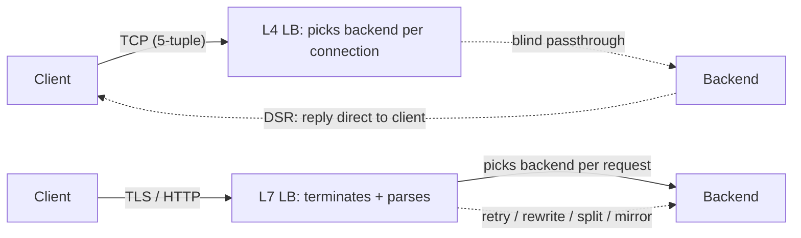
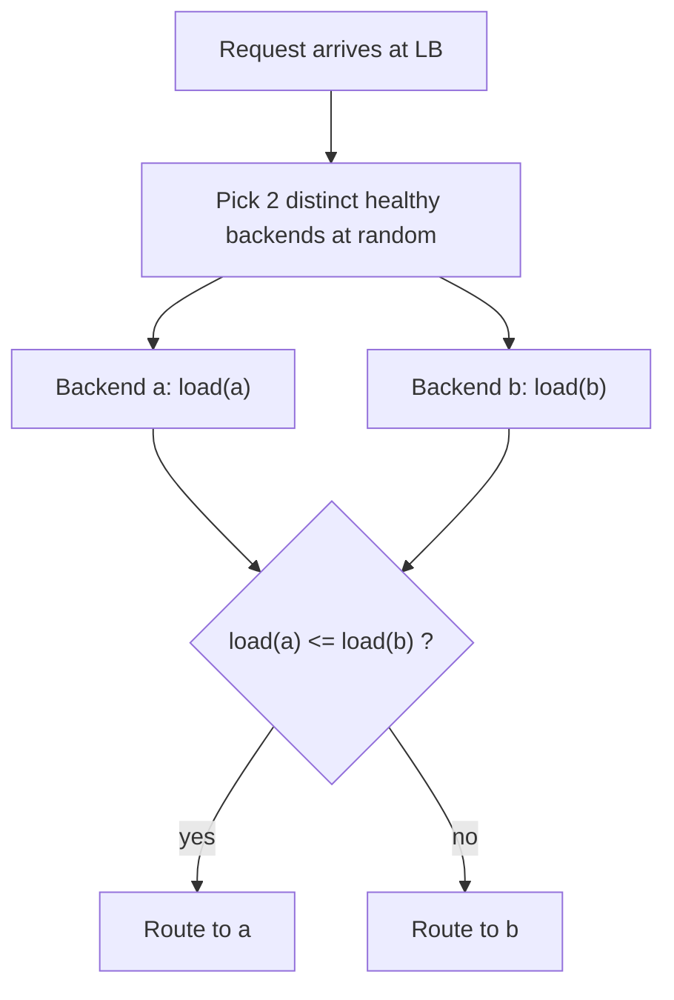
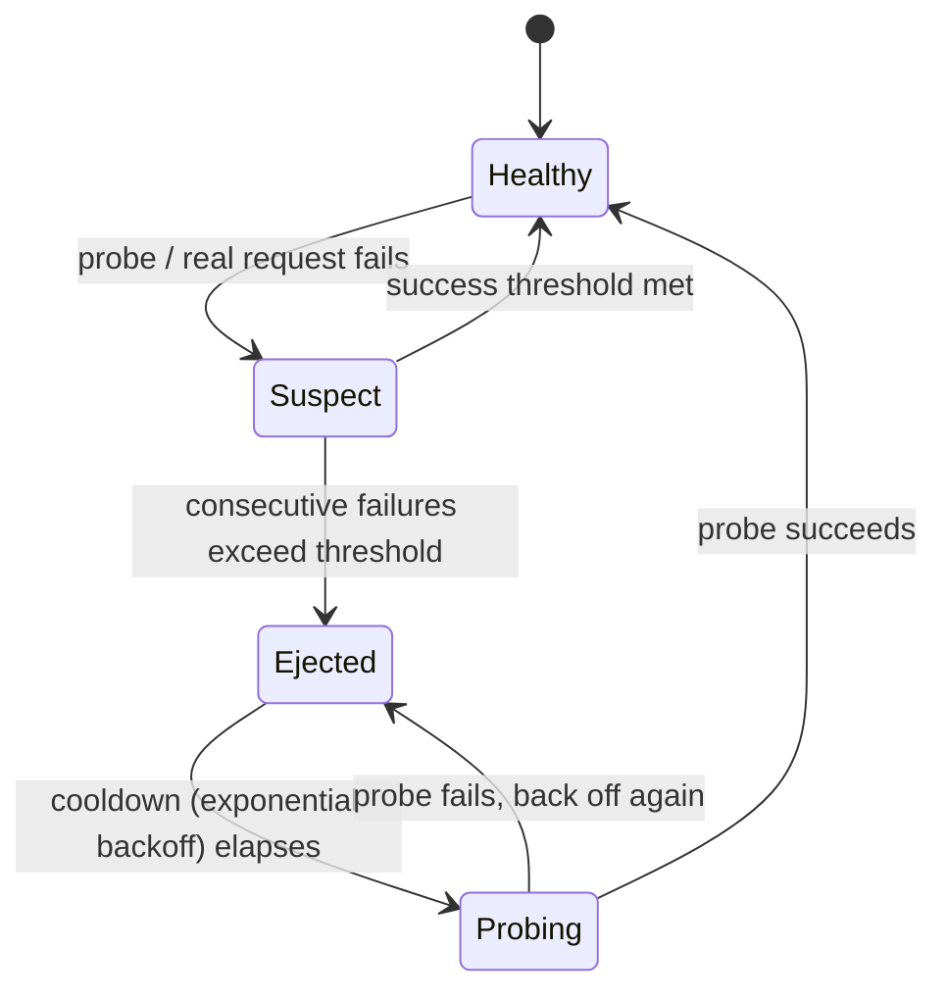
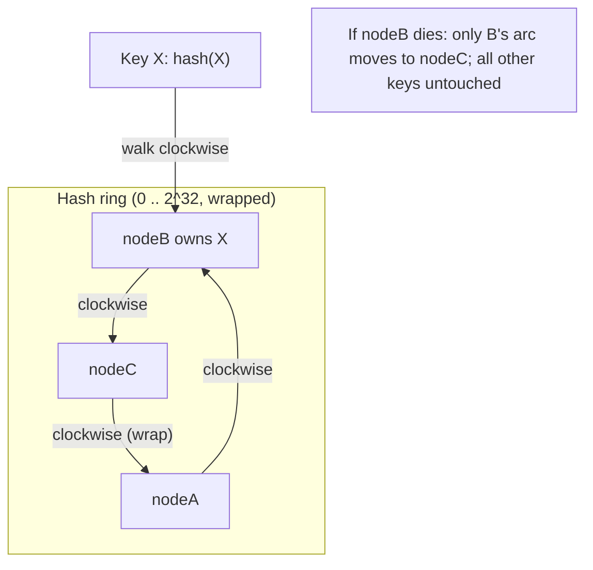
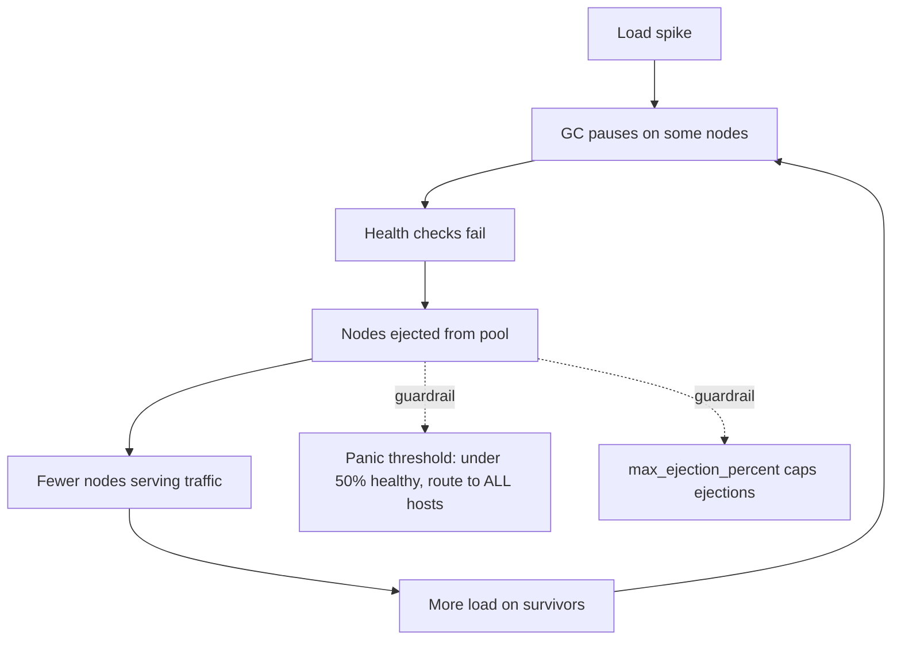

# Load Balancing & Consistent Hashing

> Where this fits: every stateless service tier and most stateful ones sit behind something that spreads traffic across replicas. This is the first "building block" you reach for when one box stops being enough.
>
> **Principal-level takeaway:** Load balancing is not "spread requests evenly." It is *the routing layer that decides how membership changes, hot keys, and partial failures get absorbed*. The hard part is never round-robin — it's what happens when a node joins, dies, or gets slow, and whether your routing scheme reshuffles 5% of state or 95% of it.

---

## The Mental Model — first principles

Start with one server. It can handle, say, 5,000 requests/second before its CPU saturates or its tail latency blows up. Your traffic grows to 50,000 rps. You now need ~10 servers. But a client only knows *one* address. Something has to sit between "the world" and "the fleet" and answer the question: **for this particular request, which backend should serve it?**

That question is the *entire* subject. Every load-balancing decision is an answer to it, optimizing for some mix of:

1. **Even utilization** — no single box melts while others idle (avoid *hotspots*).
2. **Availability** — a dead or slow backend should stop receiving traffic fast.
3. **Stability under membership change** — when you add/remove a backend (deploys, autoscaling, crashes), you want minimal disruption. For *stateless* tiers that means "don't drop in-flight requests." For *stateful* tiers (caches, shards) it means "don't move more keys than you have to," because every moved key is a cache miss or a data copy.
4. **Locality / affinity** — sometimes you *want* the same request to hit the same backend (warm caches, sticky sessions, sharded data).

Notice that goals 1 and 4 are in tension, and goals 1 and 3 are in tension. A purely random scheme is even but has no affinity and reshuffles everything on change. A "key → fixed node" scheme has perfect affinity but creates hotspots and reshuffles catastrophically on change. **Consistent hashing exists to buy goal 3 (and partial goal 4) while paying only a little of goal 1.** Hold that thought — it's the punchline of the whole chapter.

Two distinct problems hide under "load balancing," and conflating them is the #1 beginner error:

- **Stateless balancing**: any backend can serve any request. The only goal is even spread + fast failure. Round-robin, least-connections, power-of-two. This is your web/API tier.
- **Stateful routing (sharding)**: a request *must* go to the backend that owns its data (a cache key, a user's shard, a Kafka partition). Here you need a *deterministic function* from key to node, and you care intensely about what happens to that mapping when membership changes. This is where consistent hashing and rendezvous hashing live. See [Partitioning & Sharding](../01-building-blocks/10-partitioning-sharding.md).

---

## Core Concepts

### L4 vs L7: where in the stack do you make the decision?

A load balancer can route at the **transport layer (L4)** or the **application layer (L7)**. The trade is *cheap and blind* versus *expensive and smart*. (Layer numbers come from the OSI model; see [Networking](../00-foundations/01-networking.md).)

**L4** operates on TCP/UDP. It sees the 5-tuple — `(src IP, src port, dst IP, dst port, protocol)` — and nothing inside the connection. It picks a backend *once, when the connection opens*, and pins the whole connection there. It cannot read HTTP paths, headers, or cookies because (a) that data may be inside TLS and (b) parsing it costs CPU. Two flavors:

- **NAT / proxy mode**: the LB terminates the TCP connection and opens a new one to the backend. Simple, but the LB is on both halves of every byte.
- **Direct Server Return (DSR)**: the LB forwards the request packets to a chosen backend (classically by rewriting the destination *MAC* and leaving the destination IP = the VIP, which each backend holds on a loopback; tunneling/IPIP variants exist too) — crucially it does *not* NAT the source. The backend therefore replies *directly* to the client, and response traffic bypasses the LB entirely. This is how you push tens of millions of packets/sec through commodity hardware — responses are usually far larger than requests, so not carrying them is a huge win.

**L7** terminates the connection, parses the protocol (HTTP/1.1, HTTP/2, gRPC, often TLS), and routes on application data: path-based routing (`/api/* → service-a`), header/cookie routing, retries, timeouts, rate limiting, request mirroring, canary splits. HTTP/2 and gRPC *require* L7 awareness to balance well — a single long-lived HTTP/2 connection multiplexes many requests, so an L4 LB that pins the connection will dump *all* of a client's RPCs on one backend, defeating balancing. L7 balances per-*request*, not per-*connection*.



The L4 path picks a backend *once per connection* and (under DSR) lets the backend answer the client directly, so the LB never touches the response bytes. The L7 path sits on every byte but can make a fresh, content-aware decision *per request*.

Rule of thumb: **L4 for throughput and protocol-agnostic raw TCP/UDP; L7 when you need to make decisions based on request content** (and accept ~an order of magnitude less throughput per core plus added latency). Many real stacks run both: an L4 LB spreads connections across a fleet of L7 proxies, which then route intelligently.

### Algorithms: how to pick among healthy backends

Once you've decided *where* to route, you need *which*. The algorithms, from naive to good:

- **Round-robin**: backend `i = (i+1) mod N`. Dead simple, ignores request cost and backend capacity. Fine when requests are uniform and backends identical. Breaks when one request is 100x another (a search query vs a health check).
- **Weighted round-robin**: assign weights by capacity (an 8-core box gets weight 2 vs a 4-core's 1). Static; doesn't react to real load.
- **Least-connections**: send to whoever has the fewest open connections. Adapts to heterogeneous request costs because a slow backend accumulates connections. Good default for long-lived connections.
- **Least-response-time / least-load**: route by measured latency or active request count. Smartest, but requires real-time stats — and the famous failure mode below.
- **Power-of-two-choices (P2C)**: pick **two** backends at random, send to the less-loaded of the two. This is the sleeper hit. Pure "least-loaded" with stale/distributed state causes a *herd*: every LB instance sees the same "least loaded" node and stampedes it, which then becomes the *most* loaded, and the herd swings to the next victim. P2C provably tames this — the max load across N servers drops from `O(log N / log log N)` (random) to `O(log log N)`, an exponential improvement, with almost no coordination. This is why modern meshes default to it.



> **Interactive:** [Load Balancing Algorithms (interactive)](../animations/load-balancing.html) -- toggle between round-robin, least-connections, and power-of-two and watch how each one handles a slow backend and a sudden load spike.

The principal nuance: with many independent LBs (client-side balancing, service mesh sidecars), *global* "least-loaded" is impossible to compute without a coordination round-trip, and stale global state actively *causes* oscillation. **P2C wins precisely because it needs no shared state and is robust to staleness.**

Here is a real, self-contained P2C picker. Each backend tracks an in-flight request count; the picker samples two distinct backends and routes to the lighter one, then we increment/decrement around the call so "load" reflects live concurrency.

**Example: Power-of-two-choices picker**

```go
package p2c

import (
	"math/rand"
	"sync"
	"sync/atomic"
)

// Backend is a routable target whose "load" is its in-flight request count.
type Backend struct {
	Addr    string
	inFlight int64 // updated atomically
}

func (b *Backend) Load() int64    { return atomic.LoadInt64(&b.inFlight) }
func (b *Backend) Acquire()        { atomic.AddInt64(&b.inFlight, 1) }
func (b *Backend) Release()        { atomic.AddInt64(&b.inFlight, -1) }

// Picker holds the healthy set and selects via power-of-two-choices.
type Picker struct {
	mu       sync.RWMutex
	backends []*Backend
}

func NewPicker(b []*Backend) *Picker { return &Picker{backends: b} }

// Pick returns the less-loaded of two distinct random backends.
// With fewer than two backends it returns whatever is available.
func (p *Picker) Pick() *Backend {
	p.mu.RLock()
	defer p.mu.RUnlock()
	n := len(p.backends)
	if n == 0 {
		return nil
	}
	if n == 1 {
		return p.backends[0]
	}
	i := rand.Intn(n)
	j := rand.Intn(n - 1)
	if j >= i { // map j into [0,n) excluding i, so the two are distinct
		j++
	}
	a, b := p.backends[i], p.backends[j]
	if a.Load() <= b.Load() {
		return a
	}
	return b
}

// Route picks a backend, accounts for its load around the call, and runs fn.
func (p *Picker) Route(fn func(*Backend) error) error {
	b := p.Pick()
	if b == nil {
		return errNoBackends
	}
	b.Acquire()
	defer b.Release()
	return fn(b)
}

var errNoBackends = errString("no healthy backends")

type errString string

func (e errString) Error() string { return string(e) }
```

```java
import java.util.List;
import java.util.concurrent.ThreadLocalRandom;
import java.util.concurrent.atomic.AtomicLong;

/** A routable target whose "load" is its in-flight request count. */
final class Backend {
    final String addr;
    private final AtomicLong inFlight = new AtomicLong();

    Backend(String addr) { this.addr = addr; }

    long load()    { return inFlight.get(); }
    void acquire() { inFlight.incrementAndGet(); }
    void release() { inFlight.decrementAndGet(); }
}

/** Selects backends via power-of-two-choices. */
final class Picker {
    private final List<Backend> backends; // assumed healthy

    Picker(List<Backend> backends) { this.backends = backends; }

    /** Returns the less-loaded of two distinct random backends. */
    Backend pick() {
        int n = backends.size();
        if (n == 0) return null;
        if (n == 1) return backends.get(0);

        ThreadLocalRandom rng = ThreadLocalRandom.current();
        int i = rng.nextInt(n);
        int j = rng.nextInt(n - 1);
        if (j >= i) j++; // make j distinct from i

        Backend a = backends.get(i), b = backends.get(j);
        return a.load() <= b.load() ? a : b;
    }

    /** Picks a backend, accounts for load around the call, and runs the action. */
    <T> T route(java.util.function.Function<Backend, T> action) {
        Backend b = pick();
        if (b == null) throw new IllegalStateException("no healthy backends");
        b.acquire();
        try {
            return action.apply(b);
        } finally {
            b.release();
        }
    }
}
```

### Health checks and outlier ejection

A backend in the pool that's broken is worse than one fewer backend — it's a black hole eating traffic. Two layers of defense:

- **Active health checks**: the LB periodically probes each backend (e.g., `GET /healthz` every 5s, mark unhealthy after 3 consecutive failures, healthy after 2 successes). Tune the thresholds: too aggressive and a GC pause ejects a healthy node and shrinks capacity precisely when load is high (a self-inflicted outage); too lax and you serve errors for 30s after a crash. Health endpoints must check *real* dependencies shallowly — a `/healthz` that returns 200 while the DB pool is exhausted is a lie.
- **Passive health checks / outlier ejection**: watch *real* traffic. If a backend returns 5xx or times out on N consecutive real requests, eject it from the pool for a cooldown (with exponential backoff), then probe it back. This catches failures active checks miss (a specific shard is broken, the box passes `/healthz` but fails real queries).

A single backend's lifecycle in the pool is really a small state machine — healthy, suspected, ejected, and probing back — driven by success/failure thresholds and a backoff timer:



The subtlety: ejection needs two guardrails. (1) A **cap on how many hosts you'll eject** (Envoy's `max_ejection_percent`, default 10%) so outlier detection can't empty the pool. (2) A **panic threshold** (Envoy default: 50% healthy): once *fewer* than that fraction of hosts are healthy, Envoy stops trusting health data entirely and load-balances across *all* hosts, healthy or not — on the theory that degraded-everywhere beats routing to nothing. Without these, a backend-wide problem — a bad deploy returning 500s everywhere — makes the LB eject *every* node, and now you're serving zero traffic instead of degraded traffic. See [Reliability](../02-distributed-systems/16-reliability-and-failure.md).

### Sticky sessions, and why they fight statelessness

A **sticky session** pins a client to a backend, usually via a cookie the L7 LB sets (`Set-Cookie: SERVERID=b3`) or a hash of the client IP. It exists because someone stored session state *in the backend's memory* — login state, a shopping cart, a WebSocket. Stickiness makes that work without externalizing state.

It is also a trap, and naming why is principal-level judgment:

1. **It defeats balancing.** New backends get only *new* sessions; existing load stays glued to old nodes. After a scale-out you have idle new boxes and saturated old ones.
2. **It breaks deploys.** Removing a sticky backend drops *every* session on it. With in-memory state, that's logouts and lost carts.
3. **It pretends a problem is solved.** The real fix is **statelessness**: push session state into a shared store (Redis, signed JWT, DynamoDB) so *any* backend can serve *any* request. Then you never need stickiness, you can deploy and autoscale freely, and a backend death loses nothing.

The honest exception: **stateful protocols you can't externalize** — WebSockets and long-lived gRPC streams are bound to a connection, and connection-draining on deploy is the tool there. But "we use sticky sessions for HTTP request state" in 2026 is almost always tech debt. (Caching session state belongs in [Caching](../01-building-blocks/06-caching.md).)

### Getting traffic to the LB: DNS, anycast, and GSLB

Everything above assumes traffic already reached *a* load balancer. But the LB is itself a thing with an IP, and you need to distribute across *multiple LBs in multiple regions* without a single global box. Three mechanisms, used in layers:

- **DNS load balancing**: return multiple A/AAAA records, or rotate them. Cheap, zero infrastructure, but coarse: DNS has **TTL caching** (clients and resolvers cache for minutes to hours and ignore your TTL), no health awareness in plain DNS, and no per-request control. Good for spreading across regions/LBs at the *first hop*; useless for fine-grained or fast failover. Lowering TTL to 30s helps but never fully — many resolvers clamp it.
- **Anycast**: announce the *same* IP from many locations via BGP. The internet's routing fabric delivers each client to the topologically nearest announcement. This is how a single IP serves the planet (`1.1.1.1`, Google DNS `8.8.8.8`, most CDNs). Failover is automatic-ish: withdraw the BGP route at a dead site and traffic re-routes. The catch: BGP balances by *network topology, not load*, so a huge metro can overwhelm its nearest PoP; and route changes can break in-flight TCP connections (a re-route mid-connection lands packets at a different box with no state). Anycast is excellent for stateless/UDP (DNS, QUIC) and CDN edges, trickier for long-lived TCP.
- **Global Server Load Balancing (GSLB)**: a smart DNS layer that answers queries based on *client geo, health, and capacity* — e.g., return the US-East VIP for US clients unless it's unhealthy, then fail to US-West. This is how multi-region routing actually works (AWS Route 53 latency/geo/failover routing, GCP Cloud DNS, Akamai/Cloudflare). It inherits DNS's TTL caching weakness for failover speed.

The mental model: **anycast/GSLB/DNS pick the region and entry LB; the LB picks the backend.** Different problems, different layers.

### Consistent hashing: minimizing reshuffle on membership change

Now the stateful-routing problem. You have a cache cluster of `N` nodes and need a deterministic key → node mapping. The naive answer is `node = hash(key) mod N`. It's even and fast — until `N` changes. Add one node (`N → N+1`) and `hash(key) mod N` vs `hash(key) mod (N+1)` disagree for **almost every key**: roughly `N/(N+1)` of all keys remap. For a cache that's a near-total miss storm; for a database that's moving nearly all your data. One node joining shouldn't move ~100% of keys.

**Consistent hashing** fixes this. Map both keys *and* nodes onto the same circular hash space (the **ring**, e.g. a 32- or 64-bit space wrapped end to end). A key is owned by the **first node clockwise** from the key's position.

```
        0 / 2^32
           │
   nodeC ● │       ● nodeA
          \│      /
  ─────────┼────────  ring (hash space wrapped to a circle)
          /│      \
   key X ○ │       ● nodeB
           │
  key X walks clockwise → owned by nodeB
```

The clockwise-ownership rule and the bounded blast radius of a node death are easier to see as a flow:



> **Interactive:** [Consistent Hashing (interactive)](../animations/consistent-hashing.html) -- add and remove nodes and watch how few keys move, then crank up the virtual-node count and see the ownership arcs even out.

When **nodeB dies**, only the keys between nodeA and nodeB (which used to land on B) move — to the next node clockwise (nodeC). **Every other key is untouched.** Adding a node similarly only steals keys from *one* neighbor. On average, a membership change of one node moves only `~1/N` of the keys, not `~all` of them. *That* is the whole point: **bounded reshuffle.**

There's a catch — with one point per node, the ring is uneven: by luck some nodes own huge arcs and others tiny ones (load variance can be 30%+), and when a node dies *all* its load dumps on a single successor. The fix is **virtual nodes (vnodes)**: place each physical node at *many* points on the ring (say 100–200 hashes per node). Now:

- Load smooths out (more points → variance shrinks ~`1/√(vnodes)`).
- A dead node's keys scatter across *many* successors instead of crushing one.
- Heterogeneous capacity is easy — give a bigger box more vnodes.

```python
# Consistent hash ring with virtual nodes (illustrative)
import bisect, hashlib

class HashRing:
    def __init__(self, nodes, vnodes=150):
        self.ring = {}                 # hash_point -> physical node
        self.sorted_keys = []
        for n in nodes:
            for v in range(vnodes):
                h = self._hash(f"{n}#{v}")
                self.ring[h] = n
                self.sorted_keys.append(h)
        self.sorted_keys.sort()

    def _hash(self, s):
        return int(hashlib.md5(s.encode()).hexdigest(), 16)

    def get_node(self, key):
        h = self._hash(key)
        i = bisect.bisect(self.sorted_keys, h) % len(self.sorted_keys)
        return self.ring[self.sorted_keys[i]]   # first node clockwise
```

Cost: vnodes add memory (the ring) and make lookups `O(log V)` via binary search. Worth it.

Here is the same ring as real, lift-out-able code in both languages. Each physical node is hashed at `vnodes` points; `Get` finds the first point clockwise from the key's hash via binary search; `Add`/`Remove` keep the sorted slice/array consistent.

**Example: Consistent-hash ring with virtual nodes**

```go
package hashring

import (
	"crypto/sha256"
	"encoding/binary"
	"fmt"
	"sort"
	"sync"
)

// Ring maps keys to physical nodes via a virtual-node hash ring.
type Ring struct {
	mu     sync.RWMutex
	vnodes int
	points []uint64          // sorted hash points
	owner  map[uint64]string // point -> physical node
}

func New(vnodes int) *Ring {
	return &Ring{vnodes: vnodes, owner: make(map[uint64]string)}
}

func hashKey(s string) uint64 {
	sum := sha256.Sum256([]byte(s))
	return binary.BigEndian.Uint64(sum[:8])
}

// Add places a node's vnodes onto the ring.
func (r *Ring) Add(node string) {
	r.mu.Lock()
	defer r.mu.Unlock()
	for v := 0; v < r.vnodes; v++ {
		p := hashKey(fmt.Sprintf("%s#%d", node, v))
		if _, dup := r.owner[p]; dup {
			continue
		}
		r.owner[p] = node
		r.points = append(r.points, p)
	}
	sort.Slice(r.points, func(i, j int) bool { return r.points[i] < r.points[j] })
}

// Remove deletes all of a node's vnodes from the ring.
func (r *Ring) Remove(node string) {
	r.mu.Lock()
	defer r.mu.Unlock()
	kept := r.points[:0]
	for _, p := range r.points {
		if r.owner[p] == node {
			delete(r.owner, p)
			continue
		}
		kept = append(kept, p)
	}
	r.points = kept
}

// Get returns the node owning key: the first vnode clockwise from hash(key).
func (r *Ring) Get(key string) (string, bool) {
	r.mu.RLock()
	defer r.mu.RUnlock()
	if len(r.points) == 0 {
		return "", false
	}
	h := hashKey(key)
	i := sort.Search(len(r.points), func(i int) bool { return r.points[i] >= h })
	if i == len(r.points) { // wrapped past the end of the ring
		i = 0
	}
	return r.owner[r.points[i]], true
}
```

```java
import java.nio.charset.StandardCharsets;
import java.security.MessageDigest;
import java.util.NavigableMap;
import java.util.Optional;
import java.util.concurrent.ConcurrentSkipListMap;

/** Maps keys to physical nodes via a virtual-node hash ring. */
public final class HashRing {
    private final int vnodes;
    // hash point -> physical node, kept sorted for clockwise lookup
    private final NavigableMap<Long, String> ring = new ConcurrentSkipListMap<>();

    public HashRing(int vnodes) { this.vnodes = vnodes; }

    private static long hashKey(String s) {
        try {
            MessageDigest md = MessageDigest.getInstance("SHA-256");
            byte[] d = md.digest(s.getBytes(StandardCharsets.UTF_8));
            long h = 0;
            for (int i = 0; i < 8; i++) h = (h << 8) | (d[i] & 0xffL);
            return h;
        } catch (Exception e) {
            throw new IllegalStateException(e);
        }
    }

    /** Places a node's vnodes onto the ring. */
    public void add(String node) {
        for (int v = 0; v < vnodes; v++) {
            ring.put(hashKey(node + "#" + v), node);
        }
    }

    /** Removes all of a node's vnodes from the ring. */
    public void remove(String node) {
        ring.values().removeIf(node::equals);
    }

    /** Returns the node owning key: the first vnode clockwise from hash(key). */
    public Optional<String> get(String key) {
        if (ring.isEmpty()) return Optional.empty();
        long h = hashKey(key);
        var entry = ring.ceilingEntry(h);
        if (entry == null) entry = ring.firstEntry(); // wrapped past the end
        return Optional.of(entry.getValue());
    }
}
```

### Rendezvous (HRW) hashing: the simpler alternative

**Rendezvous hashing** (a.k.a. Highest Random Weight, HRW) solves the same problem without a ring. For a key, compute `hash(key, node)` for *every* node and pick the node with the highest score:

```python
def hrw_node(key, nodes):
    return max(nodes, key=lambda n: hash_combine(key, n))
```

When a node leaves, only keys whose *winner* was that node move (they fall to their second-highest, on average `1/N`) — same bounded-reshuffle property as consistent hashing, with *no* virtual-node bookkeeping and naturally even distribution (every key independently ranks all nodes). The trade: lookup is `O(N)` per key instead of `O(log V)`, so it's perfect when `N` is small-to-moderate (tens to low hundreds) but not for thousands of nodes. It also generalizes cleanly to "pick the top-K nodes" for replica placement. Used in GlusterFS, Ceph's CRUSH (a descendant of HRW ideas), and many internal systems. **For most teams, HRW is the simpler, harder-to-get-wrong choice; reach for the ring with vnodes when N is large or you need weighted capacity at scale.**

### Client-side LB and service discovery

So far the LB is a separate box. **Client-side load balancing** moves the decision *into the client*: the client gets the full list of healthy backends (from a service-discovery system — Consul, etcd, ZooKeeper, Kubernetes Endpoints, Eureka) and applies P2C/round-robin itself, talking to backends directly. No middle proxy hop.

- **Pros**: one less network hop and one less thing to scale; no LB SPOF; the client has the freshest per-backend latency view (great for P2C).
- **Cons**: every client now embeds LB + discovery logic in *every language* you use; rollout of LB changes means redeploying clients; the discovery system becomes critical infrastructure.
- **The service mesh** (Istio/Linkerd/Envoy sidecars) is the modern compromise: a sidecar proxy *next to* each client does L7 client-side balancing, but the logic lives in the proxy (one implementation, language-agnostic), and a control plane pushes endpoint and policy updates. You get client-side smarts without polluting app code. See [Architectural Styles](../03-architecture-and-apis/18-architectural-styles.md) and [Observability](../03-architecture-and-apis/19-observability.md).

### The LB as a single point of failure

A load balancer that fronts your whole fleet is, by construction, a place where *all* traffic converges — a perfect SPOF. You never run one. Patterns to remove the SPOF:

- **Active-passive pair** with a floating **VIP** (virtual IP) failed over via VRRP/keepalived: the standby takes the IP within seconds if the active dies. Simple; wastes half your capacity; failover has a blip.
- **Active-active**: multiple LBs all live, traffic spread across them by **anycast** or **DNS/GSLB** (the upstream layer from earlier). A dead LB just stops being routed to.
- **ECMP (Equal-Cost Multi-Path)**: routers hash flows across a set of LB IPs at L3; lose one and flows rehash. This is how hyperscalers run L4 — a horizontal fleet of identical LBs behind ECMP, each LB stateless or with shared connection state.

The principle: **the entry layer must be horizontally scalable and have no single instance whose death takes everything down.** You push the "who's alive" decision up to a layer (BGP/anycast, ECMP, DNS) that fails over without a central coordinator.

---

## Trade-offs at a Glance

| Dimension | L4 LB | L7 LB |
|---|---|---|
| Sees | 5-tuple only | Full request (path, headers, body) |
| Routing granularity | Per connection | Per request |
| Throughput | Very high (DSR: 10s of Mpps) | ~10x lower per core |
| Features | None (blind) | Retries, path routing, canary, mirror, rate-limit |
| TLS | Pass-through | Usually terminates |
| HTTP/2 & gRPC | Balances poorly (pins conn) | Balances correctly |

| Algorithm | Reacts to load? | Coordination needed | Best for |
|---|---|---|---|
| Round-robin | No | None | Uniform requests, identical backends |
| Weighted RR | Static only | None | Heterogeneous capacity, predictable cost |
| Least-connections | Yes | Local state | Long-lived / variable-cost requests |
| Least-response-time | Yes (strongly) | Global stats → herd risk | Single LB with good telemetry |
| **Power-of-two** | Yes | **None** | Distributed/mesh LB; default choice |

| Key→node scheme | Reshuffle on Δnode | Distribution | Lookup | When |
|---|---|---|---|---|
| `hash mod N` | **~all keys** | Even | O(1) | Almost never (fixed N only) |
| Consistent hashing + vnodes | ~1/N | Even (with vnodes) | O(log V) | Large N, weighted capacity, replica spread |
| Rendezvous (HRW) | ~1/N | Even (inherent) | O(N) | Small–moderate N, simplicity, top-K replicas |

---

## How Real Systems Do It

- **AWS**: **NLB** is L4 (DSR-style, millions of connections, static IP per AZ), **ALB** is L7 (path/host routing, HTTP/2, gRPC), and the legacy **CLB** straddles both. **Route 53** is the GSLB/DNS layer (latency/geo/weighted/failover routing). Internally, AWS's **Hyperplane** runs L4 balancing as a distributed, ECMP-fronted fleet.
- **Google**: **Maglev** is Google's software L4 LB. It pairs two mechanisms: **Maglev hashing** (a consistent-hashing variant tuned for *minimal disruption + near-perfect evenness* — the dual goals of this chapter) so that every Maglev box in the fleet independently computes the *same* backend for a flow with **no shared state**, plus a **per-machine connection-tracking table** to pin a flow's later packets even across a backend-set change (hashing alone minimizes, but doesn't fully eliminate, remapping). The combination keeps existing connections stable without any cross-fleet coordination. Fronted by anycast and Google's global network.
- **Envoy / Istio / Linkerd**: L7 sidecars defaulting to **P2C** ("least request"), with **outlier ejection** and the **panic threshold** described above. The reference implementation of modern client-side-ish balancing.
- **DynamoDB / Cassandra**: partition by **consistent hashing of the partition key**. Cassandra uses a token ring with vnodes (default per-node token count dropped from 256 to 16 in 4.0 alongside a smarter allocation algorithm — fewer tokens give more even ownership and far cheaper repair/streaming). DynamoDB hides its partitioning, auto-splitting partitions by size and throughput rather than exposing a ring. Amazon's original **Dynamo paper (2007)** is *the* source for consistent hashing + vnodes in storage. See [NoSQL](../01-building-blocks/08-databases-nosql.md) and the [Dynamo case study](../04-design-case-studies/26-object-store-and-kv-store.md).
- **Kafka**: a producer maps a record to a **partition** (by `hash(key) % numPartitions` for keyed records). Note this is *mod-N*, and that's the deliberate reason adding partitions to a keyed topic is disruptive — existing keys remap. See [Messaging](../01-building-blocks/11-messaging-and-streaming.md).
- **Memcached clients** (ketama/libketama) pioneered consistent hashing in the wild so adding a cache node didn't cold-cache the whole fleet. **CDNs** (Cloudflare, Fastly) front everything with **anycast** and use consistent hashing internally to map content to cache servers.

---

## Failure Modes & Common Misconceptions

**Myth: "Load balancing means spreading load evenly."** No — it means *making a routing decision*. The hardest cases (stateful routing, membership churn, hot keys) are about *stability and affinity*, not evenness. A perfectly even scheme that reshuffles everything on every deploy is a bad load balancer.

**Myth: "`hash(key) % N` is fine, hashing is hashing."** This is the single most expensive beginner mistake. It's fine *only* if N never changes. The moment you add/remove a node, you remap ~all keys — a thundering cold-cache or a full data reshuffle. Consistent/rendezvous hashing exists for exactly this.

**Myth: "Least-loaded is obviously the best algorithm."** With distributed LBs and stale stats, "always pick the least-loaded" causes **load oscillation / herding**: everyone stampedes the momentarily-idle node, overload it, then stampede the next. P2C exists because it's *robust to stale state*. More information made it worse.

**Myth: "Health checks only help."** Over-aggressive checks cause **capacity-collapse cascades**: a load spike → GC pauses → health checks fail → nodes ejected → fewer nodes → more load on survivors → more pauses → more ejection → total outage. The panic threshold and conservative ejection floors exist to break this loop.



The solid arrows form the runaway loop; the dashed guardrails are the two circuit-breakers that keep it from emptying the pool.

**Myth: "Sticky sessions are a normal feature."** They're a symptom of in-memory state. They sabotage scaling and deploys. Externalize state instead; reserve stickiness for genuinely connection-bound protocols.

**Production failure — the hot key / hot partition.** Consistent hashing balances *keys* evenly, not *traffic*. If one key (a celebrity user, a viral video) gets 40% of requests, the node owning it melts regardless of how perfect your ring is. Fixes live above hashing: key-splitting/salting, a dedicated cache for the hot key, or request coalescing. *No hashing scheme solves a skewed workload.* See [Partitioning](../01-building-blocks/10-partitioning-sharding.md).

**Production failure — connection pinning under HTTP/2.** Put an L4 LB in front of gRPC and every client's many RPCs ride one pinned connection to one backend. The fleet looks idle except a few hot boxes. You need L7 (or per-request rebalancing) for multiplexed protocols.

**Production failure — DNS failover is slow.** "We'll just fail over with DNS" ignores TTL caching. Resolvers and clients cache far past your 30s TTL; failover can take many minutes. For fast failover you need anycast withdrawal or an L7 layer with active health, not DNS alone.

---

## In a Design Discussion

When you whiteboard, the LB usually appears as one innocent box labeled "LB." A principal pulls on it.

- **Junior take:** "Put a load balancer in front of the web servers, round-robin, done."
- **Principal take:** "Which layer — L4 or L7? Our traffic is gRPC, so we need L7 (or per-request balancing) or we'll pin connections. The web tier is stateless, so we use P2C least-request via the mesh sidecars — no central LB to scale or to fail. The LB itself isn't a SPOF because the entry is anycast across regional L7 proxies. For the *cache* tier, that's a different problem — that's stateful routing, so consistent hashing with vnodes (or HRW since we only have ~40 cache nodes) so a node loss only cold-misses ~1/40 of keys instead of cratering the cache. And I want to call out the hot-key risk on the cache: hashing won't save us from a celebrity key, so we'll salt the top keys."

Notice the moves: *separate stateless balancing from stateful routing*, *name the protocol constraint*, *name the SPOF and how it's removed*, *quantify reshuffle*, and *call out the skew the hashing scheme won't fix*. That sequence is the judgment the chapter is teaching. Pair it with [Capacity Estimation](../00-foundations/04-capacity-estimation.md) (how many backends?) and document the choice as an ADR ([Trade-offs & ADRs](../05-principal-skills/29-tradeoffs-and-adrs.md)).

---

## Self-Check

<details>
<summary>1. Why does <code>hash(key) % N</code> fail when N changes, and exactly how much moves?</summary>
Because the modulus changes the result for nearly every key. Going N→N+1 remaps roughly N/(N+1) of all keys (~all of them). Consistent/rendezvous hashing limits it to ~1/N.
</details>

<details>
<summary>2. Vnodes solve two problems with a bare consistent-hash ring — name both.</summary>
(1) Uneven load: with one point per node the arcs vary wildly; many points per node smooth the distribution. (2) Concentrated failure: without vnodes a dead node dumps all its keys on one successor; with vnodes its keys scatter across many nodes. (Bonus: vnodes let you weight nodes by capacity.)
</details>

<details>
<summary>3. Why is power-of-two-choices better than "always pick the least-loaded" in a distributed setting?</summary>
Global "least-loaded" requires shared, fresh state; with stale state, every LB picks the same idle node and stampedes it, causing oscillation. P2C needs no shared state, is robust to staleness, and provably caps max load at O(log log N).
</details>

<details>
<summary>4. You're balancing gRPC. Why might an L4 LB leave most backends idle?</summary>
HTTP/2/gRPC multiplexes many requests over one long-lived connection. L4 pins a connection to one backend, so all of a client's RPCs hit one box. You need L7 / per-request balancing.
</details>

<details>
<summary>5. When would you choose rendezvous (HRW) over a consistent-hash ring?</summary>
When N is small-to-moderate (tens to low hundreds), you want simpler code with no vnode bookkeeping and naturally even distribution, or you need clean top-K replica selection. The ring wins at large N (O(log V) vs O(N) lookup) and for fine-grained weighted capacity.
</details>

<details>
<summary>6. How can aggressive health checks cause an outage rather than prevent one?</summary>
Under load, slow/GC-pausing nodes fail checks and get ejected, concentrating load on survivors, which then pause and get ejected — a capacity-collapse cascade. Panic thresholds and ejection floors prevent ejecting the whole fleet.
</details>

<details>
<summary>7. Why are sticky sessions an anti-pattern, and what's the real fix?</summary>
They glue load to old nodes (defeating scale-out), drop sessions on deploy, and mask in-memory state. The fix is statelessness: externalize session state (shared store / signed token) so any backend serves any request. Reserve stickiness for connection-bound protocols (WebSocket).
</details>

<details>
<summary>8. Consistent hashing gives perfectly even key distribution — so why might one node still be on fire?</summary>
It balances keys, not traffic. A hot key (celebrity/viral) sends disproportionate requests to its owner regardless of the ring. Fix above the hash: salt/split the hot key, dedicate a cache, or coalesce requests.
</details>

---

## Go Deeper

- **Designing Data-Intensive Applications** (Kleppmann) — **Ch. 6 "Partitioning"** is the must-read pairing (consistent hashing, hot spots, rebalancing — and Kleppmann's caveat on why fixed-partition rebalancing is often preferred over true consistent hashing in practice). **Ch. 5 "Replication"** for how routing interacts with replica placement.
- **Dynamo: Amazon's Highly Available Key-value Store** (DeCandia et al., SOSP 2007) — the canonical source for consistent hashing + virtual nodes in production storage.
- **Maglev: A Fast and Reliable Software Network Load Balancer** (Eisenbud et al., NSDI 2016) — Google's L4 LB; consistent hashing engineered for minimal disruption + evenness.
- **"The Power of Two Choices in Randomized Load Balancing"** (Mitzenmacher, 2001) — the theory behind P2C.
- **Karger et al., "Consistent Hashing and Random Trees"** (STOC 1997) — the original consistent-hashing paper (born for web caching).
- **Thaler & Ravishankar, "Using Name-Based Mappings to Increase Hit Rates"** (1998) — the rendezvous/HRW hashing paper.
- **Envoy proxy docs** — load balancing, outlier detection, and panic threshold: a precise, production-grade reference for the algorithms here.
- Sibling chapters: [Partitioning & Sharding](../01-building-blocks/10-partitioning-sharding.md), [Replication](../01-building-blocks/09-replication.md), [Caching](../01-building-blocks/06-caching.md), [Reliability](../02-distributed-systems/16-reliability-and-failure.md), [Networking](../00-foundations/01-networking.md). Root: [README](../README.md) · [ROADMAP](../ROADMAP.md).
