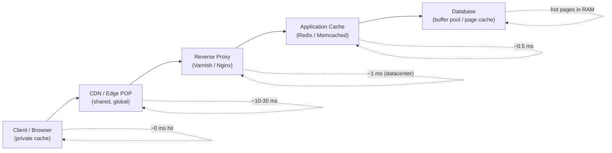
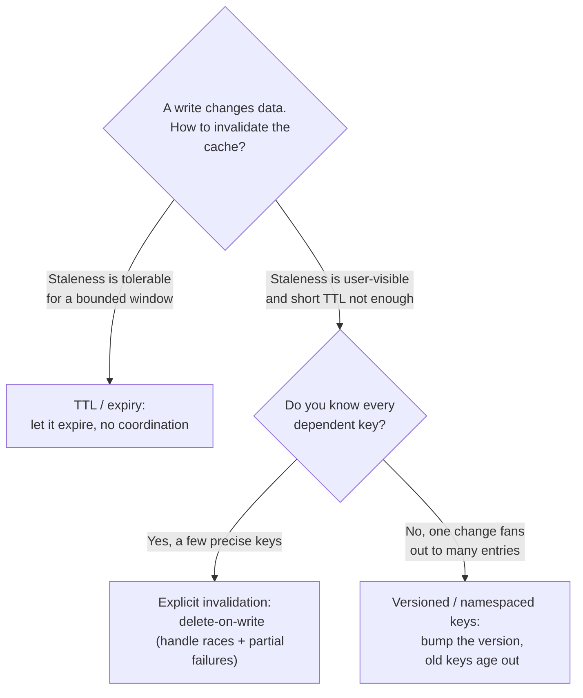
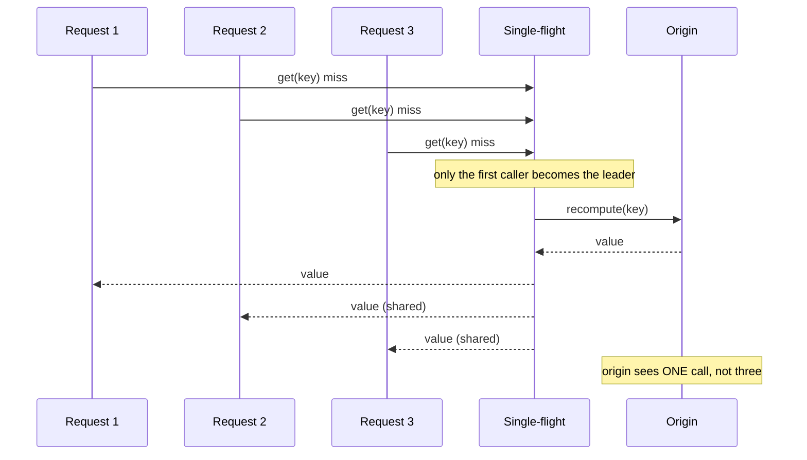
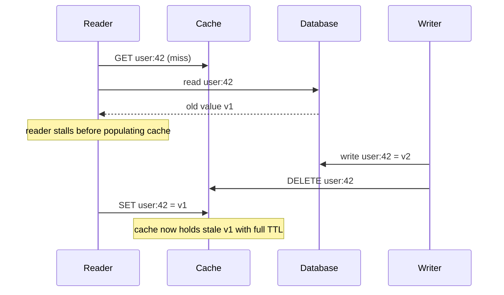

# Caching: Strategies, Invalidation & Failure Modes

> Where this fits: caching is the first lever you reach for when a system is too slow or too expensive, and the last thing you should add carelessly. It sits between your clients and your [databases](../01-building-blocks/07-databases-relational.md), in front of [load balancers](../01-building-blocks/05-load-balancing.md), and inside your storage engines.
>
> **Principal-level takeaway:** A cache is not a performance optimization you bolt on — it is a *second copy of your data with weaker consistency guarantees*, and every hard problem in caching (invalidation, stampedes, inconsistency) is a direct consequence of that one fact. Design the cache as a first-class part of your data model, not as an afterthought.

## The Mental Model — first principles: why does this thing exist?

Every cache exists to exploit one of two asymmetries:

1. **Latency asymmetry.** RAM access is ~100 ns; a same-datacenter network round trip is ~0.5 ms; a disk seek on a spinning disk is ~10 ms; a cross-region round trip is ~50–150 ms. (See [Back-of-the-Envelope](../00-foundations/04-capacity-estimation.md) for the canonical latency table.) A cache moves data *closer* on this ladder — from disk to memory, from a remote region to a local one, from the origin server to the edge.

2. **Recomputation cost asymmetry.** The result of a 200 ms aggregation query, a rendered HTML fragment, or a machine-learning inference is expensive to produce once and cheap to store. A cache amortizes that cost across every subsequent reader.

The entire field rests on one empirical observation: **access is not uniform.** Real workloads follow a Zipfian / power-law distribution — a tiny fraction of keys account for a huge fraction of requests. A small, fast store holding the *hot set* can absorb most of the traffic. If your access pattern were truly uniform random over a dataset far larger than cache memory, caching would not help and you should not reach for it.

So a cache is fundamentally a **bet on locality** (temporal: recently-accessed items will be accessed again; spatial: nearby items will be accessed together). When you add a cache you are making three implicit claims: the hot set fits in memory, reads vastly outnumber writes (or staleness is tolerable), and the cost of occasional inconsistency is lower than the cost of always hitting the origin. Make those claims explicit before you write a line of code.

## Core Concepts

### Where caches live

Caching is not one thing in one place. A single user request can pass through five or more cache layers, each with different scope, TTL semantics, and failure behavior:



A request travels left to right only as far as it must: a hit at any layer short-circuits the rest. The latency annotations show why a hit near the client is worth so much more than a hit deep in the stack — and why each layer you add is also a layer you must keep consistent.

- **Client / browser cache.** Governed by HTTP headers (`Cache-Control`, `ETag`, `Expires`). Private to one user, zero server cost on a hit, but you cannot invalidate it — once you send `max-age=3600`, that user holds stale data for up to an hour no matter what. This is why asset URLs are *fingerprinted* (`app.7f3a2b.js`): you never invalidate, you change the URL.
- **CDN / edge cache.** Shared across all users, replicated to hundreds of POPs (points of presence). Best for static assets and cacheable API responses. Covered in depth below.
- **Reverse proxy / gateway cache.** Varnish, Nginx, Envoy. Lives in your datacenter, caches full responses or fragments, often does request coalescing for free.
- **Application cache.** The "cache" people usually mean: Redis or Memcached holding query results, sessions, computed objects. This is where cache-aside lives. Can be a shared remote cluster or an in-process local cache (Caffeine, Guava) — the latter is faster but per-instance and harder to invalidate consistently.
- **Database buffer pool.** Postgres `shared_buffers`, InnoDB buffer pool, the OS page cache. Already a cache — it holds hot pages in RAM. People forget this and add an application cache that mostly duplicates what the buffer pool already does well. (See [Storage Engines](../00-foundations/03-storage-engines.md).)

The principal instinct: **before adding a layer, ask which existing layer is failing and why.** A 30% buffer-pool hit rate means your working set doesn't fit in DB RAM — sometimes the fix is more DB memory, not a new Redis cluster.

### Caching patterns: who reads, who writes, who owns staleness

These patterns differ in *who is responsible for populating the cache and propagating writes*. Getting this wrong is the root of most cache bugs.

**Cache-aside (lazy loading).** The application owns the cache. On read: check cache; on miss, read DB, populate cache, return. On write: write DB, then *invalidate* (delete) the cache entry.

```python
def get_user(uid):
    v = cache.get(uid)
    if v is not None:
        return v                      # hit
    v = db.query(uid)                 # miss
    cache.set(uid, v, ttl=300)        # populate
    return v

def update_user(uid, data):
    db.update(uid, data)
    cache.delete(uid)                 # invalidate, do NOT set
```

This is the default for a reason: the cache only holds what's actually read, and a cache outage degrades to slow-but-correct (every read hits the DB). The subtle trap is the **read-modify race** discussed under failure modes — and note we *delete* on write rather than *set*, because setting re-introduces a stale-write race.

The pseudocode above is correct but dangerously naive under load: if a hot key misses, every concurrent reader independently runs `db.query` — a stampede. The production-grade version of cache-aside folds in **single-flight** (request coalescing) so that only one loader runs per key while the others wait for and share its result. Here is the same pattern, hardened, in both Go and Java.

**Cache-aside with single-flight stampede protection**

```go
package cacheaside

import (
	"context"
	"math/rand"
	"time"

	"golang.org/x/sync/singleflight"
)

// Cache is the remote store (e.g. Redis). Errors are values, as usual in Go.
type Cache interface {
	Get(ctx context.Context, key string) (User, bool, error)
	Set(ctx context.Context, key string, v User, ttl time.Duration) error
}

// Loader fetches from the origin (the database) on a miss.
type Loader func(ctx context.Context, key string) (User, error)

type User struct {
	ID   string
	Name string
}

type Store struct {
	cache Cache
	load  Loader
	ttl   time.Duration
	group singleflight.Group // collapses duplicate concurrent loads per key
}

func NewStore(c Cache, l Loader, ttl time.Duration) *Store {
	return &Store{cache: c, load: l, ttl: ttl}
}

func (s *Store) Get(ctx context.Context, key string) (User, error) {
	if v, ok, err := s.cache.Get(ctx, key); err == nil && ok {
		return v, nil // fast path: hit
	}
	// Miss. singleflight guarantees the loader runs once per key even if
	// thousands of goroutines arrive at the same instant; the rest block
	// here and receive the leader's result (shared==true for followers).
	v, err, _ := s.group.Do(key, func() (any, error) {
		u, err := s.load(ctx, key)
		if err != nil {
			return User{}, err
		}
		// Populate with jittered TTL to avoid synchronized expiry.
		_ = s.cache.Set(ctx, key, u, s.ttl+jitter(s.ttl))
		return u, nil
	})
	if err != nil {
		return User{}, err
	}
	return v.(User), nil
}

// jitter returns a random offset in [0, d/4) so a batch of keys written
// together do not all expire at the same instant (avalanche prevention).
func jitter(d time.Duration) time.Duration {
	return time.Duration(rand.Int63n(int64(d / 4)))
}
```

```java
import java.time.Duration;
import java.util.concurrent.CompletableFuture;
import java.util.concurrent.ConcurrentHashMap;
import java.util.concurrent.ExecutionException;
import java.util.function.Function;

public final class CacheAsideStore {

    public record User(String id, String name) {}

    public interface Cache {
        User get(String key);                       // returns null on miss
        void set(String key, User value, Duration ttl);
    }

    private final Cache cache;
    private final Function<String, User> loader;    // loads from the origin/DB
    private final Duration ttl;

    // One in-flight load per key: the first caller installs the future,
    // every concurrent caller for the same key joins it -> single-flight.
    private final ConcurrentHashMap<String, CompletableFuture<User>> inFlight =
            new ConcurrentHashMap<>();

    public CacheAsideStore(Cache cache, Function<String, User> loader, Duration ttl) {
        this.cache = cache;
        this.loader = loader;
        this.ttl = ttl;
    }

    public User get(String key) {
        User cached = cache.get(key);
        if (cached != null) {
            return cached;                          // fast path: hit
        }
        // computeIfAbsent runs the mapping function at most once per key;
        // losers of the race get the same CompletableFuture and block on it.
        CompletableFuture<User> future = inFlight.computeIfAbsent(key, k ->
                CompletableFuture.supplyAsync(() -> {
                    User u = loader.apply(k);       // exactly one DB load
                    cache.set(k, u, ttl.plus(jitter(ttl)));
                    return u;
                }).whenComplete((u, ex) -> inFlight.remove(k)));
        try {
            return future.join();
        } catch (Exception e) {
            inFlight.remove(key);                   // don't cache a failed load
            throw new RuntimeException("load failed for " + key, e);
        }
    }

    // Random offset in [0, ttl/4): spreads expiries so a batch of keys
    // written together does not all expire at once (avalanche prevention).
    private static Duration jitter(Duration ttl) {
        long bound = Math.max(1, ttl.toMillis() / 4);
        return Duration.ofMillis(java.util.concurrent.ThreadLocalRandom.current().nextLong(bound));
    }
}
```

In both versions the load runs once per key under contention; everyone else shares the result. The Go `singleflight.Group` and the Java `ConcurrentHashMap<String, CompletableFuture<User>>` are the same idea expressed in each language's idiom. Note the deliberate choice to remove the in-flight entry on completion so the *next* miss (after the value later expires) starts a fresh load rather than replaying a stale future.

> **Interactive:** [Cache Stampede & Mitigation (interactive)](../animations/cache-stampede.html) -- watch how single-flight collapses a burst of concurrent misses into one origin call, and toggle it off to see the herd hit the origin.

**Read-through.** Same read path, but the *cache library* (not your app) knows how to load from the origin on a miss. The app only talks to the cache. Cleaner code, centralized loading logic; you give up control and your cache becomes a hard dependency. NCache, Caffeine with a `CacheLoader`, and many ORMs work this way.

**Write-through.** On write, the cache is updated synchronously *and* the write is passed to the DB before returning. The cache is always consistent with the DB for written keys, but every write pays two writes' latency, and you cache data that may never be read again (wasted memory). Pairs naturally with read-through.

**Write-back (write-behind).** Write to cache, acknowledge immediately, flush to DB asynchronously in batches. Lowest write latency and great write absorption (coalesce many updates to one key into a single DB write). The cost is brutal: **a cache crash loses unflushed writes.** Only acceptable when the data is reconstructible or loss-tolerant (view counts, metrics). This is essentially what a DB's own write buffer / WAL does internally with durability guarantees you don't get from Redis by default.

**Write-around.** Writes go straight to the DB and *skip* the cache; the cache is populated only on later reads (via cache-aside). Good when written data is rarely read soon after (log ingestion, write-heavy + read-cold). Avoids polluting the cache with write-once data, at the cost of a guaranteed miss on the first read after a write.

### Eviction policies: deciding what to throw away

A cache is finite. When full, eviction picks a victim. The policy is the difference between a 70% and a 95% hit rate on the same memory.

- **TTL (time-to-live).** Not really eviction — it's expiry. Every entry has a deadline. Simple, bounds staleness, but a fixed TTL makes every entry for a key expire at the same instant → synchronized stampede (see jitter below). TTL is orthogonal to and usually combined with a size-based policy.
- **LRU (least recently used).** Evict the entry untouched longest. Cheap (a linked list + hashmap), great for temporal locality. Its famous weakness: **scan resistance.** A single sequential scan over many cold keys (a backup job, an analytics sweep) evicts your entire hot set. This is why production caches rarely use pure LRU.
- **LFU (least frequently used).** Evict the least-accessed entry. Better for skewed workloads, but naive LFU never forgets — an item that was hot last week clings to memory forever (no aging), and it's expensive to track exact counts.
- **ARC (adaptive replacement cache).** Maintains two LRU lists (recently used once vs. used more than once) plus *ghost* lists of recently-evicted keys, and self-tunes the balance. Scan-resistant and adaptive. Famously used in ZFS; patent encumbrance kept it out of much OSS for years.
- **W-TinyLFU.** The modern default (Caffeine in Java, and increasingly elsewhere). A tiny LRU "window" catches recency; a frequency sketch (a Count-Min Sketch with periodic aging) catches popularity; admission control means a new candidate only displaces a victim if its estimated frequency is higher. Near-optimal hit rates at low memory overhead. If you're choosing an in-process cache library today, you want this.

```
W-TinyLFU admission:  new key K arrives, cache full, victim V chosen by LRU.
  if  freq_estimate(K) > freq_estimate(V):  admit K, evict V
  else:                                      reject K  (don't pollute on a one-hit wonder)
```

The judgment: **eviction policy matters most when the working set barely fits.** If your hot set is 10× your cache, no policy saves you — you need more memory or a different architecture. If it fits 2× over, W-TinyLFU vs LRU can be a 10-point hit-rate swing.

### Why cache invalidation is genuinely hard

Phil Karlton's line — "there are only two hard things in computer science: cache invalidation and naming things" — is not a joke. Invalidation is hard because it is a **distributed consistency problem wearing a performance costume.**

The instant you cache a value, you have two copies of the truth (cache + origin) with no transaction spanning them. A write must update both, but:

- The two updates are **not atomic.** Between writing the DB and deleting the cache, a concurrent reader can repopulate the cache with the old value (the read-modify race).
- The cache may be **partitioned** across nodes, or replicated to many edges; "invalidate" means a fan-out that can partially fail.
- You often **don't know the full set of keys** affected by a write. Updating one user's name might need to invalidate their profile cache, every cached feed that embeds their name, every search result page... This is *derived data invalidation*, and it's why people fall back to TTL.

The three families of invalidation strategy:

1. **TTL-based (expiry).** Don't invalidate; just let it expire. Simplest and most robust — bounded staleness with zero coordination. The right answer far more often than beginners think. Tune the TTL to your tolerance.
2. **Explicit invalidation (write-time delete).** On write, delete affected keys. Precise and fresh, but requires you to *know* every dependent key and to handle the races and partial failures.
3. **Versioned / key-namespaced.** Bake a version into the key (`user:42:v7` or `feed:42:gen:1234`). To "invalidate," bump the version; old keys become unreferenced and age out naturally. No delete fan-out, no races — readers either see the new key (miss → repopulate) or the old one (harmlessly orphaned). This sidesteps most distributed-delete pain and is criminally underused.

> Heuristic: reach for **TTL by default**, add **explicit invalidation** only for data where staleness is user-visible and short TTL isn't enough, and use **versioned keys** when a single logical change must invalidate many entries at once.



### CDN mechanics and cache keys

A CDN is a globally distributed reverse-proxy cache. The origin sends a response once; the edge POP nearest each user serves the copies. Mechanics worth knowing:

- **The cache key** is what the CDN uses to decide "is this the same object?" By default it's the URL, but you control it: include/exclude query params, vary on headers (`Accept-Encoding`, `Accept-Language`), or on cookies. **Cache-key design is where CDNs are won or lost.** Varying on a per-user cookie or a tracking query param shatters your hit rate — every user gets a unique key, hit rate → 0. A common bug: a marketing `?utm_source=...` param turning a cacheable page into thousands of unique keys.
- **TTL is controlled by origin headers:** `Cache-Control: max-age=` (browser) and `s-maxage=` (shared/CDN), `stale-while-revalidate` (serve stale while fetching fresh in the background — a built-in stampede mitigation), `stale-if-error` (serve stale if origin is down — free resilience).
- **Purge/invalidation** is the CDN's hard problem too. Most CDNs offer purge-by-URL (fast) and purge-by-tag/surrogate-key (Fastly's killer feature: tag objects, purge a whole tag in ~150 ms globally). Purge-by-URL across hundreds of POPs is eventually consistent, not instant.
- **Origin shield / tiered caching.** A designated mid-tier POP absorbs misses from all edge POPs so the origin sees one request, not hundreds — this is the CDN doing stampede protection for you.

### Redis vs Memcached

Both are in-memory key-value stores; the differences drive real decisions.

| Dimension | Memcached | Redis |
|---|---|---|
| Data model | Opaque bytes (string→string) | Rich: strings, hashes, lists, sets, sorted sets, streams, bitmaps, HLL |
| Threading | Multi-threaded (scales up on big boxes) | Single-threaded core (one CPU per shard); fast but a slow command blocks all |
| Persistence | None (pure cache) | Optional RDB snapshots + AOF log |
| Replication / HA | None native (client-side sharding) | Replicas, Sentinel failover, Redis Cluster |
| Eviction | LRU/segmented LRU | 8 policies incl. LRU, LFU, TTL, no-eviction |
| Memory efficiency | Slab allocator, lower per-item overhead | More features = more overhead |
| Atomic ops | CAS, incr/decr | Lua scripts, MULTI/EXEC, atomic data-structure ops |

Choose **Memcached** when you want a dead-simple, multi-threaded, memory-efficient look-aside cache and nothing more (Facebook famously runs Memcached at massive scale — see below). Choose **Redis** when you need data structures (rate limiters, leaderboards via sorted sets, queues), persistence, replication/failover, or atomic operations for things like distributed locks. The single-threaded model is a real gotcha: one `KEYS *` or a giant `SMEMBERS` on a hot Redis will stall *every* other request.

### Sizing and hit-rate math

This is where principals separate from juniors — caching decisions should be quantitative.

**Effective latency.** If hit latency is `L_hit`, miss latency is `L_miss` (which includes the cache lookup + origin fetch + populate), and hit rate is `h`:

```
L_avg = h · L_hit + (1 − h) · L_miss
```

The non-linearity matters. Going from 90% → 99% hit rate doesn't sound dramatic, but it **cuts misses by 10×** — and misses are what hit your origin. Origin load is `(1 − h) · QPS`. At 1M QPS:
- 90% hit → 100k QPS to origin
- 99% hit → 10k QPS to origin
- 99.9% hit → 1k QPS to origin

So the last fraction of a percent of hit rate is where the real load reduction lives. Conversely, a hit rate dropping from 99% to 95% **quintuples** origin load — which is exactly how a small cache regression becomes an origin meltdown.

**Sizing the hot set.** From your access logs, find the cumulative-access fraction covered by the top-N keys. If the top 5% of keys serve 80% of requests, a cache holding 5% of the keyspace gets ~80% hit rate. Size for the *working set*, not the total keyspace. Add headroom: a cache filled to 100% is constantly evicting and its hit rate collapses.

## Trade-offs at a Glance

| Pattern | Read latency | Write latency | Consistency | Cache-outage behavior | Best for |
|---|---|---|---|---|---|
| Cache-aside | Fast on hit | DB + delete | Eventual; race-prone | Degrades to slow+correct | General-purpose, read-heavy |
| Read-through | Fast on hit | (via write pattern) | Same as cache-aside | Cache is hard dependency | Clean code, centralized loading |
| Write-through | Fast | 2× (DB+cache sync) | Strong for written keys | Hard dependency | Read-after-write, low write rate |
| Write-back | Fast | Very fast (async) | Weak; data-loss risk | **Loses unflushed writes** | Counters, metrics, loss-tolerant |
| Write-around | Slow first read | DB only | Avoids stale writes | Degrades to slow+correct | Write-heavy, read-cold data |

| Eviction | Scan-resistant? | Adapts? | Cost | Use when |
|---|---|---|---|---|
| TTL only | n/a | no | trivial | Staleness bound is the only concern |
| LRU | **No** | no | cheap | Strong temporal locality, no scans |
| LFU (naive) | Yes | no (no aging) | costly | Stable skewed popularity |
| ARC | Yes | yes | moderate | Mixed scan + hot workload (ZFS) |
| W-TinyLFU | Yes | yes | low | **Default modern choice** (Caffeine) |

## How Real Systems Do It

- **Facebook + Memcached.** The canonical paper ["Scaling Memcache at Facebook" (NSDI 2013)](https://www.usenix.org/conference/nsdi13/technical-sessions/presentation/nishtala) describes a *look-aside* cache at millions of QPS. Key inventions: **leases** to fix the stale-set and thundering-herd problems (a lease token gates who may repopulate a key), regional pools, and treating the cache cluster as a demand-filling layer in front of MySQL.
- **DynamoDB + DAX.** DynamoDB is fast, but DAX adds a write-through, in-memory cache for microsecond reads on hot items, transparently. It explicitly handles the hot-partition problem DynamoDB has.
- **Netflix EVCache.** A tiered, multi-region Memcached layer optimized for the read-mostly metadata that drives the UI; replicated across AZs so an AZ loss doesn't tank hit rate.
- **Cassandra row cache & key cache.** Cassandra caches partition keys and (optionally) rows. The row cache is a classic footgun: enable it on a large-partition table and a single read can blow memory. (See [NoSQL](../01-building-blocks/08-databases-nosql.md).)
- **CDNs.** Cloudflare/Fastly/Akamai serve the majority of internet bytes from edge caches. Fastly's **surrogate keys** let you purge by logical tag globally in ~150 ms; `stale-while-revalidate` is widely used to hide origin latency.
- **PostgreSQL `shared_buffers` / InnoDB buffer pool.** The cache you already have. Postgres typically sized at ~25% of RAM (it leans on the OS page cache too); MySQL InnoDB buffer pool often 70–80% of RAM. Tuning these is frequently the highest-leverage caching change available.

## Failure Modes & Common Misconceptions

**Thundering herd / cache stampede / dogpile.** A popular key expires (or the cache restarts cold). Suddenly thousands of concurrent requests miss, all stampede the origin to recompute the *same* value at once, and the origin falls over. The classic trigger is a fixed TTL on a hot key — every copy expires at the same instant. Mitigations, in increasing sophistication:
- **Jittered TTL:** set TTL to `base ± random()` so expiries spread out. Cheapest, do this always.
- **Request coalescing / single-flight:** the first miss takes a lock or a "lease"; concurrent requests for the same key wait for that one computation instead of duplicating it. Go's `singleflight`, Memcached leases, and your reverse proxy's request collapsing all do this.



  (The Go and Java implementations of this exact mechanism appear under cache-aside above.)

- **Early / probabilistic recompute (`stale-while-revalidate`):** before the entry expires, with rising probability as expiry nears, one request refreshes it in the background while others keep serving the still-valid value. The XFetch algorithm formalizes this.

```python
# Probabilistic early expiration (XFetch-style)
def get(key):
    value, expiry, delta = cache.get_with_meta(key)   # delta = last recompute cost
    now = time.time()
    # 1.0 - random() lands in (0, 1]; log(0) would blow up, log(1)=0 gives no early refresh
    if value and now - delta * BETA * math.log(1.0 - random.random()) < expiry:
        return value                 # still fresh enough; serve it
    value = recompute(key)           # only a few unlucky requests land here
    cache.set_with_meta(key, value, ttl)
    return value
```

**Cache penetration.** Requests for keys that **don't exist anywhere** (e.g. `user_id = -1`, or attacker-generated garbage IDs). Every one misses the cache *and* misses the DB, so the cache provides zero protection — the origin takes the full load. Fix: **cache the negative result** (store a tombstone / null sentinel with a short TTL) and/or front the cache with a **Bloom filter** of known-existing keys to reject impossible lookups before they touch the DB.

**Cache breakdown (hot key).** One specific key is *so* popular it saturates the single Redis shard or Memcached node that owns it (a celebrity's profile, a flash-sale product). Consistent hashing doesn't help — it's one key on one node. Fixes: replicate the hot key across multiple nodes/replicas and pick randomly; add a local in-process cache in front of the remote cache (two-tier) so the hot key is served from app memory; or split the key (`product:42:shard:{0..N}`).

**Cache avalanche.** A large swath of keys expires simultaneously (synchronized TTL) or the cache cluster restarts/fails, and the entire origin load arrives at once. Jittered TTLs prevent the expiry case; warm the cache before taking traffic to prevent the cold-restart case; circuit-break the origin to prevent total collapse (see [Reliability](../02-distributed-systems/16-reliability-and-failure.md)).

**Cache–DB inconsistency (the read-modify race).** With cache-aside:
```
Reader: cache miss → reads old value from DB ........................┐
Writer: writes new value to DB → deletes cache key                  │
Reader: ...........................................→ SETs old value into cache  ← stale!
```

The same interleaving as a message sequence makes the ordering explicit:



Now the cache holds a stale value with a full TTL and no event will fix it. Mitigations: **delete-on-write rather than set-on-write** (shrinks but doesn't close the window), short TTL as a backstop, or **delayed double-delete** (delete, wait a beat, delete again to catch racing repopulations). For true read-after-write correctness you need write-through or to read from the source. This is a genuine consistency-model problem — see [Consistency, CAP & PACELC](../02-distributed-systems/12-consistency-and-cap.md).

**Misconceptions to kill explicitly:**
- *"A cache makes the system faster."* It makes the system faster **on a hit**, and adds a network hop + a consistency problem on a miss. A cache with a 20% hit rate likely makes you slower and more fragile.
- *"Higher hit rate is always the goal."* No — the goal is *meeting your SLO and protecting the origin*. A 60% hit rate that absorbs a traffic spike can be worth more than a 95% rate that's correct but doesn't cover the spiky keys.
- *"Just set a long TTL."* Long TTL maximizes hit rate and maximizes staleness simultaneously. The TTL encodes your staleness tolerance — choose it from product requirements, not from a desire for green dashboards.
- *"The cache is just an optimization; if it breaks, we're slow."* Only true if you designed for it. If your origin can't survive 100% miss traffic, your cache is a **load-bearing dependency** and its failure is an outage. Test the cold-cache and cache-down cases.
- *"Redis is single-threaded so it's slow."* It's single-threaded *and* extremely fast (100k+ ops/sec per shard) — the risk isn't throughput, it's that one slow command (`KEYS`, a big sort) blocks everything.

## In a Design Discussion

When caching comes up at the whiteboard, the move is to reason about it *quantitatively and as a consistency decision*, not to say "we'll add Redis."

**Junior take:** "Reads are slow, so we'll put Redis in front of the database. It'll cache the queries and make everything fast."

**Principal take:** "What's the read:write ratio and the access skew? Let's say 100:1 reads and the top 5% of keys serve 80% of traffic — that justifies a cache. I'll use **cache-aside with jittered TTL** because a cache outage must degrade to slow-but-correct, not to an outage; that means I have to confirm the DB can survive the full miss load or I add **request coalescing** and a **circuit breaker** so a cold cache doesn't avalanche the origin. For the celebrity/hot-key case I'll add an in-process L1 in front of the remote L2. Staleness budget: profile data tolerates 60s, so TTL of 60s ± jitter and no explicit invalidation; the account balance tolerates *zero* staleness, so that doesn't go in the look-aside cache at all — it reads from the primary. And I'll instrument hit rate, p99 on hit vs miss, and origin QPS so we can see a regression before it pages us."

Notice the difference: the principal names the *workload assumptions*, the *failure behavior*, the *staleness budget per data type*, and the *observability*. They also know what **not** to cache (the ledger balance). The cache is part of the data architecture, with a CAP-style decision attached to each cached entity.

## Self-Check

<details>
<summary>1. Why do we <em>delete</em> the cache entry on write in cache-aside instead of <em>updating</em> it?</summary>
Updating (set-on-write) opens a race where two concurrent writers' updates interleave so the cache ends up with the older value, and it also re-introduces the read-then-set stale window. Deleting is idempotent and forces the next read to repopulate from the DB, the source of truth. (It still doesn't fully close the read-modify race — that needs short TTL or delayed double-delete.)
</details>

<details>
<summary>2. Your origin QPS suddenly jumps 5×. Hit rate dropped from 99% to 95%. Explain.</summary>
Origin load is proportional to the *miss* rate, not the hit rate. 100% − 99% = 1% misses; 100% − 95% = 5% misses. 5% / 1% = 5×. Small hit-rate regressions cause large origin-load swings — this is the most important non-linearity in caching.
</details>

<details>
<summary>3. A request for a nonexistent ID floods your DB despite a cache. What's happening and how do you fix it?</summary>
Cache penetration: the key exists in neither cache nor DB, so every lookup misses both. Fix by caching the negative/null result with a short TTL, and/or front the cache with a Bloom filter of known-existing keys to reject impossible lookups cheaply.
</details>

<details>
<summary>4. Why is pure LRU dangerous in production, and what fixes it?</summary>
LRU is not scan-resistant: one sequential scan over cold data (backup, analytics) evicts the entire hot set. ARC and W-TinyLFU add frequency/recency separation and admission control so a one-time scan can't displace genuinely hot items.
</details>

<details>
<summary>5. When would you choose write-back over write-through, and what's the catastrophic risk?</summary>
Write-back when write latency and write absorption matter and the data is loss-tolerant or reconstructible (counters, metrics, view counts). The catastrophic risk: a cache crash loses all writes not yet flushed to the DB — never use it for data that must be durable.
</details>

<details>
<summary>6. You set a 1-hour TTL on a hot homepage fragment. At the top of the hour your origin spikes. Name the failure and three mitigations.</summary>
Cache stampede / thundering herd from synchronized expiry. Mitigations: jittered TTL (spread expiries), request coalescing / single-flight (one recompute, others wait), and probabilistic early recompute / stale-while-revalidate (refresh in the background before expiry while serving the still-valid copy).
</details>

<details>
<summary>7. Why does varying a CDN cache key on a per-user cookie destroy your hit rate?</summary>
The cache key identifies "the same object." Adding a per-user value makes every user's request a unique key, so nothing is shared — hit rate collapses toward zero and you're effectively not caching. Cache keys for shared content must exclude per-user dimensions.
</details>

<details>
<summary>8. Your account-balance reads are slow. A teammate wants to cache them in Redis with a 30s TTL. What's your objection?</summary>
A financial balance has a zero (or near-zero) staleness budget — showing a stale balance is a correctness/trust failure, not a UX nit. Either don't cache it (read from primary), use write-through with strict invalidation, or cache only the immutable transaction history and compute the balance fresh. Match the consistency strategy to the data's staleness tolerance.
</details>

## Go Deeper

- **Designing Data-Intensive Applications** — Chapter 1 (reliability/scalability framing for *why* caches), Chapter 5 (Replication; cache-as-a-replica mental model), Chapter 9 (Consistency & Consensus — the formal backbone of cache-DB consistency).
- **"Scaling Memcache at Facebook," Nishtala et al., NSDI 2013** — the definitive production caching paper: leases, stampede control, regional pools. [usenix.org](https://www.usenix.org/conference/nsdi13/technical-sessions/presentation/nishtala)
- **"ARC: A Self-Tuning, Low Overhead Replacement Cache," Megiddo & Modha, FAST 2003** — the adaptive replacement algorithm.
- **"TinyLFU: A Highly Efficient Cache Admission Policy," Einziger et al.** — the basis for W-TinyLFU / Caffeine.
- **"Optimal Probabilistic Cache Stampede Prevention," Vattani et al., VLDB 2015** — the XFetch early-recompute algorithm.
- **Caffeine wiki (GitHub)** — excellent, practical writeups on W-TinyLFU, eviction, and benchmarks.
- **MDN: HTTP Caching** — the authoritative reference for `Cache-Control`, `ETag`, `stale-while-revalidate`.
- **Redis docs: key eviction & "Redis as an LRU cache"** — the eight eviction policies and `maxmemory` behavior.

Related chapters: [Load Balancing & Consistent Hashing](../01-building-blocks/05-load-balancing.md) (how cache clusters distribute keys), [Capacity Estimation](../00-foundations/04-capacity-estimation.md) (the latency ladder and hit-rate math), [Consistency, CAP & PACELC](../02-distributed-systems/12-consistency-and-cap.md) (the consistency model your cache implicitly chooses), [Replication](../01-building-blocks/09-replication.md) (a cache is a weakly-consistent replica), and [Reliability](../02-distributed-systems/16-reliability-and-failure.md) (circuit breakers, graceful degradation when the cache fails). Back to [the index](../README.md) and [roadmap](../ROADMAP.md).
