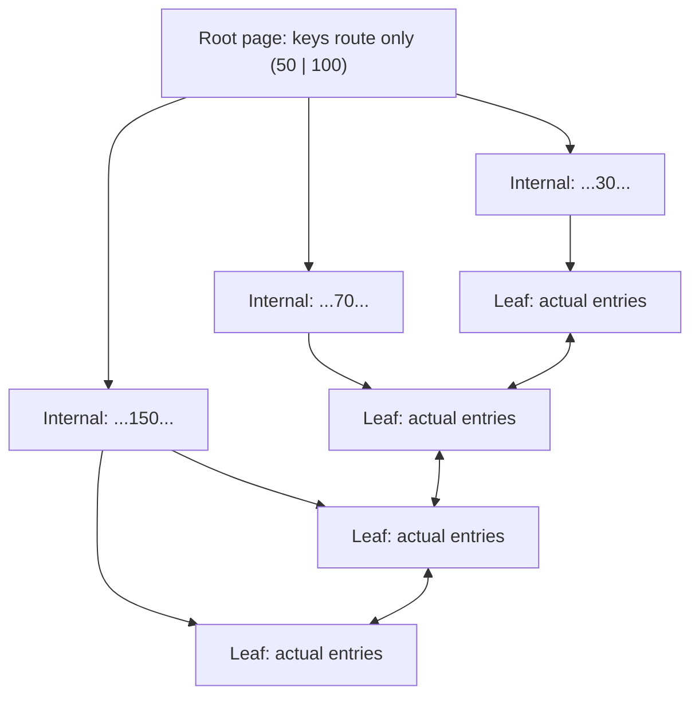
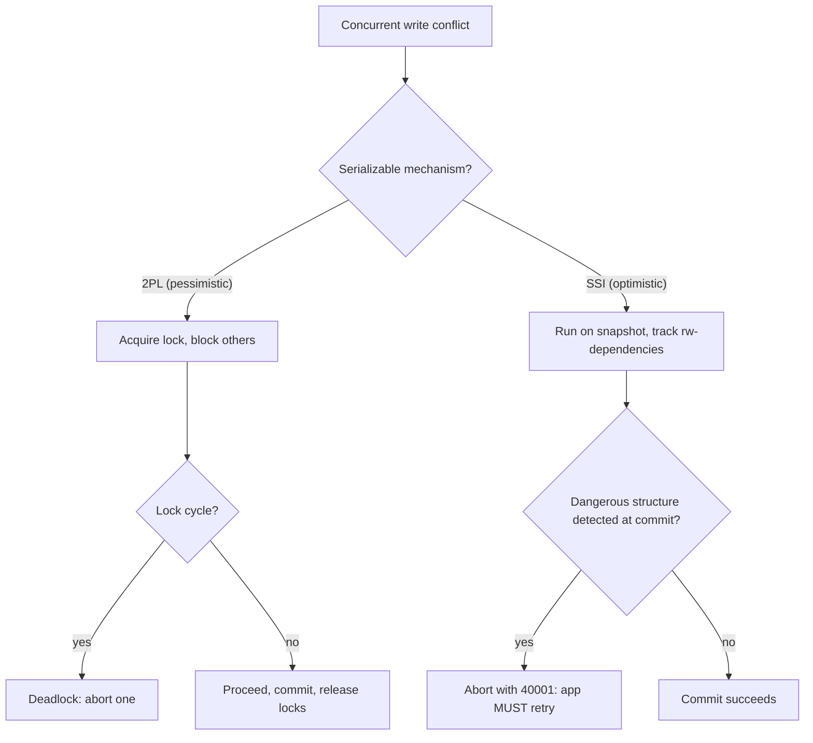
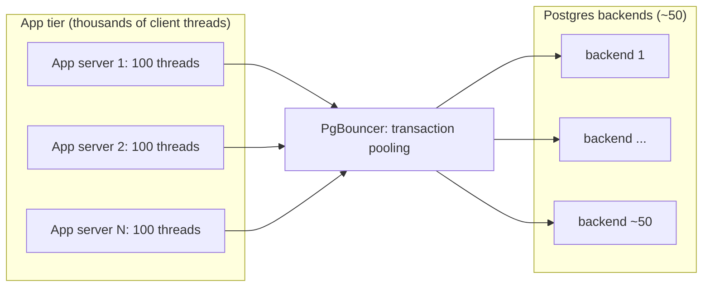

# Relational Databases: Indexing, Transactions & Isolation

> **Where this fits:** The relational database (Postgres, MySQL/InnoDB) is the default datastore almost every system should start with. This chapter is about understanding the engine well enough to reason about it under load. It builds directly on [Storage Engines](../00-foundations/03-storage-engines.md) (B-trees vs LSM-trees) and feeds [Replication](09-replication.md), [Partitioning](10-partitioning-sharding.md), and [NoSQL](08-databases-nosql.md).
>
> **Principal-level takeaway:** ACID is not a magic word — it is a *configurable* set of guarantees, and the default isolation level on your database (usually Read Committed) does **not** prevent the anomalies most engineers assume it does. Your job is to know exactly which guarantees you are paying for, which ones you turned off by accident, and what the index that makes your read fast is costing every one of your writes.

---

## ⚡ 60-Second TL;DR

- **Relational DB** (Postgres/InnoDB) = the default datastore; two jobs: **find data fast** (indexes) and **don't corrupt it under concurrency** (transactions).
- **B+tree index**: ~4 levels, point lookup ≈ 1 I/O; serves ranges/ordering. But each index is **a write tax** — N indexes = N+1 B+tree writes per insert.
- **ACID is configurable, not magic**: A+D = crash safety; **C is *your* job** (only declared constraints enforced); **I needs a *level*** to mean anything.
- **#1 trap**: the default **Read Committed** permits **lost updates** and **write skew**. Snapshot Isolation stops neither write skew — **only Serializable does**.
- **Serializable on Postgres = SSI**: you **must retry on `40001`**, or it's a bug.
- Pool size is a **capacity knob** (~2×cores), not "more is better"; transaction-pooling breaks session state.

**Remember one thing:** Know exactly which isolation guarantees you're paying for — the default protects far less than most engineers assume.

## The Mental Model — first principles: why does this thing exist?

Strip everything away and a database has two jobs: **find data fast** and **don't corrupt it when many people touch it at once**. Everything in this chapter is one of those two jobs.

Imagine a plain file holding a million rows. To answer "find the user with email `x@y.com`" you scan all million rows — O(n). That is the problem **indexes** solve: they trade write cost and disk space for sub-millisecond lookups.

Now imagine two requests hit that file simultaneously: one transfers $100 from account A to B, another reads both balances. Without coordination the reader can see $100 that exists in neither account (it left A, hasn't reached B) or in both. That is the problem **transactions and isolation** solve: they let you pretend, within a transaction, that you are alone on the machine — and they let you define *how strong* that illusion is.

The relational model adds a third idea on top: **data has a schema and relationships**, and the database — not your application — enforces them. A foreign key guarantees you cannot insert an order for a customer who doesn't exist. A `UNIQUE` constraint guarantees no two users share an email *even under concurrency*, which is shockingly hard to do correctly in application code. This is why "just use Postgres" is the correct default answer in 90% of design discussions: decades of engineering went into making correctness the easy path.

The relational engine we'll discuss is the **B-tree / page-based** family (Postgres, InnoDB, SQL Server, Oracle), not the log-structured family. If the B-tree-vs-LSM distinction is fuzzy, read [Storage Engines](../00-foundations/03-storage-engines.md) first — it's the foundation under this entire chapter.

---

## Core Concepts

### ACID, precisely — and what each letter does NOT guarantee

ACID is four separate promises that are routinely conflated. Being precise here is the single biggest marker of seniority on this topic.

- **Atomicity** — a transaction is all-or-nothing. If step 3 of 5 fails (or the process crashes), steps 1–2 are rolled back as if they never happened. *Atomicity is about abort/crash recovery, not about concurrency.* It says nothing about what another transaction sees while yours is mid-flight. The mechanism is a write-ahead log (WAL) plus undo information: changes are journaled before being applied, so recovery can replay (redo) or reverse (undo).

- **Consistency** — the database moves from one valid state to another, where "valid" means *your declared invariants hold*: constraints, foreign keys, `CHECK`s, triggers. **Critical nuance: the C is the application's responsibility, not the database's.** The database only enforces the rules you *declared*. If your invariant is "the sum of all ledger entries is zero" and you don't encode it, ACID will happily let you violate it. Many practitioners (and DDIA itself) note the C is the odd one out — it was arguably added to make the acronym pronounceable.

- **Isolation** — concurrent transactions don't step on each other; the *ideal* is that the result is as if they ran one at a time (serially). This is the letter with a dial. "Isolation" by itself means almost nothing until you name the isolation *level* (below). The default on Postgres, Oracle, and SQL Server is **Read Committed**, which is far weaker than full serializability.

- **Durability** — once `COMMIT` returns success, the data survives a crash. The mechanism is `fsync` of the WAL to stable storage before acknowledging. **Durability is a spectrum you can weaken for speed.** With `synchronous_commit = off` (Postgres) or `innodb_flush_log_at_trx_commit = 2` (MySQL), commit returns *before* the log is durably on disk — you trade a few hundred ms of recent commits on crash for a large throughput gain. On a single node, durability also says nothing about disk failure; that's what [replication](09-replication.md) is for.

> **The trap:** "We use a transaction, so it's safe" tells you Atomicity and Durability are on. It tells you *nothing* about Isolation — the default level permits lost updates and write skew. Most concurrency bugs live in this gap.

### How indexes work: B+trees

The workhorse index is a **B+tree**: a balanced tree, typically 3–4 levels deep, where every node is one disk page (8 KB in Postgres, 16 KB in InnoDB). Internal nodes hold only keys and pointers to route you; **all actual values live in the leaf level**, and leaves are linked in a doubly-linked list so range scans walk sideways without revisiting the root.



The internal nodes carry keys and child pointers only; every actual entry lives in a leaf, and the leaves form a doubly-linked list (the horizontal links above) so a range scan walks sideways across leaves without ever climbing back to the root.

Why B+tree and not a binary tree or hash table? **Fanout.** With an 8 KB page each node holds hundreds of keys, so the tree is shallow: ~4 levels covers hundreds of millions of rows. A lookup is ~3–4 page reads; with the upper levels cached in RAM, the only disk hit is the leaf — often a single I/O. A binary tree would be 30+ levels (30+ I/Os). A hash index gives O(1) point lookups but **cannot do range queries or ordering** (`WHERE age BETWEEN 20 AND 30`, `ORDER BY`), which is why B+tree is the default.

Two physical layouts to internalize, because they change everything about secondary indexes:

- **Heap + index (Postgres):** the table is an unordered heap of rows. Every index (including the primary key) stores the key plus a `ctid` pointer to the heap row. All indexes are "secondary" and symmetric.
- **Clustered index (InnoDB/MySQL, SQL Server):** the table *is* the primary-key B+tree — rows are stored in PK order inside the leaves. Secondary indexes store the **PK value**, not a physical pointer. So a lookup via a secondary index does *two* B+tree traversals: secondary index → PK, then PK index → row. This is why a large or random PK (e.g. a UUIDv4) is expensive in InnoDB: it bloats every secondary index and randomizes insert position, fragmenting pages.

### Composite indexes and the leftmost-prefix rule

A composite index on `(a, b, c)` sorts entries by `a`, then `b` within equal `a`, then `c`. Think of a phone book sorted by (last name, first name). It serves queries that use a **left-anchored prefix** of those columns:

- `WHERE a = ?` ✅ (uses `a`)
- `WHERE a = ? AND b = ?` ✅ (uses `a, b`)
- `WHERE a = ? AND b = ? AND c = ?` ✅ (full)
- `WHERE a = ? AND c = ?` ⚠️ uses only `a` to seek, then *filters* `c` — `b` is the gap
- `WHERE b = ?` ❌ **cannot use the index for seeking** — like finding everyone named "John" in a phone book sorted by last name. You'd scan the whole thing.

This is the **leftmost-prefix rule**, and column order is the most common indexing mistake. The corollary: a range condition stops the prefix. In `(status, created_at)`, a query `WHERE status = 'active' AND created_at > ?` is great — equality on `status` lands you at a contiguous block, then the range walks `created_at`. But `WHERE status > 'a' AND created_at = ?` can only use `status`; once you do a range on the first column, the second is no longer sorted within your scan.

### Covering and partial indexes

A **covering index** includes every column a query needs, so the database answers entirely from the index *without touching the table*. Postgres calls this an **index-only scan**; you express the extra payload columns with `INCLUDE`:

```sql
-- Query: SELECT email, name FROM users WHERE org_id = ?
CREATE INDEX idx_org ON users (org_id) INCLUDE (email, name);
-- Now EXPLAIN shows "Index Only Scan" — no heap fetch per row.
```

This can turn a query that does 10,000 random heap reads into one tight index range scan — often a 10–100x latency win. (Postgres caveat: index-only scans still need the page to be marked all-visible in the visibility map, or they fall back to a heap fetch; keep autovacuum healthy.)

A **partial index** indexes only rows matching a predicate, so it's smaller and cheaper to maintain:

```sql
-- 99% of rows are 'completed'; you only ever query the open ones.
CREATE INDEX idx_pending ON jobs (created_at) WHERE status = 'pending';
```

If the working set is a small slice of a huge table, a partial index is dramatically more efficient than indexing the whole column.

### When indexes hurt: the write tax

Every index is a **second data structure that must be kept in sync on every write.** An `INSERT` into a table with 6 indexes is 7 B+tree modifications. An `UPDATE` that changes an indexed column must delete-then-insert the entry, possibly causing page splits and random I/O. So indexes are a *read-optimization paid for in write throughput, disk, and memory.*

Concretely, on a write-heavy table, dropping from 8 redundant indexes to 3 well-chosen ones can double write throughput. The principal instinct: **index for the queries you actually run, audit for unused indexes** (Postgres exposes `pg_stat_user_indexes.idx_scan` — a zero there is pure write tax), and remember that very low-cardinality columns (e.g. a boolean `is_active` that's 50/50) often don't benefit from an index at all because the planner will prefer a sequential scan over reading half the table via random I/O.

### Query planning and EXPLAIN, conceptually

You write *what* you want (declarative SQL); the **query planner** decides *how*. For each query it estimates the cost of alternative physical plans and picks the cheapest. The decisions that matter most:

- **Access method:** sequential scan (read the whole table — surprisingly often *faster* when you need a large fraction of rows, because sequential I/O beats thousands of random index seeks) vs index scan vs index-only scan.
- **Join method:** *nested loop* (for each outer row, probe the inner — great when one side is tiny), *hash join* (build a hash table on one side — great for large unsorted equi-joins), *merge join* (both inputs sorted, zip together — great when inputs are already ordered).
- **Order:** which table to drive the join from.

The planner is **cost-based and statistics-driven.** It relies on table statistics (row counts, value distributions, histograms) gathered by `ANALYZE`. When stats are stale, estimates go wrong and you get catastrophic plans — the classic "it was fast yesterday, now it's doing a nested loop over 10M rows" is almost always stale statistics or a parameter value the planner mis-estimated.

`EXPLAIN` shows the plan; `EXPLAIN ANALYZE` *runs* it and shows estimated-vs-actual row counts. The single most useful skill: **compare estimated rows to actual rows.** A 1000x divergence means the planner is flying blind, and that's your root cause.

```
EXPLAIN ANALYZE SELECT * FROM orders WHERE customer_id = 42;
-- BAD:  Seq Scan on orders (... rows=1 width=...) (actual ... rows=1 ...)
--       Filter: (customer_id = 42)  Rows Removed by Filter: 4999999   <- scanned 5M to find 1
-- GOOD: Index Scan using idx_cust on orders (... actual ... rows=1 ...)
```

### Isolation levels and the anomalies they prevent

This is the heart of the chapter. Isolation levels are defined by which **read anomalies** they forbid. Learn the anomalies first, then the levels fall out.

- **Dirty read:** you read another transaction's *uncommitted* change (which may roll back).
- **Non-repeatable read:** you read a row twice in your transaction and get different values because another transaction committed an update in between.
- **Phantom read:** you run the same *range* query twice and the set of rows changes because another transaction inserted/deleted a matching row.
- **Lost update:** two transactions read the same value, both compute a new value from it, both write — one write silently overwrites the other (e.g. `counter = counter + 1` done twice, ending at +1).
- **Write skew:** two transactions read an overlapping set, each checks an invariant that *currently holds*, each writes a *different* row, and together they break the invariant (the classic: two on-call doctors each check "at least one other is on call" and both go off-call).

| Isolation level | Dirty read | Non-repeatable read | Phantom | Lost update | Write skew |
|---|---|---|---|---|---|
| Read Uncommitted | possible* | possible | possible | possible | possible |
| **Read Committed** (common default) | prevented | possible | possible | possible | possible |
| Repeatable Read / Snapshot Isolation | prevented | prevented | possible (SQL std) / prevented (PG, InnoDB) | aborted in PG; **still possible** in InnoDB RR for non-locking R-M-W | **possible** |
| Serializable | prevented | prevented | prevented | prevented | prevented |

\* In Postgres, Read Uncommitted behaves identically to Read Committed — dirty reads are never actually possible. The SQL standard *permits* them; Postgres just chose not to implement them.

The two facts that trip up almost everyone:

1. **Read Committed (the default!) permits lost updates, non-repeatable reads, and write skew.** If your code does read-modify-write in the application layer at the default level, you have a latent lost-update bug.
2. **Snapshot Isolation does NOT prevent write skew — and "lost update" depends on the implementation.** Pure SI gives each transaction a stable snapshot, so it eliminates dirty/non-repeatable reads and (in Postgres) phantoms. But lost-update *prevention* is not automatic: Postgres Repeatable Read adds first-updater-wins detection and **aborts** the loser with `40001`, whereas MySQL/InnoDB Repeatable Read does *not* abort a plain read-modify-write, so a lost update can still slip through unless you take a locking read (`SELECT ... FOR UPDATE`). Write skew, however, defeats *every* SI implementation: each transaction reads a consistent snapshot and writes a *different* row, so there is no write-write conflict to detect. Only true Serializable catches write skew.

### MVCC and snapshot isolation

> **Interactive:** [Isolation Anomalies & MVCC (interactive)](../animations/mvcc-isolation.html) -- step two transactions through dirty read, lost update, and write skew, then watch how snapshots and version chains change what each one sees.

How do readers not block writers? **Multi-Version Concurrency Control.** Instead of overwriting a row in place, an `UPDATE` writes a *new version* and keeps the old one. Each version is tagged with the transaction that created it. It gets a **snapshot**: a logical point in time.

```mermaid
flowchart TD
    U["UPDATE row: change value"] --> V2["New version written (xmin = this txn)"]
    U --> V1["Old version retained (xmax = this txn)"]
    R["Reader holding a snapshot"] --> Q{"Version committed as of my snapshot?"}
    Q -->|"yes, and not superseded for me"| READ["Return this version"]
    Q -->|"no, too new"| OLD["Follow chain to an older version"]
    V1 -."becomes a dead tuple".-> GC["Reclaimed later by VACUUM / undo log"]
``` Under Read Committed each *statement* takes a fresh snapshot; under Repeatable Read / Serializable the snapshot is taken once — at the first query of the transaction, not at `BEGIN` — and reused for the whole transaction. It reads the version of each row that was committed as of that snapshot, ignoring newer versions.

The payoff is enormous: **readers never block writers and writers never block readers.** A long analytical `SELECT` does not lock out `UPDATE`s; it just keeps seeing its consistent snapshot.

The cost is **garbage**: old versions ("dead tuples" in Postgres) pile up and must be reclaimed. Postgres uses **vacuum** (autovacuum) to do this. If autovacuum can't keep up — typically because a *long-running transaction or idle-in-transaction connection* holds a snapshot open, pinning old versions as still-needed — you get **table bloat**: the table physically grows, scans slow down, and in the worst case you approach **transaction-ID wraparound**, which forces an emergency vacuum or shutdown. MySQL/InnoDB stores old versions in the **undo log**/rollback segment, with the analogous failure being a runaway undo log from a long-open transaction.

> **Practical rule:** the most common MVCC outage is a forgotten transaction left open (an app that `BEGIN`s and never commits, or a connection sitting `idle in transaction`). It silently blocks vacuum/undo cleanup for the *whole database*. Set `idle_in_transaction_session_timeout`.

### Pessimistic vs optimistic locking

Two philosophies for handling write conflicts:

- **Pessimistic:** assume conflict; **lock first, then work.** `SELECT ... FOR UPDATE` grabs a row lock so no one else can modify it until you commit. Correct and simple, but locks held across a slow operation (or a network round-trip to your app) serialize throughput and risk **deadlocks** — A locks row 1 then waits for row 2, B locks row 2 then waits for row 1. The database detects the cycle and aborts one with a deadlock error.

```mermaid
sequenceDiagram
    participant A as Txn A
    participant DB as Lock Manager
    participant B as Txn B
    A->>DB: lock row 1 (granted)
    B->>DB: lock row 2 (granted)
    A->>DB: lock row 2 (wait, held by B)
    B->>DB: lock row 1 (wait, held by A)
    Note over DB: wait-for cycle detected
    DB-->>B: abort, deadlock detected
    A->>DB: lock row 2 (now granted)
    A->>DB: COMMIT
```

The defense is a **canonical lock order**: if every transaction acquires rows in ascending ID order, no cycle can form, so the deadlock simply cannot happen.

- **Optimistic:** assume no conflict; **work, then check at commit.** Carry a version number; update conditionally:

```sql
UPDATE items SET qty = qty - 1, version = version + 1
WHERE id = ? AND version = ?;   -- if 0 rows affected, someone else won → retry
```

Optimistic wins under low contention (no lock overhead, no deadlocks) and when the "transaction" spans user think-time (you can't hold a DB lock while a human edits a form). Pessimistic wins under high contention, where optimistic retries thrash. The principal framing: **optimistic = cheap when conflicts are rare; pessimistic = cheap when conflicts are common.** Pick based on your actual conflict rate.

The mechanics are worth seeing in full, because the subtlety is entirely in *checking the affected-row count and retrying*. The pattern: read the row and its `version`, compute the new value, then `UPDATE ... WHERE id = ? AND version = ?`. If another writer slipped in between your read and your write, the row's `version` has already advanced, your `WHERE` matches **zero rows**, and you loop and retry on a fresh read. Nothing is locked between the read and the write.

**Optimistic concurrency control with a version column (compare-and-set)**

```go
package inventory

import (
	"context"
	"database/sql"
	"errors"
	"fmt"
)

var errConflict = errors.New("optimistic conflict: row changed under us")

// decrementStock reads (qty, version), then conditionally updates only if the
// version is unchanged. It retries on conflict up to maxRetries times.
func decrementStock(ctx context.Context, db *sql.DB, itemID int64, n int) error {
	const maxRetries = 5
	for attempt := 0; attempt < maxRetries; attempt++ {
		var qty, version int
		err := db.QueryRowContext(ctx,
			`SELECT qty, version FROM items WHERE id = $1`, itemID,
		).Scan(&qty, &version)
		if err != nil {
			return fmt.Errorf("read item %d: %w", itemID, err)
		}
		if qty < n {
			return fmt.Errorf("insufficient stock: have %d, want %d", qty, n)
		}

		// Compare-and-set: succeeds only if no one else bumped the version.
		res, err := db.ExecContext(ctx,
			`UPDATE items SET qty = qty - $1, version = version + 1
			 WHERE id = $2 AND version = $3`, n, itemID, version)
		if err != nil {
			return fmt.Errorf("update item %d: %w", itemID, err)
		}
		affected, err := res.RowsAffected()
		if err != nil {
			return fmt.Errorf("rows affected: %w", err)
		}
		if affected == 1 {
			return nil // we won the race
		}
		// affected == 0: someone else committed first; loop and retry.
	}
	return errConflict
}
```

```java
import java.sql.*;

public class Inventory {

    static class ConflictException extends Exception {
        ConflictException(String m) { super(m); }
    }

    /** Reads (qty, version), then conditionally updates only if version is
     *  unchanged. Retries on conflict up to maxRetries times. */
    static void decrementStock(DataSourceLike ds, long itemId, int n)
            throws SQLException, ConflictException {
        final int maxRetries = 5;
        for (int attempt = 0; attempt < maxRetries; attempt++) {
            try (Connection conn = ds.getConnection()) {
                int qty, version;
                try (PreparedStatement sel = conn.prepareStatement(
                        "SELECT qty, version FROM items WHERE id = ?")) {
                    sel.setLong(1, itemId);
                    try (ResultSet rs = sel.executeQuery()) {
                        if (!rs.next()) throw new SQLException("no such item " + itemId);
                        qty = rs.getInt("qty");
                        version = rs.getInt("version");
                    }
                }
                if (qty < n)
                    throw new SQLException("insufficient stock: have " + qty + ", want " + n);

                // Compare-and-set: succeeds only if no one bumped the version.
                try (PreparedStatement upd = conn.prepareStatement(
                        "UPDATE items SET qty = qty - ?, version = version + 1 "
                      + "WHERE id = ? AND version = ?")) {
                    upd.setInt(1, n);
                    upd.setLong(2, itemId);
                    upd.setInt(3, version);
                    int affected = upd.executeUpdate();
                    if (affected == 1) return; // we won the race
                    // affected == 0: someone committed first; loop and retry.
                }
            }
        }
        throw new ConflictException("optimistic conflict: row changed under us");
    }

    interface DataSourceLike { Connection getConnection() throws SQLException; }
}
```

For the **pessimistic** alternative, replace the bare `SELECT` with a locking read inside an explicit transaction: `SELECT qty FROM items WHERE id = ? FOR UPDATE`. That blocks any other writer (and other `FOR UPDATE` readers) on that row until you commit, so no retry loop is needed — but you now hold a row lock for the whole transaction and accept the deadlock and throughput costs described above.

### Achieving SERIALIZABLE: 2PL vs SSI

Two fundamentally different ways to deliver the "as if serial" guarantee:

- **Two-Phase Locking (2PL)** — *pessimistic.* Acquire shared locks to read and exclusive locks to write; hold all locks until commit (the "growing then shrinking" phases). To stop phantoms, take **predicate / range locks** (or next-key locks in InnoDB) on the *gaps* a query covers, so no one can insert into your range. 2PL is correct but readers block writers and vice versa, and it deadlocks. SQL Server and MySQL serializable lean on locking.

- **Serializable Snapshot Isolation (SSI)** — *optimistic.* This is what **Postgres** uses for `SERIALIZABLE` (since 9.1). Everyone runs on snapshots (so reads never block — you keep all the MVCC concurrency), but the engine *tracks read/write dependencies* between concurrent transactions and watches for the specific "dangerous structure" of rw-dependencies that indicates a non-serializable execution. If it detects one, it **aborts one transaction at commit** with a serialization failure (`40001`). SSI gives you full serializability with far better concurrency than 2PL — *as long as conflicts are rare*. Under heavy contention the abort/retry rate climbs and throughput suffers.



In one line each: **2PL blocks on conflict** — no wasted work, but locks, deadlocks, and low concurrency; **SSI aborts on conflict at commit** — high concurrency, but wasted work and a mandatory retry on `40001`.

> **The non-negotiable that comes with SSI:** if you set `SERIALIZABLE`, your application **must** wrap transactions in a retry loop for error `40001`. Serializable on Postgres without retry logic is a bug, not a feature. This connects to [idempotency](../02-distributed-systems/15-distributed-transactions.md) — retried transactions must be safe to re-run.

### Connection pooling

A Postgres connection is a **forked OS process** (MySQL uses a thread, still not free) with its own memory; opening one costs a round trip plus several MB of backend memory, and the server falls over well before you'd like — often in the hundreds, not thousands. Yet a web tier with 50 app servers × 100 worker threads wants 5,000 connections. **A connection pool** sits between them, multiplexing a small set of real DB connections (say 20–100) across many clients.



Two layers: an in-process pool (HikariCP, your ORM's pool) reuses connections within one app process; an external pooler (**PgBouncer**, **pgpool**, RDS Proxy) shares a tiny set of backend connections across *all* app processes. PgBouncer's **transaction pooling** mode hands a backend connection to a client only for the duration of one transaction, then returns it — this is what lets thousands of clients share ~50 backends.

The judgment: **pool size is a capacity knob, not "more is better."** Past `~ (CPU cores × 2) + effective_spindle_count`, more connections means more lock contention and context-switching and *lower* total throughput — a smaller pool is frequently faster. And transaction-pooling mode silently breaks anything that relies on session state (session-level `SET`, server-side prepared statements, `LISTEN/NOTIFY`, advisory locks held across transactions) — a real source of "it works locally, breaks behind PgBouncer" bugs.

### Why you normalize, and when you denormalize

**Normalization** = store each fact exactly once. A user's address lives in one row; orders reference the user by ID. The point is **write integrity**: update the address in one place and every order reflects it; there is no way to get inconsistent copies. Normalization optimizes for correctness and write simplicity at the cost of read-time joins.

**Denormalization** = deliberately duplicate data to avoid joins/aggregations at read time (store `comment_count` on the post; copy the author's name onto the comment). It optimizes reads at the cost of write complexity — now you own keeping the copies in sync, and you've reintroduced the very anomaly normalization prevented.

Principal framing: **normalize by default; denormalize as a targeted optimization with evidence.** You denormalize when a specific read path is provably hot and the join/aggregate is the measured bottleneck — and you accept the operational debt of synchronization (often via triggers, materialized views, or a [change-data-capture stream](11-messaging-and-streaming.md)). Denormalizing prematurely buys you consistency bugs before you have a performance problem. This trade-off is the seam where relational design meets [NoSQL data modeling](08-databases-nosql.md), where denormalization is the *default*, not the exception.

---

## Trade-offs at a Glance

| Decision | Option A | Option B | When to choose |
|---|---|---|---|
| Conflict handling | Pessimistic (`FOR UPDATE`) | Optimistic (version column) | A: high contention / hot rows. B: low contention / human think-time / cheap retries |
| Serializable mechanism | 2PL (locking) | SSI (Postgres) | A: write-heavy, predictable. B: read-heavy, rare conflicts — but you MUST retry on 40001 |
| Index breadth | Many indexes | Few indexes | A: read-heavy, query variety. B: write-heavy — every index taxes inserts |
| Index type | Covering (`INCLUDE`) | Plain | A: hot query needs few fixed columns. B: general / wide row reads |
| Data model | Normalized | Denormalized | A: default, write integrity. B: a *proven* hot read path, accept sync cost |
| Isolation level | Read Committed (default) | Serializable | A: most CRUD, app-level care. B: invariants across rows (ledgers, booking, write-skew risk) |
| Durability | `synchronous_commit=on` | `off` / async | A: money, anything you can't lose. B: high-throughput logs/metrics tolerant of seconds of loss |

---

## How Real Systems Do It

- **PostgreSQL** — Heap tables + separate indexes; **MVCC with on-page old versions** reclaimed by autovacuum. Default isolation **Read Committed**; `SERIALIZABLE` implemented as **SSI** (Cahill et al., 2008). 8 KB pages, B+tree default, plus GIN/GiST/BRIN for full-text, geo, and huge append-only tables. The bloat-and-vacuum dynamic is its defining operational characteristic.
- **MySQL / InnoDB** — **Clustered index** (table stored in PK order); secondary indexes reference the PK, so PK choice is load-bearing — prefer a small, monotonic key. MVCC via the **undo log**; **next-key locking** (row + gap locks) prevents phantoms even at Repeatable Read, which is **InnoDB's default** (unusually strong). 16 KB pages.
- **Amazon Aurora** — Postgres/MySQL-compatible compute on a **distributed, log-structured storage layer**: it ships the *redo log*, not pages, to 6-way-replicated storage across 3 AZs. Same SQL semantics, dramatically different durability/failover story. The relevant lesson: ACID and the storage engine are *separable*.
- **Google Spanner / CockroachDB** — Globally distributed SQL offering **serializable isolation** with per-shard replication via consensus (Spanner uses **Paxos**; CockroachDB uses **Raft**). Spanner adds **external consistency** (linearizable commit order) using **TrueTime**, a clock-uncertainty API that makes the system *wait out* the uncertainty bound (`commit-wait`) before acknowledging; CockroachDB approximates this with **hybrid logical clocks (HLCs)** and provides serializability but not Spanner's external-consistency guarantee. They prove ACID can scale horizontally — at the cost of cross-region commit latency. See [Consensus](../02-distributed-systems/13-consensus.md) and [Time & Clocks](../02-distributed-systems/14-time-clocks-ordering.md).
- **SQLite** — Single-file, serializable by default (single writer), the most-deployed SQL engine on Earth (every phone). Proof that "relational + ACID" does not imply "heavyweight server."

Rough numbers worth carrying: a B+tree point lookup with a warm cache ≈ **tens of microseconds to ~1 ms**; a cold lookup hitting disk ≈ one random I/O (~**0.1 ms** on NVMe SSD, **~5–10 ms** on spinning disk). A single Postgres node comfortably serves **thousands to low tens of thousands of simple QPS**. These tie back to [Capacity Estimation](../00-foundations/04-capacity-estimation.md).

---

## Failure Modes & Common Misconceptions

**Failure modes seen in production:**
- **Lost updates at Read Committed.** App reads balance, adds 100, writes — two concurrent requests both read 500, both write 600; one +100 vanishes. Fix: atomic SQL (`SET balance = balance + 100`), `SELECT FOR UPDATE`, or optimistic version check.
- **Connection-pool exhaustion under a downstream slowdown.** A slow query holds connections; new requests queue waiting for a connection; the *whole app* hangs even though the DB is mostly idle. Cap pool size, set statement timeouts, fail fast.
- **Table bloat / vacuum starvation** from a long-running or `idle in transaction` connection pinning old MVCC versions. Symptoms: ever-growing table size, degrading scans. Fix: `idle_in_transaction_session_timeout`, monitor `n_dead_tup`.
- **Plan regression** from stale statistics or parameter sniffing — a query that "suddenly" got 1000x slower. Diagnose with `EXPLAIN ANALYZE` (estimated vs actual rows); fix with `ANALYZE`.
- **Deadlocks** from inconsistent lock ordering across transactions. Fix: always acquire locks in a canonical order (e.g. ascending ID).

**Misconceptions to correct explicitly:**
- *"A transaction makes my code thread-safe."* No — only at the isolation level you set. The default (Read Committed) still allows lost updates and write skew.
- *"Repeatable Read / Snapshot Isolation prevents all anomalies."* No — it does **not** prevent **write skew**. Only Serializable does.
- *"Indexes make the database faster."* They make *reads* faster and *writes slower*. They are a trade, not a free win; unused indexes are pure cost.
- *"More indexes / more connections / more normalization is always better."* Each has an optimum past which it hurts. More connections past the CPU-bound sweet spot lowers throughput.
- *"The database guarantees Consistency (the C)."* It enforces only the constraints *you declared*. Business invariants you didn't encode are your problem.
- *"SERIALIZABLE just makes it correct."* On Postgres it makes it correct **only if you retry on serialization failures (40001).** Without a retry loop it makes it *broken*.
- *"`COUNT(*)` is cheap."* On MVCC engines it often scans to verify row visibility per snapshot — it is not O(1).

---

## In a Design Discussion

When the conversation reaches "where does the data live," the relational database should be your **default proposal**, and you should be ready to defend the *level of correctness* you're buying.

> **Junior take:** "We'll use Postgres with transactions, so it's ACID and consistent. I'll add indexes on the columns we filter by."

> **Principal take:** "Postgres, Read Committed by default. The money path — applying a payment to a ledger — runs `SERIALIZABLE` with an application retry loop, because we have a cross-row invariant (entries must sum to zero) that snapshot isolation can't protect against write skew. The hot read is the account timeline filtered by `(account_id, created_at)`, so that's one composite index in that order, covering the three columns the list needs so it's an index-only scan. Writes go through PgBouncer in transaction-pooling mode, pool sized to ~2× cores — and that means no session-level state. We normalize the ledger; the only denormalized field is a cached running balance, maintained in the same transaction, and we'll revisit it with numbers. Vacuum and `idle_in_transaction` timeout are on the runbook because our biggest single-node risk is a stuck transaction bloating the table."

Notice what changed: the principal names the *isolation level per code path*, names the *specific anomaly* they're defending against, names the *index column order and the covering payload*, names the *pooling mode and its constraint*, and names the *operational failure mode* they'll watch. They reason in trade-offs ("revisit with numbers"), not absolutes. The decision and its rejected alternatives belong in an [ADR](../05-principal-skills/29-tradeoffs-and-adrs.md). And the moment a single node can't hold the write throughput, the conversation moves to [replication](09-replication.md) and [partitioning](10-partitioning-sharding.md) — but not one second before you've proven you need it.

---

## Self-Check

<details>
<summary>1. Your service does <code>balance = read(); write(balance + 100)</code> in app code at the default isolation level. What's the bug and the three fixes?</summary>

**Lost update.** Two concurrent runs both read the same balance and one write overwrites the other. Fixes: (a) atomic SQL `UPDATE ... SET balance = balance + 100`; (b) pessimistic `SELECT ... FOR UPDATE` before the read; (c) optimistic `WHERE version = ?` and retry on 0 rows affected. Raising to Serializable + retry also works.
</details>

<details>
<summary>2. You have an index on <code>(country, city, age)</code>. Which of these can seek the index: <code>WHERE city='X'</code>; <code>WHERE country='Y' AND age>30</code>; <code>WHERE country='Y' AND city='X'</code>?</summary>

- `city='X'` → ❌ no, `country` is the missing leftmost prefix.
- `country='Y' AND age>30` → ⚠️ seeks on `country` only; `age` is filtered, not seeked, because `city` is skipped.
- `country='Y' AND city='X'` → ✅ uses both columns as a prefix.
</details>

<details>
<summary>3. Why does Postgres SERIALIZABLE give better concurrency than 2PL — and what's the catch?</summary>

It uses **SSI**: transactions run on MVCC snapshots so reads never block, and it aborts only when it detects a dangerous rw-dependency cycle. Catch: aborts surface as `40001` and the application **must retry**. Under high contention the retry/abort rate kills throughput, where 2PL's blocking might be steadier.
</details>

<details>
<summary>4. Snapshot Isolation prevents lost updates and (in PG) phantoms. Name the anomaly it does NOT prevent, with an example.</summary>

**Write skew.** Two transactions read an overlapping set, each checks an invariant that holds, each writes a *different* row. Classic: two doctors each confirm "at least one other is on call" and both go off-call, leaving zero. No write-write conflict exists for SI to catch.
</details>

<details>
<summary>5. You added 5 indexes and write throughput dropped 40%. Why, and how do you decide what to remove?</summary>

Every index is an extra B+tree updated on every write (page splits, random I/O). Audit `pg_stat_user_indexes.idx_scan`: indexes with ~0 scans are pure write tax — drop them. Keep only indexes that serve real, frequent queries; consolidate overlapping ones into composites.
</details>

<details>
<summary>6. A query was fast for months, then suddenly 1000x slower with no code change. First diagnostic?</summary>

`EXPLAIN ANALYZE` and **compare estimated vs actual rows.** A large divergence means the planner has stale/bad statistics and chose a bad plan (e.g. nested loop over millions). Fix with `ANALYZE`; consider extended statistics or query restructuring.
</details>

<details>
<summary>7. Your app works locally but breaks behind PgBouncer with "prepared statement does not exist." Why?</summary>

PgBouncer **transaction-pooling** mode reassigns backend connections per transaction, so session-level state — server-side prepared statements, `SET`, `LISTEN/NOTIFY`, session advisory locks — doesn't survive. Use session pooling, disable server-side prepared statements, or keep such state out of the pooled path.
</details>

<details>
<summary>8. Which letter of ACID does the database NOT fully own, and why does it matter?</summary>

**Consistency (C).** The database enforces only the constraints you *declared* (FKs, CHECKs, UNIQUE). Business invariants you don't encode are not protected by ACID — you must either declare them or enforce them with the right isolation level + transaction design.
</details>

---

## Go Deeper

- **Designing Data-Intensive Applications (Kleppmann)** — **Ch. 3** (storage & B-trees; pairs with [Storage Engines](../00-foundations/03-storage-engines.md)) and especially **Ch. 7, "Transactions"** — the definitive treatment of isolation levels, anomalies, MVCC, and SSI. Read Ch. 7 twice.
- **"A Critique of ANSI SQL Isolation Levels" (Berenson, Bernstein, Gray et al., 1995)** — why the standard's anomaly definitions are ambiguous and where snapshot isolation sits. Foundational.
- **"Serializable Snapshot Isolation in PostgreSQL" (Ports & Grittner, VLDB 2012)** and **Cahill, Röhm, Fekete (SIGMOD 2008)** — how PG's `SERIALIZABLE` actually works.
- **PostgreSQL docs** — *Concurrency Control* (Ch. 13) and *Performance Tips / Using EXPLAIN* (Ch. 14). The most useful free resource on this topic.
- **Use The Index, Luke!** (use-the-index-luke.com) — the best practical guide to B+tree indexing and the leftmost-prefix rule across databases.
- **HikariCP "About Pool Sizing"** wiki — the empirical case for *small* connection pools.
- Next in the curriculum: [NoSQL & Choosing a Data Model](08-databases-nosql.md), then [Replication](09-replication.md) and [Partitioning & Sharding](10-partitioning-sharding.md) — how the single node you just mastered scales out and gives up some of these guarantees.
