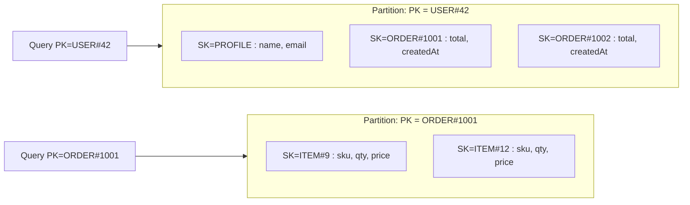
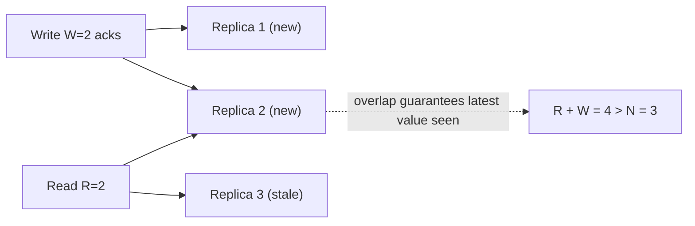
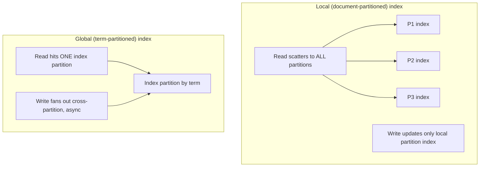
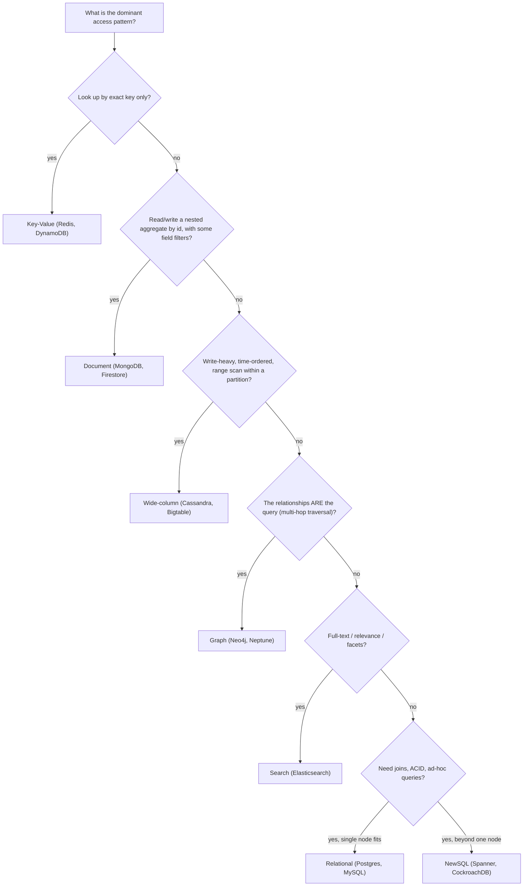

# NoSQL & Choosing a Data Model

> **Where this fits:** This sits right after [Relational Databases](07-databases-relational.md) and leans hard on [Storage Engines](../00-foundations/03-storage-engines.md), [Partitioning & Sharding](10-partitioning-sharding.md), and [Consistency Models, CAP & PACELC](../02-distributed-systems/12-consistency-and-cap.md). NoSQL is not a database — it's a label for "everything that gave up some part of the relational contract to buy something else."
>
> **Principal-level takeaway:** You do not choose a database because it "scales." You choose a *data model* that matches your dominant *access pattern*, then choose an engine that serves that model at your required scale and consistency. "NoSQL scales" is a property of how the data is partitioned and what guarantees were dropped — not a free lunch. The thing you almost always trade away is **ad-hoc query flexibility and joins**, and you must be certain you don't need them at the moment you decide.

---

## The Mental Model — first principles: why does this thing exist?

A relational database is a remarkable bargain. You declare your data once, normalized into tables, and then ask *any question you can think of later* via SQL — joins, aggregates, filters — and the query planner figures out how to answer it efficiently using B-tree indexes. You get ACID transactions, foreign keys, and a 50-year-old query language that every tool understands. (See [Relational Databases](07-databases-relational.md) for the machinery.)

That bargain has two costs that became unbearable around 2007–2010 at companies like Amazon, Google, and Facebook:

1. **Joins and transactions assume the data is co-located.** A join is cheap when both rows live on the same machine. Once your dataset doesn't fit on one box and you shard it (see [Partitioning & Sharding](10-partitioning-sharding.md)), a join may need to fetch rows from many machines. A multi-row transaction may need a distributed two-phase commit. These get slow and fragile exactly as you grow.
2. **The relational model optimizes for flexible reads, not for write throughput or one specific hot read path.** If 99% of your traffic is "give me the shopping cart for user X," paying for a general-purpose query planner and a B-tree on every access is overkill.

NoSQL is the family of answers to: *"What if we knew the queries in advance, and were willing to give up the others, in exchange for horizontal scale, predictable latency, and/or a data shape that fits the problem?"*

The single most important reframe — and the thing junior engineers miss — is this:

> **In relational modeling, you model the *entities* (normalize, then query). In NoSQL modeling, you model the *queries* (figure out every access pattern first, then design storage to serve them with a single cheap lookup).**

Everything below is a consequence of that reframe.

---

## Core Concepts

### The families, and what each is actually good at

There is no "NoSQL." There are several distinct data models, each with a different shape and a different sweet spot.

#### Key–Value (Redis, DynamoDB, Memcached, etcd)

The simplest model: an opaque value addressed by a key. The store knows nothing about the value's structure, so the *only* efficient operation is `get(key)` / `put(key, value)`. This buys you a near-perfect partitioning story — hash the key, route to a node (see [Consistent Hashing](05-load-balancing.md)) — which is why key–value stores scale linearly and serve sub-millisecond reads.

> **Interactive:** [Consistent Hashing (interactive)](../animations/consistent-hashing.html) -- add and remove nodes on the ring and watch how few keys remap compared to plain modulo hashing.

Use it when your access is genuinely "look up by primary key": session stores, feature flags, caches, shopping carts, rate-limiter counters. Redis adds rich *value* types (sorted sets, hyperloglogs, streams) that turn it into a Swiss-army knife for leaderboards, queues, and approximate counting — but the addressing is still by key.

#### Document (MongoDB, Couchbase, DynamoDB's document side, Firestore)

A value that the database *can* see into: a JSON/BSON document with nested fields, addressed by an ID. Because the engine understands the structure, you can index secondary fields and run filters (`find({status: "active", age: {$gt: 30}})`). The win is that a document can hold a whole aggregate — an order with its line items nested inside — so the common read is one lookup with no join.

Use it when your data is naturally hierarchical and you read/write it as a unit: content/catalog data, user profiles, CMS, event payloads, "anything that's basically a JSON blob with some queryable fields." The trap (below) is treating it like a relational DB and spreading one logical thing across many documents that you then have to "join" in application code.

#### Wide-column (Apache Cassandra, Google Bigtable, HBase, ScyllaDB)

The most misunderstood family. It is *not* "a table with lots of columns." The data model is a **partition key → rows, each row a sorted map of columns**. You design the primary key as `(partition_key, clustering_key)`: the partition key decides which node owns the data; the clustering key decides the *sort order on disk within that partition*. That means a single partition is a pre-sorted, pre-grouped slice you can scan in one sequential read.

This is built on an **LSM-tree** storage engine (see [Storage Engines](../00-foundations/03-storage-engines.md)), which is optimized for high write throughput: writes go to an in-memory memtable + append-only commit log, then flush to immutable SSTables. You get enormous write rates and time-ordered range scans within a partition essentially for free.

Use it for write-heavy, time-ordered, or fan-out workloads at scale: event logs, IoT/sensor data, messaging history, feed/timeline storage (see [News Feed / Timeline](../04-design-case-studies/23-news-feed-and-timeline.md)), audit trails. The price: you must know your query at table-design time, because you can only efficiently query along the key you partitioned and sorted by.

#### Graph (Neo4j, Amazon Neptune, JanusGraph, TigerGraph)

Nodes and edges as first-class citizens, with "index-free adjacency" — each node holds direct pointers to its neighbors, so traversing a relationship is O(1) per hop rather than a join + index lookup. Querying with Cypher/Gremlin/SPARQL, you can ask "friends-of-friends who like X within 3 hops" cheaply, a query that becomes a catastrophic multi-self-join in SQL.

Use it when *the relationships are the data*: fraud rings, recommendation graphs, social networks (the *graph queries*, not necessarily the timeline storage), identity/permission graphs, knowledge graphs. Don't use it as a general data store — graph DBs are typically harder to shard and lower-throughput than the families above.

#### Time-series (InfluxDB, TimescaleDB, Prometheus, Amazon Timestream)

Specialized for `(metric, tags, timestamp) → value` with append-only writes, time-window queries, downsampling/rollups, and retention/TTL. Often built as a wide-column or columnar engine under the hood with delta-of-delta + dictionary compression that squeezes metric data 10–20×. Use it for monitoring/metrics (see [Observability](../03-architecture-and-apis/19-observability.md)), financial ticks, telemetry. TimescaleDB is notable for being Postgres under the hood — you keep SQL.

#### Search (Elasticsearch / OpenSearch, Solr)

Built on an **inverted index** (term → list of documents containing it), the inverse of a B-tree. This is what makes full-text search, relevance ranking (BM25/TF-IDF), fuzzy matching, faceting, and aggregations fast. It is *not* a system of record — it's a denormalized, eventually-consistent read index you populate *from* your primary store. Use it for search bars, log analytics, and analytical dashboards over text. (See [Typeahead / Search](../04-design-case-studies/25-search-and-geo.md).)

### Single-table design in DynamoDB

DynamoDB is a key–value/document store where every item lives in a partition chosen by its **partition key (PK)** and is sorted within that partition by its **sort key (SK)**. The only cheap operations are: get one item by `(PK, SK)`, or `Query` a range of SKs *within a single PK*. There are no joins.

The counterintuitive expert technique is **single-table design**: instead of one table per entity (Users, Orders, OrderItems), you put *all* entity types in *one* table and overload the keys so that the items you read together share a partition. Example for an e-commerce app:

```
PK                 SK                   attributes
USER#42            PROFILE              name, email
USER#42            ORDER#1001           total, createdAt
USER#42            ORDER#1002           total, createdAt
ORDER#1001         ITEM#9               sku, qty, price
ORDER#1001         ITEM#12              sku, qty, price
```

Visually, the keys are chosen so that everything you read together lands in the same partition, pre-sorted by sort key:



Now "get user 42 and all their orders" is a *single* `Query` on `PK = USER#42` — one round trip, one partition, no join. The keys are deliberately encoded (`USER#`, `ORDER#`) so different entities coexist and adjacency on disk = adjacency in your access pattern. This is the purest expression of "model the queries, not the entities." It's powerful and genuinely hard to evolve — you must enumerate access patterns up front, and adding a new one often means adding a secondary index or backfilling.

### Eventual consistency and tunable consistency (R + W > N)

Once data is replicated across N copies for availability (see [Replication](09-replication.md)), CAP forces a choice: when the network partitions, do you stay available (and possibly return stale data) or stay consistent (and reject the request)? Most NoSQL stores in the Dynamo lineage chose **AP — eventual consistency**: a write may not be visible on all replicas immediately, but if writes stop, all replicas converge. (See [Consistency, CAP & PACELC](../02-distributed-systems/12-consistency-and-cap.md) for why this is unavoidable, and PACELC for the latency cost *even without* partitions.)

Cassandra and Dynamo-style systems make this a *per-query knob*. With **N** replicas, a read consults **R** of them and a write must be acknowledged by **W** of them. The classic rule:

```
If R + W > N, then any read quorum overlaps any write quorum,
              so a read is guaranteed to see the latest acknowledged write
              (strong / quorum consistency for that operation).
If R + W <= N, you get lower latency / higher availability,
              but reads may be stale (eventual).
```

The intuition is pigeonhole: with `N=3`, if a write lands on `W=2` replicas and a read consults any `R=2`, the two sets *must* share at least one replica, so the read is guaranteed to touch a copy that has the latest acknowledged value.



> **Interactive:** [Quorum Reads & Writes (R + W > N) (interactive)](../animations/quorum.html) -- slide R and W up and down and watch the overlap appear and vanish as the sum crosses N.

With `N=3`:
- `W=3, R=1` → fast reads that are strongly consistent (a *successful* write is on all 3, so any single read sees it), but writes are fragile: one replica down means the write can't reach W=3 and fails.
- `W=1, R=1` → fastest, weakest; classic eventual consistency.
- `W=2, R=2` → `R+W=4 > 3` → quorum consistency, tolerates one node down on each side. **This is the usual default.**

> **Nuance the textbook rule hides:** `R + W > N` guarantees you *read the latest value*, but it does **not** by itself give you isolation or prevent conflicting concurrent writes. Cassandra resolves concurrent writes by **last-write-wins (LWW) using timestamps**, which silently drops data if clocks are skewed (see [Time & Clocks](../02-distributed-systems/14-time-clocks-ordering.md)). Dynamo originally used vector clocks and pushed conflict resolution to the client. Quorum reads are *not* serializable transactions.

To make the mechanics concrete, here is a small tunable-consistency coordinator. It fans a read or write out to N replicas concurrently, waits for the first R (or W) acknowledgements, and decides whether the configured quorum is "strong" by checking `R + W > N`. On reads, it resolves divergent replica values by last-write-wins on a version/timestamp — exactly the trade-off Cassandra makes.

**Tunable-consistency read/write coordinator (R / W / N, with the R + W > N check)**

```go
package quorum

import (
	"context"
	"errors"
	"sort"
	"time"
)

// VersionedValue is what each replica stores: a value plus the timestamp
// used for last-write-wins conflict resolution.
type VersionedValue struct {
	Value     string
	Timestamp int64 // higher wins
}

// Replica is one storage node.
type Replica interface {
	Get(ctx context.Context) (VersionedValue, error)
	Put(ctx context.Context, v VersionedValue) error
}

// Coordinator implements tunable consistency over N replicas.
type Coordinator struct {
	Replicas []Replica
	R, W     int
}

// StronglyConsistent reports whether R + W > N, i.e. read and write
// quorums are guaranteed to overlap on at least one replica.
func (c *Coordinator) StronglyConsistent() bool {
	return c.R+c.W > len(c.Replicas)
}

type getResult struct {
	v   VersionedValue
	err error
}

// Read fans out to all replicas, waits for R successes, and returns the
// value with the highest timestamp (last-write-wins).
func (c *Coordinator) Read(ctx context.Context) (VersionedValue, error) {
	if c.R > len(c.Replicas) {
		return VersionedValue{}, errors.New("R exceeds replica count")
	}
	results := make(chan getResult, len(c.Replicas))
	for _, r := range c.Replicas {
		go func(r Replica) {
			v, err := r.Get(ctx)
			results <- getResult{v, err}
		}(r)
	}

	var got []VersionedValue
	for i := 0; i < len(c.Replicas); i++ {
		res := <-results
		if res.err != nil {
			continue
		}
		got = append(got, res.v)
		if len(got) >= c.R {
			break // R acks is enough
		}
	}
	if len(got) < c.R {
		return VersionedValue{}, errors.New("read quorum not reached")
	}
	sort.Slice(got, func(i, j int) bool { return got[i].Timestamp > got[j].Timestamp })
	return got[0], nil // newest by timestamp
}

// Write fans out to all replicas and succeeds once W acknowledge.
func (c *Coordinator) Write(ctx context.Context, value string) error {
	if c.W > len(c.Replicas) {
		return errors.New("W exceeds replica count")
	}
	v := VersionedValue{Value: value, Timestamp: time.Now().UnixNano()}
	errs := make(chan error, len(c.Replicas))
	for _, r := range c.Replicas {
		go func(r Replica) { errs <- r.Put(ctx, v) }(r)
	}
	acks := 0
	for i := 0; i < len(c.Replicas); i++ {
		if err := <-errs; err == nil {
			if acks++; acks >= c.W {
				return nil // W acks is enough
			}
		}
	}
	return errors.New("write quorum not reached")
}
```

```java
import java.util.*;
import java.util.concurrent.*;

public final class QuorumCoordinator {

    /** What each replica stores: value plus timestamp for last-write-wins. */
    public record VersionedValue(String value, long timestamp) {}

    public interface Replica {
        VersionedValue get() throws Exception;
        void put(VersionedValue v) throws Exception;
    }

    private final List<Replica> replicas;
    private final int r;
    private final int w;
    private final ExecutorService pool;

    public QuorumCoordinator(List<Replica> replicas, int r, int w) {
        this.replicas = List.copyOf(replicas);
        this.r = r;
        this.w = w;
        this.pool = Executors.newVirtualThreadPerTaskExecutor();
    }

    /** R + W > N: read and write quorums are guaranteed to overlap. */
    public boolean isStronglyConsistent() {
        return r + w > replicas.size();
    }

    /** Fan out to all replicas, wait for R successes, return newest by timestamp. */
    public VersionedValue read() throws Exception {
        if (r > replicas.size()) throw new IllegalArgumentException("R exceeds replica count");
        var futures = replicas.stream()
                .map(rep -> CompletableFuture.supplyAsync(() -> {
                    try { return rep.get(); } catch (Exception e) { return null; }
                }, pool))
                .toList();

        List<VersionedValue> got = new ArrayList<>();
        for (var f : futures) {
            VersionedValue v = f.get();
            if (v != null) got.add(v);
            if (got.size() >= r) break; // R acks is enough
        }
        if (got.size() < r) throw new IllegalStateException("read quorum not reached");
        return got.stream()
                .max(Comparator.comparingLong(VersionedValue::timestamp))
                .orElseThrow(); // last-write-wins
    }

    /** Fan out to all replicas, succeed once W acknowledge. */
    public void write(String value) throws Exception {
        if (w > replicas.size()) throw new IllegalArgumentException("W exceeds replica count");
        var v = new VersionedValue(value, System.nanoTime());
        var futures = replicas.stream()
                .map(rep -> CompletableFuture.supplyAsync(() -> {
                    try { rep.put(v); return true; } catch (Exception e) { return false; }
                }, pool))
                .toList();

        int acks = 0;
        for (var f : futures) {
            if (Boolean.TRUE.equals(f.get()) && ++acks >= w) return; // W acks is enough
        }
        throw new IllegalStateException("write quorum not reached");
    }
}
```

With `N=3`, constructing the coordinator with `R=2, W=2` makes `StronglyConsistent()`/`isStronglyConsistent()` return true (4 > 3); dropping to `R=1, W=1` returns false — the same knob the design discussion below tunes per access path.

### Secondary indexes in distributed stores — and why they cost so much

In a single-node relational DB, adding an index is cheap and obviously worth it. In a *partitioned* store it's a genuine architectural decision, because the index must itself be partitioned, and there are only two ways to do it:

- **Local (document-partitioned) index:** each node indexes only its own data. Writes stay local and cheap. But a query on the indexed field doesn't know which partitions have matches, so it must **scatter-gather** across *all* partitions and merge — latency grows with cluster size and tail latency dominates. Cassandra's built-in secondary indexes and a MongoDB secondary index on a sharded collection (when the query doesn't include the shard key) work this way (Cassandra's are notorious for poor performance on high-cardinality fields for exactly this reason). Don't confuse this with DynamoDB's *Local Secondary Index*, which is "local" in a different sense — it shares the base table's partition key and only adds an alternate sort key, so a query stays within one partition and can even be strongly consistent.
- **Global (term-partitioned) index:** the index is partitioned by the indexed term, so a read hits one partition. But now a single write may have to update an index partition on a *different* node — making writes a distributed, asynchronous operation that is **eventually consistent with the base table**. DynamoDB's *Global Secondary Index (GSI)* works this way: GSIs are async, so a read on a GSI right after a write can miss it.

The two strategies push the cost onto opposite sides of the workload — reads pay in the local scheme, writes pay in the global scheme:



The principal point: **a secondary index in a distributed store is not free and not strongly consistent by default.** Every index you add either taxes reads (scatter-gather) or taxes writes (cross-partition fan-out + staleness). DDIA Chapter 6 covers this trade-off precisely.

### NewSQL / distributed SQL — can you have both?

For a decade the framing was "relational *or* scale, pick one." NewSQL broke that. **Google Spanner**, **CockroachDB**, **YugabyteDB**, and **TiDB** are horizontally-sharded systems that still give you SQL, joins, secondary indexes, and *serializable* distributed transactions. They achieve it with consensus (Paxos/Raft — see [Consensus](../02-distributed-systems/13-consensus.md)) per shard plus a transaction coordinator, and a global ordering of time. Spanner's TrueTime uses GPS + atomic clocks to bound clock uncertainty and `commit-wait` out the ambiguity; CockroachDB approximates this with hybrid logical clocks and NTP.

The catch is in PACELC: even with no partition, cross-shard transactions pay a coordination/latency tax (multiple round trips, commit-wait). Spanner trades latency for consistency. **Vitess** (which scales MySQL, used by YouTube/Slack/GitHub) is a different flavor — it shards MySQL horizontally while keeping the MySQL protocol, but it does *not* give you free cross-shard transactions; you design around the sharding key just like in NoSQL.

NewSQL is the right answer when you genuinely need both relational semantics *and* horizontal scale — e.g., a global financial ledger (see [Payments & Ledgers](../04-design-case-studies/27-payments-and-ledgers.md)). It is the wrong answer when a single Postgres with read replicas would do, because you'd pay the coordination tax for scale you don't have.

### Polyglot persistence

The mature conclusion of all of the above: **one application uses several stores, each for the access pattern it fits.** A single product might run Postgres for orders/billing (transactions), Redis for sessions/cache, Elasticsearch for the search bar, Cassandra for the activity feed, and S3 for media. This is *polyglot persistence*. The cost is operational complexity and the hard problem of keeping the stores consistent — typically solved with **Change Data Capture (CDC)** streaming the system-of-record's changelog into the derived stores (see [Messaging & Streaming](11-messaging-and-streaming.md)). The principle: **derive, don't dual-write.** Pick one system of record; everything else is a read-optimized projection rebuilt from it.

---

## Trade-offs at a Glance

| Model | Data shape | Best access pattern | Scaling story | Strong suits | Weak / avoid | Named examples |
|---|---|---|---|---|---|---|
| Key–value | opaque blob by key | get/put by exact key | excellent (hash key) | sub-ms, simple, linear scale | no queries on value | Redis, DynamoDB, etcd |
| Document | self-describing JSON | read/write an aggregate by id; some field filters | good | flexible schema, nested data | joins across docs, ad-hoc analytics | MongoDB, Firestore, Couchbase |
| Wide-column | (partition, clustering)→sorted cols | huge write rate; range scan within partition | excellent (LSM + partitions) | write throughput, time-ordered data | ad-hoc queries, high-cardinality secondary indexes | Cassandra, Bigtable, HBase |
| Graph | nodes + edges | multi-hop relationship traversal | poor–moderate | relationship queries | bulk scans, easy sharding | Neo4j, Neptune |
| Time-series | (metric, tags, ts)→value | time-window scans, rollups | good | compression, retention/TTL | non-time queries | InfluxDB, Prometheus, Timescale |
| Search | inverted index | full-text, relevance, facets | good | text/relevance/aggregations | system of record, strong consistency | Elasticsearch, Solr |
| Relational | normalized tables | *any* query, joins, ACID | vertical; sharding is manual | flexibility, transactions, maturity | naive horizontal scale | Postgres, MySQL |
| NewSQL / distributed SQL | tables, sharded | SQL + txns at scale | excellent (consensus per shard) | both worlds | latency tax, operational complexity | Spanner, CockroachDB, Vitess |

---

## How Real Systems Do It

- **Amazon DynamoDB** is the productized descendant of the 2007 Dynamo paper. It guarantees **single-digit-millisecond** reads at any scale by hashing the partition key and capping each physical partition at ~10 GB / 3,000 read-units / 1,000 write-units; exceed that and it auto-splits. There are *no joins* — Amazon's own engineers use single-table design. The cost model (RCU/WCU or on-demand) makes the access-pattern discipline financial, not just architectural.
- **Apache Cassandra / ScyllaDB** run masterless: every node is equal, data is placed by consistent hashing on a token ring, and clients tune consistency per query (`LOCAL_QUORUM` is the production default for multi-DC). Discord stored *trillions* of messages, first on Cassandra then migrating to ScyllaDB (a C++ rewrite of Cassandra) to cut tail latency and node count. Apple runs Cassandra at a scale few match — on the order of hundreds of thousands of nodes spread across thousands of clusters (individual clusters in the ~1,000-node range).
- **Google Bigtable / Spanner**: Bigtable (2006 paper) is the wide-column workhorse behind Search, Maps, and Gmail indexing — sparse, sorted, three-dimensional `(row, column, timestamp)` map. Spanner came later to add SQL + external-consistency transactions across continents, powering AdWords and Google's financial systems.
- **MongoDB** is the dominant document store; modern versions added multi-document ACID transactions (replica sets in 4.0/2018, sharded clusters in 4.2/2019) and made the default *write* concern `w: majority` (5.0), blurring the old "NoSQL has no transactions" line — note the default *read* concern is still `local`, so majority-durable writes don't automatically mean linearizable reads. Its sweet spot is still aggregate-shaped data.
- **Discord / feeds**: timeline and message stores classically use wide-column (Cassandra) for the write-heavy fan-out; the *graph* of who-follows-whom may live elsewhere; search lives in Elasticsearch. That's polyglot persistence in one product.
- **Netflix** runs Cassandra at massive scale for viewing history and uses EVCache (Memcached) heavily, while keeping relational stores for billing.

---

## Failure Modes & Common Misconceptions

**Myth 1: "NoSQL scales, SQL doesn't."** False on both ends. A single Postgres instance comfortably serves tens of thousands of TPS and terabytes; many companies never outgrow it. And NoSQL "scales" only *if your access pattern matches the partitioning* — a Cassandra query that doesn't hit the partition key, or a Mongo aggregation across shards, is slow and can take the cluster down. NoSQL scales the *write/known-read path*; it actively *removes* the scalable ad-hoc query.

**Myth 2: "NoSQL means schemaless, so I don't have to design."** The schema didn't disappear — it moved from the database into your application code, and you lost the DB's enforcement of it. You *do* design, harder, and *earlier*: you must enumerate every access pattern before you choose keys, because in DynamoDB/Cassandra the key choice is nearly irreversible without a full migration.

**Myth 3: "Eventual consistency means data is wrong."** No — it means *temporarily* stale, converging to correct, usually within milliseconds. The real risk is reasoning errors: assuming **read-your-own-writes** when you haven't configured for it, or building business logic that breaks on stale reads (e.g., "is this username taken?" over an eventually-consistent index).

**Production failure — the hot partition / hot key.** The number-one NoSQL outage. If your partition key is low-cardinality or skewed (e.g., partition by `country` and 60% of users are in one country, or use a monotonically increasing timestamp as the partition key so all *current* writes hit one node), one partition gets all the traffic while the cluster sits idle. DynamoDB throttles you; Cassandra develops a hot node with runaway tail latency. Fix: choose high-cardinality keys, and add a salt/bucket suffix to spread hot keys.

**Production failure — unbounded partitions & tombstones.** A Cassandra partition that grows without limit (e.g., all events for a never-ending entity in one partition) eventually can't be compacted or read. Deletes write *tombstones* (markers) rather than removing data; scanning over millions of tombstones before they're compacted away causes timeouts and is a classic Cassandra footgun.

**Misconception — "we'll just add an index later."** As covered above, distributed secondary indexes cost reads or writes and may be eventually consistent. "Add an index" is a single-node reflex; in a partitioned store it can change your write throughput or latency profile materially.

**Misconception — using the search index as the source of truth.** Elasticsearch will silently drop or lag on writes and has no transactions. Treat it as a rebuildable projection, never the system of record.

---

## In a Design Discussion

When you're whiteboarding and someone says "let's use a NoSQL database," the move is to *refuse the abstraction* and ask for the access patterns. List them: "read user by id," "list a user's last 50 orders newest-first," "full-text search products," "count events per hour." *Then* the model picks itself.

Concretely, the access pattern walks you down a decision tree to a family — the model isn't a taste preference, it's the cheapest structure that serves your dominant query:



**Junior take:** "We'll have millions of users, so we need NoSQL — let's use MongoDB because it's flexible and scales." (Chose a product before knowing a single query; conflated flexibility with scale; assumed scale they may not have.)

**Principal take:** "Our dominant pattern is 95% point-reads of a user's cart by user id, plus an append-heavy event log. The cart is a key–value get — DynamoDB or Redis with single-digit-ms latency. The event log is write-heavy and time-ordered — that's a wide-column fit, Cassandra, partitioned by `(user_id, day)` with the timestamp as clustering key so a day's events scan sequentially, and I'll bucket by day to bound partition size. Billing stays in Postgres because it needs real transactions; we're nowhere near outgrowing one node, so distributed SQL is premature. Search goes to Elasticsearch fed by CDC off Postgres — derived, not dual-written. For the feed we accept eventual consistency with `LOCAL_QUORUM`; the one place we need read-your-writes is the username-uniqueness check, so that goes through the transactional store, not the eventual index."

Notice what the principal did: started from queries, mapped each to a model, named the consistency level *per path*, pre-empted the hot-partition failure with the key design, and refused to over-engineer (Postgres stays). They also stated the cost out loud — giving up ad-hoc joins — instead of pretending it's free.

A good ADR for this (see [Trade-offs & ADRs](../05-principal-skills/29-tradeoffs-and-adrs.md)) records exactly *which queries* the choice serves and which it forecloses, so the next engineer knows the boundary before they try to add a join.

---

## Self-Check

<details>
<summary>1. Why is "model the queries, not the entities" the central rule of NoSQL data modeling?</summary>
Because most NoSQL stores can only serve queries that align with how the data is partitioned and sorted (the key). There's no general query planner or cheap join to rescue an unanticipated query, so you must design storage so each access pattern is a single cheap lookup. Get the keys wrong and the query is impossible or requires a full migration.
</details>

<details>
<summary>2. With N=3 replicas, give a read/write quorum that's strongly consistent and one that's eventually consistent, and explain.</summary>
`W=2, R=2` → R+W=4 > 3, so read and write quorums overlap on at least one replica → the read sees the latest write (quorum/strong). `W=1, R=1` → R+W=2 ≤ 3, no guaranteed overlap → reads may be stale (eventual). Caveat: even R+W>N doesn't give isolation or stop conflicting concurrent writes (LWW/clock issues remain).
</details>

<details>
<summary>3. What's the difference between a local and a global secondary index in a distributed store, and what does each cost?</summary>
Local (document-partitioned): each node indexes its own data → cheap writes, but reads must scatter-gather across all partitions. Global (term-partitioned, e.g., DynamoDB GSI): index partitioned by the term → single-partition reads, but writes fan out cross-partition and the index is eventually consistent with the base table.
</details>

<details>
<summary>4. Your Cassandra table is partitioned by a timestamp. What goes wrong?</summary>
A monotonically increasing partition key means all *current* writes hit the same partition/node → a hot partition: one node saturates while the rest idle, tail latency spikes. Fix: partition by a high-cardinality key (e.g., user/device id, or bucket the time coarsely and combine with another dimension) and use the fine timestamp as the clustering key.
</details>

<details>
<summary>5. When does NewSQL (Spanner/CockroachDB) beat both Postgres and Cassandra?</summary>
When you genuinely need *both* relational semantics (joins, serializable transactions) *and* horizontal scale beyond a single node — e.g., a globally distributed ledger. If a single Postgres + read replicas suffices, NewSQL just adds a latency/coordination tax (PACELC) you don't need to pay.
</details>

<details>
<summary>6. Why should Elasticsearch never be your system of record?</summary>
It's an eventually-consistent, denormalized inverted index with no real transactions and the ability to drop/lag writes. Treat it as a rebuildable read projection fed (ideally via CDC) from a durable system of record.
</details>

<details>
<summary>7. A teammate says single-table DynamoDB design is "premature optimization." When are they right, and when wrong?</summary>
Right if access patterns are still churning and you're early — the rigidity of overloaded keys hurts when requirements move. Wrong once patterns are stable and you need single-round-trip reads of related items at scale: that's exactly what single-table design buys, and bolting it on later means a backfill/migration.
</details>

<details>
<summary>8. What's the honest, one-sentence cost of going NoSQL?</summary>
You trade ad-hoc query flexibility, joins, and (often) strong multi-object transactions for horizontal scale, predictable latency on known paths, high write throughput, and/or a data shape that fits the problem.
</details>

---

## Go Deeper

- **Designing Data-Intensive Applications (Kleppmann)** — Ch. 2 (data models: relational vs document vs graph), Ch. 5 (replication), **Ch. 6 (partitioning, incl. local vs global secondary indexes)**, Ch. 7 (transactions), Ch. 9 (consistency & consensus). The single best companion to this chapter.
- **Dynamo: Amazon's Highly Available Key-value Store** (DeCandia et al., 2007) — the paper that launched consistent hashing + quorums + eventual consistency in production. Still essential.
- **Bigtable: A Distributed Storage System for Structured Data** (Chang et al., 2006) — the wide-column model.
- **Spanner: Google's Globally-Distributed Database** (Corbett et al., 2012) — TrueTime and how you get external consistency at planetary scale.
- **Cassandra docs on data modeling** and **AWS's "The DynamoDB Book" (Alex DeBrie)** — the practical bibles for wide-column and single-table design respectively.
- Sibling writeups: [Storage Engines](../00-foundations/03-storage-engines.md) (LSM vs B-tree — *why* Cassandra writes fast), [Consistency, CAP & PACELC](../02-distributed-systems/12-consistency-and-cap.md), [Replication](09-replication.md), [Partitioning & Sharding](10-partitioning-sharding.md), [Distributed Transactions & Sagas](../02-distributed-systems/15-distributed-transactions.md), and the [Dynamo KV-store case study](../04-design-case-studies/26-object-store-and-kv-store.md). Back to [the index](../README.md) / [roadmap](../ROADMAP.md).
