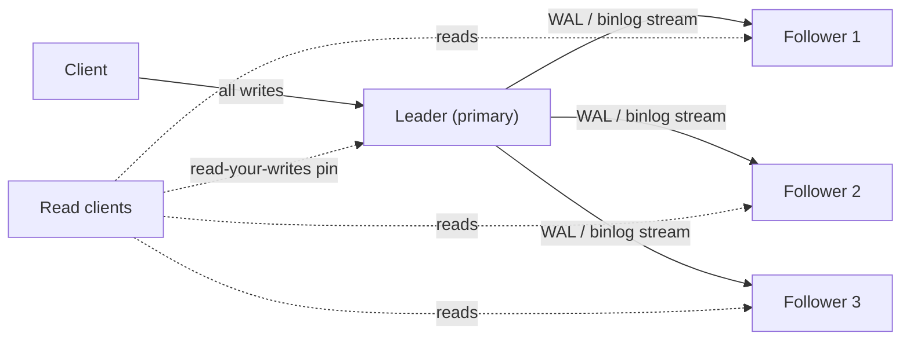
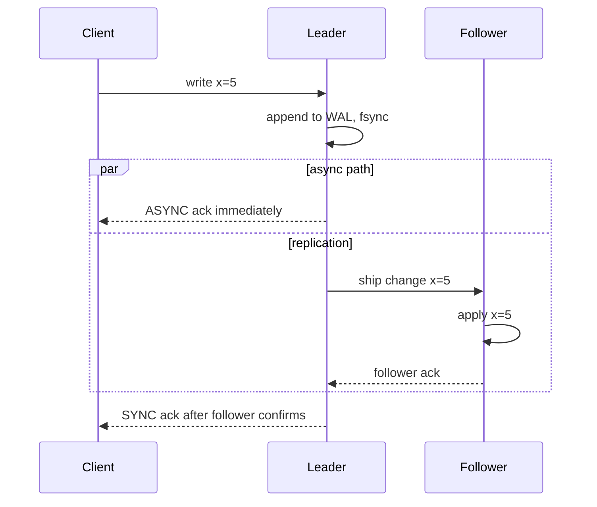
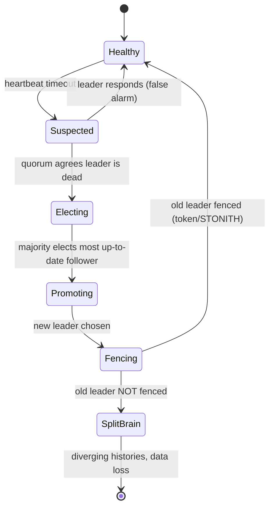
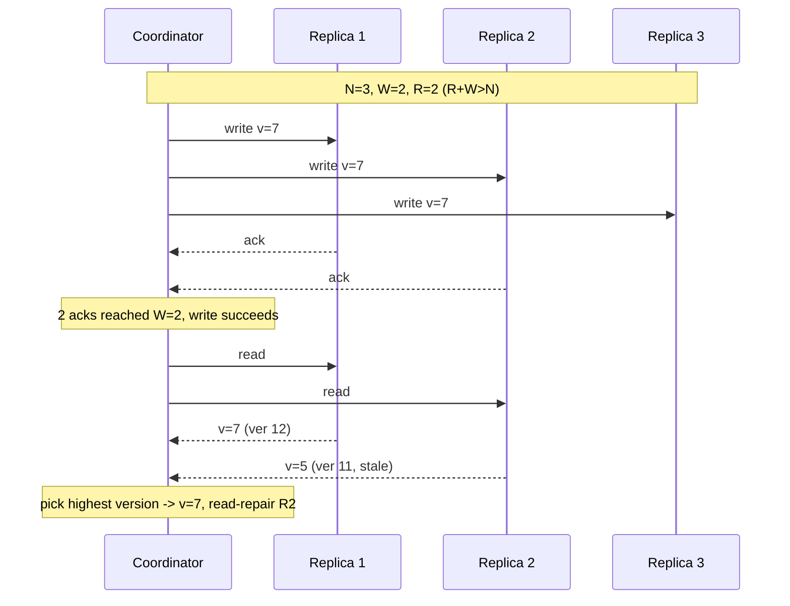
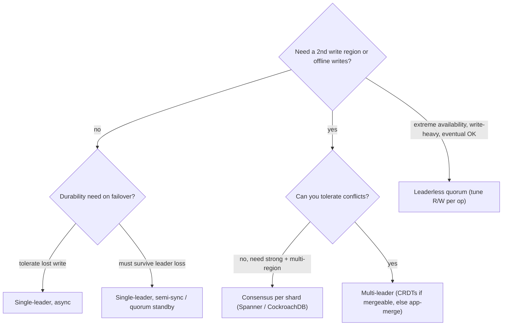

# Replication: Copies, Consistency & Failover

> Where this fits: replication is the layer that turns one machine's data into many copies so the system survives hardware death, serves reads at scale, and lives close to users — but every copy you add is a copy that can disagree with the others.
>
> **Principal-level takeaway:** Replication is not a reliability feature you bolt on; it is a *consistency contract* you sign. The moment a second copy exists, you have chosen a position on a spectrum from "always agrees, sometimes unavailable" to "always available, sometimes wrong" — and you pay for that choice on every single read and write. Decide the contract first, then pick the topology that enforces it.

---

## The Mental Model — first principles

Start with one database on one machine. It has a clean property: there is exactly one copy of every fact, so reads and writes are trivially consistent. Whatever you wrote last is what you read next. That single machine is also a single point of failure (lose the disk, lose everything), a single throughput ceiling (one box's CPU and IOPS), and a single location (a user in Sydney pays ~200 ms round-trip to your box in Virginia — physics, not your code).

Replication is the act of keeping a copy of the same data on more than one node. You do it for four distinct reasons, and conflating them is the first mistake juniors make:

1. **High availability (HA).** If a node dies, another already has the data and can take over. This is about *uptime*, not data loss.
2. **Durability.** A write that exists on three disks in three failure domains survives the loss of any one of them. This is about *not losing committed data*.
3. **Read scaling.** Reads can be served by any copy, so N replicas can serve roughly N× the read throughput of one node. (Writes do *not* scale this way — every replica must apply every write.)
4. **Geo-locality / latency.** A copy near the user serves reads at single-digit milliseconds instead of cross-continent round-trips.

Here is the catch that the entire chapter orbits: **the data being replicated changes.** A static photo is trivial to copy. A bank balance that is being written to right now is not. The instant you have multiple copies of mutable data, you face a physics problem: information takes time to propagate between nodes, and during that window the copies *disagree*. Everything below — leaders, quorums, CRDTs, failover — is machinery for managing that disagreement. The discipline that names the guarantees you can offer is **consistency models**, covered in [Consistency Models, CAP & PACELC](../02-distributed-systems/12-consistency-and-cap.md); this chapter is the *mechanics* that produce those guarantees.

> Replication ≠ partitioning. Replication makes *copies of the same data*. Partitioning (sharding) splits *different data* across nodes. Real systems do both: shard for capacity, replicate each shard for safety. See [Partitioning & Sharding](../01-building-blocks/10-partitioning-sharding.md). This chapter is purely about copies.

---

## Core Concepts

### Single-leader replication (the workhorse)

One node is designated the **leader** (primary/master). All writes go to the leader. The leader applies the write to its own storage, then ships a stream of changes to its **followers** (replicas/secondaries), which apply them in the same order. Reads can be served by the leader or any follower.

This is what Postgres, MySQL, MongoDB (replica sets), and most SQL deployments do by default. It is popular because it is *simple to reason about*: there is exactly one place where write ordering is decided, so there are no write conflicts. The mechanism is usually a replication log — Postgres ships WAL records, MySQL ships binlog events. (The write-ahead log is the same structure your storage engine already keeps for crash recovery; see [Storage Engines](../00-foundations/03-storage-engines.md).)

First, the topology itself: one write path in, many read paths out.



The fundamental design choice is *when the leader considers a write done*. The diagram below shows both acknowledgement points on one timeline — the async ack fires before the follower has confirmed, the sync ack waits for it:



- **Asynchronous:** the leader acks the client as soon as its own write is durable, without waiting for followers. *Fast* (write latency = leader's latency) but *unsafe*: if the leader's disk dies after acking but before a follower received the write, that committed write is **lost forever**. This is the default in most systems because the performance is too good to give up.
- **Synchronous:** the leader waits for at least one follower to confirm before acking. *Safe* (the write survives leader death) but *slow and fragile*: write latency now includes a network round-trip to the follower, and if that follower is down or slow, writes **block**. Making *all* followers synchronous is almost never done — one slow replica freezes the whole cluster.
- **Semi-synchronous (the pragmatic middle):** at least one follower is synchronous; the rest are async. You get durability (the acked write exists on ≥2 nodes) without the latency of waiting for everyone. If the sync follower falls behind or dies, the leader promotes another follower to be the synchronous one. MySQL's `rpl_semi_sync` is the direct implementation; Postgres approximates it with `synchronous_standby_names` in quorum mode (`ANY 1 (s1,s2,s3)` waits for any one of the listed standbys — naming a *single* standby instead makes it block fully if that one is down). **This is the single most important practical knob in single-leader replication.**

#### Replication lag and the read consistency problems

With async (or any) replication, followers are *behind* the leader by some amount — the **replication lag**. Under normal load this is milliseconds; under heavy write load, long transactions, or network hiccups it can balloon to seconds or minutes. Lag is where the famous consistency anomalies live. A principal engineer knows these by name because they each have a specific fix:

- **Read-your-own-writes (read-after-write).** A user posts a comment (write to leader), then reloads the page (read from a lagging follower) and their comment is *gone*. Infuriating and common. **Fixes:** route a user's reads to the leader for a short window after they write; or pin reads to the leader for data the user themselves can modify (their own profile); or track the write's log position (LSN) on the client and only read from a follower that has caught up to it.
- **Monotonic reads.** A user reads from follower A (which is caught up, sees the comment), then their next read hits follower B (which lags, comment gone) — they see time *go backwards*. **Fix:** make each user always read from the same replica (e.g., hash the user ID to a replica), so they never see an older state than they already saw.
- **Consistent prefix reads.** An observer sees an answer before the question it answers, because the two writes went to different partitions replicating at different speeds. **Fix:** ensure causally related writes go to the same partition, or use a system that tracks causal dependencies.

These three — read-your-writes, monotonic reads, consistent prefix — are precisely the guarantees that sit *between* "eventual" and "strong" consistency. Knowing which one a given UX actually requires is the judgment, not memorizing the list.

### Failover and the split-brain demon

When the leader dies, someone must promote a follower to be the new leader. This is **failover**, and it is where replication systems earn their reputation or lose your data.

> **Interactive:** [Leader-Follower Replication & Failover (interactive)](../animations/replication-failover.html) -- kill the leader and watch which acked writes survive promotion versus vanish.

The failover lifecycle is a small state machine, and the two terminal states could not be more different — a clean recovery, or split-brain:



The steps: detect the leader is dead (usually a timeout — and you *cannot* distinguish "dead" from "slow/network-partitioned"), choose a new leader, reconfigure clients and the old leader to defer to it. Each step has a trap:

- **Detection is a guess.** Too short a timeout → false failovers during a GC pause. Too long → extended downtime. There is no correct value, only a tradeoff.
- **Choosing loses data.** If you failover to the *most up-to-date* follower you minimize loss; with async replication the new leader is missing whatever writes the dead leader had acked but not yet shipped. Those writes are gone. A common follow-on hazard: if the old leader rejoins as a follower, those orphaned writes must be *discarded* (e.g. via `pg_rewind`), because the new timeline never had them — they cannot simply be merged back in. (GitHub's 2012 MySQL outage is the canonical cautionary tale of failover gone wrong — there a false failover plus failback caused replication chaos rather than a clean lost-write window, but the lesson is identical: automated promotion is where clusters lose data and integrity.)
- **Split-brain.** The deadliest failure. If the old leader was only *network-partitioned*, not dead, and you promote a follower — you now have **two leaders**, both accepting writes, diverging. When the partition heals you have two conflicting histories and no automatic correct merge. Money gets created or destroyed.

The defense against split-brain is **fencing** plus **quorum-based leader election**. Fencing comes in two flavors: *node fencing* — STONITH, "shoot the other node in the head," literally power-cycling the suspect node — and *resource fencing* via monotonic **fencing tokens**, where the shared resource (storage, the coordinator) rejects any request carrying a stale epoch number so a deposed leader's writes bounce even if it never noticed it was deposed. Quorum election is the other half: a node may only become leader if a *majority* of nodes agree to elect it. Because two disjoint majorities cannot exist, you can never elect two leaders. This is exactly why **leader election is a consensus problem**, and why production systems delegate it to Raft or Paxos rather than home-grown heartbeat logic — see [Consensus: Paxos, Raft & Leader Election](../02-distributed-systems/13-consensus.md). A coordinator like ZooKeeper or etcd (both consensus systems) holds the authoritative "who is leader" fact and hands out the epoch numbers that the fencing tokens above are built from.

> The single biggest myth here: "we have automatic failover, so we're safe." Automatic failover with async replication *trades a clean total outage for a messy partial one with possible data loss and split-brain.* Sometimes manual failover is the more responsible choice for systems where correctness beats uptime (ledgers, see [Payments & Ledgers](../04-design-case-studies/27-payments-and-ledgers.md)).

### Multi-leader replication

Allow writes on more than one node, each of which replicates to the others. You'd do this when single-leader's "all writes go to one place" is the bottleneck:

- **Multi-datacenter:** a leader per region, so writes are local (low latency) and survive a whole-DC outage. Cross-DC replication is async.
- **Offline-capable clients:** every device is effectively a leader (your phone's calendar app accepts writes offline).
- **Collaborative editing:** Google Docs, Figma — every client edits locally and merges.

The price is brutal and unavoidable: **write conflicts.** Two leaders accept conflicting writes to the same key concurrently (user sets title="A" in DC1, title="B" in DC2 at the same moment). When the writes meet, the system *must* decide a winner. Resolution strategies, worst to best:

- **Last-write-wins (LWW):** attach a timestamp, keep the highest. Simple, and **silently destroys data** — the "losing" write vanishes. Clock skew makes "last" arbitrary (see [Time, Clocks & Ordering](../02-distributed-systems/14-time-clocks-ordering.md)). Cassandra uses LWW; it is fine for "last sensor reading wins," catastrophic for "account balance."
- **Application-defined merge:** the app gets both versions and resolves (on write or on read). Powerful, but you must write — and *test* — the merge logic for every conflict type.
- **CRDTs (Conflict-free Replicated Data Types):** data structures (counters, sets, sequences, registers) mathematically designed so concurrent updates *always* merge to the same result regardless of order, with no central coordinator. A grow-only counter merges by taking the max per-replica count; an OR-Set tracks adds and removes with tags. CRDTs power Redis Enterprise's active-active, Riak, automerge/Yjs (collaborative editing), and Figma's multiplayer. The cost: not every problem maps onto a CRDT, and metadata can grow.

> Myth: "multi-leader is just single-leader with more leaders." No. Single-leader has *zero* write conflicts by construction; multi-leader's defining characteristic is that conflicts are *inherent* and you've taken on the obligation to resolve them.

### Leaderless / quorum replication (Dynamo-style)

Throw out the leader entirely. The client (or a coordinator) sends each write to *several* replicas and each read to *several* replicas, and uses **quorum math** to get consistency out of disagreement. This is the Amazon Dynamo design, implemented by Cassandra, ScyllaDB, Riak, and Amazon's DynamoDB internals.

Let **N** = number of replicas a piece of data is stored on, **W** = replicas that must ack a write, **R** = replicas a read must hear from. The core inequality:

```
R + W > N   ⟹   the read set and write set always overlap by ≥1 replica,
                so a read is guaranteed to see at least one copy of the
                most recent write.
```

With N=3, common choices: W=2, R=2 (R+W=4>3, balanced quorum); or W=3,R=1 (fast reads, slow/fragile writes); or W=1,R=3 (fast writes). Tuning R and W lets you slide the consistency/latency dial *per operation* — this flexibility is leaderless replication's superpower.

> **Interactive:** [Quorum Reads & Writes (R + W > N) (interactive)](../animations/quorum.html) -- slide R and W and see when the read and write sets stop overlapping.

A single quorum write-then-read against N=3 with W=2/R=2 looks like this — note the read contacts R replicas, gets disagreeing versions, and picks the highest:



**Quorum write and quorum read (W acks; read returns highest version).** A coordinator fans a write out to all N replicas and succeeds once W of them ack; a read fans out to R replicas and returns the value carrying the highest version. Go uses goroutines and a channel to collect replica results in parallel; Java uses a `CompletionService` over an `ExecutorService` to consume completions as they arrive.

```go
package quorum

import (
	"context"
	"errors"
	"sort"
)

// VersionedValue is a value tagged with a monotonic version number.
type VersionedValue struct {
	Value   string
	Version int64
}

// Replica is one storage node we can read from and write to.
type Replica interface {
	Write(ctx context.Context, key string, v VersionedValue) error
	Read(ctx context.Context, key string) (VersionedValue, error)
}

// QuorumWrite sends the write to every replica in parallel and returns nil
// as soon as W acks arrive; otherwise it returns an error once too many fail.
func QuorumWrite(ctx context.Context, replicas []Replica, w int, key string, v VersionedValue) error {
	type result struct{ err error }
	results := make(chan result, len(replicas))
	for _, r := range replicas {
		r := r
		go func() {
			results <- result{err: r.Write(ctx, key, v)}
		}()
	}

	acks, fails := 0, 0
	for range replicas {
		res := <-results
		if res.err == nil {
			acks++
			if acks >= w {
				return nil // W acks reached; write succeeds.
			}
		} else {
			fails++
			if fails > len(replicas)-w {
				return errors.New("quorum write failed: too few acks")
			}
		}
	}
	return errors.New("quorum write failed: too few acks")
}

// QuorumRead contacts every replica in parallel, waits for R successful
// responses, and returns the value with the highest version.
func QuorumRead(ctx context.Context, replicas []Replica, r int, key string) (VersionedValue, error) {
	type result struct {
		v   VersionedValue
		err error
	}
	results := make(chan result, len(replicas))
	for _, rep := range replicas {
		rep := rep
		go func() {
			v, err := rep.Read(ctx, key)
			results <- result{v: v, err: err}
		}()
	}

	var got []VersionedValue
	fails := 0
	for range replicas {
		res := <-results
		if res.err != nil {
			fails++
			if fails > len(replicas)-r {
				return VersionedValue{}, errors.New("quorum read failed: too few responses")
			}
			continue
		}
		got = append(got, res.v)
		if len(got) >= r {
			sort.Slice(got, func(i, j int) bool { return got[i].Version > got[j].Version })
			return got[0], nil // highest version wins
		}
	}
	return VersionedValue{}, errors.New("quorum read failed: too few responses")
}
```

```java
import java.util.ArrayList;
import java.util.Comparator;
import java.util.List;
import java.util.concurrent.Callable;
import java.util.concurrent.CompletionService;
import java.util.concurrent.ExecutorCompletionService;
import java.util.concurrent.ExecutorService;
import java.util.concurrent.Future;

public final class Quorum {

    /** A value tagged with a monotonic version number. */
    public record VersionedValue(String value, long version) {}

    /** One storage node we can read from and write to. */
    public interface Replica {
        void write(String key, VersionedValue v) throws Exception;
        VersionedValue read(String key) throws Exception;
    }

    /** Sends the write to every replica in parallel; succeeds once W acks arrive. */
    public static void quorumWrite(ExecutorService pool, List<Replica> replicas,
                                   int w, String key, VersionedValue v) throws Exception {
        CompletionService<Boolean> cs = new ExecutorCompletionService<>(pool);
        for (Replica r : replicas) {
            cs.submit((Callable<Boolean>) () -> { r.write(key, v); return true; });
        }
        int acks = 0, fails = 0;
        for (int i = 0; i < replicas.size(); i++) {
            Future<Boolean> f = cs.take();
            try {
                f.get();
                if (++acks >= w) return; // W acks reached; write succeeds.
            } catch (Exception e) {
                if (++fails > replicas.size() - w) {
                    throw new IllegalStateException("quorum write failed: too few acks");
                }
            }
        }
        throw new IllegalStateException("quorum write failed: too few acks");
    }

    /** Contacts every replica in parallel, waits for R responses, returns highest version. */
    public static VersionedValue quorumRead(ExecutorService pool, List<Replica> replicas,
                                            int r, String key) throws Exception {
        CompletionService<VersionedValue> cs = new ExecutorCompletionService<>(pool);
        for (Replica rep : replicas) {
            cs.submit(() -> rep.read(key));
        }
        List<VersionedValue> got = new ArrayList<>();
        int fails = 0;
        for (int i = 0; i < replicas.size(); i++) {
            Future<VersionedValue> f = cs.take();
            try {
                got.add(f.get());
                if (got.size() >= r) {
                    got.sort(Comparator.comparingLong(VersionedValue::version).reversed());
                    return got.get(0); // highest version wins
                }
            } catch (Exception e) {
                if (++fails > replicas.size() - r) {
                    throw new IllegalStateException("quorum read failed: too few responses");
                }
            }
        }
        throw new IllegalStateException("quorum read failed: too few responses");
    }
}
```

Supporting machinery:

- **Read repair:** when a read sees stale copies among the R replicas it contacted, it writes the fresh value back to the laggards opportunistically.
- **Anti-entropy:** a background process (Merkle-tree comparison in Cassandra) continuously reconciles replicas that read repair didn't touch.
- **Hinted handoff:** if a replica is down during a write, another node accepts the write *on its behalf* (a "hint") and replays it when the downed node returns. Keeps writes flowing during transient failures.
- **Sloppy quorum:** the W nodes that ack don't have to be the *home* nodes for that key — any reachable N nodes will do. This buys availability during partitions but **breaks the R+W>N guarantee**, because your read quorum and the (sloppy) write quorum may not overlap. You can read stale data even with R+W>N on paper.

> Critical myth: "R+W>N gives you strong consistency." It does **not**. It gives a *probabilistic* overlap guarantee under ideal conditions, but concurrent writes, sloppy quorums, failed writes that partially succeeded, and read-repair races all let stale or conflicting reads through. Dynamo-style stores are **eventually consistent**, full stop. R+W>N tightens the window; it does not close it. True linearizability requires consensus, not quorums-with-timestamps.

### Chain replication

A specialized topology worth knowing because it shows up in storage systems and is a favorite of design interviews. Replicas form an ordered **chain**: HEAD → middle → TAIL. *All writes* go to the HEAD and propagate down the chain; *all reads* are served by the TAIL.

```
write ─▶ HEAD ─▶ node ─▶ node ─▶ TAIL ─▶ read
                                  │
                                  └─ a value is only readable here AFTER
                                     it has passed through every node,
                                     so reads at the tail are strongly consistent
```

Because a value reaches the TAIL only after every replica has it, **reads at the tail are strongly consistent and the write is already durable** — you get strong consistency with simpler reasoning than quorums, and read throughput concentrated at one node. The weakness: write latency is the *sum* of all hops (a long chain is slow), and node failure requires rebuilding the chain. Variants like **CRAQ** (Chain Replication with Apportioned Queries) let *every* node serve reads (asking the tail only when unsure), spreading read load while keeping strong consistency. Used in object/metadata stores; the original Microsoft/Cornell paper underlies several. Relevant to [Distributed Object Store](../04-design-case-studies/26-object-store-and-kv-store.md).

---

## Trade-offs at a Glance

| Topology | Write path | Conflicts? | Consistency you can get | Best for | Falls down when |
|---|---|---|---|---|---|
| **Single-leader, async** | 1 leader | None | Read-your-writes (if leader reads); else eventual on followers | The default. OLTP, web apps, read-heavy workloads | Leader dies → data loss window; one write region only |
| **Single-leader, semi-sync** | 1 leader + 1 sync follower | None | Durable across leader loss; followers still lag | Systems needing durability without full-sync cost | Sync follower slow → write latency spikes |
| **Single-leader, full-sync** | 1 leader, all followers ack | None | Strong on commit | Tiny clusters where correctness is absolute | Any follower down → all writes block |
| **Multi-leader** | Many leaders | **Yes, inherent** | Eventual + conflict resolution (LWW/CRDT/app) | Multi-region writes, offline clients, collab editing | Conflicts mishandled → silent data loss |
| **Leaderless quorum** | Any W of N | Yes (concurrent writes) | Tunable (R+W>N) but still eventual | High-availability KV, write-heavy, partition-tolerant | "Strong consistency" assumed when it's eventual |
| **Chain replication** | HEAD → … → TAIL | None | Strong at tail | Storage/metadata needing strong reads + durability | Long chains slow writes; reconfig on failure |

| Sync mode | Write latency | Durability on leader loss | Availability if a follower is down |
|---|---|---|---|
| Async | Lowest (local only) | Loses unshipped acked writes | Unaffected |
| Semi-sync (1 sync) | +1 RTT | Survives (≥2 copies) | Unaffected (promote another) |
| Full-sync | +slowest follower RTT | Strongest | **Writes block** |

---

## How Real Systems Do It

- **PostgreSQL:** single-leader, streaming WAL. Async by default; `synchronous_commit` + `synchronous_standby_names` enable sync/quorum-sync (`ANY 2 (s1,s2,s3)`). Failover is *not* built in — you use Patroni + etcd/Consul, which run consensus to elect the leader and fence the old one. Cascading replicas reduce leader load.
- **MySQL:** binlog replication; semi-sync via plugin. **Group Replication** offers virtually-synchronous multi-primary via a Paxos-variant (XCom) for agreement on transaction ordering; **Galera** achieves the same with certification-based replication over a virtually-synchronous group-communication layer (not classical consensus). Either way, conflicting concurrent transactions are *rejected at commit* rather than silently merged. Vanilla async replication's `GTID` makes failover safer by tracking applied transactions globally.
- **MongoDB replica sets:** single-leader (primary) with a Raft-like election. `writeConcern: "majority"` makes a write wait for a majority of nodes (quorum durability); `readConcern`/`readPreference` lets you read from secondaries (and risk staleness) or insist on majority-committed data.
- **Cassandra / ScyllaDB:** leaderless, Dynamo-style. Tunable per query: `QUORUM`, `ONE`, `LOCAL_QUORUM`, `ALL`. LWW conflict resolution by timestamp. Hinted handoff, read repair, Merkle-tree anti-entropy (`nodetool repair`). `LOCAL_QUORUM` is the standard multi-DC setting to avoid cross-DC read latency.
- **Amazon DynamoDB:** internally quorum/leaderless lineage, but exposes a clean API: writes go to a quorum across 3 AZs; reads are *eventually consistent* by default, or `ConsistentRead=true` for strongly consistent (reads from the leader replica, ~2× the cost and higher latency). Global Tables = multi-region multi-leader with LWW.
- **Apache Kafka:** a partition is a replicated log. One broker is the partition **leader**, others are followers; the **in-sync replica (ISR)** set is the followers caught up within a threshold. `acks=all` + `min.insync.replicas=2` is semi-sync done right: a write is acked only when the full ISR has it, and the controller (KRaft/Raft now, ZooKeeper historically) elects a new leader from the ISR on failure. Detailed in [Messaging & Streaming](../01-building-blocks/11-messaging-and-streaming.md).
- **Google Spanner:** Paxos groups per shard (so each shard is itself consensus-replicated), giving strong consistency *and* multi-region survival, using TrueTime atomic clocks to bound clock uncertainty — the rare system that buys global strong consistency by spending on hardware clocks rather than accepting weaker guarantees.

Rough numbers worth carrying: same-DC replication adds ~0.5–2 ms per hop; cross-region adds ~30–150 ms (physics — light in fiber). Replication lag on a healthy single-leader cluster is typically **single-digit to low tens of milliseconds**, but plan your UX for the p99 lag of *seconds* under load, not the median.

---

## Failure Modes & Common Misconceptions

- **Silent data loss on async failover.** The classic. Acked-but-unshipped writes vanish when a follower is promoted. *Correction:* if you cannot tolerate this, you need synchronous/quorum durability, and you must accept the latency. There is no free lunch.
- **Split-brain.** Two leaders after a partition → diverging, unmergeable histories. *Correction:* quorum-based election + fencing tokens; never rely on plain heartbeats to decide leadership.
- **"R+W>N = strong consistency."** Covered above. It is eventual consistency with a tightened staleness window. *Correction:* if you need linearizability, use consensus (Raft/Paxos/Spanner), not Dynamo-style quorums.
- **"More replicas = faster."** Replicas scale *reads*, not writes — every replica must apply every write, so the cluster's *sustainable* write rate is bounded by a single node's apply throughput (a follower that can't keep up just lags further, and with sync replicas it actively slows or blocks the leader). Adding replicas never raises that ceiling. *Correction:* to scale writes you must **partition** (next chapter), not replicate.
- **"Read replicas are free read scaling."** They scale read *throughput* but introduce staleness; routing a user's read to a lagging replica breaks read-your-writes. *Correction:* combine replicas with read-routing rules (leader-pin after write, sticky replica per user).
- **Replication lag treated as zero.** Code that writes then immediately reads from "the database" assuming the value is there. *Correction:* this only holds reading from the leader; design for lag explicitly.
- **"Backups make replication unnecessary" (and vice versa).** Replication propagates a `DROP TABLE` to every replica in milliseconds; it is not a backup. Backups don't give you HA. *Correction:* you need both — replication for availability/durability-against-hardware, backups (and delayed replicas) for recovery-from-mistakes.

---

## In a Design Discussion

When replication comes up on the whiteboard, the move is to **state the consistency contract before drawing boxes.**

> **Junior take:** "We'll add three read replicas so we can handle the read load, and set up automatic failover so we're highly available." — Reasonable instinct, but it never names the consistency cost, assumes failover is safe, and conflates read scaling with availability with durability.

> **Principal take:** "Reads are 95% of traffic and tolerate ~1 s staleness, *except* a user viewing their own just-submitted order, which must be read-your-writes. So: single-leader Postgres with async read replicas for the 95%, and we pin a user's reads to the leader for 10 s after they write, or carry the commit LSN client-side. For durability we run semi-sync with one quorum standby so an acked write survives leader loss — we accept the ~1 ms write-latency cost. Failover is Patroni + etcd so leader election is consensus-backed and the old leader is fenced; we'll do *manual* promotion for the payments shard because there a silent lost write is worse than three minutes of downtime. We are explicitly *not* doing multi-leader — we have no second write region and no appetite for conflict resolution."

The principal version (a) separates the four reasons-to-replicate and addresses each, (b) names the exact consistency anomaly and its fix, (c) quantifies the tradeoff accepted, and (d) says what they're *not* doing and why. That last part — articulating the rejected option — is the signal of senior judgment. Capture it in an ADR (see [Trade-off Reasoning & ADRs](../05-principal-skills/29-tradeoffs-and-adrs.md)).

The decision flow I actually reason through:



---

## Self-Check

<details>
<summary>1. Why does adding read replicas not help write throughput?</summary>
Every replica must apply every write to stay consistent, so the write workload is duplicated, not divided. Write capacity is bounded by a single node's apply rate; synchronous replicas make it worse by adding latency. To scale writes you partition, not replicate.
</details>

<details>
<summary>2. A user posts a comment and on reload it's missing. Name the anomaly and a fix.</summary>
Read-your-own-writes violation, caused by reading from a lagging follower. Fixes: route the user's reads to the leader for a window after their write; pin reads of user-owned data to the leader; or track the write's log position and only read from a replica that has caught up to it.
</details>

<details>
<summary>3. With N=3, why is W=2/R=2 popular over W=3/R=1?</summary>
R+W=4>3 either way, so both guarantee read/write overlap. But W=3 means a single down replica blocks all writes (no fault tolerance on writes), while W=2/R=2 tolerates one node being down for *both* reads and writes. It's the balanced fault-tolerant choice.
</details>

<details>
<summary>4. Does R+W>N give you strong consistency? Why or why not?</summary>
No. It guarantees the read and write quorums *overlap* under ideal conditions, but concurrent writes (which need conflict resolution), sloppy quorums (overlap not guaranteed), partially-failed writes, and read-repair timing all permit stale or conflicting reads. Dynamo-style quorum stores are eventually consistent. Linearizability needs consensus.
</details>

<details>
<summary>5. What is split-brain and what prevents it?</summary>
Two nodes both believing they are leader after a network partition, accepting divergent writes that can't be cleanly merged. Prevented by quorum-based (majority) leader election — two disjoint majorities can't exist — plus fencing tokens that cause a deposed leader's writes to be rejected.
</details>

<details>
<summary>6. When is last-write-wins acceptable, and when is it dangerous?</summary>
Acceptable when losing a concurrent update is semantically fine (latest sensor reading, cache entry, user-profile field where "last edit wins" matches intent). Dangerous for anything where both writes carry value that must be preserved (account balances, inventory counts, set membership) — LWW silently discards the loser, and clock skew makes "last" arbitrary.
</details>

<details>
<summary>7. Why is leader election fundamentally a consensus problem?</summary>
Electing a leader requires all live nodes to agree on exactly one leader despite failures and partitions — that *is* the consensus problem (agreement on a single value among unreliable nodes). Ad-hoc heartbeats can elect two leaders during a partition; a majority-quorum protocol (Raft/Paxos) cannot. That's why systems delegate election to etcd/ZooKeeper/Raft.
</details>

<details>
<summary>8. You're told "we have automatic failover, so we won't lose data." What's wrong?</summary>
With async replication the new leader is missing any writes the dead leader acked but hadn't shipped — those are lost. Automatic failover converts a clean outage into a partial one with a data-loss window and split-brain risk. Loss-free failover requires synchronous/quorum durability (and accepting its latency), and split-brain requires fencing.
</details>

---

## Go Deeper

- **Designing Data-Intensive Applications (Kleppmann), Chapter 5 "Replication"** — the canonical treatment: single/multi/leaderless, lag anomalies, conflict resolution, quorums. Read this twice. Chapter 9 ("Consistency and Consensus") connects replication to linearizability and the consensus underpinning leader election.
- **Amazon Dynamo paper (DeCandia et al., SOSP 2007)** — origin of leaderless quorums, R+W>N, hinted handoff, sloppy quorums, vector clocks. The source of the whole Cassandra/Riak lineage.
- **Chain Replication for Supporting High Throughput and Availability (van Renesse & Schneider, OSDI 2004)** and the **CRAQ** paper (Terrace & Freedman, USENIX ATC 2009) — the chain-replication topology and its read-scaling variant.
- **Spanner: Google's Globally-Distributed Database (Corbett et al., OSDI 2012)** — strong consistency at global scale via Paxos-per-shard + TrueTime.
- **CRDTs:** Shapiro et al., "Conflict-free Replicated Data Types" (2011); the `automerge` and `Yjs` libraries for hands-on intuition.
- **Aphyr's Jepsen analyses** (jepsen.io) — adversarial testing that empirically breaks the consistency claims of real databases. Reading a few will permanently inoculate you against trusting marketing-page consistency labels.
- **Sibling writeups:** [Consistency Models, CAP & PACELC](../02-distributed-systems/12-consistency-and-cap.md) (the guarantees), [Consensus](../02-distributed-systems/13-consensus.md) (how election really works), [Partitioning & Sharding](../01-building-blocks/10-partitioning-sharding.md) (scaling writes), [Reliability](../02-distributed-systems/16-reliability-and-failure.md) (failure design), and the [root index](../README.md) / [roadmap](../ROADMAP.md).
