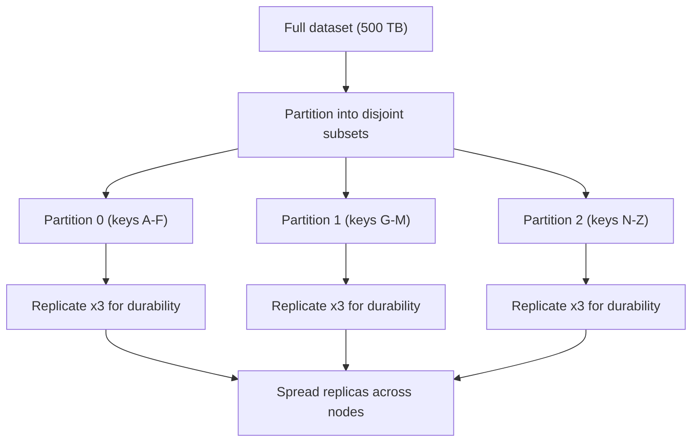
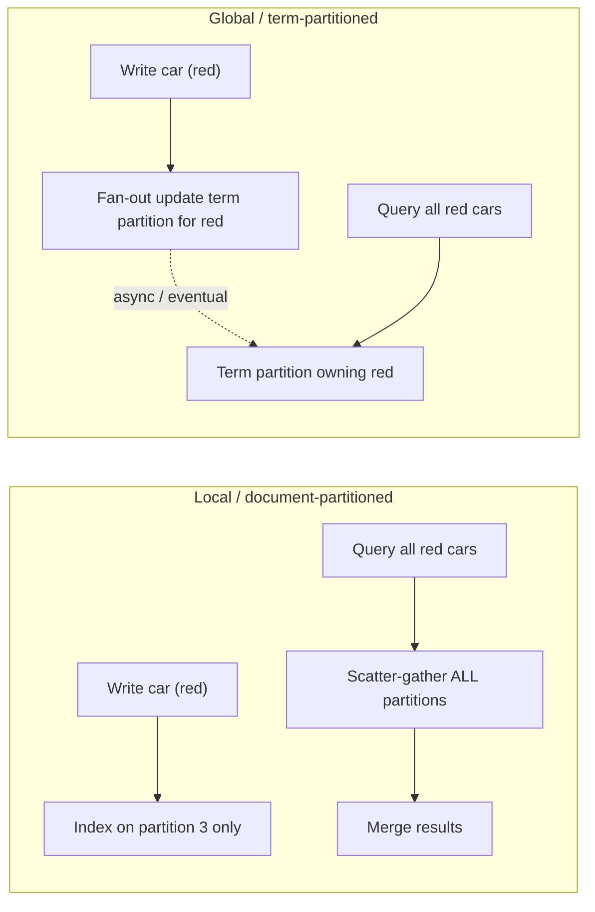
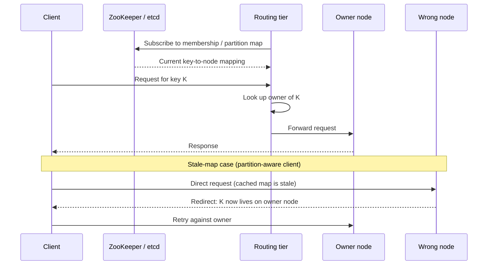
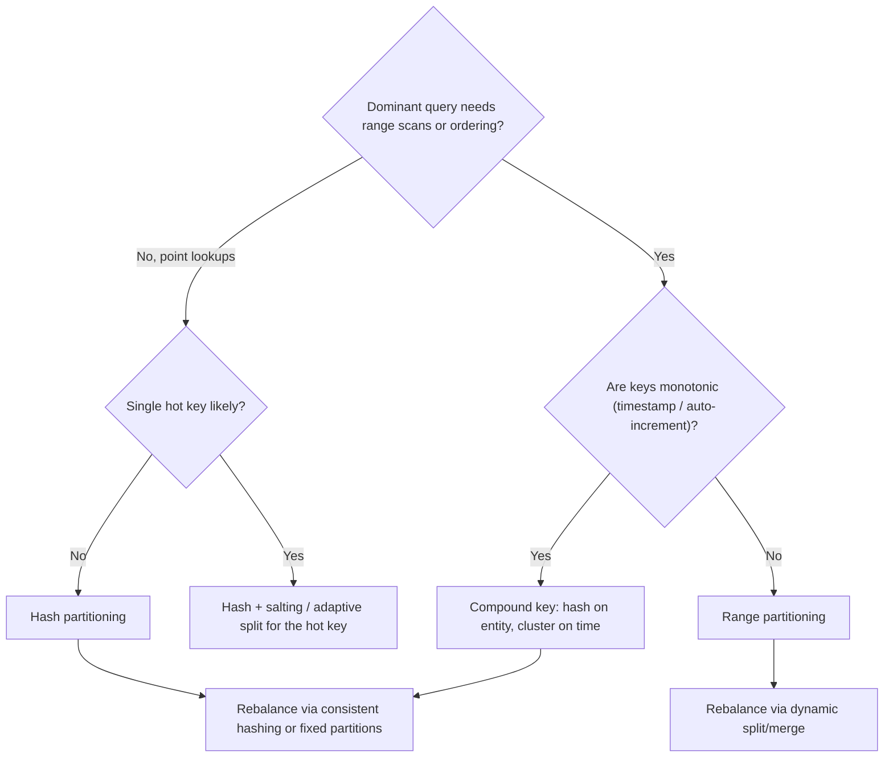

# Partitioning & Sharding

> Where this fits: once your data or write volume outgrows the biggest single machine you can buy, you split it across many. This is the building block that turns "a database" into "a fleet." It sits downstream of [Replication](./09-replication.md) (copies for availability) and upstream of nearly every case study in this curriculum.
>
> **Principal-level takeaway:** The partition key is the most consequential and most expensive-to-change decision in the entire system. Choose it to match your *dominant access pattern*, not your data's natural identity — and assume any query that doesn't include the partition key will eventually become your scaling bottleneck.

---

## ⚡ 60-Second TL;DR

- **Partitioning/sharding** = split data into disjoint subsets across nodes; scales **capacity + write throughput** linearly (replication only scales reads).
- **Range** keys: cheap local scans, but **monotonic keys (timestamps/auto-IDs) hotspot** one shard. **Hash** keys: uniform load, but kills range scans. **Compound** (hash entity + cluster on time) gets both.
- **Secondary indexes:** *local* = cheap writes / scatter-gather reads; *global (term-partitioned)* = cheap reads / expensive, usually eventual writes.
- **#1 misconception:** a good hash fixes hotspots — **false.** It spreads keys, not load-per-key; one **hot key** lives on one partition (salt/split it).
- **Never use `hash(key) % N` with variable N** — adding a node remaps ~all keys. Stable schemes move only **~1/N** of data.
- Scatter-gather: overall p99 trends toward each shard's **p99.99** — budget fan-out, don't normalize it.

**Remember one thing:** Choose the partition key to match your dominant access pattern, not your data's natural identity — it's the most consequential, near-irreversible decision in the system.

## The Mental Model — first principles

A single machine has hard ceilings. A beefy server tops out around a few TB of RAM, a few dozen TB of fast NVMe, maybe 64–128 cores, and a NIC that does ~10–25 Gbps. You can buy bigger boxes (vertical scaling) right up until you can't: the price curve goes superlinear, and there is a literal largest machine on the market. When your dataset is 500 TB, or you need 2 million writes/second, no single box exists that does it.

**Replication doesn't save you here.** Replication makes *copies* of the whole dataset. It helps with read throughput and survivability, but every replica still holds 100% of the data and must absorb 100% of the writes. If writes exceed what one node can durably accept (fsync throughput, WAL append rate, compaction bandwidth), adding read replicas does nothing.

**Partitioning (a.k.a. sharding) is the answer: split the data into disjoint subsets, and put each subset on a different node.** Each partition holds, say, 1/100th of the keys. Now total storage, total write throughput, and total RAM for hot data scale roughly linearly with node count. A 500 TB dataset becomes 100 shards of 5 TB each, on commodity boxes.

The terms: **partition** is the generic word (Kafka calls them partitions, Cassandra calls them token ranges, Elasticsearch calls them shards, HBase calls them regions, DynamoDB calls them — confusingly — partitions). **Shard** usually implies the partition lives on a separate node and is operated somewhat independently. In practice people use them interchangeably; I will too.

In almost every real system, **partitioning and replication are combined**: you split the data into partitions, then replicate *each partition* (e.g., 3 copies) for durability and availability. Lose a node, and the surviving replicas of its partitions take over. Keep these two axes separate in your head — they solve different problems and have independent failure modes.

The two axes are orthogonal, and seeing them stacked makes the distinction concrete: first you split the keyspace into disjoint partitions (the capacity/write-scaling axis), then you replicate each partition for durability (the availability/read-scaling axis), and finally you spread those replicas across nodes so no single failure takes a partition fully offline.



The thing partitioning *gives up*: the comforting illusion that all your data is in one place. The moment data spans nodes, "find the user named X" and "join orders to customers" stop being free. The entire art of partitioning is choosing your split so the queries you actually run stay cheap, and the ones that go expensive are rare.

---

## Core Concepts

### Range partitioning

Assign each partition a contiguous range of the key space. Keys `A–F` go to shard 0, `G–M` to shard 1, and so on. Within a shard, keys are stored sorted (typically a B-tree or LSM-tree — see [Storage Engines](../00-foundations/03-storage-engines.md)).

```
key:  A  B  C  D | E  F  G  H | I  J  K  L | M ...
            shard 0    shard 1    shard 2
```

**Why you'd want it:** range scans are cheap and local. "Give me all sensor readings between 09:00 and 10:00" or "list usernames starting with 'Sm'" hits one or a few adjacent shards. This is why HBase, Bigtable, CockroachDB, and Spanner use range partitioning — they're built for ordered scans.

**The trap:** sequential keys create write hotspots. If your key is a timestamp or a monotonically increasing ID, *every* write at any given moment targets the single shard owning "now." You bought 100 machines and 99 of them sit idle while one melts. This is the canonical range-partitioning failure, and it's why Bigtable's docs explicitly warn against timestamp-prefixed row keys.

### Hash partitioning

Run the key through a hash function and use the output to assign a partition: `partition = hash(key) mod N`, or map the hash onto a ring (consistent hashing, below). A good hash (MD5, MurmurHash, xxHash — *not* a language's built-in `hashCode`, which isn't stable across versions/JVMs) scatters keys uniformly.

```
hash("user42")  = 0x9f3a... -> shard 7
hash("user43")  = 0x12bc... -> shard 2
hash("user44")  = 0xaa01... -> shard 5
```

**Why you'd want it:** uniform load distribution, basically for free. Adjacent keys land on random shards, so sequential or skewed key generation no longer concentrates writes. This is the default for DynamoDB, Cassandra (by default), and most key-value stores.

**The cost:** you destroy ordering. Range scans now have to touch *every* shard (a scatter-gather, below), because consecutive keys are scattered everywhere. You cannot efficiently ask "all events from last hour" if you hash on event ID.

**Compromise — compound / composite keys.** Cassandra's "partition key + clustering key" is the standard move: hash on the partition key (e.g., `user_id`) to spread load across the cluster, but store rows *sorted by* the clustering key (e.g., `timestamp`) within each partition. Now `SELECT ... WHERE user_id = ? AND ts BETWEEN ? AND ?` is a single-shard, sorted, local scan — uniform distribution *and* efficient ranges, as long as your range query is scoped to one partition key.

**A partition router: hash vs range, and the monotonic-key hotspot.** The two routers below map a key to a shard. The hash router uses a stable hash (FNV-1a here for brevity — in production prefer MurmurHash/xxHash) so distribution is uniform regardless of key shape. The range router assigns contiguous boundaries. The `main`/`demo` driver feeds in *monotonically increasing* keys (like timestamps or auto-increment IDs) and tallies the per-shard load, making the range hotspot visible: under range partitioning every recent key lands on the last shard, while hashing stays flat.

```go
package main

import (
	"fmt"
	"hash/fnv"
	"sort"
)

type Router interface {
	Shard(key string) int
}

// HashRouter scatters keys uniformly across numShards.
type HashRouter struct{ numShards int }

func (r HashRouter) Shard(key string) int {
	h := fnv.New32a()
	_, _ = h.Write([]byte(key))
	return int(h.Sum32() % uint32(r.numShards))
}

// RangeRouter assigns contiguous key ranges via sorted upper bounds.
// boundaries[i] is the exclusive upper bound of shard i; the last shard
// owns everything above boundaries[len-2].
type RangeRouter struct{ boundaries []string }

func (r RangeRouter) Shard(key string) int {
	// First boundary strictly greater than key => that shard owns it.
	i := sort.Search(len(r.boundaries), func(i int) bool {
		return r.boundaries[i] > key
	})
	if i >= len(r.boundaries) {
		return len(r.boundaries) - 1 // last shard catches the tail
	}
	return i
}

func loadByShard(r Router, keys []string, numShards int) []int {
	counts := make([]int, numShards)
	for _, k := range keys {
		counts[r.Shard(k)]++
	}
	return counts
}

func main() {
	const numShards = 4
	hash := HashRouter{numShards: numShards}
	// Boundaries split a zero-padded numeric keyspace into 4 ranges.
	rng := RangeRouter{boundaries: []string{"0250", "0500", "0750", "9999"}}

	// Monotonically increasing keys, e.g. event IDs arriving "now".
	keys := make([]string, 0, 1000)
	for i := 750; i < 1000; i++ { // simulate the most-recent window
		keys = append(keys, fmt.Sprintf("%04d", i))
	}

	fmt.Println("hash :", loadByShard(hash, keys, numShards))  // ~even
	fmt.Println("range:", loadByShard(rng, keys, numShards))   // all in last shard => HOTSPOT
}
```

```java
import java.util.*;

public class PartitionRouter {

    interface Router {
        int shard(String key);
    }

    // HashRouter scatters keys uniformly across numShards.
    static final class HashRouter implements Router {
        private final int numShards;
        HashRouter(int numShards) { this.numShards = numShards; }

        @Override public int shard(String key) {
            int h = fnv1a(key);
            return Math.floorMod(h, numShards); // floorMod keeps result non-negative
        }

        // Stable FNV-1a 32-bit hash (do NOT use String.hashCode for sharding).
        private static int fnv1a(String s) {
            int hash = 0x811c9dc5;
            for (int i = 0; i < s.length(); i++) {
                hash ^= (s.charAt(i) & 0xff);
                hash *= 0x01000193;
            }
            return hash;
        }
    }

    // RangeRouter assigns contiguous key ranges via sorted upper bounds.
    static final class RangeRouter implements Router {
        private final String[] boundaries; // exclusive upper bounds, ascending
        RangeRouter(String[] boundaries) { this.boundaries = boundaries; }

        @Override public int shard(String key) {
            for (int i = 0; i < boundaries.length; i++) {
                if (key.compareTo(boundaries[i]) < 0) return i;
            }
            return boundaries.length - 1; // last shard catches the tail
        }
    }

    static int[] loadByShard(Router r, List<String> keys, int numShards) {
        int[] counts = new int[numShards];
        for (String k : keys) counts[r.shard(k)]++;
        return counts;
    }

    public static void main(String[] args) {
        final int numShards = 4;
        Router hash = new HashRouter(numShards);
        Router range = new RangeRouter(new String[]{"0250", "0500", "0750", "9999"});

        // Monotonically increasing keys, e.g. event IDs arriving "now".
        List<String> keys = new ArrayList<>();
        for (int i = 750; i < 1000; i++) {
            keys.add(String.format("%04d", i));
        }

        System.out.println("hash : " + Arrays.toString(loadByShard(hash, keys, numShards)));  // ~even
        System.out.println("range: " + Arrays.toString(loadByShard(range, keys, numShards))); // all in last shard => HOTSPOT
    }
}
```

### Directory-based (lookup-table) partitioning

Keep an explicit map from key (or key-range) to partition, maintained in a separate, strongly-consistent service. Instead of computing the location, you look it up.

**Why you'd want it:** maximum flexibility. You can move any individual key or range to any node, split a hot partition arbitrarily, and migrate without an algorithmic constraint. Vitess (the sharding layer behind YouTube and Slack's MySQL) and Google's Bigtable/Spanner use lookup structures (a metadata/META table) to track which server owns which range.

**The cost:** the directory is now a critical dependency on the hot path. It must be highly available, low-latency, and consistent, or it becomes a bottleneck and a single point of failure. Mitigated by aggressive client-side caching of the map (with invalidation), but you've added a moving part and a stale-cache failure mode.

### The hot-spot / celebrity problem

A uniform hash spreads *keys* evenly. It does nothing about uneven *load per key*. If 50 million people follow one celebrity, every request touching that user's timeline hammers the single shard owning that `user_id` — a "hot key." Hashing can't help, because all those requests are for the *same* key, and a key lives on exactly one partition.

Mitigations, in rough order of how much they cost you:

- **Salting / key splitting.** Append a random suffix (or a bounded set, `0..9`) to the hot key: `celebrity_id#0` … `celebrity_id#9`, spreading its writes across 10 partitions. The price: reads must now fan out to all 10 sub-keys and merge. You typically apply this *only* to known-hot keys, because every salted key makes reads more expensive. Often the application has to track *which* keys are salted.
- **Caching the hot key** in front of the data layer ([Caching](./06-caching.md)) — absorbs read hotspots cheaply, but doesn't help write hotspots.
- **Adaptive splitting.** Detect a hot partition at runtime and split it. DynamoDB does this automatically with "adaptive capacity" and per-key isolation; it can split a partition so a single hot key gets its own slice of throughput. Still bounded: a single key that exceeds one partition's capacity (DynamoDB: ~3,000 read / 1,000 write units per partition) needs application-level fan-out (salting) — the database alone can't shard a single key.
- **Application-level shaping.** For true celebrities, many systems special-case them entirely (e.g., Twitter's hybrid fan-out: most users get push-on-write to followers' timelines, celebrities get pull-on-read so their writes don't fan out to 50M inboxes — see [News Feed](../04-design-case-studies/23-news-feed-and-timeline.md)).

The principal lesson: **a hotspot is a property of your workload, not your hashing.** Uniform hashing is necessary but not sufficient.

### Partitioning secondary indexes

This is where partitioning gets genuinely hard, and where most beginners get blindsided. Your *primary* key determines the partition. But you also want to query by other attributes — "all red cars," "all orders with status=PENDING." How do you partition the secondary index?

**Local (document-partitioned) index.** Each partition indexes only the documents it holds. Shard 3's index of `color` covers only the cars on shard 3.

```
Write path:  cheap — index update is local to the doc's partition.
Read path:   "all red cars" must query EVERY shard, then merge. (Scatter-gather.)
```

This is DynamoDB's Local Secondary Index, Elasticsearch's default, MongoDB's secondary indexes. Writes are fast (one node); reads on the index are scatter-gather across all partitions. Read latency is governed by the *slowest* shard (tail latency amplification).

**Global (term-partitioned) index.** Build one index for the whole dataset, but *partition the index itself* — by term. The index for `color=red` lives on one partition (chosen by hashing/ranging the term "red"), `color=blue` on another.

```
Read path:   cheap — "all red cars" reads from the one partition owning "red".
Write path:  expensive — writing one car may touch MULTIPLE index partitions
             (one per indexed attribute), and to be consistent needs a
             distributed transaction. Usually made ASYNCHRONOUS instead.
```

This is DynamoDB's Global Secondary Index. Because keeping it transactionally consistent across partitions is costly, DynamoDB's GSIs are **eventually consistent** by design — a read of the index may not reflect a write that just succeeded on the base table. That is not a bug; it's the fundamental trade-off.

| | Local / document-partitioned | Global / term-partitioned |
|---|---|---|
| Index lives | with the data, per partition | partitioned by term, separately |
| Write cost | cheap (one partition) | high (fan-out, often async) |
| Read cost (by index) | scatter-gather all partitions | targeted, one/few partitions |
| Consistency | matches base table | usually eventual |
| Use when | writes dominate; index reads rare/tolerant of fan-out | reads on the index dominate |

The two layouts move the cost to opposite paths — local keeps writes local but scatters reads; global targets reads but fans out (usually async) writes:



### Rebalancing — moving partitions without a reshuffle

> **Interactive:** [Partitioning & Rebalancing (interactive)](../animations/sharding-rebalance.html) -- add and remove nodes and watch how much data has to move under each scheme.

When you add nodes, lose nodes, or a partition grows too big, data must move. The naive scheme `partition = hash(key) mod N` is a disaster here: change `N` from 100 to 101 and *almost every key* remaps to a different node. That's a near-total reshuffle — terabytes flying across the network while the cluster is degraded. **Never use `mod N` with a variable `N`.** Three real strategies avoid this:

1. **Fixed number of partitions.** Create *many more* partitions than nodes up front (e.g., 1,024 partitions on 10 nodes ≈ 100 each). The partition count never changes; you just reassign *whole partitions* between nodes when membership changes. Adding an 11th node steals ~93 partitions from the others. Only the moved partitions transfer — no rehashing of keys. This is **Riak, Elasticsearch, and Kafka's** model. Cost: you must guess the eventual scale up front. Too few partitions → can't grow past that node count; too many → per-partition overhead and metadata bloat. Elasticsearch makes this painful because shard count is *fixed at index creation* — pick wrong and you re-index everything.

2. **Dynamic partitioning.** Start with few partitions; split a partition in two when it exceeds a size threshold, merge when it shrinks. The partition count tracks the data volume. This is **HBase and Bigtable** (region/tablet splits) and **CockroachDB/Spanner** (range splits, default ~512 MB ranges). Adapts automatically; the catch is an empty database starts as one partition on one node (a cold-start hotspot) until the first split — solved by *pre-splitting* a new table into N ranges.

3. **Consistent hashing.** Map both keys and nodes onto a ring (typically with virtual nodes/vnodes so each physical node owns many ring positions). Adding/removing a node only reassigns the keys in the arc adjacent to it — roughly `1/N` of the data moves, not all of it. This is **Cassandra and DynamoDB's** lineage (the original Dynamo paper). Vnodes also smooth out load when node capacities differ. This shares deep machinery with [Load Balancing & Consistent Hashing](./05-load-balancing.md) — read that for the ring mechanics.

> **Interactive:** [Consistent Hashing (interactive)](../animations/consistent-hashing.html) -- drop a node onto the ring and see only the adjacent arc reassign, then add vnodes to smooth the load.

> A classic clarification: in *Designing Data-Intensive Applications*, Kleppmann notes that "consistent hashing" as described in the academic literature (hashing range boundaries) is rarely used as-is in databases; what people *call* consistent hashing in practice is the vnode-on-a-ring scheme above. Know both senses.

**Automatic vs. manual rebalancing.** Fully automatic rebalancing is dangerous: a node that's slow (not dead) can be wrongly declared dead, triggering rebalancing that moves load *onto* an already-struggling cluster — a cascading failure. Many mature systems (e.g., Couchbase, and Riak historically) keep a **human in the loop** to confirm rebalancing. Principal instinct: automate the *decision support*, gate the *destructive action*.

### Routing requests — "which node has my key?"

A client wants key `K`. Who knows which node owns it? Three architectures (DDIA frames these well):

```
(1) Routing tier / coordinator        (2) Client knows the map         (3) Any node, gossip-forwarded
   client -> [router] -> node            client -> node (direct)          client -> any node
              |  (knows mapping)                 ^ (caches mapping)                  | forwards if not owner
              v                                                                       v
            owner node                                                            owner node
```

Whichever architecture you pick, the request flow and the stale-map failure mode look like this — a router (or a partition-aware client) learns the map from a coordination service, forwards to the owner, and tolerates staleness via a redirect-and-retry:



1. **Routing tier / coordinator.** A dedicated layer (or a load balancer with partition awareness) knows the mapping and forwards requests. Vitess's `vtgate`, MongoDB's `mongos`, and HBase's region-aware client do this. The router learns membership from a coordination service like **ZooKeeper/etcd** ([Consensus](../02-distributed-systems/13-consensus.md)).
2. **Partition-aware clients.** The client itself caches the routing map and connects directly to the owner, saving a hop. Cassandra's `TokenAwarePolicy` and Kafka producers do this — the client periodically refreshes cluster metadata.
3. **Gossip / any-node.** Send the request to *any* node; if it isn't the owner, it forwards (or returns a redirect). Cassandra and Dynamo nodes gossip membership among themselves, so any node can route. No external dependency, but extra hops and gossip convergence delay.

The common thread: **routing metadata must converge and be reasonably fresh.** Stale maps cause requests to hit the wrong node — usually corrected by a redirect, occasionally by an error the client must retry.

### Choosing the partition key — the decision that defines the system

Everything above is mechanics. *This* is judgment. The partition key determines:

- **What's a single-shard (cheap) query** vs. a scatter-gather (expensive) one.
- **Whether load is even** or hotspot-prone.
- **What can be transactional.** Most distributed databases give you cheap ACID transactions *within* a partition and force you into slow [distributed transactions](../02-distributed-systems/15-distributed-transactions.md) *across* them.

The mechanics above collapse into a short decision tree once you know your dominant query and your key's shape:



The rule: **partition by the attribute that appears in your highest-volume, latency-sensitive query.** Chat app? Partition messages by `channel_id` — reading a channel is one shard. E-commerce orders queried by customer? Partition by `customer_id`. The "natural" identity (e.g., `order_id`) is usually the *wrong* choice if you rarely query a single order by ID.

The trade-off you're balancing: a partition key that co-locates related data makes common queries cheap but risks hotspots (one giant customer); a key that spreads load uniformly may scatter your common queries. There is no free lunch — you're choosing *which* queries get to be cheap.

And the brutal part: **changing the partition key later means re-partitioning the entire dataset** — a multi-week migration with dual-writes and backfills (see [Evolutionary Architecture](../05-principal-skills/30-evolutionary-architecture.md)). This is why it deserves the most design time per byte of any decision you make.

### Cross-shard queries, scatter-gather, and distributed joins

Any query not scoped to a single partition key fans out.

- **Scatter-gather:** send the query to all (or many) partitions, gather and merge results. Latency is bounded by the *slowest* responder, so the more shards you fan out to, the worse it gets (**tail latency amplification**, per Dean & Barroso's "The Tail at Scale"). The math is unforgiving: if any single shard is "slow" 1% of the time, then waiting on 100 shards means ~63% of your queries (`1 − 0.99¹⁰⁰`) hit at least one slow shard — so the overall median drifts toward each shard's *p99*, and the overall p99 toward each shard's *p99.99*. Aggregations (`COUNT`, `SUM`, top-N) and global sorts are scatter-gather with a merge step.
- **Distributed joins:** joining two tables partitioned on different keys means shipping data between nodes. The mitigations: **co-locate** the tables on the same key (CockroachDB interleaved tables, Vitess's "sharding key" alignment), or **denormalize** so the join is pre-computed at write time (the NoSQL default — see [NoSQL & Data Modeling](./08-databases-nosql.md)), or **replicate small dimension tables** to every shard (a "reference table") so the join is always local.

The principal framing: scatter-gather isn't forbidden, it's *budgeted*. A handful of admin queries that fan out is fine. Your core read path doing it at 50k QPS is a design smell — fix the partition key or add a term-partitioned index/derived view.

---

## Trade-offs at a Glance

| Strategy | Even load? | Range scans? | Rebalancing cost | Real systems | Pick when |
|---|---|---|---|---|---|
| **Range partitioning** | No (sequential keys hotspot) | Excellent, local | Dynamic splits, cheap | HBase, Bigtable, Spanner, CockroachDB | Ordered/range queries dominate; keys aren't monotonic |
| **Hash partitioning** | Yes (uniform keys) | Bad (scatter-gather) | `mod N` = full reshuffle; use consistent hashing | DynamoDB, Cassandra (default) | Point lookups by key; no range needs |
| **Compound key (hash + clustering)** | Yes | Local *within* a partition key | As hash | Cassandra wide rows | Per-entity timelines (e.g., per-user events) |
| **Directory-based** | Tunable | Tunable | Most flexible; per-key moves | Vitess, Spanner META | Need fine-grained control / arbitrary moves |
| **Fixed partition count** | Even-ish | n/a (orthogonal) | Move whole partitions only | Kafka, Riak, Elasticsearch | Scale ceiling is predictable |
| **Dynamic splitting** | Adapts | n/a | Auto split/merge | HBase, Bigtable, Cockroach | Unpredictable, growing data |
| **Consistent hashing (vnodes)** | Even w/ vnodes | n/a | ~1/N moves on change | Cassandra, DynamoDB | Frequent membership changes |

---

## How Real Systems Do It

- **Kafka:** A topic has a fixed number of partitions (you set it; increasing it later breaks key-ordering guarantees, you can't decrease it). Producer default: `hash(key) mod num_partitions`. All messages with the same key land in one partition and stay ordered — that's how Kafka offers per-key ordering. No key → round-robin. See [Messaging & Streaming](./11-messaging-and-streaming.md).
- **DynamoDB:** Hash on the partition key onto a keyspace; each physical partition caps at ~10 GB and ~3,000 RCU / 1,000 WCU. Exceed either and DynamoDB auto-splits. Adaptive capacity isolates hot keys. GSIs are term-partitioned and eventually consistent.
- **Cassandra:** Partition key is hashed (Murmur3) to a token on a ring; many vnodes per node (`num_tokens` was historically **256**, lowered to a default of **16** in Cassandra 4.0 because high vnode counts hurt repair, streaming, and availability). Clustering keys sort rows within a partition. The infamous failure: an unbounded partition (e.g., partitioning by a low-cardinality key) grows past gigabytes and destroys the node.
- **Vitess (YouTube, Slack, GitHub):** Shards MySQL horizontally. A `vtgate` routing tier parses SQL, consults a VSchema, and routes to the right shard(s); it can do limited scatter-gather and cross-shard aggregation. Resharding is online via VReplication.
- **Spanner / CockroachDB:** Range-partition into ~512 MB ranges, auto-split/merge, each range its own consensus group of replicas ([Consensus](../02-distributed-systems/13-consensus.md)) — **Spanner uses Paxos, CockroachDB uses Raft** (don't conflate them). This is how they offer cross-shard ACID: a transaction touching multiple ranges runs 2-phase commit *across* those per-range consensus groups, with Spanner leaning on TrueTime (and Cockroach on hybrid logical clocks) for ordering. Single-range transactions skip 2PC and are far cheaper, which is why both still push you to co-locate related data in one range.
- **Elasticsearch:** Shard count fixed at index creation (`number_of_shards`). A document routes by `hash(_routing) mod num_primary_shards`. Search is scatter-gather across all shards then a merge — change shard count and you must reindex.

---

## Failure Modes & Common Misconceptions

**Failure: the unbounded partition.** Pick a partition key with low cardinality (e.g., `country` for a global app) and one partition holds half the planet's data. It can't be split (it's one key), it won't fit, and it OOMs the node. *Always estimate the max size of your largest partition before shipping.*

**Failure: the sequential-key hotspot.** Auto-increment IDs or timestamps as the partition key with range partitioning → all writes pound one shard. Solution: hash the key, or prefix with a hashed bucket.

**Failure: `mod N` resharding.** Someone uses `hash(key) % num_nodes` and then adds a node. ~99% of keys remap; the cluster spends days reshuffling and serving stale/missing reads. Use a stable scheme (fixed partitions / consistent hashing).

**Failure: cascading rebalance.** A GC pause makes a healthy node look dead; auto-rebalancing kicks in and dumps its load onto neighbors; they fall over; repeat. Rate-limit and gate rebalancing.

**Failure: scatter-gather tail amplification.** Your dashboard query fans out to 200 shards. One shard is doing compaction; the whole query is slow. As fan-out grows, the probability that *some* shard is slow approaches 1.

Now the myths:

- *"Partitioning and replication are the same thing."* No. Replication = full copies (availability/read-scaling). Partitioning = disjoint splits (capacity/write-scaling). You almost always do both, on separate axes.
- *"A good hash function fixes hotspots."* False. Hashing fixes *key-distribution* skew. It cannot fix *load-per-key* skew — the celebrity problem. One hot key lives on one partition no matter how good your hash is.
- *"Add more shards to fix a hot key."* No — more shards don't help a *single* hot key, since that key still lives on exactly one partition. You need salting/splitting of *that key*.
- *"More partitions is always better."* No. Each partition has memory/file-handle/metadata overhead, and more partitions means wider scatter-gather (worse tail latency). Cassandra and Kafka both degrade with tens of thousands of tiny partitions.
- *"I can change the partition key later."* Technically yes, practically it's a full re-partition migration with dual-writes and backfill. Treat it as nearly irreversible.
- *"Cross-shard transactions work like local ones."* They work, but via 2PC/Raft coordination that's far slower and introduces new failure modes. Design to keep transactions within a partition.

---

## In a Design Discussion

When you're whiteboarding and partitioning comes up, the move is to **state the dominant access pattern first, then derive the partition key from it** — never the reverse.

> **Junior take:** "We'll shard the users table by `user_id`. We'll use `hash(user_id) % num_shards` so it's evenly distributed. If it gets slow we add more shards."
>
> Three latent failures: `% num_shards` makes every future resize a full reshuffle; "add more shards" won't help a hot user; and they never asked *how the data is queried* — if the hot query is "messages in a channel," sharding users by ID buys nothing for it.

> **Principal take:** "What's our highest-volume query? Reading a channel's recent messages. So I'll partition `messages` by `channel_id` (hashed onto a ring with vnodes so resizes only move ~1/N of data), with `(timestamp)` as the clustering key so a channel read is one sorted, single-shard scan. Risk: a megachannel with millions of messages becomes an unbounded partition — I'll cap partition size with a time-bucket in the key (`channel_id, month`) and accept that cross-month reads touch a few shards. Search-by-content is rare and admin-facing, so a scatter-gather or a separate term-partitioned (Elasticsearch) index is fine — I won't distort the primary scheme for it. And I'll estimate the largest channel's data size *now*, before we commit."

Notice what the principal did: named the dominant query, chose the key for it, named the *specific* hotspot risk and pre-empted it, budgeted the expensive queries explicitly, and back-of-the-envelope'd the worst-case partition ([Capacity Estimation](../00-foundations/04-capacity-estimation.md)). That sequence is the whole skill.

---

## Self-Check

<details>
<summary>1. Why doesn't replication solve the same problem as partitioning?</summary>
Replication keeps full copies of all data on every replica, so each node still stores 100% of the data and absorbs 100% of the writes. It scales read throughput and survivability, not storage capacity or write throughput. Partitioning splits the data so each node holds and writes a fraction.
</details>

<details>
<summary>2. You hash on a good function and still have one shard at 100% CPU. What's happening and what do you do?</summary>
A hot key (celebrity problem): many requests target one key, which lives on one partition. Hashing spreads keys, not load-per-key. Fix with salting/key-splitting (fan that key across N sub-keys), caching it (reads), or application-level special-casing. Adding shards alone won't help.
</details>

<details>
<summary>3. Why is `partition = hash(key) % num_nodes` considered an anti-pattern?</summary>
Changing `num_nodes` remaps almost every key, forcing a near-total data reshuffle on every scale event. Use a stable scheme — a fixed large partition count, dynamic splitting, or consistent hashing — so only ~1/N of data moves.
</details>

<details>
<summary>4. Local vs. global secondary index: which makes writes cheap, which makes reads cheap, and why?</summary>
Local (document-partitioned) makes *writes* cheap — the index update is local to the document's partition — but reads on the index scatter-gather all partitions. Global (term-partitioned) makes *reads* cheap (targeted to the partition owning the term) but writes expensive, since one write touches multiple index partitions; usually made async/eventually-consistent (e.g., DynamoDB GSI).
</details>

<details>
<summary>5. What's the danger of fully automatic rebalancing?</summary>
A slow-but-alive node can be misjudged as dead, triggering rebalancing that piles its load onto an already-stressed cluster, causing a cascade. Gate the destructive action behind a human or strict rate limits.
</details>

<details>
<summary>6. Why does scatter-gather get slower as you add shards, even though each shard does less work?</summary>
Tail latency amplification: the query waits for the slowest responder, and with more shards the chance that *at least one* is slow (compaction, GC, hot) approaches 1. The whole query's p99 trends toward each shard's p99.
</details>

<details>
<summary>7. You partition orders by order_id but your top query is "all orders for a customer." What did you get wrong?</summary>
You partitioned by natural identity instead of the dominant access pattern. "Orders for customer X" now scatter-gathers every shard. Partition by `customer_id` (clustering by `order_id` or date) so the hot query is single-shard — accepting that a single huge customer is a hotspot risk to mitigate separately.
</details>

<details>
<summary>8. How do Spanner/CockroachDB offer cross-shard ACID when most systems avoid it?</summary>
Each range is its own consensus replication group — **Paxos in Spanner, Raft in CockroachDB**; cross-range transactions use two-phase commit coordinated across those groups, plus tight clock bounds (Spanner's TrueTime, Cockroach's HLC) for ordering. It works but is slower than single-partition writes — which is why they still encourage co-locating related data in one range.
</details>

---

## Go Deeper

- **Designing Data-Intensive Applications, Chapter 6 ("Partitioning")** — the canonical treatment: range vs. hash, secondary index partitioning (local/global), rebalancing strategies, and request routing. Read it after this. Chapter 5 (Replication) and Chapter 9 (Consistency & Consensus) are the natural neighbors.
- **Dynamo: Amazon's Highly Available Key-value Store** (DeCandia et al., SOSP 2007) — consistent hashing with vnodes, the origin of the Cassandra/Dynamo lineage.
- **Bigtable: A Distributed Storage System for Structured Data** (Chang et al., OSDI 2006) — range/tablet partitioning, dynamic splits, the META lookup hierarchy.
- **Spanner: Google's Globally-Distributed Database** (Corbett et al., OSDI 2012) — range partitioning + Paxos groups + TrueTime for cross-shard transactions.
- **DynamoDB docs — "Best Practices for Designing and Using Partition Keys"** and the **Vitess** documentation on VSchema/resharding — production-grade, opinionated guidance.
- Sibling writeups: [Load Balancing & Consistent Hashing](./05-load-balancing.md) (ring mechanics), [Replication](./09-replication.md) (the other scaling axis), [Consistency, CAP & PACELC](../02-distributed-systems/12-consistency-and-cap.md), [Distributed Transactions & Sagas](../02-distributed-systems/15-distributed-transactions.md), and the [News Feed](../04-design-case-studies/23-news-feed-and-timeline.md) and [Object/KV Store](../04-design-case-studies/26-object-store-and-kv-store.md) case studies where these choices get exercised end-to-end.

Back to the [curriculum index](../README.md) · [roadmap](../ROADMAP.md).
