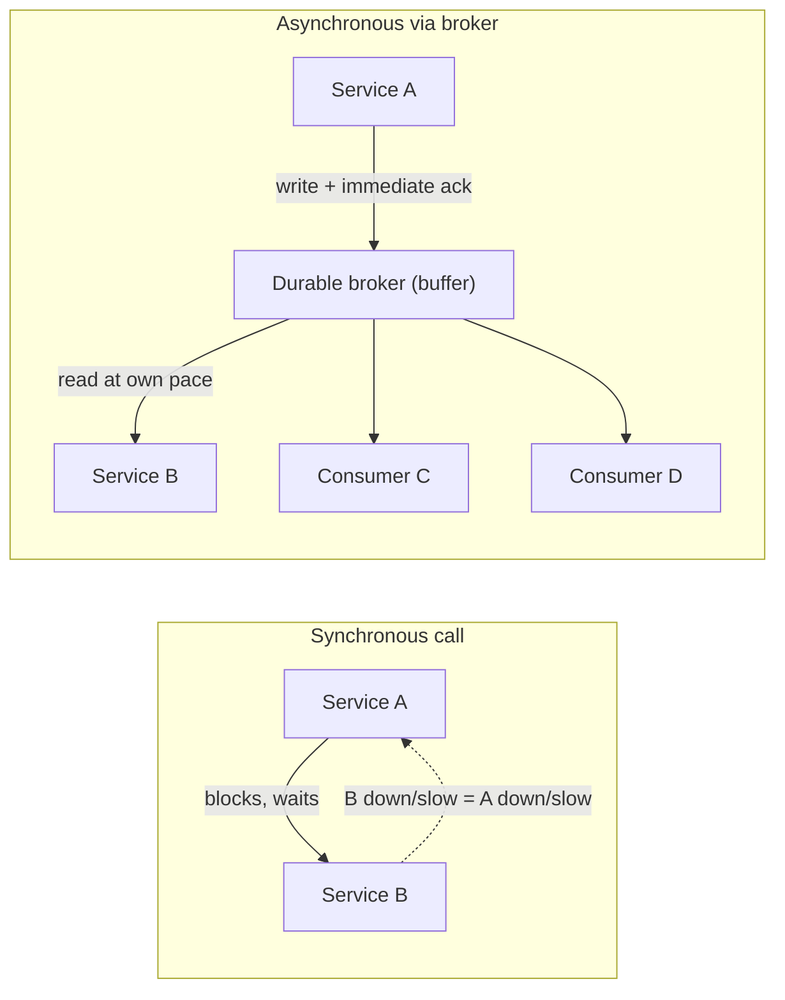
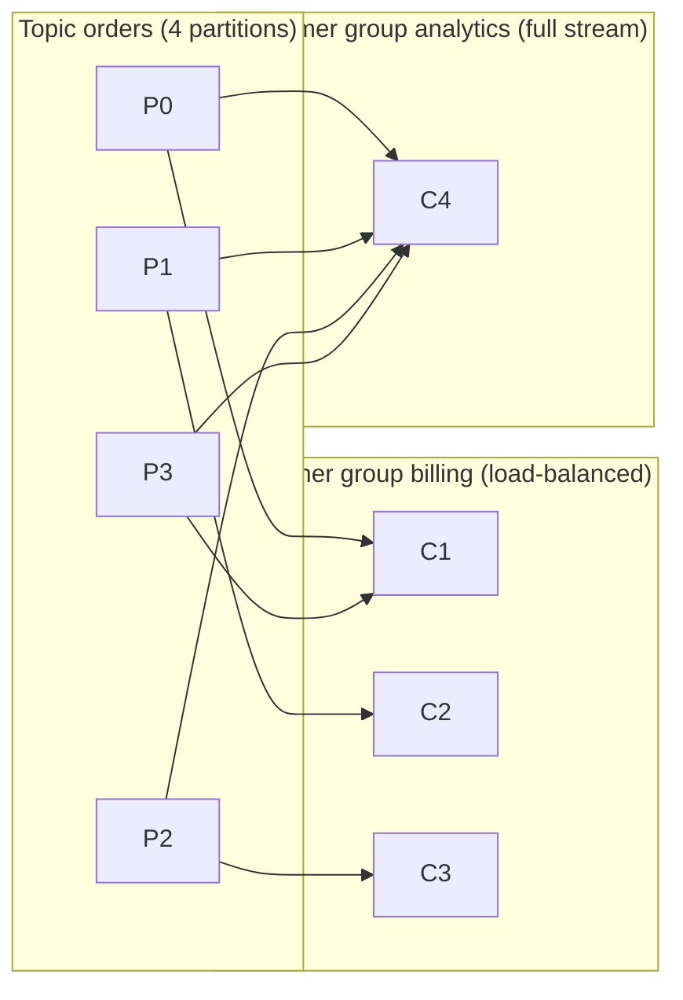
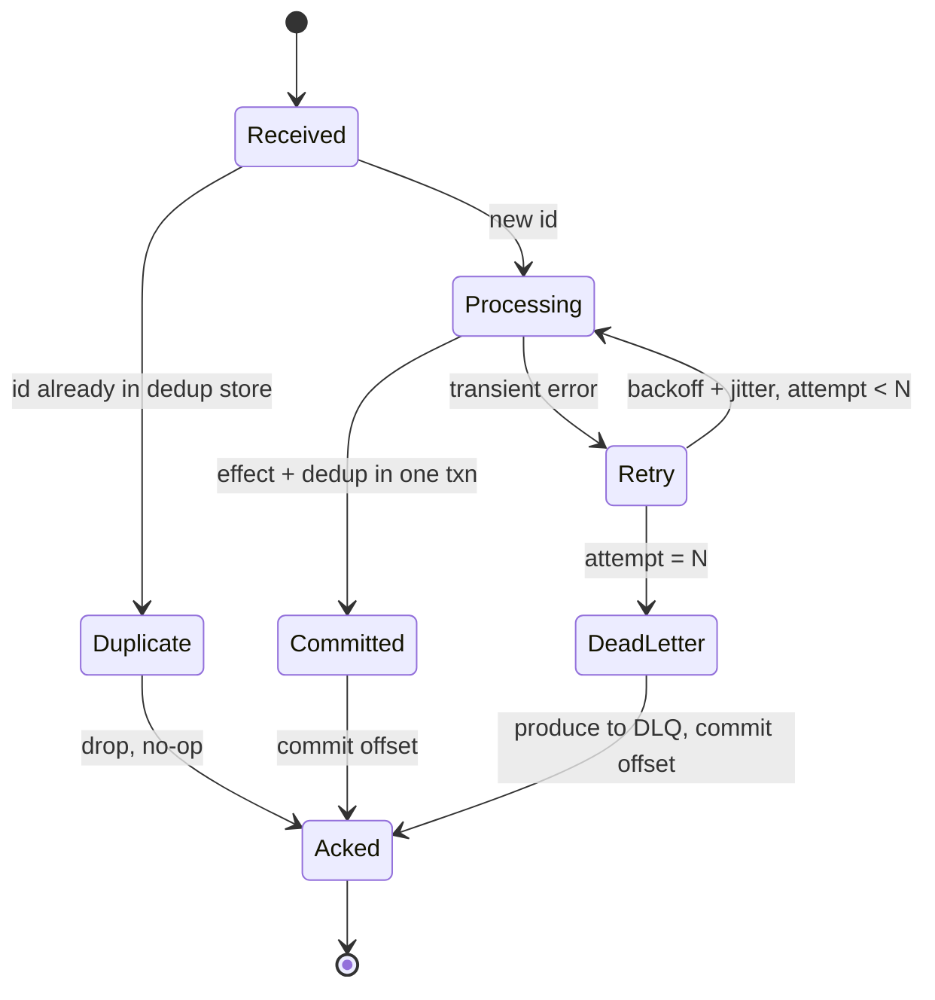
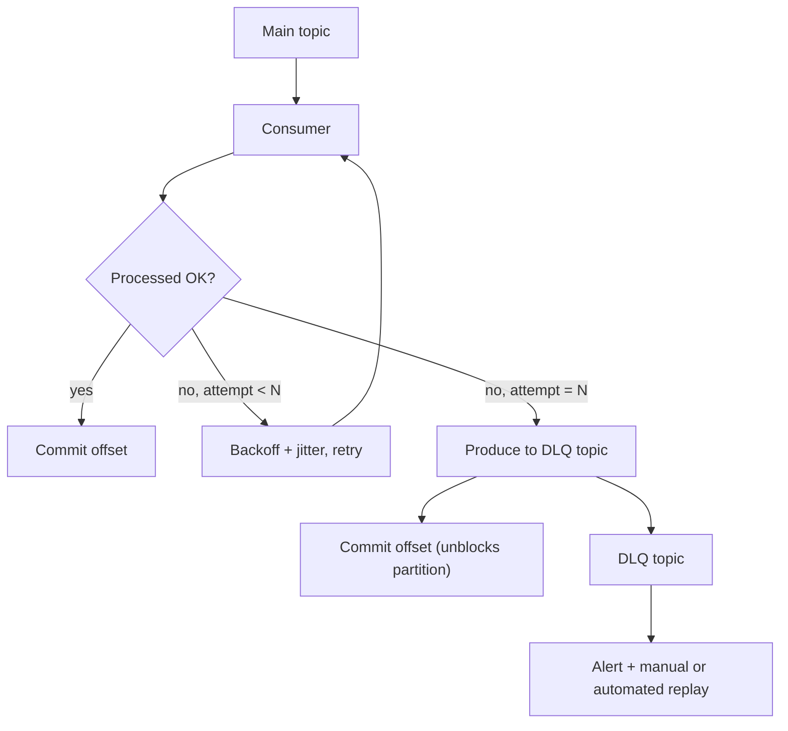
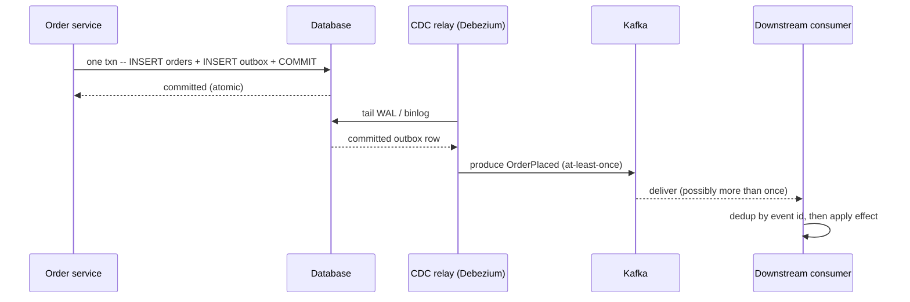

# Message Queues & Stream Processing

> Where this fits: the connective tissue of any system bigger than one process — how services hand work to each other without holding hands synchronously, and how you process data *in motion* rather than waiting for it to land in a database.
>
> **Principal-level takeaway:** A message system does not give you reliability for free — it *relocates* your reliability problem from "did the call succeed?" to "did the consumer process this exactly once, in the right order, and what happens to the messages it can't?" The hard part of messaging is never the happy path. It is idempotency, ordering, and the messages that won't die. Design for those first.

---

## The Mental Model — first principles: why does this thing exist?

Start with the simplest possible interaction: service A needs service B to do something. The obvious move is a **synchronous call** — A calls B over HTTP/gRPC and waits for the reply. This is the right default and you should reach for it most of the time (see [API Design](../03-architecture-and-apis/17-api-design.md)). It is simple, it gives you an immediate answer, and the failure is right in your face.

But synchronous coupling has three structural problems that get worse with scale:

1. **Temporal coupling.** B must be alive *right now*. If B is down or slow, A is down or slow. A 200ms hiccup in B becomes a 200ms hiccup in A, and if A is itself called synchronously, the latency and failure propagate up the whole chain. This is how one slow database cascades into a site-wide outage.
2. **Load coupling.** If A produces a burst of 50,000 requests/sec but B can only handle 5,000/sec, the synchronous model has no shock absorber. B falls over, and the retries from A make it worse — a retry storm.
3. **Fan-out coupling.** When five different services all care about "an order was placed," A has to know about all five, call all five, and handle five different failure modes. Adding a sixth consumer means changing and redeploying A.

A **message system** breaks all three by inserting a durable buffer between producer and consumer. A writes a message ("OrderPlaced") to the broker and gets an acknowledgment immediately; B reads it whenever it's ready. Now B can be down for an hour and A doesn't notice. A burst gets absorbed by the buffer and drained at B's pace (**backpressure** becomes a depth metric, not a crash). And five consumers can each independently read the same event without A knowing they exist.



The cost of this magic is **everything becomes asynchronous and eventually consistent**. The caller no longer gets an answer. "Did it work?" becomes a separate question you have to engineer an answer to. You have traded *immediate, simple failure* for *deferred, complex success*. That trade is sometimes brilliant and sometimes a catastrophe, and knowing which is the whole skill.

---

## Core Concepts

### Queues vs Logs — the single most important distinction

There are two fundamentally different data structures hiding under the word "messaging," and conflating them is the most common beginner mistake.

A **queue** (RabbitMQ, AWS SQS, ActiveMQ, classic JMS) is a *work distribution* mechanism. A message is a unit of work. Multiple consumers pull from the queue; each message goes to *one* consumer; once acknowledged, the message is **deleted**. The broker tracks per-message state ("delivered? acked?"). The mental model is a to-do list that gets shorter as work gets done.

A **log** (Apache Kafka, Apache Pulsar, AWS Kinesis, Redpanda) is an *append-only, immutable, ordered sequence* of records, like a database's write-ahead log exposed as a product (see [Storage Engines](../00-foundations/03-storage-engines.md) for why logs are the foundational data structure). Consumers don't delete anything. Each consumer tracks its own **offset** — a cursor into the log. Reading is just "give me everything after offset N." The mental model is a tape you can rewind, replay, and have many independent readers scan at different speeds.

This difference is not cosmetic. It cascades into everything:

| | Queue (RabbitMQ/SQS) | Log (Kafka/Pulsar) |
|---|---|---|
| **Message lifecycle** | Deleted after ack | Retained for a fixed window; never deleted on read |
| **Who tracks progress** | The broker (per-message) | The consumer (an offset) |
| **Replay history** | No — it's gone | Yes — rewind the offset and reprocess |
| **Multiple independent readers** | Need separate queues + fan-out exchange | Native — each consumer group has its own offset |
| **Throughput ceiling** | Per-message bookkeeping limits it | Sequential disk I/O → millions/sec |
| **Ordering** | Weak/none across consumers | Total order within a partition |

The deep reason logs scale better: a queue's broker must do random-access bookkeeping for every message (mark delivered, mark acked, redeliver on timeout). A log just appends to a file and lets consumers read sequentially. **Sequential disk I/O is ~100x faster than random I/O**, and the OS page cache serves recent reads for free. Kafka famously uses the `sendfile` syscall to copy data from page cache straight to the network socket, never touching userspace. That's how a single broker pushes hundreds of MB/s.

The deep reason queues are sometimes *better*: when each message is genuinely independent work and you want to scale consumers freely without worrying about partition counts. A queue lets you run 1 or 1,000 consumers and the broker just hands out the next available message — no partition rebalancing, no ordering constraints to respect. For a "resize these uploaded images" workload, a queue is simpler and correct.

> **Interactive:** [Log vs Queue (Kafka vs SQS) (interactive)](../animations/log-vs-queue.html) -- try acking a message in the queue (it vanishes) versus replaying a consumer's offset in the log (the records are still there).

### Pub/Sub, fan-out, and consumer groups

**Point-to-point** is one producer, one queue, competing consumers — load balancing of work. **Publish/subscribe** is one producer, many independent subscribers — each gets a copy. Real systems blend these.

In RabbitMQ the abstraction is the **exchange**. Producers publish to an exchange; bindings route copies to queues. A *fanout* exchange copies to every bound queue (true pub/sub); a *direct/topic* exchange routes by key. Each queue then has competing consumers.

In Kafka the equivalent is the **consumer group**. A topic is split into **partitions**. Within one consumer group, each partition is assigned to exactly one consumer — so the group as a whole load-balances, and you scale consumers up to (but not beyond) the partition count. Multiple *different* groups each get the full stream independently — that's the pub/sub part. So Kafka gives you both behaviors from one primitive depending on how you assign group IDs.



Each partition is owned by exactly one consumer *within* a group (so `billing` spreads the four partitions across three consumers), while a *different* group (`analytics`) gets its own independent view of every partition. That is how one primitive delivers both competing-consumer load balancing and pub/sub fan-out at the same time.

### Partitions and ordering — the guarantee everyone gets wrong

**Kafka guarantees ordering only within a single partition. There is no global ordering across a topic.** This is the most misunderstood property in all of messaging.

Why? Because partitions are how you scale. If a topic had one global order, it could have only one writer and one reader at a time — no parallelism. Partitions are independent logs that can live on different brokers, written and read in parallel. The price of that parallelism is that the broker has no idea whether a record in P0 happened before or after a record in P2.

The practical consequence: **the partition key is a design decision, not a detail.** Messages with the same key always land in the same partition (`partition = hash(key) % num_partitions`), so they're ordered relative to each other. If you need all events for a given user/order/account processed in order, key by that ID. If you key by something random, you get parallelism but no per-entity ordering.

This also means **you cannot freely change partition count** on a keyed topic. Adding partitions changes the hash modulus, so `user_42` may move from P3 to P7 — and now its new events are ordered behind old events in a different partition. For keyed/ordered topics, treat partition count as roughly permanent; over-provision up front.

### Delivery semantics — the honest version

This is where principal judgment lives. There are three semantics, and one of them is mostly a marketing term.

- **At-most-once:** fire and forget. The producer/consumer never retries. Messages can be lost, never duplicated. Cheap and fast. Fine for metrics, sampled logs, fire-and-forget telemetry where loss is acceptable.
- **At-least-once:** retry until acknowledged. Messages are never lost but **can be delivered more than once** (the ack got lost, the consumer crashed after processing but before committing the offset, a rebalance redelivered). This is the realistic default for almost everything.
- **Exactly-once:** every message takes effect once and only once.

The brutal truth: **true end-to-end exactly-once delivery over an unreliable network is impossible** (it reduces to the Two Generals Problem — see [Distributed Transactions](../02-distributed-systems/15-distributed-transactions.md)). What systems actually sell as "exactly-once" is **effectively-once *processing*** = **at-least-once delivery + idempotent or transactional consumption**. The duplicates still arrive; you just make the second delivery a no-op.

How it's really achieved, two ways:

**1. Idempotency (the workhorse).** Make processing a message twice equivalent to processing it once. Tag each message with a stable ID and record processed IDs.

The subtlety that bites people: the dedup record and the side effect must commit **atomically**. If you apply the business effect then crash before recording the ID, the redelivery double-applies. Put both in one transaction, or make the business effect itself idempotent (e.g., an `UPSERT` keyed by message ID, or `INSERT ... ON CONFLICT DO NOTHING`). The implementations below do exactly that: the dedup insert and the business effect share one DB transaction, and the dedup table's primary key on `message_id` is what makes the second delivery a no-op.

**Idempotent consumer — dedup by message ID inside one transaction**

```go
package consume

import (
	"context"
	"database/sql"
	"errors"

	"github.com/lib/pq"
)

type Message struct {
	ID      string
	Payload []byte
}

// Handle processes msg exactly-once in effect: the dedup marker and the
// business write commit atomically, so a redelivery is a safe no-op.
func Handle(ctx context.Context, db *sql.DB, msg Message) (err error) {
	tx, err := db.BeginTx(ctx, &sql.TxOptions{Isolation: sql.LevelReadCommitted})
	if err != nil {
		return err
	}
	defer func() {
		if err != nil {
			_ = tx.Rollback()
		}
	}()

	// Claim the message id. The unique PK rejects duplicates.
	_, err = tx.ExecContext(ctx,
		`INSERT INTO processed_messages (message_id) VALUES ($1)`, msg.ID)
	if err != nil {
		var pgErr *pq.Error
		if errors.As(err, &pgErr) && pgErr.Code == "23505" { // unique_violation
			// Already processed in a prior (committed) delivery — drop.
			return tx.Rollback()
		}
		return err
	}

	if err = applyBusinessEffect(ctx, tx, msg); err != nil {
		return err
	}
	return tx.Commit() // dedup marker + effect commit together
}

func applyBusinessEffect(ctx context.Context, tx *sql.Tx, msg Message) error {
	_, err := tx.ExecContext(ctx,
		`UPDATE accounts SET balance = balance - 1 WHERE id = $1`, msg.Payload)
	return err
}
```

```java
import java.sql.Connection;
import java.sql.PreparedStatement;
import java.sql.SQLException;
import javax.sql.DataSource;

public final class IdempotentConsumer {

    private static final String PG_UNIQUE_VIOLATION = "23505";
    private final DataSource dataSource;

    public IdempotentConsumer(DataSource dataSource) {
        this.dataSource = dataSource;
    }

    public record Message(String id, byte[] payload) {}

    /** Processes msg exactly-once in effect: dedup marker + business write commit atomically. */
    public void handle(Message msg) throws SQLException {
        try (Connection conn = dataSource.getConnection()) {
            conn.setAutoCommit(false);
            try {
                if (!claimMessageId(conn, msg.id())) {
                    conn.rollback();   // already processed — drop
                    return;
                }
                applyBusinessEffect(conn, msg);
                conn.commit();         // dedup marker + effect commit together
            } catch (SQLException e) {
                conn.rollback();
                throw e;
            }
        }
    }

    /** Returns false if this id was already claimed by a committed delivery. */
    private boolean claimMessageId(Connection conn, String messageId) throws SQLException {
        try (PreparedStatement ps = conn.prepareStatement(
                "INSERT INTO processed_messages (message_id) VALUES (?)")) {
            ps.setString(1, messageId);
            ps.executeUpdate();
            return true;
        } catch (SQLException e) {
            if (PG_UNIQUE_VIOLATION.equals(e.getSQLState())) {
                return false;
            }
            throw e;
        }
    }

    private void applyBusinessEffect(Connection conn, Message msg) throws SQLException {
        try (PreparedStatement ps = conn.prepareStatement(
                "UPDATE accounts SET balance = balance - 1 WHERE id = ?")) {
            ps.setBytes(1, msg.payload());
            ps.executeUpdate();
        }
    }
}
```

The lifecycle of a single at-least-once delivery — including the dedup branch and the bounded-retry path — looks like this:



**2. Transactions (Kafka's exactly-once).** Kafka's "exactly-once semantics" (EOS) works *only* within the Kafka boundary — the read-process-write loop where you consume from a topic, transform, and produce to another topic. It uses an idempotent producer (sequence numbers dedup retries at the broker) plus transactions that atomically commit *both* the output records *and* the input offset. Consumers reading with `isolation.level=read_committed` never see aborted records. This is genuinely exactly-once *for Kafka-to-Kafka stream processing*. The moment your side effect leaves Kafka — charging a credit card, sending an email — you're back to needing application-level idempotency.

> **Junior framing:** "I'll just turn on exactly-once." **Principal framing:** "Delivery is at-least-once; I'll design every consumer to be idempotent via a natural idempotency key, and reserve Kafka transactions for the internal stream topology where they actually apply."

### Backpressure, retries, DLQs, and poison messages

When consumers can't keep up, the buffer grows. In a log this is visible as **consumer lag** (offset distance behind the log head) — your single most important streaming metric. In a queue it's **queue depth**. Either way, a rising trend means you're falling behind and will eventually hit retention limits and *lose data*, or run out of broker disk. Backpressure handling means: alert on lag, autoscale consumers (up to partition count for Kafka), and — critically — have producers slow down or shed load rather than letting the broker fill.

**Retries** turn transient failures (a downstream timeout) into eventual success. But naive immediate retries cause retry storms. Use **exponential backoff with jitter** and a **retry cap**. The hard problem is the **poison message**: a message that will *never* succeed — malformed payload, references a deleted entity, triggers a bug. Without a cap, it gets retried forever, and in an *ordered* partition it **blocks every message behind it** (head-of-line blocking). This is the classic 3am incident: one bad message wedges an entire partition.

The escape valve is a **dead-letter queue (DLQ)**: after N failed attempts, move the message to a separate queue/topic for human inspection, and let the main consumer move on. SQS has native DLQ support (set `maxReceiveCount`). Kafka has no built-in DLQ — you build it: catch the exception, produce the failed record (plus error metadata) to an `orders.DLQ` topic, commit the offset, continue. The DLQ is not a graveyard; it needs alerting and a replay path, or it silently swallows real failures.



### Retention and log compaction

A log can't grow forever. Two cleanup policies:

- **Time/size retention (`delete`):** drop segments older than, say, 7 days or beyond 1 TB. Default for event streams. This is your replay window — set it knowing that's how far back a new or recovering consumer can go.
- **Log compaction (`compact`):** Kafka's clever trick for *changelog* topics. Instead of dropping old records by age, it keeps only the **latest value per key** and garbage-collects superseded ones. The log becomes a compressed snapshot of current state — "the latest known address for every user." This is what makes Kafka usable as a durable changelog/state store (it powers Kafka Streams' stateful operators and Kafka's own `__consumer_offsets` topic). A consumer replaying a compacted topic from the start rebuilds full current state without replaying every historical change.

### Stream processing — computing on data in motion

A consumer that just inserts rows is using a log as a pipe. **Stream processing** is when you run continuous computation — aggregations, joins, windows — over the stream (Kafka Streams, Apache Flink, Spark Structured Streaming).

The conceptual leap is **event time vs processing time**. *Event time* is when the thing actually happened (embedded in the record). *Processing time* is when your operator sees it. They differ — sometimes by seconds (network), sometimes by hours (a mobile phone was offline in a tunnel and uploads its events later). If you compute "clicks per minute" by processing time, a network blip skews your numbers and the result isn't reproducible on replay. Correct analytics almost always uses **event time**.

But event-time processing raises a question: a window for "10:00–10:01" — when can you finalize it? Late events might still arrive. The answer is **watermarks**: a watermark of time T is an assertion "I believe I've now seen all events with timestamp ≤ T." When the watermark passes the window's end, the window closes and emits. Watermarks formalize the **completeness vs latency** trade-off: wait longer (conservative watermark) and you catch more late data but emit results later; advance aggressively and you're fast but may drop or have to revise late arrivals (handled via *allowed lateness* and retractions).

**Windowing** types: **tumbling** (fixed, non-overlapping: every 1 min), **sliding/hopping** (overlapping: a 5-min window every 1 min), and **session** (dynamic, closed by a gap of inactivity — great for user sessions).

**Stateful operators** (counts, joins, dedup) must keep state that survives crashes. Flink uses periodic **checkpoints** — a distributed snapshot taken via *Asynchronous Barrier Snapshotting*, a Chandy-Lamport–derived algorithm that injects barriers into the stream rather than freezing it — persisted to durable storage (RocksDB-backed local state + S3/HDFS); on failure it restores state and rewinds the source offsets to exactly match — that's how Flink delivers genuine exactly-once *across* the pipeline, not just within Kafka. Kafka Streams keeps state in local RocksDB backed by a compacted changelog topic, so a restarted instance rebuilds state by replaying the changelog.

### The outbox pattern and CDC — the dual-write problem

Here is a trap nearly every event-driven system falls into. Your service does two things on an order: **(1) write to its database, (2) publish "OrderPlaced" to Kafka.** These are two separate systems with no shared transaction. If you write to the DB then crash before publishing, the event is lost and downstream never learns. If you publish then the DB commit fails, you've announced an order that doesn't exist. **You cannot atomically write to a database and a message broker.** This is the **dual-write problem**.

The **transactional outbox** solves it. Within the *same DB transaction* as the business write, insert a row into an `outbox` table. The DB commit now atomically captures both the state change and the intent-to-publish. A separate **relay** then reads the outbox and publishes to the broker, marking rows sent (at-least-once — hence consumers still need idempotency).

```sql
BEGIN;
  INSERT INTO orders (id, ...) VALUES (...);
  INSERT INTO outbox (id, topic, payload, created_at)
    VALUES (gen_uuid(), 'orders', '{"event":"OrderPlaced",...}', now());
COMMIT;
-- relay polls/streams outbox -> Kafka -> marks sent
```

**Transactional outbox insert — business write and event intent in one txn**

```go
// PlaceOrder writes the order row and the outbox event in a single
// transaction, so the state change and the intent-to-publish commit
// atomically. A separate relay/CDC process ships the outbox row to Kafka.
func PlaceOrder(ctx context.Context, db *sql.DB, order Order) (err error) {
	tx, err := db.BeginTx(ctx, nil)
	if err != nil {
		return err
	}
	defer func() {
		if err != nil {
			_ = tx.Rollback()
		}
	}()

	if _, err = tx.ExecContext(ctx,
		`INSERT INTO orders (id, customer_id, total_cents) VALUES ($1, $2, $3)`,
		order.ID, order.CustomerID, order.TotalCents); err != nil {
		return err
	}

	payload, err := json.Marshal(map[string]any{
		"event": "OrderPlaced", "orderId": order.ID, "customerId": order.CustomerID,
	})
	if err != nil {
		return err
	}
	if _, err = tx.ExecContext(ctx,
		`INSERT INTO outbox (id, topic, payload, created_at)
		 VALUES ($1, $2, $3, now())`,
		uuid.NewString(), "orders", payload); err != nil {
		return err
	}
	return tx.Commit()
}
```

```java
/** Writes the order row and outbox event in one transaction — atomic state + intent. */
public void placeOrder(Order order) throws SQLException {
    try (Connection conn = dataSource.getConnection()) {
        conn.setAutoCommit(false);
        try {
            try (PreparedStatement ps = conn.prepareStatement(
                    "INSERT INTO orders (id, customer_id, total_cents) VALUES (?, ?, ?)")) {
                ps.setString(1, order.id());
                ps.setString(2, order.customerId());
                ps.setLong(3, order.totalCents());
                ps.executeUpdate();
            }

            String payload = """
                {"event":"OrderPlaced","orderId":"%s","customerId":"%s"}"""
                .formatted(order.id(), order.customerId());

            try (PreparedStatement ps = conn.prepareStatement(
                    "INSERT INTO outbox (id, topic, payload, created_at) "
                  + "VALUES (?, ?, ?::jsonb, now())")) {
                ps.setString(1, UUID.randomUUID().toString());
                ps.setString(2, "orders");
                ps.setString(3, payload);
                ps.executeUpdate();
            }
            conn.commit();
        } catch (SQLException e) {
            conn.rollback();
            throw e;
        }
    }
}
```

End to end, the write, the CDC capture, and the at-least-once publish form this flow — note the consumer still dedups, because the relay can publish a row twice if it crashes after sending but before marking it sent:



The best relay implementation is **Change Data Capture (CDC)**: a tool like **Debezium** tails the database's replication log (Postgres WAL, MySQL binlog) and streams committed changes to Kafka. Because it reads the same log the DB uses for durability, it sees exactly what was committed, in commit order, with no polling lag — and it can capture the outbox table (or your business tables directly). CDC is the bridge that turns a database into a source of truth *and* an event stream, and it's the backbone of modern "database to data lake / search index / cache" pipelines.

### When to use a queue vs a synchronous call

The decision, distilled:

- **Use a synchronous call when** the caller *needs the answer to proceed* (read your own write, return a result to a user, validate before continuing), latency matters, and the operation is naturally request/response. Don't async-ify a "get user profile" call — you'll add complexity and latency for nothing.
- **Use a queue/log when** the work can happen later (send email, generate thumbnail, update search index), you need to absorb bursts, you need to decouple deploys/ownership, you have fan-out to many consumers, or you need an auditable replayable history of events. Anything that says "*after* X happens, also do Y, Z, W" is an event.

A useful heuristic: **if a failure of the downstream should fail the user's request, call it synchronously. If the downstream failing should be invisible to the user and retried later, queue it.** Charging a card at checkout: synchronous. Emailing the receipt: queue.

---

## Trade-offs at a Glance

| System | Model | Ordering | Throughput (rough) | Retention/Replay | Sweet spot |
|---|---|---|---|---|---|
| **RabbitMQ** | Queue + exchanges (+ Streams since 3.9) | Per-queue, weak under competing consumers | Tens of K msg/s | Classic queues: none (deleted on ack); Streams: log-style replay | Complex routing, task queues, RPC, low-latency work distribution |
| **AWS SQS** | Queue (managed) | None (standard) / per-group (FIFO) | Standard: ~unlimited; FIFO: 300–3000 msg/s | Up to 14 days, gone on delete | Zero-ops task queues, AWS-native decoupling |
| **Apache Kafka** | Log | Total within partition | Millions msg/s, hundreds MB/s/broker | Time/size or compaction; full replay | High-throughput event streaming, log/CDC backbone, stream processing |
| **Apache Pulsar** | Log + queue hybrid | Per-partition; also key-shared subscriptions | Comparable to Kafka | Tiered (hot + cold to S3) | Multi-tenant, geo-replication, mixed queue/stream needs |
| **AWS Kinesis** | Log (managed) | Per-shard | ~1 MB/s in, 2 MB/s out *per shard* | 24h default, up to 365 days | AWS-native streaming without running Kafka |
| **Redis Streams** | Lightweight log | Per-stream | High, memory-bound | Capped by memory/maxlen | Low-latency, simple streaming inside an existing Redis |

> Note the SQS FIFO ceiling: **300 API requests/s per queue** (send/receive/delete), or **3,000 messages/s with 10-message batching** — a real, frequently-hit limit that surprises teams who reach for FIFO "to be safe." (Ordering is *per message group*; the throughput cap is *per queue*. AWS's opt-in **high-throughput FIFO** raises this to thousands of messages/s per queue, but standard FIFO is what most teams hit first.)

---

## How Real Systems Do It

- **Kafka at LinkedIn** (its birthplace) moves *trillions* of messages/day across its fleet. A single well-provisioned broker handles hundreds of MB/s thanks to sequential I/O, zero-copy `sendfile`, and batching+compression. Durability comes from partition replication with a leader and **in-sync replicas (ISR)**; `acks=all` means a write isn't acknowledged until all ISRs persist it (a direct application of [replication](../01-building-blocks/09-replication.md) and quorum ideas from [consensus](../02-distributed-systems/13-consensus.md)). Modern Kafka (KRaft mode) runs its own Raft-based metadata quorum, retiring the old ZooKeeper dependency.
- **AWS SQS** is the workhorse of AWS decoupling: fully managed, "infinitely" scalable *standard* queues that are at-least-once and unordered, plus *FIFO* queues for ordering/dedup at lower throughput. Native DLQ via redrive policy. No replay — once you delete a message, it's gone.
- **DynamoDB Streams + Lambda** is CDC-as-a-service: every item change emits a stream record (ordered per partition key) that triggers a Lambda — the outbox/CDC pattern with no infrastructure to run. Materializing a search index from a Dynamo table is the canonical use.
- **Stripe and payment systems** lean hard on **idempotency keys**: clients send an `Idempotency-Key` header so a retried "charge card" request is deduplicated server-side. This is at-least-once delivery made safe by idempotent processing — the exact pattern, exposed at the API edge (see [Payments & Ledgers](../04-design-case-studies/27-payments-and-ledgers.md)).
- **Netflix / Uber / large pipelines** use **Flink** for event-time stream processing (fraud detection, real-time pricing, metrics) precisely for its watermarks, exactly-once checkpointing, and large keyed state. **Debezium** is the de facto CDC layer feeding Kafka from operational databases across the industry.
- **Postgres** itself ships the primitive that makes CDC possible: logical replication slots streaming the WAL. The same log that gives Postgres crash recovery (see [Storage Engines](../00-foundations/03-storage-engines.md)) is what Debezium reads.

---

## Failure Modes & Common Misconceptions

**Myth 1: "Exactly-once delivery is a checkbox."** No. Delivery over a network is at-least-once at best; "exactly-once" is *effectively-once processing* via idempotency/transactions, and Kafka's EOS only applies inside Kafka. If your consumer calls an external API, you own the idempotency. Believing the checkbox leads to double-charged customers.

**Myth 2: "Kafka guarantees ordering."** Only *within a partition*. Cross-partition there is no order. Teams that key randomly and then assume global order ship subtle, data-dependent bugs that only appear under load.

**Myth 3: "The queue makes my system more reliable."** It moves failure, it doesn't remove it. You've added a new stateful distributed system to operate, monitor, and reason about. Lag, poison messages, DLQ buildup, rebalance storms, and consumer-offset corruption are all *new* failure modes you now own.

**Myth 4: "I'll just write to the DB and publish to Kafka."** The dual-write problem will eventually drop or phantom an event. Use the outbox/CDC. This is not premature engineering — it's the baseline for any system where the DB and the event must agree.

**Real failure — poison message head-of-line blocking:** one un-processable message in an ordered partition halts everything behind it. Symptom: lag climbing on one partition while others are fine. Fix: DLQ + retry cap, designed *before* launch.

**Real failure — rebalance storms:** in Kafka, every time a consumer joins/leaves/times out, the group **rebalances** and pauses consumption. A consumer whose processing exceeds `max.poll.interval.ms` gets ejected, triggering a rebalance, which slows everyone, causing more timeouts — a death spiral. Fix: tune poll intervals, do slow work off the poll thread, use cooperative/incremental rebalancing.

**Real failure — silent data loss from offset-then-process:** if you commit the offset *before* processing succeeds (or use auto-commit carelessly), a crash loses the message. Always **process, then commit** for at-least-once. Auto-commit is a footgun for anything that matters.

**Real failure — the unbounded DLQ:** messages pile into the DLQ, nobody alerts on it, and you discover three weeks of dropped orders during an audit. A DLQ without monitoring is a data-loss machine with extra steps.

---

## In a Design Discussion

When the whiteboard shows an arrow between two services, the principal question is: **does this need to be synchronous?** If not, propose an event and immediately name the three follow-ups: *what's the partition key (ordering), what's the idempotency key (dedup), and where do poison messages go (DLQ)?*

> **Junior take:** "We'll put a Kafka topic between the order service and the email service so it's decoupled and reliable. Kafka is exactly-once so we're safe."
>
> **Principal take:** "Email is a fire-and-forget side effect, so a queue/log is the right call — but let's be precise. Delivery is at-least-once, so the email service must dedup on order ID or we'll double-email on redelivery. We key the topic by customer ID only if email *ordering per customer* matters; otherwise key randomly for even partition load. We need a DLQ with alerting for addresses that hard-bounce, or one bad record wedges the partition. And the order service must not dual-write — the event comes from the outbox via CDC, so it's atomic with the order row. For the *checkout charge* itself, that stays a synchronous call with an idempotency key — I'm not hiding a payment failure behind a queue where the user can't see it."

That's the whole game: matching the delivery semantics, ordering scope, and failure handling to what the *business* actually requires — and refusing to async-ify things that need a synchronous answer. Connect this to [Architectural Styles](../03-architecture-and-apis/18-architectural-styles.md) (event-driven) and [Reliability](../02-distributed-systems/16-reliability-and-failure.md) (where retries and backpressure belong).

---

## Self-Check

<details>
<summary>1. Why can Kafka sustain far higher throughput than RabbitMQ?</summary>
A log only appends and is read sequentially; consumers track their own offsets, so the broker does no per-message bookkeeping. Sequential disk I/O plus zero-copy (`sendfile`) and batching dwarf the random-access ack tracking a queue must do per message.
</details>

<details>
<summary>2. A teammate says "we enabled exactly-once, so we don't need idempotency." What's wrong?</summary>
Kafka's exactly-once only holds for Kafka-to-Kafka read-process-write. Any external side effect (DB write, API call, email) is still at-least-once and must be made idempotent. End-to-end exactly-once delivery is impossible; you achieve effectively-once *processing* through idempotency/transactions.
</details>

<details>
<summary>3. You need all events for a given account processed in order. How?</summary>
Use the account ID as the partition key so all its events land in one partition (ordered). Accept that you can't change partition count freely afterward, and that one slow/poison message blocks that account's partition — so pair it with a DLQ.
</details>

<details>
<summary>4. What's the dual-write problem and how do you fix it?</summary>
You can't atomically write to a DB and publish to a broker; a crash between them loses or phantoms an event. Fix: transactional outbox — insert an outbox row in the same DB transaction as the business write, then relay it (ideally via CDC like Debezium tailing the WAL) to the broker.
</details>

<details>
<summary>5. Event time vs processing time — why does it matter, and what closes a window?</summary>
Event time = when it happened; processing time = when you saw it. They diverge due to network delays and offline devices. Correct, replayable analytics use event time. A **watermark** ("seen all events ≤ T") decides when an event-time window can finalize, trading completeness against latency.
</details>

<details>
<summary>6. What is a poison message and what's the production symptom?</summary>
A message that can never be processed (malformed, references deleted data, hits a bug). In an ordered partition it blocks everything behind it (head-of-line blocking). Symptom: lag climbing on one partition while others are healthy. Cure: retry cap + DLQ.
</details>

<details>
<summary>7. When should you NOT use a queue?</summary>
When the caller needs the answer to proceed, latency is user-facing, or a downstream failure *should* fail the user's request (e.g., charging a card at checkout). Async-ifying these adds latency and complexity and hides failures the user needs to see.
</details>

<details>
<summary>8. What does log compaction give you that time retention doesn't?</summary>
Compaction keeps the latest value per key and GCs the rest, so the log becomes a compact snapshot of current state — letting a consumer rebuild full state by replaying from the start without every historical change. It's what makes a topic usable as a durable changelog / state store.
</details>

---

## Go Deeper

- **Designing Data-Intensive Applications (Kleppmann)** — **Chapter 11, "Stream Processing"** is the canonical treatment: logs vs queues, partitioned logs, CDC, event sourcing, stream joins, and event-time windowing/watermarks. **Chapter 5 (Replication)** and **Chapter 9 (Consistency & Consensus)** underpin Kafka's durability and exactly-once claims.
- **"The Log: What every software engineer should know about real-time data's unifying abstraction"** — Jay Kreps' essay (Kafka's intellectual origin). The single best piece on why the log is *the* abstraction.
- **"Kafka: a Distributed Messaging System for Log Processing"** (Kreps, Narkhede, Rao, 2011) — the original paper.
- **"Streaming 101 / 102"** by Tyler Akidau (Google) — the definitive explanation of event time, watermarks, windowing, and the *Dataflow* model behind Flink/Beam.
- **"Lightweight Asynchronous Snapshots for Distributed Dataflows"** (Carbone et al.) — how Flink does exactly-once via Chandy-Lamport checkpoints.
- **Debezium documentation** — the practical reference for CDC and the outbox pattern in production.
- **Confluent's "Exactly-Once Semantics in Apache Kafka"** — what EOS really does and its precise boundaries.
- Cross-links: [Distributed Transactions, Sagas & Idempotency](../02-distributed-systems/15-distributed-transactions.md) · [Partitioning & Sharding](../01-building-blocks/10-partitioning-sharding.md) · [Time, Clocks & Ordering](../02-distributed-systems/14-time-clocks-ordering.md) · [Architectural Styles](../03-architecture-and-apis/18-architectural-styles.md) · [Reliability](../02-distributed-systems/16-reliability-and-failure.md) · root index: [../README.md](../README.md) · plan: [../ROADMAP.md](../ROADMAP.md)
