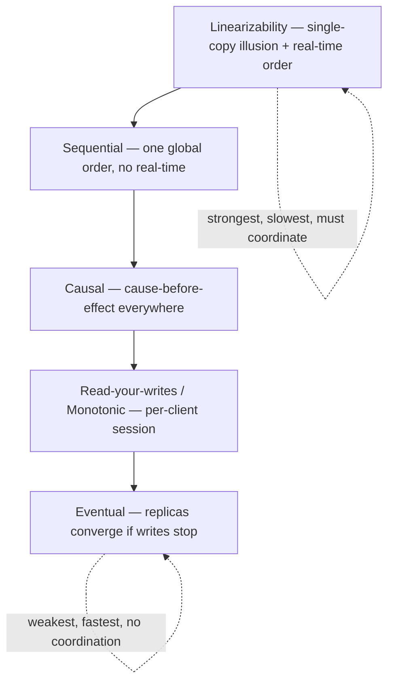
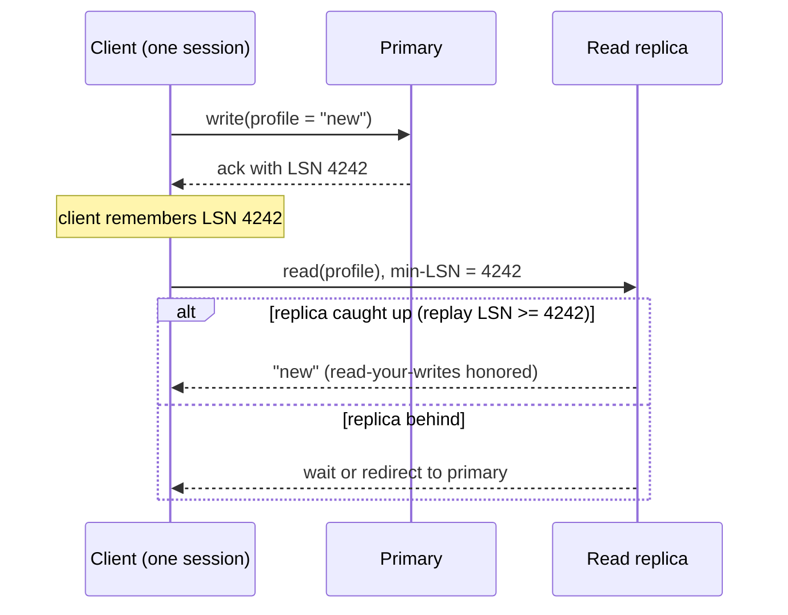
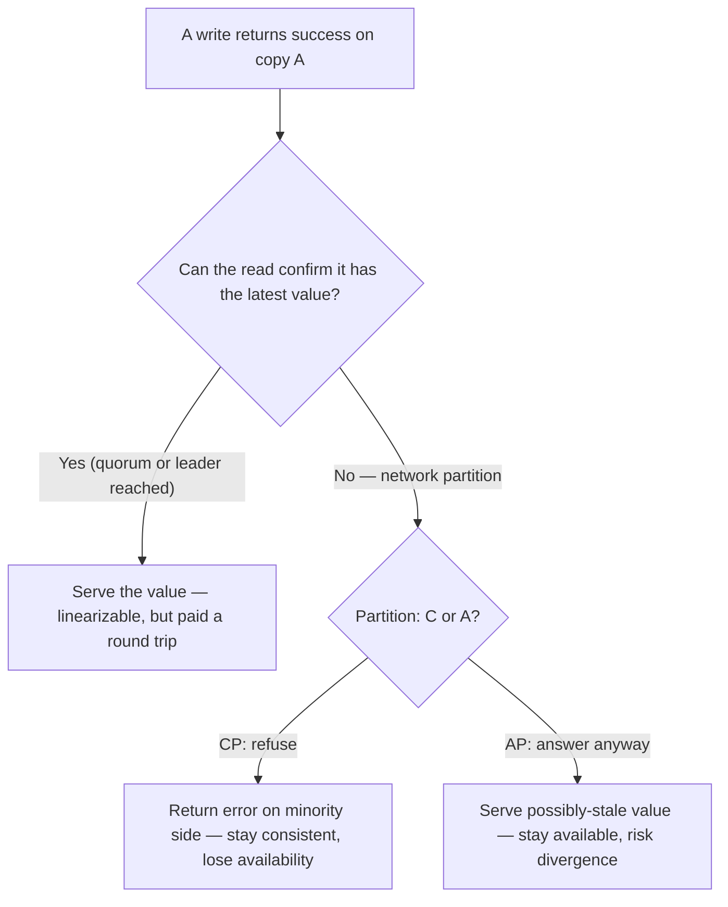
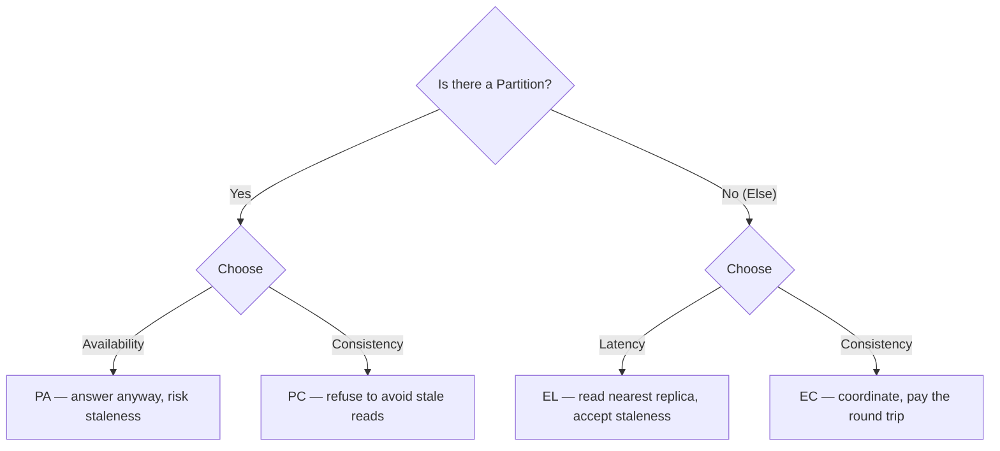

# Consistency Models, CAP & PACELC

> Where this fits: the moment you put a second copy of your data anywhere — a read replica, a cache, a second region — you inherit a consistency problem whether you name it or not. This chapter gives you the vocabulary to name it precisely.
>
> **Principal-level takeaway:** "Consistency vs availability" is not a one-time architectural choice — it is a *per-operation* choice you make over and over, and the honest framing is PACELC, not CAP: even when nothing is broken, you are paying for consistency in *latency*. The principal's skill is deciding which guarantee each operation actually needs, not which one the database can theoretically provide.

---

## The Mental Model — first principles: why does this thing exist?

Start with the thing we wish we had: a single copy of the data, on one machine, accessed by one client at a time. There is no ambiguity. You write `x = 5`, then you read `x`, you get `5`. Every observer agrees on what happened and in what order. This is the gold standard, and the entire field of consistency models exists because we *cannot keep it* once we add concurrency, replication, or geography.

Why do we add those things? Three unavoidable pressures:

1. **Durability and availability** — one machine dies, takes your data with it. So you keep copies (replicas). Now copies can disagree.
2. **Throughput and capacity** — one machine can't hold all the data or serve all the reads. So you shard and you add read replicas. Now there are multiple authorities.
3. **Latency and geography** — a user in Sydney shouldn't pay a 150 ms round trip to Virginia for every read. So you put data near them. Now "near them" and "the truth" are different places.

The instant you have two copies of a value that can be read and written independently, you have to answer a question that didn't exist before: **when I write to copy A and you read from copy B, what are you allowed to see?** A consistency model is exactly the *contract* that answers this. It is a promise the system makes to the programmer about which outcomes are possible and which are forbidden. A *strong* model forbids a lot (easy to reason about, expensive to provide). A *weak* model forbids little (cheap and fast, brutal to reason about).

That tension — ease of reasoning vs. cost and speed — is the whole game. Everything below is a point on that spectrum.

> Replication mechanics (sync vs async, leader/follower, quorums) live in [Replication](../01-building-blocks/09-replication.md). This chapter is about the *guarantees* those mechanics produce.

---

## Core Concepts

### The consistency spectrum, from strongest to weakest

Think of consistency models as a stack of promises. Each lower level relaxes a promise the level above it made. The two axes that matter are **what single-copy illusion does the client see** and **what ordering across operations is guaranteed**.



Each step down the stack relaxes a promise the level above made — and gets cheaper and more available as it does. The top forbids the most (easy to reason about, expensive to provide); the bottom forbids the least (cheap and fast, brutal to reason about).

#### Linearizability — the single-copy illusion

Linearizability is the strongest *single-object* guarantee. Its promise: the system behaves **as if there is exactly one copy of the data**, and every operation appears to take effect **atomically at some single instant between when you called it and when it returned**. Crucially it respects **real time** (also called wall-clock or external order): if operation A finishes before operation B begins, every observer must agree A happened before B.

The concrete consequence everyone cares about: **once a write completes and returns success, every subsequent read — from anyone, anywhere — must see that write or a later one.** No stale reads, ever. This is why you sometimes hear it called "atomic consistency" or "strong consistency."

```
Client 1:  ──write(x=5)──✔
Client 2:                  ──read(x)?──→  MUST return 5 (or newer). 4 is illegal.
```

Linearizability is a guarantee about **single objects** (a single key, a single register). It is *not* multi-object — that's the job of serializable transactions, a different and stronger thing. Many engineers conflate the two; keep them separate.

Cost: to guarantee no observer ever sees a stale value, a read or write generally must coordinate with enough replicas to be sure it has the latest value. That coordination is a round trip to a quorum or a leader — real latency, and it becomes *unavailable* the moment the network won't let you reach that quorum. This is the heart of CAP.

#### Sequential consistency

Sequential consistency keeps the single-copy illusion — there is one global order of operations that all clients agree on — but **drops the real-time requirement**. The global order must be consistent with each individual client's program order, but it need not match wall-clock time. So if Client 1's write finishes before Client 2's read starts in real time, Client 2 might *still* legally see the old value, as long as *some* consistent global order explains everyone's observations.

In practice you rarely design explicitly to "sequential consistency" in distributed storage; it's more a concept from shared-memory multiprocessors. But it's a useful rung: it shows that "everyone agrees on one order" (sequential) and "that order matches real time" (linearizable) are *separable* promises, and the real-time part is the expensive part.

#### Causal consistency

Causal consistency is the sweet spot a lot of well-designed systems aim for. The promise: **operations that are causally related are seen by everyone in the same order; operations that are concurrent (unrelated) may be seen in different orders by different clients.**

"Causally related" means one operation could have influenced another:
- You write a comment, *then* (having seen it) you write a reply → the reply causally depends on the comment.
- Two people independently post unrelated photos → concurrent, no required order.

The classic failure causal consistency prevents: someone sees a reply ("LOL me too!") *before* the message it replies to. Under eventual consistency that's legal and looks like a glitch; under causal consistency it's forbidden.

> **Interactive:** [Vector Clocks & Causality (interactive)](../animations/vector-clocks.html) -- post a reply, then watch the dependency vector force it to appear after the message it answers, never before.

The beautiful property: **causal consistency is the strongest model that can still be fully available during a network partition.** (This is a real theorem — see Mahajan et al., and the COPS/Bolt-on systems.) You don't have to talk to a quorum to honor causality; you just have to track dependencies (often with version vectors) and not reveal an effect before its cause. That makes it cheap *and* intuitive — the best of both, with the catch that tracking dependencies at scale is genuinely hard engineering.

#### Read-your-writes & monotonic guarantees (client-centric / session guarantees)

These are weaker still, and they're defined from the **client's** point of view — they're often called *session guarantees*. They don't promise anything about what *other* clients see; they only promise *your own session* is sane:

- **Read-your-writes (read-after-write):** after *you* write something, *you* will see it in subsequent reads. Prevents the maddening "I updated my profile, refreshed, and it's gone" bug on a read-replica setup.
- **Monotonic reads:** once you've seen a value, you won't later see an *older* one. Prevents "time going backwards" — refresh and the comment count drops from 12 to 9.
- **Monotonic writes:** your writes are applied in the order you issued them.
- **Writes-follow-reads:** if you read X and then write Y, Y is ordered after X everywhere.

These are cheap to implement (e.g., pin a session to a replica, or include a "minimum version I've seen" token in requests) and they fix the *most common* user-visible weirdness without paying for global ordering. A huge fraction of "we need strong consistency" requests are actually just "we need read-your-writes."

The token-based version is the more robust of the two: the write returns a version (a Postgres LSN, a Cassandra timestamp, a logical clock tick), the client carries it, and a read either waits for / routes to a replica that has caught up to that version, or falls back to the leader. The session never sees its own write disappear, yet other clients are free to read the cheap, possibly-stale path.



**Read-your-writes router — pin the read to a replica fresh enough to see the version you just wrote (else fall back to the leader).**

```go
package ryw

import (
	"context"
	"errors"
)

// LSN is a monotonic write position (Postgres LSN, Kafka offset, logical tick).
type LSN uint64

type Replica struct {
	Name    string
	ReplayLSN func(context.Context) (LSN, error) // how far this replica has applied
	Read      func(context.Context, string) (string, error)
}

type Leader struct {
	Write func(ctx context.Context, key, val string) (LSN, error)
	Read  func(ctx context.Context, key string) (string, error)
}

// Session carries the highest LSN this client has observed from its own writes.
type Session struct {
	leader   *Leader
	replicas []*Replica
	seenLSN  LSN // read-your-writes watermark
}

func NewSession(l *Leader, r []*Replica) *Session {
	return &Session{leader: l, replicas: r}
}

func (s *Session) Write(ctx context.Context, key, val string) error {
	lsn, err := s.leader.Write(ctx, key, val)
	if err != nil {
		return err
	}
	if lsn > s.seenLSN {
		s.seenLSN = lsn // advance the watermark; reads must now meet or beat it
	}
	return nil
}

// Read routes to any replica that has caught up to seenLSN; otherwise the leader.
func (s *Session) Read(ctx context.Context, key string) (string, error) {
	for _, r := range s.replicas {
		applied, err := r.ReplayLSN(ctx)
		if err != nil {
			continue // skip an unreachable/slow replica
		}
		if applied >= s.seenLSN {
			return r.Read(ctx, key) // fresh enough to honor read-your-writes
		}
	}
	// No replica is caught up — fall back to the leader, which is by definition current.
	if s.leader == nil {
		return "", errors.New("no replica caught up and no leader available")
	}
	return s.leader.Read(ctx, key)
}
```

```java
import java.util.List;
import java.util.function.Function;

/** A monotonic write position (Postgres LSN, Kafka offset, logical tick). */
public final class ReadYourWritesSession {

    interface Replica {
        String name();
        long replayLsn();                 // how far this replica has applied
        String read(String key);
    }

    interface Leader {
        long write(String key, String value); // returns the write's LSN
        String read(String key);
    }

    private final Leader leader;
    private final List<Replica> replicas;
    private long seenLsn = 0L;            // read-your-writes watermark

    public ReadYourWritesSession(Leader leader, List<Replica> replicas) {
        this.leader = leader;
        this.replicas = replicas;
    }

    public void write(String key, String value) {
        long lsn = leader.write(key, value);
        if (lsn > seenLsn) {
            seenLsn = lsn;               // advance; reads must now meet or beat it
        }
    }

    /** Route to a replica caught up to seenLsn; otherwise fall back to the leader. */
    public String read(String key) {
        for (Replica r : replicas) {
            long applied;
            try {
                applied = r.replayLsn();
            } catch (RuntimeException unreachable) {
                continue;                // skip a slow/unreachable replica
            }
            if (applied >= seenLsn) {
                return r.read(key);      // fresh enough to honor read-your-writes
            }
        }
        if (leader == null) {
            throw new IllegalStateException(
                "no replica caught up and no leader available");
        }
        return leader.read(key);         // leader is by definition current
    }
}
```

#### Eventual consistency

The weakest commonly named model. The only promise: **if writes stop, all replicas will eventually converge to the same value.** It says nothing about *when*, nothing about what you see in the meantime, and nothing about ordering. Reads can be stale, can go backwards, can show effects before causes. It is the cheapest and most available model, and it's perfectly appropriate for data where temporary disagreement is harmless (a like count, a "last seen" timestamp, a cache).

"Eventual" hides a critical sub-problem: when two replicas *did* diverge, how do you reconcile? Options include last-writer-wins (simple, silently loses data), version vectors + application-level merge (Dynamo's siblings), or CRDTs (data types mathematically guaranteed to converge — counters, sets, etc.). See [NoSQL & Data Models](../01-building-blocks/08-databases-nosql.md) and [Time, Clocks & Ordering](../02-distributed-systems/14-time-clocks-ordering.md) for the machinery.

### Client perspective vs. storage perspective

This distinction trips up almost everyone, so make it explicit. There are two ways to talk about consistency:

- **Storage / data-centric view:** "How synchronized are my replicas?" Linearizable, sequential, eventual — these describe the *system's* internal state of agreement.
- **Client-centric / session view:** "What can a given user observe across their requests?" Read-your-writes, monotonic reads — these describe one client's *experience*.

A system can be eventually consistent at the storage layer but still offer read-your-writes to each client by routing a user's reads to a replica known to have their writes. The user's *experience* is solid even though the global state is loosely synced. **Principals design from the client experience inward**, then pick the cheapest storage model that delivers it — rather than reflexively reaching for linearizability because it "feels safe."

### CAP, stated correctly

CAP is the most misquoted theorem in our field. Here is the precise version (Gilbert & Lynch, 2002, formalizing Brewer's conjecture):

> In an asynchronous network where messages can be lost (i.e., **during a network partition**), a system cannot simultaneously provide both **C**onsistency (here meaning *linearizability*) and **A**vailability (every request to a non-failed node gets a non-error response). It must give up one.

Read what it actually says and — more importantly — what it does **not** say:

- The "choice" between C and A **only applies during a partition.** When the network is healthy, CAP is silent. You can have both.
- The "C" in CAP is specifically **linearizability**, not "my database has constraints" or "ACID." This is a notorious naming collision.
- The "A" is a strong, absolute availability (every node, always answers) — not the fuzzy "five nines" SLA sense.

So the real decision CAP forces is narrow: **when a partition happens and a replica can't confirm it has the latest data, does it (a) refuse the request to avoid serving stale data [CP], or (b) answer anyway and risk inconsistency [AP]?**



> **Interactive:** [CAP: Choosing C vs A During a Partition (interactive)](../animations/cap-partition.html) -- cut the link between two replicas, then toggle CP vs AP and watch one side error out versus both sides diverge.

#### Why "CA" is a misnomer

People draw the famous Venn diagram with three circles and put "single-node RDBMS" or "traditional Postgres" in the CA wedge. This is wrong, and saying so is a quick way to sound like you actually understand it.

Partitions are not an option you can decline. Networks *will* drop packets, switches *will* fail, cables *will* get cut. So **P is not a property you choose — it's the environment you're forced to operate in.** Given partitions are inevitable, the only meaningful choice is C-vs-A *when one occurs*. A "CA system" is really just a system that hasn't decided what it'll do during a partition — which in practice means it'll do something bad (split-brain, lost writes, or hanging). A single-node database isn't "CA"; it's a system with no network to partition, so CAP simply doesn't apply to it. The moment you replicate it, you're choosing CP or AP.

### PACELC — the framing that's actually useful

CAP's fatal flaw is that partitions are *rare*. If the only trade-off were during partitions, CAP would be a footnote. PACELC (Daniel Abadi, 2010/2012) fixes this by describing the trade-off you pay **all the time**:

> **PAC** — if there is a **P**artition, choose between **A**vailability and **C**onsistency.
> **ELC** — **E**lse (normal operation, no partition), choose between **L**atency and **C**onsistency.

The "Else" clause is the insight. Even with a perfectly healthy network, **the cost of strong consistency doesn't go away — it just changes from unavailability to latency.** To guarantee a linearizable read, you must confirm with a quorum or the leader, and that confirmation is a network round trip you can't skip. Want it faster? Read from the nearest replica without confirming — and accept staleness. So:

- A system is classified like `PC/EL` (consistent under partition, low-latency otherwise) or `PA/EL` (available and fast, weakly consistent) or `PC/EC` (consistent always, pays latency always).



This is why PACELC matters more to a principal than CAP: **most of your system's life is spent in the "Else" branch.** The everyday question isn't "what happens in a partition" — it's "am I willing to pay 5–50 ms of cross-replica/cross-region latency on every read to never serve a stale byte?" That is a *product* question disguised as an infrastructure one.

> Latency math (intra-AZ ~0.5 ms, cross-region 50–150 ms RTT) is in [Capacity & Latency Estimation](../00-foundations/04-capacity-estimation.md). The coordination that makes linearizability expensive is [Consensus](../02-distributed-systems/13-consensus.md).

---

## Trade-offs at a Glance

| Model | Promise | Stale reads? | Available in partition? | Typical cost | Use when |
|---|---|---|---|---|---|
| **Linearizable** | Single-copy illusion + real-time order, single object | Never | No (must be CP) | Quorum/leader round trip per op | Locks, leader election, account balances, uniqueness |
| **Serializable** (txn) | Multi-object txns appear to run one-at-a-time (no real-time guarantee) | Possibly — a consistent *snapshot* may lag real time; *strict* serializability forbids this | No | 2PL / SSI overhead, contention | Invariants spanning rows (bank transfer, inventory) |
| **Sequential** | One global order all agree on, no real-time | Possibly (vs real time) | No | Cheaper than linearizable | Rare in practice; conceptual rung |
| **Causal** | Cause-before-effect everywhere; concurrent ops unordered | Yes, but never out-of-causal-order | **Yes** (strongest that can be AP) | Dependency tracking (version vectors) | Comments/replies, collaborative apps, social graphs |
| **Read-your-writes / Monotonic** | Your own session is sane | Yes (for others' writes) | Yes | Session pinning or version tokens | User-facing reads off replicas (profiles, settings) |
| **Eventual** | Replicas converge if writes stop | Yes, freely | Yes | Cheapest; reconciliation needed | Like counts, view counts, caches, presence |

| Theorem framing | What it tells you | When it applies | Verdict |
|---|---|---|---|
| **CAP** | C vs A during a partition | Only during partitions | True but narrow; the "CA" corner is a category error |
| **PACELC** | + L vs C during normal operation | All the time | The framing principals should reach for |

---

## How Real Systems Do It

Concrete, named, with rough numbers. (PACELC labels follow Abadi's classification.)

- **Google Spanner — `PC/EC`.** Linearizable (externally consistent) *globally*, using TrueTime (GPS + atomic clocks giving a bounded clock uncertainty ε, historically ~1–7 ms). It guarantees correctness by **deliberately waiting out the uncertainty** ("commit wait"): a transaction waits ~2ε before committing so its timestamp is unambiguously in the past. The cost is exactly PACELC's "EC" — you pay latency for consistency even with no partition. Spanner chooses to stay consistent and sacrifice some availability/latency rather than ever serve stale.

- **Amazon DynamoDB / classic Dynamo — `PA/EL` by default, tunable.** Eventually consistent reads are the default and cheapest (read any replica, ~single-digit ms). You can request a **strongly consistent read** per call — it costs more (2× read capacity units) and is higher latency because it reads from the leader. This is PACELC made literally a per-request flag: you choose L-vs-C *operation by operation*.

- **Apache Cassandra — `PA/EL`, tunable per query.** Quorum is set per read/write: `R + W > N` (e.g., N=3, W=QUORUM=2, R=QUORUM=2) guarantees the read and write quorums *overlap*, so a quorum read sees the most recent *completed* quorum write — strong freshness on the overlap. Note this is **not** full linearizability: Cassandra resolves conflicts by last-write-wins on a timestamp, and an interrupted write can leave a value visible to some quorum reads but not others; true linearizable operations require lightweight transactions (Paxos at `SERIAL` consistency). Drop to `ONE` for speed and accept staleness. One knob, slid per operation — the clearest illustration that consistency is not a system-wide property but a per-call choice.

- **PostgreSQL with replicas — `PC/EC` on the primary, eventual on async replicas.** The primary is linearizable for its own data. Async streaming replicas lag (milliseconds to seconds under load) and serve stale reads. Synchronous replication (`synchronous_commit = remote_apply`) buys stronger guarantees by making the primary *wait* for the replica — pure PACELC "EC": latency for consistency. Read-your-writes against replicas requires routing reads to the primary or recording the write's LSN and making the read wait until the replica's `pg_last_wal_replay_lsn()` has caught up to it. See [Relational Databases](../01-building-blocks/07-databases-relational.md).

- **etcd / ZooKeeper / Consul — `PC/EC`, CP by design.** These are coordination stores backed by Raft/ZAB ([Consensus](../02-distributed-systems/13-consensus.md)). They will *refuse* writes (and linearizable reads) when they can't reach a quorum — because their entire job is locks, config, and leader election, where a stale answer is worse than no answer. Minority-side nodes go unavailable on purpose.

- **MongoDB — tunable via write/read concern.** `writeConcern: majority` + `readConcern: majority`/`linearizable` moves you toward CP/EC; `w:1` + local reads moves toward AP/EL. Again: a knob, not a fixed identity.

The pattern across all of them: **modern systems don't have *a* consistency level — they expose consistency as a per-operation parameter.** The principal's job is to set it correctly per operation, not to brand the whole system "strong" or "eventual."

---

## Failure Modes & Common Misconceptions

**Myth 1: "We need a CA database."** There's no such thing in a replicated system. Partitions aren't optional. Correct statement: "We're CP, so during a partition the minority side rejects writes," or "We're AP, so during a partition we accept writes and reconcile later." Saying "CA" reveals you think partitions are avoidable.

**Myth 2: "The C in CAP means ACID consistency."** No. CAP's C is linearizability (a replication/ordering property). ACID's C is "transactions preserve your invariants/constraints" (a single-node integrity property). Two unrelated meanings that share a letter. A single-node ACID database has nothing to say about CAP.

**Myth 3: "Eventual consistency means data is usually correct and occasionally wrong."** It means *no bound at all* on staleness in the worst case, and reads can move *backwards* in time. The danger isn't average-case staleness; it's the specific anomalies (lost updates, reads-before-writes-you-made) that surface under exactly the load and failure conditions you didn't test.

**Myth 4: "Strong consistency = correctness; eventual = sloppy."** Wrong framing. The right model is the *weakest one that still satisfies the invariant the product needs*. Using linearizability for a like counter is over-engineering that costs latency and availability for nothing. Using eventual consistency for a bank balance is a bug. Correctness is matching the model to the invariant.

**Myth 5: "Linearizable = serializable."** No. Linearizability is about *single objects* and real-time ordering. Serializability is about *multiple-object transactions* appearing to run one at a time, with no real-time guarantee. **Strict serializability** = both combined (what Spanner gives). Conflating them leads to designing a transaction system when you needed a register, or vice versa. ([Distributed Transactions](../02-distributed-systems/15-distributed-transactions.md).)

> **Interactive:** [Isolation Anomalies & MVCC (interactive)](../animations/mvcc-isolation.html) -- replay a dirty read, a write skew, and a lost update, then turn on snapshot isolation to watch which anomalies survive.

**Production failure mode — split-brain.** An AP system (or a CP system with a misconfigured quorum) during a partition lets *both* sides accept writes. When the partition heals, you have two divergent histories. If your conflict resolution is last-writer-wins on a wall clock, you **silently lose** one side's writes — and clock skew determines who wins. This is the single most common way teams get burned by not thinking about consistency.

**Production failure mode — the "phantom" read-your-writes bug.** App writes to the primary, immediately reads from a load-balanced replica that hasn't caught up, and shows the user stale data. Looks like a bug in the app; it's a missing session guarantee. The fix is cheap (route the user's reads to the primary briefly, or use a version token) — but only if you knew to ask the question.

---

## In a Design Discussion

When you're at the whiteboard and consistency comes up, the level of your thinking shows immediately.

**The junior take:** "Let's use a strongly consistent database so we don't have bugs." Treats consistency as a binary safety setting, picks the strongest one to be safe, and never revisits it. The hidden costs — every read pays a coordination round trip, the system goes down when a quorum is unreachable, cross-region latency balloons — surface later as "why is this slow / why did this page when one AZ blipped."

**The principal take:** walks the data, operation by operation, and asks for each: *what's the actual invariant, and what's the weakest model that protects it?*

> "Account balance and the idempotency key on payments need linearizable / serializable — a stale or doubled read is real money, so that path is CP and pays the latency. The user's feed and like counts are fine eventually consistent — we'll serve from the nearest replica for speed [PA/EL]. The one thing users *will* notice is editing their own profile and seeing it revert, so we add read-your-writes on that path with session pinning — that's cheap and fixes 90% of the perceived 'bugs.' For the cross-region story: we accept that the EU region reads its own writes but may lag US writes by a second; that's a product decision the PM signed off on, not an accident."

Notice what the principal did: (1) **decomposed by operation**, not by system; (2) named the **invariant** before the mechanism; (3) reached for the **cheapest sufficient** model; (4) reasoned in **PACELC** ("pays the latency," "lag by a second") not just CAP; (5) turned the trade-off into an **explicit, signed-off product decision** rather than an implicit default. That last move — making the consistency/latency trade-off visible to the people who own the user experience — is the principal-est thing on the list. Capture it in an [ADR](../05-principal-skills/29-tradeoffs-and-adrs.md).

A good closing question to pose to yourself or the room: *"For each piece of data, what's the worst thing that happens if a reader sees a value that's 5 seconds stale?"* If the answer is "nothing," you've just saved a quorum round trip. If it's "we double-charge a customer," you've found where the money for consistency goes.

---

## Self-Check

<details>
<summary>1. State CAP precisely. What does it say when the network is healthy?</summary>

During a network partition you must choose between linearizable consistency and availability (every non-failed node answering). When there's no partition, CAP says **nothing** — you can have both. The trade-off is conditional on partition.
</details>

<details>
<summary>2. Why is calling a system "CA" a category error?</summary>

Partitions are not a property you choose to support — they're an inevitable fact of networks. So "P" is the environment, not an option. The real choice is C-vs-A *when a partition occurs*. A "CA" design just hasn't decided what it does in a partition, which means it'll do something bad (split-brain or hang). A single-node DB isn't "CA"; CAP simply doesn't apply with no network.
</details>

<details>
<summary>3. What does PACELC add that CAP misses, and why does it matter more day-to-day?</summary>

The "Else" clause: even with no partition, you trade **Latency vs Consistency**. Strong consistency requires coordination (a round trip), so it costs latency *all the time*, not just during rare partitions. Since systems spend ~all their time partition-free, the L-vs-C trade-off is the one you actually pay constantly.
</details>

<details>
<summary>4. Difference between linearizability and serializability?</summary>

Linearizability = single-object, real-time ordering (a write that returned is visible to all later reads). Serializability = multi-object transactions appear to execute one at a time, no real-time guarantee. **Strict serializability** = both. You can have one without the other.
</details>

<details>
<summary>5. A user updates their profile, refreshes, and sees the old value. Which guarantee is missing, and is it expensive to add?</summary>

Read-your-writes (a session guarantee). Cheap: pin that user's reads to the primary briefly, or attach a "minimum version seen" token so the read waits for / routes to a sufficiently fresh replica. No global ordering required.
</details>

<details>
<summary>6. Why is causal consistency special among the models?</summary>

It's the **strongest** consistency model that remains **fully available during a partition** (a proven result). It preserves cause-before-effect ordering — preventing the "reply before message" anomaly — without needing quorum coordination, just dependency tracking.
</details>

<details>
<summary>7. Spanner is globally linearizable. What's the catch, in PACELC terms?</summary>

It's `PC/EC`: it pays latency for consistency even with no partition. TrueTime gives a bounded clock-uncertainty ε, and Spanner does **commit-wait** (~2ε) so timestamps are unambiguously ordered. The price of never serving stale is added commit latency.
</details>

<details>
<summary>8. When is eventual consistency the *correct* choice, not a compromise?</summary>

When the invariant the product needs tolerates temporary disagreement — like counts, view counts, presence/"last seen," caches. There, paying for stronger consistency buys nothing and costs latency and availability. Matching the weakest sufficient model to the invariant *is* correctness.
</details>

---

## Go Deeper

- **Designing Data-Intensive Applications (Kleppmann)** — **Ch. 5 (Replication)** for the mechanics that produce these guarantees, **Ch. 9 (Consistency and Consensus)** for linearizability, the "single-copy illusion," and why it's expensive. This chapter is essentially a guided tour of DDIA Ch. 9; read it next.
- **Gilbert & Lynch (2002), "Brewer's Conjecture and the Feasibility of Consistent, Available, Partition-Tolerant Web Services"** — the formal CAP proof. Short and worth reading to see what's actually claimed.
- **Daniel Abadi (2012), "Consistency Tradeoffs in Modern Distributed Database System Design"** (IEEE Computer) and his blog post introducing **PACELC**. The clearest articulation of the "Else" insight.
- **Werner Vogels, "Eventually Consistent"** (CACM, 2009) — the canonical treatment of session guarantees (read-your-writes, monotonic reads) from the Amazon Dynamo lineage.
- **DeCandia et al. (2007), "Dynamo: Amazon's Highly Available Key-value Store"** — AP design, version vectors, and conflict reconciliation in the wild. Pairs with [Object/KV store case study](../04-design-case-studies/26-object-store-and-kv-store.md).
- **Corbett et al. (2012), "Spanner: Google's Globally-Distributed Database"** — TrueTime and how to buy global linearizability with hardware clocks + commit-wait.
- **Lloyd et al. (2011), "Don't Settle for Eventual" (COPS)** — causal consistency at scale, and the proof-of-concept that you can stay available *and* causal.
- **Peter Bailis et al., "Highly Available Transactions" (HAT)** and **Jepsen reports (Kyle Kingsbury, jepsen.io)** — the latter are adversarial tests of what real databases *actually* guarantee vs. what they market. Reading a Jepsen analysis is the fastest way to develop healthy skepticism.

**Sibling chapters:** [Replication](../01-building-blocks/09-replication.md) · [Consensus](../02-distributed-systems/13-consensus.md) · [Time, Clocks & Ordering](../02-distributed-systems/14-time-clocks-ordering.md) · [Distributed Transactions](../02-distributed-systems/15-distributed-transactions.md) · [NoSQL & Data Models](../01-building-blocks/08-databases-nosql.md) · root [index](../README.md) · [roadmap](../ROADMAP.md)
