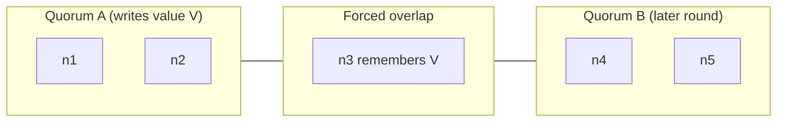
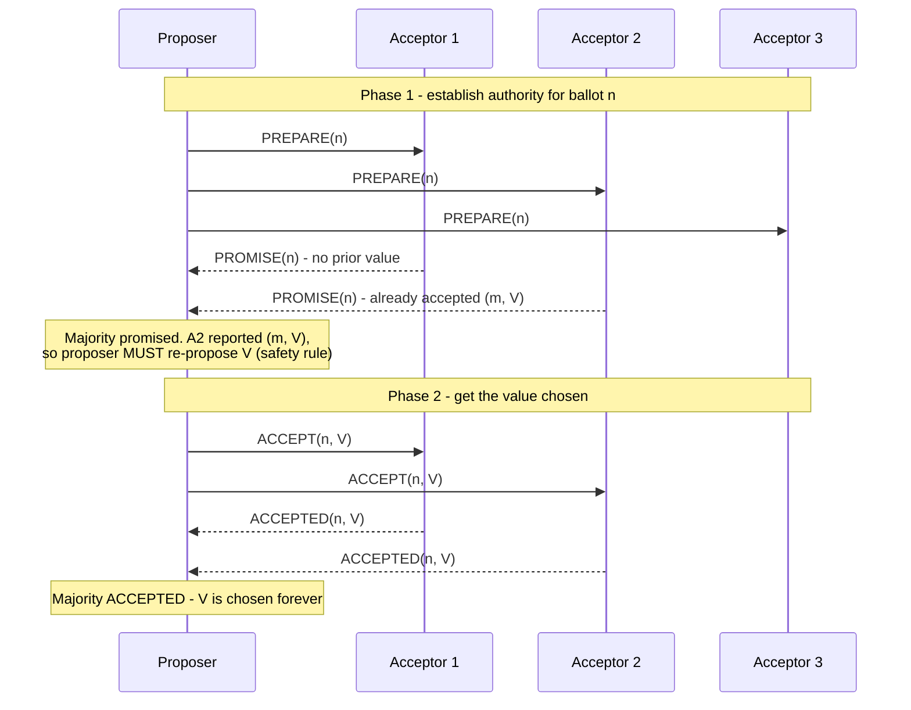
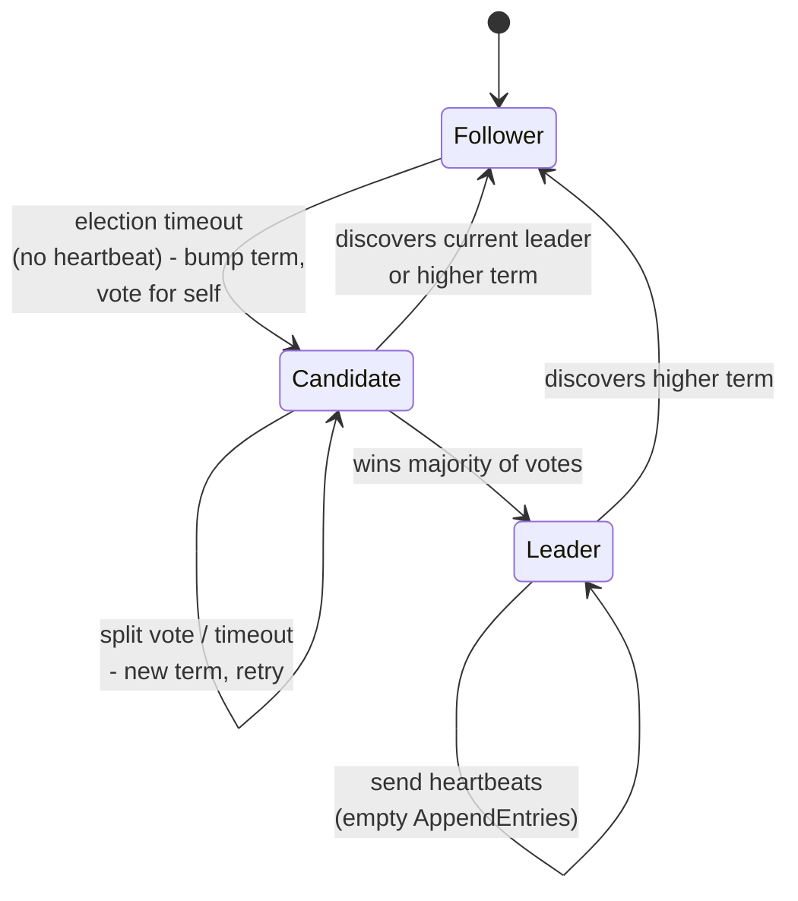
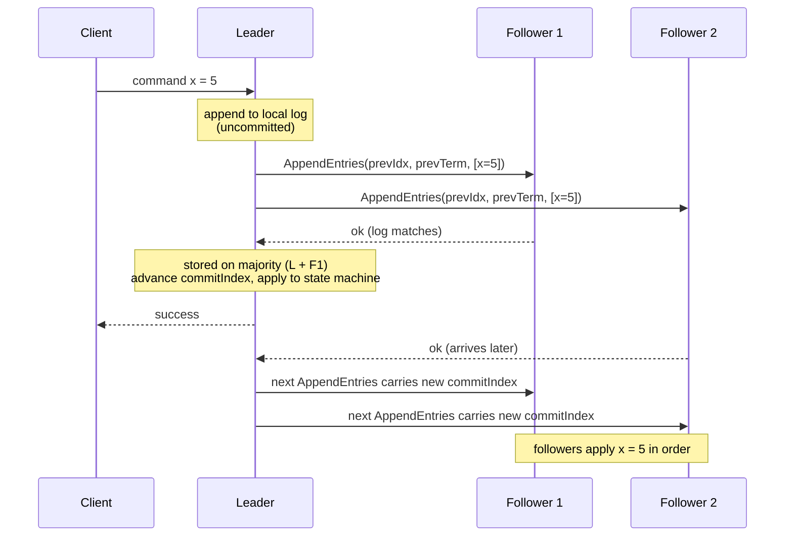
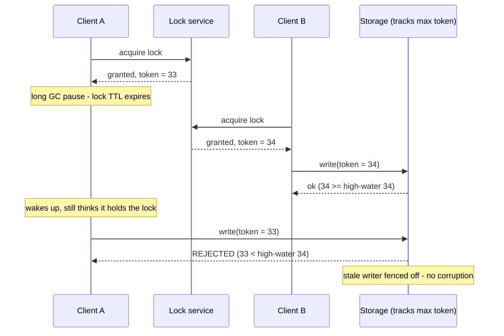

# Consensus: Paxos, Raft & Leader Election

> Where this fits: consensus is the load-bearing primitive *underneath* your databases, your service discovery, your feature flags, and your "who is the leader" question. You rarely implement it; you constantly depend on it. This sits between [Replication](../01-building-blocks/09-replication.md) (how copies stay in sync) and [Distributed Transactions](./15-distributed-transactions.md) (how multiple writes commit atomically), and it cashes out the theory from [Consistency Models, CAP & PACELC](./12-consistency-and-cap.md).
>
> **Principal-level takeaway:** Consensus turns *N* unreliable machines into *one* reliable, linearizable decision-maker — but it does so by making every decision wait for a **majority round-trip** and by **sacrificing availability when a majority is unreachable**. So the principal move is almost never "let's run Raft here." It's "let's put the *smallest possible amount of state* behind consensus (the metadata, the leader lease, the config) and keep the *bulk* of the data on cheaper, faster replication." Consensus is a scalpel, not a hammer.

---

## ⚡ 60-Second TL;DR

- **Consensus** = make *N* flaky nodes agree on one value (leader, lock, log entry) with **linearizable** safety; you depend on it, rarely build it.
- **Paxos** (proven, hard) vs **Raft** (same safety, understandable) vs **ZAB** (ZooKeeper) — identical steady-state cost; pick Raft for new work.
- **Quorum rule:** majority = `⌊N/2⌋+1`; two majorities always overlap → size **3/5/7** (odd), tolerating `⌊(N-1)/2⌋` failures.
- **#1 cost:** every write waits a **majority round-trip** and the cluster goes **read-only when a majority is unreachable** (CP, by FLP).
- **#1 trap:** a distributed lock without a **fencing token** doesn't prevent two writers — a GC-paused holder double-writes.
- **CFT, not BFT:** survives crashes/loss, *not* lying/malicious nodes (that needs `3f+1`).

**Remember one thing:** Put the *smallest possible state* (metadata, leases, leader pointer) behind consensus and keep the bulk of data on cheaper replication — it's a scalpel, not a hammer.

## The Mental Model — why does this thing exist?

Start with the problem that won't go away. You have several machines. They need to **agree on a single value** — which node is the primary, whether a lock is held, what the current cluster membership is, what the next entry in a replicated log should be. In a single-machine world this is trivial: there's one copy of the truth, protected by a mutex. The moment you have more than one machine and a network between them, "the truth" can fork.

Two things conspire against you:

1. **Crashes.** Any node can stop at any time — mid-write, mid-message, between two lines of code. It may come back later with stale state, or never come back.
2. **The network is not your friend.** Messages can be delayed arbitrarily, reordered, duplicated, or dropped. Crucially, *you cannot tell the difference between a slow node and a dead node.* A node that hasn't answered in 5 seconds might be wedged on GC, or it might be on fire. (See [Networking](../00-foundations/01-networking.md) for why "the network is reliable" is the first of the Fallacies of Distributed Computing.)

Consensus is the algorithm family that lets a group of nodes agree on one value with three guarantees:

- **Agreement** (a.k.a. safety): no two correct nodes decide *different* values. This is the one you must never violate — violating it means split-brain, double-spends, two leaders.
- **Validity** (integrity): the value decided was actually proposed by some node. You can't agree on garbage nobody asked for.
- **Termination** (liveness): every correct node *eventually* decides. The system makes progress.

The deep, uncomfortable truth — and the thing that separates someone who's read a blog post from someone who understands this — is that **you cannot have all three, all the time, in an asynchronous network where even one node can fail.** That's the FLP result, and everything practical flows from how we dodge it.

---

## Core Concepts

### FLP: the impossibility you must respect

In 1985, Fischer, Lynch, and Paterson proved that in a **fully asynchronous** system (no bound on message delay or processing time), there is **no deterministic algorithm** that guarantees consensus if even a *single* node may crash. The intuition: because you can't distinguish "slow" from "dead," any algorithm that waits for a node can be forced to wait forever (so it can't guarantee termination); any algorithm that gives up on a node can be tricked into deciding wrongly when that node was merely slow and held a different value (so it can't guarantee agreement). There's always a knife-edge schedule where the system can be kept undecided forever.

Read the scope carefully, because beginners overstate it:

- FLP says *deterministic guaranteed* termination is impossible. It does **not** say consensus is impossible in practice.
- FLP is about a **fully async** model with **no clocks**. Real networks are mostly synchronous-ish: messages usually arrive in tens of milliseconds.

Real systems sidestep FLP two ways:

1. **Timeouts (partial synchrony).** Assume the network is *eventually* well-behaved. Use timers as a *failure detector*: "I haven't heard from the leader in 150ms, I'll assume it's dead and start an election." This can be wrong (you might suspect a live-but-slow leader), but a wrong suspicion only costs you a hiccup of liveness — never safety. This is the Raft/Paxos approach. The price of being wrong is a re-election, not a corrupted decision.
2. **Randomization.** Algorithms like Ben-Or's flip coins to break the symmetry FLP exploits; they terminate with probability 1. Blockchain-flavored protocols lean here too. Less common in classic coordination services.

The principal framing: **FLP is why every consensus system you'll touch chooses safety over liveness.** When the network partitions, etcd/ZooKeeper/Raft clusters will *stop accepting writes* rather than risk two leaders. That tradeoff is not a bug — it's a direct consequence of FLP plus a deliberate engineering choice.

### Quorums and the intersection trick

Everything practical is built on one piece of arithmetic: **any two majorities of the same set must overlap in at least one member.**

If you have *N* nodes and a majority is `⌊N/2⌋ + 1`, then any two majority sets share at least one node. Proof by pigeonhole: two sets of size > N/2 can't be disjoint inside a set of size N. That single shared node is the carrier of memory — it was part of the last decision *and* the current one, so it can veto a contradiction.

```
N = 5,  majority = 3
Quorum A: {n1, n2, n3}
Quorum B:         {n3, n4, n5}
                   ^^^  n3 is in both — it remembers.
```

The same idea, drawn as set membership — note that `n3` is forced into the overlap because two size-3 subsets of a 5-element set cannot be disjoint:



This is why consensus clusters are sized **3, 5, or 7** (odd numbers). Why odd? Because going from 3 to 4 nodes does **not** improve fault tolerance — both tolerate one failure (majority of 3 is 2, majority of 4 is 3, so 4 nodes still only survive one loss) — but 4 nodes give you *more* ways to fail and a larger quorum to wait on. Odd sizes maximize fault tolerance per dollar:

| Cluster size N | Majority quorum | Failures tolerated |
|---|---|---|
| 1 | 1 | 0 |
| 3 | 2 | 1 |
| 5 | 3 | 2 |
| 7 | 4 | 3 |

The generalization (read/write quorums for non-consensus replication, `R + W > N`) is covered in [Replication](../01-building-blocks/09-replication.md); consensus is the special, strict case where the read and write quorums are both majorities and we layer a leader and a log on top.

### Paxos — at the level of intuition

Paxos (Lamport, 1998 — the "Part-Time Parliament" paper) is the foundational algorithm. It's famously hard to teach, so here's the load-bearing intuition rather than a line-by-line transcript.

Three roles (one physical node usually plays all three):
- **Proposers** suggest values.
- **Acceptors** vote. A majority of acceptors deciding = the value is chosen.
- **Learners** find out what was chosen.

A single decision ("Single-Decree Paxos") runs in two phases. The clever bit is the **proposal number** (also called a ballot) — a globally unique, ever-increasing tag on each attempt.

```
Phase 1 — PREPARE / PROMISE
  Proposer picks ballot n, sends PREPARE(n) to acceptors.
  An acceptor that hasn't seen a higher ballot replies PROMISE(n):
    "I won't accept anything numbered below n, AND
     here's the highest-numbered value I've already accepted (if any)."

Phase 2 — ACCEPT / ACCEPTED
  If the proposer hears PROMISE from a majority:
    - If any of them reported an already-accepted value,
      the proposer MUST re-propose the highest-ballot one of those.   <-- the safety rule
    - Otherwise it may propose its own value.
  It sends ACCEPT(n, value). Acceptors accept it unless they've
  since promised a higher ballot. A majority of ACCEPTED = chosen.
```

The two-phase exchange in motion, with a 3-acceptor group (majority = 2):



The genius is the rule in bold: a proposer is not free to push its own value if an earlier value might already have been chosen. By being forced to *adopt* the highest accepted value it learns about, Paxos guarantees that once a value is chosen, every future round will converge on that same value. Quorum intersection makes this work — the majority that promises *must* include someone from the majority that previously accepted, so the prior value can't be hidden.

Two things you must know about Paxos in practice:

- **Single-decree Paxos decides one value.** To build a replicated log (a sequence of values — i.e., a state machine), you run an instance of Paxos *per log slot*. That's **Multi-Paxos**, and the key optimization is electing a stable leader so you can **skip Phase 1** for a long run of entries: the leader pre-runs PREPARE once for a whole range of slots, then just streams ACCEPTs. A steady-state Paxos commit is therefore **one round trip** — same as Raft.
- **Paxos under-specifies the practical parts.** The paper proves safety; it says little about leader election, log compaction, membership changes, or recovery. Every real "Paxos" system (Google Chubby, Spanner) is actually a heavily engineered Multi-Paxos variant, and the gap between "Paxos the proof" and "Paxos the production system" is exactly why Raft was invented.

### Raft — engineered for humans

Raft (Ongaro & Ousterhout, 2014, "In Search of an Understandable Consensus Algorithm") makes the *same* safety guarantees as Multi-Paxos but is structured to be reasoned about. It decomposes consensus into three sub-problems: **leader election**, **log replication**, and **safety**.

**Terms.** Time is divided into *terms* — monotonically increasing integers. Each term has at most one leader. Terms act as a logical clock (see [Time, Clocks & Ordering](./14-time-clocks-ordering.md)); every message carries a term, and any node seeing a higher term immediately steps down and updates. Stale messages from old terms are rejected. This single mechanism kills most split-brain scenarios.

**Leader election.** Every node is Follower, Candidate, or Leader.



> **Interactive:** [Raft: Leader Election & Log Replication (interactive)](../animations/raft.html) -- kill the leader and watch a follower time out, bump its term, and win an election; then drop packets to a follower and watch its log get repaired.

A follower that hears no heartbeat within a **randomized election timeout** (typically 150–300ms) bumps the term, becomes a candidate, votes for itself, and requests votes. A node grants its vote at most once per term, first-come-first-served, **but only if the candidate's log is at least as up-to-date as its own** (the election restriction — see below). A candidate that collects a majority becomes leader and asserts authority via heartbeats. The randomized timeout is what breaks ties: if everyone timed out simultaneously, every election would split the vote; randomization makes a clean winner overwhelmingly likely within a round or two. (This is Raft's pragmatic nod to FLP — randomization restores liveness.)

**Log replication.** Clients send commands to the leader. The leader appends to its log and sends `AppendEntries` RPCs to followers. Once an entry is stored on a **majority** of nodes, the leader marks it **committed**, advances its `commitIndex`, applies it to the state machine, and returns to the client. Followers learn the new commitIndex on the next AppendEntries and apply in order. The log is the source of truth; the state machine is its deterministic replay.

The commit path for a single client command, in a 3-node group (majority = 2):



`AppendEntries` includes the index and term of the entry *preceding* the new ones. A follower rejects if it doesn't match (the **Log Matching Property**), forcing the leader to walk backward until logs align, then overwrite the follower's divergent tail. Result: **if two logs agree on an entry at a given index/term, they are identical in all preceding entries.**

**Safety via the election restriction.** This is the subtle, exam-worthy part. How does Raft guarantee a newly elected leader has every committed entry — so it never silently erases a committed command? It does *not* track commits across leaders directly. Instead: a voter refuses to vote for a candidate whose log is **less up-to-date** than its own (compared by last entry's term, then index). Since a committed entry lives on a majority, and any winning candidate needs a majority of votes, the two majorities intersect — so at least one voter holds the committed entry and would reject any candidate missing it. **A leader can therefore only be elected if its log already contains all committed entries.** Raft layers on one more rule — a leader only commits entries from *prior* terms indirectly, by committing a current-term entry on top — to close a famous edge case (Figure 8 in the paper) where an entry replicated to a majority could otherwise still be overwritten.

The minimal mental checklist for reasoning about Raft:
- One leader per term; higher term always wins and forces step-down.
- Commit = replicated to a majority, and leaders only directly commit their *own* term's entries.
- Elections require an up-to-date log → committed data survives leader changes.

#### The vote path in real code

The two safety rules that make Raft elections correct are tiny but unforgiving: **grant at most one vote per term**, and **never vote for a candidate whose log is behind yours**. "At least as up-to-date" is defined precisely: compare the last log entry's *term* first; on a tie, the longer log (higher index) wins. The handler below also encodes the universal rule that any RPC carrying a higher term forces the receiver to step down and adopt that term before doing anything else.

**Raft RequestVote handler + term-bump / step-down logic**

```go
package raft

import (
	"sync"
)

type Role int

const (
	Follower Role = iota
	Candidate
	Leader
)

type LogEntry struct {
	Term    int
	Command any
}

type RequestVoteArgs struct {
	Term         int // candidate's term
	CandidateID  int
	LastLogIndex int // index of candidate's last log entry
	LastLogTerm  int // term of candidate's last log entry
}

type RequestVoteReply struct {
	Term        int  // receiver's currentTerm, for the candidate to update itself
	VoteGranted bool
}

type Node struct {
	mu          sync.Mutex
	id          int
	currentTerm int
	votedFor    int // -1 means "none this term"
	role        Role
	log         []LogEntry // log[0] is a sentinel at index 0

	// reset by the election-timeout goroutine whenever we hear from a
	// legitimate leader or grant a vote.
	heartbeatCh chan struct{}
}

// stepDown adopts a strictly higher term, reverting to follower and
// clearing this term's vote. Caller must hold n.mu.
func (n *Node) stepDown(term int) {
	n.currentTerm = term
	n.role = Follower
	n.votedFor = -1
}

// lastLog returns the index and term of the final entry. Caller holds n.mu.
func (n *Node) lastLog() (index, term int) {
	last := len(n.log) - 1
	return last, n.log[last].Term
}

// candidateLogUpToDate reports whether a candidate's log is at least as
// up-to-date as ours: higher last term wins; on a tie, longer log wins.
// Caller holds n.mu.
func (n *Node) candidateLogUpToDate(lastLogIndex, lastLogTerm int) bool {
	myIndex, myTerm := n.lastLog()
	if lastLogTerm != myTerm {
		return lastLogTerm > myTerm
	}
	return lastLogIndex >= myIndex
}

// RequestVote is the RPC handler invoked on a vote receiver.
func (n *Node) RequestVote(args RequestVoteArgs, reply *RequestVoteReply) error {
	n.mu.Lock()
	defer n.mu.Unlock()

	// 1. Reject stale candidates outright.
	if args.Term < n.currentTerm {
		reply.Term = n.currentTerm
		reply.VoteGranted = false
		return nil
	}

	// 2. A higher term means we are stale: step down and adopt it.
	if args.Term > n.currentTerm {
		n.stepDown(args.Term)
	}

	reply.Term = n.currentTerm

	// 3. Grant only if we haven't voted this term (or already voted for
	//    this same candidate) AND the candidate's log is up to date.
	canVote := n.votedFor == -1 || n.votedFor == args.CandidateID
	if canVote && n.candidateLogUpToDate(args.LastLogIndex, args.LastLogTerm) {
		n.votedFor = args.CandidateID
		reply.VoteGranted = true
		n.resetElectionTimer() // granting a vote counts as hearing from a leader
		return nil
	}

	reply.VoteGranted = false
	return nil
}

func (n *Node) resetElectionTimer() {
	select {
	case n.heartbeatCh <- struct{}{}:
	default: // non-blocking: timer goroutine may not be waiting yet
	}
}

// startElection bumps the term, votes for itself, and fans out RequestVote
// to peers. It returns once a majority is reached or the attempt is abandoned.
func (n *Node) startElection(peers []*Node) {
	n.mu.Lock()
	n.currentTerm++
	n.role = Candidate
	n.votedFor = n.id
	term := n.currentTerm
	lastIndex, lastTerm := n.lastLog()
	n.mu.Unlock()

	args := RequestVoteArgs{
		Term:         term,
		CandidateID:  n.id,
		LastLogIndex: lastIndex,
		LastLogTerm:  lastTerm,
	}

	votes := 1 // counts our own vote
	results := make(chan bool, len(peers))
	for _, peer := range peers {
		go func(p *Node) {
			var reply RequestVoteReply
			if err := p.RequestVote(args, &reply); err != nil {
				results <- false
				return
			}
			n.mu.Lock()
			if reply.Term > n.currentTerm {
				n.stepDown(reply.Term) // someone is ahead of us; abandon
			}
			n.mu.Unlock()
			results <- reply.VoteGranted
		}(peer)
	}

	needed := (len(peers)+1)/2 + 1
	for range peers {
		if <-results {
			votes++
		}
		if votes >= needed {
			n.mu.Lock()
			// Only ascend if we're still a candidate in the same term;
			// a concurrent higher-term RPC may have demoted us.
			if n.role == Candidate && n.currentTerm == term {
				n.role = Leader
			}
			n.mu.Unlock()
			return
		}
	}
}
```

```java
import java.util.List;
import java.util.concurrent.CompletableFuture;
import java.util.concurrent.ExecutorService;
import java.util.concurrent.atomic.AtomicInteger;
import java.util.concurrent.locks.ReentrantLock;

enum Role { FOLLOWER, CANDIDATE, LEADER }

record LogEntry(int term, Object command) {}

record RequestVoteArgs(int term, int candidateId,
                       int lastLogIndex, int lastLogTerm) {}

final class RequestVoteReply {
    int term;            // receiver's currentTerm, for the candidate to update
    boolean voteGranted;
}

final class Node {
    private final ReentrantLock lock = new ReentrantLock();
    private final int id;
    private int currentTerm = 0;
    private int votedFor = -1;            // -1 means "none this term"
    private Role role = Role.FOLLOWER;
    private final List<LogEntry> log;     // log.get(0) is a sentinel
    private final Runnable resetElectionTimer;

    Node(int id, List<LogEntry> log, Runnable resetElectionTimer) {
        this.id = id;
        this.log = log;
        this.resetElectionTimer = resetElectionTimer;
    }

    // Adopt a strictly higher term, revert to follower, clear the vote.
    // Caller must hold the lock.
    private void stepDown(int term) {
        currentTerm = term;
        role = Role.FOLLOWER;
        votedFor = -1;
    }

    private int lastLogIndex() { return log.size() - 1; }
    private int lastLogTerm()  { return log.get(log.size() - 1).term(); }

    // Candidate log is at least as up-to-date: higher last term wins;
    // on a tie, longer log wins. Caller holds the lock.
    private boolean candidateLogUpToDate(int lastIdx, int lastTerm) {
        if (lastTerm != lastLogTerm()) {
            return lastTerm > lastLogTerm();
        }
        return lastIdx >= lastLogIndex();
    }

    RequestVoteReply requestVote(RequestVoteArgs args) {
        lock.lock();
        try {
            RequestVoteReply reply = new RequestVoteReply();

            // 1. Reject stale candidates outright.
            if (args.term() < currentTerm) {
                reply.term = currentTerm;
                reply.voteGranted = false;
                return reply;
            }

            // 2. A higher term means we are stale: step down and adopt it.
            if (args.term() > currentTerm) {
                stepDown(args.term());
            }

            reply.term = currentTerm;

            // 3. Grant only if we haven't voted this term (or already voted
            //    for this candidate) AND its log is up to date.
            boolean canVote = votedFor == -1 || votedFor == args.candidateId();
            if (canVote && candidateLogUpToDate(args.lastLogIndex(), args.lastLogTerm())) {
                votedFor = args.candidateId();
                reply.voteGranted = true;
                resetElectionTimer.run(); // a granted vote counts as a heartbeat
                return reply;
            }

            reply.voteGranted = false;
            return reply;
        } finally {
            lock.unlock();
        }
    }

    // Bump the term, self-vote, and fan out RequestVote concurrently.
    void startElection(List<Node> peers, ExecutorService pool) {
        final int term;
        final RequestVoteArgs args;
        lock.lock();
        try {
            currentTerm++;
            role = Role.CANDIDATE;
            votedFor = id;
            term = currentTerm;
            args = new RequestVoteArgs(term, id, lastLogIndex(), lastLogTerm());
        } finally {
            lock.unlock();
        }

        AtomicInteger votes = new AtomicInteger(1); // our own vote
        int needed = (peers.size() + 1) / 2 + 1;

        List<CompletableFuture<Void>> calls = peers.stream()
            .map(peer -> CompletableFuture.runAsync(() -> {
                RequestVoteReply reply = peer.requestVote(args);
                lock.lock();
                try {
                    if (reply.term > currentTerm) {
                        stepDown(reply.term); // someone is ahead; abandon
                        return;
                    }
                } finally {
                    lock.unlock();
                }
                if (reply.voteGranted && votes.incrementAndGet() >= needed) {
                    lock.lock();
                    try {
                        // Ascend only if still a candidate in the same term.
                        if (role == Role.CANDIDATE && currentTerm == term) {
                            role = Role.LEADER;
                        }
                    } finally {
                        lock.unlock();
                    }
                }
            }, pool))
            .toList();

        CompletableFuture.allOf(calls.toArray(CompletableFuture[]::new)).join();
    }
}
```

Note what is deliberately *not* here: nothing commits an entry from a prior term directly, votes are never granted twice in a term, and a higher term always wins. Those three lines are most of Raft's safety argument.

---

## Trade-offs at a Glance

| | Multi-Paxos | Raft | ZAB (ZooKeeper) | Leaderless quorum (Dynamo-style) |
|---|---|---|---|---|
| Primary goal | Provable safety | Understandability | Primary-backup + ordered broadcast | Availability / low latency |
| Leader | Yes (optimization) | Yes (mandatory) | Yes (primary) | No |
| Strong consistency | Yes (linearizable) | Yes (linearizable) | Linearizable *writes*; reads only sequential unless you `sync()` | No — eventual; needs `R+W>N` for read-your-writes |
| Steady-state write cost | 1 RTT to majority | 1 RTT to majority | 1 RTT to majority | 1 RTT to W replicas, no coordination |
| Write availability | Needs majority up | Needs majority up | Needs majority up | Survives as long as W reachable |
| Ease of implementing correctly | Notoriously hard | Hardest part solved for you | Hard | Conceptually simpler, harder *semantics* |
| Best used for | Google-scale infra (Chubby, Spanner) | Almost everything new (etcd, Consul, TiKV, CockroachDB) | Coordination + watches (Kafka <2.8, HBase) | High-write KV stores tolerating staleness |

The cross-cutting cost line, for every consensus row: **a write is not durable until a majority acknowledges it.** That's a network round-trip to the median-latency node in the quorum, and the cluster *stops taking writes* if a majority is unreachable. You are explicitly trading availability for consistency — the **CP** corner of CAP (see [Consistency Models, CAP & PACELC](./12-consistency-and-cap.md)).

---

## How Real Systems Do It

**etcd (Raft).** The control plane of Kubernetes. Every object you `kubectl apply` lands in etcd, which is a Raft-replicated key-value store, usually 3 or 5 nodes. Recommended fsync-bound write latency is single-digit to low-tens of milliseconds; Kubernetes operators obsess over etcd disk latency precisely because *every* cluster mutation pays the Raft commit cost. A 5-node etcd tolerates 2 failures but needs 3 for any write — lose 3 and the cluster is read-only/dead.

**ZooKeeper (ZAB).** The granddaddy of coordination services. ZAB (ZooKeeper Atomic Broadcast) is Paxos-like but optimized for primary-backup with totally-ordered broadcast and crisp recovery. ZK gives you a tiny hierarchical namespace (znodes), **ephemeral nodes** (auto-deleted when a session dies — the basis of locks and presence), and **watches** (push notifications on change). Kafka used ZK for controller election and metadata until KRaft (a Raft implementation) replaced it (KIP-500); HBase, Solr, and older Hadoop stacks lean on it heavily. Typical deploy: 3 or 5 "ensemble" members.

**Consul (Raft).** HashiCorp's service mesh / discovery / KV. Raft for the strongly-consistent KV and leader, gossip (SWIM) for membership and failure detection — a great example of **using consensus only for the part that needs it** and a cheaper protocol for the rest.

**Google Chubby (Multi-Paxos) and Spanner (Paxos + TrueTime).** Chubby is a lock service whose famous insight (Burrows, 2006) is that most teams *think* they want a lock service but really want a small, reliable, consistent store for config and leader election — so Chubby is built coarse-grained on purpose. Spanner runs a Paxos group **per shard** ("Paxos group") so consensus scales horizontally: thousands of independent Paxos groups, each replicating one slice of data, coordinated for cross-shard transactions by two-phase commit *over* Paxos leaders. This is the principal pattern at scale — **partition the data, run consensus per partition** (see [Partitioning & Sharding](../01-building-blocks/10-partitioning-sharding.md)).

**CockroachDB / TiKV / YugabyteDB.** Modern distributed SQL: data is split into ranges (~64–512 MB), each range is its own Raft group with its own leader. A 100-node cluster runs *tens of thousands* of Raft groups. This is how you get both strong consistency *and* horizontal scale — consensus is per-range, not global.

What you **build on top** of these primitives, regardless of which one you pick:
- **Leader election** for *your* services (one writer, one cron runner) — via an ephemeral znode / etcd lease.
- **Distributed locks / leases** — with a TTL so a crashed holder's lock auto-expires.
- **Configuration & feature flags** that must be consistent fleet-wide.
- **Service discovery & membership** — who's in the cluster right now.
- **Metadata** — shard maps, schema versions, the "which replica is primary" pointer.

Notice every item is *small, low-write, high-value control state*. None of them is your user data firehose. That is the lesson.

---

## Failure Modes & Common Misconceptions

**Split-brain from misusing locks (the fencing-token gap).** This is the classic production incident. Client A acquires a lock from ZooKeeper, then stalls on a GC pause longer than the lock's TTL. The lock expires, Client B acquires it, and now A wakes up *still believing it holds the lock* and writes to the shared resource. Two writers, corruption. **The lock service is correct; your usage is wrong.** The fix is **fencing tokens**: every lock grant returns a monotonically increasing number, and the protected resource (the storage layer) rejects any write carrying a token lower than the highest it's seen. Without fencing, a distributed lock is a suggestion, not a guarantee. (Martin Kleppmann's critique of Redlock is the canonical write-up here.)

The incident and the fix, side by side — the storage layer's "reject token below high-water mark" rule is the whole defense:



**Myth: "more nodes = more reliable."** Wrong, and dangerously so. Adding nodes increases the *quorum size you must reach on every write*, so it can *reduce* availability and *raise* latency (you wait for a larger, possibly slower set). 5 nodes tolerate 2 failures; 7 tolerate 3 — but each write now needs 4 acks. Beyond 5–7, most teams use **learners / non-voting replicas** that get the data for reads but don't participate in quorum.

**Myth: "consensus makes reads strongly consistent for free."** No. The leader can be deposed without knowing it (a partition happened, a new leader was elected on the other side). A naive read from the "leader" can be stale. Linearizable reads require either routing through the log (a no-op consensus entry) or a **leader lease** / ReadIndex protocol that confirms the leader still holds a majority's confidence. etcd, Consul, and CockroachDB all implement explicit linearizable-read machinery; don't assume it's automatic.

**Myth: "Paxos and Raft are different things / Raft replaced Paxos."** They solve the identical problem with the identical safety properties and identical steady-state cost (one majority round-trip). Raft is more prescriptive and easier to implement correctly; that's the entire difference that matters to you. Multi-Paxos is not "weaker."

**Myth: "Raft/Paxos handle a node that lies or is compromised."** No. Paxos, Raft, ZAB, and Multi-Paxos are all **crash-fault-tolerant (CFT)** — their proofs assume nodes either follow the protocol exactly or stop (crash, drop messages, go slow). They do **not** tolerate *Byzantine* faults: a node that sends inconsistent or forged messages, lies about its log, or is actively malicious can break agreement. The majority math (`⌊N/2⌋+1`) only covers crashes. Surviving `f` malicious nodes needs a **Byzantine-fault-tolerant** protocol like PBFT or Tendermint and a larger quorum — `3f+1` total nodes (a `2f+1` supermajority per round) — which is why public blockchains pay for BFT/proof-of-stake and your internal etcd/ZooKeeper cluster does not. Inside one trust domain (your own datacenter), crashes are the realistic fault and CFT is the right, cheaper choice. (Note also: consensus tolerates *crashes and finite message loss*, not adversarial message loss forever — it is not a fix for the Two Generals problem (see [Distributed Transactions](./15-distributed-transactions.md), where the same impossibility kills "exactly-once delivery"), which is provably unsolvable; consensus survives a crashed general, not an unbounded liar on the wire.)

**Myth: "consensus prevents all data loss."** It guarantees a committed entry survives *up to the failure budget* (minority loss). Lose a majority simultaneously (correlated failure — same rack, same AZ power, same bad deploy) and you can lose committed data or be unable to elect a leader at all. Spread your members across failure domains, or your "fault tolerance" is theater. (See [Reliability](./16-reliability-and-failure.md).)

**Failure mode: disk fsync lies.** Consensus safety assumes that "I persisted this entry" means it survives a crash. If the OS or disk buffers and a power loss eats it, a node can come back having *forgotten* it voted — violating the protocol's assumptions and potentially breaking agreement. This is why etcd and ZooKeeper fsync the log before acking, and why their write latency is bounded by disk, not just network.

**Myth: "FLP means consensus is impossible."** Covered above, but it bears repeating because it's the most common over-read. FLP forbids a *deterministic guarantee of termination in a fully async model*. Real systems get termination in practice via timeouts; they just can't *prove* it can never stall forever. In the rare pathological partition, they correctly choose to stall (no progress) rather than violate safety.

---

## In a Design Discussion

You're at the whiteboard. The interviewer (or your tech lead) says: "We need to make sure only one worker processes the payment queue at a time." Or: "How do the replicas decide who's the primary?"

**The junior take:** "We'll run Raft / I'll put everything in etcd / each service will use a distributed lock." This treats consensus as a free correctness sprinkle. It usually betrays three blind spots: not knowing that consensus *costs a majority round-trip on every write*, not knowing it *kills write availability under partition*, and not knowing that a lock without a fencing token doesn't actually prevent two workers.

**The principal take** moves in this order:

1. **Do we even need consensus, or just a single point of coordination?** If the data is naturally single-homed (one shard, one owner), you may need only a leader, not full replicated consensus over the data.
2. **Isolate the consensus surface.** Put the *minimum* state behind it: the leader pointer, the shard map, the lease — not the payment records themselves. Keep the high-volume data on async/quorum replication, and let it reference the consensus-managed metadata.
3. **Reuse, don't reimplement.** Nobody should hand-roll Raft for a feature. Reach for etcd/ZooKeeper/Consul, or a managed equivalent. "We'll write our own consensus" is a multi-year, bug-magnet commitment — the LogCabin, etcd, and ZK teams all shipped subtle safety bugs that took years to find.
4. **Name the availability cost out loud.** "This cluster can't take writes if it loses a majority — so I'm placing 5 members across 3 AZs, tolerating one full-AZ loss, and the system goes read-only, not corrupt, in a partition." That single sentence signals you understand CP and FLP without name-dropping them.
5. **Close the lock loophole.** "The lock returns a fencing token; the storage layer rejects stale tokens, so a GC-paused holder can't double-write." This is the detail that separates "read the Raft paper" from "shipped a coordination-dependent system."
6. **Push the bulk of traffic off the critical path.** Cache the leader identity, use leases so reads don't all hit the log, and consider per-shard consensus groups (the Spanner/Cockroach pattern) if one group becomes a write bottleneck.

The meta-skill: a principal treats consensus as **expensive coordination to be rationed**, and can always state what happens when a majority is lost.

---

## Self-Check

<details>
<summary>1. Why are consensus clusters almost always 3, 5, or 7 nodes — never 4 or 6?</summary>

Fault tolerance is `⌊(N-1)/2⌋`. A 4-node cluster tolerates only 1 failure — same as 3 nodes — but needs a 3-node quorum (vs 2) on every write, so it's strictly worse: more cost, more failure surface, no extra resilience. Odd sizes maximize failures-tolerated per node.
</details>

<details>
<summary>2. State FLP precisely. Does it mean real systems can't reach consensus?</summary>

In a fully asynchronous network with no timing bounds, no *deterministic* algorithm can *guarantee* both safety and termination if even one node may crash. It does **not** mean consensus is impossible in practice — real systems use timeouts (partial synchrony) or randomization to get termination with overwhelming probability, accepting that in rare pathological schedules they may stall (choosing safety over liveness) rather than decide wrongly.
</details>

<details>
<summary>3. How does Raft guarantee a new leader has every committed entry, without explicitly tracking commits across leaders?</summary>

The election restriction: a node only votes for a candidate whose log is at least as up-to-date as its own (by last-entry term, then index). A committed entry is on a majority; any election winner needs a majority; the two majorities intersect, so at least one voter holds the committed entry and rejects any candidate missing it. Therefore only a node with all committed entries can win.
</details>

<details>
<summary>4. A client holds a ZooKeeper lock, GC-pauses past the TTL, the lock expires and is re-granted, then the client wakes and writes. What broke and how do you fix it?</summary>

Nothing in ZooKeeper broke — the lock correctly expired. The flaw is the client assuming lock ownership is durable across an unbounded pause. Fix with **fencing tokens**: each grant carries a monotonic number; the protected resource rejects writes with a token lower than the highest seen, so the stale holder's write is refused.
</details>

<details>
<summary>5. Why isn't reading from "the leader" automatically linearizable?</summary>

A leader can be deposed (partition + new election on the other side) without realizing it, so its local state may be stale. Linearizable reads need a ReadIndex/leader-lease check confirming the leader still commands a majority, or routing the read through a log entry.
</details>

<details>
<summary>6. What is the steady-state latency cost of a consensus write, and what is the availability cost?</summary>

Latency: one network round-trip to a majority quorum (bounded by the median-slowest member and its fsync). Availability: writes are impossible whenever a majority is unreachable — the cluster deliberately becomes read-only/unavailable rather than risk split-brain (the CP choice).
</details>

<details>
<summary>7. How do Spanner / CockroachDB get both strong consistency and horizontal scale, given consensus needs a majority round-trip?</summary>

They partition data into many shards/ranges and run an *independent* consensus group per shard (Paxos group / Raft group), so consensus scales out. Cross-shard atomicity is handled by two-phase commit layered *over* the per-shard leaders.
</details>

<details>
<summary>8. Your manager says "let's add more etcd nodes to make Kubernetes more reliable." What do you say?</summary>

Beyond 5 (or 7) voting members, you raise quorum size and write latency without meaningfully improving fault tolerance, and you increase correlated-failure surface. Better: keep 5 voting members spread across failure domains, add non-voting **learners** for read scaling, and ensure members aren't co-located in one AZ/rack.
</details>

<details>
<summary>9. A teammate proposes Raft to defend against a node that might be compromised and send forged messages. What's wrong with that?</summary>

Raft (like Paxos and ZAB) is **crash-fault-tolerant only** — its safety proof assumes nodes either follow the protocol or stop. A node that lies or forges messages is a *Byzantine* fault, which Raft does not tolerate at all; one malicious member can break agreement. Defending against that needs a **BFT** protocol (PBFT, Tendermint) sized for `3f+1` nodes to survive `f` traitors. Inside one trust domain (your own datacenter), crashes are the realistic threat and CFT is the correct, far cheaper choice; BFT is for adversarial settings like public blockchains.
</details>

---

## Go Deeper

- **Designing Data-Intensive Applications (Kleppmann), Chapter 9 — "Consistency and Consensus."** The single best mapping for this chapter: linearizability, total order broadcast, the equivalence of consensus to atomic broadcast, and a clear treatment of the Paxos/Raft/ZAB family. Chapter 8 ("The Trouble with Distributed Systems") sets up FLP, clocks, and failure detection.
- **"In Search of an Understandable Consensus Algorithm" (Ongaro & Ousterhout, 2014)** — the Raft paper. Eminently readable; study Figure 8 for the commit-from-prior-terms subtlety. Pair with the interactive visualization at *thesecretlivesofdata.com/raft* and *raft.github.io*.
- **"Paxos Made Simple" (Lamport, 2001)** and the harder original "The Part-Time Parliament" (1998). Then **"Paxos Made Live" (Chandra, Griesemer, Redstone, 2007)** — Google engineers on the brutal gap between the proof and a production system; the most honest paper in this list.
- **"Impossibility of Distributed Consensus with One Faulty Process" (Fischer, Lynch, Paterson, 1985)** — the FLP paper. Read the abstract and the proof sketch even if you skip the formalism.
- **"The Chubby Lock Service for Loosely-Coupled Distributed Systems" (Burrows, 2006)** — why a lock service is really a consistent config store, and the engineering lessons of running consensus at scale.
- **"How to do distributed locking" (Martin Kleppmann, 2016)** — the fencing-token argument and the Redlock critique. Required reading before you ever use a distributed lock.
- **"ZooKeeper: Wait-free coordination" (Hunt et al., 2010)** and the **Spanner** (Corbett et al., 2012) paper for consensus-per-shard at planetary scale.

Sibling chapters: [Consistency Models, CAP & PACELC](./12-consistency-and-cap.md) (the consistency vocabulary consensus delivers), [Replication](../01-building-blocks/09-replication.md) (the cheaper cousin you use for bulk data), [Time, Clocks & Ordering](./14-time-clocks-ordering.md) (terms as logical clocks; why TrueTime matters), [Distributed Transactions](./15-distributed-transactions.md) (2PC layered over consensus), and [Reliability](./16-reliability-and-failure.md) (failure domains and correlated failure). Curriculum root: [README](../README.md) · plan: [ROADMAP](../ROADMAP.md).
