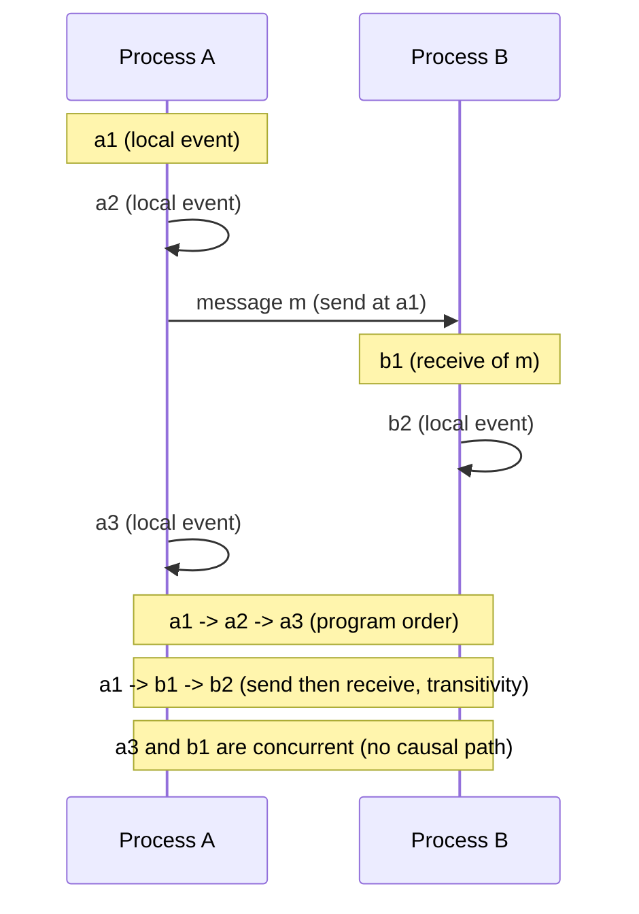
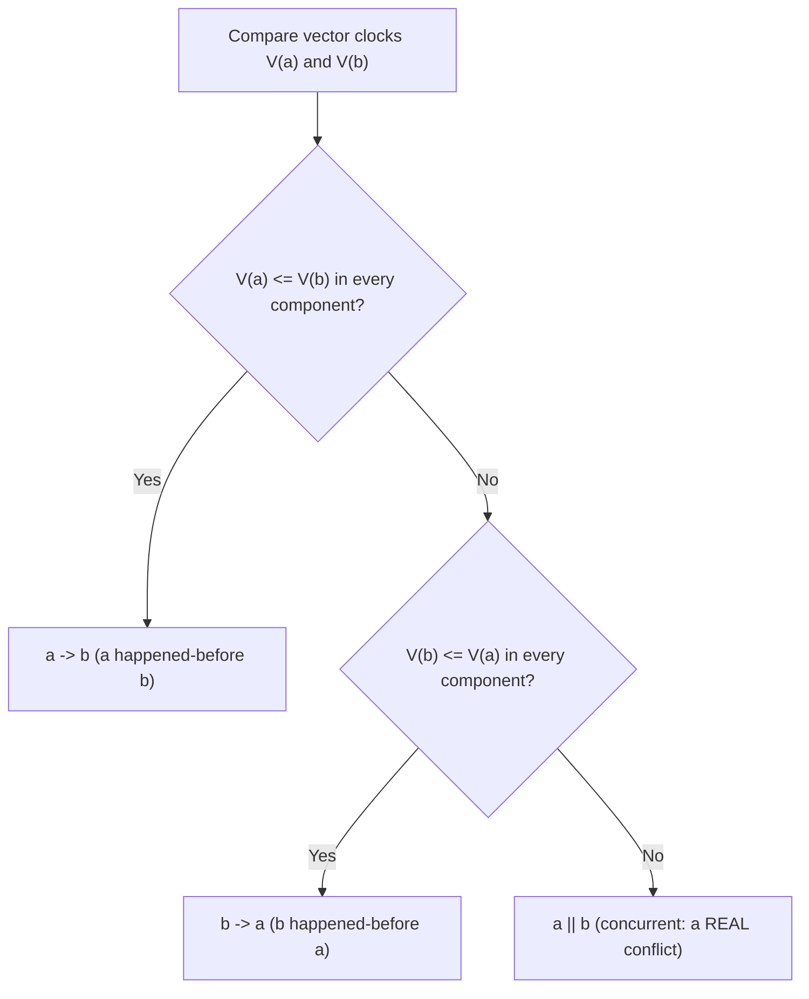
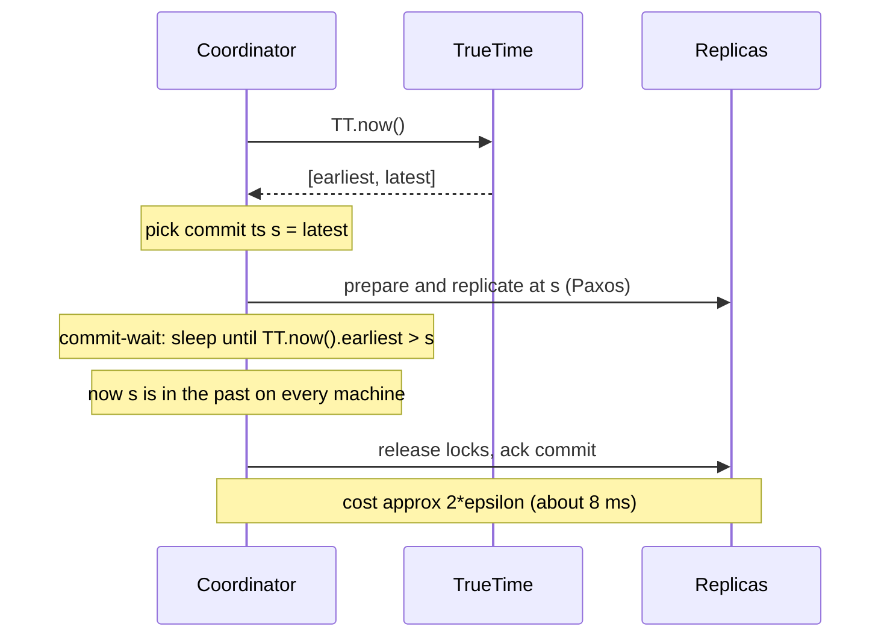
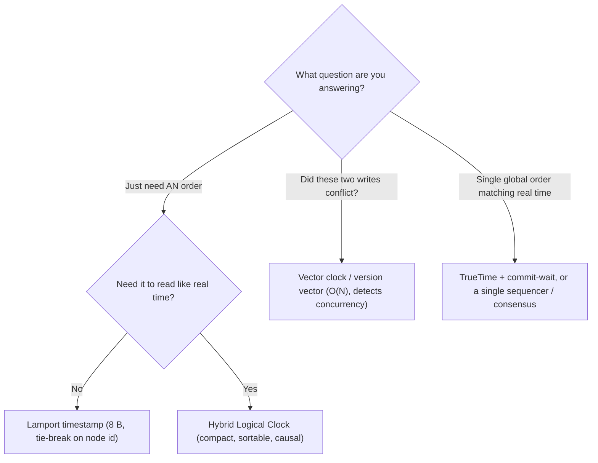

# Time, Clocks & Ordering Events

> Where this fits: this is the hidden machinery underneath replication, consensus, and consistency. Almost every "impossible" distributed bug — a value that reappears after you deleted it, a reply that arrives before its question, a backup that's internally inconsistent — is really a *time and ordering* bug.
>
> **Principal-level takeaway:** In a distributed system there is no global "now." Stop reasoning about *when* things happened and start reasoning about *what happened before what*. Wall-clock time is a useful approximation for humans and a dangerous one for correctness — order events by causality (or by a clock with *bounded, known error*), never by naively comparing two machines' `now()`.

## ⚡ 60-Second TL;DR

- **What/why:** across machines there's no shared "now"; order events by **causality** (happens-before), not by comparing two clocks' `now()`.
- **Wall clock:** human-readable, **not monotonic** (NTP steps it backward) — fine for logs, **never** for correctness ordering. Use **monotonic** clock for durations.
- **Lamport (8 B):** total order, but **`C(a)<C(b)` does NOT imply `a→b`** — cannot detect concurrency.
- **Vector/version vectors (O(N)):** detect concurrency exactly (Dynamo/Riak siblings); cost is per-message size that grows with writers.
- **HLC (~8–16 B):** compact, sortable, causal physical time (CockroachDB, Yugabyte) — no concurrency detection.
- **TrueTime + commit-wait (~2ε ≈ 8 ms):** external consistency via GPS/atomic clocks; correctness from *waiting out* uncertainty, not perfect clocks.

**Remember one thing:** Pick the cheapest mechanism that answers your *actual* question — order, conflict detection, or global real-time order — never order correctness-critical events by comparing two machines' clocks.

## The Mental Model — first principles: why does this thing exist?

Picture two servers, A and B, each handling a write to the same user record. A's clock says `12:00:00.000`, B's says `12:00:00.050`. Both writes land at a replica. Which one wins?

If you answer "the later timestamp," you've just made a correctness decision based on the assumption that A's clock and B's clock mean the same thing. They don't. B's clock might be running 80 ms ahead. The write that *physically happened second* could carry the *smaller* timestamp. Last-write-wins just silently lost data, and no error was logged.

This is the whole problem in miniature. On a single machine, time is a total order: there is one clock, one CPU's notion of "before," and the hardware enforces it. The instant you have two machines connected by a network, three things break at once:

1. **There is no shared clock.** Each machine has its own oscillator, and they drift apart.
2. **There is no instantaneous communication.** A message takes time to arrive, and that time is variable and unbounded (a packet can be delayed for seconds — see [Networking](../00-foundations/01-networking.md)).
3. **You cannot tell "slow" from "dead."** A node that hasn't responded might be crashed, or might just be paused (GC, VM migration) and about to wake up with a stale view of time.

So the field invented a different question. Instead of "at what absolute time did this happen?" — which is unanswerable — we ask "could event X have *caused* event Y?" That relation, **happens-before**, is the foundation of everything in this chapter. Lamport's 1978 paper *Time, Clocks, and the Ordering of Events in a Distributed System* is arguably the most influential paper in the field precisely because it reframed the question.

Ordering matters because consistency *is* an agreement about order. Two replicas are consistent when they apply the same operations in the same order (see [Consistency, CAP & PACELC](12-consistency-and-cap.md)). Conflict detection is "did these two writes happen concurrently, or did one see the other?" A consistent snapshot is "a cut across all nodes that respects causality." Get ordering wrong and all three quietly corrupt.

## Core Concepts

### Why wall-clock time lies

Every computer keeps two kinds of time, and conflating them is the first beginner mistake.

- **Wall-clock time** (`System.currentTimeMillis`, `clock_gettime(CLOCK_REALTIME)`): seconds since the Unix epoch. It's what you put in logs. It is **not monotonic** — it can jump backward.
- **Monotonic time** (`System.nanoTime`, `clock_gettime(CLOCK_MONOTONIC)`): a counter that only ever increases, with no defined relationship to calendar time. Use it for measuring *durations* (timeouts, latencies). It is meaningless across machines.

Wall-clock time lies for a stack of reasons:

- **Clock skew** is the instantaneous *difference* between two clocks. Across a datacenter, unsynchronized machines routinely differ by tens to hundreds of milliseconds.
- **Clock drift** is the *rate* of divergence. A cheap quartz oscillator drifts on the order of tens of ppm — say 30 ppm, which is ~2.6 seconds per day. Left unsynced for a week, two machines can be many seconds apart.
- **NTP** (Network Time Protocol) corrects this by polling time servers, but it's only as good as the round-trip: a few milliseconds on a LAN, 10–100 ms over the public internet, and it's *adjusting* the clock, which means the clock can be **stepped backward** when it has drifted too far ahead.
- **Leap seconds.** UTC occasionally inserts a 61-second minute to track Earth's rotation. Naive systems saw `23:59:60`, crashed, or hung — the 2012 leap second took down Reddit, Mozilla, and others (busy-looping in the kernel). The modern mitigation is **leap smearing** (Google, AWS, Facebook): spread the extra second over ~24 hours so no clock ever jumps. Crucially, a smeared clock and a stepped clock *disagree by up to a full second during the smear* — mixing the two in one fleet is its own bug.
- **VM pauses and live migration.** A guest can be frozen for hundreds of milliseconds while the hypervisor migrates it; it wakes up with a wall clock that's now wrong.

The lesson: a single machine's `now()` is an estimate with an unstated and sometimes large error bar. Comparing two such estimates as if they were exact is the original sin.

### Logical clocks and the happens-before relation

Lamport's insight: for ordering, we don't need real time at all. We need a relation `→` ("happens-before"), defined by three rules:

1. If `a` and `b` are in the same process and `a` comes first, then `a → b`.
2. If `a` is the *send* of a message and `b` is its *receive*, then `a → b`.
3. Transitivity: if `a → b` and `b → c`, then `a → c`.

If neither `a → b` nor `b → a`, the events are **concurrent** (`a ∥ b`). Concurrent does not mean simultaneous — it means *causally independent*: neither could have influenced the other, so there is no "true" order and any order is fine.

```
Process A:  a1 ───────▶ a2 ──────────▶ a3
                 \                      ▲
                  \  (message)         /
                   ▼                  /
Process B:        b1 ───▶ b2 ────────/  receive

a1 → a2 → a3      (same process)
a1 → b1           (message send→receive)
a1 → b2, a1 → a3, etc. (transitivity)
b1 ∥ a2 ?         depends — b1 and a2: neither path connects them ⇒ concurrent
```

The same relation as a message-passing diagram — follow the arrows to see which events are causally connected and which are simply unordered:



> **Interactive:** [Vector Clocks & Causality (interactive)](../animations/vector-clocks.html) -- drag events on each process timeline and watch which pairs become ordered (an arrow appears) versus stay concurrent.

Happens-before is a **partial order**: some pairs are simply unordered. That's not a flaw to be fixed; it's the honest truth about a concurrent system.

### Lamport timestamps — total order, but blind to causality

A Lamport clock is one integer counter `C` per process:

```
on local event:        C = C + 1
on send(m):            C = C + 1;  attach C to m
on receive(m):         C = max(C, m.C) + 1
```

The guarantee: **if `a → b` then `C(a) < C(b)`.** This lets you impose a *total order* (break ties with node IDs) consistent with causality — invaluable for, say, ordering operations in a replicated state machine.

The trap — and the single most common misconception — is the converse. **`C(a) < C(b)` does NOT mean `a → b`.** Two concurrent events can have any counter values; a smaller Lamport timestamp tells you nothing about whether causality exists. Lamport clocks **cannot detect concurrency.** They give you *an* order; they cannot tell you whether that order was *forced* by causality or *invented* by the tie-break. For conflict detection — the question "did these two writes race?" — Lamport timestamps are useless.

**Lamport clock with a total-order tie-break.** A single counter per process, plus the `(counter, nodeID)` pair that breaks ties to yield a deterministic total order consistent with happens-before.

```go
package main

import (
	"fmt"
	"sync"
)

// LamportClock is safe for concurrent use within one process.
type LamportClock struct {
	mu      sync.Mutex
	counter uint64
	nodeID  int
}

func NewLamportClock(nodeID int) *LamportClock {
	return &LamportClock{nodeID: nodeID}
}

// Tick advances the clock for a local event or a send, returning the stamp.
func (c *LamportClock) Tick() uint64 {
	c.mu.Lock()
	defer c.mu.Unlock()
	c.counter++
	return c.counter
}

// Receive merges an incoming timestamp: C = max(C, m) + 1.
func (c *LamportClock) Receive(msg uint64) uint64 {
	c.mu.Lock()
	defer c.mu.Unlock()
	if msg > c.counter {
		c.counter = msg
	}
	c.counter++
	return c.counter
}

// Stamp is a totally ordered Lamport timestamp.
type Stamp struct {
	Counter uint64
	NodeID  int
}

// Less gives the total order: counter first, node id breaks ties.
func (s Stamp) Less(o Stamp) bool {
	if s.Counter != o.Counter {
		return s.Counter < o.Counter
	}
	return s.NodeID < o.NodeID
}

func main() {
	a := NewLamportClock(1)
	b := NewLamportClock(2)

	s1 := a.Tick()          // a: local event -> 1
	msg := a.Tick()         // a: send        -> 2
	r := b.Receive(msg)     // b: receive     -> max(0,2)+1 = 3
	s2 := b.Tick()          // b: local event -> 4

	fmt.Println(s1, msg, r, s2) // 1 2 3 4

	x := Stamp{Counter: 4, NodeID: 2}
	y := Stamp{Counter: 4, NodeID: 1}
	fmt.Println(y.Less(x)) // true: equal counters, lower node id wins
}
```

```java
import java.util.concurrent.atomic.AtomicLong;

final class LamportClock {
    private final AtomicLong counter = new AtomicLong(0);
    private final int nodeId;

    LamportClock(int nodeId) {
        this.nodeId = nodeId;
    }

    /** Advance for a local event or a send. */
    long tick() {
        return counter.incrementAndGet();
    }

    /** Merge an incoming timestamp: C = max(C, m) + 1. */
    long receive(long msg) {
        return counter.accumulateAndGet(msg, (cur, m) -> Math.max(cur, m) + 1);
    }

    int nodeId() {
        return nodeId;
    }

    /** Totally ordered Lamport timestamp; counter first, node id breaks ties. */
    record Stamp(long counter, int nodeId) implements Comparable<Stamp> {
        @Override
        public int compareTo(Stamp o) {
            int c = Long.compare(counter, o.counter);
            return c != 0 ? c : Integer.compare(nodeId, o.nodeId);
        }
    }

    public static void main(String[] args) {
        LamportClock a = new LamportClock(1);
        LamportClock b = new LamportClock(2);

        long s1 = a.tick();          // a: local event -> 1
        long msg = a.tick();         // a: send        -> 2
        long r = b.receive(msg);     // b: receive     -> max(0,2)+1 = 3
        long s2 = b.tick();          // b: local event -> 4

        System.out.println(s1 + " " + msg + " " + r + " " + s2); // 1 2 3 4

        Stamp x = new Stamp(4, 2);
        Stamp y = new Stamp(4, 1);
        System.out.println(y.compareTo(x) < 0); // true
    }
}
```

### Vector clocks — detecting concurrency, at O(N) cost

To recover the lost information, give each of the `N` nodes its own counter. A vector clock is a vector `V[1..N]`:

```
on local event at node i:   V[i] += 1
on send at node i:          V[i] += 1;  attach V
on receive at node i:       V[i] += 1;  V = elementwise max(V, m.V)
```

Compare two vectors elementwise:

- `V(a) ≤ V(b)` in *every* component (and `≠`)  ⟹  `a → b`
- symmetric the other way                        ⟹  `b → a`
- neither dominates (some components bigger, some smaller) ⟹ **`a ∥ b` — concurrent, a real conflict**

The comparison is a simple two-test decision: dominance one way means happens-before, dominance the other way is the reverse, and *no* dominance is the conflict signal.



This is the payoff: vector clocks **detect concurrency exactly.** That's why they sit at the heart of conflict detection in Dynamo-style stores.

**Vector clock with a happens-before / concurrent comparison.** One counter per node, merged elementwise on receive, with a comparison that returns *before*, *after*, *equal*, or *concurrent*.

```go
package main

import "fmt"

// Ordering is the result of comparing two vector clocks.
type Ordering int

const (
	Before Ordering = iota // a -> b
	After                  // b -> a
	Equal
	Concurrent // a || b: a real conflict
)

// VectorClock maps nodeID -> counter. Missing entries are treated as 0.
type VectorClock map[int]uint64

func (v VectorClock) clone() VectorClock {
	c := make(VectorClock, len(v))
	for k, n := range v {
		c[k] = n
	}
	return c
}

// Tick advances this node's own component (local event or send).
func (v VectorClock) Tick(nodeID int) {
	v[nodeID]++
}

// Receive merges an incoming clock, then bumps this node's component.
func (v VectorClock) Receive(nodeID int, msg VectorClock) {
	for k, n := range msg {
		if n > v[k] {
			v[k] = n
		}
	}
	v[nodeID]++
}

// Compare returns the causal relationship between v and o.
func (v VectorClock) Compare(o VectorClock) Ordering {
	vLess, oLess := false, false
	seen := map[int]bool{}
	for k := range v {
		seen[k] = true
	}
	for k := range o {
		seen[k] = true
	}
	for k := range seen {
		switch {
		case v[k] < o[k]:
			vLess = true
		case v[k] > o[k]:
			oLess = true
		}
	}
	switch {
	case vLess && oLess:
		return Concurrent
	case vLess:
		return Before
	case oLess:
		return After
	default:
		return Equal
	}
}

func main() {
	// a: write at node 1; b: concurrent write at node 2 that never saw a.
	a := VectorClock{}
	a.Tick(1) // {1:1}

	b := VectorClock{}
	b.Tick(2) // {2:1}
	fmt.Println(a.Compare(b) == Concurrent) // true: a || b

	// c receives a, then writes -> c causally follows a.
	c := a.clone()
	c.Receive(3, a) // {1:1, 3:1}
	fmt.Println(a.Compare(c) == Before) // true: a -> c
}
```

```java
import java.util.HashMap;
import java.util.HashSet;
import java.util.Map;
import java.util.Set;

final class VectorClock {
    enum Ordering { BEFORE, AFTER, EQUAL, CONCURRENT }

    // nodeId -> counter; missing entries are treated as 0.
    private final Map<Integer, Long> v = new HashMap<>();

    private long get(int nodeId) {
        return v.getOrDefault(nodeId, 0L);
    }

    /** Advance this node's own component (local event or send). */
    void tick(int nodeId) {
        v.merge(nodeId, 1L, Long::sum);
    }

    /** Merge an incoming clock, then bump this node's component. */
    void receive(int nodeId, VectorClock msg) {
        msg.v.forEach((k, n) -> v.merge(k, n, Math::max));
        tick(nodeId);
    }

    VectorClock copy() {
        VectorClock c = new VectorClock();
        c.v.putAll(this.v);
        return c;
    }

    /** Causal relationship between this and other. */
    Ordering compare(VectorClock o) {
        boolean thisLess = false, otherLess = false;
        Set<Integer> keys = new HashSet<>(v.keySet());
        keys.addAll(o.v.keySet());
        for (int k : keys) {
            long a = get(k), b = o.get(k);
            if (a < b) thisLess = true;
            else if (a > b) otherLess = true;
        }
        if (thisLess && otherLess) return Ordering.CONCURRENT;
        if (thisLess) return Ordering.BEFORE;
        if (otherLess) return Ordering.AFTER;
        return Ordering.EQUAL;
    }

    public static void main(String[] args) {
        VectorClock a = new VectorClock();
        a.tick(1); // {1:1}

        VectorClock b = new VectorClock();
        b.tick(2); // {2:1}
        System.out.println(a.compare(b) == Ordering.CONCURRENT); // true

        VectorClock c = a.copy();
        c.receive(3, a); // {1:1, 3:1}
        System.out.println(a.compare(c) == Ordering.BEFORE); // true
    }
}
```

The cost is in the name: **O(N)** space per timestamp and per message, where N is the number of writing nodes. With clients-as-actors, N can grow without bound, and entries don't naturally shrink. Production systems bound it (cap entries, prune by last-update time — Riak's approach), which trades a little correctness for a lot of bytes.

### Version vectors — the same idea, for replicated data

People conflate these, so be precise. A **vector clock** tracks the causal history of *events*. A **version vector** tracks the causal history of *a replicated data item* — one counter per *replica*, attached to a key/object. The mechanics are nearly identical; the semantics differ:

- Vector clock: "in what order did these events happen across processes?"
- Version vector: "is this version of object X newer than, older than, or in conflict with that one?"

When two version vectors are concurrent, you have **sibling** versions — the system either surfaces both to the application (Riak, classic Dynamo shopping cart) or resolves them with a [CRDT](../01-building-blocks/08-databases-nosql.md) or last-write-wins. Detecting the conflict is the version vector's job; *resolving* it is a separate policy decision.

### Hybrid Logical Clocks (HLC) — the pragmatic middle

Lamport/vector clocks are causally correct but their numbers are meaningless to humans — you can't grep a log by them. Wall clocks are human-readable but causally wrong. **HLC** (Kulkarni et al., 2014) fuses both into a single timestamp `(pt, l)`: a physical-time component kept close to wall-clock, plus a small logical counter that absorbs causality when physical time stalls or goes backward.

```
on send/local event:
    pt' = max(l.pt, now())             # never go below local physical clock
    if pt' == l.pt: l.c += 1           # same ms? bump logical counter
    else:           l.pt = pt'; l.c = 0
on receive(m):
    pt' = max(l.pt, m.pt, now())
    ... reconcile counters so the result dominates both inputs ...
```

The result: timestamps are **monotonic**, **encode happens-before** (if `a → b` then `HLC(a) < HLC(b)`), are **constant-size** (one 64-bit-ish value, unlike vector clocks), and **stay within a bounded distance of real time** (so they read like timestamps and sort sensibly). The cost: like Lamport, HLC gives total order but does *not* detect concurrency — and its real-time accuracy is only as good as the underlying NTP. This is why **CockroachDB, YugabyteDB, and MongoDB** use HLC: it's "good enough physical time" without special hardware.

### TrueTime — make the uncertainty explicit and wait it out

Google's Spanner takes the opposite, brute-force path: instead of pretending clocks are accurate, **measure how wrong they might be and expose it.** TrueTime, backed by **GPS receivers and atomic clocks** in every datacenter, returns not a timestamp but an *interval*:

```
TT.now() → [earliest, latest]      # guaranteed to contain the true time
ε = (latest − earliest) / 2        # uncertainty, typically ~1–7 ms, avg ~4 ms
```

The genius is what you do with `ε`. To commit a transaction at timestamp `s`, Spanner performs **commit-wait**: it picks `s = TT.now().latest`, then *sleeps until `TT.now().earliest > s`* before releasing locks — roughly `2ε` of waiting. After that sleep, `s` is guaranteed to be in the past *on every machine on Earth*.



What this buys is **external consistency** — for transactions this is **strict serializability** (a serial order that also respects real-time ordering), the multi-object generalization of linearizability: if transaction T1 commits before T2 *starts* in real wall-clock time, then T1's timestamp is less than T2's, globally, with no coordination. You get a single global order that matches what an outside observer saw — something HLC cannot promise.

The cost is equally concrete: every commit pays ~2ε (≈8 ms) of latency, and you need the GPS/atomic-clock infrastructure. Shrink ε and you shrink the tax — which is exactly why Google over-provisions time hardware. **AWS Time Sync Service** now offers microsecond-accurate, bounded-error time to EC2, bringing a TrueTime-like primitive to the masses.

## Trade-offs at a Glance

| Mechanism | Size | Detects concurrency? | Total order? | Reads like real time? | Needs special HW? | When to use |
|---|---|---|---|---|---|---|
| Wall clock (NTP) | 8 B | No | No (clocks lie) | Yes | No | Logs, human display, coarse TTLs — **never** for correctness-critical ordering |
| Lamport timestamp | 8 B | **No** | Yes (with tie-break) | No | No | Total order for replicated state machines, message sequencing |
| Vector clock | **O(N)** | **Yes** | No (partial) | No | No | Conflict detection across processes |
| Version vector | O(replicas) | **Yes** | No (partial) | No | No | Sibling/conflict detection on replicated objects (Dynamo, Riak) |
| Hybrid Logical Clock | ~8–16 B | No | Yes | ~Yes (bounded) | No | Distributed SQL needing causal, sortable, compact timestamps |
| TrueTime + commit-wait | interval | n/a (global order) | **Yes (external)** | Yes | **GPS/atomic** | Globally-consistent transactions where you can pay ~8 ms commit latency |

Reading guide: pick the *cheapest* row that answers your actual question. If you only need "an order," Lamport/HLC. If you need "did these conflict," you *must* have vectors. If you need "a single global order matching real time," you need TrueTime-class hardware or distributed consensus on a timestamp.



## How Real Systems Do It

- **Amazon Dynamo / Riak.** Version vectors per object; concurrent writes produce siblings returned to the client (the famous "deleted item resurrects in the shopping cart" was an LWW failure that vector clocks fixed). Riak bounds vector growth by pruning old/small entries. See [Object & KV Stores](../04-design-case-studies/26-object-store-and-kv-store.md).
- **Apache Cassandra.** Last-write-wins by *wall-clock microsecond timestamp* per cell. This is fast and simple, and it is **exactly the trap from the opening**: clock skew between coordinators can cause a logically-later write to lose. Cassandra's docs warn against client-supplied timestamps for this reason. Counters and LWTs (Paxos) exist precisely because plain LWW can't order safely.
- **Google Spanner.** TrueTime + commit-wait for external consistency; ε averages a few ms, commit-wait ~2ε. Spanner pairs this with Paxos for replication ([Consensus](13-consensus.md)).
- **CockroachDB / YugabyteDB.** HLC instead of TrueTime (no GPS assumed). They handle residual clock uncertainty with an **uncertainty interval / `max_offset`** (default 500 ms in CockroachDB): a read that sees a value within that window restarts to avoid stale reads. Crucially, if a node's clock drifts beyond `max_offset`, CockroachDB **crashes the node on purpose** rather than serve incorrect data.
- **Apache Kafka.** Ordering is *per partition* via monotonic offsets — a gap-free sequence number assigned by the partition leader (a per-partition sequencer, not a full Lamport clock, since there's no merge-on-receive across partitions). There is **no total order across partitions.** Message `timestamp` fields are wall-clock and not to be trusted for ordering. See [Messaging & Streaming](../01-building-blocks/11-messaging-and-streaming.md).
- **Git.** A real-world vector-clock-like DAG: commits reference parents, so "happens-before" is explicit ancestry; concurrent edits are *branches*, and merge is conflict resolution. Commit *timestamps* are decorative and frequently out of order.

## Failure Modes & Common Misconceptions

**Myth: "I'll just use timestamps to order events."** This is the headline bug. Across machines, the write with the larger timestamp may have happened *first* in real time. LWW-by-wall-clock silently drops data under skew. Fixes: HLC, version vectors, or a single sequencer.

**Myth: "NTP keeps clocks close enough." ** NTP keeps clocks *usually* close, with no hard guarantee, and it can **step the clock backward**. Code that does `end = now(); duration = end - start` with the wall clock can compute *negative durations* across an NTP correction. Use the **monotonic** clock for durations, always.

**Myth: "Lamport timestamps tell me what caused what."** No — they give order, not causality. `C(a) < C(b)` with `a ∥ b` is completely normal. Only vector/version vectors detect concurrency.

**Myth: "Vector clocks are free, just attach them."** They're O(N) and grow with the number of writers; unbounded actor sets bloat every message and every stored object. Real systems cap and prune, accepting rare false "happens-before" judgments.

**Spanner myth: "TrueTime makes clocks perfect."** TrueTime makes clocks *honestly uncertain*. The correctness comes from **commit-wait paying for the uncertainty**, not from accuracy alone. If ε blows up (GPS outage), commits get slower — they don't get wrong.

**The leap-second / smear mismatch.** A fleet where some nodes smear and some step disagree by up to a second for ~24 hours. Inconsistent NTP configuration is a classic root cause of "impossible" ordering bugs at the second granularity.

**Inconsistent snapshots.** Backing up replicas at "the same wall-clock time" does *not* give a causally consistent cut — a snapshot can capture an effect without its cause. Consistent snapshots need the Chandy–Lamport algorithm (marker messages along causal edges), not synchronized clocks.

## In a Design Discussion

You're whiteboarding a multi-region store. Two concurrent updates to the same key arrive in different regions.

**Junior take:** "Each write has a timestamp; on conflict, keep the newest. NTP keeps the clocks synced, so it's fine." — This sounds reasonable and is how a lot of broken production systems were built. It conflates wall time with order, has no concurrency detection, and loses data silently under skew. No error fires; the bug surfaces months later as "a customer's setting keeps reverting."

**Principal take:** "First, do we actually need cross-key/global order, or just per-key conflict resolution? If it's per-key, version vectors detect true concurrency and we either surface siblings or use a CRDT — no clock trust required. If we need a sortable, causal timestamp in one region's SQL layer, HLC is the cheap right answer and we set a `max_offset` and fail nodes that exceed it. If the business genuinely needs *external* consistency across regions — say a ledger where 'committed-before' must be globally true ([Payments](../04-design-case-studies/27-payments-and-ledgers.md)) — then we either buy TrueTime-class time (Spanner, AWS Time Sync) and pay commit-wait latency, or we route those writes through a single sequencer / consensus group ([Consensus](13-consensus.md)) and accept the coordination cost. What I will *not* do is order correctness-critical events by comparing two machines' `now()`."

The principal move is to **separate the questions** — "do I need order, or conflict detection, or global real-time order?" — and pick the cheapest mechanism per question, while naming the failure mode of each. The other tell: a principal asks "what's our clock uncertainty budget, and what happens when a clock breaks?" *before* choosing the algorithm.

## Self-Check

<details>
<summary>1. Why can't you order events across two servers by comparing their wall-clock timestamps?</summary>
Because the two clocks disagree (skew), drift apart over time, and can be stepped backward by NTP. The physically-later event can carry the smaller timestamp, so timestamp order need not match real order — and the discrepancy can be tens to hundreds of ms.
</details>

<details>
<summary>2. `C(a) < C(b)` for Lamport timestamps. What can you conclude?</summary>
Almost nothing about causality. It does *not* imply `a → b`. The events may be concurrent. Lamport clocks only guarantee the forward direction (`a → b ⟹ C(a) < C(b)`), so they give a usable total order but cannot detect concurrency.
</details>

<details>
<summary>3. When are two vector clocks "concurrent," and why does that matter?</summary>
When neither dominates the other elementwise — some components larger, some smaller. It matters because that is the *exact* signal of a real conflict (a write that didn't see another), which is what conflict resolution (siblings / CRDT / LWW) must act on.
</details>

<details>
<summary>4. What does TrueTime's commit-wait actually buy, and what does it cost?</summary>
Buys: external consistency — a single global order matching real wall-clock observation, no cross-node coordination needed for ordering. Costs: ~2ε (≈8 ms) added latency per commit, plus GPS/atomic-clock hardware. Correctness comes from waiting out the uncertainty, not from clocks being perfect.
</details>

<details>
<summary>5. Your service computes request duration as `wallClockEnd - wallClockStart` and occasionally logs negative latencies. Cause and fix?</summary>
An NTP correction stepped the wall clock backward mid-request. Fix: measure durations with the *monotonic* clock (`nanoTime` / `CLOCK_MONOTONIC`), which never goes backward. Wall clock is for calendar time, not elapsed time.
</details>

<details>
<summary>6. Why does HLC give a sortable, compact timestamp while a vector clock can't, and what does HLC give up?</summary>
HLC packs physical time plus a small logical counter into one constant-size value that stays near real time and encodes happens-before, so it sorts meaningfully. It gives up concurrency *detection* — like Lamport, it produces a total order but can't tell you two events were causally independent.
</details>

<details>
<summary>7. CockroachDB sets a `max_offset` and crashes nodes that exceed it. Why crash instead of continue?</summary>
Its correctness (the uncertainty-interval mechanism that prevents stale reads) assumes clock skew stays within `max_offset`. A node past that bound could serve incorrect/non-linearizable results. Fail-stop is safer than silently-wrong — a recurring principal theme.
</details>

<details>
<summary>8. Is taking a backup of every replica "at noon" a consistent snapshot?</summary>
No. Wall clocks aren't perfectly aligned, and even if they were, a clock-time cut can capture an effect without its cause. Causally-consistent snapshots require something like Chandy–Lamport marker propagation along message edges, not synchronized clocks.
</details>

## Go Deeper

- **Lamport, "Time, Clocks, and the Ordering of Events in a Distributed System" (1978).** The founding paper — short and readable; read it twice.
- **DDIA — *Designing Data-Intensive Applications*, Chapter 8 ("The Trouble with Distributed Systems")** for unreliable clocks, skew, and process pauses; **Chapter 5 ("Replication")** for version vectors and conflict detection; **Chapter 9 ("Consistency and Consensus")** for linearizability and how ordering relates to consensus.
- **"Spanner: Google's Globally-Distributed Database" (OSDI 2012).** The TrueTime/commit-wait section is the canonical source; pair it with Google's CACM article.
- **Kulkarni et al., "Logical Physical Clocks" (2014)** — the HLC paper.
- **Chandy & Lamport, "Distributed Snapshots: Determining Global States" (1985)** — why consistent snapshots aren't about clocks.
- **CockroachDB blog, "Living Without Atomic Clocks"** — HLC vs TrueTime in practice, `max_offset`, and uncertainty restarts.
- Sibling chapters: [Consistency, CAP & PACELC](12-consistency-and-cap.md) · [Consensus](13-consensus.md) · [Distributed Transactions & Idempotency](15-distributed-transactions.md) · [Replication](../01-building-blocks/09-replication.md) · root [index](../README.md) · [roadmap](../ROADMAP.md).
