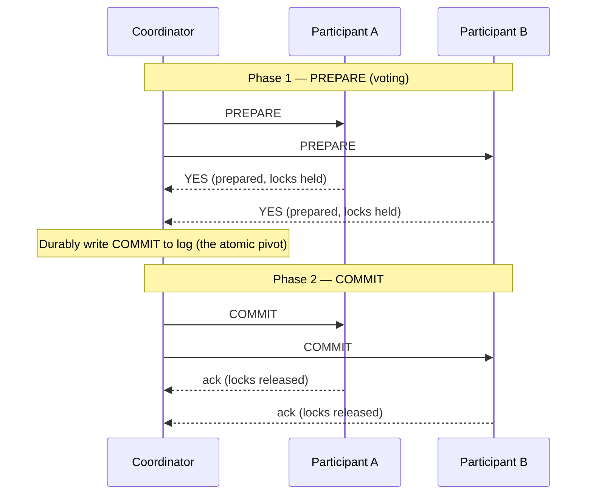
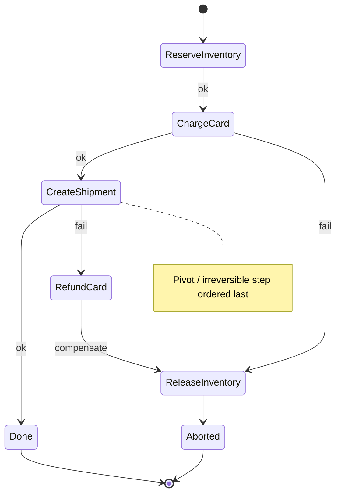
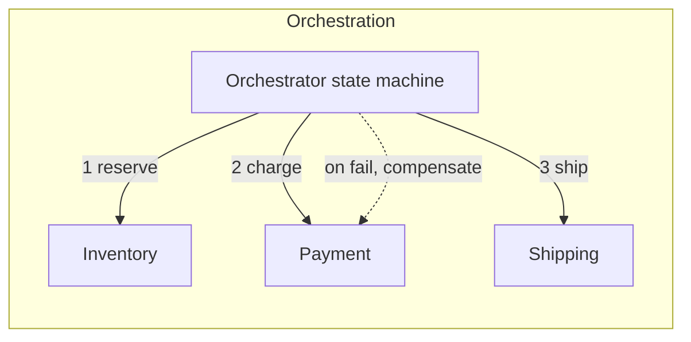
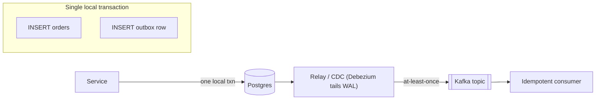
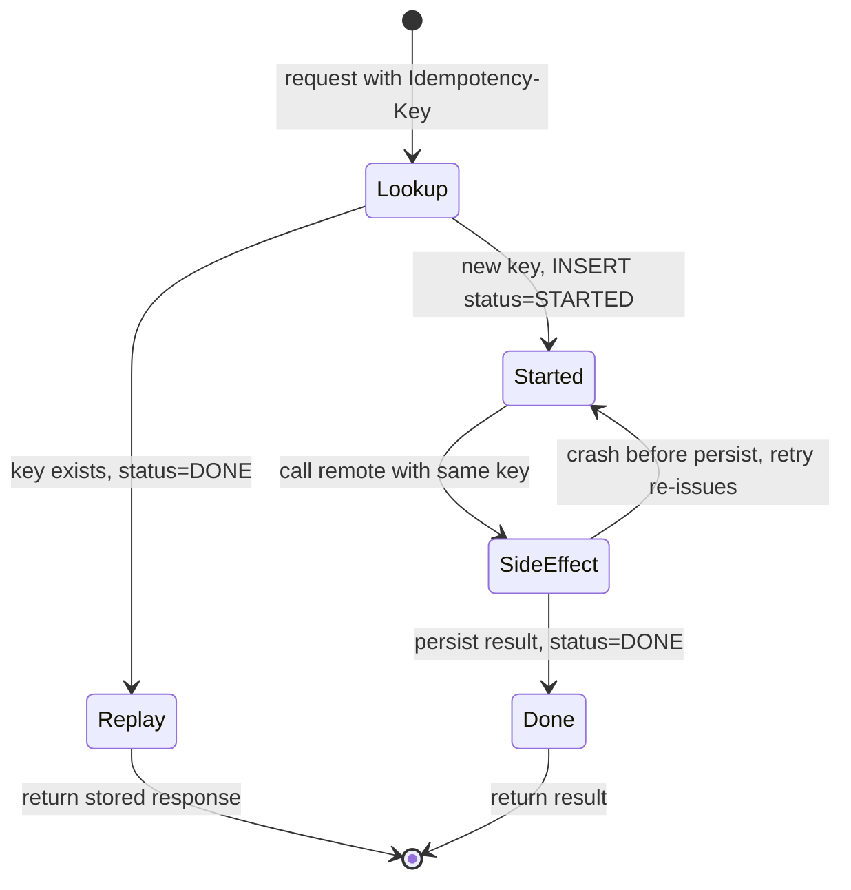

# Distributed Transactions, Sagas & Idempotency

> Where this fits: you've split a system into multiple services and datastores ([Architectural Styles](../03-architecture-and-apis/18-architectural-styles.md)), and now a single business operation — "place an order," "transfer money" — touches several of them. The single ACID transaction that used to guarantee correctness no longer spans the work.
>
> **Principal-level takeaway:** Don't reach for a distributed transaction. Reach for a way to make each step *idempotent and retryable*, and stitch them with a *saga* whose failure path you have explicitly designed. The hard engineering is not the happy path — it's deciding what "rollback" means when money has already moved, and proving that retries can't double-charge.

---

## The Mental Model — first principles

A local ACID transaction (see [Relational Databases](../01-building-blocks/07-databases-relational.md)) gives you a deal: a block of reads and writes either *all* happen or *none* do (atomicity), leaves the database in a valid state (consistency), behaves as if it ran alone (isolation), and survives a crash once committed (durability). One process, one storage engine, one write-ahead log, one lock manager. The engine can make all-or-nothing happen because it controls everything that participates.

Now break the monolith apart. The order is in the Orders DB, payment in Stripe, inventory in the Inventory service's DB, the shipment event on a Kafka topic. A customer clicks "buy once." You want all four to happen or none. But there is **no shared log, no shared lock manager, no shared clock** ([Time & Clocks](../02-distributed-systems/14-time-clocks-ordering.md)). Each participant can independently succeed, fail, time out, or crash *between* your calls. The network can drop your "commit" message and you'll never know whether it arrived.

This is the core problem: **atomicity across independent failure domains, connected only by an unreliable network.** Two impossibility results bound what you can do. The CAP theorem ([Consistency & CAP](../02-distributed-systems/12-consistency-and-cap.md)) says when the network partitions you choose availability or consistency, not both. The FLP result says no deterministic protocol can guarantee agreement with even one crash-faulty process in an asynchronous network. Distributed atomic commit lives squarely in this hostile territory.

The practical consequence — and the thing a principal internalizes — is that you almost never want true distributed ACID. You want a relaxed correctness target: *each operation is safe to retry, the system converges to a valid state, and the failure path is explicitly handled.* That relaxation is what sagas, outboxes, and idempotency keys buy you.

---

## Core Concepts

### Two-Phase Commit (2PC): the textbook answer, and why it hurts

2PC is the canonical atomic-commit protocol. A **coordinator** drives **participants** through two phases:

```
Phase 1 — PREPARE (voting)
  coordinator -> all participants: "PREPARE"
  each participant: do the work, write it durably in a *prepared* (uncommitted) state,
                    hold locks, reply YES (vote-commit) or NO (vote-abort)

Phase 2 — COMMIT / ABORT
  if all voted YES: coordinator writes COMMIT to its own log, then tells everyone "COMMIT"
  if any voted NO:  coordinator tells everyone "ABORT"
  participants apply the decision, release locks, ack
```

The handshake, drawn as a sequence — note that the single durable COMMIT write on the coordinator is the atomic pivot for the entire transaction:



> **Interactive:** [Distributed Transactions: 2PC vs Saga (interactive)](../animations/saga-vs-2pc.html) -- crash the coordinator after the votes and watch the participants block with locks held; then switch to saga mode and watch compensations unwind in reverse.

The magic is the *prepared* state. After a participant votes YES it has made a **promise**: "I can no longer change my mind; I will commit if you tell me to, even if I crash and restart." It must persist enough (the rows, the locks) to honor that promise across a reboot. The coordinator's decision becomes final the instant it durably writes the COMMIT record — that single disk write is the atomic pivot point for the whole transaction.

Now the failure modes that make 2PC dreaded at scale:

- **Blocking on coordinator failure.** Suppose every participant has voted YES and is holding locks in the prepared state, and the coordinator crashes *before* sending the decision. Participants cannot safely decide on their own — they don't know whether the coordinator already logged COMMIT. So they **block**, holding locks, until the coordinator recovers and reads its log. This is the famous *blocking problem*: 2PC is not partition-tolerant. A coordinator outage can freeze rows across multiple databases indefinitely.
- **Held locks = throughput collapse.** Locks are held for the full round-trip of *two* network phases plus disk syncs, not microseconds. Under contention this serializes hot rows and tanks throughput.
- **Coordinator is a single point of failure** and a piece of stateful infrastructure (its log is sacred) you now have to operate and back up.

**Three-phase commit (3PC)** tries to make commit non-blocking by inserting a `PRE-COMMIT` phase between vote and commit, so participants can deduce the decision after a coordinator failure via a timeout. It works *only* under a synchronous-network, fail-stop model. Real networks partition, and under a partition 3PC can produce a split-brain where two groups commit different outcomes — it trades blocking for the possibility of *inconsistency*, which is usually worse. **3PC is essentially never used in industry.** The correct way to make atomic commit fault-tolerant is to replicate the *coordinator's decision* via a consensus protocol (Paxos/Raft, see [Consensus](../02-distributed-systems/13-consensus.md)) so the decision survives coordinator loss — this is what Google Spanner does: each participant is a Paxos group, so the commit decision is durably replicated and a coordinator crash no longer blocks. (Spanner's atomic clocks solve a *different* problem — external consistency of commit ordering — not the blocking one.)

### The saga pattern: give up atomicity, keep correctness

A **saga** abandons global atomicity. Instead of one transaction, you run a *sequence of local transactions*, each in its own service, each committing independently. If step *N* fails, you don't roll back the database — the earlier steps already committed. Instead you run **compensating transactions** that *semantically undo* the earlier steps, in reverse order.

```
Forward:   T1 (reserve inventory) -> T2 (charge card) -> T3 (create shipment)
On failure of T3:  C2 (refund card) -> C1 (release inventory)
```

As a state machine — forward edges on success, compensation edges on failure unwinding in reverse, with the irreversible step deliberately placed last:



The crucial distinction is **semantic vs syntactic rollback**. A database ROLLBACK is *syntactic*: it makes it as if nothing happened, byte for byte, because the changes were never committed. A compensation is *semantic*: T2 committed a real charge that other systems saw; C2 cannot un-happen it, it issues a *refund*. The customer may have received an email; the bank statement shows a charge and a refund. The world is left *consistent at the business level*, not pristine. Designing good compensations is the real work: what does "un-ship a package" mean? (It usually means: don't, design so the irreversible step is *last*.)

The other ACID letter a saga sacrifices is **isolation**. Because each local transaction commits immediately, the *intermediate* state is visible to everyone — there is no serializable bubble around the whole flow. Concretely you get the textbook anomalies back: a **dirty read** (another transaction sees the reserved-but-unpaid order and acts on it), a **lost update** (a concurrent saga overwrites a field this saga is mid-way through changing), and **fuzzy reads** as steps land one at a time. Sagas do *not* give you isolation for free, and no amount of compensation restores it. The standard countermeasures are application-level, not database-level: a **semantic lock** (a `PENDING`/`status` flag on the record that warns other transactions the data is in flight and must be handled or refused), **commutative updates** (design writes so order doesn't matter, e.g. balance deltas rather than absolute sets), **reread-and-revalidate** before acting, and **by-value** routing that gives high-value requests stricter handling. The reservation pattern below is one concrete semantic lock.

Two coordination styles:

- **Choreography** — no central coordinator. Each service emits events; other services subscribe and react. Order Service emits `OrderCreated` → Payment listens, charges, emits `PaymentCompleted` → Inventory listens, reserves, emits `InventoryReserved`, etc. Compensation flows the same way (`PaymentFailed` → Order listens, cancels). Simple for short flows; **no single place to see the whole workflow**, and adding a step means touching many services. Cyclic event dependencies are easy to create by accident.
- **Orchestration** — a central **orchestrator** (a state machine) explicitly calls each service and decides the next step, including which compensations to fire on failure. The workflow lives in one place, is testable, and is observable. Cost: the orchestrator is a component you build/operate, and it can become a god-service if it accumulates business logic that belongs in the services.



Rule of thumb: **choreography for 2–3 steps, orchestration once it's 4+ or the failure logic is non-trivial.** Temporal, AWS Step Functions, Netflix Conductor, and Camunda are orchestration engines built precisely so you don't hand-roll the state machine and its durable timers.

**A minimal saga orchestrator.** Each step pairs an `action` with a `compensation`. The orchestrator runs actions forward; on the first failure it stops and runs the compensations of the *already-completed* steps in reverse order. (A real engine would also persist progress durably and retry each compensation until it succeeds — see the failure-modes section — but this captures the core control flow.)

```go
package saga

import (
	"context"
	"errors"
	"fmt"
)

// Step is one unit of a saga: a forward Action and the Compensation that
// semantically undoes it. Both take a context so they can be cancelled.
type Step struct {
	Name         string
	Action       func(ctx context.Context) error
	Compensation func(ctx context.Context) error
}

// Run executes steps in order. On the first failing action it compensates the
// already-completed steps in reverse, then returns the original error.
func Run(ctx context.Context, steps []Step) error {
	var completed []Step
	for _, s := range steps {
		if err := s.Action(ctx); err != nil {
			compErr := compensate(ctx, completed)
			if compErr != nil {
				return fmt.Errorf("step %q failed: %w; compensation also failed: %v",
					s.Name, err, compErr)
			}
			return fmt.Errorf("step %q failed, compensated: %w", s.Name, err)
		}
		completed = append(completed, s) // push for LIFO unwind
	}
	return nil
}

// compensate runs compensations in reverse; a compensation should be idempotent
// and retried until it succeeds, so here we just join any residual errors.
func compensate(ctx context.Context, completed []Step) error {
	var errs []error
	for i := len(completed) - 1; i >= 0; i-- {
		if c := completed[i].Compensation; c != nil {
			if err := c(ctx); err != nil {
				errs = append(errs, fmt.Errorf("compensate %q: %w", completed[i].Name, err))
			}
		}
	}
	return errors.Join(errs...)
}
```

```java
import java.util.ArrayDeque;
import java.util.ArrayList;
import java.util.Deque;
import java.util.List;

public final class Saga {

    /** One unit of a saga: a forward action and the compensation that undoes it. */
    public record Step(String name, ThrowingRunnable action, ThrowingRunnable compensation) {}

    @FunctionalInterface
    public interface ThrowingRunnable {
        void run() throws Exception;
    }

    /** Runs steps in order; on the first failure, compensates completed steps in reverse. */
    public static void run(List<Step> steps) throws SagaException {
        Deque<Step> completed = new ArrayDeque<>(); // LIFO: most recent unwound first
        for (Step s : steps) {
            try {
                s.action().run();
                completed.push(s);
            } catch (Exception actionError) {
                List<Exception> compErrors = compensate(completed);
                throw new SagaException(s.name(), actionError, compErrors);
            }
        }
    }

    private static List<Exception> compensate(Deque<Step> completed) {
        List<Exception> errors = new ArrayList<>();
        for (Step s : completed) { // Deque iteration order is LIFO for push()
            if (s.compensation() == null) continue;
            try {
                s.compensation().run(); // idempotent; a real engine retries until success
            } catch (Exception e) {
                errors.add(new RuntimeException("compensate " + s.name(), e));
            }
        }
        return errors;
    }

    public static final class SagaException extends Exception {
        public SagaException(String failedStep, Exception cause, List<Exception> compensationErrors) {
            super("step \"" + failedStep + "\" failed"
                    + (compensationErrors.isEmpty() ? ", compensated" : ", compensation also failed"),
                    cause);
            compensationErrors.forEach(this::addSuppressed);
        }
    }
}
```

### The dual-write problem and the transactional outbox

Here's the trap that catches almost everyone. Your service does:

```python
db.save(order)            # commit to Postgres
kafka.publish(order_event) # publish to Kafka
```

These are **two separate systems with no shared transaction**. If the process crashes between them, you've saved the order but never told anyone — or published an event for an order that rolled back. This is the **dual-write problem**, and no amount of try/catch fixes it (the crash can land in the gap, or the publish can succeed but the ack be lost).

The fix is the **transactional outbox**. Write the event into an `outbox` table *in the same local transaction* as the business data. Now the save-and-record-intent is atomic because it's one database, one transaction:

```sql
BEGIN;
  INSERT INTO orders (id, status, ...) VALUES (...);
  INSERT INTO outbox (id, aggregate_id, type, payload, created_at)
    VALUES (gen_random_uuid(), :order_id, 'OrderCreated', :json, now());
COMMIT;
```

The whole pipeline — one local transaction writes both the business row and the outbox row, and a separate relay (polling or CDC) ships the event onward with at-least-once delivery into an idempotent consumer:



A separate **relay** then moves rows from the outbox to the message broker and marks them sent. The relay reads via either polling (`SELECT ... WHERE sent_at IS NULL`) or, better, **Change Data Capture (CDC)** — tailing the database's replication log (e.g. Debezium reading the Postgres WAL or MySQL binlog) so the outbox insert *itself* becomes the event with near-zero added load. Because the relay can crash and retry, delivery is **at-least-once**: the same event may be published twice (e.g. relay published, then crashed before marking sent). That is fine — *because* the consumers are idempotent (next section). The outbox converts an impossible atomic dual-write into a solved single-DB write plus a retryable relay.

### Idempotency: the load-bearing concept

**Idempotent** means: applying the operation once or many times yields the same result. `SET balance = 100` is idempotent; `balance = balance + 50` is not. In distributed systems you *cannot avoid retries* — timeouts are ambiguous (did the request fail, or did the response get lost?), at-least-once delivery is the norm, and clients retry. So every mutating operation that can be retried **must** be made idempotent, or you will double-charge, double-ship, double-post.

The standard mechanism is an **idempotency key**: the client generates a unique key per logical operation and sends it (e.g. an `Idempotency-Key` header). The server records `(key -> result)` the first time and, on any retry with the same key, **returns the stored result without re-executing**.

```python
def charge(idempotency_key, amount, card):
    # Step 1: claim the key and record INTENT before the side effect.
    # The unique constraint makes this the concurrency gate.
    with db.transaction():
        rec = db.get_idempotency_record(idempotency_key)  # SELECT ... FOR UPDATE
        if rec and rec.status == "DONE":
            return rec.response                  # replay, no side effect
        if rec is None:
            db.insert_idempotency_record(idempotency_key, status="STARTED")

    # Step 2: the side effect. Note: this is a REMOTE call — it CANNOT be
    # made atomic with the DB write. Safety comes from passing the SAME key
    # downstream, so the gateway itself dedupes if we retry after a crash.
    result = payment_gateway.charge(amount, card, idempotency_key=idempotency_key)

    # Step 3: persist the result. A crash before this leaves status=STARTED;
    # the retry re-issues step 2 with the same key and the gateway replays.
    with db.transaction():
        db.update_idempotency_record(idempotency_key, status="DONE", response=result)
    return result
```

The state machine the guard walks — note the recovery edge: a crash after the remote call but before persisting the result returns to `STARTED`, and the retry re-issues the call with the *same* key so the authoritative system dedupes:



> **Interactive:** [Distributed Transactions: 2PC vs Saga (interactive)](../animations/saga-vs-2pc.html) -- replay the same request twice and confirm the side effect fires exactly once.

The subtleties that separate junior from principal:

- **You cannot make a remote side effect atomic with a local DB write.** Wrapping `payment_gateway.charge(...)` inside a single `db.transaction()` is a comforting illusion: if the gateway charges but the local COMMIT fails (or the process dies in between), the retry double-charges. There are only two honest fixes — (a) **push the idempotency key down to the authoritative system** so *it* dedupes (Stripe charges accept an idempotency key for exactly this reason), or (b) record **intent before the call** and the **result after**, so a recovering retry knows a charge may be in flight and re-issues it idempotently rather than blindly re-charging. When the side effect *is* a row in the same database, then — and only then — a single transaction around check-do-store works.
- **Scope and TTL.** Keys must be scoped (per-customer, per-endpoint) and expire, or your idempotency store grows forever. Stripe keys are valid for 24 hours.
- **Concurrent duplicates**, not just sequential retries — two copies of the same request arriving at once. A unique constraint on the key + `INSERT ... ON CONFLICT` (or a row lock) serializes them so exactly one executes.
- **Idempotent consumers.** For messaging, the consumer dedupes on a message/event ID it has already processed (a `processed_messages` table or a bloom filter + store), making at-least-once delivery *effectively* once.

**An idempotency-key guard.** The unique constraint on the key is the concurrency gate: the first request claims `STARTED`, performs the side effect (passing the same key downstream), then records `DONE` with the response; any retry or concurrent duplicate replays the stored result. The forward call goes to the *authoritative* system with the same key, so the case where we crash after the effect but before persisting is safe — the retry re-issues and the downstream dedupes.

```go
package idem

import (
	"context"
	"database/sql"
	"errors"
)

type Store struct{ DB *sql.DB }

// errInFlight signals a concurrent request already holds the key.
var errInFlight = errors.New("idempotency: operation already in flight")

// Do runs sideEffect at most once per key. On replay it returns the stored
// response without re-executing. sideEffect must use the same key downstream.
func (s *Store) Do(ctx context.Context, key string,
	sideEffect func(ctx context.Context, key string) (string, error)) (string, error) {

	// Step 1: claim the key. INSERT ... ON CONFLICT DO NOTHING is the atomic gate.
	var stored sql.NullString
	var status string
	err := s.DB.QueryRowContext(ctx, `
		INSERT INTO idempotency (key, status) VALUES ($1, 'STARTED')
		ON CONFLICT (key) DO UPDATE SET key = idempotency.key
		RETURNING status, response`, key).Scan(&status, &stored)
	if err != nil {
		return "", err
	}
	if status == "DONE" {
		return stored.String, nil // replay: no side effect
	}
	if status != "STARTED" || (stored.Valid && status != "STARTED") {
		return "", errInFlight
	}

	// Step 2: the side effect, keyed so the authoritative system dedupes on retry.
	resp, err := sideEffect(ctx, key)
	if err != nil {
		return "", err // leaves status=STARTED; a retry re-issues with the same key
	}

	// Step 3: persist the result.
	if _, err := s.DB.ExecContext(ctx,
		`UPDATE idempotency SET status = 'DONE', response = $2 WHERE key = $1`,
		key, resp); err != nil {
		return "", err
	}
	return resp, nil
}
```

```java
import java.sql.Connection;
import java.sql.PreparedStatement;
import java.sql.ResultSet;
import java.sql.SQLException;
import java.util.function.Function;

public final class IdempotencyGuard {

    private final Connection conn;

    public IdempotencyGuard(Connection conn) {
        this.conn = conn;
    }

    @FunctionalInterface
    public interface SideEffect {
        String apply(String key) throws Exception; // same key flows downstream
    }

    /** Runs sideEffect at most once per key; replays the stored response otherwise. */
    public String execute(String key, SideEffect sideEffect) throws Exception {
        // Step 1: claim the key atomically via the unique constraint.
        String status;
        String stored;
        try (PreparedStatement ps = conn.prepareStatement("""
                INSERT INTO idempotency (key, status) VALUES (?, 'STARTED')
                ON CONFLICT (key) DO UPDATE SET key = idempotency.key
                RETURNING status, response""")) {
            ps.setString(1, key);
            try (ResultSet rs = ps.executeQuery()) {
                rs.next();
                status = rs.getString("status");
                stored = rs.getString("response");
            }
        }
        if ("DONE".equals(status)) {
            return stored; // replay: no side effect
        }

        // Step 2: the side effect, keyed so the authoritative system dedupes on retry.
        String resp = sideEffect.apply(key); // failure leaves status=STARTED -> retry re-issues

        // Step 3: persist the result.
        try (PreparedStatement ps = conn.prepareStatement(
                "UPDATE idempotency SET status = 'DONE', response = ? WHERE key = ?")) {
            ps.setString(1, resp);
            ps.setString(2, key);
            ps.executeUpdate();
        }
        return resp;
    }
}
```

### "Exactly-once" — what it really means

Beginners hear "exactly-once delivery" and think the network magically delivers each message precisely once. **It cannot** — the two-generals problem forbids it. What real systems deliver is **exactly-once *processing***, decomposed as:

> at-least-once delivery (retry until acked) **+** idempotent/deduplicated processing **+** atomic commit of the side-effect-and-the-offset

That last piece matters: a stream consumer ([Messaging & Streaming](../01-building-blocks/11-messaging-and-streaming.md)) reads a message, produces an output, and advances its **offset**. If output and offset commit are separate, a crash between them re-processes or skips. Kafka's exactly-once semantics work by making the output write and the offset commit part of a single **transactional** write to Kafka (idempotent producer + transactions), and Kafka Streams ties the state-store update, output, and offset into one atomic commit. The instant the boundary leaves Kafka — you write to an external DB or call an API — you're back to "make the consumer idempotent." Exactly-once is an *end-to-end discipline*, not a delivery setting.

### Eventual consistency with business invariants, and the reservation pattern

Sagas leave the system *eventually consistent*: between T1 and T3 the world is observably inconsistent (inventory reserved but not paid). The principal question is: **which invariants must hold even mid-saga?** "Never ship without payment" is non-negotiable; "inventory count is exact at every instant" usually is not.

The **reservation / escrow pattern** enforces hard invariants without a distributed lock. Instead of "check availability, then commit later" (a TOCTOU race that lets you oversell), you **reserve** the resource atomically up front with a TTL, then confirm or expire it:

```
1. RESERVE: atomically decrement available, create reservation(id, expires_at=+15min)
            (fails fast if insufficient — this is the invariant guard)
2. ... run the rest of the saga (charge card) ...
3a. CONFIRM: convert reservation to a committed allocation
3b. or EXPIRE/COMPENSATE: a sweeper releases reservations past TTL, or C1 releases on failure
```

This is exactly how airline seats, ticketing, and ad-budget systems work: the reserve is a single local atomic transaction (so the "don't oversell" invariant is enforced locally and immediately), the slow/failure-prone steps happen against the reservation, and a TTL guarantees no resource is leaked forever even if the client vanishes. Money ledgers use the same idea as a **pending/hold** entry that is later captured or voided (see [Payments & Ledgers](../04-design-case-studies/27-payments-and-ledgers.md)).

---

## Trade-offs at a Glance

| Approach | Consistency | Availability under partition | Locks held | Complexity | When to use |
|---|---|---|---|---|---|
| **Local ACID txn** | Strong | N/A (single store) | Short | Lowest | Keep the operation inside one database — *first* thing to try |
| **2PC (bare)** | Strong, atomic | Blocks (not partition-tolerant) | Long (2 phases) | High; coordinator SPOF | Few participants, same-ish trust domain, latency-tolerant, you control all parties |
| **2PC over consensus** (Spanner-style) | Strong, atomic | Survives node loss | Long-ish | Very high; needs Paxos + tight clocks | When you truly need cross-shard ACID at scale and can afford the infra |
| **Saga — orchestration** | Eventual + business invariants | Available; compensates | None (per-step local) | Medium; orchestrator to build/run | 4+ steps, non-trivial failure logic, want observability |
| **Saga — choreography** | Eventual | Available | None | Low–medium; logic scattered | 2–3 steps, loose coupling, simple compensations |
| **Avoid it — redesign** | Strong (single store) | Best | Short | Lowest *if* feasible | Aggregate boundaries can be redrawn so the txn is local |

A blunt principal heuristic on cost: a bare-2PC commit adds two network round-trips and holds cross-service locks for that whole window; a saga adds *operational* complexity (every step needs a compensation and an idempotency story) but adds *zero* distributed locks. At scale, lock-free almost always wins.

---

## How Real Systems Do It

- **Google Spanner** does global 2PC, but each participant is itself a **Paxos group**, so the coordinator's commit decision is replicated and survives a coordinator crash instead of blocking forever — *that* is what makes Spanner's 2PC fault-tolerant. TrueTime (GPS + atomic clocks; clock-uncertainty ε is a sawtooth of roughly 1–7 ms, ~4 ms average) is a separate mechanism: it buys **external consistency**, not non-blocking commit. To guarantee that ordering, a writer deliberately sleeps out **commit-wait ≈ 2ε** (single-digit milliseconds) before releasing the commit; the *total* cross-shard write also pays the Paxos and 2PC round-trips on top, landing in the low tens of milliseconds. This is the gold standard *and* the proof of how expensive real distributed ACID is.
- **DynamoDB** offers `TransactWriteItems` — up to **100 items** in one atomic, all-or-nothing transaction across items/tables in a region, implemented with a 2PC-style protocol internally. It costs roughly 2x the write capacity of non-transactional writes and is deliberately bounded. AWS's guidance is to use it sparingly.
- **Kafka** provides exactly-once *processing* via idempotent producers (`enable.idempotence=true`, dedup by producer-id + sequence number) and transactions (`transactional.id`) that atomically commit produced records *and* consumer offsets. Kafka Streams turns this into end-to-end EOS within the Kafka boundary.
- **Stripe** built its public API around **idempotency keys** (24-hour window) precisely because clients retry charges over flaky mobile networks; the key guarantees one charge per key.
- **Debezium** is the de facto CDC tool implementing the outbox relay by tailing Postgres WAL / MySQL binlog, used widely to solve the dual-write problem.
- **Temporal / AWS Step Functions / Netflix Conductor** are production saga orchestrators — durable state machines with retries, timeouts, and compensation handling baked in. Uber's Cadence (Temporal's ancestor) was built to run exactly these long-lived sagas.

---

## Failure Modes & Common Misconceptions

- **Myth: "2PC gives me ACID across services, problem solved."** 2PC gives atomicity *only if the coordinator survives*; on coordinator failure participants block with locks held. It's a SPOF, it's not partition-tolerant, and it serializes hot rows. Reality: most large systems banned it years ago and use sagas.
- **Myth: "Exactly-once delivery exists; I just turn it on."** No network can deliver exactly once (the two-generals impossibility). You get at-least-once delivery + idempotent processing. The moment a side effect leaves your transactional boundary (external API, second DB), you own dedup.
- **Myth: "I'll just save to the DB and then publish the event."** The dual-write problem: a crash in the gap silently loses or fabricates events. Use the outbox.
- **Myth: "Sagas roll back like transactions."** Compensations are *semantic*, not syntactic — they emit refunds/cancels, they don't un-happen committed work. A charge-then-refund is two real ledger entries, and any system that observed the intermediate state already reacted.
- **Forgetting the irreversible step.** If a saga step *cannot* be compensated (an email sent, a missile launched, cash dispensed), order the saga so it is the **last** step, after everything compensable has succeeded. This is "pivot transaction" design.
- **Non-idempotent compensations.** The compensation itself runs at-least-once and must be idempotent — a refund handler that runs twice must refund once. Beginners idempotency-protect the forward path and forget the compensation path.
- **Assuming compensations always succeed.** A compensation can fail too (the refund API is down, the inventory service is partitioned). But unlike a forward step, a compensation has **nowhere to abort to** — the saga is already committed to unwinding, so the compensation must be **retried until it succeeds**. That forces a design rule: compensations must be *retryable and guaranteed-eventually-succeed* — no business logic that can reject them (a refund can't be "denied for insufficient funds"), and the orchestrator must durably persist the compensation as pending and keep retrying with backoff, escalating to a human dead-letter queue only as a last resort. Compensations that can permanently fail mean your saga has no consistent terminal state.
- **Idempotency key without atomic commit.** Recording the key in a *different* transaction than the side effect reopens the double-execution window on a crash. Key-write and effect must commit together — and when the effect is *remote* (an external API), that atomicity is impossible, so you must instead push the key into the authoritative system or record intent-before / result-after (see the charge example above).
- **Unbounded reservations / no TTL.** Reservation patterns that never expire leak inventory when clients abandon carts; you need a sweeper and a TTL.
- **Compensation storms / cascading rollback.** Under a partial outage, mass failures trigger mass compensations that hammer already-struggling services. Pair with backoff, circuit breakers, and idempotent retries ([Reliability](../02-distributed-systems/16-reliability-and-failure.md)).

---

## In a Design Discussion

You're whiteboarding "place an order": Orders DB, Payment, Inventory, Notifications.

**Junior take:** "I'll wrap all four in a distributed transaction so it's atomic. After saving the order I'll publish an `OrderPlaced` event to Kafka, and I'll set Kafka to exactly-once." — Three red flags: assumes cross-service 2PC is free, commits the dual-write bug (save then publish), and treats exactly-once as a checkbox.

**Principal take:** "First — can I avoid this entirely? If order and inventory can sit in one service/DB, that step is a local ACID transaction and the problem shrinks. For the parts that genuinely span services I'll run a **saga**, orchestrated because there are four steps with real failure logic. Inventory uses a **reservation with a 15-minute TTL** so 'don't oversell' is enforced locally and immediately. Payment is the pivot — I order it so the only hard-to-reverse step is late, and I give every step a compensation: release reservation, refund charge. The order service writes its state change and an event to a **transactional outbox** in one transaction; Debezium CDC relays it, so delivery is at-least-once. Every consumer and every compensation is **idempotent** keyed on the order ID, so retries and duplicate events are safe. I'll accept that the system is **eventually consistent** between steps and write down the one invariant that must never break: never ship unpaid. Where's the irreversible step, and what's the compensation for each forward action?" — Notice the move: *avoid the distributed transaction; if you can't, make every step retryable and design the failure path explicitly.* The conversation is about invariants and compensations, not about 2PC.

The single best question to ask in any such design: **"What happens if this step succeeds but we never find out?"** That one question surfaces the dual-write bug, the need for idempotency, and the ambiguity of timeouts all at once.

---

## Self-Check

<details>
<summary>1. Why does 2PC block, and what specifically is held during the block?</summary>
If all participants vote YES and the coordinator crashes before broadcasting the decision, participants are in the *prepared* state — they've promised to commit if told but can't decide alone. They block, holding their locks (and prepared, uncommitted rows), until the coordinator recovers and replays its log. That's the blocking problem: 2PC is not partition-tolerant.
</details>

<details>
<summary>2. What's the difference between syntactic and semantic rollback?</summary>
Syntactic rollback (DB ROLLBACK) makes it as if the work never happened, because it was never committed. Semantic rollback (a saga compensation) undoes committed, externally-visible work with a *new* compensating action (refund, cancel) — the original event still happened and may have been observed.
</details>

<details>
<summary>3. You "save order to DB, then publish to Kafka." What's the bug and the fix?</summary>
The dual-write problem: a crash between the two writes loses the event (saved, not published) or fabricates one (published, then DB rolls back). Fix: transactional outbox — write the event to an outbox table in the same DB transaction as the order, then relay it (polling or CDC) to Kafka with at-least-once delivery.
</details>

<details>
<summary>4. Decompose "exactly-once processing."</summary>
At-least-once delivery (retry until acked) + idempotent or deduplicated processing + atomic commit of the side effect together with the consumer offset/position. Exactly-once *delivery* is impossible; exactly-once *effect* is achievable as a discipline.
</details>

<details>
<summary>5. Why must an idempotency key be stored in the same transaction as the side effect?</summary>
If the side effect commits but the key record doesn't (crash in between), the retry won't find the key and will execute the side effect again — a double charge. They must be atomic, or the idempotency must live in the single authoritative system performing the effect.
</details>

<details>
<summary>6. When is a reservation/escrow pattern better than checking availability then committing later?</summary>
Whenever there's a hard "don't over-allocate" invariant and a time gap before confirmation. Check-then-commit-later is a TOCTOU race that oversells under concurrency. A reservation atomically decrements and locks the resource up front (invariant enforced locally and immediately), with a TTL so abandoned reservations are reclaimed.
</details>

<details>
<summary>7. Why is 3PC essentially never used?</summary>
3PC removes blocking only under a synchronous, fail-stop model. Real networks partition, and under partition 3PC can let two sides commit different outcomes (split brain) — trading blocking for inconsistency. The real fix for blocking is replicating the coordinator's decision via consensus (Paxos/Raft), as Spanner does.
</details>

<details>
<summary>8. Name two ways a saga's compensation path bites you that the forward path doesn't.</summary>
(a) Compensations run at-least-once too and must themselves be idempotent (a refund handler firing twice must refund once). (b) Under a broad outage, mass failures cause compensation storms that overload already-degraded services — needs backoff/circuit breakers. Also: a compensation has nowhere to abort to, so it must be retried until it succeeds — meaning it must be designed to *always* eventually succeed (no rejectable business logic). And if the failing step is irreversible, no compensation exists, so it must be ordered last.
</details>

<details>
<summary>9. A saga gives up atomicity. What other ACID property does it lose, and how do you cope?</summary>
Isolation. Each local transaction commits immediately, so the intermediate state is visible and the classic anomalies return — dirty reads, lost updates, fuzzy reads. No compensation restores isolation. You cope at the application level: a semantic lock (a `PENDING`/status flag others must respect), commutative updates (deltas not absolute sets), reread-and-revalidate before acting, and by-value handling for high-stakes records. The reservation/escrow pattern is a concrete semantic lock.
</details>

---

## Go Deeper

- **Designing Data-Intensive Applications (Kleppmann)** — Chapter 9, "Consistency and Consensus" (the section on atomic commit and 2PC is the clearest treatment in print); Chapter 11 on stream processing covers exactly-once and idempotence; Chapter 7 grounds you in single-node transactions/isolation.
- **"Sagas" (Garcia-Molina & Salem, 1987)** — the original paper; long-lived transactions with compensations. Short and worth reading in the original.
- **"Life beyond Distributed Transactions: an Apostate's Opinion" (Pat Helland, 2007/2016)** — the foundational argument for *avoiding* distributed transactions via entities, idempotence, and activities. Essential principal reading.
- **"Spanner: Google's Globally-Distributed Database" (OSDI 2012)** — 2PC over Paxos with TrueTime; see how the giants pay for real distributed ACID.
- **Chris Richardson, *Microservices Patterns*** — practical chapters on Saga, Transactional Outbox, and CDC, with code.
- **Confluent / Kafka docs** — "Exactly-Once Semantics in Apache Kafka" and the idempotent-producer / transactions design.
- **Stripe API docs — Idempotent Requests** — a clean, battle-tested public spec for idempotency keys.
- Sibling chapters: [Consensus](../02-distributed-systems/13-consensus.md), [Consistency & CAP](../02-distributed-systems/12-consistency-and-cap.md), [Messaging & Streaming](../01-building-blocks/11-messaging-and-streaming.md), [Reliability](../02-distributed-systems/16-reliability-and-failure.md), [Payments & Ledgers](../04-design-case-studies/27-payments-and-ledgers.md). Index: [README](../README.md) · [Roadmap](../ROADMAP.md).
