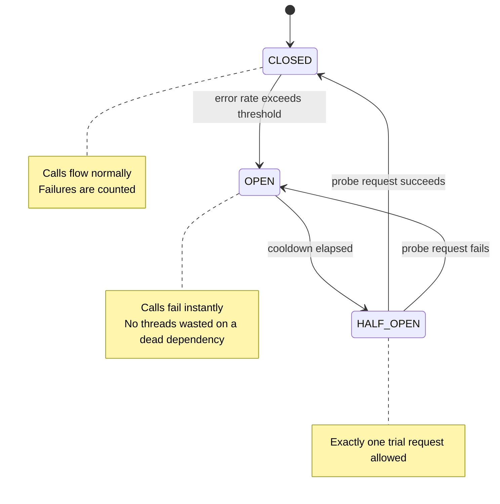
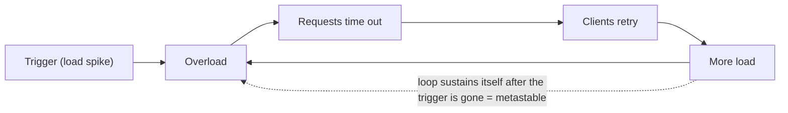
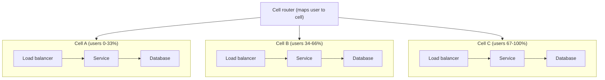

# Reliability: Designing for Failure

> Where this fits: the capstone of the distributed-systems track — once you accept [CAP/PACELC](12-consistency-and-cap.md) constraints, [consensus](13-consensus.md) costs, and [replication](../01-building-blocks/09-replication.md) realities, the next question is "how do I keep the whole thing standing when pieces die?" This is where junior turns into senior.
>
> **Principal-level takeaway:** Reliability is not the absence of failure — it is the *containment* of failure. You will never stop components from dying; your entire job is to ensure that one dying component cannot take its neighbors, then the cluster, then the company with it. Design for the failure you cannot prevent, and the rest is engineering.

---

## ⚡ 60-Second TL;DR

- **What/why:** at scale **failure is the steady state**, not an exception — design so a **fault** (component off-spec) never becomes a **failure** (system stops serving).
- **Detect:** can't tell *dead* from *slow* from *partitioned* — detection trades false-positive vs false-negative; **phi-accrual** beats fixed heartbeats by adapting to a node's own jitter.
- **Survive faults:** **timeouts** (every call — none = latent outage) + **retries w/ full jitter & budgets** + **idempotency keys** (precondition, else double-charge) + **N+k** (only if failures are *independent*).
- **Contain spread:** **circuit breakers** (stop hammering dead deps), **bulkheads** (per-dep pools), **load shedding** + **backpressure** (unbounded queue = OOM), **cells** (shrink blast radius).
- **#1 trap:** **metastable failure** — retries sustain overload *after* the trigger clears; only load-shedding breaks the loop.
- **Numbers:** serial deps **multiply** (0.999³≈99.7%), parallel redundancy **1−(1−A)ⁿ**; timeout at **p99.9** not avg; cap retries to **~10%**.

**Remember one thing:** reliability is the *containment* of failure — assume every dependency will die and ask who it takes down with it.

## The Mental Model — first principles: why does this thing exist?

Start with a number. Suppose a single server has 99.9% availability — it's down ~8.7 hours a year. That sounds reliable. Now build a service out of 1,000 of them and say a request must touch all of them to succeed. The probability that *all 1,000 are simultaneously up* is `0.999^1000 ≈ 0.368`. Your beautiful 99.9% machines just composed into a system that's available **37% of the time**.

That single calculation is the entire reason this chapter exists. At scale, **failure is not an exception — it is the steady state**. Google's famous internal figure: in a 10,000-machine cluster's first year, expect ~1,000 machine failures, thousands of disk failures, ~20 rack failures, a handful of network partitions, and at least one PDU (power) failure taking out ~500–1,000 machines at once. If your design assumes "the happy path with occasional hiccups," it is already wrong. The correct framing is: *something in my system is always broken right now; the design must work anyway.*

This inverts the junior instinct. A junior asks "how do I make this component not fail?" A principal asks "this component **will** fail — what happens to everyone who depends on it, and how do I make that survivable?"

### Fault vs. failure — the distinction everything hangs on

These words are not synonyms, and conflating them is the root of most bad reliability thinking.

- A **fault** is a component deviating from spec: a disk returns garbage, a node stops responding, a packet is dropped, a GC pause freezes a process for 8 seconds.
- A **failure** is the *system as a whole* stopping its required service.

The discipline of reliability engineering is **fault tolerance**: building systems where faults do *not* become failures. A disk fault becomes a failure only if you had one copy of the data. A node fault becomes a failure only if nothing else can serve its work. The art is inserting redundancy, isolation, and recovery between "a fault occurred" and "the user got an error." Counterintuitively, the best way to build confidence that faults won't cause failures is to *deliberately trigger faults* — which is why chaos engineering (later) is a first-class practice, not a stunt.

---

## Core Concepts

### 1. Failure detection is fundamentally uncertain

You cannot reliably tell a *crashed* node from a *slow* node from a *partitioned* node. This is not an engineering gap — it's a theorem. In an asynchronous network (no bound on message delay), you cannot distinguish "dead" from "slow," because the only evidence you have is the *absence* of a message, and absence could mean either. (See [Time, Clocks & Ordering](14-time-clocks-ordering.md) and the FLP impossibility result.)

So all failure detection is **suspicion with a tunable threshold**, and you're trading two errors against each other:

- **False positive:** declaring a healthy-but-slow node dead → you fail it over needlessly, possibly causing split-brain or wasted recovery.
- **False negative:** failing to notice a truly dead node → requests keep routing to a black hole.

The crudest mechanism is a **heartbeat**: every node pings every T seconds; miss K beats and you're declared dead. The problem is the fixed threshold — pick it too tight and a normal GC pause kills a healthy node; too loose and you tolerate a dead node for too long.

**Phi-accrual failure detection** (used by Cassandra and Akka) is the principal-grade refinement. Instead of a boolean dead/alive, it outputs a continuous *suspicion level* φ derived from the statistical distribution of recent inter-arrival times of heartbeats. φ rises smoothly as a heartbeat becomes overdue *relative to that node's own observed history*. You then act on a threshold (e.g., φ > 8). The win: detection adapts to a network's actual jitter instead of a guessed constant, and downstream code can make graded decisions (φ=5 → stop sending new work; φ=10 → trigger failover).

```
φ = -log10( P(heartbeat still arrives later than now | observed history) )
# φ=1 → ~10% chance a heartbeat is still coming → ~10% chance we're wrong to suspect (weak signal)
# φ=8 → ~10^-8 chance a heartbeat is still coming → essentially certain the node is dead
```

The judgment to internalize: **detection latency and detection accuracy are in direct tension, and there is no setting that gives you both.** Anyone who claims their health check is "instant and correct" doesn't understand the problem.

### 2. Redundancy and N+k

If a component fails and you have no spare, you have a failure. So you provision spares. The vocabulary:

- **N+1:** N units needed to carry load, plus 1 spare. Survives a single failure with zero capacity loss.
- **N+2:** survives a second failure *while the first is still being repaired* — critical because failures cluster (a bad deploy, a correlated hardware batch, one failure increasing load on the rest).

The subtlety juniors miss: **redundancy only helps if failures are independent.** Two database replicas in the same rack share a power supply and a top-of-rack switch — a "2x redundant" setup with a single point of failure. Three replicas across three Availability Zones are *meaningfully* redundant because they fail independently. This is why cloud designs obsess over AZ/region spread, and why correlated failure (one bad config pushed everywhere) is the redundancy-killer. Redundancy multiplies availability *only to the extent the copies are uncorrelated*.

### 3. Timeouts — and why "no timeout" is the worst bug in distributed systems

Every network call must have a timeout. **A call with no timeout is a latent total-outage bug**, because of how it interacts with finite resources. Picture a thread-per-request server with a 200-thread pool calling a downstream that hangs. With no timeout, every thread that touches that downstream blocks *forever*. Within seconds all 200 threads are parked, and now your service is down — not because *you* failed, but because you waited on something that did. The hang propagates upstream as a cascading failure.


Picking the value is its own skill. A common heuristic: set the timeout near the **p99.9 of the dependency's normal latency**, not its average. Too tight and you abort healthy-but-slow requests (and trigger retry storms); too loose and you hold resources during an outage. Better still are **deadline propagation** schemes (gRPC deadlines, context.Context in Go): the *caller's* remaining budget travels with the request, so a downstream three hops deep doesn't keep working on a request the user already gave up on.

### 4. Retries: exponential backoff, jitter, and the storm you create

A transient fault (a dropped packet, a brief blip) should be retried. But naive retries are how a small problem becomes an outage.

**Exponential backoff:** wait 1s, then 2s, 4s, 8s… so you don't hammer a struggling dependency. But pure exponential backoff has a vicious flaw: if 10,000 clients all failed at the same instant (because the dependency blipped), they all retry at t=1s, then all at t=3s — synchronized waves that re-overload the recovering service. This is a **retry storm** / **thundering herd**.

**The fix is jitter** — randomize the backoff so the herd disperses. The AWS-recommended form is "full jitter":

```python
# Bad: synchronized retries
sleep = base * 2 ** attempt

# Good: full jitter — spreads load uniformly across the window
sleep = random.uniform(0, base * 2 ** attempt)
```

This single change — `random()` around the backoff — is one of the highest-leverage reliability fixes in existence, and most homegrown retry loops omit it.

> **Interactive:** [Retry Storms: Backoff + Jitter (interactive)](../animations/backoff-jitter.html) -- toggle jitter on/off and watch the synchronized retry waves smear into smooth load.

Here is a production-grade retry loop with **full jitter**, a capped backoff ceiling, and context/deadline propagation so the retries stop the moment the caller's budget is gone. Note that retries are gated on whether the error is *retryable* (transient) — you never retry a `400 Bad Request`.

**Example: Exponential backoff with full jitter**

```go
package retry

import (
	"context"
	"errors"
	"math"
	"math/rand"
	"time"
)

// Retryable marks an error as a transient fault worth retrying.
type Retryable struct{ Err error }

func (r Retryable) Error() string { return r.Err.Error() }
func (r Retryable) Unwrap() error { return r.Err }

// fullJitter returns a random duration in [0, backoff], where backoff
// is base*2^attempt capped at maxDelay (the AWS "full jitter" form).
func fullJitter(attempt int, base, maxDelay time.Duration) time.Duration {
	exp := float64(base) * math.Pow(2, float64(attempt))
	capped := math.Min(exp, float64(maxDelay))
	return time.Duration(rand.Int63n(int64(capped) + 1))
}

// Do runs op with full-jitter exponential backoff. It stops on the first
// success, the first non-retryable error, or when ctx is cancelled.
func Do(
	ctx context.Context,
	maxAttempts int,
	base, maxDelay time.Duration,
	op func(context.Context) error,
) error {
	var last error
	for attempt := 0; attempt < maxAttempts; attempt++ {
		if err := op(ctx); err != nil {
			last = err
			var r Retryable
			if !errors.As(err, &r) {
				return err // non-retryable: fail fast
			}
		} else {
			return nil
		}
		// Respect the caller's deadline rather than sleeping blindly.
		select {
		case <-ctx.Done():
			return errors.Join(ctx.Err(), last)
		case <-time.After(fullJitter(attempt, base, maxDelay)):
		}
	}
	return last
}
```

```java
import java.time.Duration;
import java.util.concurrent.ThreadLocalRandom;
import java.util.function.Supplier;

public final class Retry {

    /** Marks a transient fault worth retrying. */
    public static final class RetryableException extends RuntimeException {
        public RetryableException(Throwable cause) { super(cause); }
    }

    /** Full-jitter backoff: a random delay in [0, base*2^attempt] capped at maxDelay. */
    static Duration fullJitter(int attempt, Duration base, Duration maxDelay) {
        long exp = (long) (base.toMillis() * Math.pow(2, attempt));
        long capped = Math.min(exp, maxDelay.toMillis());
        long jittered = ThreadLocalRandom.current().nextLong(capped + 1);
        return Duration.ofMillis(jittered);
    }

    /**
     * Runs op with full-jitter exponential backoff. Stops on the first success,
     * the first non-retryable error, or when the deadline elapses.
     */
    public static <T> T doWithRetry(
            int maxAttempts,
            Duration base,
            Duration maxDelay,
            Duration deadline,
            Supplier<T> op) throws InterruptedException {
        long deadlineNanos = System.nanoTime() + deadline.toNanos();
        RuntimeException last = null;
        for (int attempt = 0; attempt < maxAttempts; attempt++) {
            try {
                return op.get();
            } catch (RetryableException e) {
                last = e; // retryable: fall through to backoff
            }
            // Any other RuntimeException propagates immediately (fail fast).
            long sleep = fullJitter(attempt, base, maxDelay).toMillis();
            if (System.nanoTime() + sleep * 1_000_000L > deadlineNanos) {
                throw last; // would blow the caller's budget; stop now
            }
            Thread.sleep(sleep);
        }
        throw last;
    }
}
```

**Retry budgets / token buckets:** even jittered retries amplify load. If every layer retries 3x, a request through 4 layers can become `3^4 = 81` attempts on the bottom service during an incident — exactly when it's least able to cope. The principal fix is a **retry budget**: cap retries to, say, 10% of the request rate (Envoy and Finagle do this). When the budget is exhausted, fail fast rather than retry. **Retry at one layer, not every layer**, and never retry through a circuit that's already open.

### 5. Idempotency: the precondition that makes retries *safe*

Here's the trap: you sent "charge $50," the network timed out, and **you do not know if it succeeded.** Retry, and you might double-charge. Don't retry, and you might never charge. There is no safe answer *unless the operation is idempotent* — repeatable with the same effect as doing it once.

The standard mechanism is the **idempotency key**: the client generates a unique key per logical operation and sends it with every retry; the server records "key X → result Y" and on a repeat returns the stored result instead of re-executing. Stripe's API is the canonical example. Reads and `PUT`/`DELETE` are naturally idempotent; `POST`-style "create" and "increment" are not and need the key.

**Idempotency is not optional plumbing — it is the precondition that makes everything above (timeouts, retries, at-least-once delivery) safe.** Without it, your retry logic is a data-corruption engine. This dovetails with [distributed transactions and sagas](15-distributed-transactions.md), where every compensating step must be idempotent because it *will* be re-run.

### 6. Isolation patterns: circuit breakers, bulkheads, load shedding, backpressure

Once a dependency is failing, the goal shifts from "succeed anyway" to "**don't let its failure spread**." Four patterns, each isolating a different blast surface:

- **Circuit breaker.** Wrap calls to a flaky dependency in a state machine: `CLOSED` (calls flow) → trip to `OPEN` after an error-rate threshold (calls fail *instantly*, no waiting) → after a cooldown, `HALF-OPEN` (let one probe through; success closes it, failure re-opens). This stops you from wasting threads on a known-dead dependency and gives it room to recover instead of being hammered. Netflix Hystrix popularized it; Resilience4j and Envoy outlier-detection are modern equivalents.



> **Interactive:** [Circuit Breaker State Machine (interactive)](../animations/circuit-breaker.html) -- drive failures and watch the breaker trip from CLOSED to OPEN, then probe through HALF-OPEN.

A complete, thread-safe circuit breaker tracking the three states, a rolling failure count, and the half-open probe:

**Example: Circuit breaker (closed / open / half-open)**

```go
package breaker

import (
	"errors"
	"sync"
	"time"
)

type State int

const (
	Closed State = iota
	Open
	HalfOpen
)

// ErrOpen is returned immediately when the breaker is OPEN.
var ErrOpen = errors.New("circuit breaker is open")

type Breaker struct {
	mu           sync.Mutex
	state        State
	failures     int
	threshold    int           // consecutive failures that trip the breaker
	cooldown     time.Duration // how long OPEN lasts before a probe
	openedAt     time.Time
	now          func() time.Time
}

func New(threshold int, cooldown time.Duration) *Breaker {
	return &Breaker{
		state:     Closed,
		threshold: threshold,
		cooldown:  cooldown,
		now:       time.Now,
	}
}

// Call runs op unless the breaker forbids it, then records the outcome.
func (b *Breaker) Call(op func() error) error {
	if err := b.beforeCall(); err != nil {
		return err
	}
	err := op()
	b.afterCall(err)
	return err
}

func (b *Breaker) beforeCall() error {
	b.mu.Lock()
	defer b.mu.Unlock()
	if b.state == Open {
		if b.now().Sub(b.openedAt) >= b.cooldown {
			b.state = HalfOpen // allow a single probe through
			return nil
		}
		return ErrOpen
	}
	return nil
}

func (b *Breaker) afterCall(err error) {
	b.mu.Lock()
	defer b.mu.Unlock()
	if err != nil {
		b.failures++
		// A failed probe re-opens; enough failures trip a closed breaker.
		if b.state == HalfOpen || b.failures >= b.threshold {
			b.state = Open
			b.openedAt = b.now()
		}
		return
	}
	// Success: a probe closes the breaker; otherwise reset the counter.
	b.failures = 0
	b.state = Closed
}
```

```java
import java.time.Duration;
import java.time.Instant;
import java.util.concurrent.Callable;
import java.util.concurrent.locks.ReentrantLock;

public final class CircuitBreaker {

    public enum State { CLOSED, OPEN, HALF_OPEN }

    public static final class OpenCircuitException extends RuntimeException {
        public OpenCircuitException() { super("circuit breaker is open"); }
    }

    private final ReentrantLock lock = new ReentrantLock();
    private final int threshold;          // consecutive failures that trip the breaker
    private final Duration cooldown;       // how long OPEN lasts before a probe

    private State state = State.CLOSED;
    private int failures = 0;
    private Instant openedAt = Instant.EPOCH;

    public CircuitBreaker(int threshold, Duration cooldown) {
        this.threshold = threshold;
        this.cooldown = cooldown;
    }

    /** Runs op unless the breaker forbids it, then records the outcome. */
    public <T> T call(Callable<T> op) throws Exception {
        beforeCall();
        try {
            T result = op.call();
            afterCall(true);
            return result;
        } catch (Exception e) {
            afterCall(false);
            throw e;
        }
    }

    private void beforeCall() {
        lock.lock();
        try {
            if (state == State.OPEN) {
                if (Duration.between(openedAt, Instant.now()).compareTo(cooldown) >= 0) {
                    state = State.HALF_OPEN; // allow a single probe through
                } else {
                    throw new OpenCircuitException();
                }
            }
        } finally {
            lock.unlock();
        }
    }

    private void afterCall(boolean success) {
        lock.lock();
        try {
            if (!success) {
                failures++;
                // A failed probe re-opens; enough failures trip a closed breaker.
                if (state == State.HALF_OPEN || failures >= threshold) {
                    state = State.OPEN;
                    openedAt = Instant.now();
                }
                return;
            }
            // Success: a probe closes the breaker; otherwise reset the counter.
            failures = 0;
            state = State.CLOSED;
        } finally {
            lock.unlock();
        }
    }
}
```

- **Bulkhead.** Named after a ship's compartments: partition resources so one workload can't drain them all. Give each downstream dependency its *own* thread pool / connection pool. If dependency A hangs, it exhausts only A's pool; requests to B and C keep flowing. Without bulkheads, one slow dependency drowns the shared pool and takes down everything (this is the cascade from §3).

- **Load shedding.** When you're overloaded, *deliberately reject* some requests fast (HTTP 429/503) so the ones you accept actually complete. A server admitting more than it can serve enters a death spiral where everything times out and *nothing* succeeds — strictly worse than serving 80% and rejecting 20%. Shed the cheap/low-priority work first (this requires request prioritization).

- **Backpressure.** Instead of buffering unbounded work (queues that grow until OOM), signal *upstream* to slow down. TCP flow control, reactive streams, and bounded queues with rejection are all backpressure. The principle: **an unbounded queue is a latent outage** — it converts an overload into ever-growing latency and eventual memory death. Bound the queue; when it's full, shed.

### 7. Graceful degradation and fallback

A reliable system **degrades** rather than collapses. When the recommendation service is down, show generic popular items, not an error page. When the live price feed is stale, show the cached price with a "as of 30s ago" note. The principle: **a partial answer beats no answer**, and the system should peel away non-essential features under stress while protecting the core transaction.

Amazon's product page is the textbook case: it composes dozens of services (reviews, recommendations, "frequently bought together," inventory). Any of them can fail and the page *still renders with a Buy button* — because each is wrapped in a fallback that returns empty rather than propagating an error. The core path (buy the thing) is defended; everything else is best-effort.

### 8. Cascading and metastable failures — the dynamics that kill at scale

This is the most important and least-understood part. A **cascading failure** is a feedback loop: component A fails → its load shifts to B → B overloads and fails → load shifts to C… until the whole system is down. The 2021 Facebook/Meta outage, many AWS incidents, and most "the whole site went down at once" events are cascades.

A **metastable failure** (the term comes from a 2021 HotOS paper and a 2022 ACM article) is the nastier cousin: a system gets pushed into a *stable bad state* that **persists even after the original trigger is gone**. The classic example: load spikes → latency rises → clients time out and retry → retries multiply the load → so even when the original spike passes, the retry-amplified load keeps the system saturated. The system is now "stably overloaded" and **will not recover on its own** — you have to manually shed load or stop the retries to break the loop.



The defenses are exactly the patterns above: jittered backoff + retry budgets remove the amplification; load shedding + circuit breakers break the loop; backpressure prevents the queue buildup. Recognizing that **your system has feedback loops that can self-sustain an outage** is a hallmark of principal-level thinking.

### 9. Blast radius and cell-based architecture

If you can't prevent failure, **shrink how much it can hurt** — the blast radius. **Cell-based architecture** is the structural answer: partition the entire stack (LB → service → DB) into independent **cells**, each serving a slice of users/tenants. A cell that fails takes down only its slice. A bad deploy rolled out cell-by-cell exposes only one cell. AWS, Slack, DoorDash, and others run cellular architectures; AWS explicitly designs services so a regional control-plane issue can't cross cell boundaries.



A failure inside Cell B takes down only Cell B's slice of users; Cells A and C are fully isolated. A bad deploy rolled cell-by-cell exposes one third of users at most before you catch it.

This composes with [partitioning/sharding](../01-building-blocks/10-partitioning-sharding.md) (cells *are* a sharding of the whole system, not just the data) and is why the question "what's the blast radius of this change?" should precede every deploy.

### 10. Chaos engineering

If failure is the steady state, **test it on purpose.** Chaos engineering (Netflix's Chaos Monkey, 2011, then the broader Simian Army; now Gremlin, AWS FIS) injects faults — kills instances, adds latency, drops packets, partitions networks — *in production or production-like environments* to verify the system degrades as designed. The point isn't breaking things; it's converting *unknown* failure modes into *known, tested* ones before a real incident finds them for you. The discipline: form a hypothesis ("if we kill an AZ, error rate stays under 0.1%"), inject the fault with a small blast radius, and either confirm or fix.

---

## Trade-offs at a Glance

| Pattern | Solves | Cost / Downside | When to use |
|---|---|---|---|
| **Heartbeat (fixed threshold)** | Crash detection | False positives on GC/jitter; threshold guesswork | Simple, stable networks |
| **Phi-accrual** | Adaptive detection | More complex; needs history | Variable-latency clusters (Cassandra) |
| **N+1 redundancy** | Single failure | ~2x cost; useless if correlated | Most stateless services |
| **N+2 redundancy** | Failure during repair | Higher cost | Critical / slow-to-repair systems |
| **Timeout** | Resource exhaustion from hangs | Aborts slow-but-valid work; can trigger retries | **Always** — every remote call |
| **Retry + backoff + jitter** | Transient faults | Amplifies load if unbudgeted | Idempotent ops only |
| **Retry budget** | Retry storms | Caps recovery aggressiveness | Any multi-layer call graph |
| **Circuit breaker** | Hammering a dead dependency | Tuning thresholds; can flap | Calls to flaky external deps |
| **Bulkhead** | One dep draining shared pool | Lower utilization (siloed pools) | Multiple independent dependencies |
| **Load shedding** | Overload death spiral | Rejects real users | Any service that can be overwhelmed |
| **Backpressure** | Unbounded queue OOM | Pushes problem upstream | Streaming / queue-based systems |
| **Graceful degradation** | All-or-nothing failure | Eng effort; degraded UX | Composite UIs / read paths |
| **Cell architecture** | Large blast radius | Operational complexity, cross-cell routing | Multi-tenant systems at scale |

---

## How Real Systems Do It

- **Amazon DynamoDB / the original Dynamo paper (2007):** sloppy quorums and hinted handoff for write availability during partitions; designed so the shopping cart is *always writable* even if it means temporary conflicts to reconcile later. See [the Dynamo case study](../04-design-case-studies/26-object-store-and-kv-store.md).
- **Cassandra:** phi-accrual failure detection; tunable consistency (`R + W > N` quorum math) lets you trade availability for consistency per query; hinted handoff buffers writes for a down replica.
- **Kafka:** replication factor (commonly 3) + `min.insync.replicas` (commonly 2). A partition stays available as long as enough ISR (in-sync replicas) survive; `acks=all` trades latency for durability. See [messaging & streaming](../01-building-blocks/11-messaging-and-streaming.md).
- **Netflix:** Chaos Monkey + Hystrix (circuit breakers, bulkheads, fallbacks) — the entire resilience-engineering vocabulary largely entered the industry through their open-source stack. Hystrix is now in maintenance; Resilience4j is the modern successor.
- **AWS:** cell-based architecture, "static stability" (a system keeps working using its last-known-good state even if the *control plane* is down — e.g., a load balancer keeps routing to known-healthy hosts even if it can't reach the health-check service). The famous 2017 S3 outage was a cascade triggered by a typo'd capacity-removal command that took down an index subsystem.
- **Envoy / Istio:** outlier detection (data-plane circuit breaking), retry budgets, and configurable timeouts as a *mesh-level* default so individual services inherit resilience.
- **Google:** SRE error budgets — quantify the *allowed* unreliability (if your SLO is 99.9%, you have 0.1% to "spend"), aligning reliability investment with reality. See [Observability & SLOs](../03-architecture-and-apis/19-observability.md).

---

## Failure Modes & Common Misconceptions

**Myth: "Adding retries makes my system more reliable."**
Retries without idempotency corrupt data; without jitter create storms; without budgets cause metastable failure. Retries are a *load amplifier* that happens to also help — handle them with extreme care.

**Myth: "More replicas always means more available."**
Only if failures are independent. Three replicas in one rack are barely better than one. And for *strongly consistent* systems, adding replicas can *reduce* availability for writes (more nodes that must agree — see [consensus](13-consensus.md) quorum math).

**Myth: "If my dependency is 99.9% available and so am I, I'm ~99.9%."**
No — availability of a serial chain *multiplies*. You calling a 99.9% dependency, on a 99.9% host, with a 99.9% DB, yields `0.999^3 ≈ 99.7%`. Every dependency you add on the critical path *subtracts* reliability. This is the math:

```
Serial (need ALL):   A_total = A1 × A2 × ... × An      (always LESS reliable)
Parallel (need ANY): A_total = 1 − (1−A1)(1−A2)...      (MORE reliable)

# Two 99% replicas in parallel: 1 − (0.01)² = 99.99%  ← redundancy here
# Two 99% services in series:   0.99 × 0.99 = 98.01%   ← dependency here
```

The design lever: **move dependencies off the critical path** (make them async/best-effort) and **add redundancy in parallel** on the parts that must be serial.

**Myth: "Health checks tell me what's up."** They tell you what *was* responding one interval ago, and they can't distinguish slow from dead (§1). A node can pass health checks while serving 100% errors to real traffic ("gray failure").

**Failure mode — the synchronized retry storm:** a 2-second blip causes thousands of clients to retry in lockstep, turning a blip into a 30-minute outage. Cause: backoff without jitter. (§4)

**Failure mode — the unbounded queue:** under overload, a queue grows until the process OOMs, or latency grows until every request times out. The queue "absorbing" load is the trap. Bound it. (§6)

**Failure mode — the missing timeout:** the single most common latent outage. One hung dependency exhausts your thread pool and you go down for reasons unrelated to your own code. (§3)

**Failure mode — retry-induced metastability:** the system stays down after the trigger clears because retries sustain the overload. The fix is *load shedding*, not "wait for it to recover." (§8)

---

## In a Design Discussion

When you're whiteboarding, the reliability conversation is where seniority shows. Two takes on the same prompt — *"design a checkout service that calls payments, inventory, and a recommendation service":*

> **Junior take:** "The service calls payments, inventory, and recommendations, returns the result. We'll add retries on the payment call so it's reliable, and run two instances for redundancy."

This sounds reasonable and is quietly broken: retries on a non-idempotent charge can double-bill; "two instances" may share a failure domain; recommendations (non-essential) sit on the critical path so its outage breaks checkout; no timeouts means one hung call exhausts the pool.

> **Principal take:** "What's the blast radius if payments is down — does checkout fail open or closed? Payments and inventory are critical-path, so I'll give them tight timeouts (p99.9), bulkheaded pools, and circuit breakers; payment retries require an idempotency key so a retry can't double-charge. Recommendations is *not* critical — I'll move it off the hot path with a short timeout and a fallback to popular items, so its failure degrades the page instead of blocking the sale. Redundancy spans three AZs, not three boxes in a rack. I'll budget retries to 10% so we don't storm payments during a blip, and add load shedding so an overload sheds rec-fetches before checkouts. And I want a chaos test that kills an AZ and asserts checkout stays under 0.1% errors."

Notice the moves: **classify each dependency by criticality**, **defend the core path while degrading the rest**, **make retries safe before adding them**, **reason about failure domains and blast radius explicitly**, and **demand a way to verify it under fault.** That mental checklist — *what fails, who depends on it, what's the blast radius, how does it degrade* — is the deliverable. Tie the target number back to an [SLO/error budget](../03-architecture-and-apis/19-observability.md) and document the call in an [ADR](../05-principal-skills/29-tradeoffs-and-adrs.md).

---

## Self-Check

<details>
<summary>1. Why can't a failure detector reliably distinguish a crashed node from a slow one?</summary>
Because in an asynchronous network the only evidence is the *absence* of a message, and absence is ambiguous — the node could be dead or the message could be delayed. There's no upper bound on delay, so any threshold trades false positives (kill healthy slow nodes) against false negatives (miss dead nodes). You can tune the balance but not eliminate it.
</details>

<details>
<summary>2. You call a downstream with no timeout and it hangs. Walk through how your unrelated traffic goes down.</summary>
Each request to the hung dependency parks a thread (or connection) forever. The pool is finite, so within seconds every thread is blocked waiting. Now requests to *other* dependencies can't get a thread either — your whole service stops serving. The fault propagated upstream into a cascading failure even though your own code is fine.
</details>

<details>
<summary>3. Why is jitter, not just exponential backoff, essential for retries?</summary>
Pure exponential backoff keeps a herd of failed clients synchronized — they all retry at the same instants (t=1s, 3s, 7s…), re-overloading the recovering dependency in waves (thundering herd / retry storm). Jitter randomizes each client's wait, spreading retries uniformly so the recovering service sees smooth load.
</details>

<details>
<summary>4. Three replicas at 99% each. Availability if you need ANY one vs. need ALL three?</summary>
Need ANY (parallel/redundant): `1 − (0.01)³ = 99.9999%`. Need ALL (serial dependency): `0.99³ ≈ 97.03%`. Redundancy composes in parallel and *raises* availability; dependencies compose in series and *lower* it.
</details>

<details>
<summary>5. What is a metastable failure and why won't it self-heal?</summary>
A stable bad state sustained by a feedback loop (e.g., retries) *after* the original trigger is gone. Overload → timeouts → retries → more load → more overload. The loop feeds itself, so removing the trigger isn't enough; you must break the loop by shedding load or stopping retries.
</details>

<details>
<summary>6. Why is idempotency a *precondition* for safe retries, not just a nice-to-have?</summary>
A timeout means you don't know whether the operation succeeded. Retrying a non-idempotent op (charge, increment, create) risks doing it twice; not retrying risks never doing it. Only idempotency (e.g., dedup via idempotency key) makes "retry" safe — without it, retry logic is a data-corruption engine.
</details>

<details>
<summary>7. Bulkhead vs. circuit breaker — what does each isolate?</summary>
Bulkhead isolates *resources* (separate thread/connection pools per dependency) so one hung dependency can't drain the shared pool. Circuit breaker isolates *time/effort* (stops sending calls to a known-dead dependency, failing fast instead of waiting). They're complementary: bulkheads contain resource exhaustion, breakers stop wasting effort on dead deps.
</details>

<details>
<summary>8. Your service is overloaded. Why is rejecting 20% of requests better than accepting all of them?</summary>
If you admit more than you can serve, everything queues, latencies rise past timeouts, clients retry, and *nothing* completes — a death spiral (often metastable). Shedding 20% lets the admitted 80% actually finish within their deadlines. Throughput of *successful* requests is higher when you shed than when you don't.
</details>

---

## Go Deeper

- **Designing Data-Intensive Applications (Kleppmann)** — Chapter 8 ("The Trouble with Distributed Systems": faults, unreliable networks, unreliable clocks, knowledge/truth/lies) and Chapter 9 (consistency, linearizability, the cost of fault tolerance). The single best foundation for this chapter.
- **Google SRE Book** — "Embracing Risk" (error budgets), "Addressing Cascading Failures" (the definitive treatment of overload, retry amplification, and load shedding). Free online.
- **"Metastable Failures in Distributed Systems"** — Bronson et al., HotOS 2021, and the follow-up ACM Queue / CACM article (2022). Read it; it names a failure class you'll see everywhere afterward.
- **Amazon Builders' Library** — "Timeouts, retries, and backoff with jitter" (Marc Brooker) and "Avoiding fallback in distributed systems," "Workload isolation using shuffle-sharding." Concise, battle-tested.
- **The Dynamo paper (2007)** — DeCandia et al. — availability-first design, sloppy quorums, hinted handoff.
- **Release It! (Nygard)** — origin of "circuit breaker," "bulkhead," and the stability-patterns vocabulary; reads like a field guide to production failure.
- **Chaos engineering** — Netflix's "Principles of Chaos Engineering" (principlesofchaos.org); the *Chaos Engineering* O'Reilly book.

**Sibling writeups:** [Consistency, CAP & PACELC](12-consistency-and-cap.md) · [Consensus & Leader Election](13-consensus.md) · [Time, Clocks & Ordering](14-time-clocks-ordering.md) · [Distributed Transactions, Sagas & Idempotency](15-distributed-transactions.md) · [Replication](../01-building-blocks/09-replication.md) · [Observability & SLOs](../03-architecture-and-apis/19-observability.md) · [Trade-offs & ADRs](../05-principal-skills/29-tradeoffs-and-adrs.md) · [Roadmap](../ROADMAP.md) · [Index](../README.md)
