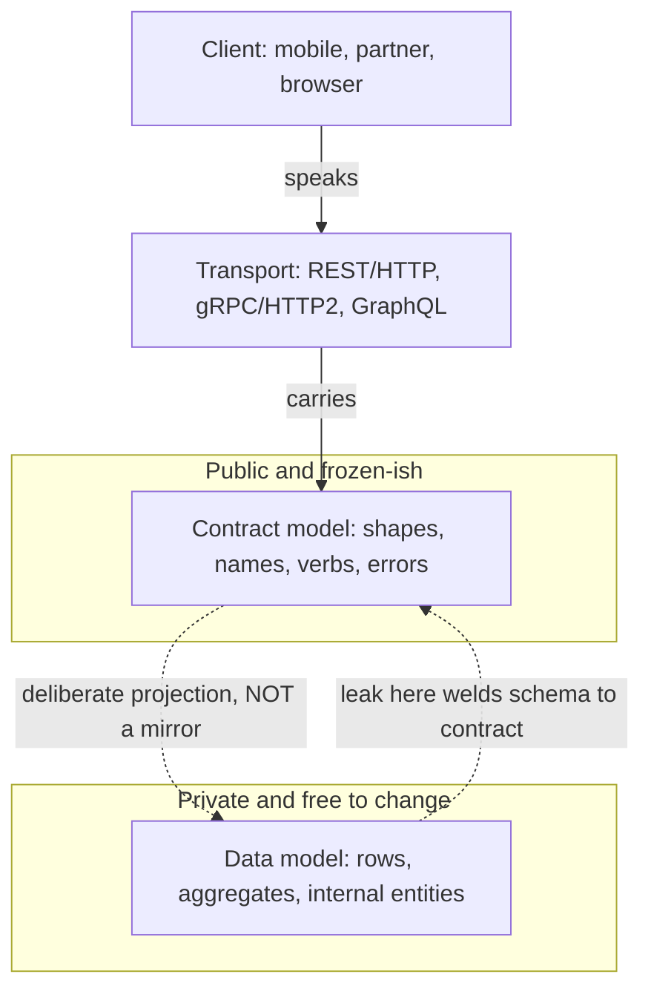
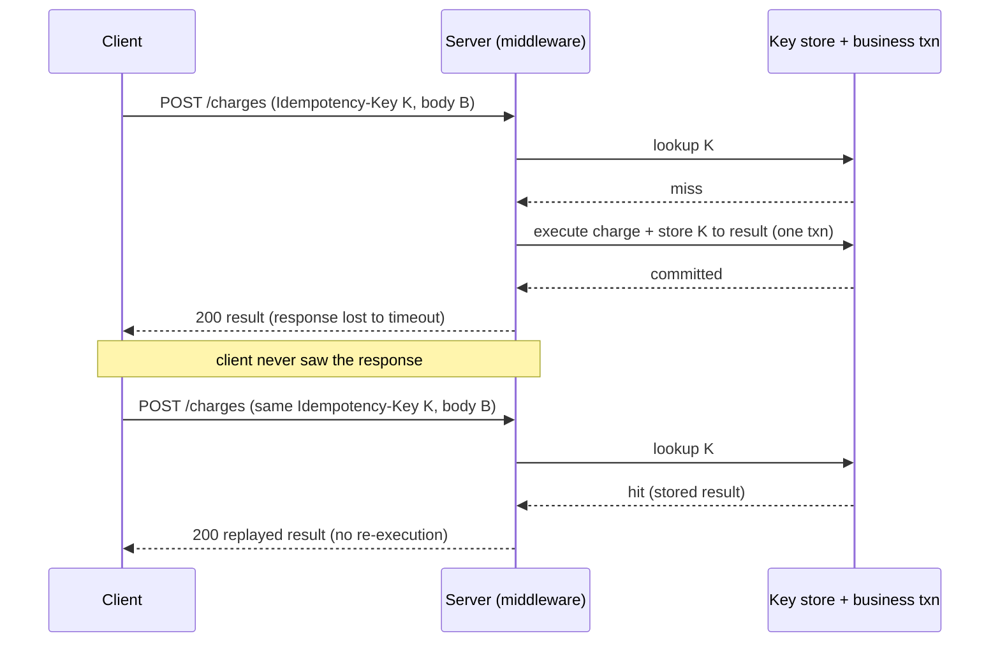
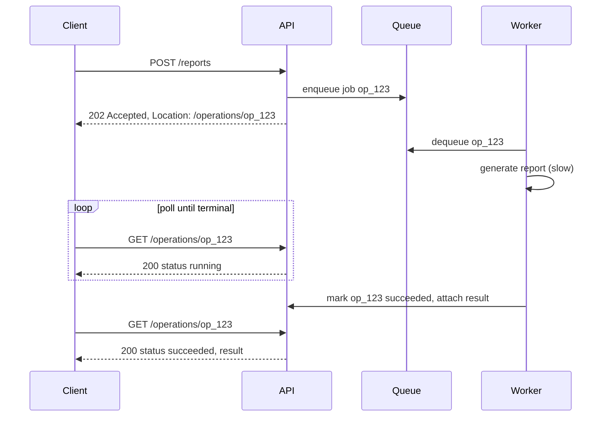
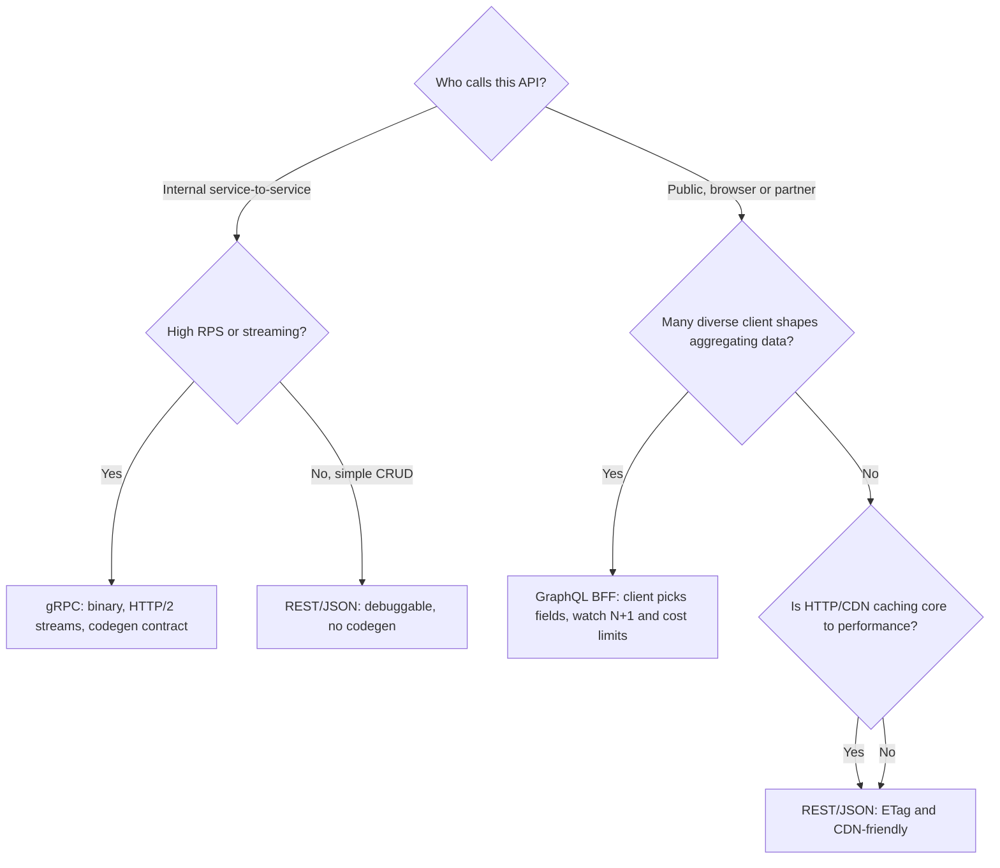

# API Design: REST, gRPC, GraphQL & Contracts

> **Where this fits:** Every service boundary in a distributed system is an API — the contract that lets teams, clients, and machines change independently. This chapter is about designing those boundaries so they survive scale, retries, and a decade of evolution.
>
> **Principal-level takeaway:** An API is a *contract you cannot easily un-publish*. Optimize for **evolvability and safety under failure** first (idempotency, versioning, clean error models, cursor pagination), and for protocol/efficiency second. The protocol (REST vs gRPC vs GraphQL) is a 30-minute decision; a leaked internal data model or a non-idempotent payment endpoint is a multi-year liability.

---

## ⚡ 60-Second TL;DR

- **What:** an API is a long-lived **contract** between independently-evolving software; optimize for **evolvability + retry-safety** over protocol choice.
- **REST** = resources + uniform verbs (public edge, cacheable); **gRPC** = binary/HTTP2/codegen (internal east-west, ~3–10x smaller); **GraphQL** = client picks fields (many client shapes, but N+1 + cost-DoS risk).
- **Idempotency keys** make `POST` retries safe — store key→result atomically with the effect, else timeouts cause double charges (#1 money bug).
- **Cursor (keyset) pagination**, not offset: offset is O(offset) and skips/dupes under concurrent writes.
- **Errors:** single envelope, stable machine-readable `code` (never branch on `message`); honor the `4xx`-no-retry / `5xx`+`429`-retry split.
- **Numbers/rules:** protobuf compat keys on **field number** (never reuse); deprecation windows ~6–12mo; GitHub GraphQL = 5000 pts/hr.

**Remember one thing:** the contract is a deliberate projection of your data model, not a mirror — design for safe retries and additive evolution, because you cannot easily un-publish it.

## The Mental Model — first principles

Strip away the buzzwords. An API exists to solve one problem: **two pieces of software, written by different people at different times, need to cooperate without coordinating.** Your mobile team ships on a 2-week cadence; your backend ships daily; a third-party integrator updates once a year. The API is the *only* thing they share, and you cannot force them all to upgrade at the same instant.

That single constraint generates almost every rule in this chapter:

- Because clients upgrade on their own schedule → you need **backward/forward compatibility** and **versioning**.
- Because networks are unreliable (see [Networking](../00-foundations/01-networking.md) and [Reliability](../02-distributed-systems/16-reliability-and-failure.md)) → calls *will* be retried, so writes must be **idempotent** or carry **idempotency keys**.
- Because you don't control how clients call you → you need **rate limiting** and **query cost limits** to protect yourself.
- Because data grows → naive "return everything" endpoints become **pagination** problems.
- Because failures must be machine-actionable → you need a structured **error model**, not free-text 500s.

A useful frame: an API has three layers, and confusing them is the root of most bad design.

1. **The data model** — your internal entities (rows, aggregates). *Private.*
2. **The resource/contract model** — what you expose: shapes, names, verbs, errors. *Public, frozen-ish.*
3. **The transport** — REST/HTTP, gRPC/HTTP2, GraphQL. *An implementation detail of the contract.*

The single most common junior mistake is letting layer 1 leak into layer 2 — exposing your `users` table as `GET /users` with every column. Now your database schema is your public contract, and you can't rename a column without breaking a partner. **The contract is a deliberate projection of your data model, not a mirror of it.**

The three layers, and the projection boundary that protects you:



---

## Core Concepts

### REST: resources, verbs, and status codes

REST is not "JSON over HTTP." It's an architectural style whose useful, load-bearing ideas are: model the domain as **resources** (nouns) identified by URLs, manipulate them with a **uniform set of verbs** (HTTP methods), and let the verb's *semantics* — not your code — tell intermediaries (caches, proxies, retry libraries) what's safe to do.

The verbs carry two properties that matter enormously at scale:

| Method | Safe (no side effects)? | Idempotent (N calls == 1 call)? | Typical use |
|--------|------------------------|----------------------------------|-------------|
| `GET` | Yes | Yes | Read a resource |
| `HEAD` | Yes | Yes | Read metadata only |
| `PUT` | No | **Yes** | Replace a resource at a known URL |
| `DELETE` | No | **Yes** | Remove a resource |
| `POST` | No | **No** | Create / non-idempotent action |
| `PATCH` | No | Not required (depends on patch semantics) | Partial update |

**Idempotency is the property that makes retries safe.** If a `PUT /accounts/42 {...}` times out, a client can resend it without fear — the second call lands the same state. A `POST /transfers` cannot be retried blindly, because two calls = two transfers. This distinction is the entire reason idempotency keys (below) exist. Cross-reference: [Distributed Transactions, Sagas & Idempotency](../02-distributed-systems/15-distributed-transactions.md).

**Status codes are a contract, not decoration.** Get them right because retry logic, load balancers, and monitoring all key off them:

- `2xx` success: `200 OK`, `201 Created` (with a `Location` header), `202 Accepted` (work queued — see async APIs), `204 No Content`.
- `3xx`: `304 Not Modified` (conditional GET with `ETag`/`If-None-Match` — free caching).
- `4xx` **client error, do not retry as-is**: `400` malformed, `401` unauthenticated, `403` authenticated-but-forbidden, `404`, `409` conflict (optimistic concurrency), `422` semantically invalid, `429` rate-limited (retry *after* `Retry-After`).
- `5xx` **server error, safe to retry with backoff**: `500`, `502`/`503` (`503` with `Retry-After`), `504`.

The `4xx`/`5xx` split *is* the retry contract. A client's retry library should back off on `5xx` and `429`, and never auto-retry a `400`. Returning `200` with `{"error": ...}` in the body — a real anti-pattern — blinds every piece of infrastructure that reads status codes.

### gRPC and protobuf: when binary, streaming, and strict contracts win

gRPC is an RPC framework: you call a remote method as if it were local. The contract lives in a `.proto` file, compiled to typed stubs in every language. It runs over HTTP/2 (multiplexed streams, header compression) and serializes with Protocol Buffers — a compact binary format.

```protobuf
syntax = "proto3";
service PaymentService {
  rpc Charge(ChargeRequest) returns (ChargeResponse);
  rpc StreamEvents(EventFilter) returns (stream Event); // server streaming
}
message ChargeRequest {
  string idempotency_key = 1;  // field NUMBERS are the contract, not names
  int64 amount_minor = 2;      // 1099 = $10.99; never floats for money
  string currency = 3;
}
```

Why reach for it:

- **Efficiency.** Protobuf payloads are typically ~3–10x smaller than equivalent JSON and far cheaper to parse (no string-to-number, no key reparsing). On a hot internal path doing millions of RPCs/sec, this is real CPU and latency.
- **Streaming.** HTTP/2 gives you server-streaming, client-streaming, and bidirectional streams in one connection — ideal for telemetry, chat, live feeds.
- **Strict, code-generated contracts.** The `.proto` is the single source of truth; clients can't drift.

The **compatibility rules are the whole game** and beginners get them wrong: compatibility is keyed on the **field number**, never the field name. You may rename a field freely. You may add new fields (unknown fields are preserved/ignored). You must **never reuse or change the type of an existing field number**, and you should `reserved` retired numbers so no one accidentally reuses them. Break this and you get silent data corruption, not a clean error.

The costs: it's awkward in browsers (needs grpc-web + a proxy), the binary wire is not human-debuggable with `curl`, and it imposes a build-step/codegen toolchain. **gRPC's sweet spot is internal east-west service-to-service traffic; REST/GraphQL dominate the public, browser-facing north-south edge.**

### GraphQL: client-driven queries and their sharp edges

GraphQL inverts control: instead of the server defining fixed endpoints, it publishes a typed **schema/graph**, and the *client* declares exactly the fields it wants in one request.

```graphql
query { user(id: "42") { name, orders(first: 10) { items { title, price } } } }
```

This kills two REST pain points: **over-fetching** (mobile gets only the 3 fields it needs, not 40) and **under-fetching / round-trips** (one query instead of `GET /user`, then N `GET /orders`). It shines when you have many heterogeneous clients (web, iOS, Android, partners) all wanting different slices of the same data — which is exactly why Meta built it.

But it relocates the hard problems onto the server:

- **The N+1 problem.** A query for 100 posts each with an `author` resolves the post list, then fires 100 separate `author` fetches (one per post). The standard fix is the **DataLoader** pattern: batch all keys requested within a tick and resolve them in one round trip (`WHERE author_id IN (...)`), with per-request caching. Without it, GraphQL silently amplifies database load.
- **Cost / depth limiting.** Because the client writes the query, a deeply nested query over cyclic relationships (`{ user { friends { friends { friends ... }}}}`) blows up multiplicatively — each connection level multiplies the row count by its page size, so cost compounds with depth — a built-in DoS vector. You **must** enforce query depth limits, complexity/cost scoring (assign each field a cost, reject above a budget), and often persisted queries (only allow pre-registered query hashes in production).
- **Caching is harder.** HTTP caching keys on URL+method; a single `POST /graphql` endpoint defeats CDN/`ETag` caching. You move caching into the resolver layer (DataLoader, Redis) — see [Caching](../01-building-blocks/06-caching.md).

**Myth to kill now:** "GraphQL is faster than REST." It moves work and complexity around; it does not make your database faster. It optimizes the *client→server payload shape and round-trips*, often at the cost of *server-side complexity and cacheability*.

### Versioning strategies

You will need to make breaking changes. The strategy is about *where* the version lives and *how clients migrate*.

| Strategy | Example | Pros | Cons |
|----------|---------|------|------|
| **URI path** | `/v2/orders` | Obvious, easy to route/log, cache-friendly | Coarse; "version" applies to whole API; URL churn |
| **Header / media type** | `Accept: application/vnd.acme.v2+json` | Clean URLs, content negotiation | Invisible in logs/browser; easy to forget |
| **Query param** | `/orders?version=2` | Simple | Pollutes caching, easy to drop |
| **No versioning (additive evolution)** | add fields, never break | No migration tax; what protobuf/GraphQL encourage | Requires discipline; can't ever remove |

The principal's preference: **avoid versioning by never making breaking changes.** Additive evolution — adding optional fields, new endpoints, new enum values clients must tolerate — covers ~90% of changes. Reserve a hard `v2` for genuine model rewrites, and when you cut one, run v1 and v2 *in parallel* with a deprecation window (typically 6–12 months), a `Sunset` header, and usage dashboards so you know who's still on v1 before you kill it.

### Pagination: why cursor beats offset at scale

Naive pagination uses `LIMIT 20 OFFSET 1000000`. Two fatal flaws:

1. **It gets slower the deeper you go.** The database must scan and discard all `OFFSET` rows. `OFFSET 1000000` reads a million rows to return 20 — O(offset) per page. (See [Storage Engines](../00-foundations/03-storage-engines.md) for why.)
2. **It's incorrect under concurrent writes.** If a row is inserted before your offset between page 1 and page 2, every subsequent item shifts and you get **duplicates or skips**.

**Cursor (keyset) pagination** fixes both. Instead of "skip N rows," you say "give me rows *after this sorted key*":

```sql
-- offset (bad at scale): SELECT * FROM events ORDER BY id LIMIT 20 OFFSET 1000000;
-- keyset (good):
SELECT * FROM events WHERE (created_at, id) < (:last_ts, :last_id)
ORDER BY created_at DESC, id DESC LIMIT 20;
```

The cursor is an opaque, base64-encoded token encoding `(created_at, id)` of the last item. Because the `WHERE` clause hits an index, every page is O(page size) regardless of depth, and inserts don't shift your window. The tie-breaker (`id`) is mandatory — sorting on a non-unique column alone (e.g. `created_at`) silently drops or duplicates rows that share a value.

The trade-off: cursors can't jump to "page 500" and don't easily give a total count. That's almost always the right trade — infinite scroll and APIs rarely need random page access, and exact counts on large tables are expensive anyway. **Cursor pagination is the default for any list that can grow unboundedly.**

**Cursor / keyset pagination query building.** Decode the opaque cursor into a `(created_at, id)` tuple, build a parameterized keyset `WHERE`, fetch `limit + 1` rows to detect whether a next page exists, and emit the next cursor. Note both versions use bind parameters — never string-concatenate cursor values, which is a SQL-injection hole.

```go
package pagination

import (
	"encoding/base64"
	"errors"
	"fmt"
	"strconv"
	"strings"
	"time"
)

type Cursor struct {
	CreatedAt time.Time
	ID        int64
}

func (c Cursor) Encode() string {
	raw := fmt.Sprintf("%d|%d", c.CreatedAt.UnixNano(), c.ID)
	return base64.RawURLEncoding.EncodeToString([]byte(raw))
}

func DecodeCursor(s string) (Cursor, error) {
	b, err := base64.RawURLEncoding.DecodeString(s)
	if err != nil {
		return Cursor{}, errors.New("malformed cursor")
	}
	parts := strings.SplitN(string(b), "|", 2)
	if len(parts) != 2 {
		return Cursor{}, errors.New("malformed cursor")
	}
	ns, err1 := strconv.ParseInt(parts[0], 10, 64)
	id, err2 := strconv.ParseInt(parts[1], 10, 64)
	if err1 != nil || err2 != nil {
		return Cursor{}, errors.New("malformed cursor")
	}
	return Cursor{CreatedAt: time.Unix(0, ns).UTC(), ID: id}, nil
}

// Build returns a parameterized keyset query and its args. cur is nil for page 1.
func Build(limit int, cur *Cursor) (string, []any) {
	const base = `SELECT id, created_at, title FROM events`
	const order = ` ORDER BY created_at DESC, id DESC LIMIT $1` // limit+1 to peek
	if cur == nil {
		return base + order, []any{limit + 1}
	}
	where := ` WHERE (created_at, id) < ($2, $3)`
	return base + where + order, []any{limit + 1, cur.CreatedAt, cur.ID}
}

type Page[T any] struct {
	Items      []T
	NextCursor string // empty when there is no next page
}
```

```java
import java.nio.charset.StandardCharsets;
import java.time.Instant;
import java.util.Base64;
import java.util.List;

public final class KeysetPagination {

    public record Cursor(Instant createdAt, long id) {
        public String encode() {
            String raw = createdAt.toEpochMilli() + "|" + id;
            return Base64.getUrlEncoder().withoutPadding()
                    .encodeToString(raw.getBytes(StandardCharsets.UTF_8));
        }
        public static Cursor decode(String s) {
            try {
                String raw = new String(Base64.getUrlDecoder().decode(s), StandardCharsets.UTF_8);
                String[] parts = raw.split("\\|", 2);
                return new Cursor(Instant.ofEpochMilli(Long.parseLong(parts[0])),
                                  Long.parseLong(parts[1]));
            } catch (RuntimeException e) {
                throw new IllegalArgumentException("malformed cursor", e);
            }
        }
    }

    /** Parameterized SQL plus ordered bind args; cur may be null for page 1. */
    public record Query(String sql, List<Object> args) {}

    public static Query build(int limit, Cursor cur) {
        String base = "SELECT id, created_at, title FROM events";
        String order = " ORDER BY created_at DESC, id DESC LIMIT ?"; // limit+1 to peek
        if (cur == null) {
            return new Query(base + order, List.of(limit + 1));
        }
        String where = " WHERE (created_at, id) < (?, ?)";
        return new Query(base + where + order,
                List.of(limit + 1,
                        java.sql.Timestamp.from(cur.createdAt()),
                        cur.id()));
    }

    public record Page<T>(List<T> items, String nextCursor) {} // nextCursor null when last page
}
```

### Filtering, sorting, and conventions

Establish these once, org-wide, so every API feels the same: `?filter[status]=active&sort=-created_at&fields=id,name&page[size]=20`. Pin **sort to deterministic keys** (always include a unique tiebreaker for stable pagination), **whitelist** filterable/sortable fields (an open `sort` over an unindexed column is a performance footgun), and treat filter syntax as part of the contract.

### Idempotency keys: safe retries on writes

This is the most important pattern in the chapter for write-heavy systems. A `POST /charges` that times out leaves the client in agony: did it succeed? Retrying risks a double charge; not retrying risks a lost payment.

The solution: the **client generates a unique key** (a UUID) and sends it with the request.

```
POST /charges
Idempotency-Key: 7b3f...-uuid
{ "amount_minor": 1099, "currency": "usd" }
```

The server, on first receipt, processes the request and **stores the key → result mapping** (typically with a TTL of 24h–7d). On any retry with the same key, it returns the *stored* result without re-executing. Subtleties that separate a working implementation from a broken one:

- The key→result write and the business effect must be **atomic** (same transaction, or an outbox), or a crash between them reintroduces double-execution.
- Concurrent retries hitting before the first completes need a lock/`409`-and-retry, or you get a race.
- Reusing a key with a *different* body should `422`, not silently return the old result.

This is exactly how **Stripe** and **PayPal** make payments retry-safe. It's the API-layer expression of the idempotency ideas in [Distributed Transactions & Idempotency](../02-distributed-systems/15-distributed-transactions.md).

The flow, including the timeout-then-retry case that makes the pattern earn its keep:



**Idempotency-key middleware (store first response, replay on retry).** A minimal but correct middleware: it serializes concurrent requests for the same key, replays a stored response on retry, and rejects key reuse with a different body. Production versions persist to Redis/Postgres with a TTL and make the store-write atomic with the business effect; here we use an in-memory store to keep it self-contained.

```go
package idempotency

import (
	"bytes"
	"crypto/sha256"
	"encoding/hex"
	"io"
	"net/http"
	"sync"
)

type storedResponse struct {
	status   int
	body     []byte
	bodyHash string // hash of the *request* body, to detect key reuse
}

type entry struct {
	mu   sync.Mutex // serializes concurrent retries for one key
	resp *storedResponse
}

type Store struct {
	mu      sync.Mutex
	entries map[string]*entry
}

func NewStore() *Store { return &Store{entries: map[string]*entry{}} }

func (s *Store) get(key string) *entry {
	s.mu.Lock()
	defer s.mu.Unlock()
	e, ok := s.entries[key]
	if !ok {
		e = &entry{}
		s.entries[key] = e
	}
	return e
}

// captures the downstream handler's response so we can store it.
type recorder struct {
	http.ResponseWriter
	status int
	buf    bytes.Buffer
}

func (r *recorder) WriteHeader(c int)        { r.status = c; r.ResponseWriter.WriteHeader(c) }
func (r *recorder) Write(b []byte) (int, error) {
	r.buf.Write(b)
	return r.ResponseWriter.Write(b)
}

func Middleware(store *Store, next http.Handler) http.Handler {
	return http.HandlerFunc(func(w http.ResponseWriter, req *http.Request) {
		key := req.Header.Get("Idempotency-Key")
		if key == "" || (req.Method != http.MethodPost && req.Method != http.MethodPatch) {
			next.ServeHTTP(w, req)
			return
		}

		body, _ := io.ReadAll(req.Body)
		req.Body = io.NopCloser(bytes.NewReader(body))
		sum := sha256.Sum256(body)
		hash := hex.EncodeToString(sum[:])

		e := store.get(key)
		e.mu.Lock() // concurrent retries block here until the first finishes
		defer e.mu.Unlock()

		if e.resp != nil {
			if e.resp.bodyHash != hash {
				http.Error(w, `{"error":{"code":"idempotency_key_reuse"}}`, http.StatusUnprocessableEntity)
				return
			}
			w.WriteHeader(e.resp.status) // replay stored result
			_, _ = w.Write(e.resp.body)
			return
		}

		rec := &recorder{ResponseWriter: w, status: http.StatusOK}
		next.ServeHTTP(rec, req)
		// In production this store-write is atomic with the business effect.
		e.resp = &storedResponse{status: rec.status, body: rec.buf.Bytes(), bodyHash: hash}
	})
}
```

```java
import java.nio.charset.StandardCharsets;
import java.security.MessageDigest;
import java.util.HexFormat;
import java.util.concurrent.ConcurrentHashMap;

import jakarta.servlet.*;
import jakarta.servlet.http.*;

public final class IdempotencyFilter implements Filter {

    /** Stored result plus the per-key lock that serializes concurrent retries. */
    private record Stored(int status, byte[] body, String requestHash) {}
    private static final class Entry {
        final Object lock = new Object();
        volatile Stored resp;
    }

    private final ConcurrentHashMap<String, Entry> entries = new ConcurrentHashMap<>();

    @Override
    public void doFilter(ServletRequest sreq, ServletResponse sres, FilterChain chain)
            throws java.io.IOException, ServletException {
        HttpServletRequest req = (HttpServletRequest) sreq;
        HttpServletResponse res = (HttpServletResponse) sres;

        String key = req.getHeader("Idempotency-Key");
        String method = req.getMethod();
        if (key == null || !(method.equals("POST") || method.equals("PATCH"))) {
            chain.doFilter(sreq, sres);
            return;
        }

        // Buffer the request body so we can hash it and still pass it downstream.
        CachedBodyRequest wrapped = new CachedBodyRequest(req);
        String hash = sha256(wrapped.body());

        Entry e = entries.computeIfAbsent(key, k -> new Entry());
        synchronized (e.lock) { // concurrent retries block until the first finishes
            if (e.resp != null) {
                if (!e.resp.requestHash().equals(hash)) {
                    res.setStatus(422);
                    res.getOutputStream().write(
                        "{\"error\":{\"code\":\"idempotency_key_reuse\"}}".getBytes(StandardCharsets.UTF_8));
                    return;
                }
                res.setStatus(e.resp.status()); // replay stored result
                res.getOutputStream().write(e.resp.body());
                return;
            }

            CapturingResponse rec = new CapturingResponse(res);
            chain.doFilter(wrapped, rec);
            // In production this store-write is atomic with the business effect.
            e.resp = new Stored(rec.getStatus(), rec.captured(), hash);
        }
    }

    private static String sha256(byte[] data) {
        try {
            MessageDigest md = MessageDigest.getInstance("SHA-256");
            return HexFormat.of().formatHex(md.digest(data));
        } catch (Exception ex) {
            throw new IllegalStateException(ex);
        }
    }
    // CachedBodyRequest and CapturingResponse are thin HttpServlet*Wrapper subclasses
    // that buffer the request body and capture the response bytes/status, respectively.
}
```

### Rate limiting as part of the contract

Rate limiting protects you from clients (buggy retry loops, scrapers, noisy neighbors) and is also a *promise* you make.

> **Interactive:** [Token Bucket vs Leaky Bucket (interactive)](../animations/token-bucket.html) -- try bursting requests to see how token bucket allows short bursts while leaky bucket enforces a smooth rate.
 Surface it in the contract: respond `429 Too Many Requests` with `Retry-After`, and proactively return `RateLimit-Limit`, `RateLimit-Remaining`, `RateLimit-Reset` headers so well-behaved clients self-throttle. Common algorithms — token bucket, sliding window — are detailed in the [Rate Limiter case study](../04-design-case-studies/22-url-shortener-rate-limiter-id-gen.md). The API-design point: **make limits discoverable and the back-off behavior unambiguous**, so clients can be good citizens instead of guessing.

### Error model design

Errors are the most-used and least-designed part of an API. Design a single, consistent envelope across every endpoint:

```json
{ "error": {
    "code": "insufficient_funds",        // stable, machine-readable, documented
    "message": "Balance too low",         // human, for logs — never branch on this
    "request_id": "req_8f2c...",          // ties to your traces/logs
    "details": [{ "field": "amount", "issue": "exceeds_balance" }],
    "retryable": false
}}
```

Rules: a **stable string `code`** clients can branch on (never make them parse `message`); a `request_id` linking to [observability](../03-architecture-and-apis/19-observability.md); structured `details` for validation; and an explicit retryable/non-retryable signal that agrees with the HTTP status. RFC 9457 (Problem Details for HTTP APIs) is a reasonable off-the-shelf standard.

### Long-running operations & async APIs

Some work can't finish inside one request (video transcode, report generation, bulk import). Don't hold the connection open for 90 seconds — connections, timeouts, and load balancers will betray you. Use the **async / status-resource pattern**:

```
POST /reports        -> 202 Accepted, Location: /operations/op_123
GET  /operations/op_123 -> { "status": "running" | "succeeded" | "failed", "result": {...} }
```

Return `202` immediately with an operation resource, do the work via a queue/worker ([Message Queues](../01-building-blocks/11-messaging-and-streaming.md)), and let the client poll the operation or be notified. Google Cloud and AWS both standardize on this Long-Running Operation pattern.



### Webhooks vs polling

For "tell me when X happens," polling (`GET /events?since=cursor`) is simple, client-controlled, and firewall-friendly, but trades latency for wasted requests. **Webhooks** invert it: you `POST` to the client's URL on the event. Lower latency and no idle polling, but now *you* are a client making unreliable network calls, so webhooks demand: **retries with backoff**, **at-least-once delivery (so consumers must be idempotent — same key idea again)**, **HMAC signatures** so the receiver can verify authenticity, and a dead-letter path. Stripe, GitHub, and Shopify all ship signed, retried webhooks plus a pollable events API as a fallback.

### Backward/forward compatibility & contract testing

**Backward compatible** = new server works with old clients. **Forward compatible** = old server tolerates new clients (e.g., ignores unknown fields). The discipline: never remove or rename a field in place, never tighten validation, never change a field's type or an enum's meaning, and always make new request fields optional with safe defaults. Clients reciprocate with **tolerant reading** — ignore unknown fields rather than crashing.

You enforce this mechanically with **contract testing**: tools like Pact let consumers publish the shape they actually depend on, and the provider's CI fails if a change would break a real consumer — catching breakage *before* deploy instead of via a 3am page. Schema registries (protobuf/Avro, e.g. Confluent's) do the same for event/message contracts. See [Evolutionary Architecture](../05-principal-skills/30-evolutionary-architecture.md).

---

## Trade-offs at a Glance

| Dimension | REST/JSON | gRPC/protobuf | GraphQL |
|-----------|-----------|---------------|---------|
| **Best traffic** | Public north-south, CRUD | Internal east-west, high-RPS | Many diverse clients, aggregation |
| **Payload** | Verbose text | Compact binary (~3–10x smaller) | JSON, client-shaped |
| **Browser-native** | Yes | No (needs grpc-web/proxy) | Yes |
| **Streaming** | SSE/awkward | First-class (bidi) | Subscriptions (extra infra) |
| **Caching** | Easy (HTTP/CDN/`ETag`) | Manual | Hard (single POST endpoint) |
| **Contract enforcement** | OpenAPI (optional) | Strong (codegen from `.proto`) | Strong (typed schema) |
| **Over/under-fetch** | Common | Fixed messages | Solved (client picks fields) |
| **Main failure mode** | Chatty, schema leak | Field-number reuse, opacity | N+1, query-cost DoS |
| **Debuggability** | `curl`-friendly | Needs tooling | Introspectable, but POST-only |

**Rule of thumb:** REST at the public edge, gRPC between your own services, GraphQL when a thick aggregation/BFF layer serves many client shapes. These are not mutually exclusive — large systems run all three (gRPC internally, a GraphQL or REST gateway at the edge).

A first-pass decision tree (refine with your real constraints — caching needs, team toolchain, latency budget):



---

## How Real Systems Do It

- **Stripe (REST)** — the reference-grade public API. Date-based versioning pinned per-account (`2024-06-20`), with old behavior preserved server-side so existing integrations never break. `Idempotency-Key` on all writes. Cursor pagination (`starting_after`/`ending_before`). Signed, retried webhooks plus a pollable `/events`. Stable string error codes.
- **GitHub** — runs **both** a REST API (v3) and a **GraphQL** API (v4) side-by-side; the GraphQL API explicitly publishes a **per-call point/cost budget** (5000 points/hour) that scores nodes you request — a textbook query-cost limiter.
- **gRPC at Google / internal mesh** — Google's internal RPC (Stubby, then gRPC) carries effectively all internal traffic; protobuf is the lingua franca. Most large microservice fleets (e.g. service meshes) default to gRPC east-west for the CPU/latency win.
- **AWS / Google Cloud** — async LRO pattern (`202` + operation resource) for slow control-plane ops; DynamoDB's `Query`/`Scan` return an opaque `LastEvaluatedKey` cursor (never an offset) — keyset pagination by design, because the underlying store is partitioned ([Partitioning](../01-building-blocks/10-partitioning-sharding.md)).
- **Kafka / Confluent** — a **Schema Registry** with explicit BACKWARD/FORWARD/FULL compatibility modes enforces that every produced message can be read by existing consumers — contract testing for events.
- **Slack / Shopify** — REST + signed webhooks; Slack publishes per-method rate-limit tiers and returns `Retry-After` on `429`.

---

## Failure Modes & Common Misconceptions

- **"REST means CRUD over my database tables."** No. REST is about resources and uniform semantics. Exposing tables directly leaks your schema and welds your public contract to your storage layer.
- **"Returning `200 OK` with `{"success": false}` is fine."** It defeats every status-aware retry library, load balancer, and alert. Use the real status code.
- **`POST` retried after a timeout = double effects.** The #1 production money bug. Timeouts don't tell you whether the work happened. Without idempotency keys, the client's "safe retry" silently double-charges. Make writes idempotent.
- **Offset pagination "works fine" — until it doesn't.** It's correct in tests with 50 rows and catastrophic at 10M rows under concurrent writes (slow pages, duplicated/skipped items). Adopt cursors before you need them.
- **"GraphQL eliminates over-fetching, so it's strictly better."** It trades client-side over-fetch for server-side N+1, cost-limiting, and lost HTTP caching. Without DataLoader and cost limits, it's a self-inflicted DoS.
- **Reusing a protobuf field number** (or changing its type) is silent data corruption, not an error. Always `reserved` retired numbers.
- **"Versioning solves compatibility."** Versioning is the *expensive escape hatch*. The cheap, scalable path is additive, non-breaking evolution; minimize true breaking changes.
- **Treating error `message` strings as the API.** Clients that `if (msg == "Not found")` break the day you fix a typo. Branch on stable `code`s only.
- **Webhooks are fire-and-forget.** They're at-least-once over an unreliable network. Without HMAC signatures, retries, and idempotent consumers, you get spoofing and duplicate processing.

---

## In a Design Discussion

When the interviewer or your team gets to "let's define the API," here's the altitude difference:

**Junior take:** "I'll expose `GET /users`, `POST /users`, `GET /orders`. It'll return JSON. We can add pagination later." — Jumps straight to endpoints, mirrors the DB, treats reliability and evolution as afterthoughts, never says the word "idempotent."

**Principal take:** "Let's separate the contract from the data model first. For the public edge I'll use REST/JSON for cacheability and ubiquity; internal service-to-service goes gRPC for throughput. Writes like `POST /transfers` take an `Idempotency-Key` because clients *will* retry on timeout — here's how I store the key→result atomically. Lists use cursor pagination from day one; offset doesn't survive our growth. Error model is a single envelope with stable codes and a request_id wired to tracing. We evolve additively and only cut a `v2` for a true model break, with a 6-month deprecation window and usage dashboards. I'll surface rate limits as `429 + Retry-After` so clients can self-throttle. For the bulk export, async with a `202` + operation resource, not a long-held connection."

Notice what the principal does: names the *failure mode* before the happy path, ties each choice to a concrete property (retry-safety, cacheability, growth), and treats the contract as a long-lived, costly-to-change asset. The protocol choice takes 30 seconds; the reliability and evolution decisions get the airtime. Pair this with [Trade-off Reasoning & ADRs](../05-principal-skills/29-tradeoffs-and-adrs.md) to write the decision down.

---

## Self-Check

<details>
<summary>1. Why is `PUT` idempotent but `POST` is not, and why does it matter for retries?</summary>
`PUT` sets a resource to a known state at a known URL, so N identical calls yield the same final state. `POST` typically creates a new resource / triggers an action each time, so N calls = N effects. It matters because on a network timeout the client doesn't know if the call succeeded; idempotent verbs are safe to retry, non-idempotent ones need an idempotency key.
</details>

<details>
<summary>2. A list endpoint uses `LIMIT 20 OFFSET 500000` and is slow + occasionally skips rows. Diagnose and fix.</summary>
Offset pagination scans and discards all skipped rows (O(offset)), and under concurrent inserts the window shifts, causing skips/duplicates. Fix with keyset/cursor pagination: `WHERE (sort_key, unique_id) < (last_seen_key, last_seen_id) ORDER BY ... LIMIT 20`, returning an opaque cursor. Index-backed, O(page size), stable under writes.
</details>

<details>
<summary>3. Client sends a charge, gets a timeout, retries. How do you prevent a double charge?</summary>
Client attaches a unique `Idempotency-Key`. Server stores key→result atomically with the side effect (same txn or outbox). Retries with the same key return the stored result instead of re-executing. Different body + same key → `422`. Concurrent in-flight retries are serialized by a lock.
</details>

<details>
<summary>4. Why can changing a protobuf field's number corrupt data while renaming it is safe?</summary>
Protobuf wire encoding identifies fields by number, not name. Names exist only in source. Renaming changes nothing on the wire; reusing/reassigning a number makes new readers misinterpret old bytes as a different field — silent corruption. `reserved` retired numbers.
</details>

<details>
<summary>5. When is GraphQL the wrong choice?</summary>
When you have one or few client shapes (an internal CRUD service), when HTTP/CDN caching is core to your performance, or when your team can't invest in DataLoader batching and query-cost limiting. In those cases REST or gRPC give you cacheability/throughput without the N+1 and DoS surface.
</details>

<details>
<summary>6. What's the difference between backward and forward compatibility, and who is responsible for each?</summary>
Backward compatible = new server still serves old clients (provider's job: don't remove/rename/retype fields, keep new request fields optional). Forward compatible = old server tolerates new clients (both sides: tolerant reading — ignore unknown fields). Contract tests (e.g. Pact) and schema registries enforce both in CI.
</details>

<details>
<summary>7. Why return `429` with `Retry-After` instead of `503` or just dropping the connection?</summary>
`429` specifically means "you exceeded your rate limit" (a client-side, non-retryable-as-is condition) vs `503` "server overloaded." `Retry-After` plus `RateLimit-*` headers let well-behaved clients back off deterministically instead of hammering you, turning rate limiting into a cooperative contract.
</details>

<details>
<summary>8. A report takes 2 minutes to generate. Why not just keep the HTTP request open, and what's the alternative?</summary>
Long-held connections hit client/proxy/LB timeouts, waste a connection, and can't survive a server restart. Use the async LRO pattern: `POST` returns `202` + a `Location` pointing at an operation resource; a worker does the job off a queue; the client polls `GET /operations/{id}` or receives a webhook.
</details>

---

## Go Deeper

- **Designing Data-Intensive Applications (Kleppmann)** — Ch. 4 *Encoding and Evolution* is the canonical treatment of schema evolution, backward/forward compatibility, and protobuf/Avro/Thrift trade-offs (directly underpins the versioning section). Ch. 8–9 ground the retry/idempotency reasoning in the realities of unreliable networks and consistency.
- **Roy Fielding's dissertation, Ch. 5** — the actual definition of REST as an architectural style (most "REST" APIs are not RESTful by this standard; know the gap).
- **RFC 9110** (HTTP Semantics) and **RFC 9457** (Problem Details for HTTP APIs) — the authoritative source on method safety/idempotency, status codes, and a standard error envelope.
- **gRPC docs + "Proto Best Practices"** and the **Protocol Buffers language guide** — especially the field-number/`reserved` compatibility rules.
- **Google AIP (API Improvement Proposals), aip.dev** — Google's internal API design standards: resource naming, the Long-Running Operations pattern (AIP-151), pagination, errors. Excellent, opinionated, battle-tested.
- **Stripe** and **GitHub GraphQL** public API docs — read them as worked examples of versioning, idempotency, cursor pagination, and query-cost limiting done well.
- **Pact** (pactflow.io) and **Confluent Schema Registry** docs — practical consumer-driven contract testing and event-schema compatibility enforcement.
- **GraphQL: "Solving the N+1 problem with DataLoader"** and **production GraphQL query-cost/complexity-limiting** write-ups — for the operational side of the trade-offs above.

Sibling chapters: [Reliability](../02-distributed-systems/16-reliability-and-failure.md) (retries, timeouts, backoff), [Distributed Transactions & Idempotency](../02-distributed-systems/15-distributed-transactions.md), [Architectural Styles](../03-architecture-and-apis/18-architectural-styles.md), [Observability](../03-architecture-and-apis/19-observability.md), [Caching](../01-building-blocks/06-caching.md). Index: [../README.md](../README.md) · Roadmap: [../ROADMAP.md](../ROADMAP.md).
