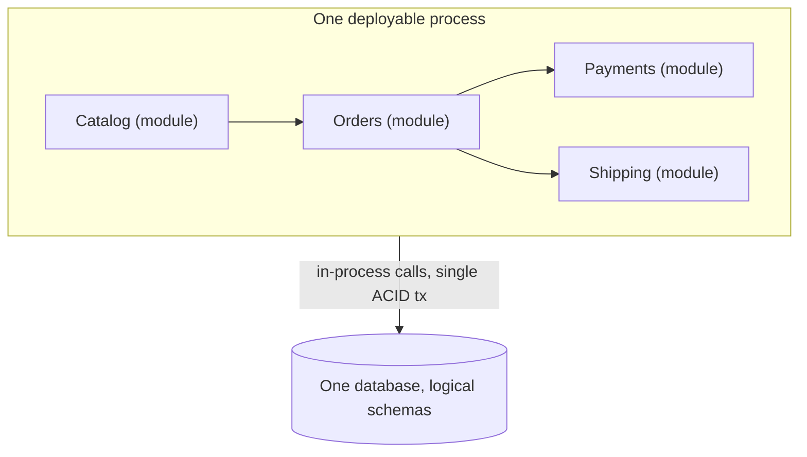
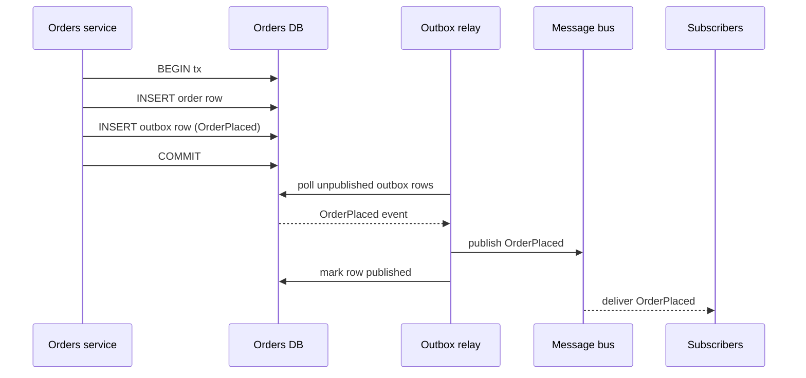
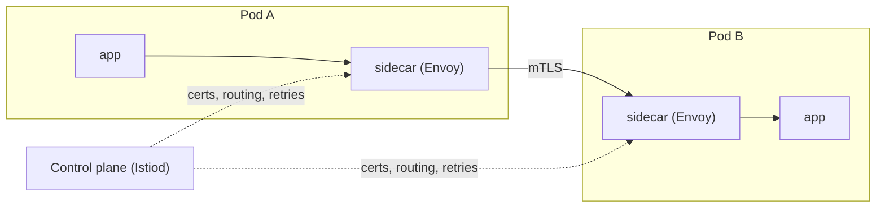
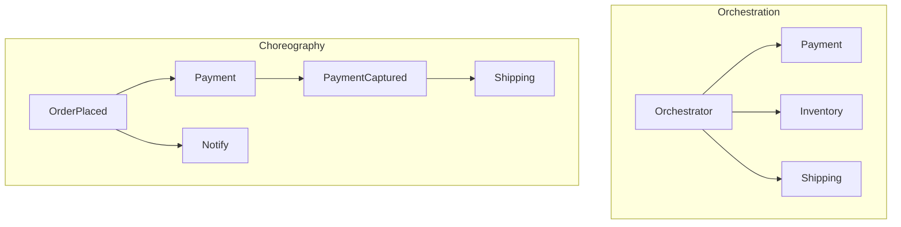
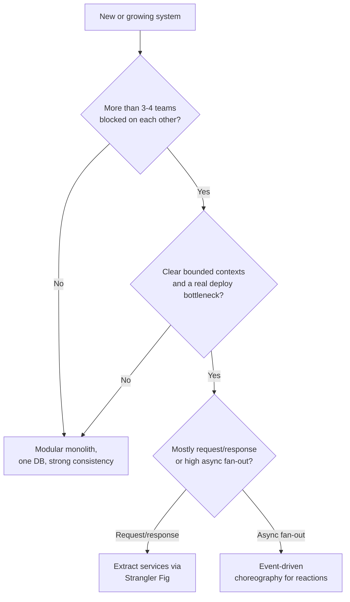

# Architectural Styles: Monolith → Microservices → Event-Driven

> Where this fits: this is the chapter that decides the *shape* of your system before a single line of business logic gets written — how many deployable units, where the data lives, and how the pieces talk. It sits downstream of [API Design](./17-api-design.md) and upstream of every case study in this curriculum.
>
> **Principal-level takeaway:** Architecture is a function of your *team* and your *constraints*, not your ambitions. The right default for almost everyone is a well-modularized monolith; microservices and event-driven designs buy you independent deployability and scaling at the price of a permanent distributed-systems tax. Pay that tax only when the organizational pain of *not* paying it is concrete and present — never because a conference talk said to.

---

## ⚡ 60-Second TL;DR

- **Architecture = drawing boundaries to localize the cost of change**; it tracks your *team*, not your ambitions.
- **Modular monolith** = the right default (one deploy, one DB, ACID, cheap-to-move boundaries); **microservices** buy independent deploy/scaling at a permanent **distributed-systems tax**; **EDA** trades max decoupling for hardest debugging.
- Cut services along **DDD bounded contexts** (data + language that change together), never by technical layer; **start coarse** — merging is harder than splitting.
- **#1 failure: the distributed monolith** — services that share a DB or must deploy together. All cost, no benefit.
- Rules of thumb: justify microservices past **~3-4 teams** blocked on each other; **10 services @ 99.9% ≈ 99%** (worse than one); mesh only past **~15-20 services**; **CQRS ≠ event sourcing ≠ microservices** (orthogonal).

**Remember one thing:** A boundary in the wrong place is far worse than no boundary at all — default to the monolith and pay the distribution tax only when the coordination pain is concrete and present.

## The Mental Model — first principles: why does this thing exist?

Strip away the vocabulary and there are only two questions any architecture answers:

1. **How is the system divided into units that can be built, deployed, and reasoned about independently?**
2. **How do those units coordinate — through shared memory, synchronous calls, or asynchronous messages?**

Everything else — "microservices," "event-driven," "CQRS" — is a named point in the space those two questions define.

The reason architectural styles exist at all is that **two different things grow at different rates**: the *code* and the *organization*. A single codebase that one person can hold in their head is the cheapest possible thing to change. The moment you have 5 teams of 8 engineers all committing to that codebase, the bottleneck stops being CPU and starts being *coordination*: merge conflicts, shared release trains, "we can't deploy because team X's feature isn't ready," one team's memory leak taking down everyone.

So architecture is fundamentally about **drawing boundaries to localize the cost of change**. A boundary is valuable when a change on one side rarely forces a change on the other. A boundary is *expensive* when it sits in the wrong place — because now a single business change requires coordinated edits across multiple deployable units, multiple databases, and multiple on-call rotations. That single sentence is 80% of the judgment in this chapter: **a boundary in the wrong place is far worse than no boundary at all.**

The progression in the title is not a maturity ladder you should climb. It is a sequence of *increasing decoupling at increasing cost*. You move along it only when the coordination pain justifies the operational pain you're trading it for.

---

## Core Concepts

### The Modular Monolith — the right default, and why

A **monolith** is a single deployable unit: one process (or one horizontally-replicated set of identical processes) behind a load balancer, talking to one database. The word has acquired a stink it doesn't deserve. The thing people actually hate is a **big ball of mud** — a monolith with *no internal structure*, where the billing code imports the rendering code which queries the auth tables directly.

A **modular monolith** is the cure, and it keeps almost all the benefits of microservices without the cost. You enforce internal module boundaries *in code*: separate packages/modules with explicit public interfaces, no reaching across into another module's tables, ideally compile-time or lint-time enforcement of the dependency graph.



Why this is the right default:

- **A function call is not a network call.** In-process calls are nanoseconds, never partially fail, and join in a single ACID transaction. You get [strong consistency](../02-distributed-systems/12-consistency-and-cap.md) for free. The moment you split that call across the network you inherit latency, partial failure, retries, idempotency, and the impossibility of a cross-service transaction (see [Distributed Transactions & Sagas](../02-distributed-systems/15-distributed-transactions.md)).
- **Refactoring boundaries is cheap.** You discovered the boundary between Orders and Payments was wrong? In a monolith that's an afternoon of moving code. Across services it's a multi-quarter migration with API versioning and dual writes. Since *you will get the boundaries wrong the first time*, keeping them cheap to move is enormously valuable — this is the core argument of [Evolutionary Architecture](../05-principal-skills/30-evolutionary-architecture.md).
- **One thing to deploy, monitor, and debug.** A single stack trace spans the whole request. No distributed tracing required to answer "why was this request slow."

Shopify (a Rails monolith serving a meaningful fraction of global e-commerce), GitHub, and Stack Overflow are the standard counter-hype examples: enormous scale, deliberately *not* microservices. Shopify's published work on "componentization" is essentially a modular-monolith playbook.

### Microservices — what you actually buy, and what it costs

A **microservice architecture** splits the system into independently deployable services, each owned by one team, each typically with its own database. The benefits are real and specific:

- **Independent deployability.** Team A ships 10x/day without coordinating with Team B. This is the *single most important benefit* and the only one that justifies the cost for most companies.
- **Independent scaling.** The image-resize service runs on 200 CPU-heavy nodes; the user-profile service runs on 4. You scale the bottleneck, not the whole monolith.
- **Fault isolation.** A memory leak in `recommendations` doesn't OOM `checkout` — *if* you've built bulkheads and timeouts (see [Reliability](../02-distributed-systems/16-reliability-and-failure.md)). Without those, microservices fail *together* and you've just made an outage harder to debug.
- **Independent technology choices.** The ML team uses Python; the payments team uses Rust. Useful, frequently overrated, and a real source of operational sprawl.

Now the bill. The **distributed-systems tax** is paid on *every single call that crosses a service boundary*, forever:

| Tax item | What it means in practice |
|---|---|
| Network latency | A 50 ns in-process call becomes a 0.5–5 ms network round trip. A request fanning out to 10 services serially is now tens of ms of pure overhead. |
| Partial failure | The callee can be up, down, slow, or *lying* (returning success after timing out on your end). You must handle all four. |
| No distributed transactions | You cannot `BEGIN; update orders; update inventory; COMMIT;` across two services. You need [sagas](../02-distributed-systems/15-distributed-transactions.md), idempotency keys, and compensating actions. |
| Data integration | Data you used to `JOIN` now lives in two databases. You replicate it, call for it, or denormalize it — all eventually consistent. |
| Operational overhead | N services = N pipelines, N dashboards, N on-call rotations, N sets of secrets, service discovery, and the need for [distributed tracing](./19-observability.md) just to read one request. |
| Versioning & contracts | Independent deploys mean a caller and callee run different versions simultaneously. Every API change must be backward-compatible. |

The honest summary: **microservices trade a code-complexity problem you understand for an operational-and-distributed-systems problem that is strictly harder.** You do it when the *organizational* benefit (independent deployment by many teams) outweighs that, which is generally past ~3–4 teams stepping on each other in one repo.

### Service Boundaries via DDD Bounded Contexts

The make-or-break question is *where to cut*. The wrong instinct is to cut by technical layer (a "database service," a "business-logic service") — this maximizes the number of network hops per request because every feature touches every layer.

The right tool is **Domain-Driven Design's bounded context**: a boundary inside which a model and its language are internally consistent. The classic example: the word "Customer" means different things to Sales (a lead with a pipeline stage), to Billing (an account with a payment method), and to Support (a person with a ticket history). Each is a *bounded context*. A good service boundary follows a bounded context, because changes to the "billing customer" model rarely require changes to the "support customer" model — which is exactly the "localize the cost of change" property we want.

Heuristics that actually work:
- Cut where the **data changes together** and the **language is consistent** — a transaction boundary is a strong hint a context boundary lives nearby, not across.
- Cut along **rate-of-change** seams: code that changes for the same business reasons belongs together.
- **Start coarse.** Two large services you can split later beat fifteen nano-services you have to merge. Merging services is far more painful than splitting them.

### Database-per-Service and the Data Integration Problem

The defining rule of microservices is **database-per-service**: no service touches another's database directly. Without this rule you don't have microservices — you have a distributed monolith sharing a database, which is the worst of both worlds (network calls *and* shared-schema coupling).

But this rule immediately creates the **data integration problem**. The Orders service needs product names and prices that live in Catalog. Your options:

| Approach | Mechanism | Cost |
|---|---|---|
| Synchronous query | Orders calls Catalog at request time | Latency + Catalog becomes a hard dependency; if it's down, orders fail |
| Replication / data pump | Catalog pushes a read-only copy of needed fields into Orders' store | Eventual consistency; storage duplication; the copy can be stale |
| Event-carried state transfer | Catalog emits `ProductUpdated` events; Orders maintains a local materialized view | Eventual consistency; event versioning; but resilient — Orders works even if Catalog is down |

There is no option that gives you the consistency of a `JOIN`. This is the single most underestimated cost of microservices. The standard technique for keeping two stores in sync atomically with the work that produced the change is the **transactional outbox** (write the business row and an outbox row in one local transaction; a relay publishes the outbox to the message bus) — covered in [Distributed Transactions](../02-distributed-systems/15-distributed-transactions.md), and the reason [Change Data Capture](../01-building-blocks/11-messaging-and-streaming.md) exists.

The trick is that the business write and the event are committed in **one local ACID transaction**, so they cannot diverge. Publishing to the bus is a *separate* step done by a relay reading the committed outbox — which is why delivery is at-least-once and consumers must be idempotent.



**Transactional outbox: write side (business row + event in one tx).** The atomic part is the two inserts under a single transaction; if the publish later fails, the relay simply retries from the still-committed outbox row.

```go
package outbox

import (
	"context"
	"database/sql"
	"encoding/json"
)

type Order struct {
	ID     string
	UserID string
	Total  int64 // cents
}

// PlaceOrder writes the order and an OrderPlaced event atomically.
func PlaceOrder(ctx context.Context, db *sql.DB, o Order) error {
	tx, err := db.BeginTx(ctx, nil)
	if err != nil {
		return err
	}
	defer tx.Rollback() // no-op after a successful Commit

	if _, err = tx.ExecContext(ctx,
		`INSERT INTO orders (id, user_id, total) VALUES ($1, $2, $3)`,
		o.ID, o.UserID, o.Total); err != nil {
		return err
	}

	payload, err := json.Marshal(o)
	if err != nil {
		return err
	}
	if _, err = tx.ExecContext(ctx,
		`INSERT INTO outbox (aggregate_id, event_type, payload, published)
		 VALUES ($1, $2, $3, false)`,
		o.ID, "OrderPlaced", payload); err != nil {
		return err
	}

	return tx.Commit() // both rows commit together, or neither does
}
```

```java
package outbox;

import com.fasterxml.jackson.databind.ObjectMapper;
import java.sql.Connection;
import java.sql.PreparedStatement;
import javax.sql.DataSource;

public class OrderWriter {
    private final DataSource dataSource;
    private final ObjectMapper mapper = new ObjectMapper();

    public OrderWriter(DataSource dataSource) {
        this.dataSource = dataSource;
    }

    public record Order(String id, String userId, long total) {}

    /** Writes the order and an OrderPlaced event in one transaction. */
    public void placeOrder(Order order) throws Exception {
        try (Connection conn = dataSource.getConnection()) {
            conn.setAutoCommit(false);
            try {
                try (PreparedStatement ps = conn.prepareStatement(
                        "INSERT INTO orders (id, user_id, total) VALUES (?, ?, ?)")) {
                    ps.setString(1, order.id());
                    ps.setString(2, order.userId());
                    ps.setLong(3, order.total());
                    ps.executeUpdate();
                }
                String payload = mapper.writeValueAsString(order);
                try (PreparedStatement ps = conn.prepareStatement(
                        "INSERT INTO outbox (aggregate_id, event_type, payload, published) "
                                + "VALUES (?, ?, ?::jsonb, false)")) {
                    ps.setString(1, order.id());
                    ps.setString(2, "OrderPlaced");
                    ps.setString(3, payload);
                    ps.executeUpdate();
                }
                conn.commit(); // both rows commit together, or neither does
            } catch (Exception e) {
                conn.rollback();
                throw e;
            }
        }
    }
}
```

**Transactional outbox: relay side (publish committed rows, then mark them done).** The relay is the only place that touches the bus; it runs continuously, claims unpublished rows, publishes, and marks them — giving at-least-once delivery.

```go
package outbox

import (
	"context"
	"database/sql"
	"time"
)

// Publisher abstracts the message bus (Kafka, SQS, etc.).
type Publisher interface {
	Publish(ctx context.Context, eventType string, payload []byte) error
}

// RunRelay polls the outbox and publishes until ctx is cancelled.
func RunRelay(ctx context.Context, db *sql.DB, pub Publisher) error {
	ticker := time.NewTicker(500 * time.Millisecond)
	defer ticker.Stop()
	for {
		select {
		case <-ctx.Done():
			return ctx.Err()
		case <-ticker.C:
			if err := drainBatch(ctx, db, pub); err != nil {
				// log and continue; the rows stay unpublished and retry next tick
				continue
			}
		}
	}
}

func drainBatch(ctx context.Context, db *sql.DB, pub Publisher) error {
	rows, err := db.QueryContext(ctx,
		`SELECT id, event_type, payload FROM outbox
		 WHERE NOT published ORDER BY id LIMIT 100`)
	if err != nil {
		return err
	}
	defer rows.Close()

	type item struct {
		id        int64
		eventType string
		payload   []byte
	}
	var batch []item
	for rows.Next() {
		var it item
		if err := rows.Scan(&it.id, &it.eventType, &it.payload); err != nil {
			return err
		}
		batch = append(batch, it)
	}
	if err := rows.Err(); err != nil {
		return err
	}

	for _, it := range batch {
		if err := pub.Publish(ctx, it.eventType, it.payload); err != nil {
			return err // stop; unpublished rows are retried next tick
		}
		if _, err := db.ExecContext(ctx,
			`UPDATE outbox SET published = true WHERE id = $1`, it.id); err != nil {
			return err
		}
	}
	return nil
}
```

```java
package outbox;

import java.sql.Connection;
import java.sql.PreparedStatement;
import java.sql.ResultSet;
import java.util.ArrayList;
import java.util.List;
import java.util.concurrent.Executors;
import java.util.concurrent.ScheduledExecutorService;
import java.util.concurrent.TimeUnit;
import javax.sql.DataSource;

public class OutboxRelay {
    public interface Publisher {
        void publish(String eventType, String payload) throws Exception;
    }

    private final DataSource dataSource;
    private final Publisher publisher;
    private final ScheduledExecutorService scheduler =
            Executors.newSingleThreadScheduledExecutor();

    public OutboxRelay(DataSource dataSource, Publisher publisher) {
        this.dataSource = dataSource;
        this.publisher = publisher;
    }

    public void start() {
        scheduler.scheduleWithFixedDelay(
                this::drainBatchQuietly, 0, 500, TimeUnit.MILLISECONDS);
    }

    public void stop() {
        scheduler.shutdownNow();
    }

    private void drainBatchQuietly() {
        try {
            drainBatch();
        } catch (Exception e) {
            // log and continue; unpublished rows retry on the next run
        }
    }

    private record Item(long id, String eventType, String payload) {}

    private void drainBatch() throws Exception {
        List<Item> batch = new ArrayList<>();
        try (Connection conn = dataSource.getConnection();
             PreparedStatement ps = conn.prepareStatement(
                     "SELECT id, event_type, payload FROM outbox "
                             + "WHERE NOT published ORDER BY id LIMIT 100");
             ResultSet rs = ps.executeQuery()) {
            while (rs.next()) {
                batch.add(new Item(rs.getLong(1), rs.getString(2), rs.getString(3)));
            }
        }

        try (Connection conn = dataSource.getConnection();
             PreparedStatement upd = conn.prepareStatement(
                     "UPDATE outbox SET published = true WHERE id = ?")) {
            for (Item it : batch) {
                publisher.publish(it.eventType(), it.payload()); // at-least-once
                upd.setLong(1, it.id());
                upd.executeUpdate();
            }
        }
    }
}
```

### API Gateway and BFF

Once you have many services, you don't want clients knowing about all of them. An **API gateway** is a single entry point that handles cross-cutting concerns: TLS termination, authn/authz, rate limiting, routing, and request aggregation. It keeps clients decoupled from your internal topology — you can split a service behind the gateway without clients noticing.

A **Backend-for-Frontend (BFF)** is a specialization: one gateway *per client type*. The mobile app and the web app have different needs — mobile wants fewer, fatter, bandwidth-efficient responses; web can tolerate chattier calls. Rather than one bloated general-purpose API trying to serve both (and being optimal for neither), you build a thin mobile-BFF and a web-BFF, each owned by the team that owns that client. Netflix popularized the pattern precisely because device diversity (TVs, phones, browsers) made one-size-fits-all APIs untenable. The trap: a BFF that accretes business logic becomes a mini-monolith and a deployment bottleneck. Keep it to aggregation and shaping.

### Service Mesh — sidecars, mTLS, traffic policy

As service count grows, every team re-implements the same plumbing: retries, timeouts, circuit breakers, mTLS, load balancing, and telemetry. A **service mesh** (Istio, Linkerd, Consul) factors that out into a **sidecar proxy** deployed next to each service instance — Istio and Consul use Envoy; Linkerd ships its own purpose-built Rust micro-proxy (`linkerd2-proxy`), which is why its per-hop overhead is markedly lower. Application traffic flows through the sidecar, which enforces policy. (The newer *sidecar-less* / ambient-mesh modes move some of this to a per-node proxy to cut per-pod cost, but the model below is the one to understand first.)



What it buys:
- **mTLS everywhere** — every service-to-service call is mutually authenticated and encrypted, configured centrally instead of in each app (see [Security](./20-security.md)).
- **Traffic policy as config** — canary rollouts ("5% to v2"), retries, timeouts, circuit breaking, fault injection — without touching application code.
- **Uniform telemetry** — the mesh emits consistent metrics and trace spans for every hop.

The honest cost: a sidecar adds a network hop (extra ~0.5–1 ms p50 latency and CPU/memory per pod), the control plane is one more complex distributed system you operate, and the failure modes are subtle (a misconfigured mesh can blackhole traffic for the whole cluster). **A service mesh is over-engineering below ~15–20 services.** Below that, libraries and a gateway are simpler.

### Event-Driven Architecture and Choreography

Everything above is mostly *synchronous request/response*. An **event-driven architecture (EDA)** inverts the dependency: services emit **events** ("OrderPlaced," "PaymentCaptured") to a [log or broker](../01-building-blocks/11-messaging-and-streaming.md), and interested services react. The producer does not know who consumes — it just states *what happened*.

This is the deepest form of decoupling, and the distinction that matters is **orchestration vs. choreography**:

- **Orchestration**: a central coordinator tells each service what to do (`Order service → call Payment → call Inventory → call Shipping`). Easy to follow, easy to see the whole flow, but the orchestrator becomes a coupling point and a single thing that knows everything.
- **Choreography**: each service reacts to events and emits its own, with no central brain. Payment hears `OrderPlaced`, does its thing, emits `PaymentCaptured`; Shipping hears *that* and reacts. Maximally decoupled, **but no single place describes the end-to-end flow** — the business process is emergent, smeared across N services and the broker.



In orchestration one component knows the whole flow; in choreography no component does — each only knows the event it reacts to and the event it emits.

The trade is real: choreography minimizes coupling but maximizes the difficulty of *understanding and debugging* the system. "What happens when an order is placed?" has a one-paragraph answer in an orchestrator and a "go read 6 services and the broker config" answer in pure choreography. Principals usually land on **orchestration for business-critical transactional flows** (you want a clear, auditable saga) and **choreography for fan-out reactions** (analytics, notifications, search indexing) where loose coupling pays off.

### CQRS and Event Sourcing

These two are frequently bundled and frequently misapplied.

**CQRS (Command Query Responsibility Segregation)** splits the model you write through from the model(s) you read through. The premise: writes care about invariants and normalization; reads care about denormalized, query-shaped data. When those genuinely diverge — e.g., a write model that's a normalized ledger and 5 read models for different dashboards — CQRS lets each be optimal. You write to the command side, and the query side is updated (often asynchronously, often via events) into read-optimized stores.

**Event Sourcing** stores state as an *append-only log of events* rather than current state. Instead of a row `balance = 100`, you store `Deposited(100), Withdrew(30), Deposited(30)` and *derive* `balance = 100` by replaying. The log is the source of truth; current state is a projection.

The benefits are genuine: a perfect, immutable audit trail (you know not just the current balance but every event that produced it — invaluable for [payments and ledgers](../04-design-case-studies/27-payments-and-ledgers.md)), time-travel debugging, and the ability to build *new* read models retroactively by replaying history. This is why double-entry accounting systems are natural event-sourcing fits.

The costs are brutal and routinely underestimated:

- **Eventual consistency is baked in.** Write something, read it back, and your read model may not reflect it yet. Your UI and your users must tolerate read-your-own-writes lag, or you bolt on workarounds.
- **Event versioning is forever.** You stored `OrderPlaced v1` events two years ago. Today the schema changed. Those old events *still exist and must still replay correctly.* You now maintain upcasters/transformers for every historical schema version, indefinitely. This is the killer maintenance burden.
- **Replay is operationally heavy.** Rebuilding a projection from millions of events takes real time; you need snapshots to make it tractable, and snapshots add their own versioning problem.
- **It infects everything.** Deletes (GDPR "right to be forgotten" vs. an immutable log), debugging, and onboarding all get harder.

**The myth to kill: CQRS does not require event sourcing, and neither requires microservices.** They're orthogonal. You can do CQRS with two tables in one Postgres. The principal move is to adopt the *cheapest* version that solves your problem and stop there.

### The Strangler Fig Migration

You rarely build microservices greenfield; you extract them from a monolith. The **Strangler Fig pattern** (named by Martin Fowler after the vine that grows around a tree and gradually replaces it) is how you do it safely. You put a routing layer (the gateway) in front of the monolith, then peel off one bounded context at a time: route those requests to the new service, leave everything else hitting the monolith, repeat. The old system shrinks until it's gone — *or until you stop, having extracted only the contexts that needed it.* That "stop early" option is a feature: not every part needs to leave the monolith.

The alternative — the **big-bang rewrite** — is the most reliably disastrous decision in software. It freezes feature development for quarters, races a moving target, and very often gets cancelled. Strangler Fig delivers value incrementally and is reversible at every step.

### Conway's Law and Team Topology

> "Any organization that designs a system ... will produce a design whose structure is a copy of the organization's communication structure." — Melvin Conway, *How Do Committees Invent?* (written 1967, published in *Datamation*, 1968)

This is not a curiosity; it is the master constraint. If you have four teams, you will *get* a four-ish-service architecture whether you plan one or not, because the seams in the org become the seams in the system. The corollary, **the Inverse Conway Maneuver**, is the principal's lever: *design the team structure to produce the architecture you want.* Want loosely-coupled services? Build small, autonomous, full-stack teams each owning one bounded context end to end (the "stream-aligned teams" of *Team Topologies*). Want a monolith? A single team can own one.

The deepest mistake juniors make is treating architecture as a purely technical decision. **A microservice boundary that doesn't match a team boundary will fail** — two teams forced to coordinate on every change to one "shared" service get all the distributed-systems cost and none of the independent-deployability benefit. Boundaries are sociotechnical first, technical second.

---

## Trade-offs at a Glance

| Dimension | Modular Monolith | Microservices | Event-Driven / EDA |
|---|---|---|---|
| Deploy unit | One | Many, independent | Many + broker |
| Coupling | Compile-time, explicit | Runtime via API contracts | Loosest (via events) |
| Consistency | Strong (ACID) within process | Eventual across services | Eventual by design |
| Cross-cutting transaction | Native | Sagas / outbox | Sagas / choreography |
| Latency | Lowest (in-process) | + network per hop | + broker + async |
| Failure mode | All-or-nothing | Partial; needs bulkheads | Decoupled; lag/backpressure |
| Operational cost | Low | High (N pipelines, mesh, tracing) | High + broker ops |
| Refactor boundaries | Cheap | Expensive (versioned migration) | Expensive |
| Independent team velocity | Limited by shared repo | High | High |
| Debuggability | Single stack trace | Needs distributed tracing | Hardest (emergent flows) |
| **Best when** | <~3–4 teams; uncertain domain; default | Many teams; clear contexts; deploy bottleneck is real | High fan-out, async reactions, audit needs |

The same judgment as a decision tree — note that every branch defaults *back* to the monolith unless a concrete, present constraint pushes you off it:



---

## How Real Systems Do It

- **Shopify** runs a famously large Rails *monolith* (componentized into modules with enforced boundaries) serving millions of merchants. Deliberate counter-hype: at huge scale, they chose modularity over distribution.
- **Amazon** is the canonical microservices story — the early-2000s "two-pizza teams" mandate (every team owns a service, every service exposed via API, no direct DB sharing) is the *organizational* origin of microservices. Note the order: the team structure came first; the architecture followed (Conway's Law as strategy).
- **Netflix** runs hundreds of microservices on the JVM, pioneered client-resilience libraries (Hystrix for circuit breaking), device-specific edge APIs that inspired the BFF pattern, and chaos engineering (Chaos Monkey) — because at that service count, *partial failure is the normal operating condition*, not an exception.
- **Uber** went from monolith to ~2,200 microservices and publicly documented the over-fragmentation backlash, later consolidating toward coarser "domain-oriented microservices" — a real-world example of cutting boundaries too fine and paying to merge.
- **Kafka**-centric shops (LinkedIn, where Kafka was born) treat the **event log as the central nervous system** — services communicate by producing/consuming from durable topics, the substrate for both EDA and event sourcing. See [Messaging & Streaming](../01-building-blocks/11-messaging-and-streaming.md).
- **DynamoDB** vs. **Postgres** as a per-service store illustrates the data-integration tax concretely: a single Postgres lets you `JOIN` across domains in one query; once Orders is on Postgres and Catalog is on DynamoDB, that join becomes application-level event-carried state transfer.

---

## Failure Modes & Common Misconceptions

**The distributed monolith.** The most common microservices failure: services split at the code level but still sharing a database, or so chatty and tightly versioned that you must deploy them together. You've paid every cost and earned no benefit. *Tell-tale sign: you cannot deploy service A without also deploying service B.*

**Myth: "Microservices scale better."** A stateless monolith scales horizontally behind a load balancer just fine — you run more identical copies. Microservices let you scale *services independently*, which saves money when their load profiles differ wildly, but the monolith was never the scaling bottleneck for most teams. The database usually is, and splitting services doesn't fix that.

**Myth: "Microservices are more reliable."** Only with disciplined timeouts, retries with jitter, circuit breakers, and bulkheads. Naively, a request that fans out to 10 services each with 99.9% availability has ~99% availability — *worse than any single service*. Distribution multiplies failure surface; reliability is something you *engineer back in*, not a freebie. (See [Reliability](../02-distributed-systems/16-reliability-and-failure.md).)

**Myth: "Start with microservices so you don't have to migrate later."** This optimizes for a scaling problem you don't have yet while taking on operational cost and *locking in boundaries you haven't validated*. You're guaranteed to draw boundaries wrong early (you don't understand the domain yet), and they're 10x more expensive to move once distributed. Monolith-first is the safer bet for nearly all greenfield work.

**Myth: "Event sourcing gives you a free audit log, so use it everywhere."** The audit log is real; the cost — eventual consistency on every read, perpetual event versioning, replay tooling, snapshotting — is also real and permanent. Reserve it for domains where the *history* is itself the product (ledgers, compliance), not for a generic CRUD service.

**Eventual-consistency surprises.** Teams add a read replica or an async read model and are shocked when users "save and don't see their change." This isn't a bug; it's the consistency model they chose. Either provide read-your-own-writes (route the user's reads to the primary briefly) or design the UX to tolerate lag.

---

## In a Design Discussion

When someone whiteboards "we'll use microservices," the junior and the principal diverge immediately.

**Junior take:** "We'll build it as microservices — auth service, user service, order service, payment service, notification service — communicating over REST, so it scales and each piece is independent." (Reaches for the architecture as a default; counts services as a virtue; says "scales" without a number; has drawn boundaries before understanding the domain.)

**Principal take:** "How many teams will own this in year one — one, or five? What's the actual pain we're solving — is a team *currently* blocked on someone else's deploy, or are we anticipating? Let's start as a modular monolith with hard internal boundaries along bounded contexts, one Postgres, strong consistency. We'll instrument it. The *first* thing we extract — if anything — is the part with a genuinely different scaling profile or a team that needs to deploy independently, and we'll do it via Strangler Fig so it's reversible. We are not paying the distributed-systems tax until the coordination pain is concrete." (Anchors on team and constraints, demands evidence, defaults to the cheap-to-change option, treats distribution as a cost to justify.)

The principal's questions, in order:
1. **How many teams, and are they blocked on each other today?** (Conway's Law / the real driver.)
2. **What's the consistency requirement?** If the core flow needs cross-entity transactions, that's a strong vote for keeping it in one service/DB.
3. **What's the *actual* scaling bottleneck?** Usually the database, not the app tier — distribution may not even address it.
4. **Can we afford the operational surface?** N services need N pipelines, tracing, and on-call. Do we have the platform maturity?
5. **What's the cheapest reversible step?** Modular monolith now, extract later, beats distribute-everything now.

Capture the decision and its trade-offs in an [ADR](../05-principal-skills/29-tradeoffs-and-adrs.md) — "we chose a modular monolith because we have one team and need strong consistency; we will revisit when we cross three teams" is a far stronger artifact than a diagram of boxes.

---

## Self-Check

<details>
<summary>1. Why is a modular monolith usually a better starting point than microservices, even if you expect to grow?</summary>

Because you'll draw service boundaries wrong before you understand the domain, and boundaries are cheap to move inside a monolith (an afternoon) but expensive across services (a versioned, dual-write migration). You also get strong consistency and one thing to operate for free. Extract services later, once a *concrete* organizational or scaling pain justifies the distributed-systems tax — via Strangler Fig.
</details>

<details>
<summary>2. What is the "distributed-systems tax," and on what is it levied?</summary>

The unavoidable costs incurred on *every call that crosses a service boundary*: network latency, partial failure, loss of cross-service transactions (needing sagas/idempotency), data integration (no joins), and operational overhead (per-service pipelines, tracing, on-call). It's a permanent recurring cost, not a one-time setup.
</details>

<details>
<summary>3. What's the difference between a microservice architecture and a "distributed monolith," and how do you spot the latter?</summary>

A distributed monolith has the network costs of microservices but retains tight coupling — shared database or contracts so rigid you must deploy services together. Tell-tale sign: you cannot deploy service A without also deploying service B. It's the worst of both worlds.
</details>

<details>
<summary>4. Why do bounded contexts (DDD) make better service boundaries than technical layers?</summary>

A bounded context groups data and language that change together for the same business reasons, so a change rarely crosses the boundary — localizing the cost of change. Cutting by technical layer (a "data service," a "logic service") forces every feature to traverse every layer, maximizing network hops and coupling.
</details>

<details>
<summary>5. Does CQRS require event sourcing? Does either require microservices?</summary>

No to both. They're orthogonal. CQRS (separate read/write models) can be done with two tables in one database; event sourcing (state as an append-only event log) is a storage choice; microservices are a deployment topology. Adopt the cheapest combination that solves your actual problem.
</details>

<details>
<summary>6. Name two genuine benefits of event sourcing and two costs that are routinely underestimated.</summary>

Benefits: a perfect immutable audit trail, and the ability to build new read models retroactively by replaying history (great for ledgers/compliance). Underestimated costs: permanent event-schema versioning (old events must replay forever, requiring upcasters) and baked-in eventual consistency plus heavy replay/snapshot tooling.
</details>

<details>
<summary>7. Why might 10 microservices at 99.9% availability each be *less* reliable than one monolith?</summary>

A request fanning out to 10 services serially has roughly 0.999^10 ≈ 99% availability — worse than any single component — because distribution multiplies the failure surface. Reliability must be engineered back in with timeouts, retries-with-jitter, circuit breakers, and bulkheads; it is not a free benefit of splitting.
</details>

<details>
<summary>8. What does Conway's Law imply for the *order* in which you decide team structure and architecture?</summary>

Systems mirror the communication structure of the org that builds them, so the team structure effectively *determines* the architecture. The principal move (Inverse Conway Maneuver) is to design teams to produce the architecture you want — and to ensure every service boundary matches a team boundary, or it will fail.
</details>

---

## Go Deeper

- **Designing Data-Intensive Applications (Kleppmann)** — Ch. 11 (Stream Processing) and Ch. 12 (The Future of Data Systems) for the event-log-as-source-of-truth view that underpins EDA and event sourcing; Ch. 9 for the consistency guarantees you give up when you distribute.
- **Building Microservices, 2nd ed. (Sam Newman)** — the definitive practical treatment of boundaries, data, and the costs; pairs with his *Monolith to Microservices* for Strangler Fig.
- **Domain-Driven Design (Eric Evans)** and **Implementing DDD (Vaughn Vernon)** — bounded contexts and context mapping.
- **Team Topologies (Skelton & Pais)** — stream-aligned teams, the Inverse Conway Maneuver; the sociotechnical half of this chapter.
- **Martin Fowler's bliki** — "MonolithFirst," "StranglerFigApplication," "CQRS," and "Microservice Premium" essays; short, sharp, and exactly on this topic.
- Conway, M., *"How Do Committees Invent?"* — the original Conway's Law paper (written 1967, published in *Datamation*, April 1968).
- Sibling writeups: [API Design](./17-api-design.md), [Distributed Transactions & Sagas](../02-distributed-systems/15-distributed-transactions.md), [Messaging & Streaming](../01-building-blocks/11-messaging-and-streaming.md), [Consistency, CAP & PACELC](../02-distributed-systems/12-consistency-and-cap.md), [Reliability](../02-distributed-systems/16-reliability-and-failure.md), [Evolutionary Architecture](../05-principal-skills/30-evolutionary-architecture.md), [Trade-offs & ADRs](../05-principal-skills/29-tradeoffs-and-adrs.md). Back to the [root index](../README.md) and the [roadmap](../ROADMAP.md).
