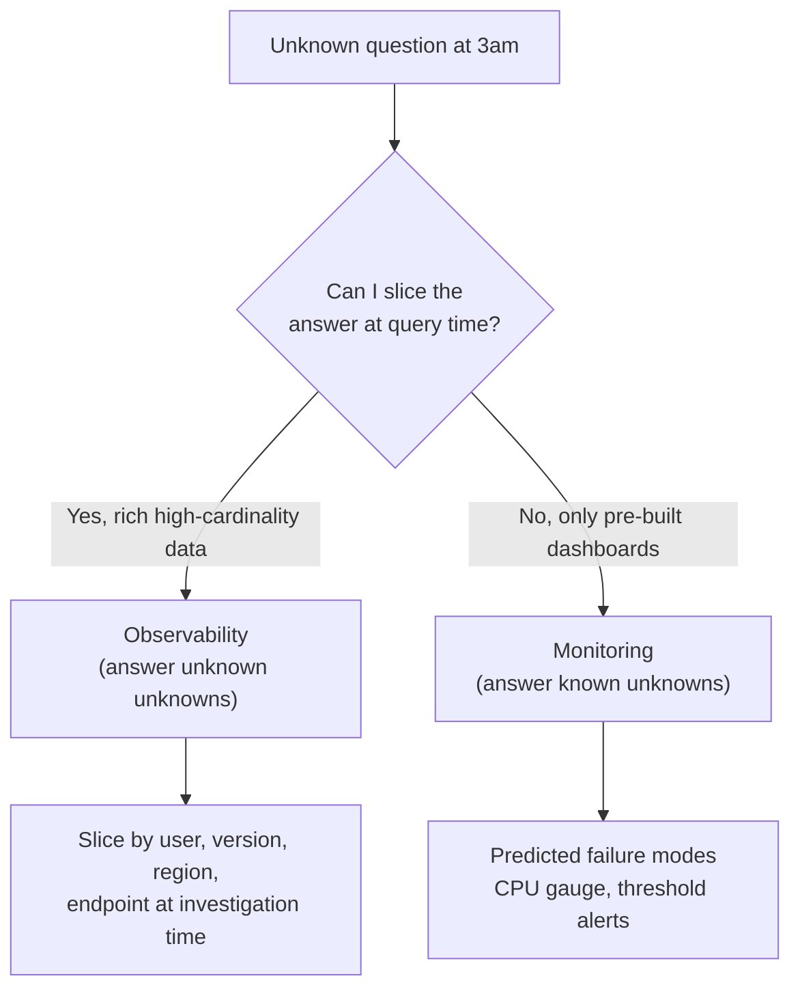
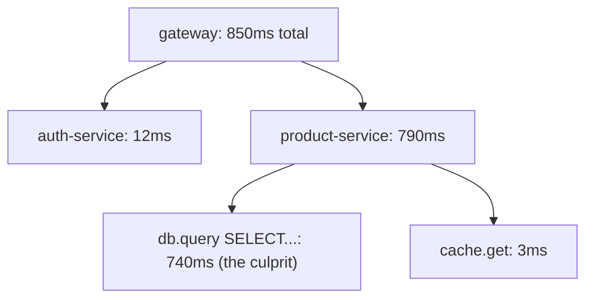
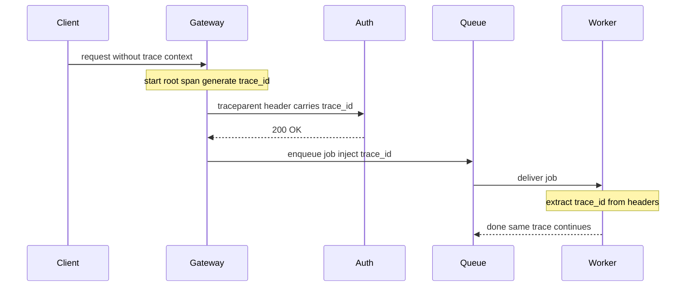
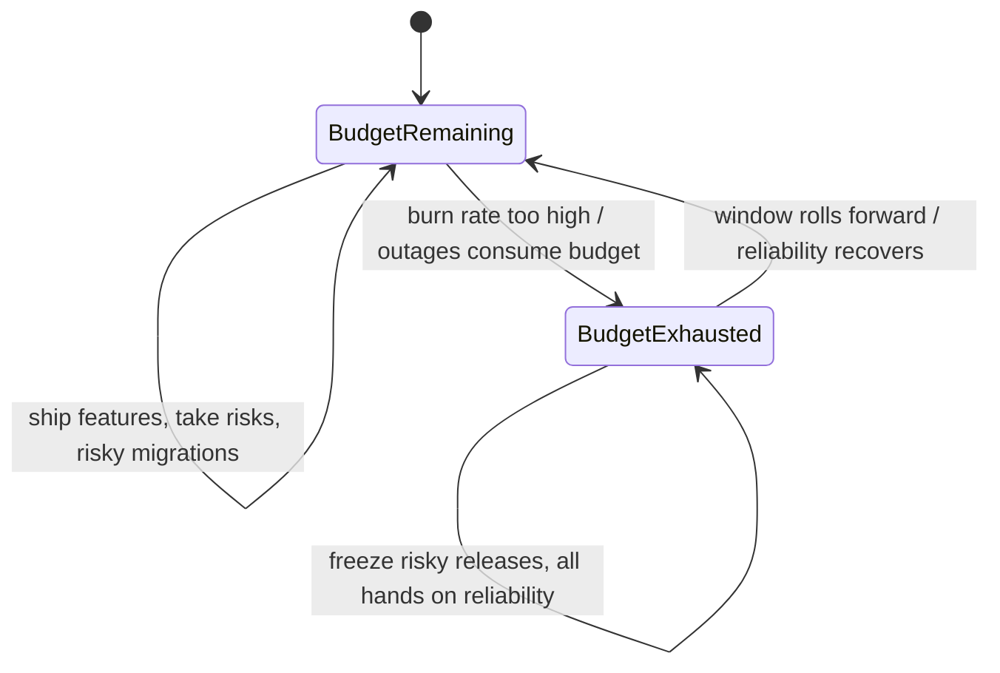
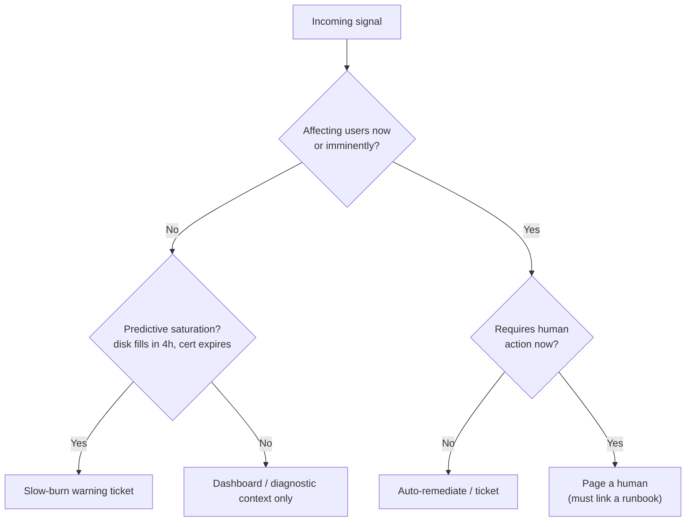

# Observability: Metrics, Logs, Traces & SLOs

> Where this fits: the layer that tells you what your system is *actually doing* in production — the difference between operating a system and praying at it. Sits on top of everything you've built ([reliability](../02-distributed-systems/16-reliability-and-failure.md), [microservices](../03-architecture-and-apis/18-architectural-styles.md), [databases](../01-building-blocks/07-databases-relational.md)) and underneath every on-call decision.
>
> **Principal-level takeaway:** Observability is not "add Datadog." It is a design constraint you bake in from day one, and SLOs are the contract that turns "is it working?" from a heated opinion into a number with a budget attached. The hardest part is not collecting data — it's collecting the *right* data cheaply enough that you can afford to keep it.

## The Mental Model — first principles: why does this thing exist, what problem does it solve?

A program on your laptop is observable for free: you read the source, attach a debugger, set a breakpoint, inspect every variable. A distributed system in production destroys all three of those affordances at once.

1. **You cannot attach a debugger.** The process is on a machine you don't have a shell on, serving live traffic, and the bug happens once every 50,000 requests.
2. **The interesting behavior is emergent.** No single machine is "wrong." Request latency spikes because node A's GC paused while node B's connection pool was saturated while a retry storm amplified both. The bug lives *between* the machines, in the interaction.
3. **The system never stops.** You can't pause it to look. You have to reconstruct what happened from whatever evidence the system left behind, after the fact, like a crash investigator with a flight recorder.

So observability exists to answer one question: **given only the data the system emitted, can I explain its behavior — including behavior I did not anticipate?**

That last clause is the whole ballgame and it's where the now-overused word *observability* (borrowed from control theory: can you infer internal state from external outputs?) earns its keep. There's a sharp distinction underneath it:

- **Monitoring** answers **known unknowns**. You knew CPU could spike, so you put a CPU gauge on a dashboard with a threshold. You enumerated the failure modes in advance and instrumented for them.
- **Observability** is the ability to answer **unknown unknowns** — questions you did not think to ask before the incident started. "Why are *only* Android users in São Paulo on app version 4.2.1 hitting timeouts, but only when they hit the cart endpoint?" Nobody built a dashboard for that. If your data is rich enough that you can *slice your way to that answer at query time*, you have observability. If you can only see the dashboards someone pre-built, you have monitoring.

You need both. Monitoring catches the failures you predicted; observability is what saves you during the 3 a.m. incident that nobody predicted. The rest of this chapter is the machinery that makes both possible.



## Core Concepts

### The three pillars — and what each is actually for

The canonical framing is **metrics, logs, traces**. The trap beginners fall into is treating them as three flavors of "logging." They answer fundamentally different questions and have wildly different cost structures.

| Pillar | Answers | Shape | Cardinality tolerance | Cost driver |
|---|---|---|---|---|
| **Metrics** | "Is something wrong, and how much?" | Numeric time series, pre-aggregated | **Low** — every label combo is a new series | Number of unique series |
| **Logs** | "What exactly happened in this one event?" | Discrete timestamped records | High (it's just text) | Volume × retention (bytes) |
| **Traces** | "Where did the time go across services?" | Causally-linked spans for one request | High but sampled | Sampling rate × span count |

- **Metrics** are cheap, aggregate, and always-on. A counter incremented a million times is still a handful of numbers per scrape interval. This is your "is the building on fire" layer — fast to query, cheap to retain for a year, but it has *thrown away the individual events*. A metric tells you p99 latency is 800ms; it cannot tell you *which* requests were slow or why.
- **Logs** are the individual events, in full fidelity. Expensive (you're storing every line), but when you need to know exactly what request `abc-123` did, the log has it. Logs are where you debug a *specific* failure.
- **Traces** stitch the logs back together across service boundaries. A single user request fans out across 20 microservices; a trace reconstructs that fan-out as a tree of timed operations so you can see *the gateway spent 5ms, auth spent 12ms, and the recommendation service spent 740ms waiting on a database call.* Without traces, in a microservices world you are debugging blind. (This is one of the underappreciated *costs* of [moving from a monolith to microservices](../03-architecture-and-apis/18-architectural-styles.md): a monolith's stack trace is free; the distributed equivalent is a trace you had to build infrastructure to capture.)

A useful instinct: metrics tell you **that** something is wrong, traces tell you **where**, logs tell you **why**.

### Structured logging and sampling

A log line like `User login failed for bob at 10:32` is a crime scene with no fingerprints. You cannot query it, aggregate it, or correlate it. **Structured logging** means emitting machine-parseable key-value records:

```json
{
  "ts": "2026-06-08T10:32:01.412Z",
  "level": "warn",
  "event": "login_failed",
  "user_id": "u_8831",
  "reason": "bad_password",
  "trace_id": "4bf92f3577b34da6a3ce929d0e0e4736",
  "region": "sa-east-1",
  "service": "auth"
}
```

Now you can ask "count login_failed grouped by reason for region=sa-east-1 in the last hour" — a query, not a `grep`. The single most valuable field is **`trace_id`**: it's the join key that lets you pivot from a log line to the full distributed trace and back. If you do one thing, propagate and log a trace ID.

At scale, logging *everything* is ruinously expensive — a busy service can emit terabytes a day, and storage/ingest dominates the bill. So you **sample**. Naive head sampling ("keep 1%") is dangerous: errors are rare, so random sampling throws away exactly the lines you need. Smarter strategies:

- **Level-based:** keep 100% of `error`/`warn`, sample `info`/`debug`.
- **Tail-based sampling** (for traces especially): buffer the whole trace, then decide *after* it completes — keep it if it errored or was slow, drop it if it was a boring fast success. This requires holding spans in memory until the trace finishes, which is why it's done at a collector, not in-process.

### Metrics types — and why averages lie

Most metrics systems expose three primitives:

- **Counter** — monotonically increasing (requests served, errors, bytes sent). You never read the raw value; you read its *rate* (`rate(http_requests_total[5m])`). Resets to zero on restart, and good systems handle that.
- **Gauge** — a value that goes up and down (queue depth, memory in use, active connections, temperature). A point-in-time snapshot.
- **Histogram** — the important and subtle one. It buckets observations (request durations, payload sizes) into pre-defined buckets and counts how many fell into each. From the buckets you reconstruct **percentiles**.

Why does any of this matter? Because **averages lie about latency, and the lie is systematic, not occasional.**

Imagine 100 requests: 99 take 10ms, one takes 5,000ms (a GC pause, a lock, a cold cache). The **average** is ~60ms — a number that describes *not a single request that actually happened*. It tells you everything looks fine. The **p99** is 5,000ms — and that's the experience of 1 in 100 of your users.

```
Requests sorted by latency:  [10ms ........... 10ms | 5000ms]
                              <--- 99 requests --->   ^p99
average = 60ms   <- describes nobody
p50 = 10ms       <- the typical request
p99 = 5000ms     <- your unhappy users
```

This is **tail latency**, and at scale the tail *is* the product:

- A single user page-load fans out to dozens of backend calls. If each backend has a 1-in-100 chance of being slow, the probability that *at least one* of 100 parallel calls hits the tail is `1 - 0.99^100 ≈ 63%`. Your p99 backend latency becomes your **median page latency**. This is the central argument of Dean & Barroso's *"The Tail at Scale"* — at fan-out, rare slowness is the common case.
- Averages also can't be aggregated correctly. You cannot average the averages of two servers to get the fleet average (different request counts), and you *definitely* cannot average two p99s to get a fleet p99 — percentiles are not linear. This is why histograms ship buckets, not pre-computed percentiles: you sum the buckets across servers, *then* compute the percentile.

Always look at **p50 (typical), p95, p99, and p999 (worst-case tail)**. The gap between p50 and p99 is often more diagnostic than either number alone — a wide gap means high variance, which means something intermittent (GC, contention, a slow shard).

Here is the core machinery: a **bucketed histogram** that records observations into pre-defined bucket boundaries and reconstructs a percentile by walking the cumulative counts — exactly how Prometheus-style `histogram_quantile` works. Note the deliberate property: it is `O(buckets)` memory regardless of how many observations you record, and the buckets can be **summed across servers** before computing the percentile, which is what makes fleet-wide p99 correct.

**Latency histogram and p99 computation**

```go
package histogram

import "sort"

// Histogram records latencies into fixed bucket upper bounds (in ms)
// and counts how many observations fell at or below each bound.
type Histogram struct {
	bounds []float64 // sorted ascending, e.g. 1,2,5,10,25,50,100,...
	counts []uint64  // counts[i] = observations <= bounds[i]
	total  uint64
}

func New(bounds []float64) *Histogram {
	b := append([]float64(nil), bounds...)
	sort.Float64s(b)
	return &Histogram{bounds: b, counts: make([]uint64, len(b))}
}

// Observe records one value. O(log buckets).
func (h *Histogram) Observe(v float64) {
	i := sort.SearchFloat64s(h.bounds, v) // first bound >= v
	if i == len(h.bounds) {
		i = len(h.bounds) - 1 // clamp into the top (overflow) bucket
	}
	h.counts[i]++
	h.total++
}

// Quantile reconstructs an approximate percentile (q in [0,1])
// by finding the bucket containing the rank-th observation.
func (h *Histogram) Quantile(q float64) float64 {
	if h.total == 0 {
		return 0
	}
	rank := uint64(q * float64(h.total))
	var cum uint64
	for i, c := range h.counts {
		cum += c
		if cum >= rank {
			return h.bounds[i] // upper bound of the bucket
		}
	}
	return h.bounds[len(h.bounds)-1]
}

// Merge folds another histogram (same bounds) into this one.
// This is why histograms aggregate correctly across servers:
// sum the buckets, THEN take the quantile.
func (h *Histogram) Merge(other *Histogram) {
	for i := range h.counts {
		h.counts[i] += other.counts[i]
	}
	h.total += other.total
}
```

```java
import java.util.Arrays;

// Histogram records latencies into fixed bucket upper bounds (in ms)
// and counts how many observations fell at or below each bound.
public final class Histogram {
    private final double[] bounds; // sorted ascending
    private final long[] counts;   // counts[i] = observations <= bounds[i]
    private long total;

    public Histogram(double[] bounds) {
        this.bounds = bounds.clone();
        Arrays.sort(this.bounds);
        this.counts = new long[this.bounds.length];
    }

    // Observe records one value. O(log buckets).
    public synchronized void observe(double v) {
        int i = Arrays.binarySearch(bounds, v);
        if (i < 0) {
            i = -(i + 1); // insertion point: first bound > v
        }
        if (i >= bounds.length) {
            i = bounds.length - 1; // clamp into the top (overflow) bucket
        }
        counts[i]++;
        total++;
    }

    // Reconstructs an approximate percentile (q in [0,1]) by finding
    // the bucket containing the rank-th observation.
    public synchronized double quantile(double q) {
        if (total == 0) {
            return 0;
        }
        long rank = (long) (q * total);
        long cum = 0;
        for (int i = 0; i < counts.length; i++) {
            cum += counts[i];
            if (cum >= rank) {
                return bounds[i];
            }
        }
        return bounds[bounds.length - 1];
    }

    // Merge folds another histogram (same bounds) into this one.
    // Sum the buckets, THEN take the quantile -- correct fleet-wide p99.
    public synchronized void merge(Histogram other) {
        for (int i = 0; i < counts.length; i++) {
            counts[i] += other.counts[i];
        }
        total += other.total;
    }
}
```

### Distributed tracing: spans, context propagation, OpenTelemetry

A **trace** is a tree of **spans**. Each span is one timed operation — an HTTP handler, a DB query, an RPC — with a start time, duration, a `span_id`, a `parent_span_id`, and attributes (`db.statement`, `http.status_code`). All spans for one request share a `trace_id`.



All five boxes share one `trace_id`; each is a span with its own `span_id` and a `parent_span_id` pointing at its caller. The tree structure *is* the parent/child relationship, and the durations let you see at a glance that the product service's database call owns nearly all of the wall-clock time.

The magic — and the failure point — is **context propagation**. For spans on different machines to join into one trace, the `trace_id` and current `span_id` must travel *with the request*. Over HTTP this is the W3C **`traceparent`** header:

```
traceparent: 00-4bf92f3577b34da6a3ce929d0e0e4736-00f067aa0ba902b7-01
             ^^ ^trace-id (16 bytes)             ^parent-span-id   ^flags (sampled?)
```

Every service must read this header on the way in and forward it on every outbound call. **Break the chain anywhere — a service that doesn't propagate, a message queue that drops the header, a thread pool that loses thread-local context — and the trace shatters into disconnected fragments.** This is the most common reason traces "don't work." The fragile hops are the *non-HTTP* ones — note the queue boundary below, where the `trace_id` has to be injected into the message itself and re-extracted by the worker, because there is no `traceparent` header riding along for free:



**OpenTelemetry (OTel)** is the CNCF standard that won this space (it merged OpenTracing and OpenCensus). It matters because it **decouples instrumentation from vendor**: you instrument once against the OTel API, run an **OTel Collector** that receives, processes (sampling, redaction), and exports to *any* backend (Jaeger, Tempo, Datadog, Honeycomb). No more rip-and-replace when you switch observability vendors. Today OTel covers traces and metrics maturely and logs increasingly so.

### The RED and USE methods — knowing what to measure

A blank dashboard is paralyzing. Two recipes tell you what to put on it.

- **RED** (Tom Wilkie) — for **request-driven services** (your APIs). For every service, track:
  - **R**ate — requests per second
  - **E**rrors — failed requests per second (and as a %)
  - **D**uration — latency distribution (percentiles!)

  These three answer "is this service healthy from the caller's perspective?" and map directly onto SLOs.

- **USE** (Brendan Gregg) — for **resources** (CPU, disk, memory, network, connection pools). For every resource, track:
  - **U**tilization — % busy
  - **S**aturation — how much work is queued/waiting (the early-warning signal — saturation rises before utilization pegs)
  - **E**rrors — error count

RED is the *symptom* view (what users feel); USE is the *cause* view (what's constrained). You alert on RED and you debug with USE.

RED is so mechanical that it belongs in shared middleware, applied uniformly to every endpoint, rather than hand-instrumented per handler. The middleware wraps each request to record all three signals at once — incrementing a request counter (Rate), branching the counter on status class (Errors), and feeding the elapsed time into a latency histogram (Duration). Crucially, the label set is **bounded**: a route *template* (`/users/{id}`) and a status *class*, never the raw path or `user_id`.

**RED-metrics HTTP middleware**

```go
package red

import (
	"net/http"
	"strconv"
	"sync"
	"time"
)

// Metrics holds per-route RED signals. Real code would use a Prometheus
// client; here we keep it dependency-free to show the mechanics.
type Metrics struct {
	mu        sync.Mutex
	requests  map[string]uint64    // route -> total requests (Rate)
	errors    map[string]uint64    // route -> 5xx count (Errors)
	durations map[string]*Histogram // route -> latency hist (Duration)
}

func NewMetrics() *Metrics {
	return &Metrics{
		requests:  map[string]uint64{},
		errors:    map[string]uint64{},
		durations: map[string]*Histogram{},
	}
}

// statusRecorder captures the status code the handler wrote.
type statusRecorder struct {
	http.ResponseWriter
	status int
}

func (r *statusRecorder) WriteHeader(code int) {
	r.status = code
	r.ResponseWriter.WriteHeader(code)
}

// Middleware records Rate, Errors, and Duration for one route template.
// route must be a low-cardinality template like "/users/{id}".
func (m *Metrics) Middleware(route string, next http.Handler) http.Handler {
	return http.HandlerFunc(func(w http.ResponseWriter, r *http.Request) {
		start := time.Now()
		rec := &statusRecorder{ResponseWriter: w, status: http.StatusOK}

		next.ServeHTTP(rec, r) // run the actual handler

		elapsedMs := float64(time.Since(start).Milliseconds())
		m.mu.Lock()
		defer m.mu.Unlock()
		m.requests[route]++ // R
		if rec.status >= 500 { // E
			m.errors[route]++
		}
		h, ok := m.durations[route] // D
		if !ok {
			h = New([]float64{1, 2, 5, 10, 25, 50, 100, 250, 500, 1000})
			m.durations[route] = h
		}
		h.Observe(elapsedMs)
		_ = strconv.Itoa(rec.status) // status class would label a real counter
	})
}
```

```java
import java.io.IOException;
import java.util.Map;
import java.util.concurrent.ConcurrentHashMap;
import java.util.concurrent.atomic.LongAdder;
import jakarta.servlet.FilterChain;
import jakarta.servlet.http.HttpServletRequest;
import jakarta.servlet.http.HttpServletResponse;

// Records Rate, Errors, and Duration per route template. Real code would
// use Micrometer; here it is dependency-free to show the mechanics.
public final class RedMetrics {
    private final Map<String, LongAdder> requests = new ConcurrentHashMap<>(); // Rate
    private final Map<String, LongAdder> errors = new ConcurrentHashMap<>();   // Errors
    private final Map<String, Histogram> durations = new ConcurrentHashMap<>(); // Duration

    // route must be a low-cardinality template like "/users/{id}".
    public void record(String route, HttpServletRequest req,
                       HttpServletResponse resp, FilterChain chain)
            throws IOException, jakarta.servlet.ServletException {
        long start = System.nanoTime();
        try {
            chain.doFilter(req, resp); // run the actual handler
        } finally {
            double elapsedMs = (System.nanoTime() - start) / 1_000_000.0;
            requests.computeIfAbsent(route, k -> new LongAdder()).increment(); // R
            if (resp.getStatus() >= 500) { // E
                errors.computeIfAbsent(route, k -> new LongAdder()).increment();
            }
            durations.computeIfAbsent(route, k -> // D
                    new Histogram(new double[]{1, 2, 5, 10, 25, 50, 100, 250, 500, 1000}))
                .observe(elapsedMs);
        }
    }

    public double p99(String route) {
        Histogram h = durations.get(route);
        return h == null ? 0 : h.quantile(0.99);
    }
}
```

### Cardinality — the cost that bankrupts metrics

**Cardinality** is the number of *unique combinations* of label values, and it is the single most expensive mistake in metrics. Each unique combination is a *separate time series* the backend must store and index — with its own samples every scrape interval, kept for the full retention window.

```
http_requests_total{service="auth", region="us-east", status="200"}   <- 1 series
```

If `service` has 20 values, `region` 5, and `status` 8, that's `20 × 5 × 8 = 800` series. Fine. Now a well-meaning engineer adds `user_id` as a label, and with 10 million users you have just created **up to 10M × 800 series**. This is a **cardinality explosion**, and it will OOM your Prometheus, blow your Datadog bill into five figures a month, and slow every query to a crawl. Datadog literally bills on custom-metric cardinality.

The rule: **labels must be low-cardinality and bounded.** `region`, `status_code`, `endpoint_template` (`/users/{id}`, never `/users/8831`) — yes. `user_id`, `request_id`, `email`, raw URL, `trace_id` — **never as a metric label.** High-cardinality data belongs in **logs and traces**, which are built to absorb it. This is *the* reason the three pillars are separate systems: each is optimized for a different cardinality regime. Get this wrong and you will get paged about your monitoring system.

### SLIs, SLOs, SLAs, and error budgets

This is where observability stops being plumbing and becomes a tool for *making decisions*. (Originated in Google's SRE practice; read the SRE book chapters in *Go Deeper*.)

- **SLI — Service Level Indicator:** the *measurement*. "Proportion of HTTP requests served in under 300ms" or "proportion of requests that returned non-5xx." A ratio of good events to total events, between 0 and 1.
- **SLO — Service Level Objective:** the *target* for that SLI, over a window. "99.9% of requests succeed over a rolling 28 days." This is an **internal** goal you set.
- **SLA — Service Level Agreement:** the *contract* with customers, with financial penalties (refunds, credits). Always **looser** than your SLO — if your SLA promises 99.9%, your internal SLO should be 99.95%, so you get paged and fix things *before* you owe anyone money.

The number you don't quote casually:

| SLO | Allowed downtime / month | Allowed downtime / year |
|---|---|---|
| 99% ("two nines") | ~7.3 hours | ~3.65 days |
| 99.9% ("three nines") | ~43.8 minutes | ~8.77 hours |
| 99.95% | ~21.9 minutes | ~4.38 hours |
| 99.99% ("four nines") | ~4.4 minutes | ~52.6 minutes |
| 99.999% ("five nines") | ~26 seconds | ~5.26 minutes |

Each nine is roughly **10× harder and more expensive** than the last. Five nines means your *human response time* is already too slow — recovery has to be automatic. This table is also a BS detector: when someone says "we need five nines," ask what 26 seconds of monthly budget costs versus the 43 minutes that 99.9% buys, because the price difference is often 10x for a reliability the product doesn't need.

The genuinely powerful idea is the **error budget**: `budget = 1 − SLO`. At 99.9% over 28 days, you are *allowed* to fail 0.1% of requests — roughly 40 minutes of full downtime. That budget is a **resource you get to spend.**

```
Error budget (99.9% over 28d) = 0.1% of requests ≈ 40 min full outage

Budget remaining?  ──► spend it: ship features, take risks, do that risky migration
Budget exhausted?  ──► freeze risky releases, all hands on reliability until it recovers
```

As a state machine, the budget is what flips the team between two policies, and the rolling window is what lets it recover:



This dissolves the eternal dev-vs-ops war. Ops wants stability; devs want to ship. The error budget makes it a *number*: if you're under budget, you ship — instability is literally within tolerance and reliability beyond the SLO is wasted effort that nobody perceives. If you've blown the budget, the policy (agreed in advance) freezes risky deploys until you recover. Reliability stops being an argument and becomes accounting. Tie a **burn rate alert** to it: paging when you're consuming budget fast enough to exhaust it soon (e.g., burning 14.4× normal rate = whole budget gone in 2 days) catches real problems far better than a static threshold.

### Alerting on symptoms, not causes

The deepest alerting principle: **page a human only for things that are both (a) already affecting users or imminently will, and (b) require human action now.** Everything else is a ticket or a dashboard.

- **Symptom-based:** "error rate > 1% / p99 > 1s / SLO burn rate too high." These map to user pain.
- **Cause-based:** "CPU > 80%, disk 70% full, one pod restarted." These map to *possible* future pain.

High CPU is not a problem if users are happy — maybe the box is *meant* to run hot, and you just paged someone at 3 a.m. for nothing. Alert on the symptom (latency, errors); use the causes as *diagnostic context* once you're investigating. The exceptions are genuinely-predictive saturation signals — disk *will* fill in 4 hours, a cert *will* expire tomorrow — which are slow-burn warnings, not pages.

The whole policy is a single decision tree applied to every candidate signal: a page is reserved for the narrow intersection of *affecting users now* and *needs a human now*; everything else routes to a ticket, a dashboard, or auto-remediation.



**Alert fatigue** is the failure mode that quietly kills you. Every false page, every flappy alert, every "yeah just ignore that one" erodes trust until the night the real one fires and gets ack'd-and-ignored by a numb on-call. The metric to watch is **pages per on-call shift** — if it's more than a couple, you are training your team to stop looking. Every page must be **actionable** and link a **runbook**: a short doc saying *this alert means X, here's how to confirm, here are the first three remediation steps, here's who to escalate to.* An alert without a runbook is a riddle delivered at 3 a.m.

## Trade-offs at a Glance

| Approach | Pros | Cons | When to use |
|---|---|---|---|
| **Metrics only** | Cheap, fast, long retention; great for alerting & SLOs | No per-event detail; can't debug *why* | Always — it's the floor. Health checks, SLOs, dashboards |
| **Add structured logs** | Full-fidelity per-event truth; high cardinality OK | Volume/$$$ at scale; needs sampling | When you need to debug specific failures (everyone, eventually) |
| **Add distributed tracing** | The only way to see cross-service latency & causality | Instrumentation effort; propagation is fragile; sampled | Microservices, fan-out, "where did the time go" problems |
| **Averages for latency** | Simple | Systematically misleading; hides the tail | Almost never for latency. Fine for things like throughput |
| **Percentiles (histograms)** | Show real user experience; aggregate correctly | Bucket choice matters; bounded precision | All latency/size SLIs |
| **Static threshold alerts** | Simple to reason about | Flappy, arbitrary, cause-based | Hard physical limits (disk full, cert expiry) |
| **SLO burn-rate alerts** | Symptom-based, tunable urgency, low noise | Requires good SLIs & math | The primary paging strategy for user-facing services |
| **Head sampling** | Trivial, low overhead | Drops errors (they're rare) | High-volume, when you only need a statistical sample |
| **Tail sampling** | Keeps the interesting traces (errors/slow) | Needs buffering at a collector; more infra | When errors/slow requests are what you actually care about |

## How Real Systems Do It

- **Prometheus + Grafana** — the open-source metrics default. Prometheus *pulls* (scrapes) metrics from targets, stores them as a time-series DB, and uses **PromQL** to query. It is explicitly **not** built for high cardinality — operators routinely fight cardinality blowups, and it doesn't do long-term storage or HA alone (hence Thanos, Cortex, Mimir on top). Pull-based scraping is itself a health check: if the scrape fails, the target is down.
- **Datadog / New Relic / Honeycomb** — commercial. Datadog bills heavily on **custom-metric cardinality** and ingested log volume, which is why cardinality discipline is a literal cost-control exercise. **Honeycomb** is the standout for the *observability* (unknown-unknowns) philosophy: it stores wide, high-cardinality structured events and lets you slice arbitrarily at query time rather than pre-aggregating into metrics — its founders largely coined the modern usage of the term.
- **Jaeger / Tempo / Zipkin** — open-source tracing backends, fed by OpenTelemetry. Grafana **Tempo** is deliberately cheap: it indexes only by trace ID and pushes everything to object storage, betting you'll pivot in from a metric or log (with a trace_id) rather than search traces directly.
- **Google** — the origin of much of this: **Dapper** (2010) was the trace system that inspired Zipkin/Jaeger; the **SRE book** codified SLOs/error budgets/burn-rate alerting. Google traces at very low sample rates (often <0.1%) because at their volume even that is statistically rich.
- **Kafka & databases** expose rich operational metrics directly: **consumer lag** (how far behind a consumer is — the single most important [streaming](../01-building-blocks/11-messaging-and-streaming.md) health metric), replication lag, and for **Postgres** things like `pg_stat_statements`, buffer cache hit ratio, and replication slot lag. The lesson: good systems are *instrumented by their authors*; you don't bolt observability on, you expose it.
- **AWS CloudWatch** — the cloud-native default; coarser and more expensive per custom metric, integrated with everything. Many teams ship CloudWatch metrics into Prometheus/Datadog for richer querying.

## Failure Modes & Common Misconceptions

- **Myth: "We have logs, so we're observable."** Logs are one pillar and the most expensive one. Unstructured logs you can only `grep` are barely observability; you can't compute an SLO or find the slow service from them. Observability is the *ability to answer new questions*, not the volume of data retained.
- **Myth: "Average latency is fine, it's 50ms."** Covered above — averages describe no real request and hide the tail that, at fan-out, *is* the user experience. If a tool only shows you averages, distrust it.
- **Myth: "More dashboards = more observability."** Dashboards answer *known* questions. A wall of 60 green dashboards can coexist with a raging incident in a dimension nobody charted. Observability is the ability to query the *unanticipated* dimension at investigation time.
- **Cardinality explosion.** The classic self-inflicted outage: someone adds `user_id` or a raw URL or `trace_id` as a metric label, the TSDB OOMs or the bill 10×s. **Your monitoring takes down your monitoring.** Bound your labels.
- **The observability system shares fate with production.** If your metrics pipeline runs on the same cluster/network/cloud-region as the thing it watches, the outage that takes down prod takes down your ability to see it — you go *blind exactly when you need eyes most*. Keep critical alerting on an independent path (a separate region, a dead-man's-switch / "heartbeat" alert that pages if it *stops* hearing from you).
- **Sampling away your errors.** Head-sampling at 1% and then wondering why you can't find the trace for the incident. Sample tails, or always-keep errors.
- **Broken trace propagation.** Async boundaries (queues, background jobs, thread pools) silently drop context. The trace looks "fine" until you realize half your services never appear in it. Test propagation explicitly across every hop type.
- **Alert fatigue → the boy who cried wolf.** A flood of non-actionable, cause-based alerts trains humans to ignore the pager. The real page then gets snoozed. Measure pages/shift; ruthlessly delete or downgrade noisy alerts.
- **Cause-alerting instead of symptom-alerting.** Paging on 80% CPU produces 3 a.m. wakeups for non-problems and *misses* user-facing failures that don't move CPU at all (e.g., a downstream dependency returning fast 500s).

## In a Design Discussion

When the whiteboard has a box-and-arrow diagram, observability is not an afterthought slide — it changes the design.

**JUNIOR take:** "We'll add logging and a Datadog dashboard, and set up alerts for high CPU and high memory. We'll log everything so we have it if we need it."

**PRINCIPAL take:** "Let's define the SLIs first: for the checkout API, availability = non-5xx ratio and latency = p99 < 300ms, measured at the gateway. Target 99.9% over 28 days — that's a ~40-minute monthly error budget, and our SLA to merchants will be the looser 99.5% so we get paged before we owe credits. We alert on **burn rate** against that SLO, not on CPU. For debugging, every request gets a `trace_id` propagated via `traceparent` through all services and into the queue consumers, logged on every structured line, with tail sampling keeping all errors and slow traces and 1% of the rest. Metrics labels are bounded — `endpoint`, `status`, `region` — and `user_id` lives only in logs and traces, never as a metric label, or we'll cardinality-bomb ourselves. RED for the services, USE for the database and connection pools. Every page links a runbook, and we run a dead-man's-switch from a different region so we know if we've gone blind."

The difference isn't more tools. It's: (1) starting from *what "working" means numerically*, (2) treating reliability as a *budget*, (3) alerting on user-felt symptoms, (4) consciously managing the cost/cardinality trade-off, and (5) designing the system so it *can* be debugged — propagation, structured logs, trace IDs — rather than hoping. Observability is a property you architect in, not a product you buy.

## Self-Check

<details>
<summary>1. Why can't you compute a fleet-wide p99 by averaging each server's p99?</summary>
Percentiles are not linear/additive. The p99 of a combined dataset depends on the full distribution, not the individual p99s. You must aggregate the underlying <b>histogram buckets</b> across servers and then compute the percentile from the summed buckets. (This is exactly why histogram metrics ship buckets, not pre-computed percentiles.)
</details>

<details>
<summary>2. You add <code>user_id</code> as a label to a request-count metric. What happens, and where should it go instead?</summary>
Cardinality explosion: every unique user_id creates a new time series, potentially millions, OOM-ing the TSDB and exploding cost/query time. High-cardinality identifiers belong in <b>logs and traces</b>, which are designed to absorb them; metric labels must be low-cardinality and bounded.
</details>

<details>
<summary>3. Your service has 99.9% availability over 28 days. Roughly how much downtime is that, and what's the error budget for?</summary>
~40 minutes of full outage per 28 days (0.1% of requests). The error budget is a <b>spendable resource</b>: while budget remains you can ship risky changes; when it's exhausted, a pre-agreed policy freezes risky releases until reliability recovers. It turns dev-vs-ops into accounting.
</details>

<details>
<summary>4. Why is "alert when CPU > 80%" usually a bad page?</summary>
It's a <b>cause</b>, not a <b>symptom</b>. High CPU may not affect users at all (the box may be designed to run hot), so it generates false 3 a.m. pages, and it misses user-facing failures that don't move CPU. Page on symptoms (errors, latency, SLO burn rate); use CPU as diagnostic context once investigating.
</details>

<details>
<summary>5. What single field most enables pivoting between the three pillars, and how does it travel between services?</summary>
The <b>trace_id</b>. It travels with the request via context propagation — over HTTP, the W3C <code>traceparent</code> header — and must be read and re-forwarded by every service (including queue consumers and background jobs), or the trace fragments.
</details>

<details>
<summary>6. What's the difference between monitoring and observability in one sentence?</summary>
Monitoring answers <b>known unknowns</b> (failures you predicted and pre-instrumented dashboards/alerts for); observability is the ability to answer <b>unknown unknowns</b> — to slice your way to the cause of a problem nobody anticipated, at query time.
</details>

<details>
<summary>7. Why is head sampling (keep a random 1%) dangerous, and what's the fix?</summary>
Errors and slow requests are rare, so random head sampling discards exactly the traces you need to debug. Fix: <b>tail sampling</b> — buffer the whole trace at a collector and decide after completion (always keep errors and slow traces, sample the boring fast successes), or at minimum always retain error/warn-level events.
</details>

<details>
<summary>8. Your metrics pipeline runs in the same region as your service. What's the risk?</summary>
Shared fate: the regional outage that takes down the service also takes down your ability to observe it — you go blind precisely when you need to see. Keep critical alerting on an independent path and run a dead-man's-switch (heartbeat) that pages if it <i>stops</i> hearing from you.
</details>

## Go Deeper

- **Designing Data-Intensive Applications** — Ch. 1 (reliability/maintainability framing), and the operability discussions throughout; pairs with [Reliability](../02-distributed-systems/16-reliability-and-failure.md).
- **Google SRE Book** — *Service Level Objectives*, *Monitoring Distributed Systems*, *Embracing Risk*, and *Eliminating Toil*. The canonical source for SLO/SLI/error-budget thinking. Free online. Follow with **The Site Reliability Workbook** for the practical "Alerting on SLOs" math (multi-window, multi-burn-rate).
- **Dean & Barroso, "The Tail at Scale"** (CACM, 2013) — the definitive argument for why tail latency dominates at fan-out. Short and essential.
- **"Dapper, a Large-Scale Distributed Systems Tracing Infrastructure"** (Google, 2010) — the paper behind every modern tracing system.
- **Brendan Gregg — the USE Method** (brendangregg.com) and **Tom Wilkie — the RED Method** (Weaveworks talk/blog).
- **OpenTelemetry docs** (opentelemetry.io) and the **W3C Trace Context** spec — for propagation specifics.
- **"Observability Engineering"** (Majors, Fong-Jones, Miranda; O'Reilly) — the high-cardinality, unknown-unknowns philosophy from the Honeycomb founders.
- Cross-links: [Reliability: Designing for Failure](../02-distributed-systems/16-reliability-and-failure.md) · [Architectural Styles](../03-architecture-and-apis/18-architectural-styles.md) · [Messaging & Streaming](../01-building-blocks/11-messaging-and-streaming.md) · [Capacity & Latency Estimation](../00-foundations/04-capacity-estimation.md) · [Trade-off Reasoning & ADRs](../05-principal-skills/29-tradeoffs-and-adrs.md) · [Curriculum index](../README.md) · [Roadmap](../ROADMAP.md)
