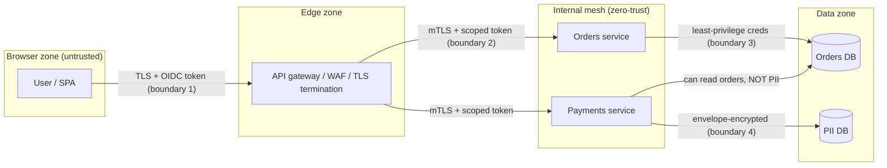
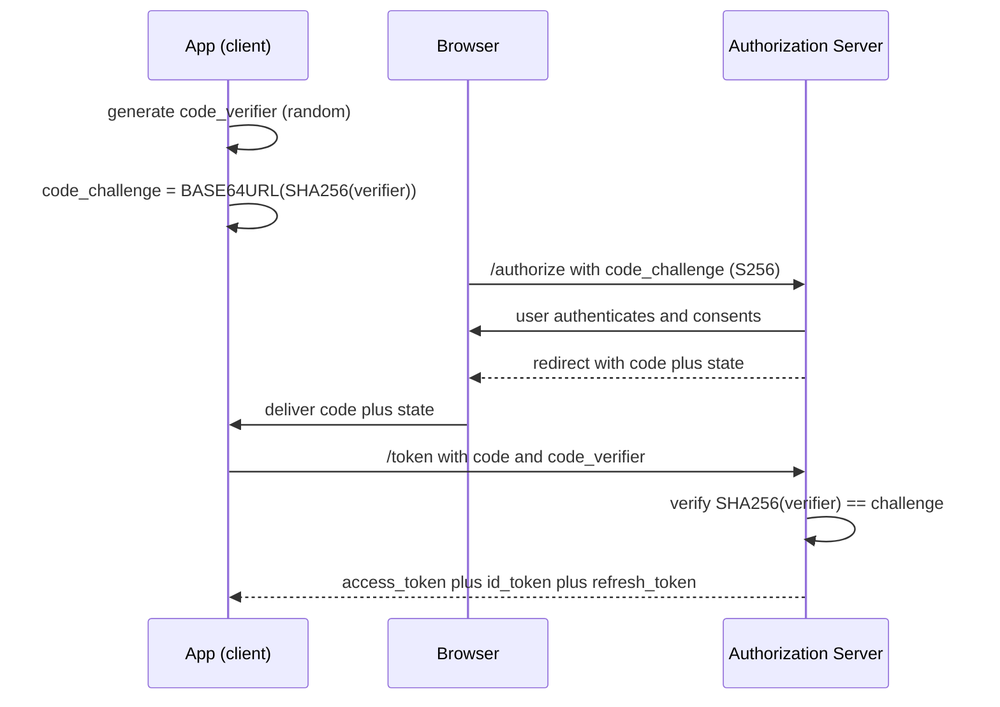
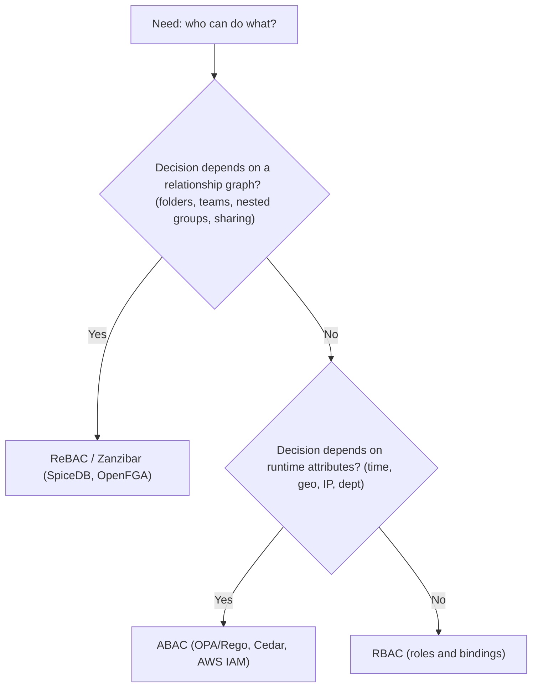
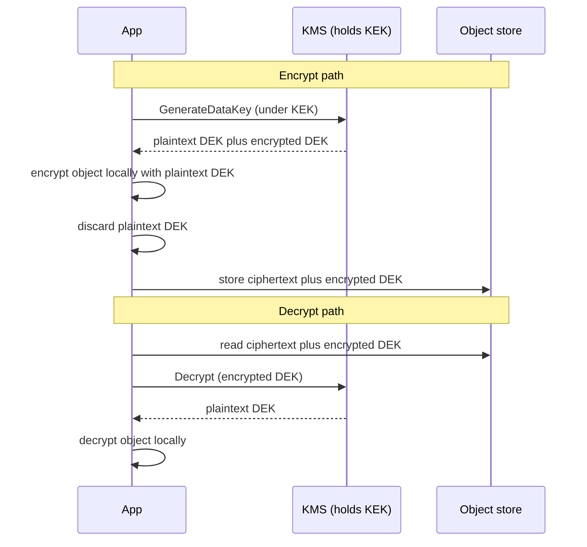

# Security in System Design

> Where this fits: security is the cross-cutting concern that sits *on top of* every other building block in this curriculum — your [APIs](./17-api-design.md), [databases](../01-building-blocks/07-databases-relational.md), [caches](../01-building-blocks/06-caching.md), [load balancers](../01-building-blocks/05-load-balancing.md), and [message queues](../01-building-blocks/11-messaging-and-streaming.md). It is not a service you add; it is a property of the whole system.
>
> **Principal-level takeaway:** Security is a *design constraint you carry from the first whiteboard line*, not a hardening pass before launch. The cheapest, most durable wins come from architecture — trust boundaries, least privilege, where identity is established and re-checked — not from bolt-on widgets. If you can't draw your trust boundaries and name who is allowed to do what at each one, you don't have a design yet.

---

## ⚡ 60-Second TL;DR

- **Security is a design property** of the whole system, not a bolt-on; everything hangs off **trust boundaries** (where data crosses trust zones — authN/authZ/encrypt at each).
- **AuthN** (who you are) vs **AuthZ** (what you may do) — never conflate; the classic breach is **IDOR**: logged-in ≠ authorized, so check ownership on *every* resource access.
- **Sessions** (stateful, instant revoke, needs a store) vs **JWTs** (stateless, scale, *can't easily revoke*) — fix with short-lived access tokens **+ rotating refresh**.
- **AuthZ models**: **RBAC** (simple, role-explosion) → **ABAC** (contextual, hard to audit) → **ReBAC**/Zanzibar (relationship graph, sharing-heavy apps).
- **Envelope encryption**: per-object **DEK** wrapped by a **KEK** that never leaves KMS — cheap rotation, small blast radius.
- Rules of thumb: **access tokens 5–15 min**, **never roll your own crypto**, hash passwords with a **slow KDF** (argon2/bcrypt, ~100–250ms), compare secrets **constant-time**.

**Remember one thing:** If you can't draw your trust boundaries and name who's allowed to do what at each one — and what leaks when a credential does — you don't have a design yet.

## The Mental Model — first principles

Every system has *assets* (data, money, compute, reputation) and *adversaries* who want them. Security is the discipline of making the cost of an attack exceed its reward, and of containing the blast radius when — not if — something gets through. That's it. Everything below is mechanism in service of that goal.

Three questions generate almost all of security design:

1. **Who are you?** — *Authentication (AuthN)*. Establishing identity.
2. **What are you allowed to do?** — *Authorization (AuthZ)*. Enforcing a policy over an established identity.
3. **Who can see or tamper with the bytes in between?** — *Confidentiality & integrity*. Encryption, signing, key management.

The reason security must be a *design* concern and not a bolt-on is structural: **trust boundaries are architectural.** A trust boundary is any place where data or control crosses from a more-trusted zone to a less-trusted one (or vice versa) — the browser↔API edge, service↔service calls, app↔database, your VPC↔a third-party API. You authenticate, authorize, validate, and encrypt *at boundaries*. If you didn't decide where the boundaries are when you drew the architecture, you can't add them later without re-plumbing the whole thing. The classic failure — a flat network where any service can reach any database with a shared god-credential — is not a missing feature, it's a missing boundary, and retrofitting one means touching every service.

The mindset shift the rest of this chapter trains: stop thinking "is this endpoint secured?" and start thinking "what is the trust boundary here, who crosses it, what's the least privilege they need, and what happens when their credential leaks?"

The diagram below shows the same request crossing four boundaries — each one a place where you re-establish identity, re-check least privilege, and decide what's encrypted. Notice that crossing *into* the internal mesh does not grant trust: every hop re-authenticates (zero-trust), and the payments service can reach the orders DB but is denied the PII DB (least privilege).



---

## Core Concepts

### AuthN vs AuthZ — keep them distinct

These are confused constantly, and conflating them causes real bugs.

- **Authentication** answers *"are you who you say you are?"* It produces an **identity** (a user id, a service principal). Mechanisms: passwords, passkeys/WebAuthn, OAuth/OIDC login, API keys, mTLS client certs.
- **Authorization** answers *"is this identity permitted to perform this action on this resource?"* It evaluates a **policy** against the identity plus context.

The bug pattern: a system that authenticates well but authorizes by accident. You log in successfully (AuthN passes), then call `GET /api/invoices/12345` and the server returns invoice 12345 — without checking that *your* identity owns it. That's **IDOR** (Insecure Direct Object Reference), and it's one of the most common real-world breaches precisely because teams treat "logged in" as "allowed." A request being authenticated tells you *nothing* about whether it's authorized. Every resource access needs an explicit AuthZ check, ideally enforced in one place, not sprinkled per-endpoint.

### Session auth vs token auth

How does the server know request #2 comes from the user who logged in at request #1? HTTP is stateless, so you carry proof.

**Session (stateful) auth.** On login, the server creates a session record (server-side or in a store like Redis) and hands the client an opaque **session id** in a cookie. Each request, the server looks up the session. The id is a meaningless random string; all state lives server-side.

```
Client                         Server
  | --- POST /login --------->  | create session{id, userId, exp} in Redis
  | <-- Set-Cookie: sid=abc...  |
  | --- GET /me (Cookie:sid) -> | redis.get(sid) -> userId -> authorize
```

- **Pro:** instant revocation (delete the session row); small cookie; server controls everything.
- **Con:** every request hits the session store — a stateful dependency you must scale and replicate. Cross-data-center and microservice fan-out get awkward.

**Token (stateless) auth.** On login, the server issues a signed **token** (typically a JWT) containing claims. The client sends it (usually `Authorization: Bearer <token>`). The server *verifies the signature* and trusts the contents — no lookup.

- **Pro:** stateless verification; any service with the public key can validate; scales horizontally; great for microservices.
- **Con:** you cannot easily revoke a token before it expires (see JWT below); tokens are bigger; mishandling leads to subtle disasters.

The honest framing: **sessions trade a lookup for revocation; tokens trade revocation for a lookup-free path.** Most large systems end up hybrid — short-lived stateless access tokens plus a stateful refresh/revocation layer.

### OAuth2 and OIDC

**OAuth2 is a *delegated authorization* framework**, not a login protocol. Its job: let a user grant Application A limited access to their resources on Service B *without handing A their B password*. The artifact is an **access token** scoped to specific permissions.

**OIDC (OpenID Connect)** is a thin identity layer *on top of* OAuth2. It adds the **ID token** (a JWT describing *who the user is*) and a standard `/userinfo` endpoint. The mantra: **OAuth2 = authorization (access token); OIDC = authentication (ID token).** "Log in with Google" is OIDC; "let this app post to your Google Calendar" is OAuth2.

The flow that matters today is **Authorization Code with PKCE** (Proof Key for Code Exchange). PKCE was originally for mobile but is now recommended for *all* clients including SPAs.

```
1. App generates code_verifier (random), code_challenge = BASE64URL(SHA256(verifier))   // S256 method
2. Browser -> Authorization Server: /authorize?...&code_challenge=...
3. User authenticates & consents
4. AuthServer -> Browser (redirect): ?code=AUTH_CODE  (+ state echoed back)
5. App -> AuthServer: /token  {code, code_verifier}
6. AuthServer verifies SHA256(verifier)==challenge -> returns access_token (+ id_token, +refresh_token)
```

The same handshake as a sequence — note the `code_verifier` is generated and held by the app and only revealed at the `/token` step, so a code intercepted in steps 4–5 is useless without it:



Why PKCE: an authorization code can leak (browser history, logs, a malicious app intercepting the redirect). Without PKCE, a thief redeems the stolen code for tokens. With PKCE, redemption requires the `code_verifier`, which never left the legitimate app. The `state` parameter is a separate defense — it ties the redirect back to the originating request, preventing CSRF on the callback.

Two flows to *avoid*: the **Implicit flow** (returns tokens directly in the redirect URL fragment — deprecated, tokens leak via referrer/history) and the **Resource Owner Password Credentials** grant (app collects the user's actual password — defeats the entire point). Use **Client Credentials** grant for service-to-service (no user involved).

### JWT — claims, signing, and the revocation problem

A JWT is three Base64URL parts: `header.payload.signature`.

```json
// header
{ "alg": "RS256", "kid": "2024-key-1", "typ": "JWT" }
// payload (claims)
{ "sub": "user_42", "iss": "https://auth.example.com",
  "aud": "api.example.com", "exp": 1736300000, "iat": 1736296400,
  "scope": "read:invoices", "roles": ["finance"] }
```

The signature proves integrity and authenticity. **It does not encrypt** — the payload is *readable by anyone* (Base64 is not encryption). Never put secrets in a JWT.

Signing comes in two families:
- **HMAC (HS256):** one shared symmetric secret signs and verifies. Simple, but every verifier needs the secret — and anyone who can verify can also forge. Fine for a single service; bad for multi-service fan-out.
- **Asymmetric (RS256/ES256):** the auth server signs with a private key; resource servers verify with the *public* key (published at a JWKS endpoint, rotated via `kid`). This is what you want in a microservices mesh: services verify without ever holding signing power.

Two implementation rules dominate everything below: **never roll your own crypto** (use the platform's vetted library — `crypto/hmac`, `crypto/subtle`, `javax.crypto`, never a hand-written hash loop), and **always compare secrets in constant time**. A naïve `==` on a token or MAC short-circuits on the first mismatching byte, leaking how many leading bytes were correct; an attacker measures the timing and recovers the secret byte-by-byte. Constant-time comparison removes the data-dependent timing.

**Constant-time token comparison + HMAC sign/verify.** Both languages lean entirely on standard-library primitives: `crypto/hmac` + `crypto/subtle` in Go, `javax.crypto.Mac` + `MessageDigest.isEqual` in Java (which is constant-time on modern JDKs). Note that `hmac.Equal` and `MessageDigest.isEqual` are themselves the constant-time comparison — you should never hand-write the byte loop.

```go
package token

import (
	"crypto/hmac"
	"crypto/sha256"
	"crypto/subtle"
	"encoding/base64"
)

// Sign returns a URL-safe base64 HMAC-SHA256 tag over msg.
func Sign(key, msg []byte) string {
	mac := hmac.New(sha256.New, key)
	mac.Write(msg)
	return base64.RawURLEncoding.EncodeToString(mac.Sum(nil))
}

// Verify recomputes the tag and compares in constant time.
// hmac.Equal wraps subtle.ConstantTimeCompare; do not use ==.
func Verify(key, msg []byte, tag string) bool {
	want, err := base64.RawURLEncoding.DecodeString(tag)
	if err != nil {
		return false
	}
	mac := hmac.New(sha256.New, key)
	mac.Write(msg)
	return hmac.Equal(mac.Sum(nil), want)
}

// ConstantTimeEqual compares two opaque tokens without leaking length-prefix timing.
func ConstantTimeEqual(a, b []byte) bool {
	return subtle.ConstantTimeCompare(a, b) == 1
}
```

```java
import javax.crypto.Mac;
import javax.crypto.spec.SecretKeySpec;
import java.security.MessageDigest;
import java.util.Base64;

public final class Token {
    private static final String ALG = "HmacSHA256";

    private Token() {}

    /** Returns a URL-safe base64 HMAC-SHA256 tag over msg. */
    public static String sign(byte[] key, byte[] msg) throws Exception {
        Mac mac = Mac.getInstance(ALG);
        mac.init(new SecretKeySpec(key, ALG));
        byte[] tag = mac.doFinal(msg);
        return Base64.getUrlEncoder().withoutPadding().encodeToString(tag);
    }

    /** Recomputes the tag and compares in constant time. */
    public static boolean verify(byte[] key, byte[] msg, String tag) throws Exception {
        byte[] want;
        try {
            want = Base64.getUrlDecoder().decode(tag);
        } catch (IllegalArgumentException e) {
            return false;
        }
        Mac mac = Mac.getInstance(ALG);
        mac.init(new SecretKeySpec(key, ALG));
        byte[] got = mac.doFinal(msg);
        // MessageDigest.isEqual is constant-time on modern JDKs; never use Arrays.equals or equals().
        return MessageDigest.isEqual(got, want);
    }

    /** Constant-time comparison of two opaque tokens. */
    public static boolean constantTimeEqual(byte[] a, byte[] b) {
        return MessageDigest.isEqual(a, b);
    }
}
```

**Why you can't easily revoke a JWT.** The point of a JWT is stateless verification: the server checks the signature and `exp` and trusts it. There's no lookup, so there's nowhere to record "this token is now invalid." If a token is stolen, it remains valid until `exp`. Your options, all imperfect:
- **Short expiry** (5–15 min) so the damage window is small — the standard answer.
- **A revocation/denylist** keyed by a `jti` (token id) — but checking it on every request *reintroduces the stateful lookup* you adopted JWTs to avoid.
- **Rotate signing keys** to nuke *all* tokens — a sledgehammer that logs everyone out.

**Refresh tokens** resolve the tension. You issue a short-lived **access token** (stateless, used on every API call) plus a long-lived **refresh token** (opaque, stored server-side, used *only* against the auth server to mint new access tokens). Now you get both: fast stateless verification on the hot path, *and* revocation — invalidate the refresh token and the user is locked out at the next refresh (≤ access-token lifetime later). Add **refresh token rotation** (each refresh issues a new refresh token and invalidates the old one) so a stolen-and-reused refresh token is detectable: if an old one is presented, you know it leaked and can revoke the whole family.

**The "stop putting sessions in JWTs" debate.** A loud and largely correct camp (see the "JWTs are bad for sessions" writeups) argues: if you're using JWTs as *session cookies for a normal web app*, you've taken on all the JWT downsides (no easy logout/revocation, growing token size, key-management burden, footguns like the `alg:none` and HS/RS confusion attacks) to solve a scaling problem you don't have — a Redis session lookup is sub-millisecond. The principal position: **JWTs shine for short-lived, cross-service, audience-scoped access tokens. They are a poor substitute for a session store in a single web app.** Use the right tool: stateful sessions for browser logins; stateless access tokens for service-to-service and API gateways.

### RBAC vs ABAC vs ReBAC

How do you express *who can do what*? Three models, increasing in power and cost.

- **RBAC (Role-Based):** permissions attach to *roles*; users get roles. `admin can delete; editor can write; viewer can read`. Simple, auditable, ubiquitous. Breaks down under "role explosion" — when you need `editor-of-team-7-but-only-on-weekdays`, you end up minting thousands of roles.
- **ABAC (Attribute-Based):** decisions are a function of *attributes* of subject, resource, action, and environment. `allow if user.dept == resource.dept AND time in business_hours AND request.ip in corp_range`. Extremely expressive, handles context, but policies get hard to reason about and audit ("who can actually access X?" becomes a constraint-solving problem).
- **ReBAC (Relationship-Based):** decisions follow *relationships* in a graph. `user can view doc if user is owner OR user is member of a group that is editor of the doc's folder`. This is **Google Zanzibar's** model — the system behind Drive, Calendar, YouTube, and Cloud IAM. It excels at hierarchical, shared-resource permissions (folders, orgs, nested groups) that RBAC and ABAC model awkwardly.

Zanzibar stores **relation tuples** of the form `object#relation@subject`, e.g. `doc:readme#viewer@user:alice` or `doc:readme#viewer@group:eng#member` (a *userset* — everyone in eng's member set views readme). Authorization is a graph reachability check, computed consistently at scale using **zookies** (consistency tokens that prevent the "new ACL not yet replicated" stale-read bug). Open-source descendants: **SpiceDB**, **Ory Keto**, **OpenFGA**.

The choice between the three models is a decision tree more than a preference — work from the most-constrained model outward, reaching for power only when the cheaper model can't express the rule cleanly:



A principal-level subtlety: prefer **centralizing the policy decision** (a Policy Decision Point — OPA/Rego, Cedar, or a Zanzibar service) while **distributing enforcement** (a Policy Enforcement Point in each service). This keeps policy auditable in one place without a single network hop in every request's critical path being a bottleneck.

### Encryption in transit and at rest; key management

**In transit — TLS.** Every hop, including *inside* your network (zero-trust: the network is not a trust boundary). TLS gives confidentiality, integrity, and *server* authentication (the cert). **mTLS** adds *client* authentication — both sides present certs — which is how service meshes (Istio/Linkerd) establish service identity without passing tokens around. Use mTLS for service-to-service in untrusted or multi-tenant networks; it's how you turn "any service can call any service" into "only services with valid identity certs can."

**At rest — encryption + key management.** Encrypting the disk is easy; *managing keys* is the hard part, and it's where design judgment lives. The standard pattern is **envelope encryption**:

```
            KMS (holds the KEK — never leaves the HSM boundary)
              |  encrypt/decrypt the DEK only
   plaintext --[ DEK ]--> ciphertext   (DEK = Data Encryption Key, per-object/row)
              store: ciphertext + encrypted_DEK
```

The encrypt and decrypt paths as a sequence — the plaintext DEK lives in app memory only for the duration of one operation and is discarded; the KEK never leaves KMS:



A **KMS** (AWS KMS, GCP KMS, HashiCorp Vault) holds a **Key Encryption Key (KEK)** that *never leaves* the hardware boundary. To encrypt data you (1) ask KMS for a fresh **Data Encryption Key (DEK)**, (2) encrypt the data locally with the DEK, (3) store the ciphertext alongside the *KMS-encrypted* DEK. To read, you send the encrypted DEK to KMS, get the plaintext DEK back, decrypt locally. Why bother? **Key rotation becomes cheap** (re-encrypt the small DEKs, not petabytes of data), **blast radius shrinks** (one DEK per tenant/object limits what a single leaked key exposes), and **the master key never touches your app**. This is exactly how S3, DynamoDB, and EBS do server-side encryption.

**Secrets management.** Application secrets (DB passwords, API keys, signing keys) must not live in code, git, or plaintext env files baked into images. Use a secrets manager (Vault, AWS Secrets Manager, GCP Secret Manager) that supports **dynamic, short-lived, leasable secrets** (e.g., Vault mints a DB credential valid for 1 hour) and **automatic rotation**. The design goal: a leaked secret should expire on its own and be auditable.

### Least privilege, zero-trust, defense in depth

Three principles that should shape the architecture, not the checklist:

- **Least privilege:** every principal (user, service, process) gets the *minimum* permissions to do its job, and no more. The payments service can read the orders table but not the users' PII table. A leaked credential then exposes only its narrow scope.
- **Zero-trust:** "never trust, always verify." Being *inside* the network grants you nothing — there is no soft chewy interior. Every request is authenticated and authorized regardless of origin (Google's BeyondCorp popularized this). It directly contradicts the old "castle-and-moat" / VPN model where the perimeter was the boundary.
- **Defense in depth:** assume each layer *will* fail, and stack independent controls so no single failure is catastrophic. WAF + input validation + parameterized queries + least-privilege DB user + encryption at rest + audit logging — a SQL injection that beats the first three still hits a DB user that can't read other tenants' data.

---

## Trade-offs at a Glance

| Decision | Option A | Option B | When to choose which |
|---|---|---|---|
| Session state | **Stateful sessions** (cookie + Redis): instant revoke, small cookie, needs a store | **Stateless JWT**: no lookup, scales, but no easy revoke, bigger | Web app w/ one backend → sessions. Microservices / API gateway / mobile → short-lived JWT + refresh |
| JWT signing | **HS256** (shared secret): simple, but verifier can forge | **RS256/ES256** (asymmetric): verify w/ public key, can't forge | Single service → HS256 OK. Multi-service / public verifiers → asymmetric, always |
| Token lifetime | **Long-lived** access token: fewer refreshes | **Short-lived + refresh**: small breach window, revocable | Almost always short-lived (5–15 min) access + rotating refresh |
| AuthZ model | **RBAC**: simple, auditable, role explosion | **ABAC**: contextual, expressive, hard to audit / **ReBAC**: graph, shared resources | Coarse roles → RBAC. Contextual rules (time/geo/attrs) → ABAC. Hierarchical sharing (docs/orgs) → ReBAC/Zanzibar |
| Service-to-service auth | **mTLS** (cert identity): network-level, infra-managed | **Bearer tokens** (JWT): app-level, fine-grained scopes | Mesh / zero-trust network → mTLS. Need per-call scopes / external callers → tokens. Often both |
| Encryption at rest | **Full-disk / TDE**: transparent, coarse | **Envelope (KMS + per-object DEK)**: rotatable, fine blast radius | Compliance baseline → TDE. Multi-tenant / sensitive PII → envelope encryption |
| Login | **Roll your own passwords** | **OIDC via IdP** (Okta/Auth0/Google/Cognito) | Default to an IdP. Roll-your-own only with a compelling reason and a security team |

---

## How Real Systems Do It

- **AWS IAM** is industrial-strength ABAC: policies are JSON documents over principals, actions, resources, and conditions, evaluated with explicit-deny-wins precedence. **AWS STS** issues short-lived (15 min–12 hr) credentials via role assumption — least privilege and expiry baked into the platform. **AWS KMS** does envelope encryption; S3/DynamoDB/EBS server-side encryption all use KMS-managed KEKs over per-object DEKs.
- **Google Zanzibar** powers authorization for Drive, Calendar, Maps, YouTube, and Cloud IAM — the paper reports *over 10 million client QPS* (peak Check load ~4.2M QPS) at p95 under 10 ms and >99.999% availability, with `zookie` consistency tokens to avoid the "edited the ACL but the old permission is still cached" class of bug. **SpiceDB** and **OpenFGA** are the open-source implementations teams reach for.
- **Kubernetes** uses RBAC (`Role`/`ClusterRole` + `RoleBinding`) for API authorization, mTLS for control-plane comms, and a `Secrets` object (base64, *not* encrypted by default — a famous footgun; enable encryption-at-rest for etcd or use an external KMS).
- **Stripe** treats card data as radioactive: PANs are **tokenized** at the edge so merchant systems handle a `tok_...` reference, never the real number — drastically shrinking PCI-DSS scope. This is the textbook example of *tokenization as a design choice that removes data from your trust boundary entirely.*
- **Cloudflare / API gateways** push rate limiting, WAF, bot detection, and TLS termination to the edge so abuse is absorbed before it reaches origin.
- **Service meshes (Istio, Linkerd)** auto-provision and rotate per-workload mTLS certs (SPIFFE/SPIRE identities), making zero-trust service identity an infrastructure default rather than per-app code.

---

## Failure Modes & Common Misconceptions

**Production failure modes:**
- **IDOR / broken object-level authZ:** authenticated but not authorized per-resource. `/orders/{id}` returns anyone's order. Fix: check ownership on *every* access; never trust client-supplied ids.
- **SSRF (Server-Side Request Forgery):** an attacker makes *your server* fetch a URL they control — classically `http://169.254.169.254/` to steal cloud instance-metadata credentials (the 2019 Capital One breach). Fix: allowlist outbound destinations, block link-local/metadata IPs, use IMDSv2.
- **Injection (SQL/NoSQL/command/LDAP):** untrusted input interpreted as code. Fix: parameterized queries / prepared statements *always*; never string-concatenate queries. Validate and encode at boundaries.
- **CSRF:** a malicious site causes the victim's browser to send an authenticated request using its ambient cookies. Fix: `SameSite=Lax/Strict` cookies, anti-CSRF tokens, check `Origin`. (Note: bearer tokens in headers are immune — CSRF is a *cookie* problem.)
- **Replay attacks:** capturing and re-sending a valid request. Fix: nonces, timestamps + short windows, idempotency keys (see [distributed transactions](../02-distributed-systems/15-distributed-transactions.md)).
- **Secret sprawl:** credentials in git history, logs, error messages, or client-side bundles. Fix: secrets manager, scanning (gitleaks), structured logging that redacts.

**Myths to call out explicitly:**
- *"JWTs are encrypted / secure to put secrets in."* **No.** A JWT is *signed*, not encrypted. The payload is plaintext Base64 anyone can read. (Encryption exists via JWE, but plain JWTs are readable.)
- *"We use HTTPS, so we're secure."* TLS protects bytes *in transit*. It does nothing for authZ, injection, IDOR, stored-data protection, or a compromised endpoint.
- *"We're behind a firewall / inside the VPC, so internal traffic is trusted."* This is the perimeter fallacy zero-trust kills. One compromised service should not own the network. Authenticate internal calls too.
- *"Hashing and encryption are the same."* Hashing is one-way (passwords → bcrypt/argon2, *never* encryption). Encryption is reversible with a key.

**Password hashing with a slow KDF.** Passwords must be run through a *deliberately slow*, salted, memory-hard key-derivation function — never a fast hash like SHA-256 (which a GPU brute-forces at billions/sec) and never reversible encryption. Argon2id is the current best default; bcrypt remains a fine, ubiquitous choice. The library generates and embeds the salt and cost parameters in the output string, so verification needs only the stored hash. Tune the cost so a single hash takes ~100–250 ms on your hardware. As always: never roll your own — use `golang.org/x/crypto` and a vetted Java library (here, Spring Security's `BCryptPasswordEncoder`; for Argon2 use `Argon2PasswordEncoder` backed by Bouncy Castle).

```go
package password

import "golang.org/x/crypto/bcrypt"

// Hash returns a salted bcrypt hash; cost 12 ~ 200ms on modern hardware.
// bcrypt generates the salt internally and embeds it (and the cost) in the output.
func Hash(plaintext string) (string, error) {
	b, err := bcrypt.GenerateFromPassword([]byte(plaintext), 12)
	if err != nil {
		return "", err
	}
	return string(b), nil
}

// Verify is constant-time with respect to the hash internals.
// A non-nil error means mismatch (or a malformed hash).
func Verify(hash, plaintext string) bool {
	return bcrypt.CompareHashAndPassword([]byte(hash), []byte(plaintext)) == nil
}
```

For Argon2id (memory-hard, the modern first choice), Go uses `golang.org/x/crypto/argon2` — you must store the salt and parameters yourself:

```go
package password

import (
	"crypto/rand"
	"crypto/subtle"
	"golang.org/x/crypto/argon2"
)

const (
	argonTime    = 1
	argonMemory  = 64 * 1024 // 64 MiB
	argonThreads = 4
	argonKeyLen  = 32
	saltLen      = 16
)

// HashArgon2 returns a fresh salt and the derived key; store both.
func HashArgon2(plaintext string) (salt, key []byte, err error) {
	salt = make([]byte, saltLen)
	if _, err = rand.Read(salt); err != nil {
		return nil, nil, err
	}
	key = argon2.IDKey([]byte(plaintext), salt, argonTime, argonMemory, argonThreads, argonKeyLen)
	return salt, key, nil
}

// VerifyArgon2 re-derives with the stored salt and compares in constant time.
func VerifyArgon2(plaintext string, salt, want []byte) bool {
	got := argon2.IDKey([]byte(plaintext), salt, argonTime, argonMemory, argonThreads, argonKeyLen)
	return subtle.ConstantTimeCompare(got, want) == 1
}
```

```java
import org.springframework.security.crypto.bcrypt.BCryptPasswordEncoder;
import org.springframework.security.crypto.password.PasswordEncoder;

public final class PasswordHasher {
    // Strength 12 ~ 200ms per hash; the encoder generates the salt and embeds
    // it (with the cost) in the returned string. Verification needs only that string.
    private static final PasswordEncoder ENCODER = new BCryptPasswordEncoder(12);

    private PasswordHasher() {}

    public static String hash(String plaintext) {
        return ENCODER.encode(plaintext);
    }

    /** matches() is constant-time with respect to the hash internals. */
    public static boolean verify(String hash, String plaintext) {
        return ENCODER.matches(plaintext, hash);
    }
}
```

For Argon2id in Java, Spring Security's `Argon2PasswordEncoder` (backed by Bouncy Castle) keeps the same self-contained API — salt and parameters are encoded into the output string:

```java
import org.springframework.security.crypto.argon2.Argon2PasswordEncoder;
import org.springframework.security.crypto.password.PasswordEncoder;

public final class Argon2Hasher {
    // saltLen=16, hashLen=32, parallelism=4, memory=64 MiB (65536 KiB), iterations=3
    private static final PasswordEncoder ENCODER =
        new Argon2PasswordEncoder(16, 32, 4, 65536, 3);

    private Argon2Hasher() {}

    public static String hash(String plaintext) {
        return ENCODER.encode(plaintext);
    }

    public static boolean verify(String hash, String plaintext) {
        return ENCODER.matches(plaintext, hash);
    }
}
```
- *"Rate limiting is just a performance/cost feature."* It's a *security* control: it's your defense against credential stuffing, brute force, scraping, and enumeration. A login endpoint without rate limiting is a brute-force invitation. (See the [rate limiter case study](../04-design-case-studies/22-url-shortener-rate-limiter-id-gen.md).)
- *"Security through obscurity works."* A hidden endpoint or a secret algorithm is not access control. Assume the design is public (Kerckhoffs's principle); only the *keys* are secret.
- *"We'll add auth/compliance before launch."* PII handling, data residency (GDPR), and PCI scope dictate *where data lives and flows* — architectural decisions that are brutally expensive to retrofit.

---

## In a Design Discussion

When security comes up at the whiteboard, the move is to **draw the trust boundaries first**, then walk a request across each one asking: *who is authenticated here, what's the least privilege, where's the data encrypted, and what's the blast radius if this credential leaks?*

> **JUNIOR take:** "We'll use JWT for auth and HTTPS for security. There's a login endpoint and we hash passwords with bcrypt. We'll add rate limiting and an audit log later if we have time."

> **PRINCIPAL take:** "Let's mark trust boundaries: browser→edge, edge→services, service→service, service→DB. At the edge we terminate TLS and authenticate users via OIDC against our IdP, issuing a 10-minute access token plus a rotating refresh token — sessions stay server-side so we can revoke. Service-to-service is mTLS via the mesh for identity, with scoped tokens for fine-grained authZ. AuthZ is centralized in a policy service; this app is sharing-heavy (folders, teams) so it's ReBAC, not RBAC — model the relation tuples now. PII columns get envelope encryption with per-tenant DEKs in KMS so a single key leak is contained, and card data is tokenized at the edge to keep PCI scope off our core services. Each DB credential is least-privilege and short-lived from Vault. Rate limiting and anomaly detection are on the login and token endpoints from day one — that's our anti-credential-stuffing control, not a nice-to-have. The open questions I'd flag: our revocation latency equals the access-token lifetime — is 10 minutes acceptable for the abuse cases we care about? And does GDPR data-residency force us to shard EU users into an EU region, because that changes the [partitioning](../01-building-blocks/10-partitioning-sharding.md) story?"

The difference isn't more jargon — it's that the principal makes security *structural* (boundaries, least privilege, blast radius, compliance-as-constraint) and surfaces the *trade-offs and open questions* instead of naming tools. See [trade-off reasoning & ADRs](../05-principal-skills/29-tradeoffs-and-adrs.md) for how to document these decisions.

---

## Self-Check

<details>
<summary>1. A user logs in successfully and then requests <code>/api/documents/999</code>, getting back a document they don't own. AuthN or AuthZ failure? Name the vulnerability.</summary>

An **AuthZ** failure — authentication succeeded. The specific bug is **IDOR**: the server didn't check that the authenticated user is permitted to access object 999. Fix with an object-level ownership check on every access.
</details>

<details>
<summary>2. Why can't you reliably "log out" / revoke a stateless JWT before it expires, and what's the standard mitigation?</summary>

Stateless verification means the server only checks the signature and `exp` — there's no lookup where you could record "revoked," so the token stays valid until expiry. Mitigation: **short-lived access tokens (5–15 min) + a server-side refresh token** you *can* revoke. Revocation then takes effect within one access-token lifetime. A `jti` denylist works but reintroduces the per-request lookup JWTs were meant to avoid.
</details>

<details>
<summary>3. OAuth2 vs OIDC in one sentence each. Which token does each produce?</summary>

OAuth2 is *delegated authorization* and produces an **access token** (what you can do). OIDC is an identity layer on top of OAuth2 for *authentication* and produces an **ID token** (who you are).
</details>

<details>
<summary>4. What does PKCE protect against, and what does the <code>state</code> parameter protect against?</summary>

**PKCE** protects against a stolen/intercepted *authorization code* being redeemed by an attacker — redemption requires the `code_verifier` that never left the legitimate client. **`state`** protects against CSRF on the redirect callback by binding the response to the originating request.
</details>

<details>
<summary>5. Explain envelope encryption and why per-object DEKs help.</summary>

A KMS holds a master **KEK** that never leaves its boundary. Data is encrypted with a per-object/per-tenant **DEK**; the DEK is itself encrypted by the KEK and stored next to the ciphertext. Benefits: rotating keys means re-encrypting tiny DEKs not all the data; a single leaked DEK exposes only its one object/tenant (small blast radius); the master key never touches the app.
</details>

<details>
<summary>6. You need permissions for "members of a team that owns a folder can edit all docs in it, including nested subfolders." RBAC, ABAC, or ReBAC?</summary>

**ReBAC** (à la Zanzibar). The decision follows a *relationship graph* (user→team→folder→subfolder→doc). RBAC would explode into per-folder roles; ABAC could express it but auditing "who can edit doc X" becomes painful. ReBAC models the relations directly and answers reachability efficiently.
</details>

<details>
<summary>7. Why is rate limiting a security control, not just a cost/performance one?</summary>

It's the primary defense against credential stuffing, password brute-forcing, account enumeration, and scraping. An unthrottled login or token endpoint lets an attacker try millions of credentials. Rate limiting (plus lockouts and anomaly detection) raises attack cost above reward.
</details>

<details>
<summary>8. Why is "we're inside the VPC so internal calls are trusted" dangerous?</summary>

It's the perimeter fallacy. One compromised service or a lateral-movement attacker then has free rein. **Zero-trust** says the network grants no privilege; authenticate and authorize every call (e.g., mTLS service identity + scoped tokens) regardless of origin, with least-privilege limiting each service's reach.
</details>

---

## Go Deeper

- **Designing Data-Intensive Applications** (Kleppmann) — Ch. 1 (reliability/maintainability framing for security as a system property), Ch. 5 (replication — relevant to the Zanzibar consistency/`zookie` problem), Ch. 9 (consistency — why stale ACLs are a correctness bug). DDIA is light on security specifically; pair it with the items below.
- **Google Zanzibar: A Global Authorization System** (USENIX ATC 2019) — the foundational ReBAC paper. Read it before designing any sharing-heavy authZ system.
- **OWASP Top 10** and the **OWASP Application Security Verification Standard (ASVS)** — the canonical catalogue of web vulnerabilities (injection, IDOR/broken access control, SSRF, CSRF) and a checklist to design against.
- **RFC 6749** (OAuth 2.0), **RFC 7519** (JWT), **RFC 7636** (PKCE), and the **OAuth 2.0 Security Best Current Practice** (RFC 9700) — read the BCP, not just the original specs; it deprecates Implicit and ROPC.
- **OpenID Connect Core** spec — the authoritative source on ID tokens vs access tokens.
- **NIST SP 800-207 (Zero Trust Architecture)** and Google's **BeyondCorp** papers — the reference model for zero-trust.
- **"Stop using JWT for sessions"** (Sven Slootweg / joepie91) — the canonical articulation of the sessions-in-JWT debate; read it alongside arguments for token auth to form your own judgment.
- **The Tangled Web** (Zalewski) — deep, precise browser-security model (origins, cookies, CSRF, CORS).
- **AWS KMS / GCP KMS** envelope-encryption docs and **HashiCorp Vault** dynamic-secrets docs — the practical patterns for key and secret management.
- Cross-links: [API Design](./17-api-design.md) (where auth lives in your contract), [Reliability](../02-distributed-systems/16-reliability-and-failure.md) (blast radius / failure containment), [Observability](./19-observability.md) (audit logs & anomaly detection), [Rate Limiter case study](../04-design-case-studies/22-url-shortener-rate-limiter-id-gen.md), [Payments & Ledgers](../04-design-case-studies/27-payments-and-ledgers.md) (PCI, tokenization, idempotency).

---

← Back to [the curriculum index](../README.md) · See the [roadmap](../ROADMAP.md)
