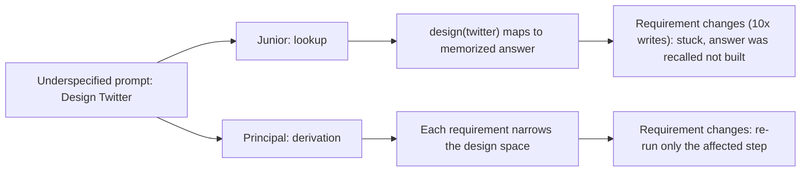
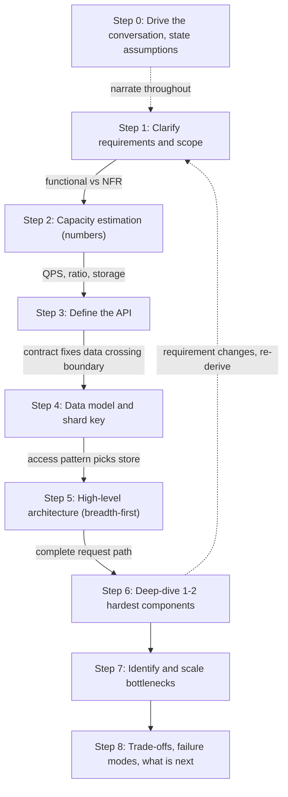
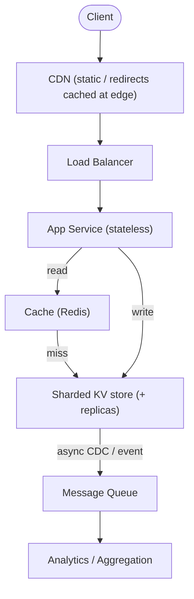
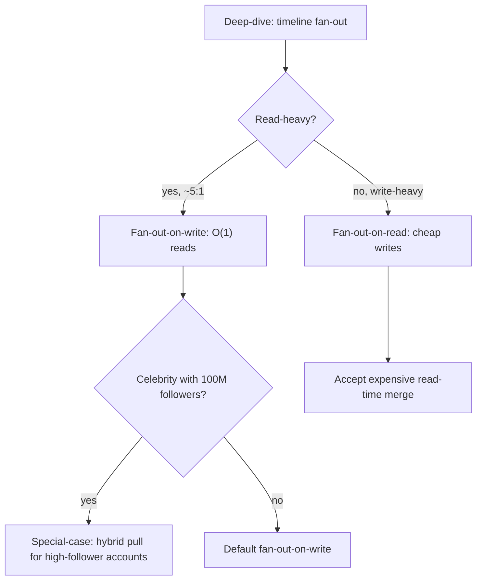

# The System Design Framework

> Where this fits: this is the *meta-skill* that sits on top of every other chapter in this curriculum — it turns the building blocks (caching, partitioning, consensus, queues) into a repeatable method for attacking an open-ended design problem under time pressure.
>
> **Principal-level takeaway:** A system design question is not a memory test about architectures — it is a test of whether you can derive an architecture *from requirements*. The framework's only job is to keep you driving from requirements → constraints → numbers → design → trade-offs, so the design becomes the inevitable consequence of the conversation rather than a thing you pulled from memory and are now defending.

---

## ⚡ 60-Second TL;DR

- **What/why:** a repeatable **8-step method** to *derive* an architecture from requirements, not recall one — because the prompt is deliberately underspecified.
- **Split requirements:** **functional** (drives API + data model) vs **non-functional** (drives architecture; 80% of the difficulty).
- **Numbers gate the tier:** compute **QPS + read/write ratio** — 1K vs 1M QPS = "one Postgres box" vs "shard + cache + queue + CDN."
- **Breadth before depth:** draw the whole request path first, *then* deep-dive the 1-2 hardest components — never one box at a time.
- **Deep-dive move:** offer **options → trade-offs → let a requirement break the tie** (the trifecta that's scored).
- **#1 misconception:** more components ≠ more senior; unmotivated boxes are the clearest junior tell. **Time:** ~5/5/5/5/8/10/5/2 over 45 min.
- **Must-do:** say the word **"fails"** — name what dies when cache/primary/AZ goes down.

**Remember one thing:** the architecture should fall out as the inevitable consequence of requirements → numbers → trade-offs, not be a memorized answer you defend.

## The Mental Model — first principles: why does this thing exist, what problem does it solve?

The reason people freeze in design interviews and real design reviews is the same: the problem is **deliberately underspecified**, and an underspecified problem has infinite valid answers. "Design Twitter" could mean a weekend hack or a system serving 500M daily users. With no constraints, every decision feels arbitrary, so your brain stalls. The framework exists to *manufacture constraints* — and a constrained problem has a small number of *defensible* answers, which is something a human can reason about.

Think of it like a function. The inputs are requirements and constraints. The output is an architecture. A junior treats this as a lookup: `design(twitter) → known_answer`. A principal treats it as a *derivation*: each requirement narrows the design space until the architecture falls out almost mechanically. When an interviewer changes a requirement ("now assume 10x write traffic"), the lookup-engineer is stuck — their answer was memorized, not derived — while the derivation-engineer simply re-runs the relevant step.

The second thing to internalize: **you are being evaluated on the conversation, not the diagram.** Three things are actually scored:

1. **Structured thinking** — do you have a method, or do you flail? Do you go breadth-first (whole system) before depth-first (one component)?
2. **Trade-off articulation** — when you make a choice, do you name what you gave up? "I'll denormalize" is junior. "I'll denormalize, trading write amplification and a risk of stale reads for cheap timeline reads, which matters because this is read-heavy at ~100:1" is principal.
3. **Depth on demand** — when the interviewer drills into one box, can you go three layers down? This is where real experience shows; you can't fake it, but the framework ensures you *reach* the drill-down with time left.

The framework is a sequence of eight steps. They are not a rigid script — a principal re-orders and skips based on what the problem demands — but for the first hundred problems you should follow them in order, because the *ordering encodes the dependency graph*: you can't size a system you haven't scoped, can't design an API for requirements you haven't pinned down, can't pick a data store before you know the access pattern, and can't identify a bottleneck in an architecture you haven't drawn.

The lookup-vs-derivation contrast is the whole game in one picture — note where each engineer ends up when a requirement shifts:



The eight steps below form a dependency graph: each step consumes the output of the one before it, which is why the *ordering* matters more than any individual step. The dashed edge back to Step 1 is the move that separates levels — when a requirement changes mid-session, you re-enter the graph at the affected step rather than defending a finished design:



---

## Core Concepts — the eight steps, and how to drive each one

### Step 0 (implicit): Drive the conversation, state assumptions out loud

Before the eight steps, the meta-rule: **you own the session.** The interviewer is a collaborator and a source of constraints, not a quizmaster waiting for the right answer. The two highest-leverage habits:

- **Ask, then assume.** Ask the cheap clarifying questions. For anything they won't pin down, *state an explicit assumption and move on*: "I'll assume reads dominate writes ~100:1 — stop me if that's wrong." This does three things: it shows judgment, it keeps you unblocked, and it makes your reasoning falsifiable so the interviewer can steer you.
- **Narrate the why.** Every time you reach for a component, say the requirement that pulled it in. "Because we need sub-100ms reads at the p99 and the data is hot and small, I'm adding a cache." Never introduce a box without a reason — unmotivated boxes are the single clearest junior tell.

### Step 1: Clarify requirements and scope (≈5 min)

Split requirements into two buckets, because they drive different parts of the design:

- **Functional requirements** — *what the system does*. The concrete user actions. For a URL shortener: create a short URL, redirect a short URL, optionally analytics. These shape your **API and data model**.
- **Non-functional requirements (NFRs)** — *how well it does it*. Scale, latency targets, availability, consistency, durability, cost. These shape your **architecture and infrastructure**. NFRs are where 80% of the difficulty lives and where juniors under-invest.

The critical move is **scoping**: explicitly cut. "I'll cover URL creation, redirect, and basic analytics; I'll treat auth, spam detection, and custom domains as out of scope unless you want them." Scoping is a *seniority signal* — it shows you know a real system has more surface than 45 minutes allows, and that you can prioritize.

Concretely, get answers (or make assumptions) on:

```
Functional:   What are the 2-4 core actions? Who are the actors?
Scale:        DAU / MAU? QPS (read & write separately)? Data volume/yr?
Latency:      p50/p99 target for the hot path? Is it read- or write-heavy?
Consistency:  Strong, or is eventual/read-your-writes acceptable? Where?
Availability: What's the SLO — 99.9% (8.7h/yr down) vs 99.99% (52min/yr)?
Durability:   Can we ever lose data? (Payments: no. Likes: maybe.)
```

### Step 2: Capacity estimation (≈5 min)

Now turn the NFRs into **numbers**, because numbers decide architecture. The full method lives in [Back-of-the-Envelope estimation](../00-foundations/04-capacity-estimation.md); here's why it's load-bearing in the framework: the difference between 1K QPS and 1M QPS is the difference between "one Postgres box" and "shard + cache + queue + CDN." You cannot choose between those without doing the math.

A worked example for a social timeline at 200M DAU:

```
Reads:  200M DAU × 10 timeline-loads/day = 2B reads/day
        2B / 86,400s ≈ 23K avg QPS → ×3 for peak ≈ 70K read QPS
Writes: 200M DAU × 2 posts/day = 400M writes/day ≈ 4.6K avg → ~14K peak
Ratio:  reads:writes ≈ 5:1 (read-heavy → caching & read replicas pay off)
Storage: 400M posts/day × 300 bytes ≈ 120 GB/day ≈ 44 TB/yr (text only)
         → must shard; won't fit one node's working set; plan for fan-out cost.
```

The output you carry forward isn't precision (your DAU guess could be 2x off and the *architecture* doesn't change) — it's the **order of magnitude** and the **read/write ratio**, which directly justify caching, sharding, and async fan-out. State assumptions; nobody expects exact numbers.

### Step 3: Define the API (≈3-5 min)

The API is the contract that makes the rest concrete. It forces you to nail down exactly what data crosses the boundary, which feeds the data model. Keep it tight — a few endpoints, not a full spec. Signal seniority by including **pagination, idempotency, and versioning** where they matter:

```
POST /v1/urls            { longUrl, customAlias? }  → { shortUrl }
   Idempotency-Key: <uuid>          # dedupe retries (see distributed-txns)
GET  /v1/{shortCode}     → 302 redirect to longUrl   # 302 not 301: 301 is browser-cached, so clicks skip the server and analytics undercounts
GET  /v1/{shortCode}/stats?from=&to=&cursor=  → { clicks[], nextCursor }
```

Choosing REST vs gRPC vs GraphQL is itself a trade-off worth one sentence — see [API Design](../03-architecture-and-apis/17-api-design.md). Default to REST for external/CRUD, gRPC for internal high-throughput service-to-service.

### Step 4: Data model (≈5 min)

The access pattern from Steps 1 and 3 dictates the store — *not* the other way around. This is the most common place where juniors invert the logic ("I like Mongo, so I'll use Mongo"). Principals derive: "Reads are key lookups by short code, writes are append-only, no cross-row joins, need horizontal scale → a key-value or wide-column store keyed on `shortCode` partitions cleanly." Define the core entities, their keys, and crucially **the partition/sharding key**, because the shard key is the decision that's most expensive to change later.

```
url_mapping:  short_code (PK, partition key) | long_url | created_at | owner_id
analytics:    short_code (PK) | day (clustering key) | click_count   # pre-aggregated
```

Cross-link the deep material: [Relational](../01-building-blocks/07-databases-relational.md) vs [NoSQL](../01-building-blocks/08-databases-nosql.md), and [Partitioning & Sharding](../01-building-blocks/10-partitioning-sharding.md) for choosing the shard key.

### Step 5: High-level architecture — draw the boxes (≈5-8 min)

Now go **breadth-first**: client → load balancer → service(s) → data stores, plus the cross-cutting pieces (cache, queue, CDN). The goal is a complete request path you can point at, even if every box is shallow. Resist diving deep here — you want the whole skeleton on the board before the interviewer (or your own time budget) forces a drill-down.

```
                    ┌─────────┐
   Client ──────▶   │   CDN   │  (static/redirects cached at edge)
                    └────┬────┘
                         ▼
                  ┌──────────────┐      ┌──────────────┐
                  │ Load Balancer│─────▶│  App Service │──┐
                  └──────────────┘      │  (stateless) │  │ read
                                        └──────┬───────┘  ▼
                                  write │      │     ┌──────────┐
                                        ▼      │     │  Cache   │ (Redis)
                                ┌──────────────┴┐    └────┬─────┘
                                │  Sharded KV    │◀────────┘ on miss
                                │  store (+repl) │
                                └───────┬────────┘
                                        │ async (CDC / event)
                                        ▼
                                ┌──────────────┐   ┌───────────────┐
                                │ Message Queue│──▶│ Analytics/Agg │
                                └──────────────┘   └───────────────┘
```

The same skeleton as a clean flow — one complete request path with the synchronous read/write and the asynchronous analytics tail clearly separated:



Each box maps to a chapter: [Load Balancing](../01-building-blocks/05-load-balancing.md), [Caching](../01-building-blocks/06-caching.md), [Replication](../01-building-blocks/09-replication.md), [Messaging & Streaming](../01-building-blocks/11-messaging-and-streaming.md), and the overall shape ties to [Architectural Styles](../03-architecture-and-apis/18-architectural-styles.md).

### Step 6: Deep-dive the 1-2 hardest components (≈8-12 min)

This is where the interview is won or lost. Pick the component where the *interesting problem* lives — usually the one most stressed by your NFRs. For a timeline it's fan-out (write-time vs read-time). For a rate limiter it's the counting algorithm and its consistency under concurrency. For a payment system it's exactly-once semantics and the ledger.

A principal **offers the choice and lets requirements break the tie**: "Fan-out-on-write makes reads O(1) but a celebrity with 100M followers causes a write storm; fan-out-on-read is cheap to write but expensive at read time. Given we're read-heavy 5:1, I'd default to fan-out-on-write, and special-case high-follower accounts with a hybrid pull model." That single sentence demonstrates options, trade-offs, *and* a requirements-driven decision — the trifecta interviewers score.

The decision is mechanical once the read/write ratio is on the board — the diagram is the spoken sentence made into a tree, with the skew special-case hanging off the default branch:



### Step 7: Identify bottlenecks and scale them (≈5 min)

Walk the request path and ask at each hop: *what falls over first under 10x load?* Then apply the standard levers in roughly this order:

1. **Cache** the hot read path (cuts DB load most cheaply).
2. **Add read replicas** for read-heavy load (accepting replication lag).
3. **Shard** when a single node's writes or working set won't fit ([Partitioning](../01-building-blocks/10-partitioning-sharding.md)).
4. **Async / queue** the work that doesn't need to be synchronous (analytics, notifications, fan-out).
5. **CDN / edge** for static and geo-distributed content.

The principal move is to name the bottleneck *and* its cost: "Sharding fixes write throughput but kills cross-shard queries and introduces hot-shard risk if the key is skewed — I'd pick a key that distributes evenly."

### Step 8: Trade-offs, failure modes, what's next (≈3-5 min)

Close by *volunteering* what you'd watch and what you'd do with more time. This is the highest-density seniority signal in the whole session. Cover: the consistency/availability stance ([CAP & PACELC](../02-distributed-systems/12-consistency-and-cap.md)), what happens when each major component fails ([Reliability](../02-distributed-systems/16-reliability-and-failure.md)), how you'd know (metrics/SLOs — [Observability](../03-architecture-and-apis/19-observability.md)), and the next two things you'd build. "With more time I'd add a dead-letter queue for failed fan-outs and circuit breakers on the analytics path" beats trailing off.

### Time management

A 45-minute interview, roughly: **5 / 5 / 5 / 5 / 8 / 10 / 5 / 2**. The most common failure is spending 20 minutes on requirements and capacity and never drawing a box. Watch the clock; if you're at minute 15 with no architecture, *cut* and move. State it: "I'll lock the data model here and move to architecture so we have time to go deep."

---

## Trade-offs at a Glance

| Step | Junior default | Principal move | What it costs to skip |
|------|----------------|----------------|----------------------|
| Requirements | Jumps to drawing | Splits functional vs NFR; **scopes out** loudly | Solves the wrong problem |
| Capacity | "It'll be web-scale" | Computes QPS + read/write ratio to *justify* architecture | Can't defend caching/sharding |
| API | Skips it | 3-5 endpoints with idempotency/pagination | Data model is hand-wavy |
| Data model | Picks favorite DB | Derives store from access pattern; names **shard key** | Expensive re-shard later |
| Architecture | One deep box | Breadth-first whole path, then depth | No time left for the deep-dive |
| Deep-dive | One design as fact | Options → trade-offs → requirement breaks tie | Looks like memorization |
| Bottlenecks | "Add more servers" | Names the *first* thing to break + the fix's cost | Hand-waves scale |
| Trade-offs | Trails off | Volunteers failure modes, SLOs, next steps | Misses the top seniority signal |

| Approach to the *whole* problem | When it works | When it fails |
|---|---|---|
| **Memorized reference architecture** | Exact known question, no follow-ups | Any requirement change exposes you instantly |
| **Pure first-principles, no framework** | Brilliant in narrow domains | You run out of time; flail; skip the API/numbers |
| **Framework-driven derivation** (this chapter) | Always — adapts to any prompt and any twist | Only "fails" if applied rigidly without judgment |

---

## How Real Systems Do It

The framework isn't an interview artifact — it mirrors how real teams run design reviews and how the foundational papers are *structured*.

- **The "Dynamo" paper (Amazon, 2007)** literally opens by stating requirements and NFRs ("always writeable," 99.9th-percentile latency SLOs, eventual consistency for the shopping cart) *before* introducing consistent hashing, vector clocks, or sloppy quorums. The architecture is presented as the consequence of those constraints — the framework's exact logic. See [Object & KV Store case study](./26-object-store-and-kv-store.md).
- **Google's design-doc culture** front-loads "Goals" and "Non-Goals" (explicit scoping, Step 1) and an "Alternatives Considered" section (Step 6/8 trade-offs) — the same skeleton, captured as [Architecture Decision Records](../05-principal-skills/29-tradeoffs-and-adrs.md).
- **Cassandra / DynamoDB** force you to model the *query first, table second* — you physically cannot design the schema without the access pattern (Step 4). DynamoDB's single-table design is the productionized version of "derive the store from the access pattern."
- **Kafka** is the canonical answer to Step 7's "async the non-synchronous work" — durable log decoupling producers from slow consumers, used for fan-out, analytics, and CDC pipelines exactly as in the diagram above.
- **Capacity numbers that recur**: a commodity SSD-backed DB node handles low-thousands of writes/sec before you shard; Redis does ~100K+ ops/sec per node; a single Postgres primary comfortably serves tens of thousands of simple reads/sec *with* replicas and a cache in front. These rough anchors are what let you say "one box" vs "needs sharding" in Step 2.

---

## Failure Modes & Common Misconceptions

**Misconception: "The interviewer has one correct architecture in mind and I must guess it."** Wrong. They have a *rubric*, not an answer key. Two strong candidates can give different designs and both pass — because both *derived* their design from stated requirements and named trade-offs. Stop guessing; start deriving.

**Misconception: "More components = more senior."** Inverse. Gratuitous microservices, queues nobody needs, and a second database "for scale" at 100 QPS are *junior* tells. Principals add complexity only when a requirement forces it, and say so. The strongest answer to "design a URL shortener at 1K QPS" might be "a single Postgres instance with a cache" — and confidently *not* sharding is a seniority signal.

**Misconception: "Capacity estimation needs to be accurate."** No. It needs to be *order-of-magnitude right* to pick an architecture tier. Spending five minutes computing bytes-per-emoji is a time-management failure.

**Failure: Building the whole thing depth-first.** You spend 25 minutes perfecting the fan-out service, the interviewer never sees a complete system, and you fail on "structured thinking." Always get the skeleton up first (Step 5), *then* drill.

**Failure: The silent whiteboard.** Thinking quietly for 90 seconds reads as "stuck." Narrate. Even "I'm deciding between X and Y; the tiebreaker is whether reads dominate" is a strong signal while you think.

**Failure: Defending a memorized design when requirements shift.** When the interviewer says "now it must be strongly consistent," the right move is to *re-derive* ("then I drop the async replica reads here and route through the primary / use a quorum") — not to argue your original design still works.

**Failure: Ignoring failure.** If you never say the word "fails," you've signaled you've never operated a system. Name what happens when the cache, the primary, or a whole AZ dies (see [Reliability](../02-distributed-systems/16-reliability-and-failure.md)).

---

## In a Design Discussion

Picture the whiteboard. The prompt is "Design a service that returns the top-10 trending hashtags."

A **junior** says: *"I'll use Kafka to ingest tweets, Spark to count them, store results in Redis, and serve from an API. Done."* One design, stated as fact, no numbers, no alternatives, no failure handling. It might even be a reasonable design — but nothing here shows judgment, and the first follow-up ("what if a hashtag trends so hard it's a hot key?") will expose that it was recited.

A **principal** says: *"First — over what window is 'trending,' and how fresh must it be? If 'last hour, updated every minute' is fine, I have a lot more freedom than 'real-time, exact counts.' Let me assume hourly window, ~1-min freshness, approximate counts OK. At, say, 14K tweet-writes/sec peak, keeping an exact frequency count for every hashtag is expensive, so I'd reach for a probabilistic structure — a Count-Min Sketch per time bucket for the per-tag occurrence counts — trading a small one-sided overcount for bounded memory, which is fine because 'trending' is inherently fuzzy. Stream the tweets through a log (Kafka), maintain sketches in a stream processor, roll up per minute, and serve a precomputed top-K from a cache. The hard part is the hot-key / skew problem when one tag dominates a partition — I'd partition by tag-hash and pre-aggregate at the edge. If we instead need exact real-time counts, I'd give up the sketch and pay for an exact counting store, accepting higher cost and lower throughput. Failure-wise: if the processor lags, I serve a slightly stale top-K from cache rather than erroring — availability over freshness here. With more time I'd add watermarking for late events."*

Notice the structure: clarified the requirement that unlocks everything (freshness/accuracy), used a number to justify a choice, offered an alternative with its trade-off, named the real hard problem (skew), and stated the failure stance. That is the *entire framework compressed into ninety seconds* — and it's the difference between the two levels.

In a **real design review** (not an interview) the same framework applies, with two additions: you write it down as an [ADR](../05-principal-skills/29-tradeoffs-and-adrs.md) so the trade-offs survive the meeting, and you explicitly design for *change* ([Evolutionary Architecture](../05-principal-skills/30-evolutionary-architecture.md)) because real systems outlive their original requirements.

---

## Self-Check

<details>
<summary>1. Why split requirements into functional vs non-functional, and which drives the architecture more?</summary>
Functional requirements shape the API and data model (what the system does); non-functional requirements (scale, latency, consistency, availability) shape the architecture and infrastructure. NFRs drive most of the *difficulty* — the same feature set at 1K vs 1M QPS produces wildly different architectures.
</details>

<details>
<summary>2. You're 20 minutes into a 45-minute interview and still on capacity estimation. What do you do?</summary>
Cut immediately and say so: "I'll lock these numbers and move to architecture to leave room for a deep-dive." The single most common failure mode is never reaching a complete design. Order-of-magnitude numbers are enough.
</details>

<details>
<summary>3. The interviewer asks "why not just add more servers?" for a write bottleneck. What's the principal answer?</summary>
Adding stateless app servers doesn't help a *write* bottleneck on a single DB node. You shard the write path (partition by a low-skew key), accepting loss of cross-shard transactions/joins and hot-shard risk — and you name those costs rather than pretending sharding is free.
</details>

<details>
<summary>4. What's the single clearest tell that separates a junior from a principal answer?</summary>
The junior presents one design as fact; the principal presents options with trade-offs and lets a stated requirement break the tie. "I'll use X" vs "X or Y; X wins here *because* we're read-heavy, at the cost of Z."
</details>

<details>
<summary>5. Why derive the data store from the access pattern instead of picking your favorite database?</summary>
Because the access pattern (key lookups? range scans? joins? write throughput? consistency needs?) determines which store *fits*. Picking the DB first and forcing the access pattern onto it is the most common inversion error, and the shard key (the hardest thing to change later) can only be chosen correctly once you know how data is read and written.
</details>

<details>
<summary>6. Is the strongest answer always the most scalable one?</summary>
No. The strongest answer matches the *stated scale*. Confidently choosing a single Postgres + cache at 1K QPS — and explaining you'd shard only when writes exceed a single node — is more senior than reflexively sharding. Unmotivated complexity is a junior tell.
</details>

<details>
<summary>7. The requirement changes mid-interview ("now it must be strongly consistent"). What's the move?</summary>
Re-derive, don't defend. Identify which decisions the new constraint invalidates (e.g., reading from async replicas) and adjust (route reads through the primary or use a quorum), naming the new cost (higher latency, lower availability under partition — see CAP/PACELC). This demonstrates the design was derived, not memorized.
</details>

<details>
<summary>8. What three things is the interviewer actually scoring?</summary>
Structured thinking (do you have a method?), trade-off articulation (do you name what you give up?), and depth on demand (can you go three layers into one component?). The framework's job is to guarantee you exercise all three with time to spare.
</details>

---

## Go Deeper

- **Designing Data-Intensive Applications** (Kleppmann) — this whole book is the substrate the framework operates over. Ch. 1 (reliability/scalability/maintainability — the NFR vocabulary), Ch. 5-6 (replication & partitioning — Steps 4 & 7), Ch. 9 (consistency — Step 8). Read Ch. 1 before any mock interview.
- **Dynamo: Amazon's Highly Available Key-value Store** (DeCandia et al., SOSP 2007) — study its *structure*: requirements → NFRs → derived design. The model for how to present a system.
- **System Design Interview, Vols 1 & 2** (Alex Xu) — the canonical worked examples; use them to drill the eight-step flow, not to memorize answers.
- **Google SRE Book**, "Embracing Risk" — where SLO/availability targets (Step 1, Step 8) come from in practice.
- Sibling chapters to internalize first: [Capacity Estimation](../00-foundations/04-capacity-estimation.md), [Trade-off Reasoning & ADRs](../05-principal-skills/29-tradeoffs-and-adrs.md), and then practice on every [case study](./22-url-shortener-rate-limiter-id-gen.md) in this folder. Root index: [../README.md](../README.md); plan: [../ROADMAP.md](../ROADMAP.md).
