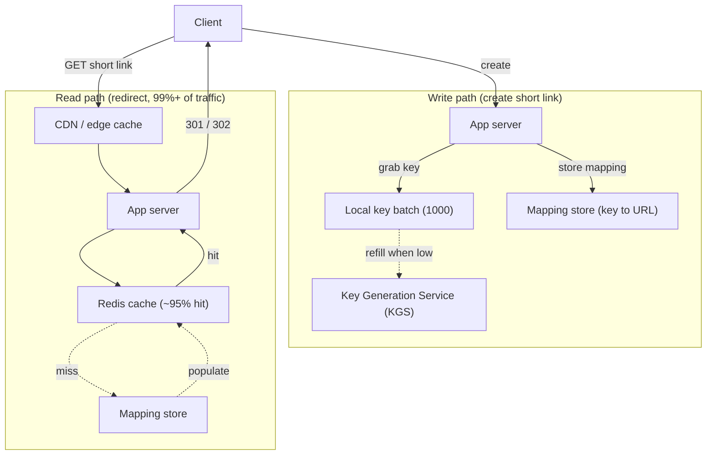
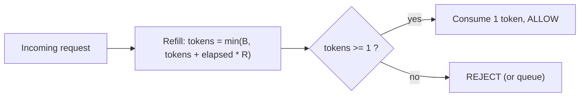
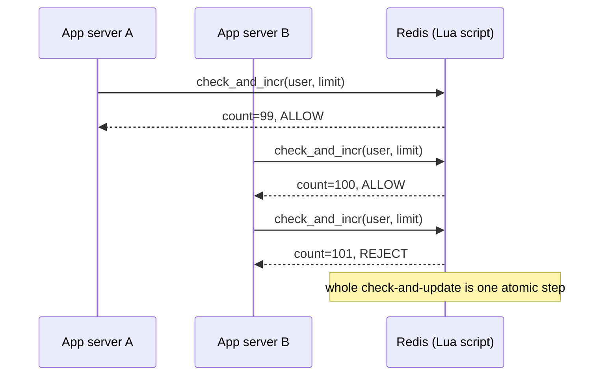
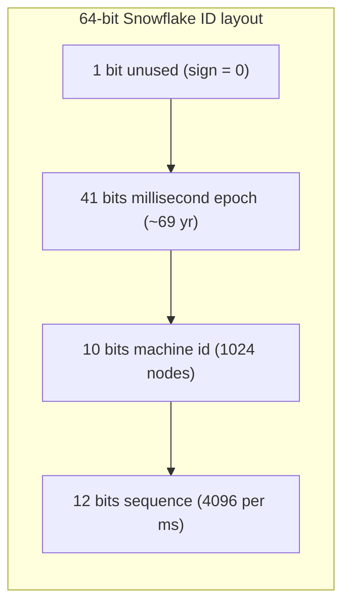
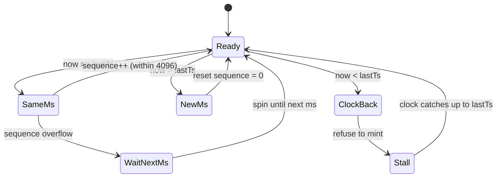

# Case Studies: URL Shortener, Rate Limiter & Distributed ID Generator

> Where this fits: the first three "warm-up" designs in any interview and the building blocks behind dozens of real services. They look trivial and are not — each hides a deep distributed-systems decision.
>
> **Principal-level takeaway:** These three problems are really *one* problem wearing three hats — **how do you produce a value (a short key, a token-count, an ID) at scale without coordinating on every request?** The junior reaches for a database row and a lock; the principal pre-allocates, batches, or encodes the answer so the hot path touches nothing shared. Coordination is the cost you are always trying to amortize away.

---

## ⚡ 60-Second TL;DR

- **Three warm-up designs, one problem:** produce a unique value at scale **without per-request coordination**.
- **URL shortener** is read-heavy (**~100:1**): immutable mappings → cache + CDN + 302 redirects; keys via **offline KGS batches**, not hash-truncate (birthday collisions ~1.9M keys).
- **Rate limiter** trades accuracy vs memory: **sliding-window counter** is the default (~0.003% error, 2 ints); **token bucket** for bursts. Enforce at the edge via one **atomic Lua script**.
- **Distributed IDs:** **Snowflake** (64-bit, k-sortable, compact) or **UUIDv7** (no machine-ID assignment); **UUIDv4** kills B-tree locality.
- **#1 trap:** backward **clock skew** mints duplicate Snowflakes — *stall, never emit*. Runner-up: `GET`-then-`SET` race lets two servers both allow request 100.

**Remember one thing:** Name the trade-off and the sacrificed correctness *before* you pick — pre-allocate, encode, or approximate to push coordination off the hot path.

## The Mental Model — first principles

Strip the three away and a single tension remains: **global properties demand global agreement, but global agreement is slow.**

- A URL shortener must produce keys that are *globally unique* — two requests can't get `abc123`. Uniqueness is global.
- A rate limiter must enforce *"100 requests/min per user"* — a global count, even though requests hit many servers.
- An ID generator must produce IDs that are *globally unique and roughly ordered* — again, properties that span the whole fleet.

The naive answer to all three is "one shared place that hands out the truth": a single Postgres row with `SELECT ... FOR UPDATE`, a single Redis `INCR`, a single counter. That works at small scale and falls over the instant you have real traffic, because every request now serializes through one contended resource. Throughput is capped by how fast that one thing can take a lock, and its failure takes everything down.

The entire art is **removing the per-request trip to the shared thing.** You do it three ways, and you'll see all three recur for the rest of the curriculum:

1. **Encode the answer** so it carries its own uniqueness (Snowflake stuffs a timestamp + machine ID + sequence into 64 bits — no lookup needed).
2. **Pre-allocate in batches** so 99% of requests are served from a local cache of pre-claimed values (ticket servers handing out ranges of 1,000 IDs).
3. **Approximate locally and reconcile** so each node enforces its own slice and they sync loosely (local rate-limit counters that gossip).

Hold that frame. Everything below is a variation on "how far can I push the coordination off the hot path, and what correctness do I give up to do it?"

For the deeper machinery, this chapter leans on [time and clocks](../02-distributed-systems/14-time-clocks-ordering.md), [consistency and CAP](../02-distributed-systems/12-consistency-and-cap.md), [caching](../01-building-blocks/06-caching.md), and [capacity estimation](../00-foundations/04-capacity-estimation.md).

---

## Core Concepts

### URL Shortener: the read-heavy encoding problem

The job: map a long URL to a short key (`bit.ly/3xR9kP`), store the mapping, and redirect on lookup. The defining characteristic is the **read/write ratio** — typically **100:1 or higher**. People share a link once and click it thousands of times. That single fact dictates the whole design: optimize ruthlessly for reads, tolerate slightly slower writes.

**Key generation** is the heart of it. Three approaches, in increasing sophistication:

*Hash + truncate.* Take `MD5` or `SHA-256` of the URL, base62-encode it, keep the first 7 characters. Simple and stateless. The problem: **collisions are inevitable** because you're truncating a wide hash (128- or 256-bit) down onto only ~3.5 trillion possible 7-char keys (62⁷ ≈ 3.52×10¹²). Birthday-paradox math means a ~50% collision chance arrives near √(62⁷) ≈ 1.9M keys — so at real scale you *will* hit two URLs that truncate to the same key. You handle it by checking the DB on insert and, on collision, appending a salt and re-hashing — which means a read-before-write on every creation. It also makes the *same* long URL map to the *same* key, which is sometimes desirable (dedup) and sometimes a privacy leak.

*Counter + base62.* Maintain a global monotonic counter; each new URL gets the next integer; base62-encode it into a string. `125` → `cb`, `10,000,000,000` → a 6-char key. **No collisions, ever** — the counter guarantees uniqueness. The catch is that the counter is now your coordination bottleneck, and sequential keys are *guessable* (key `N+1` follows key `N`), which leaks creation order and lets people enumerate everyone's links. Mitigate guessability by base62-encoding a *scrambled* counter (e.g., multiply by a large coprime mod the keyspace) so the sequence is dense but not obviously ordered. Be honest that this is obfuscation, not security — a coprime multiply is a bijection but trivially invertible, so if you actually need *unpredictable* keys, use a keyed format-preserving permutation (a small Feistel network over the keyspace) instead.

**Example: base62 encode/decode.** The encoding that turns a counter into a short key. Note that decode is the exact inverse of encode, and the alphabet ordering must stay fixed forever or old keys break.

```go
package base62

import (
	"fmt"
	"strings"
)

const alphabet = "0123456789ABCDEFGHIJKLMNOPQRSTUVWXYZabcdefghijklmnopqrstuvwxyz"

// Encode turns a non-negative integer into its base62 string.
func Encode(n uint64) string {
	if n == 0 {
		return string(alphabet[0])
	}
	var b strings.Builder
	for n > 0 {
		b.WriteByte(alphabet[n%62])
		n /= 62
	}
	// We built it least-significant-digit first; reverse in place.
	s := []byte(b.String())
	for i, j := 0, len(s)-1; i < j; i, j = i+1, j-1 {
		s[i], s[j] = s[j], s[i]
	}
	return string(s)
}

// Decode is the exact inverse of Encode.
func Decode(s string) (uint64, error) {
	var n uint64
	for i := 0; i < len(s); i++ {
		idx := strings.IndexByte(alphabet, s[i])
		if idx < 0 {
			return 0, fmt.Errorf("base62: invalid character %q", s[i])
		}
		n = n*62 + uint64(idx)
	}
	return n, nil
}
```

```java
public final class Base62 {
    private static final String ALPHABET =
        "0123456789ABCDEFGHIJKLMNOPQRSTUVWXYZabcdefghijklmnopqrstuvwxyz";

    public static String encode(long n) {
        if (n == 0) return String.valueOf(ALPHABET.charAt(0));
        StringBuilder sb = new StringBuilder();
        while (n > 0) {
            sb.append(ALPHABET.charAt((int) (n % 62)));
            n /= 62;
        }
        return sb.reverse().toString(); // built least-significant first
    }

    public static long decode(String s) {
        long n = 0;
        for (int i = 0; i < s.length(); i++) {
            int idx = ALPHABET.indexOf(s.charAt(i));
            if (idx < 0) {
                throw new IllegalArgumentException("base62: invalid character " + s.charAt(i));
            }
            n = n * 62 + idx;
        }
        return n;
    }
}
```

*Offline key generation (the production answer at scale).* A separate **Key Generation Service (KGS)** pre-computes a large pool of unique random 7-char keys *offline*, stores them in two tables — `unused_keys` and `used_keys` — and the app server just grabs the next unused key. This decouples key generation entirely from the write path. The KGS hands out keys in **batches** (e.g., 1,000 at a time) to each app server so a single key allocation isn't a network round-trip. The subtle bug: when an app server grabs a batch and crashes, those keys are lost — acceptable, because the keyspace is enormous (trillions). The KGS must mark keys as used *atomically* when it hands out a batch, or two servers get the same batch.



**Caching** is where reads are won. With a 100:1+ read ratio and a hot-key distribution (a viral link gets millions of hits), an LRU cache of the hottest links serves the overwhelming majority of traffic from memory. Mappings are **immutable** — once `abc123 → example.com/...` is set, it never changes — which makes caching gloriously easy: no invalidation problem, infinite TTLs are safe (see [caching](../01-building-blocks/06-caching.md) for why immutability is the cache designer's dream). Put a CDN in front for geographic locality.

**Redirect — 301 vs 302.** This is the question that separates people who've thought about it from people who haven't:

- **301 (Moved Permanently):** browsers and intermediaries *cache* the redirect. The next click on that short link may never reach your server — it jumps straight to the destination. Great for offloading traffic, **terrible if you want analytics** (you stop seeing clicks) or if you ever want to change or disable the destination.
- **302 (Found / temporary):** not cached by default. Every click hits your server, so you see every click and retain control. Costs you the traffic-offload benefit.

The principled choice: **302 if analytics and link control matter** (this is what bit.ly does — they sell analytics), **301 only if you want to be a dumb-fast redirector** and never need the data. Most commercial shorteners use 302 for exactly this reason.

**Custom aliases** (`bit.ly/my-brand`) are just user-supplied keys. They share the keyspace with generated keys, so you need a uniqueness check (atomic insert that fails if the key exists) and a profanity/reserved-word filter. **Analytics** is an asynchronous fire-and-forget write — never block the redirect on logging the click. Push click events to a [message queue](../01-building-blocks/11-messaging-and-streaming.md) and aggregate offline.

**Storage estimation.** Assume 100M new URLs/day. Each record ≈ 500 bytes (key + long URL + metadata). That's 50 GB/day, ~18 TB/year, ~180 TB over a 10-year retention. Modest — a sharded key-value store handles it easily (see [partitioning](../01-building-blocks/10-partitioning-sharding.md)). Reads at 100:1 mean ~10B reads/day ≈ **115K reads/sec average**, with peaks several times that — which is why caching, not storage, is the real engineering.

### Rate Limiter: counting in a window

The job: enforce "at most N requests per time window per client." It exists to protect backends from abuse, runaway clients, and thundering herds (it's a core [reliability](../02-distributed-systems/16-reliability-and-failure.md) tool). Five algorithms, each a different accuracy/memory trade-off:

**Fixed window counter.** Bucket time into fixed intervals (e.g., per-minute). Keep a counter per client per window; increment on each request; reject past N; reset at window boundary. One integer per client — tiny memory, trivial. **The flaw is the boundary burst:** a client can send N requests at 11:00:59 and N more at 11:01:00 — **2N requests in one second**, straddling the reset. The window's edge is a loophole.

**Sliding window log.** Store a timestamp for *every* request in a sorted set; on each new request, drop timestamps older than the window and count what remains. **Perfectly accurate** — no boundary burst. But memory grows with the *number of requests in the window per client* — bounded by the limit under normal traffic, but **unbounded if you log rejected attempts**, which is brutal under high volume or DDoS (an attacker inflates your memory just by being rejected).

**Sliding window counter.** The pragmatic hybrid everyone actually ships. Keep counts for the current and previous fixed window, then *interpolate* based on how far into the current window you are:

```
estimated = current_window_count
          + previous_window_count × (overlap fraction of previous window)

# e.g. 30s into a 60s window: weight last window's count by 0.5
rate = curr + prev * ((window - elapsed_in_curr) / window)
```

Two integers per client, no boundary burst, and the error is small (a few percent) under typical traffic. Cloudflare published that this approximation was within ~0.003% of the exact answer across their traffic — accurate enough that almost nobody needs the log.

**Token bucket.** A bucket holds up to `B` tokens, refilled at `R` tokens/sec. Each request consumes a token; empty bucket → reject (or queue). **Allows controlled bursts** up to `B` while bounding the long-run average to `R`. This is what most API gateways (Stripe, AWS) actually use because it matches how people reason about limits: "1000 req/min sustained, bursts to 2000." State per client: token count + last-refill timestamp — two numbers, lazily computed (you don't run a timer; on access you compute `tokens = min(B, tokens + elapsed × R)` — the `min(B, …)` cap is essential, or an idle client accumulates unlimited tokens and bursts past `B`).

**Leaky bucket.** Requests enter a fixed-size FIFO queue; a worker drains it at a constant rate. **Smooths output to a perfectly steady rate** — good when the *downstream* needs even pacing (e.g., a payment processor that can't be spiked). The cost: it *queues* rather than rejects, adding latency, and the queue can fill. Token bucket and leaky bucket are duals — token bucket permits bursts, leaky bucket forbids them.

> **Interactive:** [Token Bucket vs Leaky Bucket (interactive)](../animations/token-bucket.html) -- send a burst and watch the token bucket drain to empty then refill at rate R, while the leaky bucket paces output evenly.

> **Interactive:** [Rate-Limiting Windows (interactive)](../animations/rate-limit-windows.html) -- straddle the boundary with the fixed-window counter to reproduce the 2N burst, then switch to the sliding-window counter to see it disappear.

The token bucket is worth seeing as a flow. The key invariant is the `min(B, ...)` cap on refill — without it an idle client banks unlimited tokens.



**Example: a token-bucket rate limiter.** State is just `tokens` plus a `lastRefill` timestamp, refilled lazily on access. Both versions are safe for concurrent callers sharing one bucket.

```go
package ratelimit

import (
	"sync"
	"time"
)

// TokenBucket allows bursts up to capacity while bounding the
// long-run average to refillPerSec tokens/second.
type TokenBucket struct {
	mu           sync.Mutex
	capacity     float64
	refillPerSec float64
	tokens       float64
	lastRefill   time.Time
}

func NewTokenBucket(capacity, refillPerSec float64) *TokenBucket {
	return &TokenBucket{
		capacity:     capacity,
		refillPerSec: refillPerSec,
		tokens:       capacity, // start full
		lastRefill:   time.Now(),
	}
}

// Allow reports whether one request may proceed, consuming a token if so.
func (b *TokenBucket) Allow() bool {
	b.mu.Lock()
	defer b.mu.Unlock()

	now := time.Now()
	elapsed := now.Sub(b.lastRefill).Seconds()
	// The min(capacity, ...) cap is essential: an idle bucket must not
	// accumulate more than `capacity` tokens.
	b.tokens = min(b.capacity, b.tokens+elapsed*b.refillPerSec)
	b.lastRefill = now

	if b.tokens >= 1 {
		b.tokens--
		return true
	}
	return false
}

func min(a, b float64) float64 {
	if a < b {
		return a
	}
	return b
}
```

```java
import java.util.concurrent.locks.ReentrantLock;

// Allows bursts up to capacity while bounding the long-run average
// to refillPerSec tokens/second. Safe for concurrent callers.
public final class TokenBucket {
    private final double capacity;
    private final double refillPerSec;
    private double tokens;
    private long lastRefillNanos;
    private final ReentrantLock lock = new ReentrantLock();

    public TokenBucket(double capacity, double refillPerSec) {
        this.capacity = capacity;
        this.refillPerSec = refillPerSec;
        this.tokens = capacity; // start full
        this.lastRefillNanos = System.nanoTime();
    }

    public boolean allow() {
        lock.lock();
        try {
            long now = System.nanoTime();
            double elapsedSec = (now - lastRefillNanos) / 1_000_000_000.0;
            // The Math.min cap is essential: an idle bucket must not
            // accumulate more than `capacity` tokens.
            tokens = Math.min(capacity, tokens + elapsedSec * refillPerSec);
            lastRefillNanos = now;

            if (tokens >= 1.0) {
                tokens -= 1.0;
                return true;
            }
            return false;
        } finally {
            lock.unlock();
        }
    }
}
```

**Distributed rate limiting** is where it gets hard. Your limit is per-*user* but requests hit *many* servers. Two strategies:

- **Centralized counter (Redis).** Every server hits a shared Redis. Accurate, simple, but adds a network round-trip per request and makes Redis a SPOF and a hot shard. `INCR` itself is atomic, but the *decision* ("am I over the limit?") plus the update is a read-modify-write that must also be atomic — a naive `GET`-check-then-`SET` lets two servers both read 99 and both allow the 100th request. Fold the whole check-and-increment (and, for sliding-window or token-bucket math, the windowing) into **one atomic Lua script** so it executes as a single step. This is the default and it's fine up to surprisingly high scale.
- **Local + sync.** Each server enforces a *local* slice of the budget (limit/N servers) and they periodically reconcile, or each keeps its own counters and gossips. Zero hot-path latency, but **less accurate** — you may allow up to ~2× the limit transiently, and a hot user landing on one server gets a too-small local slice. Use this only when the Redis round-trip genuinely hurts (single-digit-ms p99 budgets) and approximate enforcement is acceptable.

The atomicity requirement is the whole game. Folding check-and-increment into one Lua script means two servers can never both read `99` and both allow request 100:



**Where to enforce:** as early as possible — at the **API gateway / load balancer edge**, before requests consume backend resources. Stopping abuse at the front door is the whole point; rate-limiting *after* you've done the work defeats the purpose.

### Distributed Unique ID: encoding uniqueness into bits

The requirements, in priority order: **(1) globally unique**, **(2) roughly time-sortable** (so IDs cluster by creation time — huge for database locality and "fetch recent" queries), **(3) generated without per-request coordination**, and ideally **(4) compact**. These tensions are real: a pure random ID (UUIDv4) trivially gives you 1 and 3 but destroys 2.

**UUIDv4** — 122 random bits. Effectively zero collision probability, zero coordination, fully decentralized. But it's **not sortable** (random), and as a database primary key it's a disaster for B-tree indexes: each insert lands at a random spot in the index, causing page splits and cache thrashing. Inserting random UUIDs into a clustered index can be **several times slower** than sequential keys (this is why MySQL/InnoDB users dread random UUID PKs). 128 bits is also bulky.

**UUIDv7** (standardized in RFC 9562, 2024) fixes the big problem: it leads with a **48-bit Unix-millisecond timestamp**, then random bits. Now it's **time-sortable** and index-friendly while keeping the decentralized, no-coordination property. If you want a UUID today and control the stack, **v7 is the modern default.**

**Twitter Snowflake** — the canonical design, 64 bits laid out as:



Each node generates IDs locally with **no coordination**: timestamp from its clock, a configured machine ID (so no two nodes collide), and a per-millisecond sequence counter (so one node can mint 4096 IDs/ms = ~4M/sec). The leading timestamp makes IDs **k-sortable** (sortable to within clock skew). 64 bits fits a `BIGINT` — half the size of a UUID. This is why Snowflake-style IDs are everywhere: Discord, Instagram (a variant), and most large systems use it or a close cousin.

> **Interactive:** [Consistent Hashing (interactive)](../animations/consistent-hashing.html) -- add and remove nodes to see how a sharded mapping store (or a partitioned ID-range allocator) keeps key movement proportional to the change rather than reshuffling everything.

**Database ticket servers** — the pre-allocation approach. A central DB hands out ID *ranges*: a server asks for the next block, gets `[1,000,000 – 1,000,999]`, and serves 1,000 IDs locally before asking again. Flickr famously used two MySQL servers with `auto_increment` offset (one does odd, one does even) for HA. Simple, sortable, but the ticket server is a coordination point — mitigated by large batches, just like the URL shortener's KGS. Note the same crash-loses-a-batch trade-off (gaps in the sequence, which is fine).

**ULID** — 128 bits: 48-bit timestamp + 80 random bits, **Crockford base32-encoded** into a 26-char string that's lexicographically sortable as text. Think "UUIDv7's idea, but a sortable string." Popular when you want a human-pasteable, URL-safe, sortable ID.

**Clock skew** is the lurking failure for every timestamp-leading scheme (Snowflake, v7, ULID). If a node's clock **jumps backward** (NTP correction, leap second, VM migration), it can mint an ID with a timestamp it already used → duplicate sequence → **collision**. Defenses: (1) refuse to generate IDs while the clock is behind the last-seen timestamp (better to stall than collide), (2) use a **monotonic clock** for the sequence portion, (3) detect skew and alert. This is the single most important thing juniors miss about Snowflake, and it's why [time and clocks](../02-distributed-systems/14-time-clocks-ordering.md) is required reading.

The generator is a small state machine. The three branches a correct implementation must handle: same millisecond (bump the sequence, spin if it overflows 4096), new millisecond (reset the sequence), and a backward clock jump (refuse to mint).



**Example: a Snowflake-style 64-bit ID generator.** Layout is `timestamp | machine | sequence`, with explicit clock-rollback handling that stalls rather than risks a duplicate.

```go
package snowflake

import (
	"errors"
	"sync"
	"time"
)

const (
	epochMillis  = 1288834974657 // Twitter's custom epoch (2010-11-04)
	machineBits  = 10
	sequenceBits = 12
	maxMachine   = -1 ^ (-1 << machineBits)  // 1023
	maxSequence  = -1 ^ (-1 << sequenceBits) // 4095
)

type Generator struct {
	mu        sync.Mutex
	machineID int64
	lastTs    int64
	sequence  int64
}

func NewGenerator(machineID int64) (*Generator, error) {
	if machineID < 0 || machineID > maxMachine {
		return nil, errors.New("snowflake: machine id out of range")
	}
	return &Generator{machineID: machineID, lastTs: -1}, nil
}

func nowMillis() int64 { return time.Now().UnixMilli() }

// Next returns the next ID, or an error if the clock has moved backward.
func (g *Generator) Next() (int64, error) {
	g.mu.Lock()
	defer g.mu.Unlock()

	ts := nowMillis()
	if ts < g.lastTs {
		// Clock rolled back: stall rather than risk a duplicate.
		return 0, errors.New("snowflake: clock moved backward, refusing to mint")
	}

	if ts == g.lastTs {
		g.sequence = (g.sequence + 1) & maxSequence
		if g.sequence == 0 { // sequence exhausted this millisecond
			for ts <= g.lastTs { // spin until the next millisecond
				ts = nowMillis()
			}
		}
	} else {
		g.sequence = 0
	}
	g.lastTs = ts

	id := ((ts - epochMillis) << (machineBits + sequenceBits)) |
		(g.machineID << sequenceBits) |
		g.sequence
	return id, nil
}
```

```java
public final class SnowflakeGenerator {
    private static final long EPOCH_MILLIS = 1288834974657L; // 2010-11-04
    private static final int MACHINE_BITS = 10;
    private static final int SEQUENCE_BITS = 12;
    private static final long MAX_MACHINE = ~(-1L << MACHINE_BITS);   // 1023
    private static final long MAX_SEQUENCE = ~(-1L << SEQUENCE_BITS); // 4095

    private final long machineId;
    private long lastTs = -1L;
    private long sequence = 0L;

    public SnowflakeGenerator(long machineId) {
        if (machineId < 0 || machineId > MAX_MACHINE) {
            throw new IllegalArgumentException("machine id out of range");
        }
        this.machineId = machineId;
    }

    // Returns the next ID. Synchronized so concurrent callers serialize.
    public synchronized long next() {
        long ts = System.currentTimeMillis();
        if (ts < lastTs) {
            // Clock rolled back: stall rather than risk a duplicate.
            throw new IllegalStateException("clock moved backward, refusing to mint");
        }

        if (ts == lastTs) {
            sequence = (sequence + 1) & MAX_SEQUENCE;
            if (sequence == 0) {            // sequence exhausted this millisecond
                while (ts <= lastTs) {      // spin until the next millisecond
                    ts = System.currentTimeMillis();
                }
            }
        } else {
            sequence = 0;
        }
        lastTs = ts;

        return ((ts - EPOCH_MILLIS) << (MACHINE_BITS + SEQUENCE_BITS))
                | (machineId << SEQUENCE_BITS)
                | sequence;
    }
}
```

---

## Trade-offs at a Glance

**URL key generation:**

| Approach | Collisions | Coordination | Guessable? | Best when |
|---|---|---|---|---|
| Hash + truncate | Yes (handle on insert) | Read-before-write | No | Want same-URL→same-key dedup |
| Counter + base62 | Never | Counter is bottleneck | Yes (sequential) | Small/medium scale, simple |
| Offline KGS | Never | Batched (off hot path) | No (random pool) | High scale, production default |

**Rate-limiting algorithms:**

| Algorithm | Memory/client | Boundary burst? | Allows bursts? | Use when |
|---|---|---|---|---|
| Fixed window | 1 int | **Yes (2N)** | No | Cheapest, accuracy doesn't matter |
| Sliding window log | O(reqs in window) | No (exact) | No | Need perfect accuracy, low volume |
| Sliding window counter | 2 ints | No (≈exact) | No | **Default — best balance** |
| Token bucket | 2 numbers | No | **Yes, up to B** | API limits with burst tolerance |
| Leaky bucket | queue | No | No (smooths) | Downstream needs steady pacing |

**Distributed ID schemes:**

| Scheme | Bits | Sortable? | Coordination | Notes |
|---|---|---|---|---|
| UUIDv4 | 128 | No | None | Index-unfriendly as PK |
| UUIDv7 | 128 | Yes | None | Modern default, RFC 9562 |
| Snowflake | 64 | k-sortable | Machine-ID assignment only | Compact, clock-skew sensitive |
| Ticket server | 64 | Yes | Batched DB calls | Central component, HA via offset |
| ULID | 128 | Yes (as string) | None | URL-safe sortable string |

---

## How Real Systems Do It

- **bit.ly** uses 302 redirects (temporary) specifically to capture every click for analytics — their business *is* the analytics — and serves redirects from a heavily cached, sharded key-value layer.
- **Cloudflare's rate limiter** uses the **sliding window counter** approximation and published that it tracked the exact sliding-window-log answer within ~0.003% error on production traffic, at a fraction of the memory — the empirical justification for skipping the log.
- **Stripe and most API gateways** use **token bucket** semantics ("you may burst, but your sustained rate is R") because it matches how customers reason about limits.
- **Twitter** built Snowflake to move ID generation off a contended database; **Instagram** uses a Postgres-based variant (timestamp + shard ID + per-shard sequence baked into a `bigint` via a stored procedure). **Discord** stores Snowflakes everywhere and even derives creation time by extracting the timestamp bits.
- **Flickr** ran the classic two-MySQL-server ticket scheme (odd/even auto-increment offsets) for HA ID generation.
- **DynamoDB / Cassandra** lean on application-supplied UUIDs/Snowflakes rather than auto-increment, because a monotonic counter can't be partitioned without coordination — a direct consequence of the [CAP](../02-distributed-systems/12-consistency-and-cap.md) trade-offs.

---

## Failure Modes & Common Misconceptions

- **Myth: "Just use auto-increment in the database."** It doesn't survive sharding (each shard restarts at 1, or you need a global sequence = coordination bottleneck), it leaks volume to competitors, and the single sequence is a write hotspot. Auto-increment is fine for one box and wrong for a fleet.
- **Myth: "Hash the URL and you're done."** Truncating a hash *will* collide at scale (birthday paradox). You still need a uniqueness check and a collision-resolution path.
- **Myth: "Snowflake/UUIDv7 timestamps make IDs perfectly ordered."** They're *k-sortable* — ordered only to within clock skew and only across nodes whose clocks agree. Two IDs minted in the same millisecond on different nodes have no guaranteed order. Never use ID order as a substitute for a real ordering mechanism when correctness depends on it.
- **Clock-skew duplicates:** the production Snowflake bug. A backward clock jump re-uses timestamps and can mint duplicate IDs. Always stall (refuse to generate) rather than emit a possibly-duplicate ID.
- **Rate-limit race condition:** naive `GET`-then-`SET` on a shared counter lets two servers both read 99 and both allow the 100th request. The mutation must be atomic: a simple fixed-window limiter can use `INCR` and compare its returned value; sliding-window-counter and token-bucket logic need a Lua script so the whole check-and-update runs as one step.
- **301 kills analytics:** ship a 301 "for performance," and clicks stop reaching your server because browsers cache the redirect — your analytics silently go to zero and you can't disable a malicious link. Many teams learn this the hard way.
- **DDoS via the sliding-window log:** an attacker who gets *rejected* still costs you memory if you log every attempt's timestamp. Approximate algorithms bound your memory regardless of attacker volume.
- **Forgetting the read/write asymmetry:** treating a URL shortener as a balanced CRUD app and not caching reads is the classic over-engineering-the-wrong-thing mistake.

---

## In a Design Discussion

**Junior take:** "I'll store URLs in a table with an auto-increment ID, base62-encode the ID for the short key, do a `SELECT` on redirect, and add a counter in the DB for rate limiting." Every choice routes through the database; nothing is cached; the counter and the sequence are both single points of contention; redirect-type, clock skew, and the read/write ratio never come up.

**Principal take:** "What's the read/write ratio? ~100:1, so this is a caching problem, not a storage problem — immutable mappings mean infinite-TTL caching with a CDN front. For keys I'll use an offline KGS handing out batches so key generation never touches the hot path; I'll accept losing a batch on crash because the keyspace is trillions. 302 redirects because we want analytics — clicks go async to a queue. For rate limiting I'll start with a centralized Redis sliding-window-counter via an atomic Lua script at the gateway, and only move to local+sync if the round-trip blows our p99 budget, accepting ~2× transient overshoot. For IDs, Snowflake if I need 64-bit compactness and roughly sorted IDs, with explicit clock-skew handling that *stalls* rather than risks duplicates; UUIDv7 if I'd rather avoid machine-ID assignment entirely."

The difference isn't knowledge of more options — it's **naming the trade-off before picking**, quantifying the ratio, and being explicit about what correctness is sacrificed (batch loss, transient overshoot, k-sortability). That's the [trade-off reasoning](../05-principal-skills/29-tradeoffs-and-adrs.md) the whole curriculum builds toward, structured by the [design framework](./21-interview-framework.md).

---

## Self-Check

1. **Why does a 100:1 read/write ratio change the URL shortener's architecture?**
   <details><summary>Answer</summary>It makes the system a read/cache problem, not a write/storage problem. Mappings are immutable, so aggressive caching (Redis + CDN, long TTLs) serves the bulk of traffic from memory; the DB and key generation move off the hot path.</details>

2. **You ship 301 redirects to reduce server load. What breaks?**
   <details><summary>Answer</summary>Browsers cache the 301, so subsequent clicks bypass your server — your click analytics drop toward zero and you lose the ability to change or disable a destination. Use 302 when you need analytics or control.</details>

3. **Why is the fixed-window rate limiter exploitable, and what's the cheap fix?**
   <details><summary>Answer</summary>A client can send N requests just before the window resets and N just after — 2N in a short span across the boundary. The cheap fix is the sliding-window counter: weight the previous window's count by its overlap fraction, eliminating the boundary burst with just two integers.</details>

4. **Why not use a single shared counter for distributed IDs?**
   <details><summary>Answer</summary>Every ID requires a round-trip to one contended resource — it's a throughput bottleneck and a SPOF, and it can't be partitioned without reintroducing coordination. Snowflake/UUIDv7 encode uniqueness locally (timestamp + machine + sequence) so no coordination is needed per ID.</details>

5. **What's the difference between "unique" and "sortable" for IDs, and why might you sacrifice sortability?**
   <details><summary>Answer</summary>UUIDv4 is unique but random (not sortable), which kills B-tree index locality on inserts. Timestamp-leading schemes (UUIDv7, Snowflake, ULID) are roughly sortable, giving index/locality benefits and cheap "recent" queries — but only k-sortable, accurate to within clock skew.</details>

6. **A Snowflake node's clock jumps backward 50ms. What's the danger and the correct response?**
   <details><summary>Answer</summary>It may re-use a timestamp it already used, producing duplicate (timestamp, machine, sequence) IDs. The correct response is to *stall* — refuse to generate IDs until the clock catches up — rather than risk a collision.</details>

7. **When would you choose local+sync rate limiting over a centralized Redis counter?**
   <details><summary>Answer</summary>When the per-request Redis round-trip violates a tight latency budget (single-digit-ms p99) and you can tolerate approximate enforcement (transient overshoot up to ~2× the limit). Otherwise the centralized atomic counter is simpler and more accurate.</details>

8. **Why does the offline KGS hand out keys in batches, and what's the cost?**
   <details><summary>Answer</summary>Batching (e.g., 1,000 keys per server) avoids a network round-trip per URL creation, keeping key allocation off the hot path. The cost: a server crash loses its unused batch — acceptable because the keyspace (trillions) makes the leak negligible.</details>

---

## Go Deeper

- **Designing Data-Intensive Applications** — Ch. 5 (replication & sortable IDs), Ch. 6 (partitioning, why monotonic keys hotspot), Ch. 8–9 (clocks, "unreliable clocks," and why timestamp-based IDs are dangerous). The clock-skew discussion is directly load-bearing here.
- **RFC 9562** — "Universally Unique IDentifiers (UUIDs)," which standardizes UUIDv7 and the sortable timestamp layout (2024, obsoletes RFC 4122).
- **Twitter Snowflake** — the original announcement and source; study the exact 41/10/12 bit layout and the sequence-rollover/clock-skew handling.
- **Cloudflare blog: "How we built rate limiting capable of scaling to millions of domains"** — the empirical case for the sliding-window-counter approximation (~0.003% error).
- **Instagram Engineering: "Sharding & IDs at Instagram"** — the Postgres-based Snowflake variant baked into a stored procedure.
- **Flickr: "Ticket Servers: Distributed Unique Primary Keys on the Cheap"** — the two-MySQL odd/even auto-increment scheme.
- **ULID spec** (github.com/ulid/spec) — the 48+80-bit layout and Crockford base32 encoding.
- Sibling chapters: [caching](../01-building-blocks/06-caching.md), [partitioning & sharding](../01-building-blocks/10-partitioning-sharding.md), [time, clocks & ordering](../02-distributed-systems/14-time-clocks-ordering.md), [consistency & CAP](../02-distributed-systems/12-consistency-and-cap.md), [reliability](../02-distributed-systems/16-reliability-and-failure.md), and the [design framework](./21-interview-framework.md). Root index: [../README.md](../README.md) · Roadmap: [../ROADMAP.md](../ROADMAP.md).
