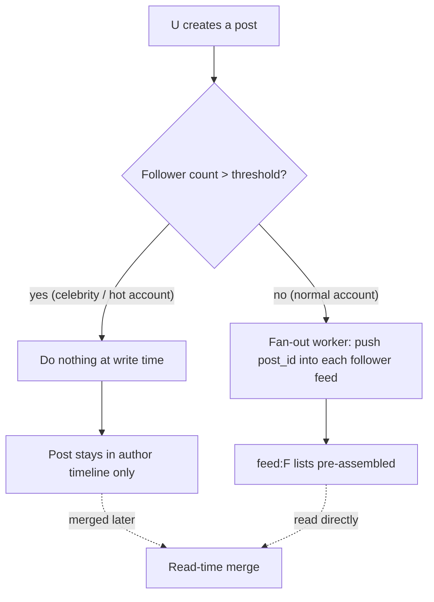
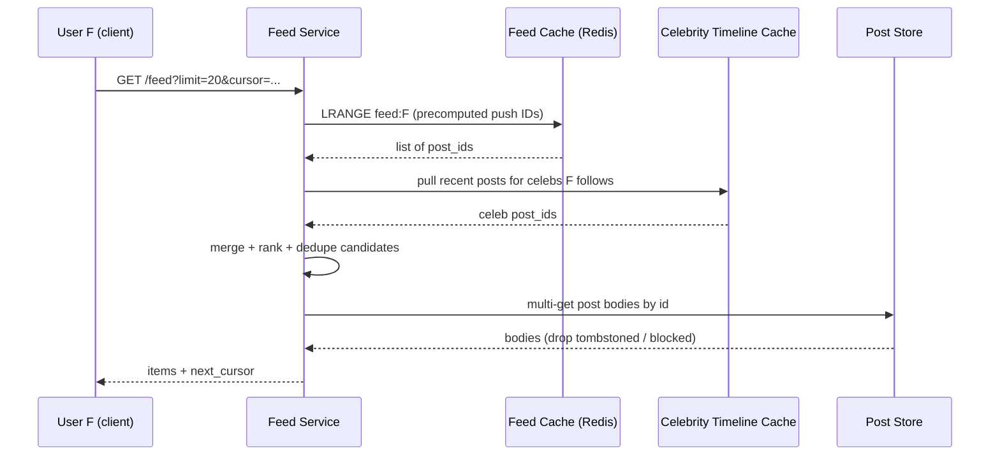
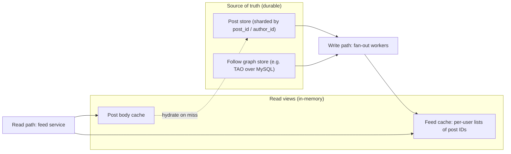
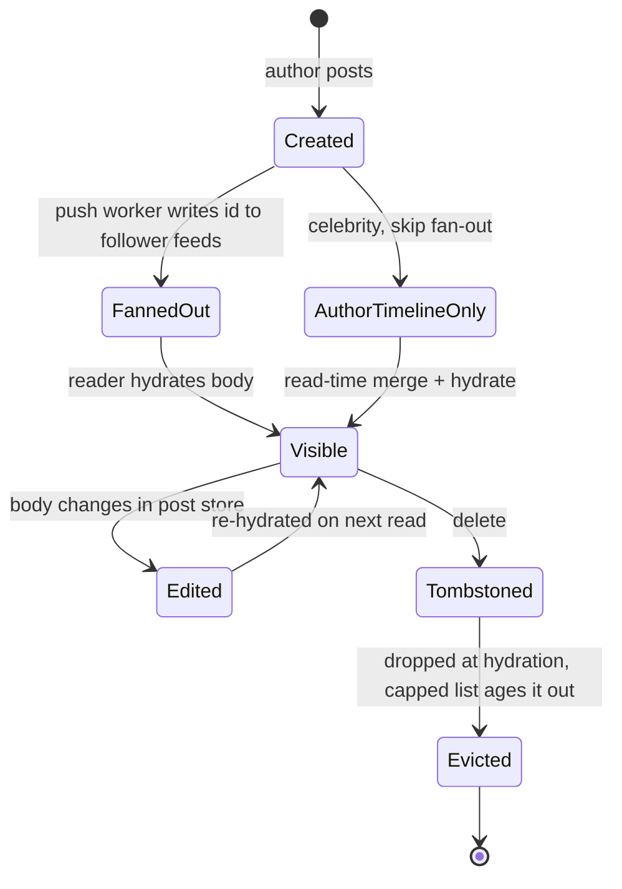

# Case Study: News Feed / Social Timeline

> Where this fits: this is the canonical **read-heavy** system design problem — the place where you stop thinking "how do I store data" and start thinking "how do I shape data for the read path." It pulls together caching, partitioning, replication, and consistency into one decision.
>
> **Principal-level takeaway:** There is no single "feed architecture." The defining decision is *when you pay the cost of assembling a feed* — at write time (fan-out-on-write / push), at read time (fan-out-on-read / pull), or a deliberate split between the two (hybrid). Everything else — storage, caching, ranking — is downstream of that one trade-off, and the correct answer for almost every real system at scale is **hybrid**, because the follower-count distribution is power-law, not uniform.

---

## ⚡ 60-Second TL;DR

- **What/why:** the canonical **read-heavy** problem (~**100:1** reads:writes) — shape data for the read path, not just storage.
- **Fan-out-on-write (push):** precompute each follower's feed; cheap reads, write cost **O(followers)** — explodes for celebrities.
- **Fan-out-on-read (pull):** assemble at read time; cheap writes, but scatter-gather reads on the hottest path.
- **Hybrid (the real answer):** push for normal accounts, pull + read-merge for celebs above a tuned threshold — the graph is **power-law**, not uniform.
- **#1 trap:** pure push — celebrity tail = fan-out storm; also store **post IDs, not bodies** (~50-100× RAM blowup otherwise).
- **Must-knows:** cap feeds ~**800** entries; **cursor** pagination (never OFFSET); deletes filtered at read-time hydration, never chased; **p99 < ~200ms**.

**Remember one thing:** The defining choice is *when* you pay to assemble the feed — write, read, or split — and the power-law graph forces hybrid.

## The Mental Model — first principles

Strip away the product. A news feed is one question asked billions of times a day: *"Given that user U follows a set of accounts, show me the recent posts from those accounts, in some order."*

Two facts make this hard, and they are both about **asymmetry**:

1. **The read/write ratio is enormous.** People scroll far more than they post. A typical large social network sees something like 100:1 to 1000:1 reads-to-writes — a user opens the app dozens of times a day and posts maybe once. So your design should be willing to do *more work on writes* if it makes *reads cheap*. That instinct — trade write cost for read cost — is the seed of fan-out-on-write.

2. **The social graph is power-law, not uniform.** Most accounts have a few hundred followers. A tiny number — celebrities, brands, news outlets — have tens of millions. The mean follower count is meaningless; the distribution has a heavy tail. Any design that treats all users the same will be destroyed by the tail. That single fact is why the elegant pure-push design breaks and why every real system ends up hybrid.

The naive feed is trivial to write and catastrophic to run:

```sql
-- The query every beginner writes. Correct. Unscalable.
SELECT * FROM posts
WHERE author_id IN (SELECT followee_id FROM follows WHERE follower_id = :me)
ORDER BY created_at DESC
LIMIT 20;
```

This is **fan-out-on-read** in its rawest form. It works beautifully at 10,000 users and falls over at 10 million, because at read time — on the hottest path in the system — you do a massive `IN` query across a sharded posts table, sort potentially thousands of candidate posts, and do it again for every scroll. The entire field of feed design is the search for ways to *not run this query on the read path.*

The feed is also a system where **you are allowed to be wrong for a few seconds**. If your bank balance is stale, that's a bug. If your feed is missing a post your friend made 800ms ago, nobody notices, and nobody is harmed. This relaxed consistency requirement (see [Consistency Models, CAP & PACELC](../02-distributed-systems/12-consistency-and-cap.md)) is what *unlocks* aggressive precomputation and caching. Hold that thought; it's load-bearing.

---

## Core Concepts

### Requirements: scope it before you architect it

Pin the requirements before touching boxes-and-arrows. Functional core:

- **Post**: a user creates content (text/media). Append-only, immutable in the common case.
- **Follow**: an asymmetric edge (`follower -> followee`). Twitter/Instagram-style follow, not Facebook-style mutual friendship — the asymmetry matters because it makes the graph more skewed.
- **Generate feed**: return a ranked, paginated list of recent posts from followees.

Non-functional, and these *drive* the design:

- **Read-heavy** (~100–1000:1). Optimize the read path.
- **Latency**: feed open should feel instant — target **p99 under ~200ms** server-side.
- **Eventual consistency is acceptable**: a few seconds of staleness is fine.
- **Availability over consistency** *when a partition forces the choice* (the AP lean in CAP terms): a feed that's slightly stale beats a feed that errors. And note the PACELC corollary — even with no partition, you're trading consistency for *latency*, which is exactly why aggressive caching is acceptable here.
- **Scale**: assume hundreds of millions of users; we'll size it below.

Explicitly out of scope for a first pass: the ranking ML model internals, abuse/spam, ads insertion, media transcoding. Naming what you're *not* solving is itself a principal-level move — it shows you can manage scope. (See [The System Design Framework](../04-design-case-studies/21-interview-framework.md).)

### Fan-out-on-write (push): precompute every follower's feed

The idea: when U posts, **immediately** push that post's reference into a precomputed feed list for *each* of U's followers. Reads then become a single cheap lookup of an already-assembled list.

```
U posts ──► fan-out worker ──► for each follower F of U:
                                  LPUSH feed:F  post_id
                                  LTRIM feed:F  0 799   # cap at ~800 entries
```

Each user has a materialized "feed cache" — typically a Redis list of post IDs (not full posts; you hydrate post bodies from a separate store). Reading the feed is then `LRANGE feed:F 0 19` — O(1)-ish, sub-millisecond. This is gorgeous on the read path.

The fan-out worker itself is small, and the hybrid lives inside it as a single guard: if the author is a celebrity, skip the push entirely and let the read-time merge handle it. Here it is end to end — pulling the author's followers, checking the celebrity threshold, and pushing the post id into each follower's capped feed list.

**Fan-out-on-write worker with hybrid celebrity skip**

```go
package feed

import (
	"context"
	"fmt"

	"github.com/redis/go-redis/v9"
)

const (
	celebrityThreshold = 1_000_000 // tunable; set from real follower-count data
	feedCap            = 800       // max entries kept per user feed
)

type Store interface {
	// FollowerCount returns the author's total follower count.
	FollowerCount(ctx context.Context, authorID string) (int64, error)
	// Followers streams follower IDs in batches to bound memory.
	Followers(ctx context.Context, authorID string, batch int) (<-chan []string, <-chan error)
}

type FanoutWorker struct {
	store Store
	rdb   *redis.Client
}

func NewFanoutWorker(store Store, rdb *redis.Client) *FanoutWorker {
	return &FanoutWorker{store: store, rdb: rdb}
}

// Fanout pushes postID into every follower's feed, unless the author is a
// celebrity — in which case it does nothing and the read path merges the
// post in at read time (the hybrid).
func (w *FanoutWorker) Fanout(ctx context.Context, authorID, postID string) error {
	n, err := w.store.FollowerCount(ctx, authorID)
	if err != nil {
		return fmt.Errorf("follower count: %w", err)
	}
	if n > celebrityThreshold {
		// Hybrid skip: celebrity post is pulled & merged at read time.
		return nil
	}

	batches, errc := w.store.Followers(ctx, authorID, 10_000)
	for {
		select {
		case <-ctx.Done():
			return ctx.Err()
		case batch, ok := <-batches:
			if !ok {
				return <-errc // nil on clean completion
			}
			if err := w.pushBatch(ctx, batch, postID); err != nil {
				return err
			}
		}
	}
}

func (w *FanoutWorker) pushBatch(ctx context.Context, followers []string, postID string) error {
	pipe := w.rdb.Pipeline()
	for _, f := range followers {
		key := "feed:" + f
		pipe.LPush(ctx, key, postID)
		pipe.LTrim(ctx, key, 0, feedCap-1) // keep only the newest feedCap entries
	}
	_, err := pipe.Exec(ctx)
	return err
}
```

```java
package feed;

import java.util.List;
import redis.clients.jedis.JedisPooled;
import redis.clients.jedis.Pipeline;

public class FanoutWorker {

    private static final long CELEBRITY_THRESHOLD = 1_000_000L; // tunable
    private static final int  FEED_CAP            = 800;        // entries per feed
    private static final int  BATCH               = 10_000;

    public interface Store {
        long followerCount(String authorId);
        // Streams follower IDs in bounded batches; an empty list signals end.
        Iterable<List<String>> followers(String authorId, int batch);
    }

    private final Store store;
    private final JedisPooled redis;

    public FanoutWorker(Store store, JedisPooled redis) {
        this.store = store;
        this.redis = redis;
    }

    /**
     * Pushes postId into every follower's feed, unless the author is a
     * celebrity — in which case it does nothing and the read path merges the
     * post in at read time (the hybrid).
     */
    public void fanout(String authorId, String postId) {
        if (store.followerCount(authorId) > CELEBRITY_THRESHOLD) {
            return; // hybrid skip: pulled & merged at read time
        }
        for (List<String> batch : store.followers(authorId, BATCH)) {
            pushBatch(batch, postId);
        }
    }

    private void pushBatch(List<String> followers, String postId) {
        try (Pipeline pipe = redis.pipelined()) {
            for (String f : followers) {
                String key = "feed:" + f;
                pipe.lpush(key, postId);
                pipe.ltrim(key, 0, FEED_CAP - 1); // keep newest FEED_CAP entries
            }
            pipe.sync();
        }
    }
}
```

**The cost lives on the write path, and it's proportional to follower count.** If U has 200 followers, one post = 200 list writes. Fine. If U has 50 million followers, one post = 50 million writes. That's the **celebrity problem**, and it's not a corner case — it's the entire reason pure push doesn't ship.

Concretely: 50M writes for one tweet, even at a comfortable 100k writes/sec per shard fanned across many shards, is a multi-second-to-minutes fan-out storm that hammers your queue and your cache, delays the post appearing for *everyone*, and amplifies write load by the celebrity's follower count on every single post. Worse, it's **wasteful**: you precompute feed entries for tens of millions of inactive users who won't open the app today. You're paying to write into dead mailboxes.

Push wins when: follower counts are bounded and modest, reads dominate, and you want the simplest possible read path.

### Fan-out-on-read (pull): assemble at read time

The inverse. Store nothing precomputed. When F opens the feed, look up who F follows, fetch each followee's recent posts, merge, sort, return. This is the naive SQL query above, made respectable with per-author caches.

**The cost lives on the read path, and it's proportional to followee count and read frequency.** Pull is *cheap on writes* (a post is just one insert into the author's own timeline) — which is exactly what you want for a celebrity, whose post should be written once and read by whoever asks. But it's *expensive on reads* for normal users: every feed open does a scatter-gather across all followees' timelines, repeated for every scroll, for the most-trafficked endpoint you own.

Pull wins when: the user follows few accounts, or follows celebrities (whose posts you'd never want to fan out), or for inactive users where precomputing was wasted effort.

### The hybrid: the answer almost everyone lands on

The power-law graph means push and pull are each right for *different edges of the same graph*. So split:

- **Push (fan-out-on-write)** for the vast majority of accounts — the "normal" users with bounded follower counts. Their posts are precomputed into followers' feeds.
- **Pull (fan-out-on-read)** for **celebrity / hot users** above a follower threshold (the number is tunable — think order of tens of thousands to ~1M). Their posts are *not* fanned out. Instead, at read time, the feed service merges the precomputed (push) feed with a freshly-pulled set of recent posts from the small number of celebrities the reader follows.

The write-side decision — push for normal accounts, skip fan-out for celebrities — is a single branch on follower count:



The read path then stitches the two sources together for user F: read the precomputed push feed, pull the handful of celebrity timelines F follows, merge, rank, and hydrate.



> **Interactive:** [Feed Fan-out: Push vs Pull (interactive)](../animations/feed-fanout.html) -- slide the follower-count threshold and watch where the fan-out work lands on the write path versus the read path.

The genius is that "the celebrities a user follows" is a **tiny set** — even a heavy user follows only a handful of mega-accounts — so the read-time pull merges a handful of timelines, not thousands. You get push's cheap reads for the bulk of content and pull's cheap writes for the accounts that would otherwise blow up fan-out. The threshold is a tuning knob you set with real data, not a constant.

### Feed storage and caching

Two distinct stores, and conflating them is a classic mistake:

1. **The source of truth (posts + graph)**: durable, partitioned. Posts in a sharded store keyed by `post_id` or `author_id` (Cassandra, sharded MySQL, DynamoDB). The follow graph in its own store (often a separate, heavily-cached service; Facebook's TAO is the famous example). See [Partitioning & Sharding](../01-building-blocks/10-partitioning-sharding.md) and [NoSQL & Choosing a Data Model](../01-building-blocks/08-databases-nosql.md).

2. **The feed cache (materialized read view)**: per-user lists of **post IDs**, in memory (Redis/Memcached). Store IDs, not bodies — a post body might be referenced in millions of feeds; storing the body in each is insane duplication. Store the 8-byte ID and hydrate the body from a separate, heavily-cached post store at read time (a multi-get). Cap each feed at a few hundred entries (~800 is a real Twitter number) — nobody scrolls past that, and unbounded lists eat memory.

Read assembly = `LRANGE` the ID list -> batch-fetch post bodies from the post cache -> filter (blocks, deleted) -> rank -> return. The expensive sort/merge is precomputed for push content; only the small celebrity-merge happens live. See [Caching: Strategies, Invalidation & Failure Modes](../01-building-blocks/06-caching.md).

The three systems — graph store, post store, and feed cache — are deliberately separate, and the read path leans on the in-memory caches rather than the durable source of truth:



### Ranking: chronological vs ML-ranked

Two regimes, and the storage implications differ:

- **Reverse-chronological**: newest first. Simple, predictable, debuggable. The feed list *is* the order. Twitter's "Latest," the old Instagram feed.
- **ML-ranked ("relevance"/"For You")**: a model scores each candidate post by predicted engagement (likes, dwell time, reply probability) using features about the post, author, viewer, and their relationship. The precomputed feed becomes a **candidate set**, and ranking happens (or is refined) at read time over a few hundred candidates.

The key architectural insight: **ranking forces a candidate-generation -> ranking split.** Even with push, you precompute *candidates*, then a ranking service scores them at read time. This is why heavily-ranked feeds (Facebook, modern Instagram, TikTok) lean more on read-time computation — you can't precompute a final order when the model's inputs (viewer's recent behavior, time of day) change between writes. Keep this high-level: the design point is *where ranking sits in the pipeline*, not the model.

### Pagination of an infinite feed: cursors, not offsets

Never use `OFFSET`/`LIMIT` for an infinite feed. Two reasons:

1. **`OFFSET N` scans and discards N rows** — page 500 gets linearly slower. O(N) per page.
2. **The feed changes under you.** New posts arrive at the top while you scroll. With offset pagination you get duplicates (a post shifts from page 1 to page 2) or skips. This is the "I keep seeing the same post" bug.

Use **cursor-based (keyset) pagination**: the cursor encodes "where you were" — typically the last item's sort key, e.g. `(score, post_id)` or a `(timestamp, post_id)` tuple, opaquely encoded (base64) so clients treat it as a blob.

```
GET /feed?limit=20
  -> { items: [...], next_cursor: "eyJ0cyI6MTcwMDAwMDAwMCwiaWQiOiJwXzk5In0=" }
GET /feed?limit=20&cursor=eyJ0cyI6...
  -> resumes strictly after that point; stable under inserts at the head
```

Cursors give O(1) page access, are stable under head inserts, and let you snapshot the feed at session start. The same pattern appears in [the URL shortener / ID-gen case study](../04-design-case-studies/22-url-shortener-rate-limiter-id-gen.md) — sortable IDs (Snowflake-style) make great cursors because they encode time.

### Edits and deletes

Because the feed cache stores **IDs**, edits are nearly free: the body lives in the post store, so editing it there means every feed re-hydrates the new body on next read. No feed-cache rewrite needed. This is a quiet, major win of the ID-not-body design.

Deletes are filtered at **read time (hydration)**: the deleted post still has stale ID entries in millions of feed caches, but when you hydrate and the post store returns "deleted/tombstoned," you drop it from the response. You do *not* hunt down and `LREM` the ID from millions of lists — that's a fan-out delete storm, the same problem you avoided on write. Let the capped list evict it naturally. Same logic for unfollows and blocks: filter on read, don't rewrite history.

A single post's journey through the system makes the ID-not-body design click — note that edits and deletes never touch the feed lists, only the post store:



### Consistency expectations: eventual is fine, and that's the unlock

A feed is **eventually consistent** by design. The fan-out is asynchronous via a queue ([Message Queues & Stream Processing](../01-building-blocks/11-messaging-and-streaming.md)); a post may take seconds to appear in all followers' feeds, and that's acceptable. Two refinements real systems add:

- **Read-your-own-writes**: a user must see *their own* post immediately. Achieve this by injecting the author's just-posted item into their own feed synchronously (or merging their own timeline at read time), separate from the async fan-out to others.
- **Monotonic reads**: once a user has seen a post, a later read must not show an *older* state — the feed mustn't appear to go backwards across refreshes. The formal guarantee is delivered by pinning a session to one replica/cache shard (sticky routing); cursor anchoring complements it by giving the scroll a stable snapshot so head inserts don't shuffle what's already on screen.

You are explicitly **not** doing distributed transactions here. The post insert and the fan-out are decoupled and idempotent (see [Distributed Transactions, Sagas & Idempotency](../02-distributed-systems/15-distributed-transactions.md)). If fan-out fails midway, you retry; duplicate pushes are deduped by post ID in the list.

### Estimation for a large social graph

Numbers make the trade-off concrete. Assume:

- 500M total users, **200M daily active (DAU)**.
- Each DAU posts ~0.1 times/day on average -> **~20M posts/day ≈ 230 posts/sec** average, call it ~1–2k/sec at peak.
- Each DAU opens the feed ~10×/day -> **2B feed reads/day ≈ 23k reads/sec** average, ~100k/sec peak. Note the ~100:1 read:write skew — this is why we precompute.
- Average follower count ~200, but the tail reaches 50–100M.

**Fan-out write amplification (push):** average post -> 200 feed writes -> ~230 posts/sec × 200 = ~46k feed-writes/sec average. Easily handled. But one celebrity with 50M followers posting = a 50M-write spike — which is precisely why those accounts are excluded from push.

**Feed cache memory:** 200M users × 800 entries × ~20 bytes/entry (an 8-byte ID plus a score and per-element overhead, i.e. a Redis sorted set; a pure chronological feed storing bare IDs is roughly half this) ≈ **3.2 TB** of feed-cache RAM, sharded across a Redis fleet. Significant but bounded — and a strong argument for storing IDs, not bodies. (A full hydrated post object — text plus author, timestamps, media URLs, counts — runs ~1–2 KB, so storing bodies in every feed would be ~50–100× larger and likely infeasible.) Walking through [Back-of-the-Envelope estimation](../00-foundations/04-capacity-estimation.md) turns these into a sizing exercise rather than a guess.

---

## Trade-offs at a Glance

| Dimension | Fan-out-on-write (Push) | Fan-out-on-read (Pull) | Hybrid |
|---|---|---|---|
| Work done at | Write time | Read time | Split by follower threshold |
| Read latency | **Excellent** (1 lookup) | Poor (scatter-gather + sort) | Excellent (lookup + tiny merge) |
| Write cost | O(followers) — explodes for celebs | O(1) per post | O(followers) for normal, O(1) for celebs |
| Storage | High (materialized per-follower) | Low (no materialization) | Medium |
| Celebrity post | **Breaks** (fan-out storm) | Handled gracefully | Handled (excluded from push) |
| Wasted work | Precomputes for inactive users | None | Reduced (no celeb fan-out) |
| Best when | Bounded followers, read-heavy | Few follows / mostly celebs / inactive users | Power-law graph (i.e. reality) |
| Complexity | Low | Low | **High** (two paths + threshold tuning) |

Rule of thumb: **push by default, pull for the tail, merge at read.** Pure push and pure pull are pedagogical extremes; production is hybrid.

---

## How Real Systems Do It

- **Twitter/X** is the textbook hybrid. Their fan-out service writes post IDs into per-user **Redis** timeline lists (capped at ~800 entries) for normal users. High-follower accounts are *not* fanned out; their posts are merged in at read time. Twitter publicly described this push/pull split and its in-memory timeline cache. The "Latest" tab is chronological; "For You" adds an ML ranking layer over the candidate set.

- **Instagram** runs on **sharded PostgreSQL** (their famous schema-based sharding) plus heavy **Cassandra** and **Memcached** use. The main feed is now ML-ranked rather than chronological — so it leans on read-time candidate ranking. Stories and the feed use different fan-out strategies.

- **Facebook** historically used a strongly **pull / read-time-aggregation** model — the feed ("multifeed") is assembled and ranked at read time from leaf servers that hold recent activity, because Facebook's feed has always been ML-ranked, making precomputed final ordering pointless. The social graph itself is served by **TAO**, a read-optimized, eventually-consistent cache over sharded MySQL handling *billions* of reads/sec — the canonical example of a separate, cached graph service.

- **LinkedIn** built **feed infrastructure on Apache Kafka** for the activity stream and uses a mix of pre-materialization and read-time assembly.

The pattern across all of them: **the graph store, the post store, and the feed cache are three separate systems**, and the read path is dominated by in-memory caches, not the source-of-truth databases. See [Replication](../01-building-blocks/09-replication.md) for how those source-of-truth stores stay available behind the caches.

---

## Failure Modes & Common Misconceptions

**Failure modes that actually page you:**

- **Celebrity fan-out storms** (in any system that pushes too aggressively): one post saturates the fan-out queue, delaying *everyone's* posts. Mitigation: the hybrid threshold; rate-limit/shard fan-out workers; treat fan-out as a backpressured queue, not a synchronous call.
- **Thundering herd on a hot post / cache miss**: a viral post's body gets evicted, and millions of hydrations stampede the post store. Mitigation: request coalescing, negative caching, and the standard caching defenses in [Caching](../01-building-blocks/06-caching.md).
- **Feed-cache cold start / regeneration cost**: a Redis shard dies and its feeds must be rebuilt from source. Mitigation: replication of the cache, and a pull fallback so a missing precomputed feed degrades to read-time assembly rather than an error.
- **Fan-out lag during traffic spikes**: the async queue backs up; posts appear minutes late. Visible but not fatal — measure it as an SLO (see [Observability](../03-architecture-and-apis/19-observability.md)).

**Misconceptions to call out explicitly:**

- *"Just precompute everything (pure push)."* No. The celebrity tail makes pure push impossible. Anyone proposing push without mentioning the celebrity problem hasn't internalized the power-law graph.
- *"Store the full post in each follower's feed."* No. Store IDs; hydrate bodies. Bodies in every feed = 50–100× memory blowup and makes edits a fan-out-rewrite nightmare.
- *"Use OFFSET/LIMIT for pagination."* No. O(N) pages and duplicate/skip bugs under head inserts. Use cursors.
- *"Deletes must be removed from every follower's feed."* No. Filter at read-time hydration; let capped lists evict naturally. Chasing deletes recreates the fan-out storm.
- *"The feed needs strong consistency."* No. Eventual consistency is the whole point — it's what lets you precompute and cache. (Read-your-own-writes is the one carve-out.)
- *"Push is for writes, pull is for reads, so reads use pull."* This confuses the *naming*. Fan-out-on-**write** = push (the *post event* is pushed at write time). Fan-out-on-**read** = pull. The "write"/"read" refers to *when the fan-out work happens*, not which API uses it.

---

## In a Design Discussion

When you're whiteboarding this, the structure that signals seniority: **requirements -> estimation -> the fan-out decision -> storage/cache -> ranking/pagination -> failure modes.** The fan-out decision is the hinge; spend your time there.

**Junior take:** "I'll store posts in a table, and to get the feed I'll query for posts from everyone the user follows, sorted by time, with `LIMIT` and `OFFSET`. I can add an index on `created_at`. If it's slow I'll add a cache."

What's missing: the read-amplification at scale, the `IN` query across shards, offset pagination breaking under inserts, and — the big one — no model of the social graph's skew. It treats all users identically.

**Principal take:** "Reads dominate ~100:1, so I'll trade write cost for read cost: fan-out-on-write into per-user Redis feed lists of post *IDs*, capped at ~800. But the graph is power-law, so I exclude high-follower accounts above a tuned threshold from fan-out — their posts are pulled and merged at read time, which is cheap because any reader follows only a handful of them. That's the hybrid. Feed is eventually consistent, which is what lets me precompute; I special-case read-your-own-writes by injecting the author's own post synchronously. Pagination is cursor-based on `(score, id)` for stability under head inserts. Edits are free because I store IDs; deletes are filtered at hydration, not chased through caches. The risks I'm watching are celebrity fan-out storms and hot-post cache stampedes; both are backpressure/coalescing problems. If I had to cut scope, I'd ship chronological first and add ML ranking as a read-time layer over the same candidate set."

The difference isn't vocabulary — it's that the principal *reasons from the read/write ratio and the graph shape* and names the costs and the failure modes out loud. They also volunteer where they'd cut scope, which is the real signal.

---

## Self-Check

<details>
<summary>1. Why does pure fan-out-on-write break, and what specifically about the social graph causes it?</summary>
Write cost is O(followers). The follower distribution is power-law (heavy tail): a few accounts have tens of millions of followers, so one of their posts triggers tens of millions of writes — a fan-out storm that delays everyone's posts and wastes work on inactive users. A uniform-graph assumption would hide this.
</details>

<details>
<summary>2. In a hybrid, why is the read-time merge of celebrity posts cheap even though celebrities have huge follower counts?</summary>
The cost is borne per *reader*, and any single reader follows only a *small number* of celebrities. So the read-time merge combines a handful of timelines, not thousands. The huge follower count never materializes on the read path because celeb posts aren't fanned out.
</details>

<details>
<summary>3. Why store post IDs in the feed cache instead of full post bodies?</summary>
A body may be referenced in millions of feeds; duplicating it is 50–100× memory waste. IDs are tiny (~8 bytes). Storing IDs also makes edits free (re-hydrate the updated body) and avoids rewriting millions of lists on every edit.
</details>

<details>
<summary>4. Why are cursor-based pagination preferred over OFFSET/LIMIT for a feed?</summary>
OFFSET scans and discards N rows (O(N) per page, slow deep pages) and breaks under head inserts — posts shift pages, causing duplicates or skips. Cursors (keyset on a sort key like `(score, id)`) give O(1) pages and are stable as new posts arrive at the top.
</details>

<details>
<summary>5. How are deletes handled, and why not remove the ID from every feed?</summary>
Filter at read-time hydration: when the post store returns a tombstone, drop it from the response. Chasing the ID through millions of feed lists is a fan-out *delete* storm — the exact problem the hybrid avoids on write. Capped lists evict stale IDs naturally.
</details>

<details>
<summary>6. Why is eventual consistency acceptable here, and what's the one carve-out?</summary>
A few seconds of feed staleness harms no one and isn't noticed, and relaxing consistency is precisely what permits async fan-out and aggressive caching. The carve-out is *read-your-own-writes*: a user must see their own post instantly, handled by injecting it synchronously into their own feed.
</details>

<details>
<summary>7. Where does ML ranking sit in the pipeline, and why does it push work toward read time?</summary>
Precompute generates a *candidate set*; a ranking service scores candidates by predicted engagement. Because the model's inputs (viewer's recent behavior, time of day) change between writes, you can't precompute a final order — so ranking happens at/near read time over a few hundred candidates.
</details>

<details>
<summary>8. Roughly how much RAM does the feed cache need for 200M users, and what does that tell you?</summary>
~200M × 800 entries × ~20 bytes ≈ ~3.2 TB, sharded across a Redis fleet. It tells you the design is bounded and feasible — and it's a direct argument for storing IDs, not bodies (which would be 50–100× larger and likely infeasible).
</details>

---

## Go Deeper

- **Designing Data-Intensive Applications** (Kleppmann): **Chapter 1** uses Twitter's home-timeline fan-out as its very first worked example of describing load — the foundational version of this writeup. **Chapter 5 (Replication)** and **Chapter 6 (Partitioning)** underpin the storage. **Chapter 11 (Stream Processing)** frames fan-out as a stream/derived-data problem.
- **Facebook TAO**: *"TAO: Facebook's Distributed Data Store for the Social Graph"* (Bronson et al., USENIX ATC 2013) — the canonical read-optimized graph cache over MySQL.
- **Instagram engineering**: their posts on sharding IDs across PostgreSQL and scaling the feed.
- **Twitter engineering**: talks/posts on the Redis timeline architecture and the push/pull hybrid (the "Timelines at Scale" material).
- **LinkedIn**: *"The Log: What every software engineer should know about real-time data's unifying abstraction"* (Jay Kreps) — context for Kafka-based activity feeds.
- Sibling writeups to read alongside this: [Caching](../01-building-blocks/06-caching.md), [Partitioning & Sharding](../01-building-blocks/10-partitioning-sharding.md), [Message Queues & Stream Processing](../01-building-blocks/11-messaging-and-streaming.md), [Consistency, CAP & PACELC](../02-distributed-systems/12-consistency-and-cap.md), and [Back-of-the-Envelope estimation](../00-foundations/04-capacity-estimation.md). Curriculum root: [README](../README.md) · [ROADMAP](../ROADMAP.md).
