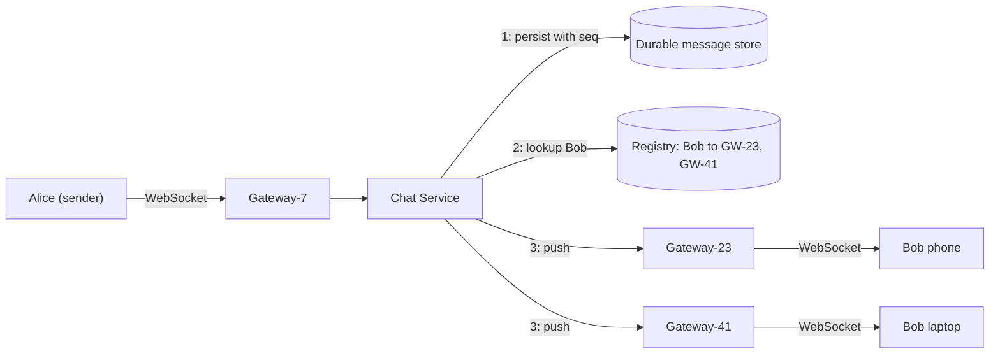
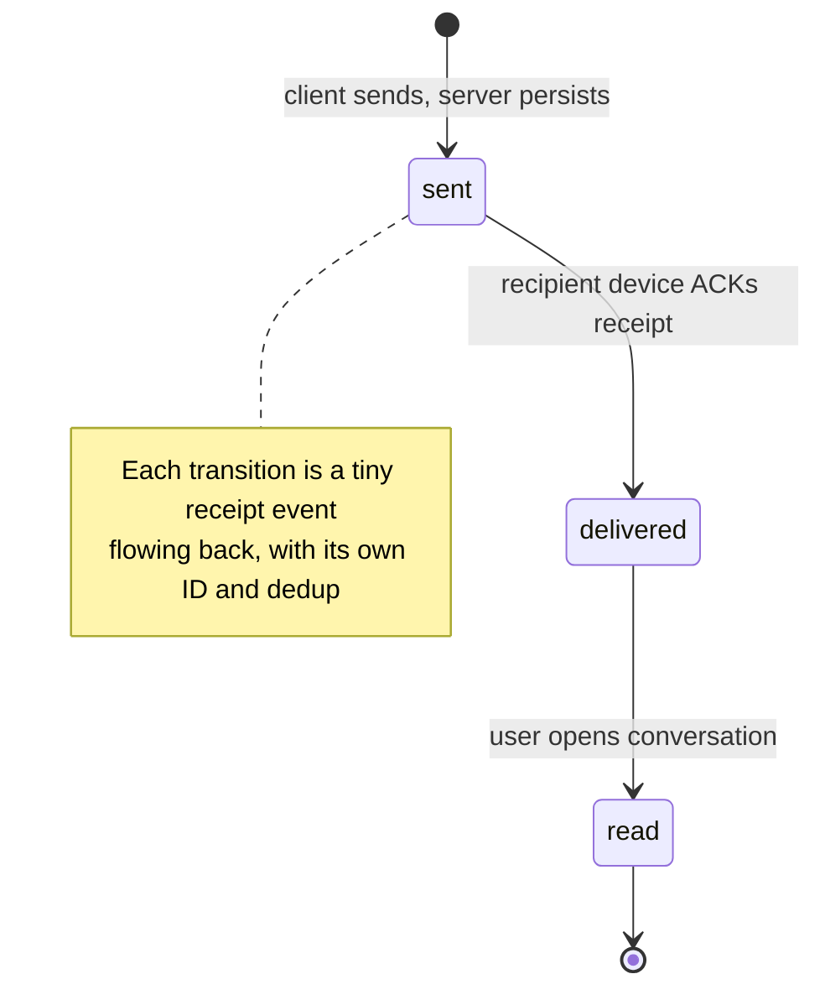
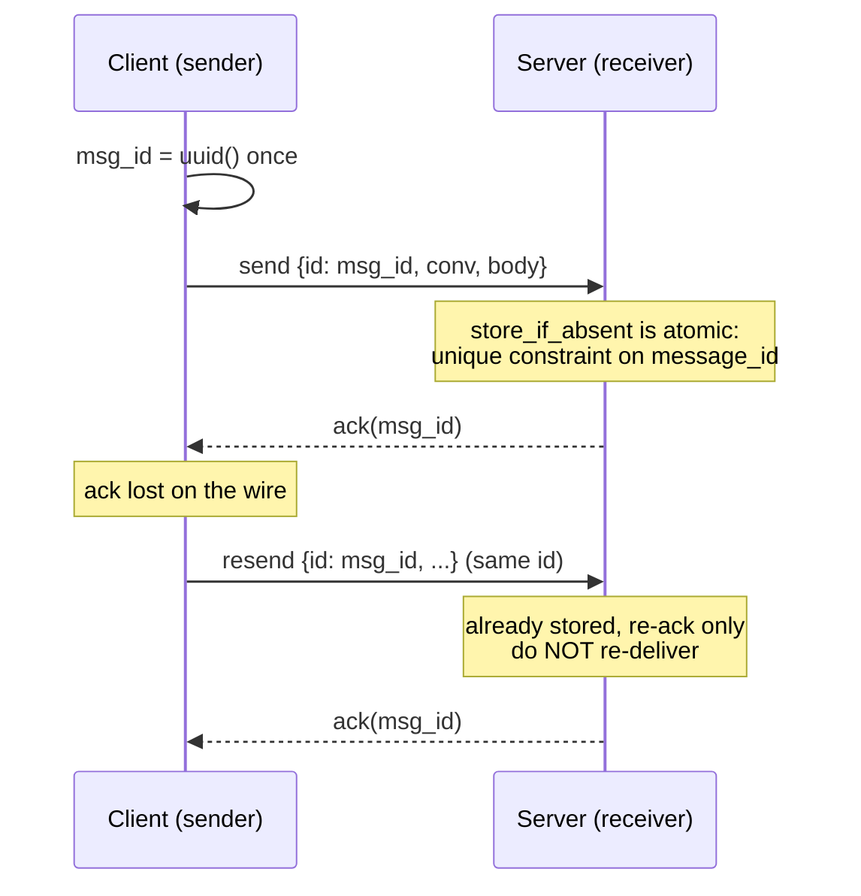
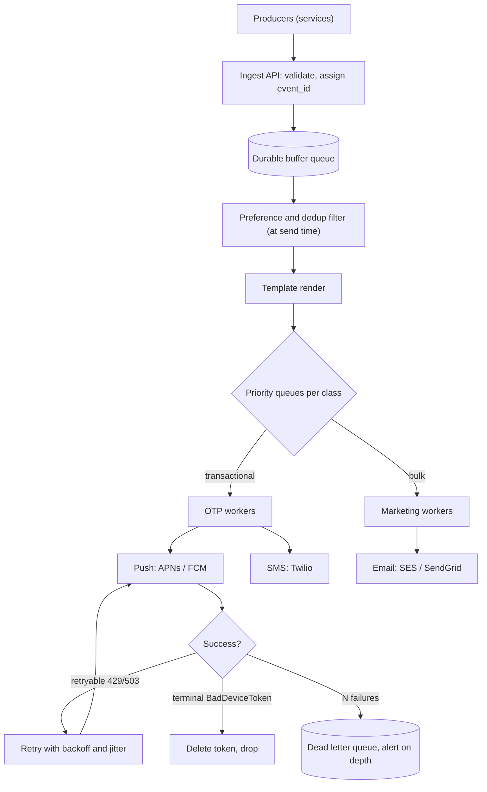

# Case Studies: Chat / Messaging & Notification System

> **Where this fits:** This is the capstone case study for *stateful, real-time, delivery-guaranteed* systems — the genre where a request/response REST mindset breaks down completely. Chat and notifications share a spine (durable fan-out with exactly-once *effects*) but differ in their hard constraint: chat fights **latency and ordering**, notifications fight **deliverability and cost**.
>
> **Principal-level takeaway:** You cannot achieve exactly-once *delivery* over a network — anyone who promises it is wrong. What you build instead is **at-least-once delivery + idempotent processing keyed by a stable message ID**, which yields exactly-once *effects*. Every other decision (WebSocket gateways, the connection registry, fan-out strategy, retries, DLQs) is downstream of accepting that single truth.

---

## ⚡ 60-Second TL;DR

- **What/why:** stateful, real-time, delivery-guaranteed systems; chat fights **latency + ordering**, notifications fight **deliverability + cost** — same fan-out spine.
- **WebSocket gateways:** stateless socket-holders behind an L4 LB; idle conns cost memory → budget **~100k/node, ~N/100k nodes**. Mandatory **ping/pong keepalives** or you leak ghost connections.
- **Connection registry** (`user→{device→gateway}`): central TTL'd Redis (simple, exact) vs pub/sub (broadcast) vs consistent-hash home node (Discord). *Every device is a target.*
- **Persist before push** with a **per-conversation sequence number** — durability precedes delivery, so offline catch-up = cursor advance. Order by **seq, never timestamp**.
- **#1 misconception:** "exactly-once *delivery*" — impossible. Build **at-least-once + idempotent dedup on a stable client-assigned `msg_id`** = exactly-once *effect*.
- **Notifications:** durable queue, preference check at **send time**, **separate priority queues** (OTP ≠ marketing), backoff+jitter retries, terminal-vs-retryable, monitored DLQ.

**Remember one thing:** State the delivery guarantee explicitly and early — at-least-once + idempotency is the load-bearing decision everything else hangs off.

## The Mental Model — first principles

Most systems an early-career engineer has built are **pull, stateless, request-scoped**: the client asks, the server answers, the connection dies, and the next request could land on any server. That model has three luxuries chat does not have:

1. **The client initiates.** The server never needs to find the client.
2. **No long-lived state.** Any server handles any request; load balancing is trivial.
3. **The work is done when the HTTP 200 returns.** There is no "later."

Chat violates all three. A message from Alice to Bob must reach Bob *whether or not Bob asked*, *possibly seconds or days later*, *to whichever of Bob's three devices are online*, *in the right order*, *exactly once as far as Bob can tell*. The server must **push**, must **know where Bob is**, and must **remember the message until Bob has it**. That is the entire problem.

Notifications are the same problem viewed through a different lens. A notification is a message whose recipient is *definitely not connected to you* — they're on their phone's lock screen, or asleep, or their email inbox. So you hand the last mile to someone else (Apple, Google, Twilio, an SMTP relay) and inherit *their* failure modes, *their* rate limits, and *their* cost. The core engine — "durably accept an event, fan it out to N targets, retry until each target confirms, never double-charge or double-buzz" — is identical to chat's offline path. That's why these two live in one chapter: **notifications are chat's offline-delivery problem generalized to channels you don't own.**

Hold one frame in your head for the whole chapter: *the network can lose, duplicate, reorder, and delay any message, and any node can crash at any instant.* Every design choice below is a response to that adversary. (The formal vocabulary — at-least-once, idempotency, the impossibility of exactly-once over an unreliable channel — lives in [Distributed Transactions, Sagas & Idempotency](../02-distributed-systems/15-distributed-transactions.md).)

---

## Core Concepts

### Connection management at scale: the WebSocket gateway

A chat client holds a **persistent, bidirectional** connection so the server can push. The dominant choice is **WebSocket** (a single TCP/TLS connection upgraded from HTTP, full-duplex). Alternatives: long-polling (a fallback, higher latency and overhead) and Server-Sent Events (server→client only, fine for notifications, useless for sending). See [Networking](../00-foundations/01-networking.md) for the protocol mechanics.

The first scaling fact to internalize: **an idle WebSocket still costs memory.** A connection isn't free just because no bytes are flowing — you carry socket buffers, TLS session state, and application bookkeeping per connection. Budget on the order of **tens of KB per idle connection** (varies wildly with buffer tuning and language runtime). A back-of-envelope ([capacity estimation](../00-foundations/04-capacity-estimation.md)): **10 million concurrent users / ~100k connections per gateway box ≈ 100 gateway nodes** just to hold the sockets, before any message moves. WhatsApp's famous milestone was **2 million+** connections per server, but that was the Erlang/BEAM runtime after years of FreeBSD kernel tuning (sysctl `kern.maxfiles`, ephemeral port ranges, `somaxconn`); do not assume those numbers for a JVM or Node service.

Gateways must be **stateless about identity but stateful about sockets**: the box owns the live file descriptor, but should hold no business logic, so you can kill and replace it. The load balancer in front must support long-lived connections — a layer-4 (TCP) LB, or layer-7 with generous idle timeouts. **Keepalives are mandatory**: NATs and LBs silently drop idle TCP flows after 30–300s. The app sends a ping every ~30s; a missed pong means "assume dead, tear down." Without this you accumulate **half-open "ghost" connections** — the server thinks the user is online, messages route to a dead socket, and they vanish. This is one of the most common production bugs in chat systems.

### The connection registry: who-is-connected-where

Because Bob's socket lives on *one specific gateway* out of 100, sending to Bob requires answering **"which gateway holds Bob's connection(s)?"** This is the **routing registry**, and it is the beating heart of the system.



Note the ordering of the edges out of the Chat Service: the durable write (step 1) happens *before* the registry lookup and push (steps 2–3). That sequencing is the load-bearing invariant of the whole system — durability precedes delivery.

Registry design choices, roughly in order of operational maturity:

- **Central key-value store (Redis/etcd):** `user_id → {device_id: gateway_id}`, with a **TTL refreshed by the gateway's heartbeat** so a crashed gateway's entries expire (e.g., 60s TTL refreshed every 20s). Simple, low-latency, the common default. The risk is staleness: between a gateway crash and TTL expiry, you route into the void.
- **Pub/sub fan-out (no precise registry):** Each gateway subscribes to a channel per connected user (or shards thereof). To deliver to Bob, publish to `user.bob`; whichever gateway holds Bob picks it up. Trades an exact lookup for broadcast cost — used by Slack-style and Phoenix Channels architectures.
- **Gossip / consistent-hashing assignment:** Users are hashed to a "home" node ([consistent hashing](../01-building-blocks/05-load-balancing.md)). Discord routes guild (server) traffic this way — a guild lives on a specific Elixir process/node, and presence/messages funnel through it.

Whatever the registry's *global* design, each gateway box also needs an **in-process hub** that maps the connections it locally owns (`userId → set of live sockets`) and routes an inbound message to the right socket(s). This is the piece that actually pushes bytes once the global registry has told the chat service "Bob is on this box." The idiomatic shapes differ by language: in Go you funnel all mutations through a single hub goroutine over channels, so the connection map needs no lock; in Java you reach for a `ConcurrentHashMap` keyed by user, with a small per-session send path.

> **Interactive:** [Retry Storms: Backoff + Jitter (interactive)](../animations/backoff-jitter.html) -- watch how 100k gateways reconnecting in lockstep stampede the registry, and how jitter spreads the herd.

**Per-gateway connection hub (register / unregister / route):**

```go
package hub

import "sync"

// Conn is one live WebSocket. send is buffered so a slow client
// never blocks the hub; a full buffer means "drop or disconnect".
type Conn struct {
	UserID   string
	DeviceID string
	send     chan []byte
}

type registerReq struct{ c *Conn }
type unregisterReq struct{ c *Conn }
type routeReq struct {
	userID  string
	payload []byte
}

// Hub owns the connection map. All mutation flows through one
// goroutine over channels, so the map needs no mutex.
type Hub struct {
	conns      map[string]map[*Conn]struct{} // userID -> set of conns
	register   chan registerReq
	unregister chan unregisterReq
	route      chan routeReq
}

func NewHub() *Hub {
	return &Hub{
		conns:      make(map[string]map[*Conn]struct{}),
		register:   make(chan registerReq),
		unregister: make(chan unregisterReq),
		route:      make(chan routeReq),
	}
}

func (h *Hub) Run() {
	for {
		select {
		case r := <-h.register:
			set := h.conns[r.c.UserID]
			if set == nil {
				set = make(map[*Conn]struct{})
				h.conns[r.c.UserID] = set
			}
			set[r.c] = struct{}{}
		case u := <-h.unregister:
			if set := h.conns[u.c.UserID]; set != nil {
				delete(set, u.c)
				close(u.c.send)
				if len(set) == 0 {
					delete(h.conns, u.c.UserID)
				}
			}
		case rt := <-h.route:
			for c := range h.conns[rt.userID] {
				select {
				case c.send <- rt.payload: // fan out to every device
				default: // buffer full: slow consumer, skip it
				}
			}
		}
	}
}

func (h *Hub) Register(c *Conn)   { h.register <- registerReq{c} }
func (h *Hub) Unregister(c *Conn) { h.unregister <- unregisterReq{c} }
func (h *Hub) Route(userID string, payload []byte) {
	h.route <- routeReq{userID: userID, payload: payload}
}

var _ = sync.Mutex{} // (hub intentionally lock-free)
```

```java
import java.util.Map;
import java.util.Set;
import java.util.concurrent.ConcurrentHashMap;

public final class Hub {

    /** One live WebSocket. send() must be non-blocking / bounded. */
    public interface Conn {
        String userId();
        String deviceId();
        boolean send(byte[] payload); // false => buffer full, drop/disconnect
    }

    // userId -> set of live conns. Both levels are concurrent so
    // register/unregister/route can run on many threads at once.
    private final Map<String, Set<Conn>> conns = new ConcurrentHashMap<>();

    public void register(Conn c) {
        conns.computeIfAbsent(c.userId(), k -> ConcurrentHashMap.newKeySet())
             .add(c);
    }

    public void unregister(Conn c) {
        conns.computeIfPresent(c.userId(), (k, set) -> {
            set.remove(c);
            return set.isEmpty() ? null : set; // drop empty entry atomically
        });
    }

    /** Fan out to every device the user has on this gateway. */
    public void route(String userId, byte[] payload) {
        Set<Conn> set = conns.get(userId);
        if (set == null) return;
        for (Conn c : set) {
            if (!c.send(payload)) {
                // slow consumer: in production, schedule a disconnect
            }
        }
    }
}
```

The non-negotiable subtlety: **a user has multiple devices, and each device is a separate delivery target.** The registry maps `user → set of (device, gateway)`. "Alice read it on her laptop" must propagate to her phone, which means even your *own* devices fan out like a tiny group.

### 1:1 vs group messaging, and the fan-out decision

This is the same **fan-out-on-write vs fan-out-on-read** tension you met in [News Feed](../04-design-case-studies/23-news-feed-and-timeline.md), but with tighter latency and ordering needs.

- **1:1:** trivially fan-out-on-write — one message, one (or few) recipient device set.
- **Small groups (say ≤ a few hundred):** fan-out-on-write. The sender's message is written once to a durable log, then a copy is pushed to each member's device(s). WhatsApp groups historically capped around 256 and later 1024 members precisely because client-side fan-out (the sender encrypts and sends N copies for E2E) gets expensive.
- **Large channels / broadcast (Slack channel of 50k, a Telegram channel of millions):** fan-out-on-write would melt. You switch toward **fan-out-on-read / shared timeline**: the message is written once to the channel's log, and online members pull or are notified to pull. Telegram channels and Slack large channels lean this way.

A clean abstraction: **a conversation is an append-only log; delivery is a set of cursors over that log.** Each device tracks "last message I have for conversation C." Delivery = advancing cursors and pushing the delta. This single idea makes offline delivery, multi-device sync, and "load older messages" all the *same* operation.

### Message ordering and storage

Users demand **per-conversation total order** ("messages within this chat appear in a consistent sequence to everyone"). They do **not** need global order across conversations — a much cheaper guarantee. (Why global ordering is expensive and what clocks buy you: [Time, Clocks & Ordering](../02-distributed-systems/14-time-clocks-ordering.md).)

The robust pattern: assign each message a **monotonic per-conversation sequence number** at the moment of durable write, from a single authority for that conversation (the conversation's owning shard, or an atomic `INCR` in the store). Clients sort by `(seq)`, not by wall-clock timestamp — client clocks are unreliable and skewed. Timestamps are for display; **sequence numbers are for ordering.**

Storage shape — this is a **write-heavy, range-scan-by-conversation, rarely-updated** workload, which is exactly what a wide-column / LSM-tree store is built for ([NoSQL](../01-building-blocks/08-databases-nosql.md), [Storage Engines](../00-foundations/03-storage-engines.md)):

```
Table: messages
  Partition key:  conversation_id           // co-locate one chat's history
  Clustering key: seq (or time-ordered UUID) ASC
  Columns:        message_id, sender_id, body/ciphertext, created_at, ...
```

Partitioning by `conversation_id` keeps a chat's history on one node for cheap range reads, but watch the **hot-partition** risk: a viral channel concentrates reads and writes on one partition ([Partitioning & Sharding](../01-building-blocks/10-partitioning-sharding.md)). Discord famously ran this workload on **Cassandra** (later migrating to ScyllaDB for tail-latency and GC reasons) with a close cousin of this schema: a **compound** partition key `(channel_id, bucket)` — where `bucket` is a static time window sized to keep each partition under ~100 MB — clustered by the Snowflake `message_id`, which is itself time-sortable so it doubles as the ordering key. Time-bucketing is the load-bearing trick: it bounds partition size and spreads a busy channel's history across many partitions.

### Delivery state, read receipts, and presence

Messaging apps expose a state machine per message per recipient:



Each transition is itself a small message flowing **back** the other way — a receipt is just a tiny event with its own ID and idempotency needs. "Delivered" fires when the recipient's device ACKs receipt; "read" fires when the conversation is opened. These ACKs are also how the **sender's client knows it can stop showing the spinner** and how the server knows it can stop trying to deliver offline.

**Presence (online / last-seen / typing)** is deceptively expensive. Presence is **high-write, low-value, and ephemeral** — it changes constantly and is worthless after a few seconds. Critical rule: **never persist presence to your durable store; keep it in memory / Redis with short TTLs, and do not fan it out naively.** The classic failure is the **presence fan-out storm**: in a large group, every member's "online" flicker notifies every other member → O(N²) traffic. Mitigations: throttle/coalesce updates (batch every few seconds), only compute presence for *visible* contacts, and treat "typing…" as a fire-and-forget unreliable signal (losing a typing indicator harms nobody). Slack and WhatsApp both heavily debounce presence.

### Offline delivery and push: bridging to the device

If Bob is offline, the message is already durably stored (you wrote it before pushing — that ordering is the whole point). Two things happen:

1. The message waits in Bob's per-conversation log; his cursor is behind. When any Bob device reconnects, it sends "my last seq for each conversation," and the server streams the delta. This is **pull-based catch-up**, and it's why durable storage precedes delivery.
2. To *wake* Bob, you send a **push notification** via APNs (Apple) or FCM (Google). The app may be killed; only the OS push channel can wake it. This is the hand-off point where **chat becomes a notification problem.**

### Encryption: transport vs end-to-end (the honest note)

- **Transport encryption (TLS):** client↔server is encrypted, but the **server can read message contents**. This is most chat systems (Slack, Discord, default Telegram cloud chats). It permits server-side search, fan-out, spam filtering, and abuse moderation.
- **End-to-end encryption (E2E):** only the participants' devices hold keys; the server stores **ciphertext it cannot read** (Signal Protocol; WhatsApp, Signal, iMessage, Messenger default). This is a *product/architecture* decision with deep consequences: the **server can no longer fan out group messages by re-encrypting** (the sender must encrypt per-recipient-device, so group size and multi-device cost climb), server-side search is impossible, and **read receipts/notifications must carry no readable content** (the push payload is "you have a message," with the body decrypted only on-device). Don't hand-wave E2E in a design discussion — name what you *lose*: server-side features, easy multi-device, and simple group fan-out. (Threat-model framing: [Security](../03-architecture-and-apis/20-security.md).)

### The crux: at-least-once + idempotency for dedup

Here is the pattern that unifies the entire chapter. You **cannot** get exactly-once delivery over a network. Consider: server sends message, then crashes before the ACK is recorded; on restart it must resend (it doesn't know Bob got it) → duplicate. Or Bob ACKs, the ACK is lost → resend → duplicate. The choice is only between *at-most-once* (might lose messages — unacceptable for chat) and *at-least-once* (might duplicate — acceptable **if** you dedup).

So: **deliver at-least-once, and make the receiver idempotent by deduping on a stable, client-or-server-assigned message ID.**

```
# Sender (client) — assign ID once, retry the SAME id
msg_id = uuid()                       # stable across retries
loop:
    send({id: msg_id, conv: C, body: B})
    wait_for_ack(msg_id, timeout=5s)
    if acked: break                   # otherwise resend — same id

# Server / receiver — dedup on id, atomically with the durable write
on_receive(msg):
    # The dedup check and the store MUST be one atomic operation, not two steps:
    # a unique constraint on message_id, an INSERT ... IF NOT EXISTS, or a
    # conditional write. If "have I seen it?" and "store it" are separate, a
    # crash or a concurrent retry between them re-stores and re-delivers.
    inserted = store_if_absent(msg)          # atomic: succeeds once per msg.id, assigns seq
    if not inserted:                         # already stored on a prior attempt
        ack(msg.id); return                  # idempotent: re-ack, don't re-deliver
    ack(msg.id)
```

The lost-ACK case is the one to picture concretely — the resend carries the *same* `msg_id`, and the receiver's atomic `store_if_absent` turns the second arrival into a harmless re-ack:



The dedup key cannot live only in a short-TTL side cache (a separate Redis `seen` set, say): a retry that arrives after the TTL expires — or after the cache is flushed — would slip past and duplicate. The durable record of the message *is* the dedup key, via a uniqueness constraint on `message_id`; a cache in front of it is an optimization, not the source of truth.

The `msg_id` must be **generated by the client and held constant across retries** ([ID generation](../04-design-case-studies/22-url-shortener-rate-limiter-id-gen.md)). A naive design that lets the server mint a new ID per attempt makes dedup impossible — that's the single most common idempotency bug. Combine this with the per-conversation **sequence number** for ordering, and you have a system that survives crashes, retries, and reordering. Internalize the slogan: **at-least-once transport + idempotent receiver = exactly-once effect.**

---

## The Notification System

Now generalize chat's offline path to channels you don't own. A notification system is an **event-driven fan-out engine** ([Architectural Styles](../03-architecture-and-apis/18-architectural-styles.md), [Message Queues & Streaming](../01-building-blocks/11-messaging-and-streaming.md)).



### Multi-channel delivery

Each channel is a thin adapter behind a uniform internal interface, because each provider has its own auth, payload shape, throughput limits, and failure semantics:

- **Push:** APNs (HTTP/2, token-based JWT auth, per-device tokens that *rotate and expire*), FCM (Android + web). Payload size is capped (APNs ~4KB). For E2E apps the payload says "new message," not the content.
- **SMS:** Twilio / SNS — costs **real money per message** (cents each), strict per-number throughput (e.g., a long code ~1 msg/sec without special routes), and carrier filtering.
- **Email:** SES / SendGrid — cheap but reputation-sensitive; bounces and spam complaints degrade your sender reputation, so you must process bounce/complaint feedback and suppress bad addresses.

### Templates, preferences, and prioritization

**Template management** decouples *what* changed from *how it reads*: store versioned templates (`order_shipped.v3`) with localization and channel variants; the event carries data, the template renders it. This is what lets non-engineers change copy without a deploy.

**Preference management** is a hard requirement, not a nicety: per-user, per-category, per-channel opt-in/out, quiet hours, digest-vs-instant, and **legally mandated unsubscribe** (CAN-SPAM, GDPR, TCPA for SMS). The preference check happens *before* render and *before* spending money on a provider. A subtle correctness point: preferences must be checked at **send time, not enqueue time** — a user may opt out while the event sits in the queue.

**Prioritization:** a 2FA/OTP code (user is *staring at the screen*, seconds matter) must not queue behind a 10-million-recipient marketing blast. Use **separate queues per priority class** with dedicated workers, so a bulk job can never starve transactional traffic. This is one of the most important and most-forgotten design points.

### Rate limiting, dedup, retries, and DLQ

- **Rate limiting** operates at two levels: **outbound** (respect each provider's limits — exceed APNs/Twilio and you get throttled or blocked) and **inbound/per-user** (don't send a user 50 buzzes because an upstream service looped). Token-bucket per user per category ([Rate Limiter](../04-design-case-studies/22-url-shortener-rate-limiter-id-gen.md)).
- **Deduplication:** the producer assigns an `event_id` (or you derive an idempotency key from `(user, event_type, entity_id, time_bucket)`); a Redis `SETNX event_id` with TTL drops duplicates from retried producers or double-published events. Same idempotency principle as chat.
- **Retries with exponential backoff + jitter:** provider timeouts and 5xx are *expected*, not exceptional. Retry with backoff (e.g., 1s, 4s, 16s) and jitter to avoid a **retry thundering herd** when a provider recovers. **Distinguish retryable from terminal failures**: a 429/503 is retryable; an APNs `BadDeviceToken` (token revoked, app uninstalled) is terminal — retrying it forever is pure waste, and you should *delete that token*.
  > **Interactive:** [Retry Storms: Backoff + Jitter (interactive)](../animations/backoff-jitter.html) -- compare plain exponential backoff against backoff-with-jitter when a recovered provider gets hammered by every worker at once.
- **Dead Letter Queue (DLQ):** after N failed attempts, move the message to a DLQ rather than retrying forever or dropping silently. The DLQ is for inspection, alerting, and selective replay. **An unmonitored DLQ is a silent outage** — alert on its depth. ([Reliability](../02-distributed-systems/16-reliability-and-failure.md).)

### Third-party provider failure handling

You depend on systems you can't fix. Defenses: a **circuit breaker** per provider (stop hammering a down provider, fail fast, let queues buffer), **failover providers** for critical channels (a second SMS vendor so OTP delivery survives a Twilio outage), and **timeouts on every external call** so a hung provider connection doesn't pin a worker thread forever. The queue between ingest and channel workers is what *lets* you ride out a provider outage: events accumulate durably and drain when the provider recovers — provided you sized retention for the outage you fear.

---

## Trade-offs at a Glance

| Decision | Option A | Option B | When to choose |
|---|---|---|---|
| Delivery guarantee | At-most-once (fire & forget) | **At-least-once + idempotent dedup** | Always B for chat/notifications; A only for losable signals (typing, presence) |
| Transport | WebSocket (full-duplex) | SSE / long-poll | WebSocket when client must *send*; SSE fine for push-only notifications |
| Connection registry | Central KV + TTL (Redis) | Pub/sub broadcast / consistent-hash home node | KV for simplicity & exact routing; pub/sub for huge presence/broadcast; hash for sharded ownership (Discord) |
| Group fan-out | Fan-out-on-write (copy per member) | Fan-out-on-read (shared log + pull) | Write for small groups & low latency; read for huge channels/broadcast |
| Ordering | Per-conversation sequence number | Global total order | Per-conversation almost always; global order is expensive and rarely needed |
| Message store | Wide-column / LSM (Cassandra/Scylla) | Relational (Postgres) | LSM for write-heavy at scale; Postgres fine until you outgrow one box |
| Encryption | Transport (TLS, server reads) | End-to-end (Signal Protocol) | E2E for privacy product promise; transport when you need server-side search/moderation/easy fan-out |
| Notification priority | Single queue | **Priority queues per class** | Always separate transactional (OTP) from bulk (marketing) |

---

## How Real Systems Do It

- **WhatsApp:** Erlang/BEAM gateways famously holding ~2M+ connections/server after deep FreeBSD tuning; E2E by default (Signal Protocol); offline messages stored (encrypted) on servers only until delivered or ~30 days, then deleted. Embodies "store-until-delivered, then forget."
- **Discord:** Elixir/`gen_server` per-guild routing (a guild lives on a node), presence via this fabric; message history on **Cassandra**, partitioned by `channel_id` and time-bucketed, later migrated to **ScyllaDB** to crush p99 tail latency and GC pauses. Their "trillions of messages" blog posts are required reading.
- **Slack:** WebSocket + a "flannel" edge cache for presence/membership; channels can be enormous, pushing toward read-side strategies; heavy presence debouncing.
- **Signal:** the reference E2E implementation; servers see only ciphertext and routing metadata; sealed-sender hides even the sender from the server.
- **Notifications — Uber/Netflix/etc.:** Kafka or SQS as the durable buffer ([Message Queues](../01-building-blocks/11-messaging-and-streaming.md)), per-channel worker pools, APNs/FCM/Twilio/SES adapters, Redis for dedup keys, DLQs with depth alerts. APNs itself is best-effort/at-least-once and offers opt-in collapsing: when *you* tag multiple pushes with the same `apns-collapse-id`, APNs replaces the older undelivered one so a phone that was offline gets the latest single buzz, not 200 stale ones — a provider-level coalescing you should mirror in your own design.

---

## Failure Modes & Common Misconceptions

**Production failure modes:**
- **Ghost connections:** missing keepalives leave dead sockets marked "online"; messages route into the void. Fix: ping/pong + TTL'd registry.
- **Presence fan-out storms:** naive O(N²) presence in big groups saturates the gateways. Fix: coalesce, throttle, scope to visible contacts.
- **Hot partitions:** a viral channel hammers one shard. Fix: time-bucketing, and treat broadcast channels differently from chats.
- **Thundering-herd reconnect:** a gateway dies, 100k clients reconnect simultaneously and stampede the registry/auth. Fix: reconnect with **exponential backoff + jitter** on the client.
- **Unmonitored DLQ:** failures pile up invisibly; users silently miss notifications. Fix: alert on DLQ depth and age.
- **Retrying terminal failures:** burning provider quota re-sending to dead device tokens. Fix: classify failures; prune bad tokens.

**Misconceptions to correct out loud:**
- *"We'll guarantee exactly-once delivery."* **No.** Impossible over an unreliable network. You get exactly-once *effect* via at-least-once + idempotency. Saying "exactly-once delivery" in a design review is a tell that someone hasn't internalized the model.
- *"WebSockets scale infinitely, they're just sockets."* Idle connections cost memory and FDs; you are bound by per-node connection counts and need ~N gateway nodes for N users.
- *"Order messages by timestamp."* Client clocks lie and skew. Order by per-conversation **sequence**, display by timestamp.
- *"Push notifications are reliable delivery."* APNs/FCM are **best-effort, at-least-once, and may coalesce or drop** under load. Never treat a push as confirmed receipt; the in-app sync (cursor catch-up) is the source of truth.
- *"Presence should be stored in the database."* Presence is ephemeral and high-churn — persisting it wrecks your write path. Keep it in memory with TTLs.
- *"A retry is harmless."* A retry without an idempotency key is a duplicate, a double-charge (SMS!), or a double-buzz.

---

## In a Design Discussion

When you're handed "design WhatsApp" or "design a notification service," resist diving into WebSocket framing. Drive the conversation through the spine: **connection model → registry → durable write → fan-out → delivery state → offline/push → idempotency.** State the delivery guarantee *explicitly and early* — it's the load-bearing decision.

**Junior take:** "Clients open WebSockets to a server. When Alice sends a message, the server pushes it to Bob over his WebSocket and stores it in the DB. For notifications we call APNs and FCM."

**Principal take:** "Gateways are stateless socket-holders fronted by an L4 LB; we need ~N/100k nodes and ping/pong keepalives or we'll leak ghost connections. A TTL'd Redis registry maps `user→{device→gateway}`; *every device is a target*. On send: client assigns a stable `msg_id`, we **persist with a per-conversation sequence number before we push** — durability precedes delivery, so offline catch-up is just cursor advancement. Delivery is at-least-once; the receiver dedups on `msg_id`. If Bob's offline, the message waits in his log and we fire a content-less push to wake him. Notifications reuse this engine: durable queue, preference + dedup filter at *send* time, **separate priority queues so OTP never queues behind marketing**, per-provider rate limits, backoff-with-jitter retries, terminal-vs-retryable classification, DLQ with depth alerts, and circuit breakers + a failover SMS vendor for the channels we can't afford to lose. If we promise E2E, I'll call out what we give up: server-side search, easy group fan-out, and content in receipts."

The difference isn't more components — it's naming the **failure modes, the costs, and the guarantee** before anyone asks.

---

## Self-Check

<details>
<summary>1. Why can't you guarantee exactly-once <em>delivery</em>, and what do you build instead?</summary>
A crash can occur between delivering and recording the ACK (forcing a resend) or an ACK can be lost — both produce duplicates, and avoiding resends entirely risks loss. You build <strong>at-least-once delivery + idempotent processing keyed by a stable message ID</strong>, yielding exactly-once <em>effect</em>.
</details>

<details>
<summary>2. Why must the message be persisted <em>before</em> it's pushed to the recipient?</summary>
Durability-before-delivery makes offline delivery and multi-device sync trivial: an offline/late device just advances its cursor over the stored log. If you pushed first and stored later (or not at all), a crash between the two loses the message and there's nothing to catch up from.
</details>

<details>
<summary>3. Order messages by timestamp or by sequence number? Why?</summary>
By <strong>per-conversation sequence number</strong> assigned at durable write. Client wall-clocks are skewed and untrustworthy; timestamps are for display only. Per-conversation order is cheap and sufficient — global order is expensive and unnecessary.
</details>

<details>
<summary>4. What is a "ghost connection" and how do you prevent it?</summary>
A half-open socket the server still believes is alive (NAT/LB dropped the TCP flow silently). The registry keeps routing to a dead socket → lost messages. Prevent with application-level ping/pong keepalives (~30s) and a TTL on registry entries refreshed by heartbeat.
</details>

<details>
<summary>5. Why separate priority queues in a notification system?</summary>
So a 10M-recipient marketing blast can't starve a 2FA code the user is actively waiting on. Dedicated workers per priority class guarantee transactional traffic isn't blocked behind bulk traffic.
</details>

<details>
<summary>6. Give two failures that are <em>terminal</em> (don't retry) vs <em>retryable</em> in push delivery.</summary>
Terminal: APNs <code>BadDeviceToken</code> / unregistered token (app uninstalled) — retrying wastes quota; you should delete the token. Retryable: 429 (rate limited) and 503/timeouts — retry with exponential backoff + jitter.
</details>

<details>
<summary>7. What does choosing end-to-end encryption cost you architecturally?</summary>
The server can't read content, so you lose server-side search, spam/abuse moderation on content, and the ability to fan out group messages by re-encrypting on the server (the sender must encrypt per recipient device, raising group/multi-device cost). Notification payloads must be content-less.
</details>

<details>
<summary>8. Why is presence dangerous to scale, and how do you tame it?</summary>
It's high-churn, ephemeral, and prone to O(N²) fan-out in large groups. Tame it: keep it in memory/Redis with short TTLs (never the durable store), coalesce/throttle updates, scope computation to visible contacts, and treat "typing…" as fire-and-forget.
</details>

---

## Go Deeper

- **Designing Data-Intensive Applications (Kleppmann):** Ch. 8 *The Trouble with Distributed Systems* (unreliable networks, clocks — the foundation for everything here); Ch. 9 *Consistency and Consensus* (ordering, total order broadcast); Ch. 11 *Stream Processing* (the at-least-once + idempotency / event-fan-out engine behind notifications). Ch. 5–6 for replication and partitioning of the message store.
- **The Signal Protocol** (Double Ratchet, X3DH) — the canonical E2E design; read the Signal spec docs.
- **Discord engineering blog:** "How Discord Stores Trillions of Messages" and the Cassandra→ScyllaDB migration write-ups — concrete partitioning, hot-partition, and tail-latency lessons.
- **Apple APNs** and **Firebase FCM** docs: token lifecycle, collapse IDs, payload limits, error/response codes (terminal vs retryable in practice).
- **The C10K / C10M problem** writings (Dan Kegel; the "millions of connections" tuning lore) for connection-scaling intuition.
- Sibling chapters: [Idempotency & Sagas](../02-distributed-systems/15-distributed-transactions.md), [Message Queues & Streaming](../01-building-blocks/11-messaging-and-streaming.md), [Reliability](../02-distributed-systems/16-reliability-and-failure.md), [Time & Ordering](../02-distributed-systems/14-time-clocks-ordering.md), [News Feed fan-out](../04-design-case-studies/23-news-feed-and-timeline.md), and the [Design Framework](../04-design-case-studies/21-interview-framework.md). Index: [README](../README.md) · Plan: [ROADMAP](../ROADMAP.md).
