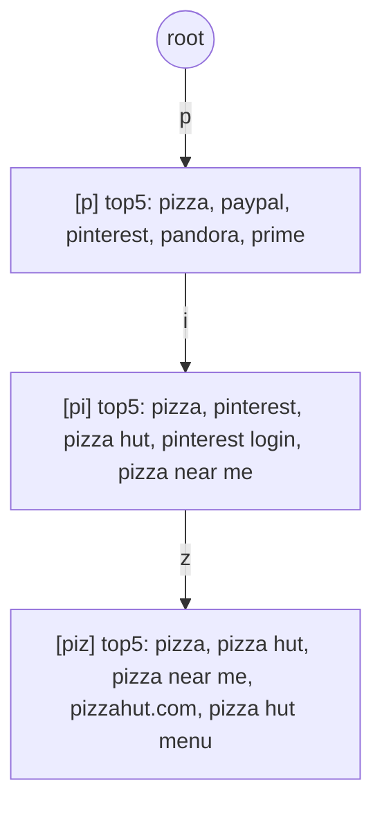
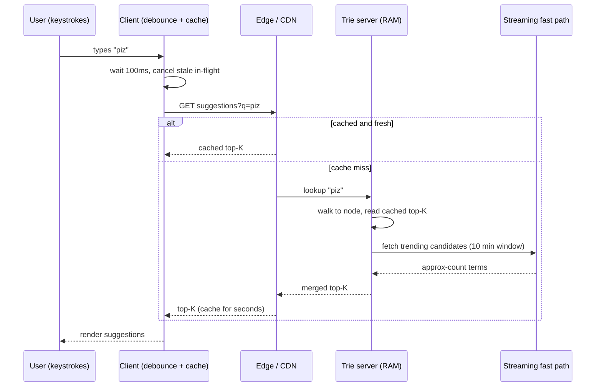
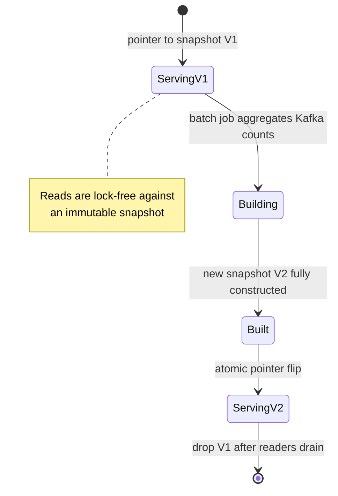
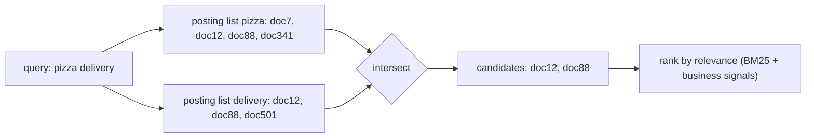
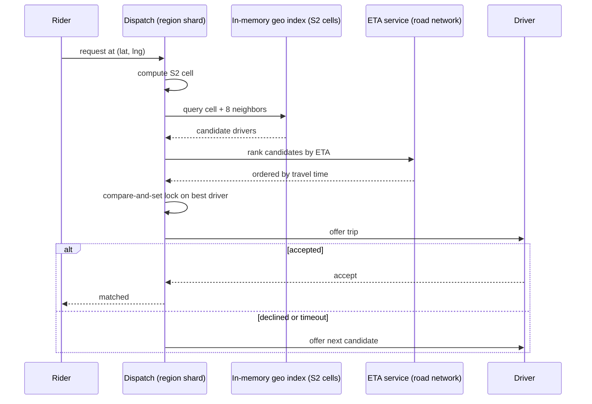

# Case Studies: Typeahead / Search & Proximity (Geo) Service

> Where this fits: two of the most common "design X" interview prompts (autocomplete and "find restaurants near me") that also power real products — Google Search box, Yelp, Uber, DoorDash. Both are fundamentally **read-heavy lookup problems solved by choosing the right index and partitioning scheme**, not by throwing more database at the problem.
>
> **Principal-level takeaway:** The entire game in both systems is *precomputing the answer into the right data structure at write time so reads become a cheap lookup* — a trie/top-K table for prefixes, a 1-D spatial cell for 2-D geography. The hard engineering is never the data structure itself; it's **partitioning a non-uniform load** (popular prefixes, dense cities) without creating hotspots, and accepting bounded staleness so you never pay consistency costs on the read path.

## ⚡ 60-Second TL;DR

- **What/why:** autocomplete + "near me" are **read-heavy lookups** solved by picking the right index, not a bigger DB — precompute at write time so reads are cheap.
- **Typeahead = trie with cached top-K per node** → **O(prefix length)** lookup; never `LIKE 'p%' ORDER BY` (unbounded scan+sort on hot prefixes).
- **Geo = map 2-D → locality-preserving 1-D cell ID** (**geohash** simple/skewed, **S2** correct sphere, **quadtree/H3** density-adaptive, **PostGIS** polygons).
- **#1 trap (geo):** boundary edge problem — **always query the cell + its 8 neighbors**, then refine by true distance/**ETA** (not haversine) for ranking.
- **#1 trap (typeahead):** the live trie is read-only; rebuild out-of-band, **atomic snapshot swap**, accept staleness.
- **Numbers:** ~100 ms budget; top-**K=5–10**; client debounce ~50–150 ms; driver pings ~4 s (keep in-memory, overwrite, no durability).

**Remember one thing:** Name the cost you're choosing to pay — bounded staleness, eventual consistency, edge-cell queries — because the design's whole skill is precomputing answers at write time so the read path stays cheap.

## The Mental Model — first principles: why does this thing exist, what problem does it solve?

Both systems answer a query that a naive database serves badly.

**Typeahead.** A user types "piz" and you must return the 5 best completions ("pizza", "pizza near me", "pizza hut") in under ~100 ms so suggestions feel instant. The naive approach — `SELECT query FROM searches WHERE query LIKE 'piz%' ORDER BY popularity DESC LIMIT 5` — is a disaster at scale. A `LIKE 'prefix%'` *can* use a B-tree index (it's a range scan), but the `ORDER BY popularity` ruins it: you must scan *every* row matching the prefix, then sort. "a%" might match tens of millions of rows. You'd do that on every keystroke, for millions of users. The read cost is unbounded and proportional to how popular the prefix is — exactly backwards.

The insight: there are far fewer distinct *prefixes* than there are *query events*, and the top-K answer for a prefix changes slowly. So **precompute the top-K completions for each prefix and store them so a lookup is O(length of prefix)**. That is a trie.

**Proximity / geo.** A user at (lat, lng) wants the 20 nearest open restaurants within 5 km. The naive query is `WHERE lat BETWEEN ? AND ? AND lng BETWEEN ? AND ?`. The problem is that a standard B-tree index is *one-dimensional*. You can index `lat` or `lng`, but not "both at once" in a way that prunes a 2-D box. If you index `lat`, the database narrows to the latitude band — a thin horizontal strip wrapping the entire planet — then scans every point in that strip checking longitude. In a dense region that's still millions of rows. Composite `(lat, lng)` indexes don't help much: the second column is only useful *after* an equality match on the first, and latitude is a range, not an equality.

The insight: **map 2-D space onto a 1-D ordering that preserves locality**, so "nearby in space" becomes "nearby in the index," and a proximity query becomes a small set of 1-D range scans. That is what geohash, S2, and quadtrees all do, by different math.

Notice the shared shape: *transform the query into something an index can answer cheaply, and pay the cost at write/precompute time.* This is the same instinct behind [the news feed fan-out decision](../04-design-case-studies/23-news-feed-and-timeline.md) — push work to writes when reads dominate.

## Core Concepts

### Typeahead: the trie and top-K precomputation

A **trie** (prefix tree) is a tree where each edge is a character and each path from root spells a prefix. Walking "piz" is 3 pointer hops. The naive design stores, at each node, the set of all complete words below it — but then "p" holds millions of words and you sort on every request. Wrong.

The right design: **at each trie node, store the precomputed top-K completions for that exact prefix.**



Now a request is: walk to the node for the typed prefix, return its cached top-K list. O(prefix length), independent of how many words sit below — the load-bearing property. Practical K is 5–10; storing more wastes memory because the UI shows a handful.

**How is top-K computed?** Offline, from a log of past queries (and their frequencies) collected over a sliding window — e.g., the last 1–7 days, weighted toward recent. A batch job (MapReduce/Spark) aggregates query counts, then for every prefix of every query, maintains the top-K by a ranking score. You don't recompute per node from scratch; you build bottom-up: a node's candidate set is the union of its children's top-K plus any word ending exactly there, re-ranked and truncated to K. This is correct *only because* top-K is composable in that way (each child already summarizes its subtree's best).

**A trie with cached top-K prefix lookup.** The serve path is the load-bearing part: walk to the prefix node, return its precomputed list. We insert `(word, score)` pairs and cache, at every node along the path, the K highest-scoring words passing through it — so a query is O(prefix length).

```go
package typeahead

import "sort"

type entry struct {
	word  string
	score int
}

type node struct {
	children map[rune]*node
	topK     []entry // sorted desc by score, len <= K
}

type Trie struct{ root *node; k int }

func NewTrie(k int) *Trie {
	return &Trie{root: &node{children: map[rune]*node{}}, k: k}
}

// Insert adds a word and pushes its score into the cached top-K of every
// node on its path, so lookups never re-scan or re-sort.
func (t *Trie) Insert(word string, score int) {
	n := t.root
	t.merge(n, entry{word, score})
	for _, r := range word {
		child, ok := n.children[r]
		if !ok {
			child = &node{children: map[rune]*node{}}
			n.children[r] = child
		}
		n = child
		t.merge(n, entry{word, score})
	}
}

func (t *Trie) merge(n *node, e entry) {
	for i, ex := range n.topK {
		if ex.word == e.word { // refresh existing
			n.topK[i].score = e.score
			sort.Slice(n.topK, func(a, b int) bool { return n.topK[a].score > n.topK[b].score })
			return
		}
	}
	n.topK = append(n.topK, e)
	sort.Slice(n.topK, func(a, b int) bool { return n.topK[a].score > n.topK[b].score })
	if len(n.topK) > t.k {
		n.topK = n.topK[:t.k]
	}
}

// TopK returns the cached best completions for a prefix in O(len(prefix)).
func (t *Trie) TopK(prefix string) []string {
	n := t.root
	for _, r := range prefix {
		child, ok := n.children[r]
		if !ok {
			return nil
		}
		n = child
	}
	out := make([]string, 0, len(n.topK))
	for _, e := range n.topK {
		out = append(out, e.word)
	}
	return out
}
```

```java
import java.util.*;

public class TypeaheadTrie {
    private record Entry(String word, int score) {}

    private static final class Node {
        final Map<Character, Node> children = new HashMap<>();
        final List<Entry> topK = new ArrayList<>(); // sorted desc by score
    }

    private final Node root = new Node();
    private final int k;

    public TypeaheadTrie(int k) { this.k = k; }

    /** Insert a word, refreshing the cached top-K of every node on its path. */
    public void insert(String word, int score) {
        Node n = root;
        merge(n, new Entry(word, score));
        for (int i = 0; i < word.length(); i++) {
            char c = word.charAt(i);
            n = n.children.computeIfAbsent(c, x -> new Node());
            merge(n, new Entry(word, score));
        }
    }

    private void merge(Node n, Entry e) {
        for (int i = 0; i < n.topK.size(); i++) {
            if (n.topK.get(i).word().equals(e.word())) {
                n.topK.set(i, e);
                n.topK.sort(Comparator.comparingInt(Entry::score).reversed());
                return;
            }
        }
        n.topK.add(e);
        n.topK.sort(Comparator.comparingInt(Entry::score).reversed());
        if (n.topK.size() > k) n.topK.subList(k, n.topK.size()).clear();
    }

    /** O(prefix length) lookup of the cached best completions. */
    public List<String> topK(String prefix) {
        Node n = root;
        for (int i = 0; i < prefix.length(); i++) {
            n = n.children.get(prefix.charAt(i));
            if (n == null) return List.of();
        }
        List<String> out = new ArrayList<>(n.topK.size());
        for (Entry e : n.topK) out.add(e.word());
        return out;
    }
}
```

### Ranking — popularity is the floor, not the ceiling

The baseline rank is **frequency**: how often was this completed query searched. Real systems blend in: recency (trending terms — "earthquake" should surge within minutes of one), personalization (your history, your location — "weather" should complete to your city), time-of-day/seasonality, and demotion of low-quality or unsafe terms. The score is typically `log(frequency) * recency_decay + personalization_boost`. The log dampens the long tail so a query that's 1000× more popular isn't 1000× the score.

The principal nuance: **trending content fights your batch window.** A daily batch never surfaces a term that started trending an hour ago. So production systems run a *fast path*: a streaming layer (Flink/Kafka Streams) maintains approximate counts over a short window (e.g., last 10 min) and merges those candidates into results at serve time, on top of the slowly-updated trie. You accept approximate counts (count-min sketch) to keep the streaming layer cheap.

### Caching and the client: debouncing

Two layers of caching matter. **Server-side**, the trie itself is the cache — it lives in memory (RAM), not on disk; a million-word trie with top-5 per node is on the order of a few GB (dominated by the cached completion strings, not the node pointers) and fits on one box, replicated for reads. **Client-side and edge**, prefix→suggestions responses are cacheable for seconds because they change slowly; a CDN or the browser can serve repeated prefixes.

**Debouncing** is the cheapest win and lives entirely on the client: don't fire a request on *every* keystroke. Wait ~50–150 ms after the last keystroke before sending; cancel the in-flight request if the user types again. Without it, typing "pizza" fires 5 requests in ~300 ms, 4 of them instantly stale. Debouncing collapses a fast burst of keystrokes into a single request, so it can cut request volume substantially for active typists. Pair it with **prefix caching on the client**: if you already fetched results for "piz", you can locally filter them for "pizz" without a round trip (the results for "pizz" are a subset — usually). This is a latency *and* load optimization.

The end-to-end serve path stitches these layers together — client debounce, edge cache, the in-memory trie, and a streaming merge for trending terms:



### Sharding the trie

One box holds a million-word trie fine. But you replicate for read throughput and availability, and at very large vocabularies (multi-language, billions of distinct queries) you partition. Two strategies:

- **Shard by first letter / prefix range.** Simple, but catastrophically skewed — far more queries start with "s" than "z", and "a"/"the" prefixes are enormous. You get hotspots.
- **Shard by hash of the prefix.** Even load, but a single keystroke's results may require talking to one shard while the *next* keystroke hits another; no locality. Usually you hash on a short prefix (first 1–2 chars) so a given typing session tends to stay on one shard, then route by consistent hashing. See [Partitioning & Sharding](../01-building-blocks/10-partitioning-sharding.md) and [Load Balancing & Consistent Hashing](../01-building-blocks/05-load-balancing.md).

In practice, because the whole trie often fits in memory, the dominant pattern is **full replication** (every server has the whole trie) rather than partitioning — you scale reads horizontally and rebuild/swap the trie periodically. Partition only when the vocabulary genuinely exceeds a single host's RAM.

### Handling updates and staleness

The trie is effectively **read-only at serve time and rebuilt out-of-band.** You don't mutate the live trie on every search event — that would mean write contention on a hot in-memory structure on every keystroke globally. Instead:

1. Append search events to a log (Kafka).
2. A batch/stream job aggregates counts and rebuilds (or incrementally updates) a fresh trie snapshot.
3. Atomically swap the new snapshot in (build new, flip a pointer, drop old) so readers never see a half-updated tree.



This means suggestions are **stale by the rebuild interval** — minutes to a day. That is almost always fine; nobody notices that "pizza" was the 3rd suggestion instead of the 2nd. **Bounded staleness is the deliberate trade** that makes the read path lock-free and cheap.

### The inverted index — when prefix matching isn't enough

Typeahead matches *prefixes*. Real search ("find documents/products containing these words, anywhere") needs an **inverted index**: a map from each term to the sorted list (a *posting list*) of document IDs containing it.



A query becomes a *set intersection/union of posting lists*, then ranking (TF-IDF or BM25, plus business signals). This is what powers full-text search, and it's a different index from the trie — prefix completion vs. whole-document term search. **Elasticsearch / OpenSearch** (built on Apache Lucene) is the de-facto engine: it shards the inverted index across nodes, replicates each shard, and supports both full-text and prefix/edge-ngram analyzers (so it can serve autocomplete *too*, by indexing prefixes as terms — convenient, though a dedicated in-memory trie is faster for pure prefix top-K). Lucene segments are immutable and merged in the background — the same "build immutable, swap atomically" pattern as the trie.

### Proximity: spatial indexing — turning 2-D into 1-D

All the practical schemes share one idea: **recursively subdivide space into cells, and give each cell a string/number ID such that nearby cells have similar IDs.** Then "find nearby" = "find points whose cell ID is in a small set of ranges," answerable by a plain B-tree or sorted KV store.

**Geohash.** Interleave the bits of latitude and longitude and Base32-encode them. Each character adds precision: `gbsuv` (5 chars) is a ~5 km × 5 km box; `gbsuv7z` (7 chars) is ~150 m. The magic property: **points sharing a prefix are spatially close** (mostly). So a proximity query becomes a prefix query: `WHERE geohash LIKE 'gbsuv%'`. To find neighbors within radius r, pick the geohash precision whose cell is ~r, then query that cell **plus its 8 surrounding cells** (the famous edge problem — two points 1 meter apart can sit in different cells with totally different hashes if they straddle a boundary; querying the 3×3 neighborhood fixes it).

**A geohash encoder.** The core trick is bit interleaving: at each step we bisect the longitude range, then the latitude range, appending one bit per dimension to a shared bitstream, then group every 5 bits into a Base32 symbol. Longitude takes the even bit positions, latitude the odd ones — that interleaving is what makes shared prefixes imply spatial proximity.

```go
package geohash

const base32 = "0123456789bcdefghjkmnpqrstuvwxyz" // geohash alphabet (no a,i,l,o)

// Encode produces a geohash of the given character length for (lat, lng).
func Encode(lat, lng float64, chars int) string {
	latRange := [2]float64{-90, 90}
	lngRange := [2]float64{-180, 180}
	var hash []byte
	bit, ch, even := 0, 0, true // even bit -> longitude, odd -> latitude

	for len(hash) < chars {
		var r *[2]float64
		var val float64
		if even {
			r, val = &lngRange, lng
		} else {
			r, val = &latRange, lat
		}
		mid := (r[0] + r[1]) / 2
		if val >= mid {
			ch |= 1 << (4 - bit) // set this bit
			r[0] = mid
		} else {
			r[1] = mid
		}
		even = !even
		if bit < 4 {
			bit++
		} else {
			hash = append(hash, base32[ch])
			bit, ch = 0, 0
		}
	}
	return string(hash)
}
```

```java
public final class Geohash {
    private static final String BASE32 = "0123456789bcdefghjkmnpqrstuvwxyz";

    /** Encode (lat, lng) to a geohash of the given character length. */
    public static String encode(double lat, double lng, int chars) {
        double[] latRange = {-90, 90};
        double[] lngRange = {-180, 180};
        StringBuilder hash = new StringBuilder();
        int bit = 0, ch = 0;
        boolean even = true; // even bit -> longitude, odd -> latitude

        while (hash.length() < chars) {
            double[] range = even ? lngRange : latRange;
            double val = even ? lng : lat;
            double mid = (range[0] + range[1]) / 2;
            if (val >= mid) {
                ch |= 1 << (4 - bit); // set this bit
                range[0] = mid;
            } else {
                range[1] = mid;
            }
            even = !even;
            if (bit < 4) {
                bit++;
            } else {
                hash.append(BASE32.charAt(ch));
                bit = 0;
                ch = 0;
            }
        }
        return hash.toString();
    }
}
```

**Quadtree.** A tree that recursively splits a square region into 4 quadrants whenever a cell exceeds a capacity threshold (say >100 points). Sparse areas (ocean) stay coarse; dense areas (Manhattan) subdivide deeply. This **adapts to density** — its key advantage over fixed-grid geohash. Held in memory; a nearby query descends to the relevant leaf cells. Cost: it's a tree to maintain and rebalance, harder to shard than a flat string key.

> **Interactive:** [Spatial Indexing: Quadtree (interactive)](../animations/quadtree-geo.html) -- drop points into a dense cluster and watch the cell subdivide once it exceeds capacity.

**Google S2.** Projects the sphere onto the 6 faces of a cube, then uses a **Hilbert space-filling curve** to assign each cell a 64-bit `CellId`. Hilbert curves preserve locality *better* than geohash's bit-interleaving (fewer "jumps"), and S2 handles the sphere correctly (no distortion at the poles, no antimeridian seam). Cells come in 31 levels, from whole-Earth down to ~1 cm². Used by Google, and famously by **Uber, Foursquare, and Tinder**.

**Uber H3.** A **hexagonal** hierarchical grid. Why hexagons? Every neighbor of a hex cell is equidistant from its center (a square has 4 edge-neighbors at distance d and 4 corner-neighbors at distance d√2 — ambiguous "adjacency"). That uniformity makes movement/flow modeling (ETAs, surge, smoothing) cleaner. 16 resolutions; res 9 ≈ 0.1 km² per hex. Trade-off: hexagons can't perfectly subdivide into smaller hexagons, so the hierarchy is approximate.

**R-tree / PostGIS.** An R-tree indexes **bounding rectangles** and nests them hierarchically — built for *arbitrary shapes and polygons* (delivery zones, "is this point inside this neighborhood"), not just points. **PostGIS** (Postgres + GiST index, which is R-tree-like) gives you real spatial SQL: `ST_DWithin(location, point, 5000)` with a spatial index. Excellent and correct for moderate scale and complex geometry; the limit is single-node write throughput and the difficulty of sharding spatial joins.

### Hot-region partitioning

Geography is wildly non-uniform: Manhattan and downtown SF have orders of magnitude more drivers/restaurants than rural counties. If you **shard by fixed-size geohash cell**, the Manhattan shard melts while the Wyoming shard idles. Fixes: (a) use a **density-adaptive structure** (quadtree, or variable S2 levels) so dense areas get finer cells and each cell holds bounded load; (b) **split hot cells dynamically** and reassign — the same elastic re-sharding logic as a hot key in any partitioned store; (c) replicate hot cells across more read replicas. The principle from [Partitioning & Sharding](../01-building-blocks/10-partitioning-sharding.md): partition by *load*, not by *space*.

### Ride-hailing: matching drivers to riders in real time

This is proximity plus a real-time write firehose. Two flows:

**Location updates (write path).** Every active driver pings their GPS every ~4 s. At 1M concurrent drivers that's ~250K writes/sec, each invalidating the driver's spatial cell. You do *not* write each ping to a durable relational DB synchronously. Instead you keep a **hot in-memory geospatial index** (Redis `GEOADD`/`GEOSEARCH`, or an in-process S2/quadtree per region) holding "which drivers are currently in cell X." Updates overwrite the driver's last position; durability isn't needed for a position that's stale in 4 seconds. The system is **regionally sharded** (by S2 cell / city) so a single region's updates land on one cluster — Uber's dispatch layer historically used **Ringpop** (application-layer consistent-hash sharding with SWIM gossip membership) to partition this way, keying shards by S2 cell ID. (Durable trip records live separately in their Schemaless/MySQL store — not in this hot location index.)

**Dispatch (read + match).** A rider requests at (lat, lng): compute their S2 cell, query that cell + neighbors for candidate drivers, filter (available, right vehicle class), rank by **ETA** (real road-network travel time, not straight-line distance — a driver across the river is "close" by haversine but 15 min away), then offer to the best driver. If declined/timed out, offer the next. The match must be **atomic**: two riders must not both be assigned the same driver — a per-driver lock / compare-and-set / single-writer-per-region (see [Consensus & leader election](../02-distributed-systems/13-consensus.md) and [idempotency](../02-distributed-systems/15-distributed-transactions.md)). This is also where batching wins: Uber's matching evaluates a *batch* of pending requests and drivers together every few seconds to find a globally better assignment than greedy first-come-first-served.



## Trade-offs at a Glance

### Spatial index options

| Scheme | Shape | Adapts to density? | Sharding | Best for | Watch out for |
|---|---|---|---|---|---|
| **Geohash** | Fixed grid, Base32 string | No (uniform cells) | Easy (string prefix → KV/B-tree) | Simple "near me" on a sorted KV store; Redis | Edge effect (query 3×3 cells); skewed load in dense areas; distortion near poles |
| **Quadtree** | Recursive 4-way split | **Yes** | Harder (it's a tree) | In-memory nearby; uneven density | Rebalancing on heavy writes |
| **Google S2** | Sphere→cube + Hilbert curve, 64-bit IDs | Variable level | Easy (sort by CellId) | Planet-scale, correct geometry (Uber, Tinder) | Steeper learning curve |
| **Uber H3** | Hexagonal hierarchy | Yes (by resolution) | Easy (cell index) | Flow/movement modeling, surge, ETAs | Hierarchy is approximate (hexes don't nest cleanly) |
| **R-tree / PostGIS** | Bounding rectangles, polygons | Yes | Hard (single-node) | Polygons, "point in zone", rich spatial SQL | Single-node write/scale ceiling |

### Typeahead approaches

| Approach | Read latency | Update freshness | Memory | When to use |
|---|---|---|---|---|
| **SQL `LIKE 'p%' ORDER BY`** | Bad (scan + sort, unbounded) | Real-time | Low | Never at scale; fine for a tiny admin search box |
| **In-memory trie + top-K** | Excellent, O(len) | Stale by rebuild interval (min–day) | Whole trie in RAM | The default for autocomplete |
| **Elasticsearch edge-ngram** | Good | Near-real-time | Higher | When you already run ES and want one system for search + autocomplete |
| **Trie + streaming fast path** | Excellent | Near-real-time for trends | RAM + stream state | When trending terms matter (news, social) |

## How Real Systems Do It

- **Redis** ships geospatial commands (`GEOADD`, `GEOSEARCH`) backed internally by a 52-bit **geohash** stored as the score of a sorted set — exactly the "1-D ordering" trick. A radius query isn't one range scan: Redis computes the covering cell *and its neighbors* and scans several score ranges, then filters by true distance — i.e., it handles the edge problem for you. The common backing store for ride-hailing's hot driver index.
- **Uber** uses **H3** (which they open-sourced) for surge/ETA/movement analytics and **S2**-style cell sharding for dispatch; drivers ping every few seconds into a regionally-partitioned in-memory index, and matching runs in periodic batches.
- **Tinder, Foursquare, MongoDB** use **S2** (MongoDB's `2dsphere` index is S2-based; `$near`/`$geoWithin` queries ride on it).
- **PostGIS** is the workhorse for governments, mapping, and any app needing real polygons — GiST spatial index, `ST_DWithin`, projection-aware distances.
- **Elasticsearch/OpenSearch** (Lucene inverted index) powers full-text search at companies like GitHub, Wikipedia, and Shopify; its `geo_point`/`geo_shape` types also give it BKD-tree spatial search, so many shops run *one* ES cluster for search *and* geo.
- **Google Search** autocomplete blends a trie-like prefix structure with heavy real-time trending and personalization; the suggestion list updates within minutes of a news event.

Rough numbers to anchor estimates: autocomplete budget ~100 ms end-to-end; trie node walk is microseconds (RAM); a 10M-query vocabulary with top-5 strings per node is a few GB. Geo: a city-scale region might hold 10K–100K active drivers; an S2 level-13 cell is ~1 km², a good granularity for dispatch candidate sets of tens-to-hundreds of drivers.

## Failure Modes & Common Misconceptions

**Myth: "Just use `LIKE 'prefix%'` with an index — it's a range scan, so it's fast."** The prefix match *is* indexable, but the `ORDER BY popularity LIMIT K` forces a full scan + sort of everything matching the prefix. For a popular prefix that's millions of rows per keystroke. The trie exists precisely to make the *ranked* lookup O(prefix length).

**Myth: "Geohash neighbors are always nearby."** Prefix similarity implies proximity, but the converse fails at boundaries. Two points 1 m apart can straddle a cell edge and land in cells with completely different hashes. **Always query the cell plus its 8 neighbors** (or you'll miss the closest restaurant because it's just across the boundary). This bites everyone once.

**Myth: "Straight-line (haversine) distance is good enough for ranking nearest."** For *coarse candidate filtering*, yes. For *final ranking* in ride-hailing/delivery, no — rivers, highways, and one-way streets mean the geometrically-closest driver can be the slowest to arrive. Rank by **road-network ETA**.

**Myth: "We must store every driver location ping durably."** A position that's superseded in 4 seconds doesn't need durable, replicated, consistent writes. Treating the location firehose like normal database traffic is the classic over-engineering that capsizes the write path. Keep it in memory; overwrite, don't append.

**Hotspots are the real production failure** in both systems. Typeahead: a viral term ("super bowl") spikes one shard's read traffic and outpaces the batch rebuild, so suggestions go stale exactly when they matter. Geo: a concert lets out and one S2 cell holds 50,000 riders requesting at once — that single partition becomes a thundering hotspot. Both are *load-skew* problems; the fix is adaptive partitioning + replication of hot cells/prefixes, plus a streaming fast path for freshness. See [Reliability: Designing for Failure](../02-distributed-systems/16-reliability-and-failure.md).

**Stale-cache surprises.** Client-side prefix-result caching ("filter 'piz' results locally for 'pizz'") breaks when results for the longer prefix aren't a strict subset of the shorter one (because ranking/personalization can introduce new candidates). Treat it as a best-effort latency hint, not ground truth.

## In a Design Discussion

**Whiteboarding move:** state the read/write ratio and the latency budget first, then *derive* the index from it. "Reads dominate, sub-100 ms budget, answers change slowly → precompute into an in-memory structure, accept bounded staleness, rebuild out-of-band." That sentence is the whole design; everything else is detail.

**Junior take (typeahead):** "Query the searches table with `LIKE` and order by count, add a cache in front." — unbounded read cost on hot prefixes, cache stampedes on the popular ones, no story for trends.

**Principal take:** "In-memory trie with precomputed top-K per node, fully replicated for read scale, rebuilt from a Kafka log every few minutes via a batch job with atomic snapshot swap. Client debounces at 100 ms and caches by prefix. A streaming count-min layer merges trending terms at serve time. I'm explicitly trading freshness (stale by the rebuild interval) for a lock-free, O(prefix) read path — and I'll watch for hot-prefix read skew, mitigated by replication."

**Junior take (geo):** "Store lat/lng, query with a bounding box and an index on lat and lng." — the 1-D index problem; scans a planet-wide latitude strip.

**Principal take:** "Map points to a locality-preserving 1-D cell ID (geohash for simplicity, S2 if I want correct sphere geometry and Uber-scale). Proximity = query the target cell + 8 neighbors, then refine by true distance/ETA. The hard part isn't the index, it's load skew: dense cities create hotspots, so I'll use density-adaptive cells (quadtree / variable S2 level) and replicate hot regions. For ride-hailing the driver location firehose stays in an in-memory regional index — overwrite-in-place, no durability — and matching is an atomic, batched assignment per region."

The senior signal in both: naming the *cost you're choosing to pay* (staleness, eventual consistency, edge-cell queries) rather than pretending the design has none. That's the muscle [Trade-off Reasoning & ADRs](../05-principal-skills/29-tradeoffs-and-adrs.md) is built on.

## Self-Check

<details>
<summary>1. Why is a trie node's "list of all words below it" the wrong thing to store, and what do you store instead?</summary>
Storing all descendant words means re-sorting potentially millions of words on every request for a short prefix. Store the **precomputed top-K completions** for that exact prefix, so a read is O(prefix length) regardless of subtree size.
</details>

<details>
<summary>2. Why can't a normal B-tree index on (lat, lng) answer "nearby" efficiently?</summary>
A B-tree is 1-D. It narrows on the first column (a latitude *range* — a planet-wide strip), but the second column only prunes after an *equality* match on the first, which a range query never gives. So you scan the whole latitude band. Spatial indexes solve this by mapping 2-D to a locality-preserving 1-D key.
</details>

<details>
<summary>3. What is the geohash "edge problem" and the fix?</summary>
Two points very close together can fall in adjacent cells with completely different hash prefixes if they straddle a boundary, so a single-cell query misses near neighbors. Fix: query the target cell **plus its 8 surrounding cells** (the 3×3 neighborhood), then refine by true distance.
</details>

<details>
<summary>4. Why don't we update the live trie on every search event?</summary>
That would put write contention on a hot in-memory structure on every keystroke globally and risk readers seeing partial state. Instead, log events, rebuild a fresh trie snapshot out-of-band (batch/stream), and atomically swap it in. The cost is bounded staleness, which is acceptable for autocomplete.
</details>

<details>
<summary>5. Geohash vs. quadtree — when does the difference actually matter?</summary>
When load/density is non-uniform. Geohash cells are fixed-size, so dense regions create hotspots and sparse cells waste lookups. A quadtree (or variable S2 level) subdivides only where density is high, bounding per-cell load — at the cost of maintaining/rebalancing a tree that's harder to shard than a flat string key.
</details>

<details>
<summary>6. Why should ride-hailing rank candidates by ETA rather than straight-line distance, but still filter candidates by cell distance first?</summary>
Cell/haversine distance is a cheap, correct-enough filter to get a small candidate set. Final ranking must use road-network ETA because rivers/highways/one-ways make the geometrically-closest driver potentially the slowest to arrive. Filter cheap, rank accurately.
</details>

<details>
<summary>7. Trie vs. inverted index — what's the difference and when do you need each?</summary>
A trie answers *prefix* queries (autocomplete: "piz" → "pizza"). An inverted index maps terms → posting lists of documents, answering *full-text* queries (find documents containing these words anywhere) via set intersection + relevance ranking. Autocomplete uses a trie; document/product search uses an inverted index (Elasticsearch/Lucene). ES can serve autocomplete too via edge-ngrams, but a dedicated trie is faster for pure prefix top-K.
</details>

<details>
<summary>8. How do you keep autocomplete fresh for a term trending in the last 10 minutes when your trie rebuilds daily?</summary>
Add a streaming fast path: a stream processor (Flink/Kafka Streams) maintains approximate counts (count-min sketch) over a short window and its candidate terms are merged into results at serve time, layered on top of the slowly-rebuilt trie.
</details>

## Go Deeper

- **Designing Data-Intensive Applications** (Kleppmann): Ch. 3 (storage & indexing — B-trees, LSM-trees, and a section on **multi-column and multi-dimensional / R-tree indexes** that directly explains the geo problem; full-text/fuzzy indexes); Ch. 6 (partitioning, including partitioning by key range vs. hash and the rebalancing/hotspot discussion behind hot-cell splitting). See also [Storage Engines](../00-foundations/03-storage-engines.md).
- **Google S2 Geometry library** documentation and the S2 cell/Hilbert-curve overview — the clearest explanation of locality-preserving cell IDs on a sphere.
- **Uber Engineering: H3** — the open-source hexagonal grid, with their rationale for hexagons over squares, and their blog posts on real-time dispatch / marketplace matching.
- **Apache Lucene** docs on inverted indexes and segment merging; **Elasticsearch** "Definitive Guide" chapters on inverted indexes, analyzers (edge-ngram for autocomplete), and `geo_point`/BKD trees.
- **PostGIS** documentation: GiST spatial indexes, `ST_DWithin`, and KNN (`<->`) ordering — the most accessible hands-on way to build intuition.
- **Redis** geospatial commands docs (`GEOADD`/`GEOSEARCH`) — read how it encodes geohash into sorted-set scores.
- Sibling writeups: [The System Design Framework](../04-design-case-studies/21-interview-framework.md), [Caching](../01-building-blocks/06-caching.md), [Message Queues & Stream Processing](../01-building-blocks/11-messaging-and-streaming.md), [Capacity Estimation](../00-foundations/04-capacity-estimation.md), and the curriculum [index](../README.md) / [roadmap](../ROADMAP.md).
