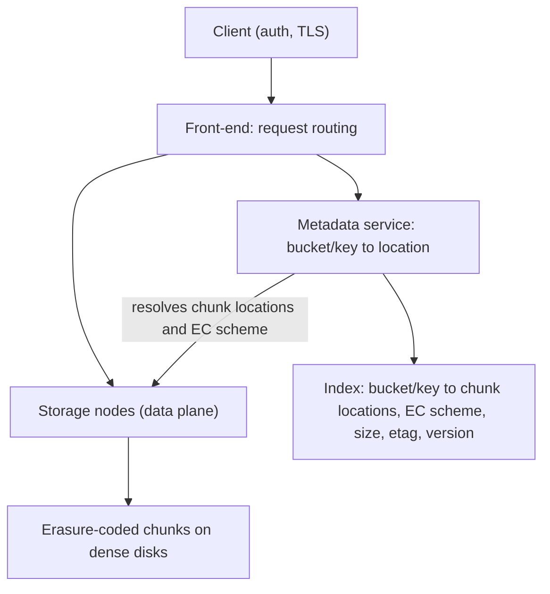
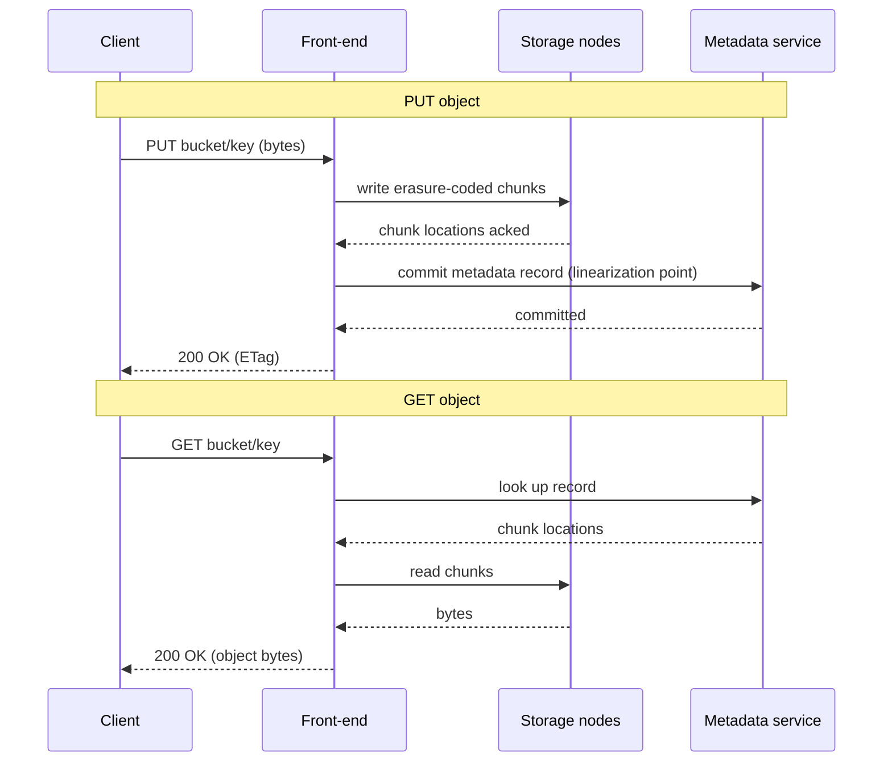
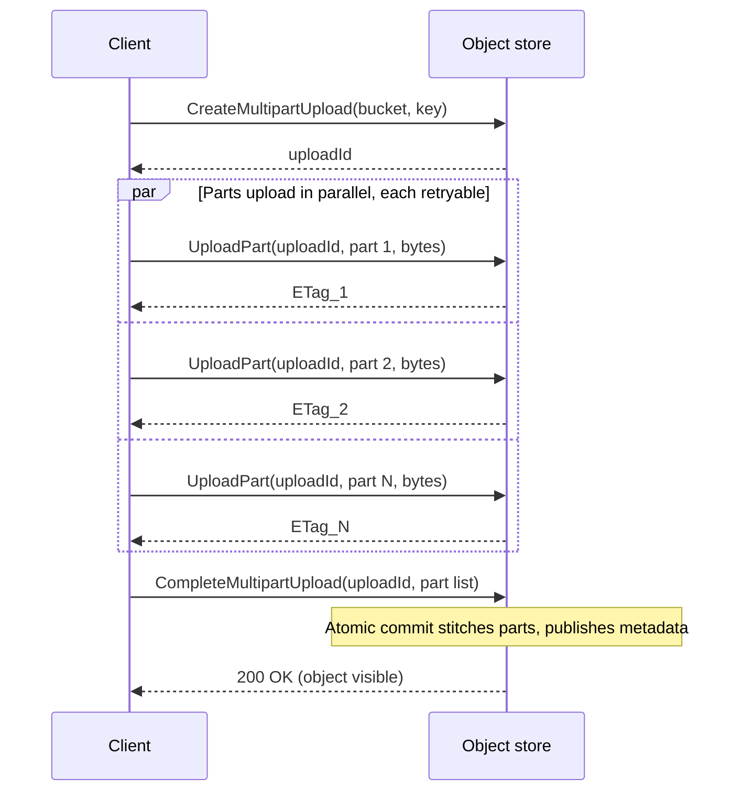
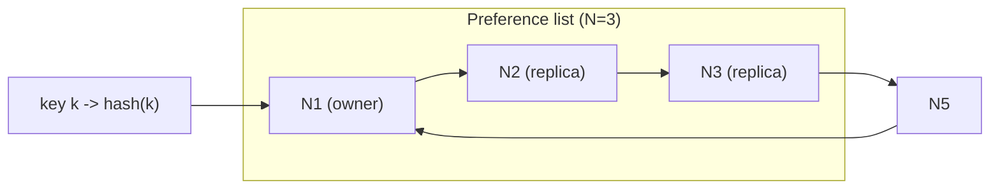
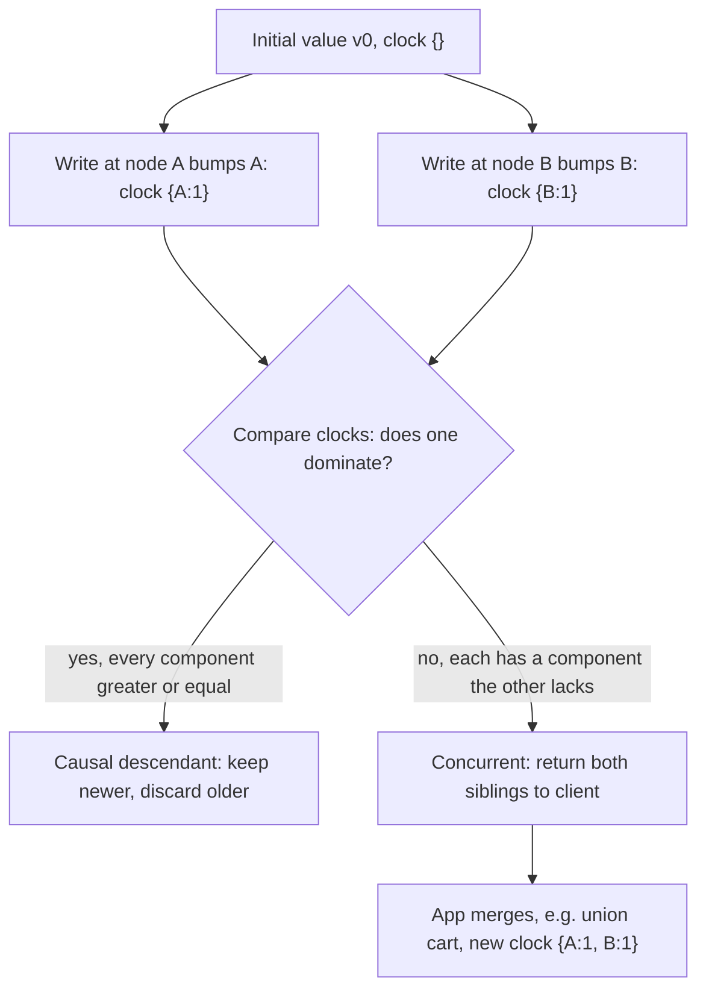

# Case Studies: Distributed Object Store (S3) & Key-Value Store (Dynamo)

> Where this fits: the **capstone** of Parts 1–2. Every primitive you've studied — replication, partitioning, quorums, consensus, clocks — shows up here, load-bearing, in two systems the rest of the world builds on top of. S3 and Dynamo are the bedrock under your databases, your queues, your data lakes.
>
> **Principal-level takeaway:** Storage systems earn their reputation by being *boring under failure*. The hard part is never the happy path — it's the durability math, the metadata bottleneck, and the consistency contract you commit to *before* you write a line of code, because that contract dictates every other decision downstream. Design the failure behavior first; the API is the easy part.

## ⚡ 60-Second TL;DR

- **Two storage shapes, same primitives:** **object store** (S3) = big immutable blobs, throughput-bound; **KV store** (Dynamo) = tiny mutable records, single-digit-ms p99, always-writable.
- **S3 = data plane + metadata plane.** Split because bytes are throughput-bound, metadata is IOPS/consistency-bound; metadata commit is the **linearization point** for read-after-write.
- **Durability via erasure coding,** not just copies: **10+4** = 40% overhead, survives 4 losses vs 3× replication = 200%, survives 2 — but EC repair reads *k* shards.
- **Dynamo is leaderless + AP:** tune **R/W/N** per call; **W+R>N** forces read/write overlap (not linearizability), default N=3/W=R=2.
- **Concurrent writes conflict:** **vector clocks** flag causality and return siblings to merge; LWW is simpler but silently drops writes under skew.
- **#1 trap:** durability is a *rate* — correlated failures that outpace repair lose data despite "11 nines."
- **Remember one thing:** Design the failure behavior and consistency contract *first* — they dictate every downstream decision; the API is the easy part.

## The Mental Model — first principles: why does this thing exist?

Almost every product you build needs to put bytes somewhere and get them back later. The naive answer — "a big disk" — fails immediately at scale on two axes: a single disk holds far too little, and it dies. Annualized disk failure rates run 1–2% in the field; with a million disks you are losing tens of thousands per year, and several per hour. So the real problem isn't storage, it's **storing data on inherently unreliable hardware such that the *system* is far more reliable than any *component*.**

That single requirement forks into two very different products, because there are two very different access patterns:

1. **Large, immutable blobs accessed whole** — images, videos, backups, ML datasets, log archives. You PUT a 4 GB file and later GET the whole thing (or a byte range). You almost never edit byte 2,000,000,001 in place. This is the **object store** (Amazon S3, Google Cloud Storage, Azure Blob, MinIO, Ceph RADOS).

2. **Tiny, mutable records accessed by key, at enormous request rates with tight latency** — a user's shopping cart, a session, a counter. Single-digit-millisecond p99, millions of ops/sec, always available even during a partition. This is the **distributed key-value store** (Amazon Dynamo → DynamoDB, Cassandra, Riak, Voldemort).

They share DNA (both partition and replicate data across many nodes) but optimize for opposite ends of the size/mutability/latency spectrum. Studying them together is the point: it shows how the *same* building blocks compose into *different* coherent designs depending on what you optimize for. If you haven't internalized [replication](../01-building-blocks/09-replication.md), [partitioning](../01-building-blocks/10-partitioning-sharding.md), and [consistency models](../02-distributed-systems/12-consistency-and-cap.md), read those first — this chapter assumes them and shows them working together.

## Core Concepts

### Part A — The Object Store (S3-like)

#### Data plane vs. control/metadata plane

The single most important architectural decision in an object store is the split between the **data plane** (the bytes of your objects) and the **metadata/control plane** (the bookkeeping: which object lives where, its size, ETag, ACLs, version, storage class).

Why split them? Because they have wildly different characteristics:

- **Data** is large (KB to TB), immutable once written, accessed by streaming, and stored on cheap dense disks. The data plane is throughput-bound.
- **Metadata** is tiny (a few hundred bytes per object) but there is a *staggering* amount of it — S3 holds well over 400 trillion objects — and it is queried on *every single request* (list, head, get, put). The metadata plane is IOPS- and consistency-bound.

If you stored metadata in the same store as data, the metadata access pattern (huge fan-out of tiny strongly-ordered lookups) would crush the throughput-optimized data path. So:



A PUT writes the bytes to storage nodes first, then commits a metadata record pointing at them. A GET reads metadata to find the bytes, then streams them. Metadata commit is the linearization point — that's what makes read-after-write work (more below).



#### Chunking large objects

You cannot treat a 5 TB object as one unit. It won't fit on one disk, and a single failure would lose all of it. So large objects are split into **chunks** (also called blocks or extents — commonly a few MB to ~64 MB each). Each chunk is independently placed, replicated/erasure-coded, and recovered. Benefits: parallel reads/writes across many nodes (throughput), bounded blast radius per failure, and independent repair. The metadata record stores the ordered list of chunk IDs and their locations. This is the same idea as a filesystem's block list — just spread across a fleet.

#### Erasure coding vs. replication for durability (the "11 nines")

The marketing claim — S3 Standard offers **99.999999999% (eleven nines)** of durability — means the *expected annual loss* is about one object per 100 billion, per year. How do you get there?

**Replication (the simple way):** store N full copies on N different machines/racks/AZs. 3× replication tolerates 2 simultaneous losses. Simple, fast to repair, but the storage *overhead is 200%* — you pay for 3 GB to store 1 GB.

**Erasure coding (the way object stores actually do it):** split data into *k* data shards, compute *m* parity shards using Reed–Solomon codes, store all *k+m* shards on different failure domains. Any *k* of the *k+m* shards reconstruct the original. A common scheme is **(k=10, m=4)**: 14 shards total, tolerates *any 4* losses, with only **40% overhead** (1.4 GB stored per 1 GB). Compare: 3× replication tolerates only 2 losses at 200% overhead. EC gives you *more* durability for *less* space.

```
Replication (3x):   [D] [D] [D]              overhead 200%, survives 2 losses
Erasure code(10+4): [d1..d10] [p1..p4]       overhead  40%, survives 4 losses
                     any 10 of 14 → recover original
```

The catch with EC: **reads and repairs are more expensive in CPU and network**. Because Reed–Solomon is typically used in *systematic* form (the *k* data shards are stored verbatim), a normal read just serves the relevant data shards directly with no decode — but if a needed shard is missing, reconstruction must fetch *any k* surviving shards and recompute — a "degraded read" that amplifies network traffic. Repair of one lost shard likewise reads *k* shards' worth of data (this is the *repair traffic* / *reconstruction cost* problem; advanced codes like Local Reconstruction Codes, used by Azure, and Clay/Locally-Repairable Codes reduce it by reading far fewer than *k* shards for a single-shard repair). So object stores typically **replicate small/hot objects and recently-written data, then erasure-code large/cold objects** once they settle. Durability also requires placing shards across independent failure domains (disk, host, rack, AZ) so one event can't take out enough shards to cross the loss threshold — and a *background process continuously scrubs and re-replicates* to keep redundancy above the floor. Durability is not a static property; it's a *rate* — you must repair faster than you lose.

#### The metadata service and its scaling

Metadata is the real engineering hard part of an object store. It must:

- Map `bucket/key → object record` with **strong consistency** (so a GET after a PUT sees the new object).
- Support **list** operations (`list all keys with prefix foo/`) efficiently, in sorted order.
- Handle the *entire request volume* of the system.

Because keys are listed in sorted prefix order, metadata is typically a **range-partitioned, sorted key-value store** (think a sharded LSM-tree / B-tree, often built on the company's own internal database — S3 has described using a purpose-built key-value store; GCS uses Spanner/Bigtable lineage). It is *not* hash-partitioned, because hashing destroys the sorted-order needed for `list`. Range partitioning brings the classic [hot-shard problem](../01-building-blocks/10-partitioning-sharding.md): a bucket whose keys all share a timestamp prefix (`2026-06-08/...`) hammers one partition. The fix is automatic split/merge of partitions and guidance to add high-entropy prefixes to keys. This is the metadata service's eternal scaling battle.

#### Multipart upload

For large objects, a single PUT over a single TCP connection is fragile (one network blip and you restart 4 GB) and slow (no parallelism). **Multipart upload** solves both:



Parts (5 MB–5 GB each, up to 10,000) upload independently and in parallel; a failed part retries alone. `Complete` is the single atomic commit that stitches the parts into one object and publishes the metadata. Until `Complete`, nothing is visible. This is **idempotency and atomic commit** ([distributed transactions](../02-distributed-systems/15-distributed-transactions.md)) applied to uploads: the `uploadId` makes retries safe, and the final commit is the linearization point. Abandoned uploads leak storage, which is why you set a lifecycle rule to abort incomplete multipart uploads after N days.

#### Eventual vs. strong read-after-write

For years S3 offered **read-after-write consistency for new objects (PUT of a brand-new key)** but only **eventual consistency for overwrites and deletes** — a GET right after overwriting an existing key might briefly return the old version, because metadata replicas and caches hadn't converged. This bit countless data pipelines (Spark/Hive jobs that wrote then immediately listed and saw stale or missing entries — the infamous "S3 eventual consistency" footgun, worked around by tools like S3Guard/EMRFS using a separate consistent index).

In **December 2020 S3 became strongly consistent for all operations** — read-after-write *and* list — at no extra cost and no performance penalty, by making the metadata commit the authoritative linearization point for every operation. The lesson for your own designs: **the consistency contract is a product decision with massive downstream blast radius.** Eventual consistency is cheaper and more available, but every consumer must defend against staleness; strong consistency is simpler to *use* but costs you on the metadata path. See [consistency & CAP](../02-distributed-systems/12-consistency-and-cap.md) for the underlying theory.

#### Lifecycle and tiering

Data has a temperature that cools over time. Lifecycle policies move objects between **storage classes** as access drops: S3 Standard → Standard-IA (infrequent access) → Glacier Instant/Flexible → Glacier Deep Archive. Deep Archive costs ~$0.00099/GB-month (≈$1/TB/month) versus ~$0.023/GB-month for Standard — over 20× cheaper — but retrieval takes hours and incurs a fee. The trade-off is **storage cost vs. retrieval latency/cost**: cold tiers use higher erasure-coding ratios, denser/cheaper media (historically tape or spun-down disk), and fewer geographic copies. This is the same hot/warm/cold tiering you see in [caching](../01-building-blocks/06-caching.md) and storage engines, applied across an entire fleet's economics.

### Part B — The Distributed KV Store (Dynamo-style)

Now flip every assumption. The 2007 Amazon **Dynamo** paper (the ancestor of DynamoDB, Cassandra, and Riak) targeted a shopping cart: tiny values, by-key access, **must always accept writes — even during a network partition, even if it means conflicts later.** Amazon decided losing a write (a removed item silently failing) was worse than briefly showing a stale cart. That single product call — **availability over strong consistency** ([the AP side of CAP](../02-distributed-systems/12-consistency-and-cap.md)) — drives the entire design. Dynamo is **leaderless**: there's no primary to fail over, so there's no failover gap and no consensus on the write path.

#### Consistent hashing for partitioning

To spread keys across nodes *and* make adding/removing nodes cheap, Dynamo uses **consistent hashing**: hash both keys and nodes onto a ring (0…2^128). A key is owned by the first node clockwise from `hash(key)`, plus the next N−1 nodes (the **preference list**). Adding a node only re-homes the keys between it and its predecessor — roughly 1/N of data moves, versus nearly *everything* moving under naive `hash(key) % servers`.

Naive consistent hashing creates uneven load (random node placement → uneven arc lengths). Dynamo fixes this with **virtual nodes**: each physical node owns many small arcs (tokens) scattered around the ring, smoothing load and making heterogeneous hardware easy (a beefier box gets more vnodes). This is exactly the mechanism in [load balancing & consistent hashing](../01-building-blocks/05-load-balancing.md) — the same primitive, here used for *data* placement instead of *request* routing.



> **Interactive:** [Consistent Hashing (interactive)](../animations/consistent-hashing.html) -- add and remove nodes and watch how only ~1/N of keys re-home, and how virtual nodes smooth the arc lengths.

#### Quorums (R/W/N) for tunable consistency

With N replicas and no leader, how do you read/write consistently? **Quorum**: choose a write quorum W and read quorum R such that the call succeeds once that many replicas respond.

- **N** = number of replicas (e.g., 3)
- **W** = replicas that must ack a write
- **R** = replicas that must respond to a read

If **W + R > N**, the write set and read set are guaranteed to overlap on at least one replica, so a read sees the latest acknowledged write (a *strong*-ish guarantee, modulo concurrent writes). Common tunings with N=3:

| W | R | W+R>N? | Behavior |
|---|---|--------|----------|
| 3 | 1 | yes | Fast reads, slow/fragile writes (need all replicas up) |
| 1 | 3 | yes | Fast writes, slow reads |
| 2 | 2 | yes (4>3) | Balanced, tolerates 1 node down on each side — the popular default |
| 1 | 1 | **no** (2≯3) | Max availability/speed, eventual consistency, can read stale |

> **Interactive:** [Quorum Reads & Writes (R + W > N) (interactive)](../animations/quorum.html) -- slide R and W and watch when the read and write sets are forced to overlap.

This is the knob that makes consistency **tunable per operation**. The crucial subtlety: even W+R>N is *not* linearizable in the strict sense (concurrent writes, sloppy quorums, and read-repair timing create edge cases — see Kleppmann's "limitations of quorum consistency"). It's "read-your-overlap," not consensus. For true linearizability you need [consensus](../02-distributed-systems/13-consensus.md) (Paxos/Raft), which Dynamo deliberately avoids on the hot path to stay available.

#### Vector clocks / version vectors for conflict detection

Leaderless + always-accept-writes means **two clients can write the same key concurrently on different replicas.** You will have conflicts. The question is: can you *detect* them? A plain "last write wins" timestamp can't tell a concurrent conflict from a legitimate overwrite — and silently drops data (clocks skew; see [time & clocks](../02-distributed-systems/14-time-clocks-ordering.md)).

Dynamo attaches a **vector clock** (more precisely a *version vector*) to each value: a map `{node → counter}`. When node A handles a write it bumps its own counter. Given two versions you can compare:

- One vector dominates the other (every component ≥) → it's a newer version, *causally descends* the older → keep the newer, discard the older.
- Neither dominates (each has a component the other lacks) → **concurrent** → genuine conflict. Dynamo returns *both* versions ("siblings") to the client on the next read, and the application must merge them (e.g., union the shopping cart items — which is why a deleted item can resurrect, the classic Dynamo example).



> **Interactive:** [Vector Clocks & Causality (interactive)](../animations/vector-clocks.html) -- issue concurrent writes on different nodes and see when the vectors flag a conflict versus a causal descendant.

Cassandra famously chose **last-write-wins with wall-clock timestamps** instead of vector clocks — simpler, no sibling-merge burden on the app, but it *can silently lose writes* under clock skew. That's a real, deliberate trade-off, not a bug: choose vector clocks when silent data loss is unacceptable and you can write a merge function; choose LWW when conflicts are rare and simplicity wins.

#### Gossip for membership

There's no leader to maintain the cluster roster, so nodes learn about each other via a **gossip protocol**: each node periodically picks a random peer and exchanges its view of membership and token assignments. State (who's up, who owns what) spreads epidemically, converging in O(log N) rounds. It's eventually consistent and beautifully partition-tolerant — no central coordinator to become a [single point of failure](../02-distributed-systems/16-reliability-and-failure.md). The cost: membership info is *eventually* consistent, so a brand-new node takes a few seconds to be globally known, and flapping nodes can cause transient routing churn.

#### Durability under failure: hinted handoff, read repair, anti-entropy

Three mechanisms keep replicas converging, operating at different timescales:

- **Hinted handoff (write-time / seconds):** if a target replica is down during a write, a healthy node accepts the write *plus a hint* ("this really belongs to N3"). When N3 recovers, the hint is replayed to it. This is a **sloppy quorum** — it keeps writes available during transient failures, at the cost of temporarily storing data on the "wrong" node. Note this *weakens* the W+R>N guarantee, because the W acks may include nodes outside the preference list.
- **Read repair (read-time / on access):** when a read contacts R replicas and finds them disagreeing, the coordinator pushes the newest version to the stale replicas inline. Cheap, but only fixes keys that are actually read — cold keys stay divergent.
- **Anti-entropy with Merkle trees (background / continuous):** to reconcile entire replicas (including never-read keys), each node builds a **Merkle tree** over its key ranges — a hash tree where leaves hash key-value ranges and parents hash their children. Two replicas compare roots; if equal, they're identical and *no data moved*. If different, they recurse only into differing subtrees, exchanging O(differences) data instead of the whole dataset. This is how replicas heal after long outages without shipping everything.

```
        root hash
        /        \
     h(A)        h(B)        compare top-down;
    /    \      /    \       descend only where hashes differ
  ...    ...  ...    ...
```

#### How it all composes

Step back and see the *whole machine*: consistent hashing decides **where** data lives → the preference list decides **which N replicas** → quorum R/W decides **how many** must respond per op → vector clocks decide **what to do when they disagree** → gossip keeps everyone's map of the ring current → hinted handoff/read repair/Merkle anti-entropy keep replicas **converging** at three timescales. Every Part 1–2 building block — partitioning, replication, consistency, clocks, failure handling — is present and pulling weight. *That* is the capstone insight: real systems aren't one clever idea, they're a coherent stack of trade-offs that reinforce one chosen philosophy (here: availability first).

To make the composition concrete, here is a small Dynamo-style **coordinator** that ties the pieces together: it hashes a key to a preference list (consistent hashing), issues writes and reads to all N replicas in parallel, waits for a **W-of-N** or **R-of-N** quorum, and uses **version vectors** to decide whether a set of read replies has a single winner or genuine concurrent **siblings**. The replica RPCs are stubbed so the example stays self-contained; the interesting logic is the quorum gathering and the vector-clock reconciliation.

**Version vectors: dominance and concurrency**

```go
package dynamo

// VersionVector maps nodeID -> logical counter.
type VersionVector map[string]uint64

// Bump returns a copy with node's counter incremented (write at that node).
func (v VersionVector) Bump(node string) VersionVector {
	out := make(VersionVector, len(v)+1)
	for k, n := range v {
		out[k] = n
	}
	out[node]++
	return out
}

// Dominates reports whether v is a causal descendant of (or equal to) other:
// every component of other is <= the matching component of v.
func (v VersionVector) Dominates(other VersionVector) bool {
	for k, n := range other {
		if v[k] < n {
			return false
		}
	}
	return true
}

// Concurrent reports whether neither vector dominates the other (a real conflict).
func (v VersionVector) Concurrent(other VersionVector) bool {
	return !v.Dominates(other) && !other.Dominates(v)
}
```

```java
import java.util.HashMap;
import java.util.Map;

/** Maps nodeId -> logical counter. Immutable-by-convention: Bump returns a copy. */
public final class VersionVector {
    private final Map<String, Long> counters;

    public VersionVector(Map<String, Long> counters) {
        this.counters = new HashMap<>(counters);
    }

    public static VersionVector empty() {
        return new VersionVector(Map.of());
    }

    /** Returns a copy with node's counter incremented (a write at that node). */
    public VersionVector bump(String node) {
        Map<String, Long> out = new HashMap<>(counters);
        out.merge(node, 1L, Long::sum);
        return new VersionVector(out);
    }

    /** True if this is a causal descendant of (or equal to) other. */
    public boolean dominates(VersionVector other) {
        for (Map.Entry<String, Long> e : other.counters.entrySet()) {
            if (counters.getOrDefault(e.getKey(), 0L) < e.getValue()) {
                return false;
            }
        }
        return true;
    }

    /** True if neither vector dominates the other (a genuine conflict). */
    public boolean concurrent(VersionVector other) {
        return !dominates(other) && !other.dominates(this);
    }
}
```

**Coordinator: preference list, W-of-N write, R-of-N read, sibling detection**

```go
package dynamo

import (
	"context"
	"errors"
	"hash/fnv"
	"sort"
)

// Versioned is a value tagged with its version vector.
type Versioned struct {
	Value string
	Clock VersionVector
}

// Replica is one node that stores a key's value. Stubbed for the example.
type Replica interface {
	ID() string
	Put(ctx context.Context, key string, v Versioned) error
	Get(ctx context.Context, key string) (Versioned, error)
}

// Coordinator implements consistent hashing + quorum reads/writes.
type Coordinator struct {
	ring []Replica // sorted by token; one vnode each for brevity
	n    int       // replication factor (preference-list length)
	w    int       // write quorum
	r    int       // read quorum
}

func NewCoordinator(ring []Replica, n, w, r int) *Coordinator {
	sort.Slice(ring, func(i, j int) bool { return token(ring[i].ID()) < token(ring[j].ID()) })
	return &Coordinator{ring: ring, n: n, w: w, r: r}
}

func token(s string) uint64 {
	h := fnv.New64a()
	_, _ = h.Write([]byte(s))
	return h.Sum64()
}

// preferenceList returns the N replicas owning key, walking the ring clockwise.
func (c *Coordinator) preferenceList(key string) []Replica {
	kt := token(key)
	start := sort.Search(len(c.ring), func(i int) bool { return token(c.ring[i].ID()) >= kt })
	out := make([]Replica, 0, c.n)
	for i := 0; i < c.n && i < len(c.ring); i++ {
		out = append(out, c.ring[(start+i)%len(c.ring)])
	}
	return out
}

// Put writes to all N replicas and succeeds once W acks land.
func (c *Coordinator) Put(ctx context.Context, key, value string, base VersionVector) error {
	pref := c.preferenceList(key)
	coord := pref[0]
	v := Versioned{Value: value, Clock: base.Bump(coord.ID())}

	type res struct{ err error }
	ch := make(chan res, len(pref))
	for _, rep := range pref {
		go func(rep Replica) { ch <- res{rep.Put(ctx, key, v)} }(rep)
	}
	acks := 0
	for range pref {
		if (<-ch).err == nil {
			if acks++; acks >= c.w {
				return nil // W reached; remaining writes finish in background
			}
		}
	}
	return errors.New("write quorum not reached")
}

// Get reads from all N replicas, waits for R replies, and reconciles by clock.
// Returns the surviving version(s); more than one means concurrent siblings.
func (c *Coordinator) Get(ctx context.Context, key string) ([]Versioned, error) {
	pref := c.preferenceList(key)
	type res struct {
		v   Versioned
		err error
	}
	ch := make(chan res, len(pref))
	for _, rep := range pref {
		go func(rep Replica) {
			v, err := rep.Get(ctx, key)
			ch <- res{v, err}
		}(rep)
	}

	var replies []Versioned
	got := 0
	for range pref {
		r := <-ch
		if r.err != nil {
			continue
		}
		got++
		replies = append(replies, r.v)
		if got >= c.r {
			break
		}
	}
	if got < c.r {
		return nil, errors.New("read quorum not reached")
	}
	return reconcile(replies), nil
}

// reconcile drops versions dominated by another; survivors are the siblings.
func reconcile(in []Versioned) []Versioned {
	var out []Versioned
	for i, cand := range in {
		dominated := false
		for j, other := range in {
			if i == j {
				continue
			}
			if other.Clock.Dominates(cand.Clock) && !cand.Clock.Dominates(other.Clock) {
				dominated = true
				break
			}
		}
		if !dominated {
			out = append(out, cand)
		}
	}
	return out
}
```

```java
import java.util.ArrayList;
import java.util.Comparator;
import java.util.List;
import java.util.concurrent.Callable;
import java.util.concurrent.ExecutorService;
import java.util.concurrent.Executors;
import java.util.concurrent.Future;
import java.util.zip.CRC32;

/** A value tagged with its version vector. */
record Versioned(String value, VersionVector clock) {}

/** One node storing a key's value. Stubbed for the example. */
interface Replica {
    String id();
    void put(String key, Versioned v) throws Exception;
    Versioned get(String key) throws Exception;
}

/** Consistent hashing + quorum reads/writes over a ring of replicas. */
public class Coordinator {
    private final List<Replica> ring; // sorted by token; one vnode each for brevity
    private final int n, w, r;
    private final ExecutorService pool = Executors.newVirtualThreadPerTaskExecutor();

    public Coordinator(List<Replica> replicas, int n, int w, int r) {
        this.ring = new ArrayList<>(replicas);
        this.ring.sort(Comparator.comparingLong(rep -> token(rep.id())));
        this.n = n; this.w = w; this.r = r;
    }

    private static long token(String s) {
        CRC32 c = new CRC32();
        c.update(s.getBytes());
        return c.getValue();
    }

    /** The N replicas owning key, walking the ring clockwise. */
    private List<Replica> preferenceList(String key) {
        long kt = token(key);
        int start = 0;
        while (start < ring.size() && token(ring.get(start).id()) < kt) start++;
        List<Replica> out = new ArrayList<>(n);
        for (int i = 0; i < n && i < ring.size(); i++) {
            out.add(ring.get((start + i) % ring.size()));
        }
        return out;
    }

    /** Writes to all N replicas; succeeds once W acks land. */
    public void put(String key, String value, VersionVector base) throws Exception {
        List<Replica> pref = preferenceList(key);
        Replica coord = pref.get(0);
        Versioned v = new Versioned(value, base.bump(coord.id()));

        List<Future<Boolean>> futures = new ArrayList<>();
        for (Replica rep : pref) {
            futures.add(pool.submit((Callable<Boolean>) () -> { rep.put(key, v); return true; }));
        }
        int acks = 0;
        for (Future<Boolean> f : futures) {
            try {
                if (f.get()) { if (++acks >= w) return; }
            } catch (Exception ignore) { /* replica down */ }
        }
        throw new IllegalStateException("write quorum not reached");
    }

    /** Reads all N replicas, waits for R replies, reconciles by clock. */
    public List<Versioned> get(String key) throws Exception {
        List<Replica> pref = preferenceList(key);
        List<Future<Versioned>> futures = new ArrayList<>();
        for (Replica rep : pref) {
            futures.add(pool.submit((Callable<Versioned>) () -> rep.get(key)));
        }
        List<Versioned> replies = new ArrayList<>();
        int got = 0;
        for (Future<Versioned> f : futures) {
            try {
                replies.add(f.get());
                if (++got >= r) break;
            } catch (Exception ignore) { /* replica down */ }
        }
        if (got < r) throw new IllegalStateException("read quorum not reached");
        return reconcile(replies);
    }

    /** Drops versions dominated by another; survivors are the siblings. */
    private static List<Versioned> reconcile(List<Versioned> in) {
        List<Versioned> out = new ArrayList<>();
        for (Versioned cand : in) {
            boolean dominated = false;
            for (Versioned other : in) {
                if (other == cand) continue;
                if (other.clock().dominates(cand.clock()) && !cand.clock().dominates(other.clock())) {
                    dominated = true;
                    break;
                }
            }
            if (!dominated) out.add(cand);
        }
        return out;
    }
}
```

If `get` returns more than one `Versioned`, those are siblings the application must merge (union the cart, take the max counter, etc.) and write back with the *merged* clock — exactly the Dynamo shopping-cart resolution. Swap the stubbed `Replica` for real RPCs, add hinted handoff on write failure and read repair after `reconcile`, and you have the skeleton of a production coordinator.

## Trade-offs at a Glance

| Dimension | Object Store (S3-like) | KV Store (Dynamo-style) |
|---|---|---|
| Value size | Large, immutable blobs (KB–TB) | Small, mutable records (B–KB) |
| Access | By key, whole-object or byte-range; `list` by prefix | By key (sometimes range), point ops |
| Latency target | 10s–100s ms, throughput-oriented | single-digit ms p99 |
| Durability mechanism | Erasure coding (e.g. 10+4) + replication for hot/new | N-way replication across nodes/AZs |
| Consistency | Strong read-after-write (since 2020) | **Tunable** via R/W/N; default eventual |
| Topology | Data plane + central(ish) metadata service | Leaderless, peer-to-peer ring |
| Partitioning | Range-partitioned metadata (sorted, for `list`) | Consistent hashing (no `list`, scatter for scale) |
| Conflict handling | Versioning; metadata commit is linearization point | Vector clocks → siblings, or LWW |
| Best when | Media, backups, data lakes, static assets | Carts, sessions, profiles — always-writable |

| Durability approach | Storage overhead | Failures tolerated (typical) | Repair cost | Use when |
|---|---|---|---|---|
| 3× replication | 200% | 2 | Low (copy 1 replica) | Hot/small/recent data, fast recovery needed |
| Erasure code 6+3 | 50% | 3 | High (read 6 shards) | Warm data, balanced |
| Erasure code 10+4 | 40% | 4 | High (read 10 shards) | Cold/large objects, cost-sensitive |
| Geo-replication | +100% per region | Whole-region loss | Highest (cross-region) | Compliance, disaster recovery |

## How Real Systems Do It

- **Amazon S3** — 400+ trillion objects, exabytes of data, ~150 million requests/sec at peak. 11 nines durability on Standard via erasure coding across ≥3 AZs. Strongly consistent read-after-write since Dec 2020. Multipart upload up to 5 TB objects, 10,000 parts. Storage classes from Standard ($0.023/GB-mo) to Glacier Deep Archive (~$0.00099/GB-mo).
- **Amazon DynamoDB** — the managed descendant of Dynamo, but it actually *moved away* from pure leaderless quorums toward **per-partition leader replication using Paxos/Multi-Paxos**, offering both eventually-consistent (default, cheaper) and strongly-consistent reads. It kept the operational philosophy (always-on, partitioned, no schema) but chose stronger consistency primitives — a great example of a design *evolving* (see [evolutionary architecture](../05-principal-skills/30-evolutionary-architecture.md)).

  > **Interactive:** [Leader-Follower Replication & Failover (interactive)](../animations/replication-failover.html) -- kill the leader and watch the failover gap that leaderless quorums avoid but per-partition-leader designs must handle.
- **Apache Cassandra** — the most faithful open-source Dynamo descendant: consistent hashing + vnodes, gossip, tunable consistency (`ONE`/`QUORUM`/`ALL`/`LOCAL_QUORUM`), hinted handoff, read repair, Merkle-tree anti-entropy. Chose **LWW timestamps over vector clocks** (simpler, can lose writes under skew). Storage engine is an LSM-tree ([storage engines](../00-foundations/03-storage-engines.md)).
- **Riak** — kept Dynamo's **vector clocks/dotted version vectors** and sibling resolution, the purest expression of the conflict-detection design.
- **Google Cloud Storage / Azure Blob** — object stores with strongly-consistent metadata (GCS leans on Spanner-class infrastructure). Azure uses **Local Reconstruction Codes (LRC (12,2,2): 12 data fragments in 2 local groups, 1 local parity each, plus 2 global parities = 16 total)** so a single lost fragment rebuilds from only 6 fragments (its local group) instead of 12 — cutting EC repair traffic at a small storage cost over plain Reed–Solomon.
- **Ceph RADOS / MinIO** — open-source object stores; Ceph uses the **CRUSH** algorithm (deterministic pseudo-random placement, a consistent-hashing cousin) to avoid a central placement directory.

## Failure Modes & Common Misconceptions

**Failure modes that bite in production:**
- **Repair can't keep up with loss.** Durability is a *rate*. If correlated failures (a bad firmware update, an AZ power event) destroy shards faster than re-replication restores them, you cross the loss threshold and *actually lose data*. The math assumes independent failures and fast repair — correlation is the silent killer.
- **Metadata hot partition.** Sequential/timestamp key prefixes funnel all traffic to one metadata shard, throttling an entire bucket. Real outage class.
- **Sibling explosion (Dynamo-style).** If clients keep writing without merging, vector clocks accumulate siblings; a single key can balloon to thousands of versions, blowing up read latency and memory.
- **Sloppy-quorum staleness.** Hinted handoff means your "successful W=2" write may have landed on two *non-preference-list* nodes; a subsequent R=2 read of the real replicas can miss it. W+R>N is not a guarantee under sloppy quorums.

**Misconceptions to correct, explicitly:**
- *"S3 is a filesystem."* No. It's a flat key→object map. The `/` in keys is a UI convention; there are no real directories, and `list` is a prefix scan, not a directory read. Treating it like a POSIX FS (rename, append, in-place edit) leads to grief — renames are copy+delete; objects are immutable.
- *"More replicas always means more durability."* Beyond a point, added replicas mostly add cost and *write latency*; erasure coding gives more durability per byte. And replicas in the *same failure domain* add almost nothing.
- *"W+R>N gives you linearizability."* It does not (concurrent writes, sloppy quorums, read-repair races). It gives overlap, not consensus.
- *"Eventual consistency means data is lost or wrong."* No — it means replicas *converge* given no new writes; you read possibly-stale-but-valid data in the meantime. Different from "incorrect."
- *"Vector clocks order events by time."* No — they capture *causality*, not wall-clock order. Their job is to flag *concurrency* (conflicts), not to say which happened first in real time.

## In a Design Discussion

When someone says "design a blob store" or "design a key-value store," resist jumping to APIs. Drive these questions: *What's the value size and mutability? What's the consistency contract — can the client tolerate stale reads? What's the durability target, and what does that imply for replication vs. EC and failure-domain placement? Where does metadata live and how does it scale? What happens during an AZ partition?*

> **Junior take:** "I'll store objects in a database with 3 replicas. For the KV store I'll shard by `hash(key) % N` and use a primary with failover." — Conflates data and metadata, picks a number of replicas without durability math, and `% N` reshuffles everything when the cluster resizes. No story for partitions or conflicts.

> **Principal take:** "Two planes. Data plane: chunk large objects, erasure-code cold data at 10+4 across AZs (40% overhead, survives 4 losses), replicate hot/new data, and run a background scrubber so *repair rate exceeds loss rate* — that's where the 11 nines actually come from. Metadata plane: a range-partitioned strongly-consistent KV store, watch for timestamp-prefix hot shards, make the metadata commit the linearization point so read-after-write holds. For the Dynamo-style store: consistent hashing with vnodes for placement, expose R/W/N as a per-call consistency knob (default N=3, W=R=2), and because we accept writes during partitions we *will* get conflicts — so version vectors plus an app-level merge, or LWW if the team can live with losing concurrent writes. Gossip for membership, hinted handoff for transient failures, Merkle anti-entropy to heal after real outages. The whole thing is one coherent bet: availability first."

The principal answer names the *failure behavior and the consistency contract first*, attaches numbers, and acknowledges what's being given up. That's the judgment this curriculum is building. See [trade-off reasoning & ADRs](../05-principal-skills/29-tradeoffs-and-adrs.md) to write it down.

## Self-Check

<details>
<summary>1. Why split an object store into a data plane and a metadata plane?</summary>
They have opposite characteristics: data is large, immutable, throughput-bound; metadata is tiny, mutable, queried on every request, and must be strongly consistent and sorted (for `list`). Co-locating them lets the metadata access pattern crush the throughput-optimized data path. Separating lets each scale on its own axis.
</details>

<details>
<summary>2. (10+4) erasure coding vs. 3× replication — compare overhead and failure tolerance.</summary>
3× replication: 200% overhead, survives 2 losses. EC 10+4: 40% overhead, survives 4 losses. EC gives *more* durability for *less* space — but costs more CPU/network on reads (degraded reads) and especially repair (must read k=10 shards to rebuild one). So replicate hot/new data, EC cold/large data.
</details>

<details>
<summary>3. What does W+R>N guarantee, and what does it NOT guarantee?</summary>
It guarantees the read set and write set overlap on ≥1 replica, so a read sees the latest *acknowledged* write. It does NOT guarantee linearizability — concurrent writes, sloppy quorums (hinted handoff), and read-repair timing all create edge cases. Overlap ≠ consensus.
</details>

<details>
<summary>4. Why vector clocks instead of a wall-clock timestamp?</summary>
Vector clocks detect *causality* and flag *concurrent* writes (siblings) so no write is silently dropped. A wall-clock timestamp (LWW) can't distinguish a real conflict from an overwrite and silently loses data under clock skew. Trade-off: vector clocks push merge logic onto the app.
</details>

<details>
<summary>5. Hinted handoff, read repair, and anti-entropy operate at three timescales — name them.</summary>
Hinted handoff = write time / seconds (keep writes available during transient downtime). Read repair = read time / on access (fix replicas you happen to read). Merkle anti-entropy = background / continuous (heal entire replicas, including never-read keys, after long outages).
</details>

<details>
<summary>6. Why is durability "a rate, not a property"?</summary>
The 11-nines math assumes independent failures *and* that you re-replicate lost redundancy faster than you keep losing it. If correlated failures destroy shards faster than repair restores them, you cross the loss threshold and lose data despite the headline number.
</details>

<details>
<summary>7. Why is the object-store metadata range-partitioned rather than hash-partitioned, and what problem does that create?</summary>
`list` requires keys in sorted prefix order, which hashing destroys — so metadata is range-partitioned. The cost is hot shards when keys share a common high-order prefix (e.g., a date), funneling traffic to one partition. Mitigated by auto split/merge and high-entropy key prefixes.
</details>

<details>
<summary>8. DynamoDB and Cassandra both descend from Dynamo. How do their consistency choices differ?</summary>
DynamoDB moved to per-partition leader replication via Paxos and offers strongly-consistent reads on demand. Cassandra stayed leaderless with tunable R/W/N quorums and chose LWW timestamps over vector clocks (simpler, can lose writes under skew). Same lineage, different consistency philosophies.
</details>

## Go Deeper

- **Designing Data-Intensive Applications** (Kleppmann): Ch. 5 (Replication — leaderless, quorums, read repair, anti-entropy, version vectors), Ch. 6 (Partitioning — consistent hashing, rebalancing), Ch. 9 (Consistency & Consensus — why quorums aren't linearizable). The single best companion to this chapter.
- **Dynamo: Amazon's Highly Available Key-value Store** (DeCandia et al., SOSP 2007) — the source. Read it for consistent hashing + vnodes, vector clocks, sloppy quorum, hinted handoff, and Merkle anti-entropy in one place.
- **Amazon DynamoDB: A Scalable, Predictably Performant, and Fully Managed NoSQL Database Service** (USENIX ATC 2022) — how the design evolved toward Paxos-backed partitions.
- **Cassandra** architecture docs; **Riak** dotted-version-vector docs for the purest conflict-detection treatment.
- **A "Hitchhiker's" Guide to Fast and Efficient Data Reconstruction in Erasure-coded Data Centers** and Microsoft's **Erasure Coding in Windows Azure Storage** (LRC) — why repair traffic dominates EC design.
- Werner Vogels, *"Eventually Consistent"* (CACM, 2009) — the philosophy in plain language.
- Cross-links: [replication](../01-building-blocks/09-replication.md) · [partitioning & sharding](../01-building-blocks/10-partitioning-sharding.md) · [consistency & CAP](../02-distributed-systems/12-consistency-and-cap.md) · [consensus](../02-distributed-systems/13-consensus.md) · [time & clocks](../02-distributed-systems/14-time-clocks-ordering.md) · [reliability](../02-distributed-systems/16-reliability-and-failure.md) · [storage engines](../00-foundations/03-storage-engines.md) · [reading list](../05-principal-skills/31-reading-list-and-papers.md) · [roadmap](../ROADMAP.md) · [index](../README.md)
