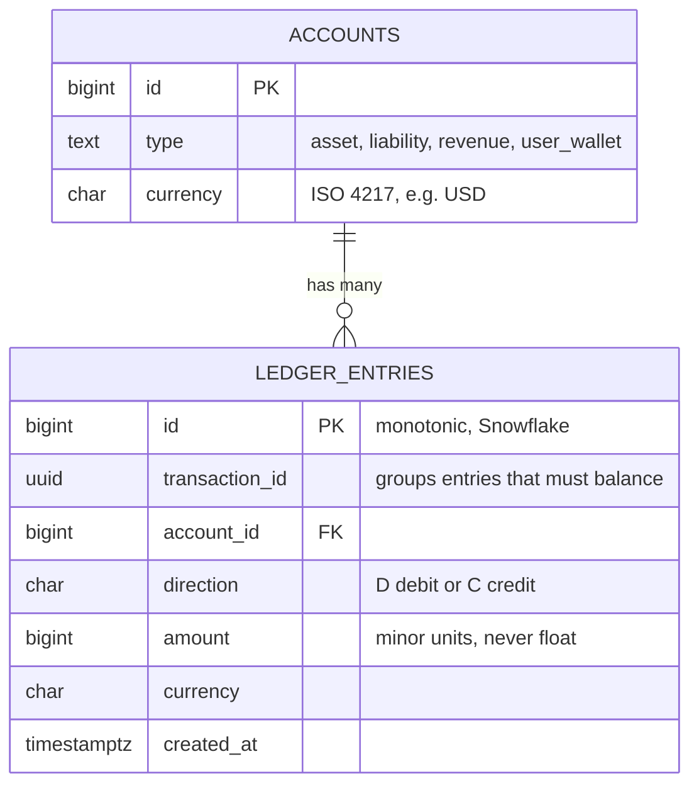
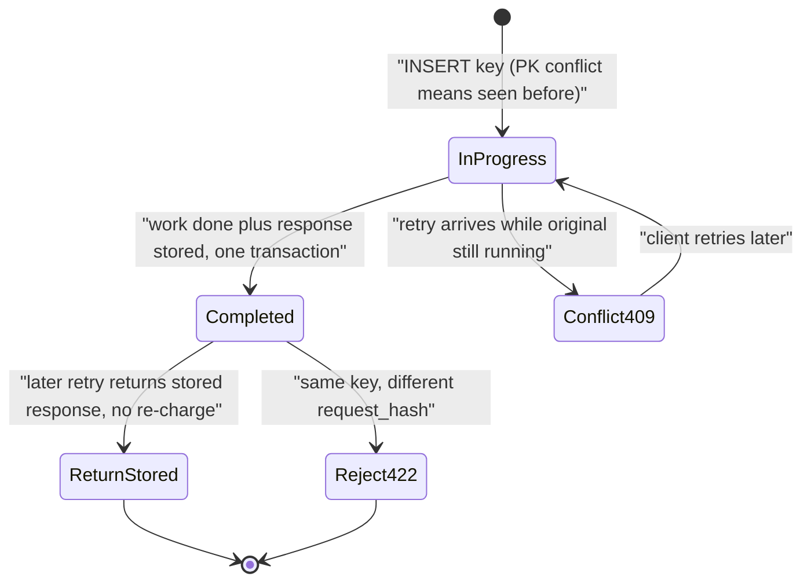
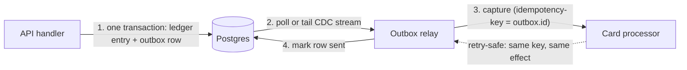
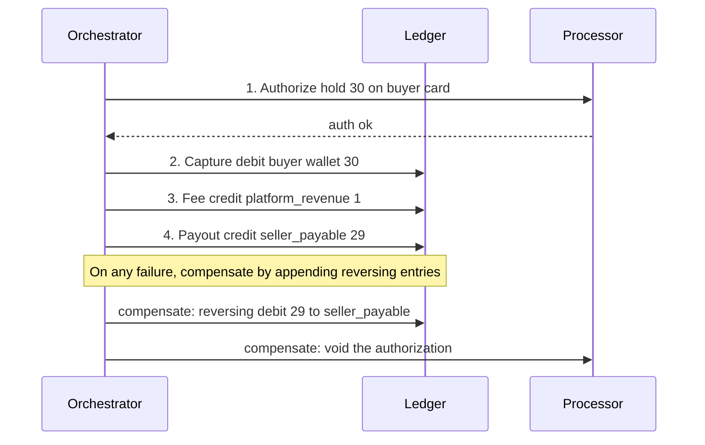
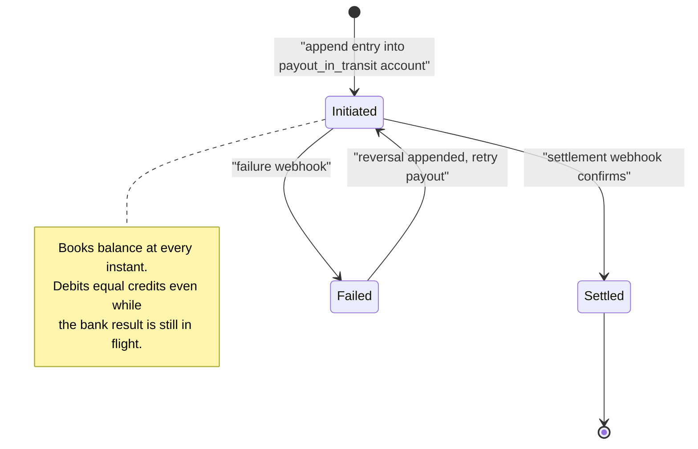

# Case Study: Payment System & Double-Entry Ledger

> **Where this fits:** The capstone case study where every consistency concept in this curriculum becomes load-bearing — money is the domain that punishes sloppy thinking with real financial loss, regulatory exposure, and angry customers. Sits at the intersection of [distributed transactions](../02-distributed-systems/15-distributed-transactions.md), [consistency models](../02-distributed-systems/12-consistency-and-cap.md), and [relational transactions](../01-building-blocks/07-databases-relational.md).
>
> **Principal-level takeaway:** Keep your *internal ledger* strongly consistent and immutable, treat the *external world* (card networks, banks, processors) as inherently eventual, and bridge the two with idempotency keys and reconciliation — never with optimism. The hardest part of a payment system is not moving money; it is knowing, with certainty and an audit trail, what state the money is in right now.

---

## ⚡ 60-Second TL;DR

- **What:** correct, auditable money movement via a **double-entry ledger** — every txn balances (**debits = credits**).
- **Ledger = append-only log; balances are derived** (SUM), with a materialized cache you can rebuild and re-prove from the log.
- **Idempotency keys** turn lost-response retries into exactly-once *effect*; **outbox + CDC** kills the dual-write trap (DB + processor).
- **Sagas** (orchestrated, reversing entries) for multi-step flows — eventual completion, **not isolation**; pending states are visible.
- **#1 trap:** "**exactly-once delivery**" doesn't exist — only at-least-once + idempotent consumers; lost-webhook audit gaps are caught only by **reconciliation**.
- **Numbers/rules:** money as **integer cents, never float**; ledger **strongly consistent** (single primary); Stripe keys live **24h**; settle T+1–T+3.

**Remember one thing:** Keep the internal ledger strongly consistent and append-only; treat the external world as eventual and bridge it with idempotency and reconciliation, never optimism.

## The Mental Model — first principles: why does money break our normal instincts?

Most systems an early-career engineer builds tolerate small errors. A like-count that's off by 3, a feed that's 5 seconds stale, a cache that occasionally serves a deleted post — these are bugs you fix on Monday. Money is different in kind, not degree. Three properties make it special:

1. **No lost writes, no double writes.** Crediting a merchant twice for one purchase is fraud or a loss. Failing to record a charge that hit the customer's card is theft from the other direction. There is no "eventually correct" that papers over a duplicated debit — the duplicate *is* the wrong answer, even momentarily.
2. **Full auditability.** You must be able to answer, for any point in time, "how did this balance get to this number?" and produce the chain of events that justifies it. Regulators (PCI-DSS, SOX, PSD2, your bank partner's audits) and your own dispute team will ask. "The database says $50" is not an answer; "$50 = +100 deposit −30 purchase −20 refund-reversal, here are the IDs and timestamps" is.
3. **Adversaries and irreversibility.** Once money leaves to an external party (a payout to a bank, an ACH credit), you often *cannot* claw it back. Combined with active fraud, this means you design assuming people will try to break your invariants on purpose.

The discipline that fell out of these constraints predates computers by 500 years: **double-entry bookkeeping**, formalized by Luca Pacioli in 1494. Its genius is a *built-in consistency check*. Every transaction touches at least two accounts, and the sum of debits always equals the sum of credits. If that invariant ever breaks, you know — immediately and locally — that something is wrong. We are, in effect, importing a battle-tested CRC into our data model.

The mental model to internalize: **a ledger is an append-only log of immutable events; balances are derived state.** You never mutate a balance. You append entries, and the balance is a `SUM`. This is the same insight behind event sourcing and write-ahead logs — the log is the truth, everything else is a projection.

---

## Core Concepts

### Double-entry as the data model

Forget `accounts.balance` as a column you `UPDATE`. The core schema is two tables:

```sql
-- The source of truth: immutable, append-only.
CREATE TABLE ledger_entries (
    id             BIGINT PRIMARY KEY,         -- monotonic, e.g. Snowflake ID
    transaction_id UUID NOT NULL,              -- groups entries that must balance
    account_id     BIGINT NOT NULL,
    direction      CHAR(1) NOT NULL,           -- 'D' (debit) or 'C' (credit)
    amount         BIGINT NOT NULL,            -- minor units (cents), NEVER float
    currency       CHAR(3) NOT NULL,
    created_at     TIMESTAMPTZ NOT NULL DEFAULT now(),
    CHECK (amount > 0)
);

CREATE TABLE accounts (
    id        BIGINT PRIMARY KEY,
    type      TEXT NOT NULL,    -- 'asset','liability','revenue','user_wallet', ...
    currency  CHAR(3) NOT NULL
);
```

The relationship between the two tables — one account, many immutable entries, each entry grouped under a `transaction_id` that must internally balance:



Two non-negotiable rules ride on top of this:

- **Balanced transactions:** within a single `transaction_id`, `SUM(amount WHERE direction='D') = SUM(amount WHERE direction='C')`. Enforce it in the transaction that writes the entries, and re-verify it offline. A `$30` purchase is *one* transaction with two entries: debit the customer wallet `$30`, credit the merchant payable `$30`. Money is conserved; it only moves between accounts.
- **Integer money.** Store cents (or the currency's minor unit) as integers. `0.1 + 0.2 != 0.3` in IEEE-754 floats, and that rounding error, multiplied across millions of transactions, is a regulatory finding. Use `BIGINT` cents or a decimal type — never `float`/`double`.

Balances are then *derived*:

```sql
SELECT SUM(CASE WHEN direction='C' THEN amount ELSE -amount END)
FROM ledger_entries WHERE account_id = :id;
```

Recomputing from the full log is `O(history)` and too slow at scale, so you maintain a **materialized balance** (a cached projection) updated in the same transaction that appends entries — and you periodically *re-derive from the log* to prove the cache is correct. The log stays authoritative; the balance row is a performance optimization you can always rebuild. (See [storage engines](../00-foundations/03-storage-engines.md) for why append-only writes are also cheap — they're sequential.)

### Idempotency keys — the canonical use case

The network gives you no exactly-once delivery. A client sends `POST /charges`, the request succeeds server-side, but the response is lost to a timeout. The client retries. Without protection, you charge the card twice. This is *the* payment-systems problem, and the standard solution is the **idempotency key**.

The client generates a unique key (a UUID) per logical operation and sends it on every retry of that operation:

```http
POST /v1/charges
Idempotency-Key: 8f1c...e3
{ "amount": 3000, "currency": "usd", "source": "card_x" }
```

Server-side, the key is a uniqueness constraint:

```sql
CREATE TABLE idempotency_keys (
    key            TEXT PRIMARY KEY,
    request_hash   TEXT NOT NULL,     -- detect key reuse w/ different params
    response_code  INT,
    response_body  JSONB,
    status         TEXT NOT NULL,     -- 'in_progress' | 'completed'
    created_at     TIMESTAMPTZ NOT NULL DEFAULT now()
);
```

The flow:

```
1. INSERT key with status='in_progress'  (PK conflict => key already seen)
2. On conflict:
     - if completed  -> return the stored response (no re-charge)
     - if in_progress -> the original is still running; return 409 "retry later"
3. Do the work + write the response + flip to 'completed' in ONE transaction.
```

As a state machine, the key has a tiny lifecycle — the uniqueness constraint is what serializes the original request against its retries:



> **Interactive:** [Isolation Anomalies & MVCC (interactive)](../animations/mvcc-isolation.html) -- try a concurrent retry against an in-progress key and watch how the unique-constraint conflict prevents the double-write that a naive read-then-insert would allow.

**Posting a charge: double-entry + idempotency together.** Here is the whole discipline in one function — debits must equal credits, amounts are integer minor units, entries are append-only, and an idempotency key guarantees a retried charge posts exactly once. Both versions run the entire thing in a single serializable database transaction so the idempotency insert and the balanced entries commit atomically.

```go
package ledger

import (
	"context"
	"database/sql"
	"errors"
	"fmt"
)

// Entry is one leg of a balanced transaction. Amount is in minor units
// (e.g. cents) and is always positive; Debit distinguishes direction.
type Entry struct {
	AccountID int64
	Debit     bool
	Amount    int64 // minor units, never a float
}

var (
	ErrUnbalanced   = errors.New("ledger: debits != credits")
	ErrNonPositive  = errors.New("ledger: amount must be positive")
	ErrKeyReuse     = errors.New("ledger: idempotency key reused with different request")
	ErrInProgress   = errors.New("ledger: original request still in progress")
)

// Post appends a balanced set of entries exactly once for the given
// idempotency key. A retry with the same key and same request returns
// nil without posting again; a retry with a different request is rejected.
func Post(ctx context.Context, db *sql.DB, key, requestHash, txID string, entries []Entry) error {
	var debits, credits int64
	for _, e := range entries {
		if e.Amount <= 0 {
			return ErrNonPositive
		}
		if e.Debit {
			debits += e.Amount
		} else {
			credits += e.Amount
		}
	}
	if debits != credits {
		return fmt.Errorf("%w: debits=%d credits=%d", ErrUnbalanced, debits, credits)
	}

	tx, err := db.BeginTx(ctx, &sql.TxOptions{Isolation: sql.LevelSerializable})
	if err != nil {
		return err
	}
	defer tx.Rollback() // no-op after a successful Commit

	// Claim the key. ON CONFLICT DO NOTHING lets us detect a prior claim.
	res, err := tx.ExecContext(ctx,
		`INSERT INTO idempotency_keys (key, request_hash, status)
		 VALUES ($1, $2, 'in_progress') ON CONFLICT (key) DO NOTHING`,
		key, requestHash)
	if err != nil {
		return err
	}
	if n, _ := res.RowsAffected(); n == 0 {
		// Key already exists: inspect its state.
		var existingHash, status string
		if err := tx.QueryRowContext(ctx,
			`SELECT request_hash, status FROM idempotency_keys WHERE key = $1`, key,
		).Scan(&existingHash, &status); err != nil {
			return err
		}
		if existingHash != requestHash {
			return ErrKeyReuse
		}
		if status != "completed" {
			return ErrInProgress
		}
		return nil // already completed: idempotent no-op
	}

	for _, e := range entries {
		dir := "C"
		if e.Debit {
			dir = "D"
		}
		if _, err := tx.ExecContext(ctx,
			`INSERT INTO ledger_entries (transaction_id, account_id, direction, amount)
			 VALUES ($1, $2, $3, $4)`,
			txID, e.AccountID, dir, e.Amount); err != nil {
			return err
		}
	}

	if _, err := tx.ExecContext(ctx,
		`UPDATE idempotency_keys SET status = 'completed' WHERE key = $1`, key); err != nil {
		return err
	}
	return tx.Commit()
}
```

```java
package ledger;

import java.sql.Connection;
import java.sql.PreparedStatement;
import java.sql.ResultSet;
import java.util.List;

public final class Ledger {

    /** One leg of a balanced transaction. Amount is in minor units (e.g. cents), always positive. */
    public record Entry(long accountId, boolean debit, long amount) {}

    public static final class UnbalancedException extends Exception {
        public UnbalancedException(String m) { super(m); }
    }
    public static final class KeyReuseException extends Exception {}
    public static final class InProgressException extends Exception {}

    /**
     * Appends a balanced set of entries exactly once for the given idempotency key.
     * A retry with the same key and request is a no-op; a different request is rejected.
     */
    public static void post(Connection conn, String key, String requestHash,
                            String txId, List<Entry> entries)
            throws Exception {
        long debits = 0, credits = 0;
        for (Entry e : entries) {
            if (e.amount() <= 0) throw new IllegalArgumentException("amount must be positive");
            if (e.debit()) debits += e.amount(); else credits += e.amount();
        }
        if (debits != credits) {
            throw new UnbalancedException("debits=" + debits + " credits=" + credits);
        }

        boolean prevAuto = conn.getAutoCommit();
        conn.setAutoCommit(false);
        conn.setTransactionIsolation(Connection.TRANSACTION_SERIALIZABLE);
        try {
            // Claim the key. ON CONFLICT DO NOTHING lets us detect a prior claim.
            int claimed;
            try (PreparedStatement ps = conn.prepareStatement(
                    "INSERT INTO idempotency_keys (key, request_hash, status) "
                  + "VALUES (?, ?, 'in_progress') ON CONFLICT (key) DO NOTHING")) {
                ps.setString(1, key);
                ps.setString(2, requestHash);
                claimed = ps.executeUpdate();
            }
            if (claimed == 0) {
                try (PreparedStatement ps = conn.prepareStatement(
                        "SELECT request_hash, status FROM idempotency_keys WHERE key = ?")) {
                    ps.setString(1, key);
                    try (ResultSet rs = ps.executeQuery()) {
                        rs.next();
                        if (!rs.getString("request_hash").equals(requestHash)) throw new KeyReuseException();
                        if (!"completed".equals(rs.getString("status"))) throw new InProgressException();
                    }
                }
                conn.commit();
                return; // already completed: idempotent no-op
            }

            try (PreparedStatement ps = conn.prepareStatement(
                    "INSERT INTO ledger_entries (transaction_id, account_id, direction, amount) "
                  + "VALUES (?, ?, ?, ?)")) {
                for (Entry e : entries) {
                    ps.setString(1, txId);
                    ps.setLong(2, e.accountId());
                    ps.setString(3, e.debit() ? "D" : "C");
                    ps.setLong(4, e.amount());
                    ps.addBatch();
                }
                ps.executeBatch();
            }

            try (PreparedStatement ps = conn.prepareStatement(
                    "UPDATE idempotency_keys SET status = 'completed' WHERE key = ?")) {
                ps.setString(1, key);
                ps.executeUpdate();
            }
            conn.commit();
        } catch (Exception ex) {
            conn.rollback();
            throw ex;
        } finally {
            conn.setAutoCommit(prevAuto);
        }
    }
}
```

Two subtleties that separate juniors from principals: **(a)** store the `request_hash` so that reusing a key with *different* parameters is rejected (`422`) rather than silently returning the old result — that's a client bug you want to surface. **(b)** Keys must be *scoped and expired*: Stripe retains idempotency results for 24 hours. Persisting them forever bloats the table; expiring them too fast reopens the double-charge window during slow retries.

### The dual-write problem and the outbox pattern

Here is the trap. A charge must do two things: **(1) record a ledger entry in your DB** and **(2) tell the external card processor to capture the funds.** These live in two different systems. If you do them as two separate calls, you have a **dual write**, and there is no ordering that is safe:

```
write ledger; then call processor  -> crash between => ledger says charged, money never moved
call processor; then write ledger  -> crash between => money moved, ledger has no record (worst case: audit gap)
```

You cannot wrap a database transaction and an HTTP call to Stripe in a single atomic commit — there is no distributed transaction across them, and 2PC against a third-party API is a fantasy. The principled fix is the **transactional outbox**:

```
BEGIN;
  INSERT INTO ledger_entries (...);        -- the local state change
  INSERT INTO outbox (id, type='capture',  -- the intent to call the processor
                      payload, status='pending');
COMMIT;                                      -- both or neither, same DB, one transaction
```

A separate **relay** polls the outbox (or tails the DB change log / CDC stream — see [messaging & streaming](../01-building-blocks/11-messaging-and-streaming.md)) and makes the external call, retrying until it succeeds, then marks the row `sent`. Because the relay may crash and re-deliver, the external call **must carry the outbox row's id as the processor's idempotency key** — turning at-least-once delivery into effectively-once *effect*. This is how you get the famous "exactly-once" guarantee: not by magic, but by **at-least-once delivery + idempotent consumers**. There is no other way; "exactly-once delivery" over an unreliable network is provably impossible.



### Sagas for multi-step payment flows

Real payments are rarely one step. A marketplace checkout might be: *reserve buyer funds → debit buyer → credit platform fee → credit seller payable → schedule payout.* These span services and time. You cannot hold a single ACID transaction across all of them (locks held for seconds-to-days, across service boundaries — see [distributed transactions](../02-distributed-systems/15-distributed-transactions.md)).

A **saga** breaks the flow into local transactions, each with a **compensating action** that semantically undoes it. Note: in a ledger you don't *delete* the debit — you append a *reversing entry*. The undo is itself an auditable event.

```
Step        Forward                       Compensation
----        -------                       ------------
1 Authorize hold $30 on buyer card        void the authorization
2 Capture   debit buyer wallet $30        append reversing credit $30
3 Fee       credit platform_revenue $1    append reversing debit $1
4 Payout    credit seller_payable $29     append reversing debit $29
```

The same flow as a sequence, with an orchestrator driving each step and appending reversing entries to compensate on failure:



> **Interactive:** [Distributed Transactions: 2PC vs Saga (interactive)](../animations/saga-vs-2pc.html) -- step a saga through a mid-flow failure and watch compensations unwind, versus 2PC blocking with locks held when the coordinator stalls.

Orchestrated sagas (a central coordinator drives each step) are easier to reason about and debug for money flows than choreographed ones (services react to each other's events) — you get one place that knows the whole state machine. Most payment platforms choose orchestration for exactly this auditability reason.

### The external world is eventual; your internal world is not

You control your ledger; you do *not* control banks. ACH settles in 1–3 business days. Card *authorization* is near-instant but *capture/settlement* is hours-to-days later. The result arrives **asynchronously via webhooks** — and webhooks are unreliable: duplicated, out of order, and occasionally never sent.

The design principle: **model external money as a state machine with `pending` intermediate states inside your strongly consistent ledger.** When you initiate a payout, you immediately append an entry moving funds into a `payout_in_transit` account (a real account, so the books still balance). When the settlement webhook confirms, you append the entry moving it to `settled`. If it fails, you append a reversal. Your internal invariant (debits=credits) holds *at every instant*, even though the external truth is still in flight. You never let external latency leak into internal inconsistency.

Modeled as a state machine, a payout moves through internal accounts as external truth arrives — and the books balance at every transition because each move is itself a balanced pair of entries:



Webhook handling rules: verify the signature (HMAC), treat every webhook as **at-least-once** (dedupe on the processor's event id — same idempotency discipline), and tolerate **out-of-order** delivery (a `settled` webhook may arrive before you've finished processing `pending` — make handlers order-independent by keying off the authoritative external state, not the arrival order).

### Reconciliation — assume drift and detect it

Even with all of the above, your ledger and the processor's ledger *will* diverge: a webhook was lost, a capture was retried in a way that confused the processor, a refund crossed a chargeback. **Reconciliation** is the scheduled batch job that fetches the processor's settlement report (Stripe payout report, the card network's daily file) and matches it line-by-line against your ledger.

Every line falls into one of three buckets: **matched** (great), **in our ledger but not theirs** (we think we charged but they didn't — investigate), **in theirs but not ours** (money moved without a record — *the dangerous one*, an audit gap). Reconciliation is not optional polish; it is the safety net that catches the bugs the rest of the design missed. Run it daily, alert on unmatched lines above a threshold, and never let the unmatched queue grow silently.

### Fraud and limits as a design concern

Fraud controls and velocity limits ("max $5,000/day", "no more than 3 cards per account") are **synchronous gates on the write path**, evaluated *before* the ledger commit. The design tension: these checks need a *consistent* read of recent activity (you can't enforce a daily limit against a stale replica that's 10s behind — see [replication](../01-building-blocks/09-replication.md)), but they also can't add 500ms to every payment. The usual answer is a fast, strongly-consistent counter (the limit state) checked inline, with heavier ML-based scoring done asynchronously and able to *flag/hold* funds (append to a `held` account) after the fact. Limits are a correctness concern, not just a product feature — they cap blast radius when an account is compromised.

---

## Trade-offs at a Glance

| Decision | Option A | Option B | When to choose which |
|---|---|---|---|
| **Internal consistency** | Strongly consistent (single-region RDBMS, serializable-ish) | Eventually consistent (multi-region NoSQL) | **Almost always A for the ledger.** Money's invariants (no lost/double writes, balanced books) demand it. Use B only for read-side projections/analytics. |
| **Balance representation** | Derived from log + materialized cache | Mutable balance column | A — the log is the audit trail and the recovery source. B alone loses history and provability. |
| **Cross-system writes** | Outbox / CDC | Direct dual write | Outbox, always. Dual write has no crash-safe ordering. |
| **Exactly-once** | At-least-once + idempotent consumer | "Exactly-once delivery" | The former — the latter doesn't exist over a network. |
| **Multi-step flow** | Saga (orchestrated) | Single distributed ACID txn / 2PC | Saga. 2PC across services/3rd parties is impractical and a liveness risk. |
| **Money type** | Integer minor units / decimal | Floating point | Integer/decimal. Floats lose pennies — a compliance finding. |
| **Reconciliation** | Scheduled batch vs external source | "Trust the webhooks" | Always reconcile. Webhooks are best-effort. |

---

## How Real Systems Do It

- **Stripe** exposes idempotency keys as a first-class API header, retains results for **24 hours**, and stores money as integer minor units. Internally, Stripe runs its core online data on a custom, horizontally-sharded **MongoDB-based** store (their "DocDB"), layering its own strong-consistency and transactional guarantees on top, with an immutable ledger and extensive reconciliation around it. Their famous engineering post *"Designing robust and predictable APIs with idempotency"* is required reading.
- **TigerBeetle** is a purpose-built, open-source **double-entry accounting database**. It's strict serializable, uses **deterministic state-machine replication via Viewstamped Replication** (VR — Oki & Liskov, 1988; the same crash-fault-tolerant consensus family that Paxos and Raft belong to, and which predates Raft by decades — see [consensus](../02-distributed-systems/13-consensus.md)), enforces debits=credits as a primitive, and is designed for *millions* of transfers/sec. It exists precisely because bolting a ledger onto a general-purpose DB is hard to get right. Studying its design teaches the domain.
- **PayPal / Square / Adyen** run internal double-entry ledgers with daily reconciliation against card networks and banking partners. Settlement is explicitly modeled as multi-day; "available" vs "pending" balances you see as a user are different ledger account states.
- **Uber's "Ledger"** (and similar internal systems at Airbnb, DoorDash) treat every fare as a saga across rider charge, driver payout, taxes, and fees, with an append-only ledger underneath.
- **Postgres / MySQL** remain the workhorse store for the authoritative ledger at most companies short of extreme scale — a single primary with synchronous replicas gives you the strong consistency and transactional integrity money needs; you reach for sharding ([partitioning](../01-building-blocks/10-partitioning-sharding.md)) only when one node can't hold the write volume. Sharding a *double-entry* ledger is genuinely hard: a transaction touches at least two accounts, so unless you carefully co-locate related accounts on the same shard (e.g. by a tenant/wallet-group key), the balanced write spans shards and you're back to a cross-shard atomic commit (2PC or saga). This difficulty — not just write throughput — is a big reason purpose-built ledgers like TigerBeetle exist.

Rough numbers to anchor intuition: card auth latency budget is typically **under ~300ms**; settlement is **T+1 to T+3 days**; ACH is **1–3 business days**; a mid-size fintech might process **thousands of transactions/sec** at peak, which a well-tuned single Postgres primary handles comfortably for the ledger write path.

---

## Failure Modes & Common Misconceptions

**Failure modes that actually bite in production:**

- **The lost-webhook audit gap.** The processor captured funds; the webhook never arrived; your ledger has no entry. Only reconciliation catches this. If you don't run it, the gap is invisible until an auditor finds it.
- **Idempotency key reused with new params.** Client recycles a key for a *different* charge; naive servers return the old success and silently drop the new charge. Hash the request body and reject mismatches.
- **Race on first request + retry.** Original request is still `in_progress` when the retry lands. Without the `in_progress` state + conflict handling, both execute and you double-charge. The `INSERT ... ON CONFLICT` (or a unique index) is the lock.
- **Replica-lag limit bypass.** Fraud/velocity checks read a stale replica and let a compromised account blow past its daily cap. Limits must read the consistent primary or a strongly-consistent counter.
- **Float drift.** A `4.1%` fee on millions of transactions, computed in float, leaves the books unbalanced by pennies that compound. Integers only.

**Misconceptions to call out explicitly:**

- ❌ *"Exactly-once delivery is achievable, I just need the right queue."* No. Network partitions make exactly-once *delivery* impossible (it's a corollary of the Two Generals problem). You achieve exactly-once *effect* with at-least-once delivery + idempotent operations. Every "exactly-once" system (Kafka included) does this underneath.
- ❌ *"I'll just `UPDATE accounts SET balance = balance - 30`."* You've thrown away the audit trail, you have no way to prove how the balance got there, and a single bad update silently corrupts state with no detection. Append entries; derive balances.
- ❌ *"Sagas give me atomicity."* They give *eventual* completion with compensation, **not isolation.** Between steps, intermediate states are visible. You must design those `pending`/`held` states to be safe to observe — partial saga states are real states, not bugs.
- ❌ *"2PC will keep my two systems consistent."* 2PC has a blocking failure mode (coordinator dies, participants hold locks indefinitely) and you can't run it against Stripe anyway. Outbox + idempotency is the practical answer.
- ❌ *"Eventual consistency is fine if it converges fast."* For *internal* money invariants, "momentarily double-counted" is a wrong answer that someone can act on (spend twice). Keep the ledger strongly consistent.
- ❌ *"More money is the dangerous error."* Both directions are bugs. Missing a debit that hit the card is just as wrong and just as much a liability — and harder to notice because no customer complains about being undercharged.

---

## In a Design Discussion

When you're whiteboarding a payment system, the interviewer is testing whether you respect the domain's constraints or treat it like a CRUD app.

**Junior take:** "Users have a balance column. On purchase, I check the balance, subtract the amount, and call the Stripe API. I'll add retries on the Stripe call so it's reliable."

Why it fails: mutable balance (no audit trail, no recovery), check-then-act race (TOCTOU — two concurrent purchases both pass the check), dual write (crash between DB update and Stripe call corrupts state), and retries on a non-idempotent call double-charge.

**Principal take:** "The ledger is append-only and strongly consistent — Postgres primary, balances derived and materialized, debits=credits enforced and reconciled. Every external-facing operation takes an idempotency key. I never dual-write: the ledger entry and the *intent* to call the processor commit in one transaction via an outbox, and a relay delivers it with the outbox id as the processor's idempotency key — at-least-once delivery, idempotent effect. Multi-step flows are orchestrated sagas with reversing entries as compensation. External settlement is modeled as `pending`/`in_transit` ledger accounts so my internal invariant holds even though the bank is eventual. A daily reconciliation job matches my ledger against the processor's report and alerts on unmatched lines. Velocity limits read the consistent primary inline; ML fraud scoring runs async and can place holds. Money is integer cents."

Notice the principal answer leads with **invariants and failure handling**, not the happy path. In a real design review, the questions to drive toward are: *Where can we lose or double a write? How do we prove the books are right? What happens when the processor webhook is lost? What's visible mid-saga?* For documenting the strong-consistency decision and its consequences, an [ADR](../05-principal-skills/29-tradeoffs-and-adrs.md) is the right artifact. Observability matters too — you want [metrics, traces, and SLOs](../03-architecture-and-apis/19-observability.md) on the outbox lag, the unmatched-reconciliation queue, and idempotency-conflict rates.

---

## Self-Check

<details>
<summary>1. Why is a derived balance (SUM over an append-only log) preferred over a mutable balance column?</summary>
The log is an immutable audit trail — you can prove how any balance was reached, replay it to recover from corruption, and reconcile against it. A mutable column loses history and can be silently corrupted with no detection. You keep a materialized balance for speed, but the log is authoritative.
</details>

<details>
<summary>2. A client sends a charge, times out, and retries with the same idempotency key while the first request is still processing. What must the server do?</summary>
Reject/hold the retry (e.g., return 409) because the key exists with status `in_progress`. The uniqueness constraint on the key is the lock that prevents both from executing. Only once the first completes (and stores its response) does a retry return the stored result.
</details>

<details>
<summary>3. Explain why "charge the card AND write the ledger entry" cannot be done as two sequential calls, and what fixes it.</summary>
It's a dual write across two systems with no atomic commit; a crash between them leaves you charged-but-unrecorded or recorded-but-uncharged. The outbox pattern fixes it: write the ledger entry and the "call processor" intent in one local transaction, then a relay delivers the external call idempotently (using the outbox id as the processor's idempotency key).
</details>

<details>
<summary>4. Is exactly-once delivery achievable? How do payment systems get "exactly-once"?</summary>
No — exactly-once *delivery* is impossible over an unreliable network. You get exactly-once *effect* via at-least-once delivery plus idempotent consumers (idempotency keys). The duplicate is delivered; the operation just doesn't have a duplicate effect.
</details>

<details>
<summary>5. What does a saga guarantee, and critically, what does it NOT guarantee?</summary>
It guarantees eventual completion-or-compensation across steps. It does NOT guarantee isolation — intermediate states (a debit applied before the credit) are visible. You must design those pending/held states to be safe to observe. Compensation in a ledger is a reversing entry, not a delete.
</details>

<details>
<summary>6. Why must velocity/fraud limit checks not read from a read replica?</summary>
Replicas lag (seconds). A compromised account could exceed its daily limit by racing against stale counter reads. Limits are a correctness gate and must read the strongly-consistent primary (or a strongly-consistent counter).
</details>

<details>
<summary>7. The processor's settlement report shows a capture your ledger has no record of. Which reconciliation bucket is this, and why is it the scary one?</summary>
"In theirs but not ours" — an audit gap where money moved without a record (likely a lost webhook or a relay bug). It's the dangerous case because nothing in your system flagged it; only reconciliation surfaces it, and unrecorded money movement is a direct compliance/financial-integrity problem.
</details>

<details>
<summary>8. Why store money as integer cents instead of a float?</summary>
IEEE-754 floats can't represent many decimal fractions exactly (0.1 + 0.2 ≠ 0.3). Across millions of transactions and percentage-based fees, rounding error compounds and unbalances the books — a compliance finding. Integers (or fixed-point decimals) are exact.
</details>

---

## Go Deeper

- **Designing Data-Intensive Applications** (Kleppmann): **Ch. 7 (Transactions)** for isolation levels and the dangers of weak isolation; **Ch. 9 (Consistency & Consensus)** for linearizability and why money wants it; **Ch. 11 (Stream Processing)** for the outbox/CDC and exactly-once-effect discussion; **Ch. 12** ties event logs to derived state.
- **Stripe Engineering** — *"Designing robust and predictable APIs with idempotency"* and *"Online migrations at scale"*. The canonical industry writeups on idempotency keys.
- **TigerBeetle** — design docs and talks (especially on "Why a database for accounting?"). The clearest modern articulation of double-entry as a database primitive and deterministic state-machine replication.
- **Pattern: Transactional Outbox** and **Pattern: Saga** on microservices.io (Chris Richardson) — concise, authoritative pattern definitions.
- **Martin Fowler** — *"Event Sourcing"* and *"Accounting Patterns"* (the original "ledger as event log" framing).
- **Pacioli, *Summa de Arithmetica* (1494)** — the origin of double-entry. Worth a paragraph of history to understand *why* the data model self-checks.
- Sibling chapters: [Distributed Transactions, Sagas & Idempotency](../02-distributed-systems/15-distributed-transactions.md), [Consistency Models, CAP & PACELC](../02-distributed-systems/12-consistency-and-cap.md), [Relational Databases: Transactions & Isolation](../01-building-blocks/07-databases-relational.md), [Messaging & Streaming](../01-building-blocks/11-messaging-and-streaming.md), and [Security in System Design](../03-architecture-and-apis/20-security.md) for PCI scope and webhook signature verification.
