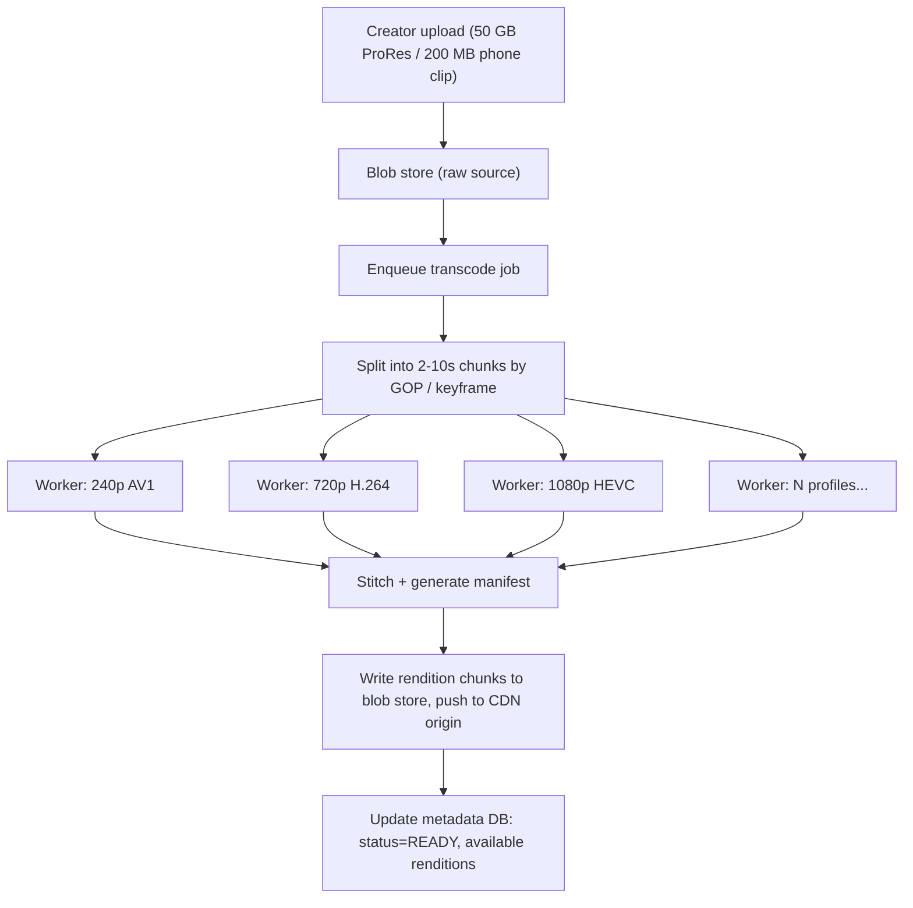
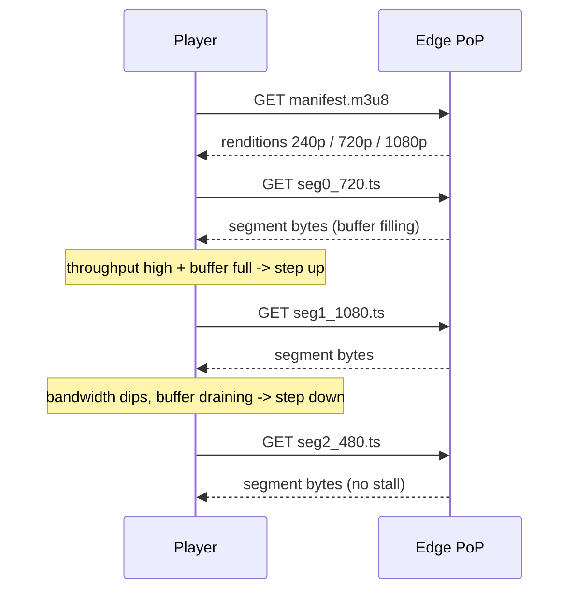
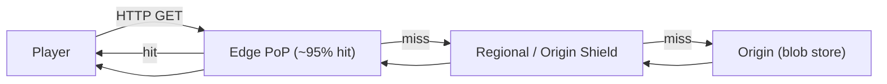
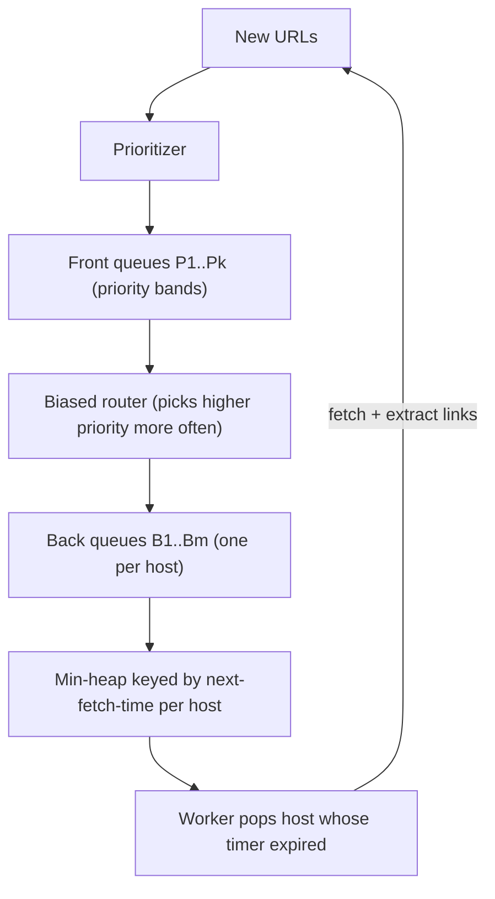

# Case Studies: Video Streaming (YouTube/Netflix) & Web Crawler

> **Where this fits:** Two capstone designs that stress the *read* and *write* extremes of the internet — one delivers petabytes of video to billions of viewers with near-zero origin load, the other politely ingests the open web one HTTP request at a time. They share almost no code but a surprising amount of judgment.
>
> **Principal-level takeaway:** In both systems, the database is almost never the hard part. Video streaming is won or lost at the *edge* — the CDN and the egress bill, not the metadata store. A crawler is won or lost at the *frontier* — politeness, dedup, and trap avoidance, not raw fetch throughput. Beginners design the boring middle; principals design the edges where the cost and the failure live.

---

## ⚡ 60-Second TL;DR

- **Two capstones, one lesson:** build around the genuinely scarce resource — **edge bandwidth/egress $** for streaming, **politeness + dedup** for crawling. The DB is never the hard part.
- **Streaming = ABR over a CDN:** client pulls a **manifest** + immutable **2–10s segments** and picks quality per segment; any dumb HTTP cache serves it, no origin logic.
- **Transcode** async fan-out into a {resolution × codec} matrix; **per-title encoding** ~20% bits saved, **AV1/HEVC** ~30–50% fewer bits at higher encode cost.
- **Crawler = the frontier:** **front queues** (priority) + **back queues** (per-host politeness timer); shard by **hostname hash** so politeness is local.
- **Dedup:** **Bloom filter** for "seen?" (~10 bits/elem at ~1% FP) — no false negatives is the load-bearing property; **SimHash** for near-dup content/traps.
- **#1 traps:** streaming cache-hit drop **95%→70% ≈ 6× egress**; crawler session-id/calendar **spider traps** mint infinite URLs.

**Remember one thing:** Name the scarce/hard resource in the first 30 seconds and structure the entire design around protecting it.

## The Mental Model — first principles

Strip both systems to their physics.

**Video streaming is a bandwidth-distribution problem disguised as a software problem.** A single 1080p stream is roughly 5 Mbps. Ten million concurrent viewers is 50 **terabits per second** of egress. No single datacenter has 50 Tbps of upstream capacity, and even if it did, the speed of light means a viewer in Mumbai watching a server in Virginia eats ~200 ms RTT per request — fatal for the chatty, many-small-requests protocol that adaptive streaming actually is. The entire architecture exists to answer one question: *how do I get the bytes physically close to the eyeballs?* Everything else — transcoding, metadata, recommendations — is supporting cast. The CDN is the protagonist.

**A web crawler is a politeness-constrained graph traversal disguised as a download loop.** The naive version is a five-line BFS: pop a URL, fetch it, extract links, push them. That version gets your IP banned in an hour, melts a small site's server, re-downloads the same content infinitely through URL aliasing, and falls into a "calendar" that generates `/2027/01/01`, `/2027/01/02`… forever. The crawler exists to traverse a graph that is (a) adversarial, (b) infinite, (c) owned by other people who have rules, and (d) constantly changing. The download loop is trivial; the *frontier* — what to fetch next, when, and whether you should at all — is the entire engineering problem.

Both designs hammer the same principle: **identify the resource that is genuinely scarce or genuinely hard, and build the whole system around protecting it.** For streaming, scarce = edge bandwidth and origin egress dollars. For crawling, scarce = your reputation as a network citizen and your ability to avoid infinite/duplicate work.

---

## Core Concepts

### Part A — Video Streaming

#### A1. The upload + transcode pipeline (write path)

A creator uploads one source file. You never serve that file. The source might be a 50 GB ProRes master or a phone's 200 MB H.264 clip — neither is what you stream. The write path is an asynchronous fan-out pipeline:



Key decisions:

- **Transcoding is embarrassingly parallel and done by async workers**, not in the request path. A 10-minute video is split into chunks (often by GOP / keyframe boundaries) and each chunk is encoded independently across a worker fleet, then stitched. This turns a 30-minute serial encode into a 1-minute parallel one. YouTube and Netflix both do chunk-level distributed transcoding.
- **You produce a *matrix* of outputs:** {resolutions} × {codecs} × {audio tracks}. Netflix famously goes further with **per-title** (and now per-shot / per-scene) encoding — an animation with flat colors needs far fewer bits than a fast-motion sports clip, so the bitrate ladder is computed per asset rather than fixed. This saved Netflix ~20% bandwidth on average vs. a one-size ladder.
- **Codec choice is an egress-cost lever, not a feature.** H.264 is universal but inefficient. HEVC/H.265 and AV1 cut ~30–50% of the bits for the same quality but cost more CPU to encode and aren't supported on every device. The trade: encode once (expensive, one-time) to save bandwidth forever (recurring). At YouTube/Netflix scale, AV1's encode cost is trivially amortized over billions of views.

This is a classic asynchronous job pipeline — see [Message Queues & Stream Processing](../01-building-blocks/11-messaging-and-streaming.md). The job must be **idempotent** (re-running a failed chunk encode must be safe; see [Distributed Transactions, Sagas & Idempotency](../02-distributed-systems/15-distributed-transactions.md)) because workers die mid-encode constantly.

#### A2. Adaptive Bitrate Streaming (ABR): HLS & DASH

You do not stream "a video." You stream a **manifest** plus thousands of small **chunks**, and the *client* decides which quality to pull next based on its measured bandwidth. This is the single most important concept in modern streaming.

```
manifest.m3u8 (HLS) describes available renditions:
  240p  → seg0_240.ts,  seg1_240.ts,  ...
  720p  → seg0_720.ts,  seg1_720.ts,  ...
  1080p → seg0_1080.ts, seg1_1080.ts, ...

Player downloads ~4–10s segments. Each segment boundary, it re-decides:
  measured throughput high + buffer full → step up to 1080p
  throughput dropped / buffer draining   → step down to 480p
```

The per-segment adaptation loop, where the *client* drives every quality decision against a single dumb HTTP cache:



- **HLS** (Apple, originally `.ts`, now also fMP4) and **MPEG-DASH** (open standard, `.m4s`) are the two dominant protocols. They're conceptually identical: a text manifest pointing at time-sliced media segments served over plain HTTP. Because it's *just HTTP GETs of static files*, **any CDN can serve it with zero special logic** — that's the whole point and why ABR won over stateful protocols like RTMP.
- **Chunking enables three things at once:** (1) adaptivity at segment boundaries, (2) CDN cacheability (a segment is an immutable static object — cache it forever), and (3) seeking (jump to segment N without downloading 0..N-1).
- **The buffer is the shock absorber.** The client keeps ~10–30s buffered. A bandwidth dip doesn't cause a stall; it causes the *next* segment to be requested at lower quality. Stalls (rebuffering) only happen when the buffer fully drains — the #1 quality-of-experience metric streaming teams obsess over.

Live streaming is the same model with a tiny segment duration to shrink latency, or newer **LL-HLS / CMAF chunked-transfer** to push glass-to-glass latency under a few seconds.

#### A3. The CDN is the system — and the egress reality

For an on-demand library, the steady-state read pattern is: client → nearest CDN PoP → (cache hit ~95%+) → bytes. The origin is barely touched.

- **Egress is the dominant cost.** Public-cloud egress runs roughly **$0.05–$0.09/GB**; a CDN brings the *origin* egress near zero by caching, but you still pay the CDN's per-GB delivery (often $0.01–0.05/GB negotiated down hard at scale). At Netflix scale this is so expensive they built their **own CDN, Open Connect**, and ship physical appliances (OCAs) into ISP datacenters for free. The ISP saves transit cost; Netflix gets ~100% of traffic served from inside the ISP's network. This is vertical integration driven purely by the egress bill.
- **Cache hierarchy matters.** Hot content (a viral video, a new Netflix release) lives in edge PoPs near everyone. Long-tail content lives at fewer, larger regional caches and is fetched on demand. This is a textbook caching problem — see [Caching](../01-building-blocks/06-caching.md). The 95% hit rate is what makes the economics work; a 70% hit rate would multiply origin cost ~6×.
- **Cache keying & invalidation:** segments are immutable and content-addressed (or versioned in the URL), so they never need invalidation — you just stop referencing them. This is why ABR segments are so CDN-friendly: no invalidation problem, the hardest part of caching, simply doesn't exist.



Manifests and segments are immutable, cache-forever objects, so a miss only bubbles outward on the rare cold/long-tail fetch.

#### A4. Metadata vs. blob split, thumbnails, and recommendations (briefly)

- **Two storage worlds.** Video bytes live in a **blob/object store** (S3-class; see [Distributed Object Store & KV Store](../04-design-case-studies/26-object-store-and-kv-store.md)) fronted by the CDN. *Metadata* — title, owner, view count, available renditions, ACLs, manifest pointers — lives in a database optimized for high-volume reads (often a wide-column store like Bigtable/Cassandra/Vitess-sharded MySQL). **Never store blobs in your relational DB**; you'd destroy its cache and replication. The DB holds *pointers*, not pixels.
- **Thumbnails & preview sprites** are generated in the same async pipeline: extract frames at intervals, produce a poster image plus a sprite sheet (the hover-scrub preview is a single image of tiled mini-frames + a WebVTT file mapping timecode → sprite coordinates). These are tiny, hot, and CDN-cached like everything else.
- **Recommendations** are a separate offline/near-line ML system (collaborative filtering + deep models) that produces a ranked list per user, served from a precomputed feed store. It's out of scope here, but the design lesson is the same as a [news feed](../04-design-case-studies/23-news-feed-and-timeline.md): rank offline, serve precomputed, never compute on the read path.

---

### Part B — Web Crawler

#### B1. The URL frontier — the heart of the crawler

The frontier is the priority queue of URLs to fetch. It must simultaneously satisfy two competing constraints that *fight each other*:

1. **Prioritization** — fetch important/fresh URLs sooner (a news homepage > a 2009 forum post).
2. **Politeness** — never hammer one host; respect per-domain rate limits and `Crawl-delay`.

The classic design (from Mercator — built at Compaq SRC, it became AltaVista's production crawler) splits the frontier into **two banks of queues**:



- **Front queues** sort by priority. **Back queues** enforce politeness: each back queue holds URLs for a *single host*, and a min-heap tracks the earliest time each host is allowed to be hit again (e.g., `last_fetch_end + crawl_delay`). A worker only pulls from a host whose timer has fired. This guarantees you respect per-host rate limits *globally* even with thousands of parallel workers.
- **Politeness is per-host, not global.** You can fetch 10,000 different hosts in parallel while touching each one only every ~1–5 seconds. The frontier's job is to keep workers busy *across* hosts without bursting *any single* host.

#### B2. DNS at scale — the silent bottleneck

Every fetch needs a hostname→IP resolution. At billions of URLs, **DNS becomes a top latency cost** and can DoS your own resolver. Mitigations:

- A **local caching DNS layer** with long-lived entries (respecting but often extending TTLs for crawl purposes).
- **Asynchronous/batched resolution** — synchronous `getaddrinfo()` blocks the calling thread, and stock resolvers historically serialized concurrent lookups behind a global lock (the original Mercator had to replace Java's synchronized resolver with a custom multithreaded one); high-scale crawlers use async resolvers.
- Pre-resolving and grouping URLs by IP to reinforce politeness (some hosts share an IP; politeness arguably applies per-IP, not just per-hostname, to avoid hammering one physical server behind many vhosts).

#### B3. Dedup — URL-level and content-level, via Bloom filters

You will rediscover the same URL millions of times, and many distinct URLs serve identical content. Two dedup layers:

- **URL dedup ("seen?"):** before adding a URL to the frontier, check membership in a "seen set." At 10^11 URLs, an exact hash set won't fit in RAM. Use a **Bloom filter** (or scalable/partitioned Bloom) — a probabilistic set with no false negatives and a tunable false-positive rate (~1% costs ~10 bits/element). False positives mean you *occasionally skip a new URL* — acceptable. False negatives would mean infinite re-crawls — unacceptable, which is exactly why Bloom's "no false negatives" property fits.

> **Interactive:** [Bloom Filter (interactive)](../animations/bloom-filter.html) -- add a few URLs, then watch how a never-seen URL can still hash into all-set bits (a false positive) while a seen URL can never report "unseen."
- **Content dedup:** two URLs (`?utm_source=a` vs `?utm_source=b`) may return byte-identical pages. Hash the *content* (or a shingled fingerprint like **SimHash/MinHash** for *near*-duplicates) and skip storing/indexing duplicates. Near-dup detection (SimHash) catches the "same article on 50 mirror domains" problem that exact hashing misses.

```python
# conceptual: dedup before enqueue
if url_normalized not in url_seen_bloom:      # cheap probabilistic check
    url_seen_bloom.add(url_normalized)
    frontier.enqueue(url_normalized, priority)
# after fetch:
fp = simhash(content)
if fp not in content_fingerprints_recent:     # near-dup detection
    store(content); index(content)
```

URL **normalization** (lowercase host, strip default ports, sort query params, resolve `../`, drop fragments) happens *before* the seen-check — otherwise trivial variants defeat dedup.

The two scarce-resource guards from the frontier — the Bloom "seen?" set and the per-domain politeness timer — are small enough to implement directly. Below is a complete, idiomatic version of each in Go and Java. Both filters derive `k` hash positions from two 64-bit hashes via Kirsch–Mitzenmacher double hashing (`h1 + i*h2`), the standard trick that avoids computing `k` independent hashes.

**Bloom filter for URL dedup**

```go
package crawler

import (
	"hash/fnv"
	"math"
	"sync"
)

// BloomFilter is a fixed-size, concurrency-safe probabilistic set.
// It guarantees no false negatives: Add(x) then Test(x) is always true.
type BloomFilter struct {
	mu   sync.RWMutex
	bits []uint64 // bit i lives in bits[i/64], offset i%64
	m    uint64   // number of bits
	k    uint64   // number of hash functions
}

// NewBloomFilter sizes the filter for n expected elements at false-positive
// rate p, using the standard optimal m and k formulas.
func NewBloomFilter(n uint64, p float64) *BloomFilter {
	m := uint64(math.Ceil(-float64(n) * math.Log(p) / (math.Ln2 * math.Ln2)))
	k := uint64(math.Max(1, math.Round(float64(m)/float64(n)*math.Ln2)))
	return &BloomFilter{bits: make([]uint64, (m+63)/64), m: m, k: k}
}

// hashes returns the two base hashes for Kirsch-Mitzenmacher double hashing.
func (b *BloomFilter) hashes(data string) (uint64, uint64) {
	h := fnv.New64a()
	_, _ = h.Write([]byte(data))
	h1 := h.Sum64()
	_, _ = h.Write([]byte{0xff}) // perturb for a second independent-ish hash
	h2 := h.Sum64()
	return h1, h2
}

// Add inserts an element. Returns false if it was (probably) already present,
// true if it was definitely new — letting callers dedup in one call.
func (b *BloomFilter) Add(data string) (added bool) {
	h1, h2 := b.hashes(data)
	b.mu.Lock()
	defer b.mu.Unlock()
	added = false
	for i := uint64(0); i < b.k; i++ {
		idx := (h1 + i*h2) % b.m
		word, mask := idx/64, uint64(1)<<(idx%64)
		if b.bits[word]&mask == 0 {
			b.bits[word] |= mask
			added = true // at least one bit flipped => definitely new
		}
	}
	return added
}

// Test reports whether data is possibly present (true) or definitely absent.
func (b *BloomFilter) Test(data string) bool {
	h1, h2 := b.hashes(data)
	b.mu.RLock()
	defer b.mu.RUnlock()
	for i := uint64(0); i < b.k; i++ {
		idx := (h1 + i*h2) % b.m
		if b.bits[idx/64]&(uint64(1)<<(idx%64)) == 0 {
			return false
		}
	}
	return true
}
```

```java
import java.nio.charset.StandardCharsets;
import java.util.concurrent.locks.ReadWriteLock;
import java.util.concurrent.locks.ReentrantReadWriteLock;

/**
 * Fixed-size, thread-safe probabilistic set. Guarantees no false negatives:
 * after add(x), mightContain(x) is always true.
 */
public final class BloomFilter {
    private final long[] bits; // bit i lives in bits[i/64], offset i%64
    private final long m;      // number of bits
    private final int k;       // number of hash functions
    private final ReadWriteLock lock = new ReentrantReadWriteLock();

    public BloomFilter(long n, double p) {
        double ln2 = Math.log(2);
        this.m = (long) Math.ceil(-n * Math.log(p) / (ln2 * ln2));
        this.k = (int) Math.max(1, Math.round((double) m / n * ln2));
        this.bits = new long[(int) ((m + 63) / 64)];
    }

    // Two base hashes (64-bit FNV-1a variants) for double hashing.
    private long[] hashes(String data) {
        byte[] b = data.getBytes(StandardCharsets.UTF_8);
        long h1 = 1469598103934665603L;
        for (byte x : b) { h1 ^= (x & 0xff); h1 *= 1099511628211L; }
        long h2 = h1 ^ 0xff;
        h2 *= 1099511628211L;
        return new long[]{h1, h2};
    }

    private long idx(long h1, long h2, int i) {
        return Long.remainderUnsigned(h1 + (long) i * h2, m);
    }

    /** Inserts data; returns true if it was definitely new, false if probably seen. */
    public boolean add(String data) {
        long[] h = hashes(data);
        lock.writeLock().lock();
        try {
            boolean added = false;
            for (int i = 0; i < k; i++) {
                long bit = idx(h[0], h[1], i);
                int word = (int) (bit / 64);
                long mask = 1L << (bit % 64);
                if ((bits[word] & mask) == 0) {
                    bits[word] |= mask;
                    added = true; // a flipped bit => definitely new
                }
            }
            return added;
        } finally {
            lock.writeLock().unlock();
        }
    }

    /** Reports whether data is possibly present (true) or definitely absent. */
    public boolean mightContain(String data) {
        long[] h = hashes(data);
        lock.readLock().lock();
        try {
            for (int i = 0; i < k; i++) {
                long bit = idx(h[0], h[1], i);
                if ((bits[(int) (bit / 64)] & (1L << (bit % 64))) == 0) return false;
            }
            return true;
        } finally {
            lock.readLock().unlock();
        }
    }
}
```

**Per-domain politeness rate limiter**

This is the back-queue timer made concrete: each host may be fetched at most once per its crawl-delay. `acquire` returns how long the caller must wait before it is allowed to hit that host, so a worker either fetches now (zero wait) or sleeps exactly long enough — never bursting a single host.

```go
package crawler

import (
	"sync"
	"time"
)

// PolitenessLimiter enforces a minimum spacing between fetches per host,
// globally across all goroutines. It is the concrete form of the frontier's
// per-host "next-fetch time" heap.
type PolitenessLimiter struct {
	mu      sync.Mutex
	nextOK  map[string]time.Time // host -> earliest allowed next fetch
	delayOf func(host string) time.Duration
}

func NewPolitenessLimiter(delayOf func(host string) time.Duration) *PolitenessLimiter {
	return &PolitenessLimiter{nextOK: make(map[string]time.Time), delayOf: delayOf}
}

// Acquire reserves the next fetch slot for host and returns how long the caller
// must wait before fetching. It reserves atomically so concurrent workers on the
// same host queue up rather than fire simultaneously.
func (p *PolitenessLimiter) Acquire(host string) time.Duration {
	p.mu.Lock()
	defer p.mu.Unlock()
	now := time.Now()
	earliest, ok := p.nextOK[host]
	if !ok || !earliest.After(now) {
		earliest = now
	}
	p.nextOK[host] = earliest.Add(p.delayOf(host))
	return earliest.Sub(now) // 0 if the host is free right now
}

// Wait blocks (respecting cancellation via the done channel) until host may be hit.
func (p *PolitenessLimiter) Wait(host string, done <-chan struct{}) {
	if d := p.Acquire(host); d > 0 {
		t := time.NewTimer(d)
		defer t.Stop()
		select {
		case <-t.C:
		case <-done:
		}
	}
}
```

```java
import java.time.Duration;
import java.time.Instant;
import java.util.concurrent.ConcurrentHashMap;
import java.util.function.Function;

/**
 * Enforces a minimum spacing between fetches per host, globally across all
 * worker threads -- the concrete form of the frontier's per-host timer.
 */
public final class PolitenessLimiter {
    private final ConcurrentHashMap<String, Instant> nextOk = new ConcurrentHashMap<>();
    private final Function<String, Duration> delayOf;

    public PolitenessLimiter(Function<String, Duration> delayOf) {
        this.delayOf = delayOf;
    }

    /**
     * Reserves the next fetch slot for host and returns how long the caller must
     * wait before fetching (zero if the host is free now). Atomic per host, so
     * concurrent threads on the same host queue up instead of firing together.
     */
    public Duration acquire(String host) {
        Duration delay = delayOf.apply(host);
        Instant now = Instant.now();
        // compute() runs atomically per key under ConcurrentHashMap's bin lock.
        Instant earliest = nextOk.compute(host, (h, prev) -> {
            Instant base = (prev == null || !prev.isAfter(now)) ? now : prev;
            return base.plus(delay);
        }).minus(delay); // the slot we just reserved is (returned value - delay)
        Duration wait = Duration.between(now, earliest);
        return wait.isNegative() ? Duration.ZERO : wait;
    }

    /** Blocks until host may be fetched, respecting thread interruption. */
    public void await(String host) throws InterruptedException {
        Duration d = acquire(host);
        if (!d.isZero() && !d.isNegative()) {
            Thread.sleep(d.toMillis());
        }
    }
}
```

#### B4. The robots.txt contract & being a good citizen

`robots.txt` is a **voluntary but binding social contract.** Fetch `https://host/robots.txt`, cache it (respect its own TTL), and honor `Disallow` rules and `Crawl-delay` for your `User-Agent` *before* fetching anything else on that host. Good-citizen behavior, all of which a principal will name unprompted:

- Identify yourself with an honest `User-Agent` and a contact URL.
- Obey `robots.txt`, `Crawl-delay`, and `<meta name="robots">` / `X-Robots-Tag` headers.
- Back off on 429/503 (`Retry-After`); never retry-storm a struggling site.
- Cap depth, page count, and request rate per host.
- Prefer conditional requests (`If-Modified-Since` / `ETag`) on re-crawl to save *everyone's* bandwidth.

Ignoring this isn't just rude — it gets your crawler IP-banned, WAF-blocked, and occasionally lands the operator a legal letter.

#### B5. Trap avoidance, distributed coordination, freshness vs. coverage

- **Spider traps & loops:** infinite calendars, session-id query params that mint new URLs forever, and deliberately nested directories. Defenses: max URL length, max path depth, per-host page-count caps, detecting URL patterns that explode, and content-dedup (a trap usually serves near-identical pages — content fingerprinting catches it even when URL dedup doesn't).
- **Distributed coordination:** shard the frontier by **hash of hostname**, so all URLs for one host land on one worker/partition. This makes politeness *local* (a single owner enforces the per-host timer — no cross-node coordination needed) and is just [consistent hashing / partitioning](../01-building-blocks/10-partitioning-sharding.md) applied to a queue. Coordination state (which host belongs to whom, crawl checkpoints) lives in something like ZooKeeper/etcd — see [Consensus](../02-distributed-systems/13-consensus.md).
- **Freshness vs. coverage** is the eternal crawler trade-off: re-crawl known important pages to stay *fresh*, or spend that budget discovering *new* pages for *coverage*. Real crawlers estimate per-page change rate (a news homepage changes hourly; a PDF never) and schedule re-crawls adaptively — high-change + high-importance pages get re-fetched far more often. This is a budget-allocation problem, not a correctness one.
- **Corpus storage:** the crawled pages are written append-only to a blob/object store (Common Crawl publishes ~petabytes as **WARC** files on S3), with a separate index/metadata store recording URL → {fetch time, status, content hash, location}. Same metadata-vs-blob split as the video case.

---

## Trade-offs at a Glance

| Decision | Option A | Option B | When to choose |
|---|---|---|---|
| Streaming protocol | **HLS** (Apple-native, ubiquitous on iOS/Safari) | **DASH** (open, codec-agnostic, finer control) | HLS for max device reach; DASH for open stack / DRM flexibility. In practice ship **CMAF** to target both from one set of segments. |
| Codec | **H.264** (universal, cheap encode) | **AV1 / HEVC** (30–50% fewer bits, costly encode, patchy support) | H.264 as fallback; AV1/HEVC for your highest-traffic content where bandwidth savings dwarf encode cost. |
| CDN | **Commercial** (Akamai/CloudFront/Fastly) | **Build your own** (Netflix Open Connect) | Buy until egress volume makes a custom CDN + ISP appliances cheaper than the per-GB bill (Netflix-scale only). |
| Metadata store | **Sharded SQL** (Vitess/MySQL) | **Wide-column** (Cassandra/Bigtable) | SQL for relational queries & transactions on small metadata; wide-column for billions of rows of view-count-style writes. |
| Frontier dedup | **Bloom filter** (probabilistic, tiny RAM) | **Exact KV set** (RocksDB/disk) | Bloom for the hot "seen?" check at 10^11 scale; exact set only if you cannot tolerate *any* missed URL. |
| Politeness sharding | **By hostname hash** | **By IP** | Hostname is simpler and standard; IP-based when many vhosts share one server you must protect. |
| Recrawl policy | **Fixed interval** | **Adaptive (change-rate based)** | Adaptive always wins at scale; fixed only for tiny/uniform corpora. |

---

## How Real Systems Do It

- **Netflix Open Connect:** ships thousands of OCA appliances into ISPs; ~100% of video traffic is served from these edge boxes, near zero from cloud origin. Uses **per-title / per-shot encoding** to compute an optimal bitrate ladder per asset, cutting ~20% of bits. Encodes a large matrix of codec/resolution/DRM combinations per title.
- **YouTube:** ~500 hours of video uploaded *per minute*; chunked distributed transcoding into many renditions (incl. heavy AV1 investment to cut egress), DASH+HLS delivery, served via Google's global edge. Core relational metadata runs on **Vitess** (horizontally sharded MySQL); other workloads sit on Google-internal **Bigtable/Spanner-class** stores, and view counts are eventually-consistent aggregates, not transactional.
- **CDNs broadly:** Akamai/Cloudflare/Fastly run thousands of PoPs; ABR's static-immutable-segment model is what lets them cache video with no origin logic and ~95%+ hit rates on popular content.
- **Googlebot / Mercator / Heritrix:** the front-queue/back-queue frontier, hostname-sharded politeness, and Bloom-style seen-tests trace to the Mercator design. **Common Crawl** publicly demonstrates the storage half — petabytes of pages stored as **WARC** on S3 with companion index files, refreshed monthly.

---

## Failure Modes & Common Misconceptions

**Streaming:**

- *"We'll stream the file directly from S3/the DB."* No. Without a CDN you pay full egress on every view, get terrible latency for distant users, and melt your origin on any popular video. The CDN isn't an optimization; it's load-bearing.
- *"Pick the best resolution server-side."* Wrong — the *client* adapts per segment based on live bandwidth. Server-side selection can't react to a viewer's wifi dropping mid-episode.
- *"Store video in the database."* Blobs go to object storage; the DB stores pointers. Mixing them destroys DB caching and replication.
- **Real production failure:** a cache-key bug or non-immutable segment URL collapses your hit rate from 95% → 70%, and origin egress (and cost) jumps ~6×. The bug is silent until the bill arrives. Another: thundering herd on a new viral release before edges are warmed — solved with **origin shield** (a mid-tier that absorbs the herd) and pre-warming.

**Crawler:**

- *"A crawler is just BFS over links."* The BFS is 5 lines; the 95% of real engineering is frontier prioritization, politeness, dedup, and trap avoidance.
- *"Bloom filters can wrongly skip a URL — that's a bug."* It's a *designed* trade-off. False positives (rare skipped URL) are acceptable; the property you need is **no false negatives** (never falsely think a URL is unseen → infinite recrawl). Bloom gives exactly that.
- *"robots.txt is optional / advisory so we can ignore it."* Ignoring it gets you banned, blocked, and possibly sued. It's voluntary like driving on the correct side of the road is voluntary.
- **Real production failure:** a session-id spider trap (`?sid=<random>` on every link) mints infinite unique URLs; without URL-pattern caps and content-dedup, the frontier explodes and the crawler does nothing but loop on one site. Another: forgetting per-IP politeness when 500 vhosts share one server — you respect per-host limits but still DoS the box.

---

## In a Design Discussion

**Streaming — JUNIOR vs PRINCIPAL:**

- *Junior:* "Upload to S3, store a row in Postgres with the URL, serve it with a `<video>` tag." (Ignores transcoding, ABR, egress cost, and global latency — the entire actual problem.)
- *Principal:* "The hard parts are the async transcode fan-out producing an ABR ladder, and the CDN/egress economics — that's where 90% of cost lives. I'd lead with cache hit rate and per-GB delivery cost, justify codec investment as an egress lever, and only then sketch the trivial metadata DB. At our scale I'd evaluate a custom CDN once egress crosses [threshold]." Leads with the scarce resource (edge bandwidth, dollars), not the CRUD.

**Crawler — JUNIOR vs PRINCIPAL:**

- *Junior:* "A queue of URLs, workers pop and fetch, push new links back." (Will get banned, loop forever, and re-download everything.)
- *Principal:* "Design the frontier first: front queues for priority, back queues for per-host politeness, hostname-sharded so politeness is local and needs no cross-node coordination. Bloom filter for URL dedup, SimHash for content near-dup, hard caps for traps, and robots.txt as a non-negotiable contract. Then we discuss freshness-vs-coverage as a budget-allocation policy." Leads with politeness and the frontier, treats the fetch loop as trivial.

The shared move: **name the scarce/hard resource in the first 30 seconds and structure the whole design around protecting it.** Always do a [back-of-the-envelope](../00-foundations/04-capacity-estimation.md) first (Tbps of egress; URLs/sec × bytes/page) so the numbers, not vibes, drive the design.

---

## Self-Check

<details>
<summary>1. Why does adaptive bitrate let any dumb CDN serve video with no special logic?</summary>
Because ABR is just HTTP GETs of immutable, time-sliced static files plus a text manifest. The client (not the server) decides which quality to request. No server-side session, transcoding, or per-client state — so any HTTP cache can serve it, and segments never need invalidation.
</details>

<details>
<summary>2. You see origin egress cost suddenly 5× higher with flat traffic. First hypothesis?</summary>
CDN cache hit rate collapsed — likely a cache-key change or segment URLs that are no longer immutable/consistent, so every request misses to origin. Check edge hit ratio before anything else.
</details>

<details>
<summary>3. Why is "no false negatives" the property that makes Bloom filters correct for URL dedup, but false positives tolerable?</summary>
A false negative (thinking a seen URL is new) would cause re-enqueue → infinite recrawl loops — catastrophic. A false positive (thinking a new URL was already seen) just occasionally skips one URL — minor coverage loss. Bloom guarantees no false negatives, matching exactly what the crawler needs.
</details>

<details>
<summary>4. Why split the frontier into front (priority) and back (politeness) queues instead of one priority queue?</summary>
A single priority queue would fetch the highest-priority URLs back-to-back — which might all be on one host, violating politeness. The back queues (one per host, with a next-fetch-time heap) decouple "what's important" from "what's allowed right now," satisfying both constraints simultaneously.
</details>

<details>
<summary>5. Why does Netflix build its own CDN when Akamai/CloudFront exist?</summary>
Pure egress economics at scale. At tens of Tbps, per-GB delivery and transit dominate cost. Placing free OCA appliances inside ISPs serves ~100% of bytes from within the ISP's own network — the ISP saves transit, Netflix slashes its bandwidth bill below any commercial per-GB rate.
</details>

<details>
<summary>6. How do you shard a distributed crawler so politeness needs no global coordination?</summary>
Shard the frontier by hash of hostname. All URLs for a host live on one partition/worker, which alone enforces that host's rate-limit timer. Politeness becomes a local decision — no cross-node locking required.
</details>

<details>
<summary>7. What's the difference between per-title encoding and a fixed bitrate ladder, and why does it matter?</summary>
A fixed ladder uses the same resolution/bitrate steps for every video. Per-title (or per-shot) encoding analyzes each asset's complexity and computes an optimal ladder — simple content gets fewer bits at the same quality. It cut ~20% of Netflix's bandwidth, which at their egress volume is enormous savings.
</details>

<details>
<summary>8. Why can content-level dedup (SimHash) catch spider traps that URL dedup misses?</summary>
A trap (calendar, session-id links) generates infinitely many *distinct* URLs, so URL dedup never flags them. But the *content* returned is identical or near-identical, so content fingerprinting (exact hash or SimHash for near-dups) recognizes "I've already stored this page" and stops the loop.
</details>

---

## Go Deeper

- **Designing Data-Intensive Applications (Kleppmann):** Ch. 11 (stream processing) for the transcode/crawl async pipelines; Ch. 5–6 (replication, partitioning) for hostname-sharding the frontier and the metadata/blob split; Ch. 3 (storage engines) for why blobs don't belong in your DB.
- **The Mercator crawler** — Heydon & Najork, *"Mercator: A Scalable, Extensible Web Crawler"* (1999): the canonical front-queue/back-queue frontier and politeness design.
- **Burton Bloom (1970),** *"Space/Time Trade-offs in Hash Coding with Allowable Errors"*: the original Bloom filter paper; pair with the **SimHash** paper (Charikar, 2002) for near-dup detection.
- **Netflix Tech Blog:** "Per-Title Encode Optimization" and "Optimized Shot-Based Encodes"; "Open Connect" appliance architecture posts.
- **Common Crawl** (commoncrawl.org): study real WARC corpus storage and index layout — the storage half of crawling, in public.
- **Specs worth skimming:** RFC 8216 (HLS), MPEG-DASH (ISO/IEC 23009-1), the Robots Exclusion Protocol (RFC 9309).
- **Sibling writeups:** [Caching](../01-building-blocks/06-caching.md), [Object Store & KV Store](../04-design-case-studies/26-object-store-and-kv-store.md), [Partitioning & Sharding](../01-building-blocks/10-partitioning-sharding.md), [Messaging & Streaming](../01-building-blocks/11-messaging-and-streaming.md), [Capacity Estimation](../00-foundations/04-capacity-estimation.md), [News Feed](../04-design-case-studies/23-news-feed-and-timeline.md), and the [System Design Framework](../04-design-case-studies/21-interview-framework.md). Back to the [root index](../README.md) and [roadmap](../ROADMAP.md).
