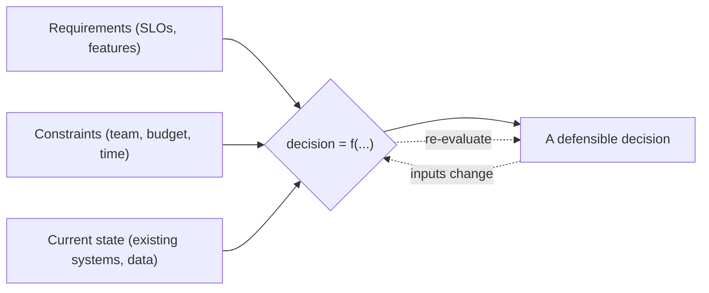
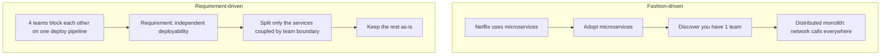
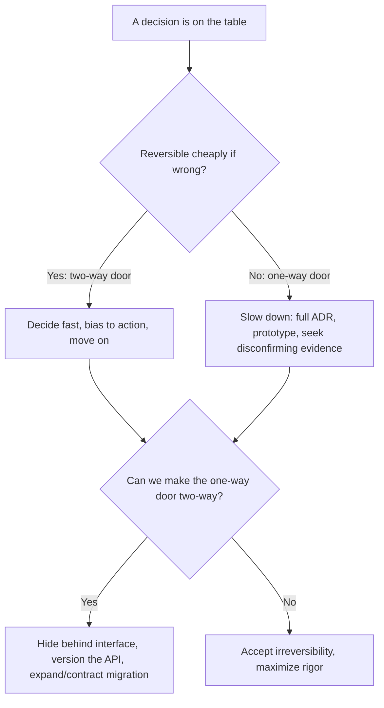
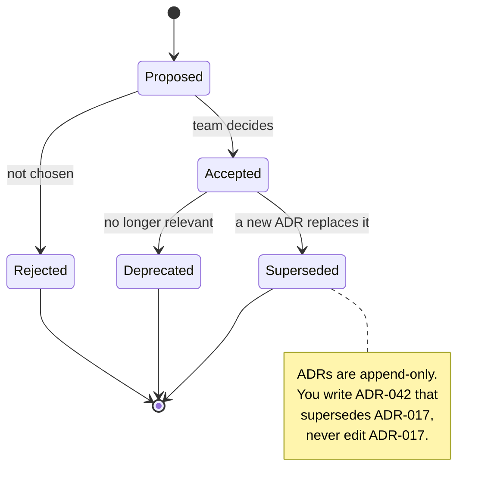
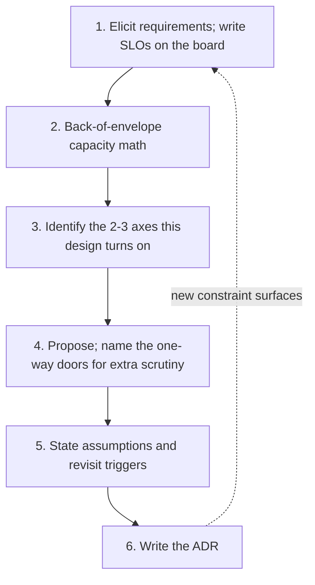

# Trade-off Reasoning & Architecture Decision Records

> Where this fits: this is the capstone meta-skill that sits on top of every technical topic in this curriculum — it is the difference between *knowing the building blocks* and *deciding which ones to use and being able to defend it*.
>
> **Principal-level takeaway:** "It depends" is correct, but it is the *start* of the answer. Your job is to make the dependency explicit — name the forces, attach numbers, choose, and write down *why* — so that the decision is legible, reversible-where-possible, and survives your absence from the room.

---

## The Mental Model — first principles: why does this thing exist, what problem does it solve?

Here is the uncomfortable truth that defines senior engineering: **there are almost no right answers, only right answers *for a given set of constraints*.** Kafka is not "better" than SQS. Strong consistency is not "better" than eventual consistency. A monolith is not "worse" than microservices. Each is a point in a trade-off space, and which point you want depends entirely on forces you have not yet made explicit.

A junior engineer experiences this as paralysis or as fashion. Paralysis: "I can't decide because both have pros and cons." Fashion: "Netflix uses microservices, so we should too." Both are failures of the same skill — the inability to convert a vague situation into an explicit, ranked set of forces and then reason from them.

Why does the skill of *trade-off reasoning* exist as a distinct thing, separate from technical knowledge? Because **the technical knowledge is necessary but radically insufficient.** You can know exactly how Raft works (see [consensus](../02-distributed-systems/13-consensus.md)) and still make a terrible decision to put a Raft-based coordinator in the hot path of a system that needed 1ms p99 and could tolerate stale reads. The knowledge tells you *what each option costs*; the judgment tells you *whether you can afford it here*.

And why do **Architecture Decision Records (ADRs)** exist? Because a decision that lives only in your head is worthless to the organization. Six months from now, someone — possibly you — will look at the Kafka cluster and ask "why on earth did we do this?" If the answer is lost, they will either cargo-cult it forward (preserving a constraint that no longer exists) or rip it out (destroying a constraint that still does). The ADR is the unit of *institutional memory for decisions*. It is leverage: you write it once, and it answers the same question for dozens of future engineers without your presence.

The mental model, then, is two-part:

1. **Decisions are functions of constraints, not of preferences or fashion.** `decision = f(requirements, constraints, current-state)`. Change the inputs and the output should change.
2. **A decision is not done until it is written down with its reasoning intact** — because the *reasoning* is the part that decays fastest and matters most later.

The first half of that model — the decision as a *function* of its inputs — is the single most important picture to carry into any design review. Change the inputs and the output should change; if it doesn't, you're operating on fashion or habit rather than reasoning.



---

## Core Concepts — the deep technical content

### "It depends" — making the dependency explicit

When a principal says "it depends," the next three sentences are the actual skill:

> "It depends on whether reads or writes dominate, on whether we can tolerate a few seconds of staleness, and on whether the team has anyone who's operated Kafka before. If reads dominate at, say, 50:1 and a 5-second staleness window is fine, then a read replica plus a cache is the boring correct answer and we don't touch Kafka at all."

Notice the structure: **name the dependency → state the threshold → resolve it for the likely case.** A vague "it depends" is an abdication. A *resolved* "it depends" is engineering. The discipline is to never let "it depends" stand alone — always follow it with "...on X, Y, Z, and here's how each resolves."

### The universal trade-off axes

Almost every system-design decision projects onto a small number of recurring axes. You should be able to name them on demand, because naming them is how you turn a fuzzy debate into a structured one.

- **Consistency vs. availability vs. latency.** The famous CAP triangle is incomplete; the honest version is PACELC: *if Partitioned, choose Availability or Consistency; Else (normal operation), choose Latency or Consistency.* The "else" clause is the one you actually pay every day — strong consistency costs latency even when nothing is broken, because a write must reach a quorum before it's acknowledged. Covered in depth in [consistency, CAP & PACELC](../02-distributed-systems/12-consistency-and-cap.md).
- **Read-optimized vs. write-optimized.** B-trees give cheap reads and more expensive writes (in-place updates, write amplification on page splits); LSM-trees give cheap writes and more expensive/variable reads (compaction, read amplification across SSTables). You cannot optimize both for free — see [storage engines](../00-foundations/03-storage-engines.md). The same tension reappears at the architecture level: precompute-on-write (fan-out, materialized timelines) vs. compute-on-read (query-time aggregation), the core decision in the [news feed case study](../04-design-case-studies/23-news-feed-and-timeline.md).
- **Cost vs. performance.** More replicas, more cache, bigger instances, multi-region — all buy performance and availability with dollars. The principal question is never "is it faster?" but "is the marginal latency/availability worth the marginal dollar *at our scale*?"
- **Simplicity vs. flexibility.** A generic, configurable, plugin-based system can do many things; a purpose-built one does a single thing with far less to understand and break. Flexibility you don't use is pure cost. "We might need it later" is the most expensive sentence in software.
- **Time-to-market vs. scalability.** Shipping a monolith on a single Postgres in two weeks may be worth far more than a "correct" sharded architecture in four months — *if the business risk is whether anyone wants the product at all.*
- **Build vs. buy (vs. adopt OSS).** Building gives control and zero per-seat cost but consumes your scarcest resource — senior engineering attention — forever. Buying (or using a managed service) trades money and lock-in for that attention back.

The skill is not memorizing the list. It's recognizing, in a live discussion, *which two or three axes a given decision actually turns on* and saying so explicitly.

### Driving decisions from requirements, not fashion

The most common failure mode in real design reviews is **resume-driven development** / fashion: choosing a technology because it's popular, because a FAANG blog post praised it, or because it's interesting to build. The antidote is to force every architectural choice back to a requirement or constraint.



A useful forcing function: for any proposed component, complete the sentence *"We need X because requirement R, and without X, R fails because ___."* If you can't fill the blank with a concrete failure, X is probably fashion.

### Quantify: capacity numbers and SLOs turn debates into arithmetic

The single fastest way to collapse a religious argument is a number. Most "consistency vs. availability" debates evaporate once someone computes the actual read:write ratio and the actual tolerable staleness. This is why [back-of-the-envelope estimation](../00-foundations/04-capacity-estimation.md) is foundational: it converts opinions into arithmetic.

Two kinds of numbers do most of the work:

- **Capacity numbers** — requests/sec, bytes/sec, rows, growth rate. "200 writes/sec" vs. "200k writes/sec" are *different problems with different correct answers*, and you cannot choose without knowing which you have.
- **SLOs (Service Level Objectives)** — the explicit target: "p99 read latency < 100ms, 99.95% monthly availability, < 5s replication staleness." SLOs are the contract that makes a trade-off decidable. Once you've written "99.9% availability is our target," you've also implicitly decided how much you're willing to spend and how much consistency you'll trade. See [observability & SLOs](../03-architecture-and-apis/19-observability.md).

> Worked micro-example: "Should we cache?" → Reads 50k/s, writes 1k/s (50:1 read-heavy). DB does 5k reads/s comfortably; 50k would need 10x the fleet (~$X/mo) or a cache. Tolerable staleness is 30s (it's a product catalog, not a bank balance). **Therefore** a TTL cache is the right call, and the consistency objection is moot because the SLO already permits 30s staleness. The numbers *made* the decision.

### One-way doors vs. two-way doors: matching rigor to reversibility

This is one of the most leverage-rich ideas in all of engineering judgment (popularized by Amazon's Jeff Bezos in shareholder letters). Classify the decision before you decide:

- **Two-way door (reversible):** you can walk back through it cheaply if you're wrong. Choice of an internal library, a cache eviction policy, an in-process module boundary, a feature flag. **Match the rigor:** decide *fast*, with a default-biased-toward-action, and move on. Agonizing over a reversible decision is wasted senior time.
- **One-way door (irreversible / very expensive to reverse):** the public API contract you'll have a thousand clients depending on, the database engine your whole data model assumes, the partition key you choose (re-sharding live data is brutal — see [partitioning](../01-building-blocks/10-partitioning-sharding.md)), a wire format, anything that touches *persisted data* or *external contracts*. **Match the rigor:** slow down, write the full ADR, prototype, get more eyes, deliberately seek disconfirming evidence.

The principal mistake is mismatching: applying one-way-door ceremony to two-way-door choices (analysis paralysis, six-week debates about a logging library) or — far more dangerous — applying two-way-door casualness to a one-way-door choice (picking a partition key in an afternoon because "we'll fix it later," when there is no cheap "later").

A subtle but vital move: **convert one-way doors into two-way doors** where you can. Hide the database behind a repository interface so you can swap it. Version your API (`/v1/`, `/v2/`) so a contract change is additive, not breaking. Use the expand/contract migration pattern so schema changes are reversible. This is the heart of [evolutionary architecture](../05-principal-skills/30-evolutionary-architecture.md) — designing so that more of your decisions become reversible.

The whole discipline collapses to a single up-front classification — *which door is this?* — and then a deliberate attempt to widen the door before walking through it:



### Architecture Decision Records: the unit of decision memory

An ADR is a short, immutable, append-only document capturing **one** architecturally significant decision at the moment it's made. The format (this repo ships an `engineering:architecture` skill that scaffolds exactly this — invoke it with `/architecture`) has four load-bearing sections:

```markdown
# ADR-017: Use a transactional outbox instead of Kafka for order events

**Status:** Accepted        # Proposed | Accepted | Deprecated | Superseded
**Date:** 2026-06-08
**Deciders:** Payments team, Staff eng (J. Rivera)

## Context
We need to publish "order placed" events to 2 downstream consumers.
Throughput is ~200 writes/sec, projected ~1k/s in 18 months. Billing
consumer requires no lost/duplicated charges. No one on the team has
run Kafka in production. SLO: < 60s end-to-end delivery, 0 lost events.

## Decision
Write events to an `outbox` table in the same Postgres transaction as
the order, and relay them with a poller + idempotency keys.

## Options Considered
- A) Kafka — replay, decoupling; but ops burden + at-least-once we'd
     have to dedupe anyway; overkill at 200/s. (one-way-ish: hard to remove)
- B) SQS — managed, simple; but separate transaction = dual-write risk.
- C) Transactional outbox — atomic with the write, no new infra. (chosen)

## Consequences
+ Easier: exactly-once-ish semantics ride on Postgres' transaction.
+ Easier: zero new operational surface area.
- Harder: poller adds latency (~1-2s); we own relay reliability.
- Revisit when: throughput approaches ~10k/s OR consumers need replay,
  at which point Kafka's costs become justified. This is the trigger.
```

Why writing them is *leverage*, not bureaucracy:

1. **It forces the reasoning to be complete.** You cannot write the "Options Considered" section honestly without actually considering options. The act of writing exposes the assumption you were about to smuggle in.
2. **It encodes the *trigger* for revisiting.** The best ADRs say "we'll revisit this when X" (e.g., "when throughput hits 10k/s"). This turns a static decision into a living one and pre-empts the future "why did we do this?" with "and here's exactly when to change it."
3. **It scales your judgment past your attendance.** The decision answers itself for every future reader.
4. **It makes status changes honest.** ADRs are append-only; you don't edit ADR-017, you write ADR-042 that *supersedes* it. The history of *how thinking changed* is preserved — invaluable for new engineers learning the system's evolution.

Because ADRs are append-only, the *status* of each one moves through a small, explicit lifecycle — and that lifecycle is what preserves the history of how the team's thinking changed rather than overwriting it:



ADRs are deliberately *small and many* (lightweight markdown in the repo, next to the code, e.g. `docs/adr/0017-*.md`), not one giant "architecture document" that's stale the day it's written. Originated by Michael Nygard (2011); now standard at Spotify, GitHub, AWS, and many others.

### Enforcing the decision: architecture fitness functions

An ADR records a decision, but prose alone does not stop the next engineer from violating it. The complement to the ADR is an **architecture fitness function** — an automated test that asserts an architectural rule and fails the build when the rule is broken. The classic example is a *dependency-rule* assertion: "the `domain` layer must never import the `infrastructure` layer" (so the database choice stays a two-way door, hidden behind the domain's interfaces). The ADR explains *why* the rule exists; the fitness function makes it *cheap to keep true* over years of churn.

Here is a minimal, self-contained version of that test in both languages. It scans source files for forbidden import edges and fails if any are found.

**Dependency-rule fitness function (domain must not import infrastructure)**

```go
package fitness

import (
	"os"
	"path/filepath"
	"strings"
	"testing"
)

// TestDomainDoesNotImportInfrastructure enforces the architectural rule
// recorded in ADR-017: the domain layer must remain free of infrastructure
// dependencies so the persistence choice stays a two-way door.
func TestDomainDoesNotImportInfrastructure(t *testing.T) {
	const (
		domainDir   = "../domain"
		forbidden   = "myapp/infrastructure"
	)

	var violations []string
	err := filepath.WalkDir(domainDir, func(path string, d os.DirEntry, err error) error {
		if err != nil {
			return err
		}
		if d.IsDir() || !strings.HasSuffix(path, ".go") {
			return nil
		}
		src, err := os.ReadFile(path)
		if err != nil {
			return err
		}
		if strings.Contains(string(src), forbidden) {
			violations = append(violations, path)
		}
		return nil
	})
	if err != nil {
		t.Fatalf("walking domain tree: %v", err)
	}

	if len(violations) > 0 {
		t.Fatalf("domain must not import infrastructure (ADR-017); offending files: %v", violations)
	}
}
```

```java
package fitness;

import org.junit.jupiter.api.Test;

import java.io.IOException;
import java.nio.file.Files;
import java.nio.file.Path;
import java.util.List;
import java.util.stream.Stream;

import static org.junit.jupiter.api.Assertions.fail;

class DependencyRuleTest {

    private static final Path DOMAIN_DIR = Path.of("src/main/java/myapp/domain");
    private static final String FORBIDDEN = "myapp.infrastructure";

    // Enforces the architectural rule recorded in ADR-017: the domain layer
    // must remain free of infrastructure dependencies so the persistence
    // choice stays a two-way door.
    @Test
    void domainDoesNotImportInfrastructure() throws IOException {
        try (Stream<Path> paths = Files.walk(DOMAIN_DIR)) {
            List<Path> violations = paths
                    .filter(p -> p.toString().endsWith(".java"))
                    .filter(this::importsForbidden)
                    .toList();

            if (!violations.isEmpty()) {
                fail("domain must not import infrastructure (ADR-017); offending files: " + violations);
            }
        }
    }

    private boolean importsForbidden(Path file) {
        try {
            return Files.readAllLines(file).stream()
                    .anyMatch(line -> line.startsWith("import " + FORBIDDEN));
        } catch (IOException e) {
            throw new RuntimeException("reading " + file, e);
        }
    }
}
```

In a real codebase you would reach for purpose-built tooling — `ArchUnit` or `jQAssistant` in Java, `go-arch-lint` or a `depguard` linter rule in Go — but the hand-rolled version above shows the whole idea in one screen: a decision worth recording in an ADR is often worth *guarding* with a test, so the one-way door you deliberately kept narrow does not silently widen.

### Naming your assumptions

Every decision rests on assumptions, and the dangerous ones are the *unstated* ones. "Reads dominate" is an assumption. "Staleness is tolerable" is an assumption. "Traffic grows linearly" is an assumption. The principal habit is to **say the assumption out loud and label it**: "I'm assuming a 50:1 read ratio — if that's wrong, this whole plan inverts." Naming it does two things: it invites correction from someone who knows better, and it tells the future reader exactly which brick to check if the building later falls down.

### Disagree and commit; communicate the decision

Adapted from Amazon's leadership principles, *disagree and commit* is how teams move without requiring unanimity. You voice your dissent fully and on the record (ideally in the ADR's options section), the group decides, and then **you commit your full effort to the chosen path even though you'd have chosen differently.** The failure mode it prevents is the slow-walked sabotage of a decision you lost — and the equally toxic "I told you so" when it goes sideways. Communicating a decision well means stating *what* was decided, *why* (the forces), *what was rejected and why*, and *when we'll revisit*. People accept decisions they disagree with far more readily when they can see their concern was genuinely weighed.

### Premature optimization vs. premature scaling

Two symmetric sins:

- **Premature optimization** (Knuth's "root of all evil"): micro-tuning code or shaving allocations before you have a profiler pointing at a real bottleneck. Costs: complexity, time, often *worse* readability for no measured gain.
- **Premature scaling**: building for 100M users while you have 100 — sharding a database that fits on one node, deploying Kubernetes for a service that gets 10 req/s, splitting a monolith no team boundary requires. This is the more expensive sin in practice, because the complexity is *architectural* and *persistent*, not local. You pay the operational tax every single day for a scale you may never reach.

The principal stance: **build for ~10x your current scale, not 1000x.** 10x is usually one or two well-chosen, cheap-to-add levers (a read replica, a cache, a queue). Beyond 10x, your assumptions about access patterns will likely be wrong anyway, so building for it now means optimizing against a fiction. Leave the 100x problems behind a documented trigger in an ADR, and solve them when the number forces you to.

---

## Trade-offs at a Glance

| Decision axis | Option A | Option B | A wins when… | B wins when… |
|---|---|---|---|---|
| Consistency model | Strong (quorum/linearizable) | Eventual | Money, inventory, uniqueness; correctness > latency | Reads dominate, staleness tolerable, latency/availability critical |
| Storage engine | B-tree (read-opt) | LSM-tree (write-opt) | Read-heavy, range scans, lower read latency | Write-heavy ingest, high volume, can absorb compaction |
| Architecture | Monolith | Microservices | One/two teams, early, speed matters | Many teams blocked by shared deploy; independent scaling needed |
| Build vs. buy | Build | Buy / managed | Core differentiator, control critical, scale makes $ huge | Commodity capability; senior attention is the bottleneck |
| Capacity target | Build for ~10x | Build for ~100x+ | Almost always | Genuinely proven hyper-growth + irreversible data layout |
| Decision rigor | Fast (two-way door) | Slow + ADR (one-way door) | Reversible, cheap to undo | Touches persisted data or external contracts |
| Optimization timing | Optimize now | Defer behind a trigger | Profiler shows a real, measured bottleneck | No evidence yet; would add complexity for hypothetical load |

The meta-point of this table: every row is a *conditional*. Anyone quoting a row's left or right column as an unconditional "best practice" has dropped the condition — which is the whole answer.

---

## How Real Systems Do It

- **Amazon DynamoDB** is the canonical PACELC artifact: it defaults to eventually consistent reads (cheaper, lower latency, ~half the read-capacity cost) and makes you *opt in* to strongly consistent reads. The system *encodes the trade-off as a per-request flag* — Amazon decided not to decide for you, and priced consistency literally (a strongly consistent read costs 2x the read capacity units). See the [Dynamo / KV store case study](../04-design-case-studies/26-object-store-and-kv-store.md).
- **Apache Kafka vs. Postgres outbox**: the README of this very curriculum opens with this exact trade-off. Kafka buys replay + decoupling + huge throughput at the cost of operational complexity and at-least-once semantics you must dedupe. At 200 writes/sec with exactly-once billing needs, a transactional outbox on Postgres is the defensible call — and that's a *requirement-driven* decision, not an anti-Kafka stance. (See [messaging & streaming](../01-building-blocks/11-messaging-and-streaming.md).)
- **Cassandra** chose AP + write-optimized LSM storage explicitly for write-heavy, always-available workloads (time-series, event logging), and made consistency *tunable per query* (`ONE`, `QUORUM`, `ALL`) — the database literally exposes the consistency/latency dial to the caller. (See [replication](../01-building-blocks/09-replication.md).)
- **Stripe** publishes engineering writeups treating idempotency keys and ledger correctness as one-way-door decisions — irreversibility around money forces maximum rigor, exactly as the framework predicts (see [payments & ledgers](../04-design-case-studies/27-payments-and-ledgers.md)).
- **The ADR practice itself**: Nygard's 2011 essay seeded the format; AWS, Spotify, GitHub, and ThoughtWorks (who put "lightweight ADRs" on their Technology Radar in the "Adopt" ring) now treat ADRs in-repo as standard. The artifact is boring markdown by design — leverage comes from consistency, not tooling.

---

## Failure Modes & Common Misconceptions

**What breaks in production:**

- **The unwritten one-way-door decision.** A partition key chosen in an afternoon, a wire format never versioned, a tenant-id baked into URLs. The system runs fine for two years, then a re-shard or contract change becomes a multi-quarter migration because the reversibility was never designed in.
- **Cargo-culted architecture.** A 1-team startup ships microservices because the founders read a Netflix blog; they get all the distributed-systems failure modes (partial failures, network calls, distributed transactions) with none of the org-scale benefit. This is premature scaling and fashion-driven design fused into one.
- **The stale, monolithic architecture doc.** A 60-page Confluence page nobody updates, so the *reasoning* rots while the diagram stays — the worst of both worlds. ADRs avoid this precisely by being small, immutable, and dated.

**Myths to call out explicitly:**

- *"There's a best practice for this."* → Mostly false. There are best practices *for given constraints*. Anyone offering an unconditional one has hidden the constraint. Your job is to surface it.
- *"More consistency is always safer."* → False. Strong consistency costs latency and availability *on every normal request* (the "else" in PACELC), and many domains (feeds, view counts, recommendations) are *correct* with eventual consistency. Over-consisting is a real, common waste.
- *"Microservices scale better, so they're better."* → Conflates two scalings. They scale *organizations* (teams that deploy independently) far more than they scale *traffic*. If you have one team, you're buying org-scaling you don't need and paying in latency and operational surface.
- *"Writing ADRs slows us down."* → Backwards. A good ADR is ~30 minutes and saves *days* of future archaeology and re-litigation. The slowness is in the *deciding*; writing it down is cheap and is where the reasoning gets stress-tested.
- *"Premature optimization is the root of all evil, so don't optimize."* → Misquotes Knuth, who said we should forget about small efficiencies "*about 97% of the time*," and finished with "*yet we should not pass up our opportunities in that critical 3%.*" The skill is knowing which 3% — which requires measurement, not abstinence.
- *"We'll just fix it later."* → Sometimes true (two-way door), sometimes catastrophic (one-way door). The myth is treating all "later"s as equally cheap. Classify the door first.

---

## In a Design Discussion

This topic *is* the design discussion. Here's the contrast that matters:

**Junior take:** "Let's use Kafka and a microservices architecture with eventual consistency — that's how scalable systems are built."
(Notice: a list of technologies, no constraints, no numbers, no reversibility analysis. It's a *guess dressed as a plan*, and it's brittle — the first "why?" deflates it.)

**Principal take:** "What's our write rate and read:write ratio, and what staleness can the product tolerate? — Okay, 200 writes/sec, 50:1 reads, 30s staleness fine, one team, billing needs no double-charges. Then: a Postgres primary with a read replica and a cache handles the reads inside SLO; for events, a transactional outbox gives us atomicity without a new system to operate. I'm explicitly *not* reaching for Kafka — it'd buy replay and throughput we don't need yet and cost us ops burden we can't staff. I'll write an ADR with the trigger 'revisit when writes approach 10k/s or a consumer needs replay.' The DB engine choice is a one-way door, so I want a second opinion on that one specifically; the cache policy is a two-way door, so I'll just pick LRU and move on."

The principal answer is *longer* but every sentence is load-bearing: it pulls numbers, names the axes, classifies reversibility, makes the assumption explicit, states what it's rejecting and why, and ends with a written trigger. In a real whiteboard, **the move that signals seniority is asking the constraint-eliciting question before drawing any box.** Drawing boxes first is the tell of someone optimizing to *look* productive rather than to *decide* correctly.

A practical whiteboard loop: (1) elicit functional + non-functional requirements and write the SLOs on the board; (2) do back-of-envelope capacity math; (3) identify the 2-3 axes this design actually turns on; (4) propose, naming the one-way doors for extra scrutiny; (5) state assumptions and triggers. The [interview framework](../04-design-case-studies/21-interview-framework.md) operationalizes this loop end to end.



---

## Self-Check

<details>
<summary>1. A teammate says "it depends" and stops. What's missing, and what would you add?</summary>
The dependency itself. Add: *on which forces* it depends (e.g., read:write ratio, tolerable staleness, team experience), the *threshold* at which each resolves, and the resolution *for the likely case*. "It depends" alone is an abdication; resolved, it's the answer.
</details>

<details>
<summary>2. How does the rigor you apply differ between a two-way-door and a one-way-door decision, and give one example of each?</summary>
Two-way door (reversible, cheap to undo) → decide fast, bias to action; e.g., cache eviction policy, an internal library. One-way door (irreversible/expensive) → slow down, write the ADR, seek disconfirming evidence, more eyes; e.g., a partition key, a public API contract, the database engine. The error is mismatching rigor to door type — especially treating a one-way door casually.
</details>

<details>
<summary>3. Why is "Netflix uses microservices" a bad reason to adopt them?</summary>
It's fashion-driven, not requirement-driven. Microservices primarily scale *organizations* (independent deployability across many teams), not traffic. With one or two teams you inherit distributed-systems failure modes and operational surface area without the org-scaling benefit. Drive the decision from your actual constraint (e.g., "4 teams blocked on one deploy pipeline"), not from someone else's.
</details>

<details>
<summary>4. PACELC adds a clause CAP lacks. What is it and why does it matter day to day?</summary>
The "Else": *even when there is no partition*, you trade Latency vs. Consistency. CAP only describes the rare partition case; PACELC names the cost you pay on *every normal request* — strong consistency requires reaching a quorum before acknowledging, which adds latency continuously, not just during failures.
</details>

<details>
<summary>5. What are the four core sections of an ADR, and which one most people under-invest in?</summary>
Context (forces/constraints), Decision, Options Considered (alternatives + why rejected), Consequences (what gets easier/harder + when to revisit). Most under-invest in **Options Considered** and in the *revisit trigger* inside Consequences — yet those are exactly what prevent future cargo-culting and "why did we do this?" archaeology.
</details>

<details>
<summary>6. Distinguish premature optimization from premature scaling. Which is usually more costly and why?</summary>
Premature optimization = micro-tuning code before a profiler shows a real bottleneck (local, removable cost). Premature scaling = building architecture for 100x the users you have (sharding, microservices, k8s too early) — usually *more* costly because the complexity is architectural and persistent: you pay the operational tax daily for a scale you may never reach. Rule of thumb: build for ~10x, defer the rest behind a documented trigger.
</details>

<details>
<summary>7. You disagree with a decision the team made. What does "disagree and commit" require of you?</summary>
Voice the dissent fully and on the record *before* the decision (ideally captured in the ADR's options). Once decided, commit your full effort to the chosen path — no slow-walking, no "I told you so" if it goes wrong. It lets teams move without unanimity while keeping the dissent documented so it can be revisited if the assumptions break.
</details>

<details>
<summary>8. Why does quantifying with capacity numbers and SLOs end most architecture arguments?</summary>
Because it converts opinion into arithmetic. "200 writes/sec, 50:1 reads, 30s tolerable staleness" *determines* whether you need Kafka or a cache — the consistency debate dissolves once the SLO already permits the staleness. Numbers make the trade-off decidable instead of religious.
</details>

---

## Go Deeper

- **DDIA, Chapter 1 — *Reliability, Scalability, and Maintainability***: Kleppmann's framing of the non-functional forces is the bedrock of trade-off reasoning; reread it through the lens of "these are the axes."
- **DDIA, Chapter 9 — *Consistency and Consensus***: the precise mechanics behind the consistency/latency/availability axis. Pair with this repo's [consistency & CAP](../02-distributed-systems/12-consistency-and-cap.md).
- **Michael Nygard, "Documenting Architecture Decisions" (2011)** — the original ADR essay; short, foundational, still the canonical format.
- **Daniel Abadi, "Consistency Tradeoffs in Modern Distributed Database System Design" (2012)** — the paper that introduced PACELC; the "Else" clause you'll cite for the rest of your career.
- **Jeff Bezos, Amazon shareholder letters (1997, 2015–2016)** — the one-way/two-way door framing and "disagree and commit" in their original form.
- **Donald Knuth, "Structured Programming with go to Statements" (1974)** — read the *actual* "premature optimization" quote in context (the "critical 3%" caveat that everyone drops).
- **Architecture Decision Records: `adr.github.io`** and the `adr-tools` CLI — practical tooling and a library of templates for keeping ADRs in-repo.
- **This repo's `engineering:architecture` skill** (`/architecture`) — scaffolds an ADR (Context / Decision / Options Considered / Trade-off Analysis / Consequences) and pairs with the `engineering:system-design` skill for requirements gathering. Use it the next time you face a real decision — the act of filling in "Options Considered" honestly is the whole exercise.
- **Next in this part:** [Evolutionary Architecture](../05-principal-skills/30-evolutionary-architecture.md) — how to design so that *more* of your one-way doors become two-way doors — and the [Principal's Reading List](../05-principal-skills/31-reading-list-and-papers.md). Back to the [curriculum index](../README.md) and the [roadmap](../ROADMAP.md).
