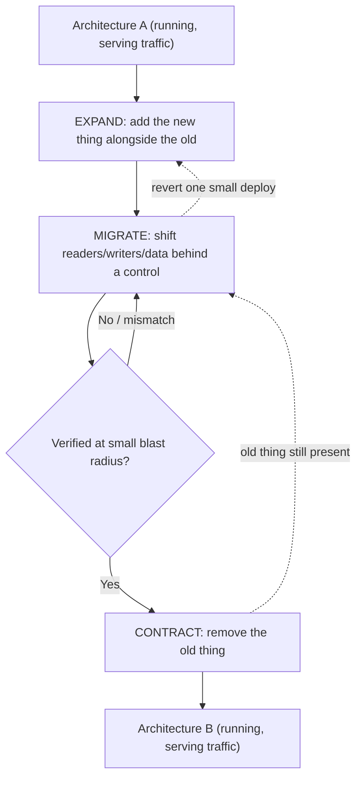
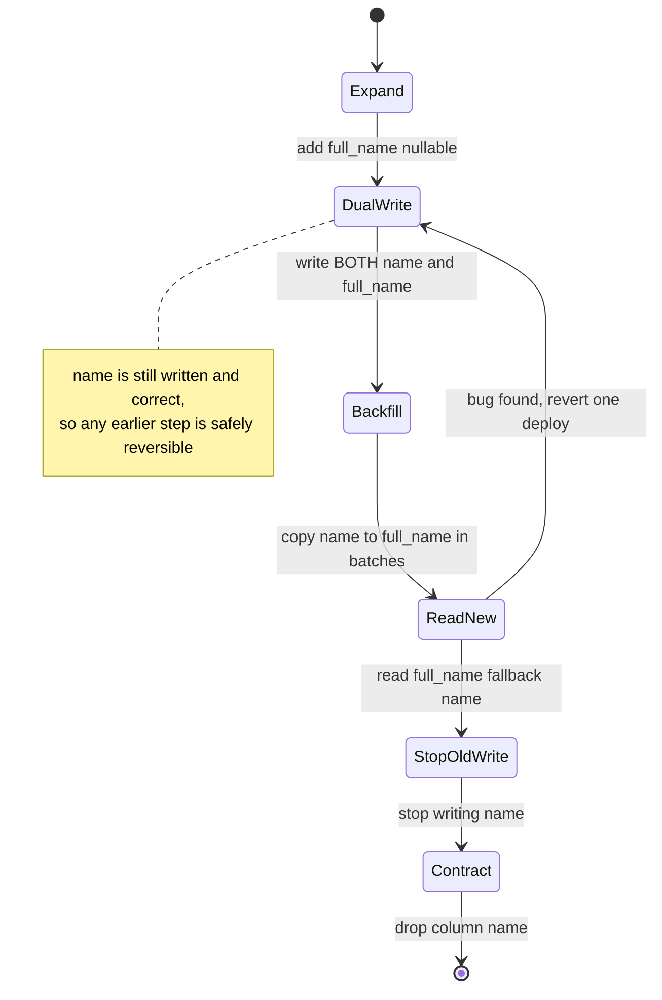
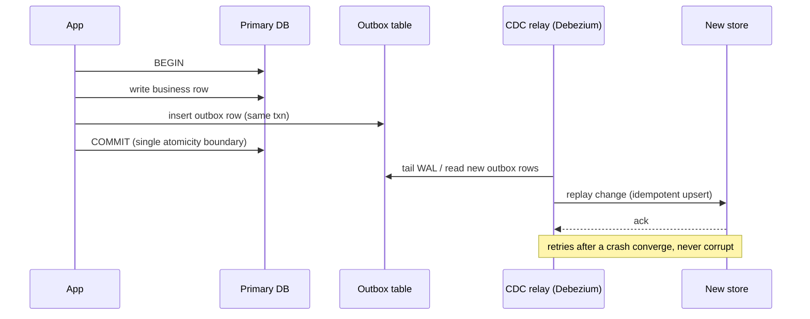
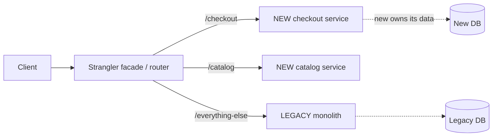

# Evolutionary Architecture: Migrations, Legacy & Designing for Change

> Where this fits: this is the capstone of the principal-skills track — the discipline of changing a system that is *already running, already serving traffic, and already too expensive to rewrite*. It sits on top of everything in [Architectural Styles](../03-architecture-and-apis/18-architectural-styles.md), [API Design](../03-architecture-and-apis/17-api-design.md), and [Trade-off Reasoning & ADRs](29-tradeoffs-and-adrs.md).
>
> **Principal-level takeaway:** You almost never get to choose the destination *and* the path. The path is the hard part. The reusable skill is decomposing any large change into a sequence of *individually safe, individually reversible* steps, each of which keeps the old and new worlds coexisting — so that at no single moment is the system at risk, and you can stop or roll back from any step.

## The Mental Model — first principles: why does this thing exist, what problem does it solve?

Junior engineers picture architecture as drawing boxes on a whiteboard for a system that does not exist yet. That is the rarest kind of architecture work. The overwhelming majority of what a principal engineer actually does is **change a system that is already in production**, under load, that someone depends on right now, whose original authors have left, and whose behavior is only partly documented (and partly *wrong* in the docs). Greenfield is a luxury; brownfield is the job.

Why is this so hard? Because of three constraints that greenfield does not have:

1. **You cannot stop the world.** The system is serving requests. A bank cannot say "no transactions for 6 hours while we migrate the ledger." Downtime has a dollar cost, an SLA cost, and a trust cost. So every change must happen *while traffic flows through it*.
2. **You cannot see the whole system.** Real systems have undocumented coupling. That nightly cron job nobody remembers reads the column you want to drop. The mobile app from three years ago still calls the v1 endpoint. You will discover dependencies *by breaking them* unless you design to surface them first.
3. **You cannot trust a big-bang switch.** A change with one giant cutover moment has exactly one chance to be correct, and if it is wrong you find out at the worst possible time, at full scale, with no easy way back. The probability that a large change is *fully* correct on the first try is low, and the blast radius is total.

So the entire field exists to answer one question: **how do I get from architecture A to architecture B without ever putting the running system into a state I cannot recover from?** The answer, almost universally, is the same shape: introduce the new thing *alongside* the old thing, route a controllable trickle of reality through it, verify, widen the trickle, and only then remove the old thing. Coexistence first, cutover last, removal last of all.

This is *evolutionary* architecture: the system is never "done." It is continuously, safely deformable. The measure of a good architecture is not how elegant it is today, but **how cheaply it can absorb the change you cannot yet predict.**

The shape of every safe migration is the same loop — add alongside, route a controllable trickle, verify, widen, then remove — and crucially you can fall back out of any step because the old world is still intact:



## Core Concepts

### Designing for evolvability: coupling, contracts, and reversibility

Before you can migrate cheaply, the system has to be *built* to change cheaply. The three properties that determine this:

**Loose coupling.** Coupling is how much a change in module X forces a change in module Y. The goal is not zero coupling (that is impossible — components must talk) but *managed* coupling through narrow, explicit interfaces. The killer is **hidden coupling**: two services sharing a database table, a consumer parsing a log line you considered internal, code that reaches around the API and into the data store. A schema-shared database is the single most common reason a "microservice" migration fails — see [Architectural Styles](../03-architecture-and-apis/18-architectural-styles.md). The principal rule: *if you cannot enumerate who depends on a thing, you cannot safely change it.* Make dependencies explicit and you make them changeable.

**Clear contracts with explicit versioning.** A contract is the promise an interface makes: this endpoint accepts this shape, returns that shape, with these guarantees. Evolvability lives or dies on whether you can change a contract *without* coordinating a synchronized deploy of everyone who uses it. The enabling technique is **backward- and forward-compatible schema evolution**: add optional fields, never repurpose a field's meaning, never make an optional field required in place. Protobuf and Avro encode this discipline into the wire format (field tags, reader/writer schema resolution); see [API Design](../03-architecture-and-apis/17-api-design.md). The deep idea — straight out of *DDIA* Chapter 4 — is that in a rolling deploy, old and new code run *simultaneously*, so every data format must be readable by both.

**Fitness functions.** A term from *Building Evolutionary Architecture* (Ford, Parsons, Kua). A fitness function is an *automated, objective* test of an architectural property you want to preserve as the system evolves — the architectural analog of a unit test. Examples: an automated check that no service imports another service's database package; a CI test asserting p99 latency stays under 200ms; a dependency-graph linter that fails the build if a forbidden module-to-module edge appears; a contract test that fails if a producer emits a message the consumer schema rejects. Without fitness functions, architectural decay is invisible until it is catastrophic — the boundaries you drew erode one "just this once" shortcut at a time.

### The master pattern: expand / contract (parallel change)

Almost every zero-downtime migration is an instance of one pattern. Learn it once and you can derive the rest. It has three phases:

```
EXPAND    add the new thing alongside the old; both coexist.
          nothing breaks because nothing yet depends on the new thing.

MIGRATE   move readers/writers/data over incrementally, behind a
          control (flag, percentage, dual-write). verify at each step.

CONTRACT  once nothing uses the old thing, and you've proven it,
          remove the old thing.
```

The genius is that **each phase is independently deployable and independently reversible.** You never have a deploy where "rename the column" and "update all the code that reads the column" must land atomically. Concretely, renaming a column `name` → `full_name` without downtime:

```
1. EXPAND:   add column full_name (nullable). Deploy. (no behavior change)
2. WRITE:    app writes to BOTH name and full_name. Deploy.
3. BACKFILL: copy existing name -> full_name in batches.
4. READ:     app reads from full_name (falls back to name if null). Deploy.
5. STOP:     app stops writing name. Deploy.
6. CONTRACT: drop column name. Deploy.
```

As a state machine, the safety property is visible: from any state before `Contract`, the column `name` is still written and correct, so you can transition backward by reverting a single deploy.



Six small deploys instead of one risky one. If step 4 reveals a bug, you revert one deploy and you are safe — `name` is still being written and is still correct. **The cost is real**: more deploys, transient double-writes, a window where two representations of truth must agree. The benefit is that the system is *recoverable at every instant.* That trade — more steps and temporary duplication in exchange for continuous safety — is the recurring bargain of this entire chapter.

### Dual writes, backfill, and shadow reads

These are the workhorses of the MIGRATE phase.

**Dual writes** mean every mutation goes to both the old and new store. The trap that catches everyone: **dual writes are not atomic across two systems.** If you write to Postgres, then write to Elasticsearch, and the process crashes between them, the two diverge silently. There is no distributed transaction protecting you (and you do not want 2PC — see [Distributed Transactions, Sagas & Idempotency](../02-distributed-systems/15-distributed-transactions.md)). The robust alternatives:
- **Transactional outbox + CDC**: write the change *and* an outbox row in one local transaction, then a change-data-capture process (e.g. Debezium reading the WAL) replays it to the new system. The single local transaction is your atomicity boundary; the new store is eventually consistent with it. This is how you avoid the dual-write divergence trap.
- Make replays **idempotent** so retries after a crash converge rather than corrupt.

The single local transaction is the whole trick — the business row and the outbox row commit or fail together, and the relay turns that durable log into eventual consistency downstream:



**Backfill** copies the *existing* data (everything that predates dual-writing) into the new store. Done badly, a backfill is an outage: a single `UPDATE` over 500M rows takes a table lock, blows up replication lag, and saturates I/O. Done well, it is batched, throttled, and resumable:

```python
# Resumable, throttled backfill keyed by primary key.
last_id = checkpoint.load()          # resume from where we stopped
while True:
    rows = db.query(
        "SELECT id, name FROM users WHERE id > %s ORDER BY id LIMIT %s",
        (last_id, BATCH),             # keyset pagination, NOT OFFSET
    )
    if not rows: break
    new_store.bulk_upsert(rows)       # idempotent upsert
    last_id = rows[-1].id
    checkpoint.save(last_id)
    metrics.observe_replication_lag()
    sleep(adaptive_delay())           # back off if lag/CPU rises
```

Key disciplines: **keyset pagination** not `OFFSET` (which gets O(n²) and skips/dupes under concurrent writes); a persisted **checkpoint** so a crash resumes rather than restarts; **adaptive throttling** that watches replication lag and DB load and slows down automatically; and idempotent upserts so re-running a batch is harmless.

The same loop in production-grade Go and Java — note the `context` cancellation, the keyset cursor, and the lag-aware sleep that backs off automatically:

**Resumable, throttled, keyset-paginated backfill**

```go
package backfill

import (
	"context"
	"time"
)

type Row struct {
	ID   int64
	Name string
}

type Source interface {
	// PageAfter returns up to limit rows with ID strictly greater than afterID,
	// ordered by ID ascending (keyset pagination, not OFFSET).
	PageAfter(ctx context.Context, afterID int64, limit int) ([]Row, error)
	ReplicationLag(ctx context.Context) (time.Duration, error)
}

type Dest interface {
	BulkUpsert(ctx context.Context, rows []Row) error // idempotent
}

type Checkpoint interface {
	Load(ctx context.Context) (int64, error)
	Save(ctx context.Context, id int64) error
}

func Run(ctx context.Context, src Source, dst Dest, ckpt Checkpoint, batch int, maxLag time.Duration) error {
	lastID, err := ckpt.Load(ctx) // resume from where we stopped
	if err != nil {
		return err
	}
	for {
		if err := ctx.Err(); err != nil { // honor cancellation/kill switch
			return err
		}
		rows, err := src.PageAfter(ctx, lastID, batch)
		if err != nil {
			return err
		}
		if len(rows) == 0 {
			return nil // done
		}
		if err := dst.BulkUpsert(ctx, rows); err != nil { // idempotent retry-safe
			return err
		}
		lastID = rows[len(rows)-1].ID
		if err := ckpt.Save(ctx, lastID); err != nil {
			return err
		}
		if err := throttle(ctx, src, maxLag); err != nil {
			return err
		}
	}
}

// throttle backs off when replication lag rises above the target.
func throttle(ctx context.Context, src Source, maxLag time.Duration) error {
	lag, err := src.ReplicationLag(ctx)
	if err != nil {
		return err
	}
	delay := 50 * time.Millisecond
	if lag > maxLag {
		delay = lag // slow down proportionally to how far behind we are
	}
	select {
	case <-time.After(delay):
		return nil
	case <-ctx.Done():
		return ctx.Err()
	}
}
```

```java
import java.time.Duration;
import java.util.List;

final class Backfill {
    record Row(long id, String name) {}

    interface Source {
        // Up to limit rows with id strictly greater than afterId, ordered by id
        // ascending (keyset pagination, not OFFSET).
        List<Row> pageAfter(long afterId, int limit);
        Duration replicationLag();
    }

    interface Dest {
        void bulkUpsert(List<Row> rows); // idempotent
    }

    interface Checkpoint {
        long load();
        void save(long id);
    }

    void run(Source src, Dest dst, Checkpoint ckpt, int batch, Duration maxLag)
            throws InterruptedException {
        long lastId = ckpt.load(); // resume from where we stopped
        while (true) {
            if (Thread.currentThread().isInterrupted()) { // kill switch
                throw new InterruptedException("backfill cancelled");
            }
            List<Row> rows = src.pageAfter(lastId, batch);
            if (rows.isEmpty()) {
                return; // done
            }
            dst.bulkUpsert(rows); // idempotent retry-safe
            lastId = rows.get(rows.size() - 1).id();
            ckpt.save(lastId);
            throttle(src, maxLag);
        }
    }

    // Backs off when replication lag rises above the target.
    private void throttle(Source src, Duration maxLag) throws InterruptedException {
        Duration lag = src.replicationLag();
        Duration delay = lag.compareTo(maxLag) > 0
                ? lag                       // slow down proportionally
                : Duration.ofMillis(50);
        Thread.sleep(delay.toMillis());
    }
}
```

**Shadow reads (dark traffic)** are how you verify *before* cutting over. You send the same read to both old and new paths, return the old result to the user, and *compare* the two off the critical path, logging mismatches. This catches behavioral differences at production scale and with production data without risking a single user-facing response. GitHub's `scientist` library popularized this; Amazon and Google use the same shape for major rewrites. You run shadow reads until the mismatch rate is acceptably near zero — *that* is your evidence to flip the switch, not someone's confidence in code review.

### The Strangler Fig: incremental replacement

Named by Martin Fowler after the strangler fig vine that grows around a host tree until the tree is gone and the fig stands on its own. The pattern: put a **facade/router in front of the legacy system**, then move functionality piece by piece to new implementations behind that facade, routing each request to old or new. Over time the new system "strangles" the old one until nothing routes to legacy and you delete it.



This is the antidote to the "big rewrite," which has a famously dismal track record (Netscape's rewrite is the canonical cautionary tale: years of no shipping while the old product withered). The Strangler Fig ships value continuously, keeps the legacy system as a working fallback, and lets you stop at any point with a coherent system. The cost: you run two systems and a routing layer for a long time (often *years*), and you must resist the temptation to declare victory while 20% of traffic — usually the gnarliest 20% — still hits legacy.

### Feature flags and progressive delivery

A **feature flag** decouples *deploy* from *release*. Code ships to production dark, then is enabled at runtime without a redeploy. This is what makes most of the above safe, because it gives you a **fast rollback that is a config change, not a deploy or a `git revert`.** Progressive delivery strategies, contrasted:

- **Percentage / canary rollout**: enable for 1% → 5% → 25% → 100%, watching SLOs ([Observability](../03-architecture-and-apis/19-observability.md)) between steps. Catches problems at small blast radius. *Best for* most application changes.
- **Blue-green**: run two full environments; flip the load balancer from blue (old) to green (new) all at once; keep blue warm for instant rollback. *Best for* changes hard to run at partial percentages, but it is an all-or-nothing flip and doubles infra cost during the window.
- **Ring deployment**: roll out to concentric audiences — internal users → beta cohort → low-risk regions → everyone. *Best for* changes where *who* is exposed matters more than *what percentage*.

The non-negotiable companion to any of these is a **kill switch** and a **rollback runbook decided in advance** (see the `engineering:deploy-checklist` skill). The principal question is never "will this work?" — it is **"when this misbehaves, how fast and how cleanly can I turn it off, and will turning it off leave the system in a consistent state?"** A flag you can flip in 5 seconds is worth more than one you are 95% sure you will not need.

Putting the master pattern into code: the same data-access layer carries all three migration phases, gated by flags that you flip at runtime without a redeploy. Phase 1 *dual-writes* to old and new behind `WriteNew`; phase 2 flips `ReadNew` to read from the new store with a fallback to old; phase 3 (`DropOld`) stops touching the old store entirely. Every transition is a config change, and every transition is reversible because the old store stays correct until `DropOld`.

**Expand/contract behind a feature flag (dual-write, read-new, drop-old)**

```go
package userstore

import (
	"context"
	"errors"
	"fmt"
)

// MigrationFlags is fetched from a flag service at request time, so each
// phase transition is a config flip, not a deploy.
type MigrationFlags struct {
	WriteNew bool // dual-write phase: also write the new store
	ReadNew  bool // cutover phase: read from new, fall back to old
	DropOld  bool // contract phase: stop touching the old store
}

type Store interface {
	Get(ctx context.Context, id string) (string, error)
	Put(ctx context.Context, id, name string) error
}

type MigratingStore struct {
	old, new Store
	flags    func(context.Context) MigrationFlags
}

func New(old, new Store, flags func(context.Context) MigrationFlags) *MigratingStore {
	return &MigratingStore{old: old, new: new, flags: flags}
}

func (m *MigratingStore) Put(ctx context.Context, id, name string) error {
	f := m.flags(ctx)
	if !f.DropOld {
		if err := m.old.Put(ctx, id, name); err != nil {
			return fmt.Errorf("old put: %w", err)
		}
	}
	if f.WriteNew || f.DropOld {
		// New-store write failures must not corrupt the migration: log and
		// let the outbox/CDC reconciler converge, rather than failing the request.
		if err := m.new.Put(ctx, id, name); err != nil {
			return fmt.Errorf("new put: %w", err)
		}
	}
	return nil
}

func (m *MigratingStore) Get(ctx context.Context, id string) (string, error) {
	f := m.flags(ctx)
	if f.ReadNew || f.DropOld {
		name, err := m.new.Get(ctx, id)
		if err == nil {
			return name, nil
		}
		if f.DropOld || !errors.Is(err, ErrNotFound) {
			return "", fmt.Errorf("new get: %w", err)
		}
		// Fallback: row not yet backfilled into the new store.
	}
	return m.old.Get(ctx, id)
}

var ErrNotFound = errors.New("not found")
```

```java
import java.util.Optional;
import java.util.function.Supplier;

// MigrationFlags is fetched from a flag service at request time, so each
// phase transition is a config flip, not a deploy.
record MigrationFlags(boolean writeNew, boolean readNew, boolean dropOld) {}

interface Store {
    Optional<String> get(String id);
    void put(String id, String name);
}

final class MigratingStore implements Store {
    private final Store old;
    private final Store neu;
    private final Supplier<MigrationFlags> flags;

    MigratingStore(Store old, Store neu, Supplier<MigrationFlags> flags) {
        this.old = old;
        this.neu = neu;
        this.flags = flags;
    }

    @Override
    public void put(String id, String name) {
        MigrationFlags f = flags.get();
        if (!f.dropOld()) {
            old.put(id, name);
        }
        if (f.writeNew() || f.dropOld()) {
            // New-store write failures must not corrupt the migration: log and
            // let the outbox/CDC reconciler converge, rather than failing the request.
            neu.put(id, name);
        }
    }

    @Override
    public Optional<String> get(String id) {
        MigrationFlags f = flags.get();
        if (f.readNew() || f.dropOld()) {
            Optional<String> fromNew = neu.get(id);
            if (fromNew.isPresent()) {
                return fromNew;
            }
            if (f.dropOld()) {
                return fromNew; // empty: new store is now the source of truth
            }
            // Fallback: row not yet backfilled into the new store.
        }
        return old.get(id);
    }
}
```

### Online schema and large data changes

Relational DDL is the classic downtime trap because some operations take **table-level locks** that block all reads/writes for the duration. The lock behavior is engine-specific and you must know yours ([Relational DBs](../01-building-blocks/07-databases-relational.md)):
- Postgres (11+): `ADD COLUMN` with no default *or* a non-volatile (constant) default is instant — metadata-only, no rewrite. The traps: enforcing `NOT NULL` on an *existing* column requires a full validating table scan under an `ACCESS EXCLUSIVE` lock, and many type changes rewrite the whole table under that same lock. Always `CREATE INDEX CONCURRENTLY` (it avoids the exclusive lock at the cost of two scans). Set a short `lock_timeout` so a migration that *would* block fails fast instead of stalling the app behind it.
- MySQL/InnoDB: online DDL helps but has gaps; teams routinely use **gh-ost** (GitHub) or **pt-online-schema-change** (Percona), which build a shadow table, backfill it, sync via triggers/binlog, and atomically swap — exactly the expand/contract pattern applied to DDL.

The myth to kill: *"it's just an `ALTER TABLE`."* On a large table, that one statement can be a multi-hour outage. Treat every schema change as a migration with its own expand/contract plan.

### Decomposing a monolith and the Conway dimension

You decompose a monolith the Strangler way: identify a **seam** (a bounded context with clear data ownership), extract it behind an interface the monolith now calls, give it its own data store, and repeat. You do *not* start by splitting the database — shared tables are the coupling that makes "microservices" a distributed monolith with all the pain and none of the independence.

The part juniors miss entirely: **Conway's Law.** *"Organizations design systems that mirror their communication structure."* If three teams own one service, its internal boundaries will harden along those teams whether you like it or not. The **Inverse Conway Maneuver** is the principal move: change the *org structure* to the shape you want the *architecture* to have, then let the architecture follow. A service-boundary migration that ignores team boundaries will be silently reverted by the org. Architecture change *is* org change — Amazon's two-pizza teams and AWS's service-per-team structure were an organizational decision first.

### Managing technical debt and deprecation deliberately

**Technical debt** is the implied cost of rework from choosing an easy-now solution over a better-but-slower one. The principal framing: debt is a *tool*, taken on consciously to ship faster, and *tracked* so it gets repaid before interest compounds into a system nobody can change. The failure mode is not having debt — it is having *invisible, untracked* debt. Use a deliberate process (the `engineering:tech-debt` skill) to inventory it, categorize it (low-interest vs. high-interest — a hack in a stable corner is fine; a hack on your hottest write path is a fire), and schedule paydown against actual change frequency. You service debt where the code *changes*, not where it is merely ugly.

**Deprecation** is the CONTRACT phase applied to an interface: how you *remove* an old API without breaking callers. The disciplined sequence: (1) ship the new version alongside the old (expand), (2) announce deprecation with a date and migration guide, (3) instrument the old path so you *know who still uses it* — never deprecate blind, (4) actively migrate or nudge remaining callers, sometimes via brownout (brief scheduled outages of the old path to flush out hidden dependents), (5) remove only when usage hits zero (contract). Stripe's API versioning — pinning each account to the version it was created on, then running its newest internal response back *down* through a chain of version-change transformers to the shape that account expects — is the gold standard of supporting old contracts for years without freezing the codebase.

## Trade-offs at a Glance

| Migration approach | Downtime | Rollback story | Blast radius | Cost / complexity | When to choose |
|---|---|---|---|---|---|
| **Big-bang cutover** | High (maintenance window) | All-or-nothing, slow, often manual | Total | Low up front, brutal if it fails | Tiny systems; truly atomic changes; throwaway internal tools |
| **Expand/contract (parallel change)** | None | Revert one small deploy at a time | Per-step, small | Many deploys, transient duplication | The default for schema & contract changes |
| **Strangler Fig** | None | Route back to legacy instantly | Per-feature | Run 2 systems + router for years | Replacing a monolith / legacy system incrementally |
| **Dual write + backfill + shadow read** | None | Stop writing/reading new store | Small (verify before cutover) | High: divergence risk, extra infra | Data store migrations, search/cache rebuilds |
| **Feature flag / canary** | None | Config flip in seconds | Tunable (1% → 100%) | Flag lifecycle / cleanup debt | App behavior changes, risky features |
| **Blue-green** | None (LB flip) | Re-point LB to blue | All-or-nothing flip | 2x infra during window | Changes hard to run at partial % |

## How Real Systems Do It

- **GitHub** built **gh-ost** to alter tables on a live MySQL fleet (multi-TB) with no triggers — it tails the binlog, populates a ghost table, and cuts over with a sub-second lock. They also open-sourced **scientist** for shadow reads, and famously used it to migrate critical permission-checking code by running old and new in parallel and comparing.
- **Stripe** pins every account to the API version it was created on and runs a chain of request/response transformers, so a 2015 integration still works untouched in 2026. This is contract versioning taken to its logical, expensive, customer-respecting extreme.
- **Amazon/AWS**: the move to service-per-team (two-pizza teams) was the Inverse Conway Maneuver at company scale; the famous Bezos "all teams expose data through service interfaces, no shared back doors" mandate is a fitness function enforcing loose coupling org-wide.
- **Shopify** ran a years-long Strangler-style decomposition of its Rails monolith into a "modular monolith" first (enforced internal boundaries with a tool, `Packwerk`, that *fails the build* on boundary violations — a fitness function) before extracting services. Boundaries before distribution.
- **Facebook/Meta** popularized **dark launches**: shipping code dark and ramping with a flag system (Gatekeeper), the canonical decouple-deploy-from-release at scale.
- **Postgres** `pg_repack` and `CREATE INDEX CONCURRENTLY`, **Percona's pt-online-schema-change**, and **Vitess** (the sharding/online-DDL layer that runs YouTube and Slack's MySQL) are the productized versions of expand/contract for the data tier — see [Partitioning & Sharding](../01-building-blocks/10-partitioning-sharding.md).

## Failure Modes & Common Misconceptions

- **Myth: "We'll just rewrite it."** The Big Rewrite is where senior engineers go to fail. You freeze feature delivery, the old system keeps growing requirements, and you discover the legacy code's "ugly" parts were load-bearing bug fixes for edge cases you forgot existed. Strangle, don't rewrite.
- **Myth: "Dual writes keep the two stores in sync."** Only if writes are atomic across both — they are not. Crashes between the two writes cause silent divergence that you discover months later as a data-integrity incident. Use an outbox/CDC pipeline with one local transaction as the source of truth.
- **Myth: "It's just an `ALTER TABLE` / it's just a config change."** On a large table the ALTER is a lock-induced outage; a config change with no rollout control is a 100% blast-radius deploy. Both deserve an expand/contract plan.
- **Backfill takes down the source DB.** An unthrottled batch job saturates I/O and balloons replication lag until read replicas fall over. Throttle adaptively against lag; use keyset pagination; checkpoint and resume.
- **Cutover without shadow verification.** Flipping reads to the new store based on confidence rather than a measured near-zero mismatch rate. You find the bugs at 100% traffic.
- **Flag debt.** Feature flags are migration *scaffolding*. Six months later you have hundreds of stale flags, dead branches, and combinatorial config you can't reason about. Removing a flag is part of the migration's definition of done, not optional cleanup.
- **The 90% trap (Strangler stall).** Routing 90% off legacy is easy; the last 10% is the hardest, weirdest functionality, and teams declare victory and run two systems forever. The migration isn't done until legacy is *deleted*.
- **Ignoring Conway.** A beautiful service split that cuts across team ownership lines will erode back into a distributed monolith. The org chart wins.

## In a Design Discussion

You're at the whiteboard. The prompt: *"We need to move user data from a single Postgres instance to a sharded cluster."*

> **Junior take:** "We'll put up a maintenance page Saturday at 2am, run a migration script to copy everything to the new sharded cluster, switch the connection string, and bring it back up. Should be a couple hours of downtime."

That answer has one chance to be right, a total blast radius, a manual and slow rollback (restore from backup?), and zero verification before real users hit it. It also assumes the copy fits in the window and nothing else reads that DB.

> **Principal take:** "First, who else touches this data — any cron jobs, analytics, the mobile v1 path? Let's find the hidden coupling before we touch anything. Then expand/contract: stand up the sharded cluster, dual-write through a transactional outbox so we never silently diverge, backfill historical data with a throttled, checkpointed, keyset-paginated job that backs off on replication lag. Run shadow reads against both, gate on the mismatch rate, and don't trust a number we haven't measured. Cut reads over behind a feature flag at 1% → 100% so rollback is a config flip, not a restore. Only after the new path is at 100% and stable for a sprint do we stop writing the old store and decommission it. And — does the team that owns this data also own the sharding logic? If not, that's an org problem we solve first, or the boundary won't hold."

The difference is not knowing more patterns. It is the *posture*: surface hidden dependencies first, never enter an unrecoverable state, verify with production data before committing, make rollback cheap and fast, and treat the org as part of the system. Pair this with an ADR ([Trade-off Reasoning & ADRs](29-tradeoffs-and-adrs.md)) capturing *why* expand/contract over big-bang, so the next engineer inherits the reasoning, not just the result.

## Self-Check

<details>
<summary>1. Why is dual-writing to two stores not sufficient to keep them consistent, and what fixes it?</summary>
Writes to two systems are not atomic — a crash between write 1 and write 2 leaves them divergent with no rollback. Fix: a single local transaction that writes the data plus an outbox row, then a CDC/relay process replays idempotently to the second store. The local transaction is your atomicity boundary; the second store becomes eventually consistent with it.
</details>

<details>
<summary>2. Walk through the steps to drop a column with zero downtime.</summary>
You can't just drop it — code may still read it. Reverse expand/contract: (1) stop reading the column in app code (deploy), (2) confirm via instrumentation/logs that nothing reads it, (3) stop writing it (deploy), (4) drop the column (contract). Each step is independently reversible.
</details>

<details>
<summary>3. What is a fitness function and give two concrete examples.</summary>
An automated, objective test of an *architectural* property you want to preserve as the system evolves. Examples: a CI check that fails the build if service A imports service B's database package (boundary enforcement, e.g. Packwerk); an automated assertion that p99 latency stays under a threshold; a contract test that fails if a producer emits a message the consumer's schema can't parse.
</details>

<details>
<summary>4. When would you choose blue-green over a percentage canary?</summary>
When the change is hard or impossible to run at partial percentages — e.g. a stateful cutover, an infra/runtime swap, or where mixing old and new versions in the same pool would corrupt state. Blue-green gives an all-or-nothing flip with instant rollback by re-pointing the LB, at the cost of running 2x infra during the window. For ordinary app changes, prefer the canary's smaller blast radius.
</details>

<details>
<summary>5. What's the "90% trap" in a Strangler Fig migration?</summary>
The first 90% of functionality moves off legacy easily; the remaining 10% is the gnarliest, least-understood code, so teams declare victory and run both systems indefinitely. You pay double operational cost forever and the migration's benefits never fully land. The migration is done only when legacy is deleted.
</details>

<details>
<summary>6. Why is Conway's Law relevant to a microservices migration?</summary>
Systems mirror the communication structure of the org that builds them. If a proposed service boundary cuts across team ownership, the teams' need to coordinate will re-couple the services until they're a distributed monolith. The Inverse Conway Maneuver: reshape the org to the architecture you want, then let the architecture follow.
</details>

<details>
<summary>7. Your backfill job is causing read replicas to lag by minutes. What went wrong and what's the fix?</summary>
The job is unthrottled — large batches saturate I/O and outrun replication. Fix: smaller batches, keyset (not OFFSET) pagination, a persisted checkpoint to resume, and adaptive throttling that monitors replication lag and DB load and slows/pauses automatically when they rise.
</details>

<details>
<summary>8. Why are feature flags considered technical debt, and what's the implication?</summary>
Each flag adds a runtime branch and config dimension; combinatorially they make the system hard to reason about and leave dead code paths. They're migration scaffolding, not permanent structure. Implication: removing the flag and its dead branch is part of the migration's definition of done, and flags need a lifecycle/owner so they don't accumulate.
</details>

## Go Deeper

- **Designing Data-Intensive Applications (Kleppmann)** — *Ch. 4, "Encoding and Evolution"* is the canonical treatment of backward/forward compatibility and rolling upgrades; *Ch. 11* on stream processing underpins the outbox/CDC approach to dual writes.
- **Building Evolutionary Architectures (Ford, Parsons, Kua)** — the source of "fitness functions"; the whole book is this chapter's foundation.
- **Refactoring (Fowler)** and Fowler's articles **"StranglerFigApplication"** and **"ParallelChange"** (martinfowler.com) — the canonical write-ups of the two master patterns.
- **Working Effectively with Legacy Code (Michael Feathers)** — how to introduce seams and tests into code that has neither, the prerequisite for safely changing legacy.
- **Accelerate (Forsgren, Humble, Kim)** — the data linking decouple-deploy-from-release, small batches, and fast rollback to delivery performance.
- **gh-ost** (github.com/github/gh-ost), **scientist** (github.com/github/scientist), **Vitess** (vitess.io), **Debezium** (debezium.io) — read the design docs of the productized versions of every pattern here.
- Conway's original 1968 paper, *"How Do Committees Invent?"*, and the **Inverse Conway Maneuver** (thoughtworks.com tech radar).
- Sibling writeups: [Architectural Styles](../03-architecture-and-apis/18-architectural-styles.md), [API Design & Contracts](../03-architecture-and-apis/17-api-design.md), [Distributed Transactions, Sagas & Idempotency](../02-distributed-systems/15-distributed-transactions.md), [Trade-off Reasoning & ADRs](29-tradeoffs-and-adrs.md), and the `engineering:tech-debt` / `engineering:deploy-checklist` skills. Back to the [root index](../README.md) and the [roadmap](../ROADMAP.md).
