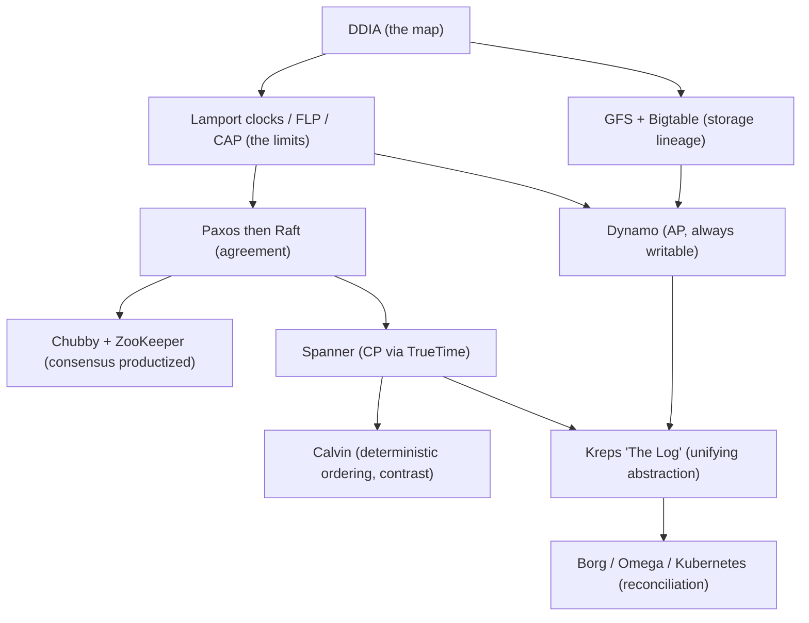
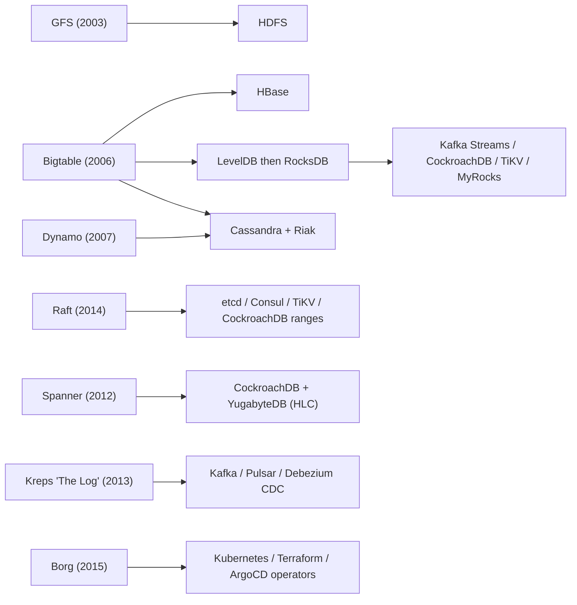
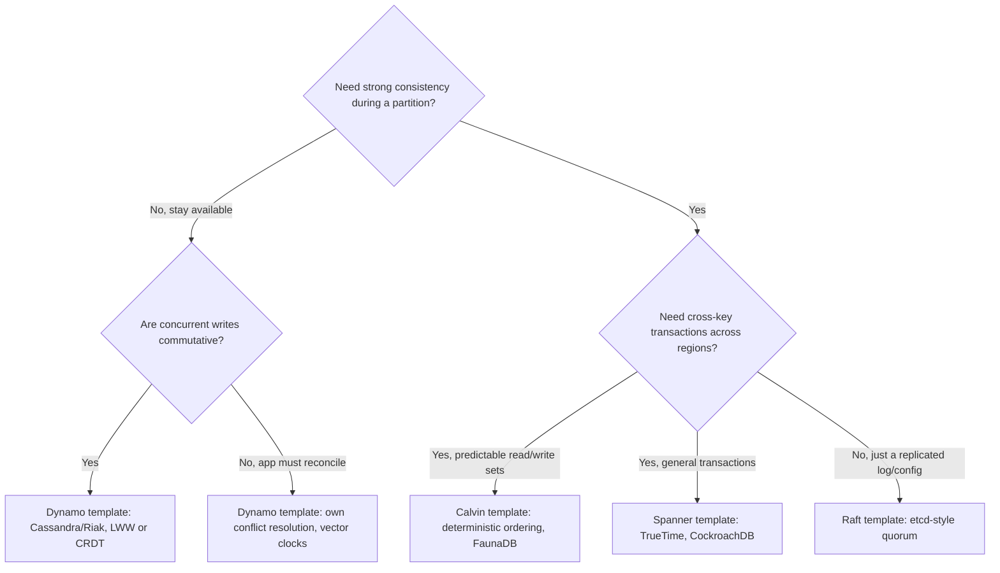
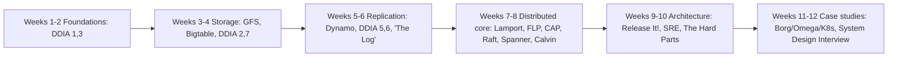

# The Principal's Reading List: Papers, Books & Systems to Study

> Where this fits: the capstone of the curriculum — the bridge from "I finished a course" to "I keep getting better for the next decade." **Principal-level takeaway:** the canon is not trivia to memorize; it is a set of *thinking templates*. You read GFS not to recall its block size but to internalize how its authors reasoned from a workload (huge files, append-heavy, commodity hardware that fails constantly) to a design. Read primary sources to steal the authors' judgment, not their facts.

## ⚡ 60-Second TL;DR

- **A sequenced syllabus, not a bibliography** — read primary sources to steal the authors' *judgment*, not their facts; blog posts strip the trade-off reasoning.
- **DDIA** = the map (read it all); **papers** = the territory (read selectively, deep vs. skim).
- **The recurring axis: consistency vs. availability/latency.** *Dynamo* = AP, always-writable, app reconciles; *Spanner* = CP, global linearizable via **TrueTime** commit-wait; *Raft/Paxos* = same consensus, Raft just teachable.
- **Foundational limits are facts, not opinions:** **FLP** (no async deterministic consensus), **CAP** (C-vs-A *during* a partition), Lamport (no global "now").
- **#1 failure mode:** collecting 40 papers, reading 2 — depth compounds, breadth evaporates.
- **Must-know:** CAP is *not* "pick 2 of 3"; Dynamo's `N/R/W` knobs; FLP escaped via partial synchrony (timeouts).

**Remember one thing:** the canon is a trade-off coordinate space — principal judgment is locating *your* problem in it and naming the nearest precedent.

## The Mental Model — first principles: why does this thing exist, what problem does it solve?

Most engineers learn distributed systems through blog posts and Stack Overflow. Blog posts are *derived* knowledge: someone read the paper, formed an opinion, compressed it, and lost the trade-off reasoning along the way. You end up with conclusions ("use Raft, not Paxos") without the context that makes them conditional ("...if your team values understandability over the multi-decree flexibility Paxos gives you"). Conclusions without context produce cargo-cult architecture — copying Netflix's microservices at a 5-person startup.

The reason to read primary sources is that the canonical papers and books were written by people *solving a real problem under real constraints*, and they document the constraints. The 2003 Google File System paper opens by stating its assumptions: component failures are the norm, files are huge, most writes are appends, and Google co-designs the applications with the filesystem. Every subsequent design decision falls out of those assumptions. When you read it that way, GFS stops being "Google's old filesystem" and becomes a worked example of *requirements-driven design* — exactly the skill [trade-off reasoning](../05-principal-skills/29-tradeoffs-and-adrs.md) demands.

There is a second, subtler reason. The field has a small number of *foundational results* — FLP impossibility, the CAP theorem, Lamport's clocks — that are not optional opinions but mathematical or logical facts about what is *possible*. A principal engineer who does not know FLP will confidently propose designs that cannot exist (a fully asynchronous consensus protocol that always terminates). Knowing the impossibility results tells you where *not* to waste a design discussion.

So this chapter is a *sequenced syllabus*, not a bibliography. The sequencing matters: reading Spanner before you understand replication and consensus is wasted effort. I will be explicit about what to read *deeply* (re-read, take notes, implement) versus *skim* (know it exists, grasp the one idea, move on). A principal's reading list is as much about what to skip as what to study.

The dependency structure below shows *what unlocks what*: an arrow means "read the source first, because the target assumes it." Notice the foundational layer (Lamport, FLP, CAP) feeds everything, and the consensus papers gate the strongly-consistent systems.

## Core Concepts — the canon, organized by theme

### The one book that anchors everything: Designing Data-Intensive Applications

If you read one thing, read Martin Kleppmann's *Designing Data-Intensive Applications* (DDIA, 2017). It is the single best synthesis of the field, and crucially, it is written by someone who read all the papers below and distilled them with their trade-offs *intact*. It is your map; the papers are the territory.

DDIA maps almost cleanly onto this curriculum, which is by design — this entire roadmap is a structured, hands-on companion to it:

| DDIA chapter | This curriculum |
|---|---|
| Ch 1 — Reliable, Scalable, Maintainable | [Reliability](../02-distributed-systems/16-reliability-and-failure.md), [Capacity estimation](../00-foundations/04-capacity-estimation.md) |
| Ch 2 — Data Models & Query Languages | [NoSQL & data models](../01-building-blocks/08-databases-nosql.md), [API design](../03-architecture-and-apis/17-api-design.md) |
| Ch 3 — Storage & Retrieval (LSM vs B-tree) | [Storage engines](../00-foundations/03-storage-engines.md), [Relational DBs](../01-building-blocks/07-databases-relational.md) |
| Ch 4 — Encoding & Evolution | [API design](../03-architecture-and-apis/17-api-design.md), [Evolutionary architecture](../05-principal-skills/30-evolutionary-architecture.md) |
| Ch 5 — Replication | [Replication](../01-building-blocks/09-replication.md) |
| Ch 6 — Partitioning | [Partitioning & sharding](../01-building-blocks/10-partitioning-sharding.md) |
| Ch 7 — Transactions (isolation levels) | [Relational DBs](../01-building-blocks/07-databases-relational.md), [Distributed transactions](../02-distributed-systems/15-distributed-transactions.md) |
| Ch 8 — Trouble with Distributed Systems | [Reliability](../02-distributed-systems/16-reliability-and-failure.md), [Time & clocks](../02-distributed-systems/14-time-clocks-ordering.md) |
| Ch 9 — Consistency & Consensus | [Consistency & CAP](../02-distributed-systems/12-consistency-and-cap.md), [Consensus](../02-distributed-systems/13-consensus.md) |
| Ch 10–11 — Batch & Stream Processing | [Messaging & streaming](../01-building-blocks/11-messaging-and-streaming.md) |
| Ch 12 — The Future of Data Systems | [Evolutionary architecture](../05-principal-skills/30-evolutionary-architecture.md) |

Chapters 5, 7, 8, and 9 are the heart of the book. Read them *twice*. Chapter 9's treatment of linearizability vs. causal consistency, and its honest explanation of why consensus and linearizable storage are equivalent problems, is worth more than a dozen blog posts.

### The supporting bookshelf

DDIA is breadth-and-judgment. The following go deep on specific axes, and you should read them selectively rather than cover-to-cover:

- **Database Internals** (Alex Petrov, 2019) — the deep dive DDIA's Chapter 3 hints at. Part I is B-trees, LSM-trees, and page layout; Part II is distributed databases (replication, consensus, anti-entropy). Read Part I after [storage engines](../00-foundations/03-storage-engines.md); it will make you genuinely understand *why* an LSM-tree trades read amplification for write throughput.
- **Understanding Distributed Systems** (Roberto Vitillo, 2021/2022) — a gentler, more modern on-ramp than the papers. If DDIA Chapter 8–9 feels too dense on a first pass, read this first, then return to DDIA.
- **Release It!** (Michael Nygard, 2nd ed. 2018) — the operational-resilience bible. This is where the *circuit breaker* and *bulkhead* patterns come from, and the opening "stability antipatterns" (cascading failure, slow responses, unbounded result sets) read like a list of every outage you will ever cause. Pair with [reliability](../02-distributed-systems/16-reliability-and-failure.md).
- **Site Reliability Engineering** + **The SRE Workbook** (Google, free online) — read the SLO/error-budget chapters and the "Embracing Risk" chapter deeply; these reframe reliability from "never break" to "break within budget." Pair with [observability](../03-architecture-and-apis/19-observability.md). The Workbook is the more practical of the two.
- **Software Architecture: The Hard Parts** (Ford, Richards et al., 2021) — for the *organizational and decomposition* side: how to break apart a monolith, data ownership, distributed transactions in practice (the "Sysops Squad" saga running example). Read alongside [architectural styles](../03-architecture-and-apis/18-architectural-styles.md) and [evolutionary architecture](../05-principal-skills/30-evolutionary-architecture.md).
- **System Design Interview, Vol. 1 & 2** (Alex Xu) — interview-shaped, lighter on theory, but excellent for *pattern fluency* and back-of-envelope drills. Use them to calibrate the [case studies](../04-design-case-studies/22-url-shortener-rate-limiter-id-gen.md), not as a primary source of judgment.

### The foundational papers — impossibility results and time

These are short, dense, and non-negotiable. They define the *boundaries of the possible*.

- **"Time, Clocks, and the Ordering of Events in a Distributed System"** (Lamport, 1978). The most important systems paper ever written. Take away: there is no global "now"; you can only establish a *happens-before* partial order, and logical (Lamport) clocks capture it. This is the conceptual root of vector clocks, version vectors, and ultimately Spanner's TrueTime. Read it deeply. Pairs with [time, clocks & ordering](../02-distributed-systems/14-time-clocks-ordering.md).
- **FLP — "Impossibility of Distributed Consensus with One Faulty Process"** (Fischer, Lynch, Paterson, 1985). Take away: in a *fully asynchronous* system, no deterministic protocol can guarantee consensus if even one process can fail, because you cannot distinguish a crashed node from a slow one. Real systems escape FLP by adding *timeouts* (partial synchrony) or *randomization*. **Skim the proof; internalize the conclusion.** It tells you why every real consensus system has a timeout and a leader-election dance.
- **CAP — Brewer's conjecture + the Gilbert-Lynch proof** ("Brewer's Conjecture and the Feasibility of Consistent, Available, Partition-tolerant Web Services," 2002). Take away: during a network partition you must choose between linearizable consistency and availability. The common misreading is "pick 2 of 3" — wrong; partitions happen *to* you, so the real choice is C-vs-A *during a partition*. Read Brewer's 2012 "CAP Twelve Years Later" retrospective, which corrects the folklore and reframes the choice as a per-partition decision; then pair it with Abadi's **PACELC** (2010 blog, 2012 paper), which is the work that actually adds the latency dimension — *else (no partition), trade Latency vs. Consistency*. Deep read; pairs with [consistency & CAP](../02-distributed-systems/12-consistency-and-cap.md).

### Consensus — the algorithms that make agreement possible

- **"Paxos Made Simple"** (Lamport, 2001). The canonical consensus algorithm. It is famously hard to operationalize; even Lamport's "simple" version leaves a gap between single-decree Paxos and a working replicated log (Multi-Paxos). Read it once for the *idea* (a majority quorum and a two-phase prepare/accept), then move on. **Deep read of the concept, skim the operational gaps.**
- **"In Search of an Understandable Consensus Algorithm" (Raft)** (Ongaro & Ousterhout, 2014). Raft was explicitly designed to be *teachable*, decomposing consensus into leader election, log replication, and safety. This is the one to read *deeply and implement* — etcd, Consul, TiKV, and CockroachDB all use Raft variants. Building a toy Raft (or doing the MIT 6.824 labs) is the single highest-leverage exercise in this entire list. Pairs with [consensus](../02-distributed-systems/13-consensus.md).
- **"The Chubby Lock Service for Loosely-Coupled Distributed Systems"** (Burrows/Google, 2006) and the **ZooKeeper paper** ("ZooKeeper: Wait-free Coordination for Internet-scale Systems," 2010). These show consensus *productized* as a coordination service: leader election, configuration, locks. Chubby's deepest lesson is in its "Lessons Learned" section — Google found most clients wanted Chubby for *name service and config*, not locking, and that caching + a coarse API mattered more than the consensus core. ZooKeeper's ZAB protocol and its wait-free znode API are the practical model most teams actually touch. **Read Chubby for the lessons; skim ZooKeeper's protocol, know its API.**

### The Google trio — how a planet-scale stack was built bottom-up

Read these in order; each builds on the last.

- **GFS — "The Google File System"** (2003). Append-optimized, single-master, 64 MB chunks, replication over commodity disks, *relaxed consistency* (a record may appear more than once; readers tolerate it). The lesson is co-design: GFS is "wrong" as a general filesystem and exactly right for MapReduce. Deep read.
- **MapReduce** (2004). A programming model that hides distribution, fault-tolerance (re-execute failed tasks), and data locality behind two functions. The model matters more than the implementation now (Spark/Flink superseded it), but the *idea* — push computation to data, make failure a re-run — is foundational. **Read for the idea.**
- **Bigtable — "A Distributed Storage System for Structured Data"** (2006). The sparse, sorted, multidimensional map; SSTables and the LSM/memtable design; built on GFS and Chubby. This is the direct ancestor of HBase, Cassandra's storage layer, and LevelDB/RocksDB. Deep read; pairs with [NoSQL](../01-building-blocks/08-databases-nosql.md) and [storage engines](../00-foundations/03-storage-engines.md).

### The Amazon line — availability-first design

- **Dynamo — "Dynamo: Amazon's Highly Available Key-value Store"** (DeCandia et al., 2007). The most influential AP-system paper. It introduces, in one place: consistent hashing for partitioning, quorum reads/writes with the `N/R/W` knobs, vector clocks for conflict detection, hinted handoff and Merkle-tree anti-entropy for recovery, and *application-level conflict resolution* (the shopping cart that merges rather than loses writes). Take away: Amazon chose "always writable" over consistency for the cart, and pushed reconciliation to the client. This paper *is* the design template for [Cassandra/Riak/the KV case study](../04-design-case-studies/26-object-store-and-kv-store.md). Deep read — arguably the most reusable single paper here. Pairs with [consistent hashing](../01-building-blocks/05-load-balancing.md), [replication](../01-building-blocks/09-replication.md), [partitioning](../01-building-blocks/10-partitioning-sharding.md).

### Spanner — buying consistency back with physics

- **"Spanner: Google's Globally-Distributed Database"** (2012). The counterpoint to Dynamo. Spanner provides *externally consistent* (linearizable) transactions across continents by using **TrueTime**: GPS + atomic clocks expose time as an *interval* `[earliest, latest]` with a bounded uncertainty (single-digit milliseconds), and Spanner simply *waits out the uncertainty* (commit-wait) to guarantee global ordering. Take away: CAP is not destiny — with enough money for hardware clocks you can shrink the uncertainty window enough to offer strong consistency at scale, paying for it in commit latency. This is the intellectual ancestor of CockroachDB (which approximates TrueTime in software with HLCs) and YugabyteDB. Deep read; pairs with [time & clocks](../02-distributed-systems/14-time-clocks-ordering.md) and [distributed transactions](../02-distributed-systems/15-distributed-transactions.md).
- **Calvin — "Fast Distributed Transactions for Partitioned Database Systems"** (Thomson et al., 2012). The *other* answer to distributed transactions: instead of locking and 2PC, **deterministically order all transactions first** (via a replicated log / sequencer) and then execute them; if every replica processes the same ordered batch, they stay consistent without a commit protocol. This is the model behind FaunaDB. **Read for the contrast** with Spanner — it reframes the problem as "agree on order, then everyone computes the same answer."

### The log — the unifying abstraction

- **Kafka paper** ("Kafka: a Distributed Messaging System for Log Processing," 2011) and especially **Jay Kreps's "The Log: What every software engineer should know about real-time data's unifying abstraction"** (2013 blog/essay). The Kreps essay is the single best argument that an *append-only, totally-ordered log* is the primitive underneath replication, stream processing, and database change capture. Take away: replication is just "replay the same log on every node"; a database and a stream processor are duals. Deep read of Kreps; skim the original Kafka paper (the system has evolved far past it). Pairs with [messaging & streaming](../01-building-blocks/11-messaging-and-streaming.md).

### Cluster management — Borg and Kubernetes

- **"Large-scale cluster management at Google with Borg"** (2015) and **"Borg, Omega, and Kubernetes"** (2016). Borg is the production cluster scheduler that ran Google for a decade; Kubernetes is its open-source descendant. Take away: the *declarative reconciliation loop* — you declare desired state, controllers continuously drive actual state toward it — is the core idea, and it generalizes far beyond containers. **Read the Borg/Omega/K8s retrospective deeply; skim the original Borg paper.**

## Trade-offs at a Glance

The deepest theme in the canon is a single recurring trade-off — **consistency vs. availability/latency** — answered differently by each system. Knowing *which paper chose what, and why* is the actual payload:

| Source | Core choice | Wins | Costs | Read it when... |
|---|---|---|---|---|
| **Dynamo** | AP: always writable | Survives partitions, low write latency, no leader | Conflicts pushed to the app; eventual consistency | You need an always-on shopping-cart / session store |
| **Spanner** | CP + external consistency via TrueTime | Global linearizable txns | Hardware clock infra; commit-wait latency | You need correctness across regions and have budget |
| **Calvin** | Deterministic ordering, no 2PC | High-throughput distributed txns, no commit protocol | Pre-declared read/write sets; sequencer is a bottleneck | Throughput-critical OLTP with predictable txns |
| **Raft** | Strong consistency, single leader | Understandable, widely implemented | Leader is a write bottleneck; needs majority quorum | You need a replicated config/log (etcd-style) |
| **Paxos** | Strong consistency, flexible | Maximally general | Hard to implement correctly | You are writing a paper or a database core |
| **GFS/Bigtable** | Relaxed/single-master | Simplicity, throughput for huge files | Master is a scaling/availability ceiling | Append-heavy, large-object, batch workloads |

The meta-lesson: **there is no "best" — each paper is a coordinate in a trade-off space.** Principal judgment is locating *your* problem in that space and naming the nearest precedent.

## How Real Systems Do It

The lineage from paper to production system is the proof these ideas compound. The map below traces each canonical paper to the systems you actually run today:

The lineage in prose:

- **GFS → HDFS** (Hadoop's filesystem is a near-direct clone). **Bigtable → HBase**, and Bigtable's SSTable/LSM core → **LevelDB → RocksDB**, which now powers Kafka Streams, CockroachDB, TiKV, MyRocks, and more.
- **Dynamo → Cassandra and Riak.** Cassandra took Dynamo's partitioning/replication and married it to Bigtable's storage model. (Note: Amazon's *DynamoDB* product, 2012, is *not* the 2007 Dynamo — it dropped client-side conflict resolution for a managed, more consistent model.)
- **Raft → etcd** (the brain of Kubernetes), **Consul**, **TiKV/TiDB**, and **CockroachDB**'s per-range consensus. When you `kubectl apply`, a Raft quorum in etcd commits the write.
- **Spanner → CockroachDB and YugabyteDB**, which reproduce its guarantees without atomic clocks by using Hybrid Logical Clocks and accepting wider uncertainty.
- **The Log essay → Kafka, Pulsar, and Kafka Connect / Debezium** (change-data-capture is literally "treat the DB's write-ahead log as a stream").
- **Borg → Kubernetes**, and the reconciliation-loop pattern now appears in Terraform, ArgoCD, and every "operator."

When you read an incident postmortem from Cloudflare, GitHub, or AWS, you will now recognize the failure as a known mode: a thundering-herd cache miss (Release It!), a split-brain from a partition (CAP), a clock skew breaking ordering (Lamport/Spanner), or a cascading failure from an unbounded queue (Nygard).

## Failure Modes & Common Misconceptions

**Reading as collection, not comprehension.** The failure mode is a Notion page with 40 papers, two of them read. Reading three papers *deeply* — Dynamo, Raft, DDIA Ch. 5/9 — beats skimming forty. Depth compounds; breadth without depth evaporates.

Specific myths to kill:

- *"CAP says pick 2 of 3."* No. Partition-tolerance is not optional in a real distributed system — partitions happen to you. The choice is C-vs-A *only during a partition*, and the rest of the time PACELC says you trade consistency vs. *latency*. Brewer himself corrected this in 2012.
- *"Eventually consistent means data gets lost / is unreliable."* No — it means reads may be stale and concurrent writes need a conflict-resolution policy (last-write-wins, vector clocks, CRDTs). Dynamo never loses an acknowledged write; it makes you reconcile.
- *"NoSQL is faster / web-scale; SQL doesn't scale."* This is the most expensive myth a junior carries into a design. The papers show the real axis is the *data model and consistency requirements*, not a speed contest. Spanner is SQL at planet scale.
- *"Raft and Paxos are different paradigms."* They solve the *same* problem (consensus via majority quorums); Raft is a more teachable packaging with a strong leader. Don't oppose them — understand that Raft made an existing idea operable.
- *"FLP means consensus is impossible, so why bother."* FLP is about *fully asynchronous* systems with a *deterministic guarantee* of termination. Real systems escape it via **partial synchrony** — adding timeouts and leader election so that termination is guaranteed once the network is stable (after a "global stabilization time"), while safety holds always — or via **randomization**, which gives termination with probability 1. The impossibility is precise and narrow.
- *"Spanner beat CAP."* It did not repeal the theorem. During a true partition Spanner chooses consistency and becomes *unavailable* for affected ranges — it is a CP system that uses TrueTime to make the consistent path fast and global, not to escape the trade-off.

## In a Design Discussion

The reading list is invisible *infrastructure* for your judgment. It shows up as the precedents you reach for and the trade-offs you name unprompted.

**Junior take:** "Let's use Cassandra because it's web-scale and handles tons of writes." (A conclusion borrowed from a blog, no trade-off named.)

**Principal take:** "This is a Dynamo-shaped problem — high write availability, partition-tolerance, and we can tolerate read-your-writes lag. So Cassandra fits *and* it means we own conflict resolution: are concurrent updates to the same key commutative? If not, we need last-write-wins with NTP-bounded clocks, and I want to talk about clock skew before we commit, because that's exactly the Spanner/Lamport problem. If we actually need cross-key transactions, Cassandra is the wrong tool and we should look at CockroachDB and pay the latency for it."

Notice what the senior version does: it *names the precedent* (Dynamo), *surfaces the hidden cost* (conflict resolution, clock skew), and *defines the off-ramp* (when the choice flips). That is the canon doing its job. Capture the resulting decision in an [ADR](../05-principal-skills/29-tradeoffs-and-adrs.md) with the trade-offs explicit.

The other discussion habit the canon gives you: **citing the impossibility result to stop a doomed line of design.** When someone proposes "a system that's always consistent and always available even during partitions," you don't argue — you name CAP and redirect to "which one do we give up *during a partition*, and how often do partitions happen here?"

The canon collapses into a small decision tree you can run live in a design review — locate the problem, name the precedent:

## A suggested reading order, interleaved with the 12-week roadmap

Don't front-load papers. Read each *after* the corresponding hands-on writeup, so the paper answers a question you already feel:

- **Weeks 1–2 (Foundations):** DDIA Ch. 1, 3. Database Internals Part I (skim). No heavy papers yet — build intuition first.
- **Weeks 3–4 (Building blocks: storage, DBs):** GFS, Bigtable (deep). DDIA Ch. 2, 7. Database Internals Ch. on LSM/B-tree.
- **Weeks 5–6 (Replication, partitioning, messaging):** Dynamo (deep). DDIA Ch. 5, 6. Kreps "The Log" (deep). Kafka paper (skim).
- **Weeks 7–8 (Distributed systems core):** Lamport "Time, Clocks" (deep). FLP (skim proof, know result). CAP + Brewer 2012 (deep). DDIA Ch. 8, 9 (twice). **Raft (deep — implement it, or do MIT 6.824 Lab 2/3).** Paxos Made Simple (concept). Chubby (lessons). Spanner (deep). Calvin (contrast).
- **Weeks 9–10 (Architecture, APIs, observability):** Release It! (stability patterns). SRE book — Embracing Risk + SLO chapters. The Hard Parts (decomposition).
- **Weeks 11–12 (Case studies + principal skills):** Borg/Omega/K8s retrospective. System Design Interview Vol. 1/2 to drill the case studies. Re-skim DDIA Ch. 12.

The reading path across the twelve weeks, each cluster gated by the hands-on writeup that motivates it:

If you only have time for the *irreducible core*: DDIA (all), Dynamo, Raft, Lamport's clocks, and Kreps's "The Log." Those five make everything else easier to absorb.

## Self-Check

1. Why read primary papers when DDIA already summarizes them?

DDIA gives you the synthesized judgment, but the papers preserve the *original constraints and reasoning* that produced each design. You read GFS to watch requirements drive design, and to be able to reason about a *new* problem the way the authors did — a skill no summary transfers.

2. What does FLP actually prove, and how do real systems get around it?

In a fully asynchronous system, no deterministic protocol can *guarantee* consensus terminates if even one process may crash (you can't distinguish slow from dead). Real systems escape it by assuming *partial synchrony* — adding timeouts and leader election — so that *safety* always holds and *termination* is guaranteed once the network becomes stable enough (after a global stabilization time). (Randomized protocols are the other escape: termination with probability 1.)

3. Dynamo and Spanner solve overlapping problems with opposite choices. State the trade-off.

Dynamo chooses availability/low-latency writes and pushes conflict resolution to the application (AP, eventual consistency). Spanner chooses external consistency (linearizable global transactions) and pays for it with TrueTime hardware and commit-wait latency (CP). Same axis, opposite ends.

4. What is the single unifying idea behind Kreps's "The Log"?

An append-only, totally-ordered log is the underlying primitive for replication, stream processing, and CDC. Replication is "replay the same log everywhere"; a database and a stream processor are duals over the same log. It turns many systems into one abstraction.

5. A teammate says "we'll use Raft instead of Paxos because Paxos can't do what we need." Correct them.

They solve the same problem — consensus via majority quorums. Raft isn't more capable; it's a more *understandable, implementable* packaging with a strong leader and a clean log-replication model. Choose Raft for operability, not capability.

6. Which papers should you read deeply vs. skim, and why?

Deep: Dynamo, Raft, GFS, Bigtable, Spanner, Lamport's clocks, Kreps's "The Log," DDIA Ch. 5/8/9 — they're directly reusable design templates. Skim (idea only): FLP proof, Paxos's operational gaps, the original Kafka and Borg papers (superseded by their descendants). Depth where it compounds; breadth where the idea is the whole payload.

7. Why is "CAP: pick 2 of 3" wrong, and what's the better framing?

Partition tolerance isn't a choice — partitions happen to you. So the real choice is consistency *vs.* availability *during a partition*, and when there's no partition, PACELC says you trade consistency vs. latency. The honest framing is "what do we give up while partitioned, and how often does that happen?"

8. What's the highest-leverage single exercise on this list?

Implementing Raft (or doing the MIT 6.824 labs). Building consensus from the paper forces you to confront leader election, log matching, and safety under partition — turning abstract knowledge into reflexive judgment you can't get by reading alone.

## Go Deeper

- **Books:** Kleppmann, *Designing Data-Intensive Applications* (start here, finish here). Petrov, *Database Internals*. Vitillo, *Understanding Distributed Systems*. Nygard, *Release It!* (2nd ed.). Beyer et al., *Site Reliability Engineering* and *The SRE Workbook* (both free at sre.google/books). Ford & Richards, *Software Architecture: The Hard Parts*. Xu, *System Design Interview* Vol. 1 & 2.
- **Foundational papers:** Lamport, "Time, Clocks, and the Ordering of Events" (1978). Fischer/Lynch/Paterson, "Impossibility of Distributed Consensus with One Faulty Process" (1985). Gilbert & Lynch, "Brewer's Conjecture..." (2002); Brewer, "CAP Twelve Years Later" (2012).
- **Consensus:** Lamport, "Paxos Made Simple" (2001). Ongaro & Ousterhout, "In Search of an Understandable Consensus Algorithm (Raft)" (2014) — see also raft.github.io and "Raft Refloated." Burrows, "The Chubby Lock Service" (2006). Hunt et al., "ZooKeeper" (2010).
- **Systems:** Ghemawat et al., "The Google File System" (2003). Dean & Ghemawat, "MapReduce" (2004). Chang et al., "Bigtable" (2006). DeCandia et al., "Dynamo" (2007). Corbett et al., "Spanner" (2012). Thomson et al., "Calvin" (2012). Kreps et al., "Kafka" (2011) + Kreps, "The Log" essay (2013). Verma et al., "Borg" (2015); Burns et al., "Borg, Omega, and Kubernetes" (2016).
- **Where to keep learning:** the "Papers We Love" repo and meetups; Murat Demirbas's distributed-systems blog (muratbuffalo); Kleppmann's talks and his follow-on CRDT/local-first work; engineering blogs from Netflix, Uber, Discord, Stripe, Cloudflare, and AWS Builders' Library; the Morning Paper archive (Adrian Colyer) for guided paper summaries; and the MIT 6.824 / 6.5840 lecture videos and labs.
- **Cross-links:** loop back to [trade-off reasoning & ADRs](../05-principal-skills/29-tradeoffs-and-adrs.md) and [evolutionary architecture](../05-principal-skills/30-evolutionary-architecture.md) — the canon is the raw material; those chapters are how you spend it. Index: [../README.md](../README.md) · Plan: [../ROADMAP.md](../ROADMAP.md).
