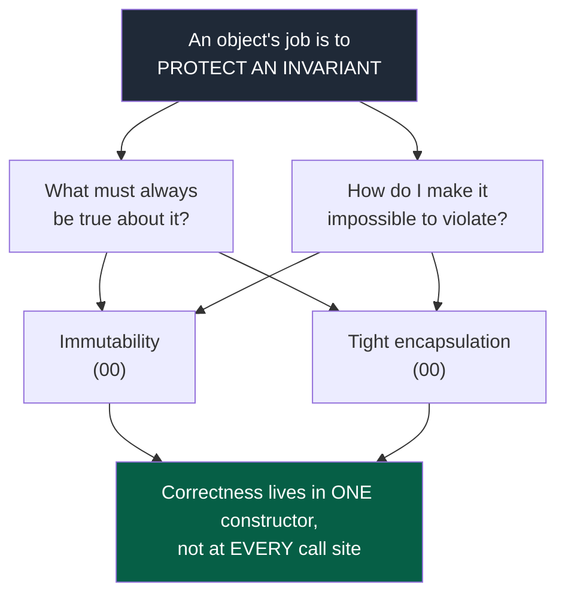
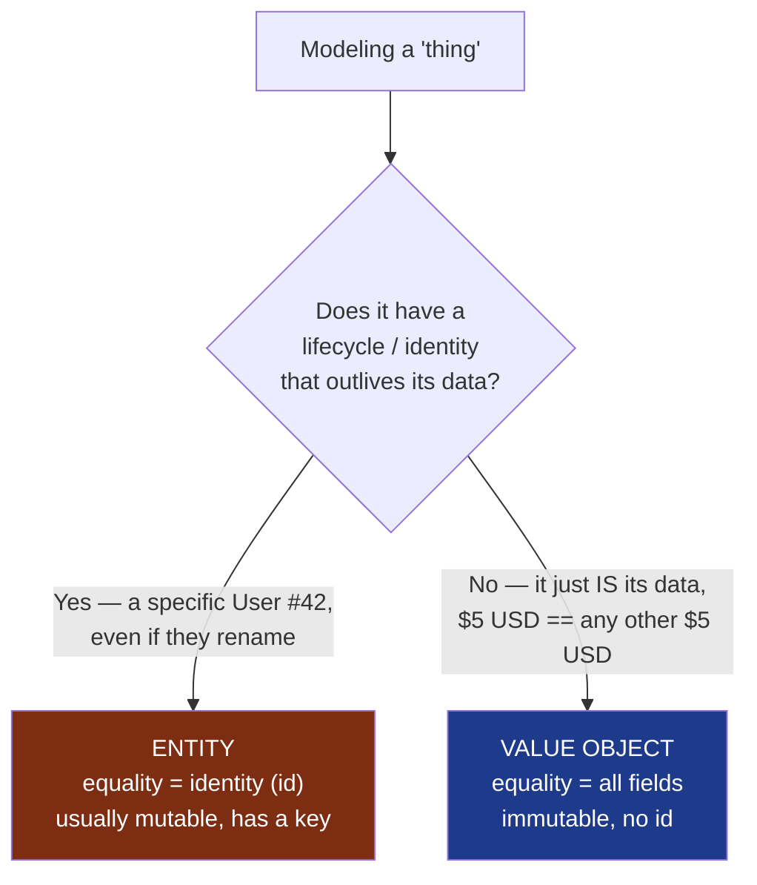
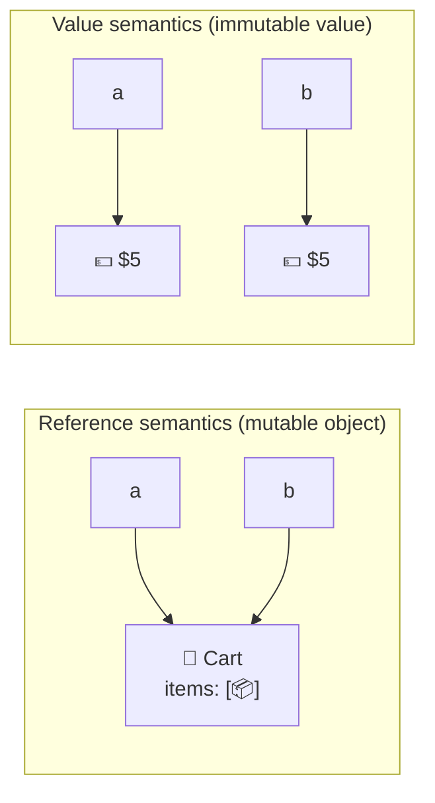
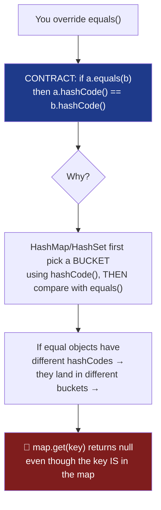
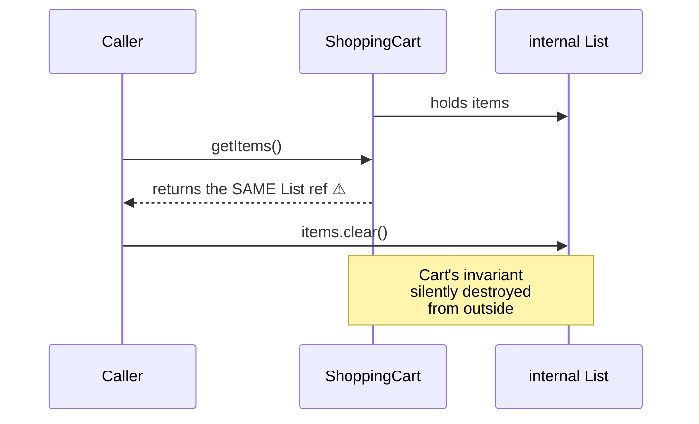
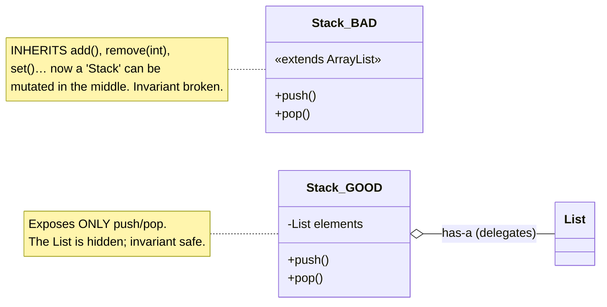
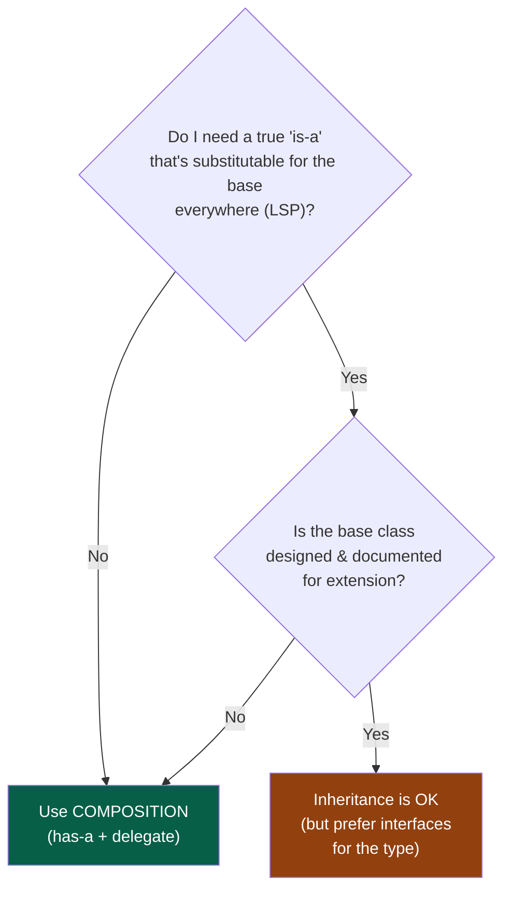
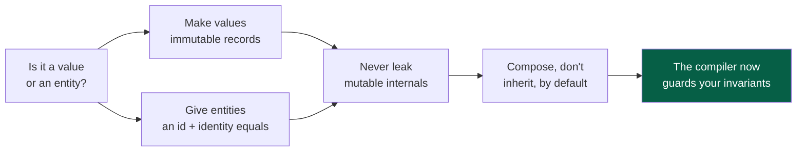

# 00 — Foundations · Teaching Notes

> Read this alongside the [section syllabus](README.md). Diagrams are Mermaid (render on GitHub /
> VS Code / Obsidian). The 🎬 links open **animations** in your browser — watch those for the two
> concepts that only click when they move.
>
> 🎬 [Value vs Reference semantics](visualizations/value-vs-reference.html) ·
> 🎬 [equals / hashCode & HashMap](visualizations/equals-hashcode.html)

---

## The one idea this whole section serves



A class full of getters/setters isn't an object — it's a struct with extra steps, and now *every*
caller shares the job of keeping it valid. Everything below is a tool for moving that job into one
place where the compiler can guard it.

---

## 1. Identity vs. Equality — "are these the same thing?"

Two different questions hide behind the word "same":

| Question | Java operator/method | Asks… |
|----------|----------------------|-------|
| **Identity** | `a == b` (for objects) | Are these the *same object* in memory? |
| **Equality** | `a.equals(b)` | Do these represent the *same value*? |

This split is the root of the **Value vs. Entity** distinction:



- **`Money(5, USD)`** is a *value* — any two five-dollar amounts are interchangeable. Equality = all fields.
- **`User #42`** is an *entity* — Alice renamed to Alicia is still User #42. Equality = identity (the id).

> Getting this wrong is a top source of real bugs: an entity compared by fields silently merges two
> different customers; a value compared by identity makes `new Money(5,USD).equals(new Money(5,USD))`
> return **false** and breaks every lookup.

---

## 2. Value vs. Reference semantics  🎬 [animation](visualizations/value-vs-reference.html)

In Java, variables of object type hold a **reference** (a pointer), not the object. So:



- **Reference (left):** `b = a` makes `b` point at the *same* cart. `b.add(item)` is visible through
  `a`. This **aliasing** is the source of "spooky action at a distance" bugs.
- **Value (right):** if `Money` is immutable, sharing is harmless — there's no mutation to leak.
  "Modifying" returns a *new* value: `a.plus(b)` doesn't touch `a`.

**The animation** shows a mutation through one alias rippling to the other for a mutable object,
then the same scenario being safe for an immutable value. This is *why* immutability simplifies code.

---

## 3. The `equals` / `hashCode` contract  🎬 [animation](visualizations/equals-hashcode.html)

If you override `equals`, you **must** override `hashCode`. Here's the contract and why:



The contract, in full:

| Property | Meaning |
|----------|---------|
| **Reflexive** | `a.equals(a)` is true |
| **Symmetric** | `a.equals(b)` ⇔ `b.equals(a)` |
| **Transitive** | `a.equals(b)` & `b.equals(c)` ⇒ `a.equals(c)` |
| **Consistent** | repeated calls give the same result |
| **`equals`↔`hashCode`** | equal objects **must** share a hashCode |

> **The killer bug** (in the animation): a `Point` with a correct `equals` but a `hashCode` that
> uses a *mutating* or *incomplete* field. You `put` it in a `HashMap`, then `get` it back and the
> map says it's not there — because `get` hashed to a different bucket than `put` did.

**Java 21 shortcut:** a `record` generates a correct, all-fields `equals`/`hashCode`/`toString` for
you. Prefer records for value objects — they make the contract the default instead of a footgun.

```java
public record Money(BigDecimal amount, Currency currency) { }
// equals, hashCode, toString, accessors — all correct, all free.
```

---

## 4. Immutability & the defensive-copy bug

The most common encapsulation leak in real Java:



`getItems()` returning the internal `List` hands callers a key to the object's private state. Two fixes:

| Fix | Code | Trade-off |
|-----|------|-----------|
| **Defensive copy** | `return new ArrayList<>(items);` | Safe; caller's changes don't affect you. Costs an allocation; caller may expect a live view. |
| **Unmodifiable view** | `return List.copyOf(items);` (or `unmodifiableList`) | Cheap, read-only; caller mutation throws at runtime instead of compiling. |

> Rule of thumb: **never return a direct reference to mutable internal state**, and **never store a
> caller's mutable object without copying it** (the same leak runs in reverse through constructors/setters).
> Immutable fields sidestep the whole problem — there's nothing to defend.

---

## 5. Composition over inheritance

Inheritance couples you to a base class's *implementation*, not just its interface — the **fragile
base class** problem. Prefer `has-a` over `is-a` unless you truly need substitutability.



Decision guide:



> "Favor composition over inheritance" (Bloch, *Effective Java*) — inheritance breaks encapsulation
> because a subclass depends on implementation details of its superclass that can change underneath it.

---

## Mental model to carry out of this section



---

## Now do the drill (this is where it sticks)

Go to [`src/`](src/) and make the failing tests pass:
1. Open [`src/Money.java`](src/Money.java) — a skeleton value type with `// TODO`s.
2. Run the tests (JDK only, no build tools): `cd 00-foundations/src && javac Money.java MoneyTest.java && java MoneyTest`
3. You start at **5 passed, 9 failed**; watch them go green as you implement validation, immutability, and correct equality. See [`src/README.md`](src/README.md) for the order to attack the TODOs.
4. When green, write three lines in [`notes.md`'s "what I learned"](#what-i-learned) below.

Then re-watch both animations — they'll mean more *after* you've built the type.

---

## What I learned
<!-- Fill this in after the drill. One force you now get, one mistake you made, one thing you'd do differently. -->
- _force:_
- _mistake:_
- _next time:_
