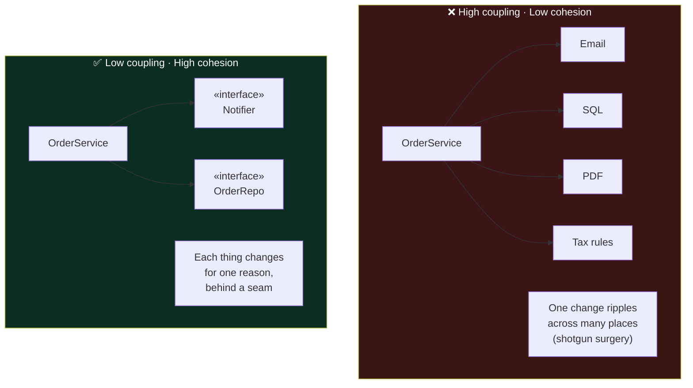
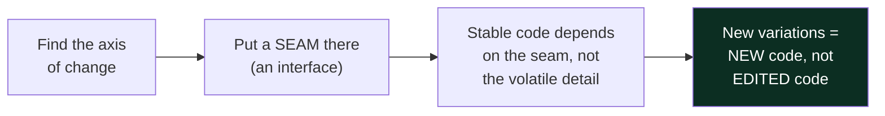
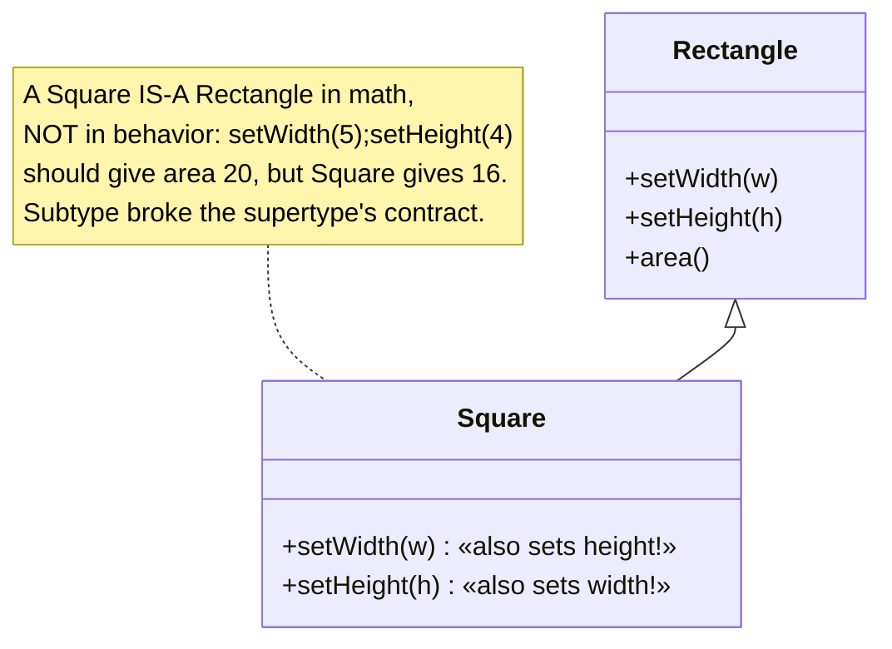
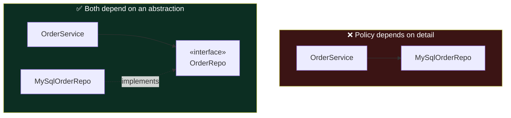
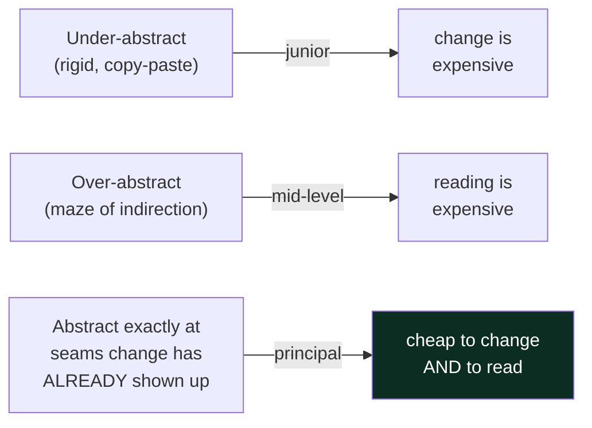

# 01 — Design Principles · Teaching Notes

> Read with the [syllabus](README.md). Principles are **forces**, not rules — every one can be
> over-applied into a worse design. 🎬 [Open/Closed: if-else vs Strategy](visualizations/open-closed-principle.html)

---

## The two master forces: coupling & cohesion

Almost every principle below is a special case of "lower coupling, raise cohesion."

- **Coupling** = how much one unit must know about another. High coupling means a change *there*
  forces a change *here*. Minimize it.
- **Cohesion** = how focused a unit is. High cohesion means everything in the class serves one job.
  Maximize it.

> Principal lens: you can read coupling/cohesion off a class in seconds. "What would force me to
> edit this file?" Many unrelated answers = low cohesion. "If I change X, what else breaks?" Many
> answers = high coupling.

---

## The meta-principle that generates the rest: **encapsulate what varies**

Find what changes, isolate it behind an interface, and let the stable parts depend on the interface.
That single move *is* most of OCP, DIP, and the Strategy pattern.

---

## SOLID — each as a force *and* its trap

| | Force (what it pushes you toward) | The trap (over-application) |
|---|---|---|
| **S** SRP | one reason to change → split mixed concerns | shattering cohesive logic into anemic fragments |
| **O** OCP | extend without modifying tested code | speculative seams for change that never comes |
| **L** LSP | subtypes must honor the supertype's contract | forcing an `is-a` where it doesn't hold |
| **I** ISP | many small role-interfaces > one fat one | interface explosion / one-method-per-file noise |
| **D** DIP | high-level policy depends on abstractions | wrapping everything in an interface "just in case" |

### LSP — the classic breakage

> Fix: don't model it with inheritance. Prefer composition; or model both as immutable shapes with
> an `area()` and no setters. LSP violations almost always trace back to a forced `is-a`.

### DIP — point the dependency at an abstraction

The high-level policy (what the order *does*) should not import the low-level detail (which database).
Both point at the interface. This is what makes business logic testable with a fake repo.

---

## The smaller principles (don't weaponize them)

- **DRY** — remove duplication of *knowledge*, not of *text*. Two methods that look alike but change
  for *different reasons* are **not** duplication; merging them couples two things that should move
  independently.
- **KISS / YAGNI** — the counterweight to SOLID. Most "flexibility" you add up front is never used and
  just adds indirection. **Duplicate until it hurts, then unify** beats guessing the abstraction early.
- **Law of Demeter / Tell-Don't-Ask** — don't reach through objects (`a.getB().getC().run()`); tell an
  object to do the work instead of pulling its guts out to do it yourself.

---

## The principal-level insight

**Every abstraction is a loan against complexity** — paid now (indirection, more files, harder to
follow) for a benefit that may never arrive. Juniors under-abstract; mid-levels over-abstract;
principals abstract *exactly* where change has actually appeared and leave the rest concrete. The
real enemy is **complexity** — how much you must hold in your head to safely change something.

## Interview lens

In machine coding, "what if the pricing rule changes?" / "what if we add a payment method?" are OCP/DIP
probes. Winning move: put one interface exactly where they hinted growth, keep the rest concrete, and
**narrate the trade-off out loud** ("interface here because payment types will grow; concrete elsewhere
to stay simple"). That sentence is a senior→principal signal.

---

## Now do the drill

[`src/`](src/) — make `Checkout` apply pluggable `Discount` strategies so a brand-new discount type
works **without modifying `Checkout`**. That's OCP made concrete. Run instructions in [`src/README.md`](src/README.md).
Then re-open the [Open/Closed animation](visualizations/open-closed-principle.html).

> Next → [`02` Design Patterns](../02-design-patterns/): these forces crystallize into named solutions.

## What I learned
<!-- after the drill: one force you now get, one mistake, one thing you'd do differently -->
- _force:_
- _mistake:_
- _next time:_
