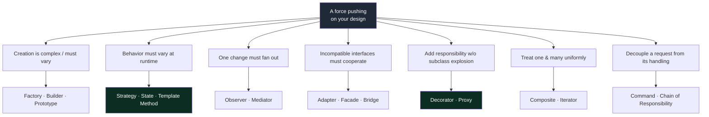
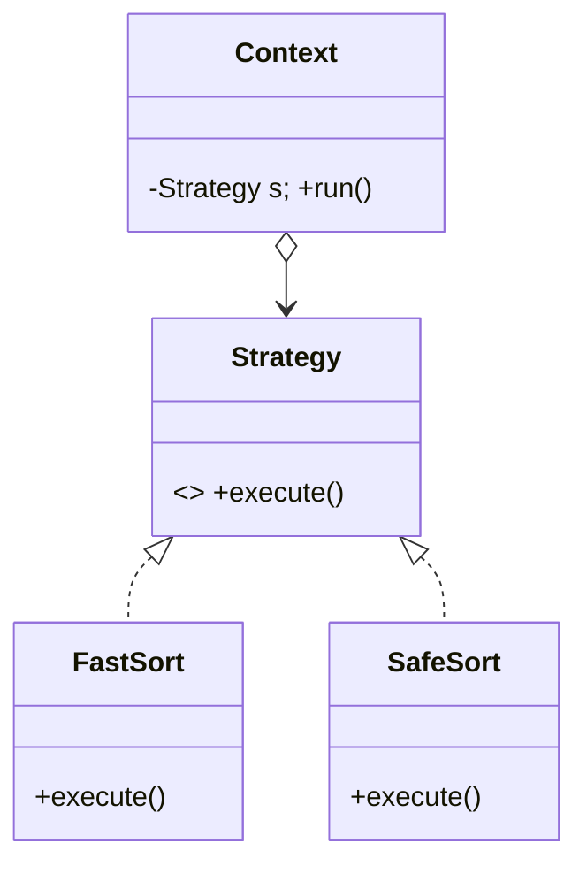
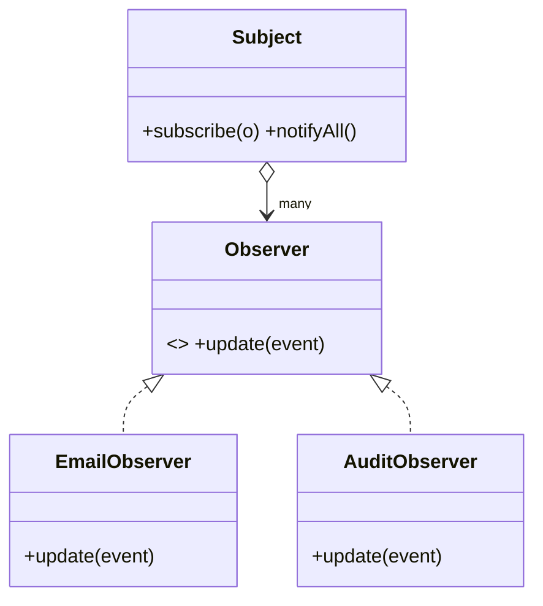
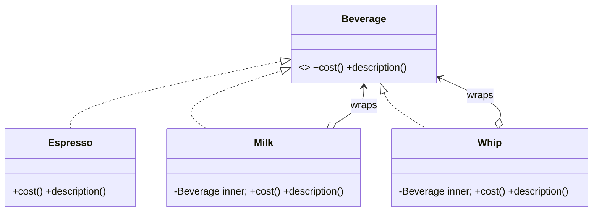
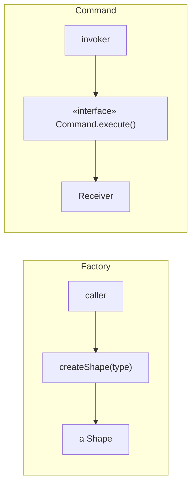

# 02 — Design Patterns · Teaching Notes

> Read with the [syllabus](README.md). **Don't memorize 23 patterns — learn the ~8 forces that
> generate them.** A pattern is a named response to a recurring force; know the force and you can
> derive the pattern. 🎬 [Decorator: compose behavior at runtime](visualizations/decorator.html)

---

## The 8 forces (this is the whole section in one table)

Master the **workhorses** (Strategy, Observer, Decorator, Factory, Command) at depth-level 5
(*choose vs alternatives, out loud*); know the rest at level 3 (*derive from the force*).

---

## Strategy — behavior varies at runtime

> In modern Java a **lambda IS a Strategy**: `Comparator<T>` is a one-method interface, so
> `list.sort((a,b) -> ...)` is the Strategy pattern with no boilerplate class.

## Observer — one change fans out to many

> Cost to name out loud: Observer hides control flow and leaks memory if you forget to unsubscribe.
> For a single listener, just call it directly.

## Decorator — add responsibility without subclass explosion  🎬 [animation](visualizations/decorator.html)

Each decorator **wraps** a `Beverage` and delegates inward, adding its bit. `new Whip(new Milk(new
Espresso()))` composes at runtime — no `EspressoWithMilkAndWhip` class, no combinatorial explosion.

## Factory Method & Command (the other two workhorses)

> A **method reference is a Command**; an **`enum` is the cleanest Singleton**. Modern Java already
> hands you several classic patterns for free — recognizing that is itself senior judgment.

---

## The principal-level insight

**Patterns are a vocabulary for communication, not a goal for code.** A junior bends code to fit a
pattern; a principal lets the pattern *emerge* because the force was real — and reaches for a plain
method or `if` when the force isn't. Always be able to answer **"why not just a plain method/lambda
here?"** An over-applied pattern (a `FactoryFactory` for two cases) is a *senior-level smell*, not a flex.

## Interview lens

"Now add a new type of X without touching existing code" = Strategy/Factory/OCP. The trap is reaching
for a heavy pattern when a lambda or `if` would do — that reads as inexperience. Name the pattern out
loud (shared vocabulary speeds the round) **and** name why the simpler option wasn't enough.

---

## Now do the drill

[`src/`](src/) — implement the `Milk` and `Whip` decorators so `cost()`/`description()` compose by
wrapping. Run instructions in [`src/README.md`](src/README.md), then re-open the
[Decorator animation](visualizations/decorator.html).

> Next → [`03` Clean Code & Refactoring](../03-clean-code-and-refactoring/).

## What I learned
<!-- one force you now get, one mistake, one thing you'd do differently -->
- _force:_
- _mistake:_
- _next time:_
