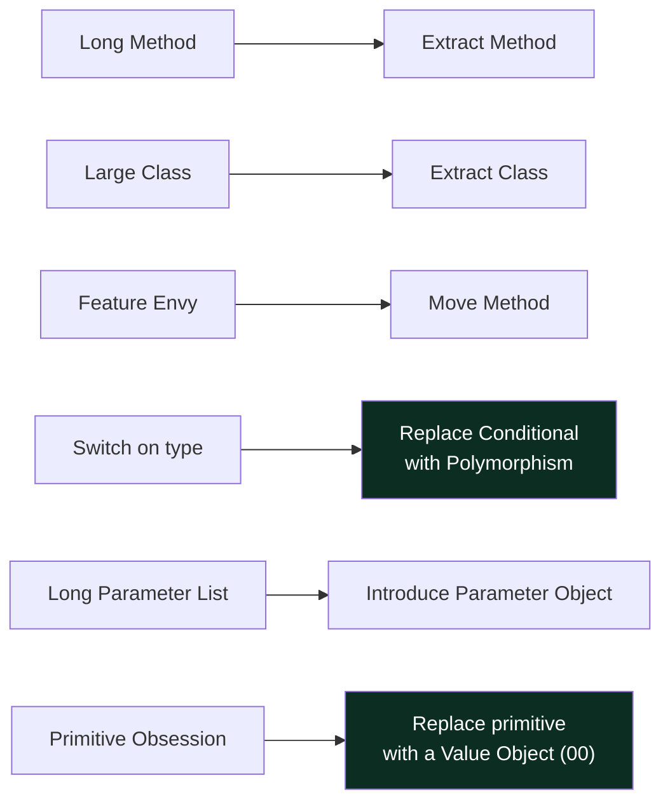
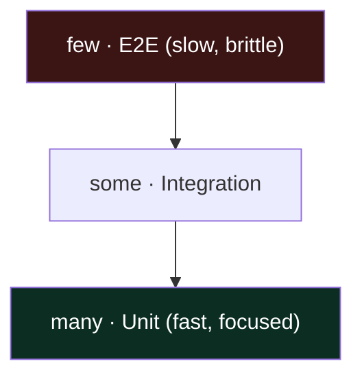
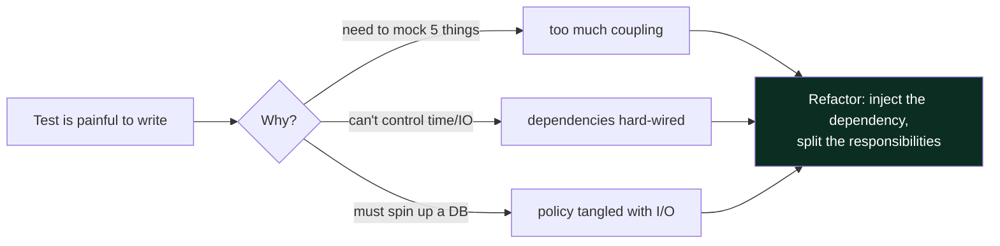
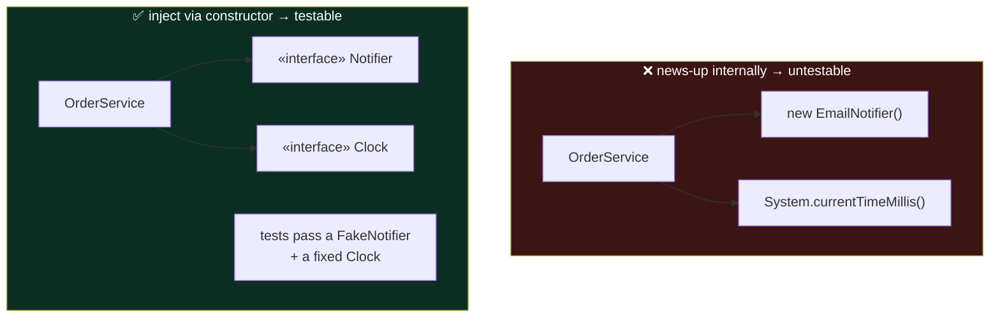

# 03 — Clean Code, Refactoring & Testing · Teaching Notes

> Read with the [syllabus](README.md). Design isn't done once up front — it's *maintained* through
> small, safe steps. And **hard-to-test code is badly-designed code**: the pain you feel writing a
> test is a free design review. 🎬 [The refactoring staircase](visualizations/refactoring-staircase.html)

---

## Code smells → the refactoring that removes each

A smell is a *hint*, not a rule. The skill is matching the smell to the cheapest refactoring that
removes it — and stopping there.

---

## The discipline: small steps, green between each

> **Never refactor and add a feature in the same commit.** Refactoring is *behavior-preserving* —
> tests stay green the whole way. If a test goes red, you changed behavior; back up. The
> [animation](visualizations/refactoring-staircase.html) shows a god-method decomposed step-by-step
> with the test bar staying green throughout.

---

## Testing IS design: the pyramid & the feedback

Most tests should be fast unit tests. But the deeper point is the **feedback loop**:

## Dependency Injection — the practical form of DIP

`new` inside business logic welds you to a concrete dependency you can't replace in a test. Pass
collaborators through the constructor and the same code becomes trivially testable.

---

## The principal-level insight

**Listening to test pain is how principals find design flaws while they're still cheap.** They don't
experience "writing tests" and "designing" as separate activities — a method that needs five mocks is
telling you it has five dependencies. And refactoring isn't a project you get time for "later"; it's
the continuous act that keeps the cost of the *next* change low. Teams that "have no time to refactor"
are paying compound interest on mess forever.

## Interview lens

Machine-coding rounds are judged on clean code under time pressure, not just "does it run." Good names,
small methods, **dependencies injected** (so the grader can see testability), and a couple of real
tests out-score a sprawling correct-but-unreadable solution. Finishing early? Refactor for readability
and add a test — don't pile on features.

---

## Now do the drill

[`src/`](src/) — an `OrderService` that hard-wires the clock and ignores its notifier, so it's
non-deterministic and untestable. Refactor it to *use* its injected `Clock` and `Notifier`. Watch the
tests go green once they can control time and observe the notification. [`src/README.md`](src/README.md).

> Next → [`04` Domain Modeling & Concurrency](../04-domain-modeling-and-concurrency/).

## What I learned
<!-- one force you now get, one mistake, one thing you'd do differently -->
- _force:_
- _mistake:_
- _next time:_
