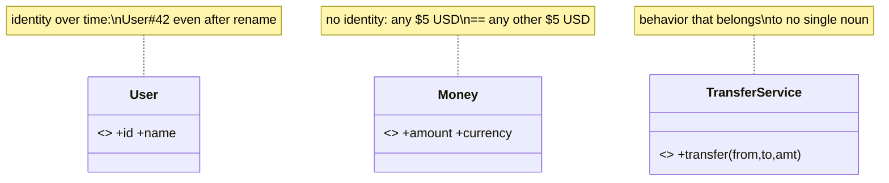
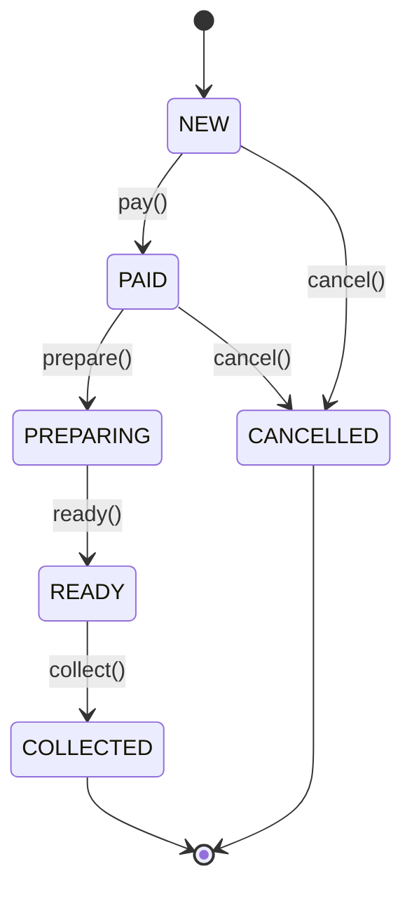
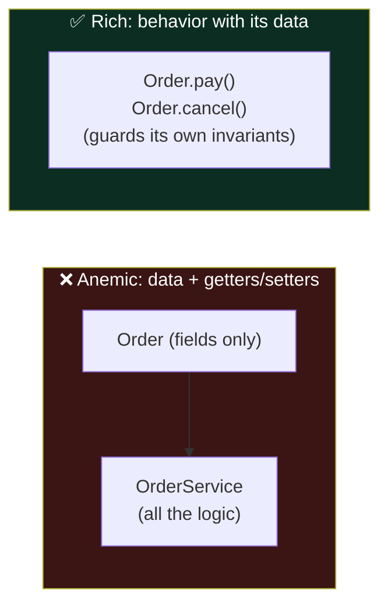
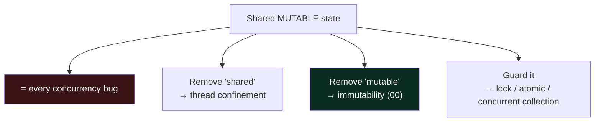
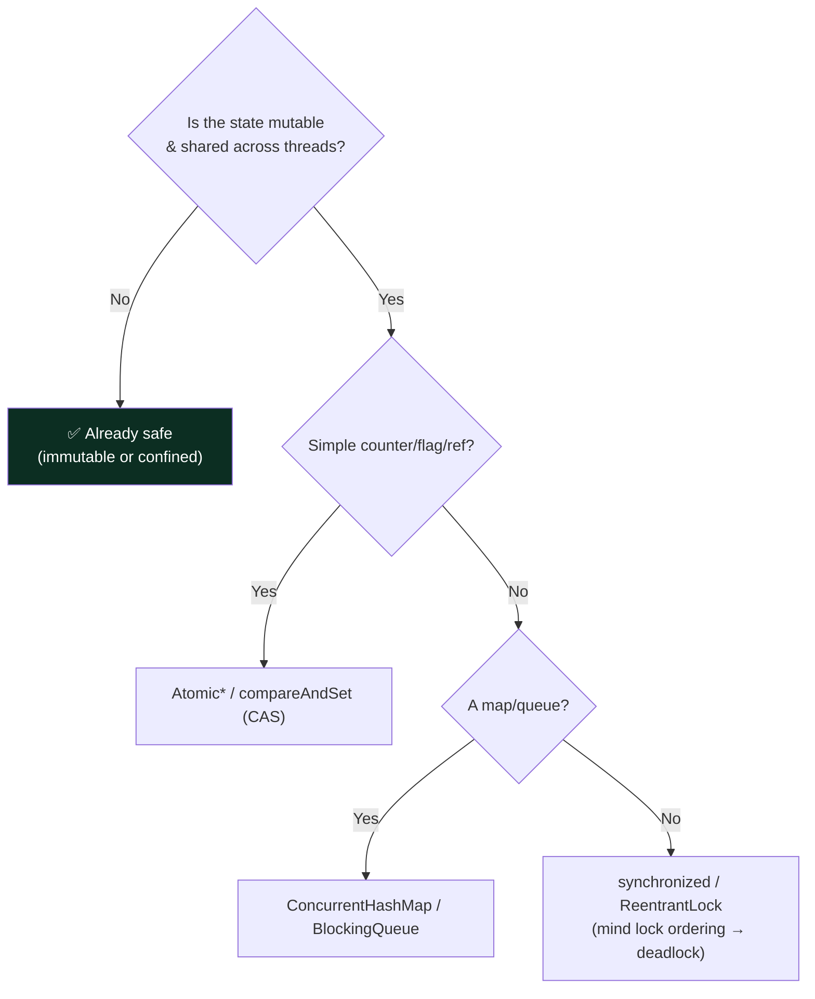

# 04 — Domain Modeling & Concurrency · Teaching Notes

> Read with the [syllabus](README.md). Two skills that separate people who *code a feature* from
> people who *model a problem* so the code almost writes itself — and stays correct under threads.
> 🎬 [Order state machine](visualizations/order-state-machine.html) · 🎬 [Race condition](visualizations/seat-booking-race.html)

---

## Part A — Domain Modeling

### Entity vs. Value Object vs. Service

| | Identity? | Mutable? | Equality |
|---|---|---|---|
| **Entity** | yes (an id) | usually | by id |
| **Value Object** | no | never (immutable) | by all fields |
| **Service** | n/a | stateless | n/a |

### Make illegal states unrepresentable

> A junior scatters `if (order.getStatus() == PAID)` checks everywhere. A principal designs the
> `Order` so `collect()` on a NEW order simply **cannot succeed** — the invalid transition throws (or,
> better, doesn't even compile with sealed state types). The wrong code becomes unwritable; the right
> code reads like the domain expert talking.

### Anemic vs. Rich model

**Behavior lives with the data it guards.** An aggregate root (e.g. `Order`) owns its invariants and
is the only door through which its parts change.

---

## Part B — Concurrency in object design

### The one rule

> **No shared mutable state, no concurrency bug.** Immutability is the first-line defense — an
> immutable value is free to share across threads. (See the [race animation](visualizations/seat-booking-race.html):
> check-then-act without a guard double-books a seat; an atomic compare-and-set fixes it.)

### Choosing the tool

Essentials to know: the Java Memory Model (visibility, `volatile`, happens-before — why a missing
`synchronized` causes "impossible" bugs), `ConcurrentHashMap`, `BlockingQueue`, `AtomicInteger`/CAS,
`ExecutorService`, `CompletableFuture`.

---

## The principal-level insight

**Thread-safety is a property of a design, not a keyword you sprinkle on later.** Bolting
`synchronized` onto a class never designed for sharing usually yields something both slow *and* still
wrong. Principals decide the strategy at design time — "this is immutable so it's free to share,"
"this is confined to one thread," "this is the single synchronized choke point" — and **write the
policy down**. The cheapest concurrent object is the one with no mutable state to protect.

## Interview lens

"Is this thread-safe?" and "two users do X at the same time — what happens?" are standard probes
(rate limiters, in-memory stores, seat booking). Stating your strategy unprompted — "the store is a
`ConcurrentHashMap`, the counter is an `AtomicInteger`, entities are immutable so they're safe to
share" — is a strong seniority signal. Good modeling early makes the rest of the round faster.

---

## Now do the drill

[`src/`](src/) — an `Order` whose transition methods don't guard their state, so illegal transitions
(collect before pay, pay twice) silently succeed. Add the guards so invalid transitions throw —
making illegal states unreachable. [`src/README.md`](src/README.md).

> Next → [`05` Machine Coding](../05-machine-coding/): put it all under the clock.

## What I learned
<!-- one force you now get, one mistake, one thing you'd do differently -->
- _force:_
- _mistake:_
- _next time:_
