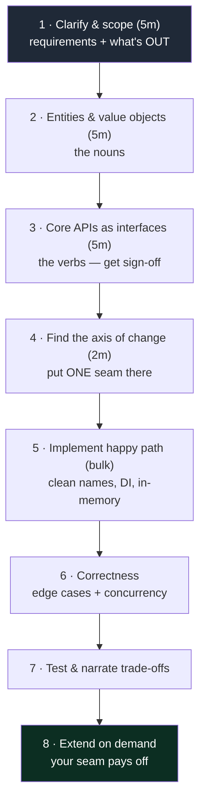
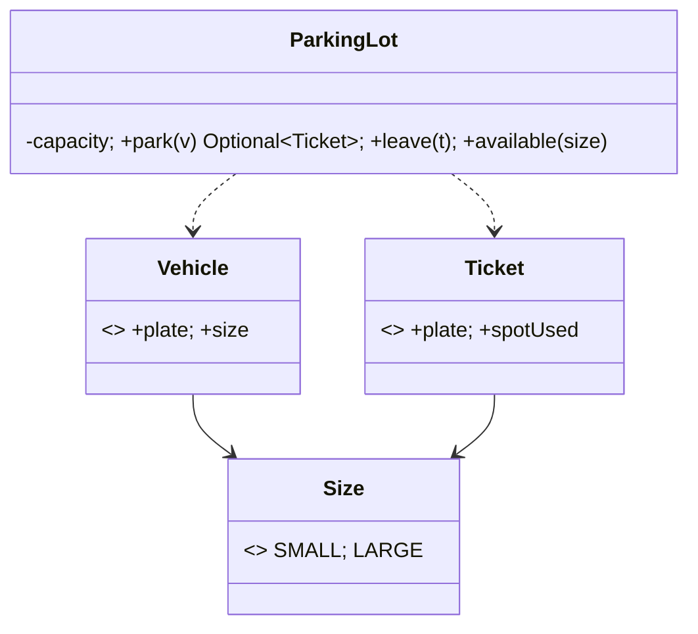
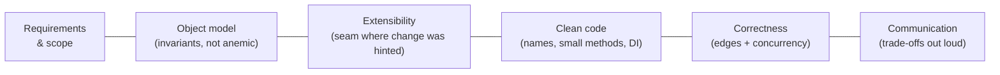

# 05 — Machine Coding · Teaching Notes

> Read with the [syllabus](README.md). The goal is a **repeatable method**, not memorized solutions —
> interviewers defeat memorization with "now add X." 🎬 [Timed practice coach](visualizations/machine-coding-coach.html)

---

## The method as a flow (memorize THIS, not the answers)

> Working > complete. A running 70% beats an elegant 0%.

---

## Worked example: modeling a Parking Lot (the `src/` drill)

Step 2 — the nouns become a small, honest object model:

Step 4 — where's the **axis of change** an interviewer will push on? *Spot-allocation policy* and
*pricing*. So those are the seams you'd make interfaces (`SpotAllocator`, `PricingStrategy`) — and you
keep everything else concrete. When they say "now charge differently for EVs," you add a strategy, not
a rewrite. (The drill keeps it to two sizes so it's solvable in one sitting; the seam idea is the lesson.)

---

## The scoring rubric (grade every rep)

Score each 1–5 and log the trend in `notes.md` — the slope is your real progress.

---

## Curriculum (one per ~2 days; compare to a reference after)

Parking Lot · Vending Machine · Elevator · LRU/LFU Cache · Rate Limiter · Logging library · Splitwise ·
Tic-Tac-Toe→Chess · BookMyShow (seat locking) · Notification service · Snake & Ladder · Stack Overflow.
(Full list + per-problem notes in the [syllabus](README.md).)

---

## The principal-level insight

**Under time pressure, restraint scores higher than cleverness.** People fail by *over-building* —
five patterns and three layers for a problem needing two clean classes and one interface. A
principal-level performance is *boringly clear*: obvious entities, one well-placed seam where the
interviewer hinted growth, clean names, a running program — with the trade-offs spoken aloud. They're
hiring the person they'd trust to make these calls unsupervised; legibility of *reasoning* beats volume
of *code*.

## Interview lens

Narrate constantly: "I'll make pricing a strategy because you hinted it'll vary; I'm keeping spots
concrete to stay simple; in-memory store for now, swappable behind this interface later." That running
commentary is most of the score.

---

## Now do the drill

[`src/`](src/) — a Parking Lot starter kit. Implement `park()` and `leave()` so vehicles get a fitting
spot (small cars overflow into large spots; large vehicles need large spots), the lot reports full
correctly, and leaving frees the spot. [`src/README.md`](src/README.md). Then practice a fresh problem
against the [timed coach](visualizations/machine-coding-coach.html).

> Next → [`06` Principal Skills](../06-principal-skills/).

## What I learned
<!-- one force you now get, one mistake, one thing you'd do differently -->
- _force:_
- _mistake:_
- _next time:_
