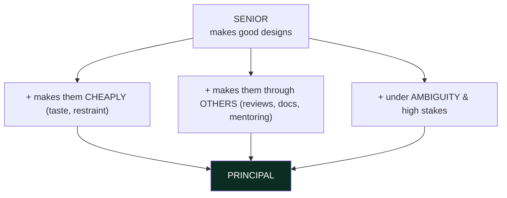
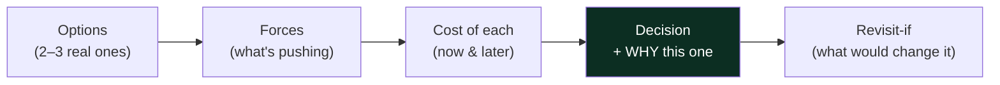
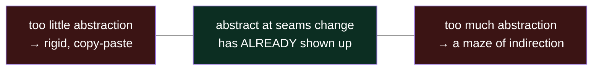
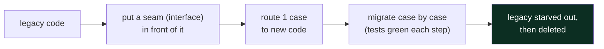

# 06 — Principal Skills · Teaching Notes

> Read with the [syllabus](README.md). Everything before this gets you to *strong senior*. This is
> the difference between that and **principal** — and it's the part you can't finish in 12 weeks.
> 🎬 [The abstraction sweet spot](visualizations/abstraction-sweet-spot.html)

---

## What actually separates principal from senior

The code is table stakes. The differentiators are *judgment* and *influence*.

---

## Trade-off articulation — the #1 visible principal trait

For any non-trivial decision, say this out loud (and write it in the design doc):

> "It depends" is only senior if you immediately say *on what*. Naming the thing it depends on, and
> the cost of being wrong, is the principal move.

## Designing for the change you can't see (without over-engineering)

Both ends are expensive (see the [animation](visualizations/abstraction-sweet-spot.html)). Live in the
**YAGNI ↔ OCP tension**: duplicate until it hurts, then unify; add the seam when the *second* reason
to change actually arrives, not when you imagine it might.

## Evolving a design without a rewrite — the strangler fig

Principals rarely get greenfield. They improve the *running* thing in small, safe, reversible steps —
backward-compatible API changes, feature flags, migrate-then-delete. A big-bang rewrite is usually the
junior instinct.

---

## Multiplying others (impact measured through the team)

- **Design reviews** — review the *design* (doc/diagram) before code exists, when changes are free.
  Ask the one question that surfaces the hidden assumption; don't nitpick syntax.
- **Design docs / ADRs** — a short, durable record: problem, constraints, options, decision, consequences,
  risks. (Template in [`src/design-doc-template.md`](src/design-doc-template.md).) The doc that prevents
  ten future mistakes is worth more than the cleverest patch.
- **Mentoring & patterns** — set the convention the team adopts; leave code better-named than you found it.

> **Knowing when to stop** is also a principal skill — recognizing "good enough," shipping, and not
> gold-plating. Taste includes restraint.

---

## The principal-level insight

**Your job stops being "write the best code" and becomes "make the best decision *legible and durable*
for everyone who comes after."** A brilliant design only you understand is a liability; a
slightly-less-clever design the whole team can safely evolve is worth more. The compounding skill is
**taste** — the fast, mostly-right intuition for "too much abstraction / wrong seam / this will hurt in
six months" — and taste is *only* built by the build → feedback → articulate loop run hundreds of times
on real, consequential code. No shortcut around the reps; only making each rep count more by always
articulating the *why*.

## Interview lens

Staff/principal interviews are won on *reasoning*, not code volume. Narrate trade-offs, ask what'll
change, name what you're deliberately NOT doing and why, and connect the class-level call to system and
business impact. Every habit on this page is exactly what those rounds probe — and what makes you good
at the actual job.

---

## Now do the drill (judgment, not compiling)

[`src/`](src/) — two parts:
1. **Critique the over-engineering**: `OverEngineeredGreeter.java` solves a trivial task with 6 classes,
   a factory, and a registry. `GreetingDemo` proves a 5-line `SimpleGreeter` does the same thing. Count
   the abstractions; write down what force (if any) would ever justify them.
2. **Write a design doc** for something you're actually building, using [`src/design-doc-template.md`](src/design-doc-template.md),
   and have someone poke holes in it.

> This is the end of the linear track and the start of the real work. Loop `00`–`05` on real projects;
> let this section accrete notes for the rest of your career.

## What I learned
<!-- one judgment you sharpened, one over-engineering you caught, one trade-off you can now articulate -->
- _judgment:_
- _caught:_
- _articulate:_
