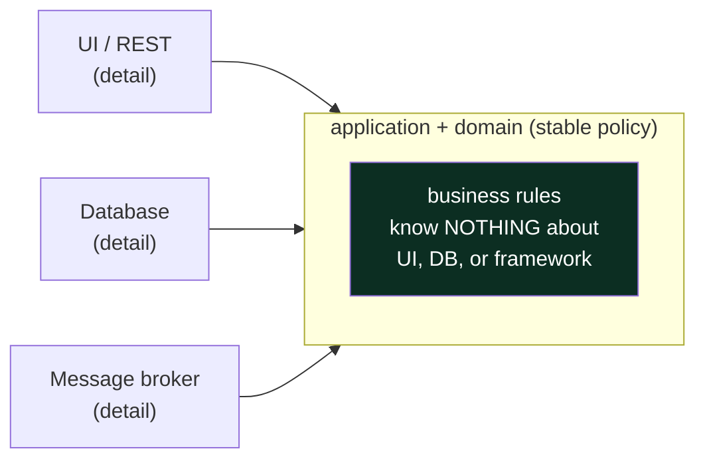
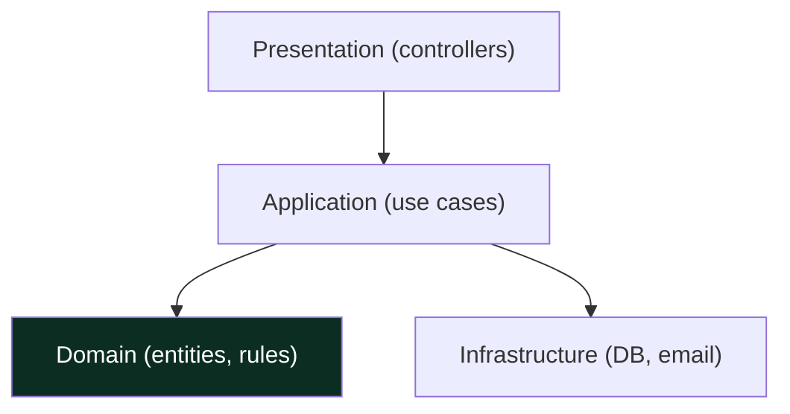
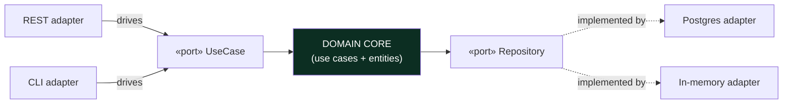
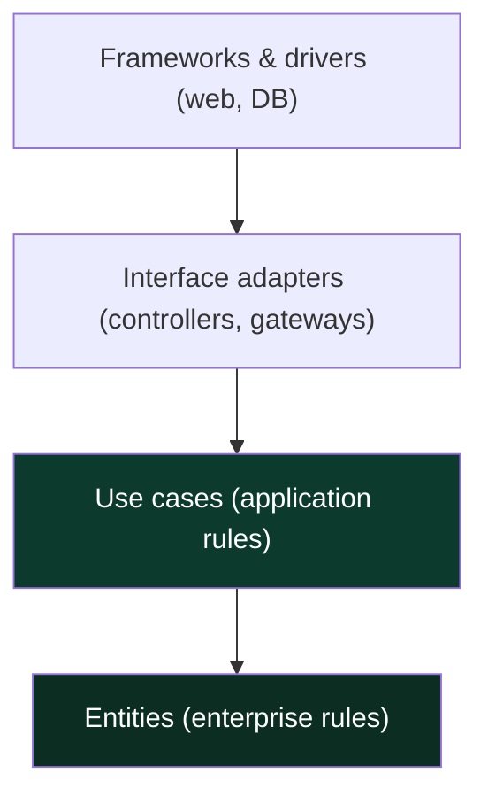
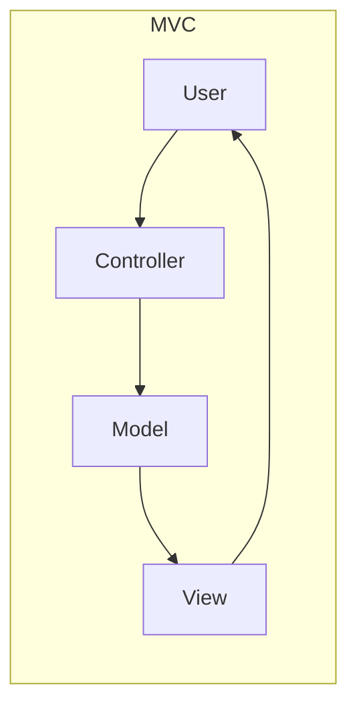
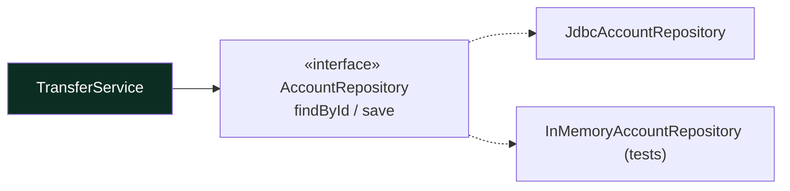
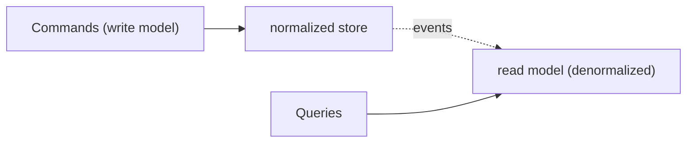
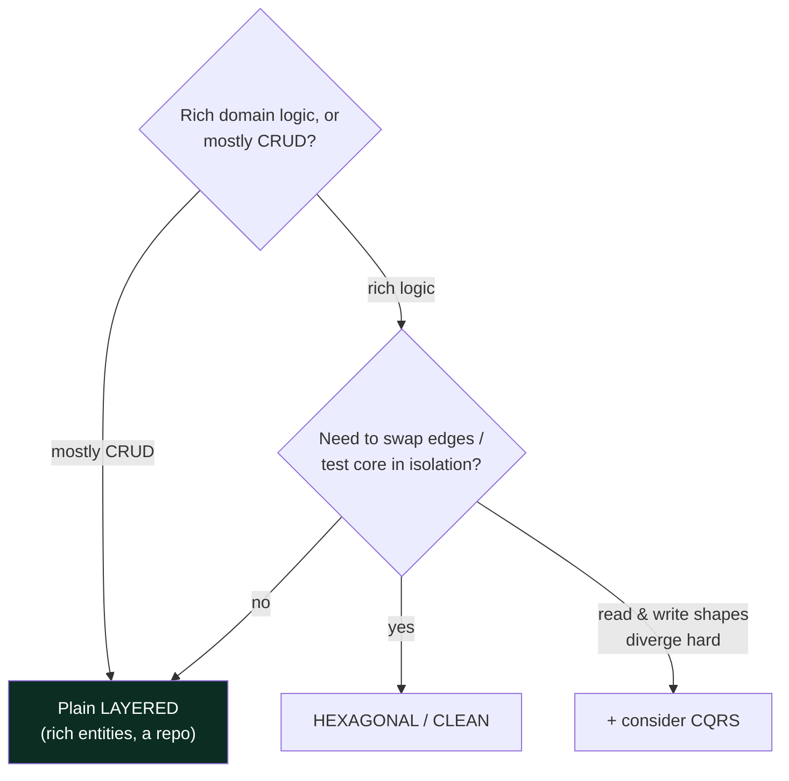

# 07 — Architectural Patterns · Teaching Notes

> Read with the [syllabus](README.md). One idea unifies almost everything here — **the Dependency
> Rule** — so learn that first and the rest are variations. 🎬 [Hexagonal / Ports & Adapters](visualizations/hexagonal-architecture.html)

---

## The one idea: the Dependency Rule

**Source-code dependencies point inward, toward stable business policy.** The domain must not import
the database driver, the web framework, or the message broker — those are *details* that should be
swappable late. You cross a boundary inward-to-outward only through an interface the inner layer owns
(DIP from `01`). Hexagonal, Clean, and Onion are all just three drawings of this single rule.

---

## Layered / N-tier — the default

Fine for most CRUD apps. **Traps:** (1) *leaky layers* — presentation reaching straight into the DB,
skipping the domain; (2) an *anemic domain* (`04`) where all logic puddles in the "service" layer and
the entities are just bags of getters. Plain layering with a rich domain handles a surprising amount.

---

## Hexagonal / Ports & Adapters  🎬 [animation](visualizations/hexagonal-architecture.html)

- **Ports** are interfaces the core *owns*. **Adapters** implement/consume them at the edges.
- **Driving side** (left): things that call the app — REST, CLI, tests.
- **Driven side** (right): things the app calls — DB, queue, email.
- Swap Postgres for an in-memory adapter and **the core doesn't change**. That's the whole point — and
  it's exactly the [`src/` drill](src/).

## Clean / Onion — the same rule, concentric

Inner circles know nothing of outer ones. `Entities` are the most stable; `frameworks` the most
disposable. If you've understood Hexagonal, you already understand this — it's the same dependency
arrows drawn as rings.

---

## UI separation: MVC / MVP / MVVM

| | View knows | Glue | Fits |
|---|---|---|---|
| **MVC** | the model | controller routes input | web servers (Spring MVC) |
| **MVP** | only the presenter | presenter holds UI logic | classic desktop/Android |
| **MVVM** | binds to a view-model | data binding | reactive UIs (JavaFX, Compose) |

> Same goal as everything else: keep rendering separate from logic so each changes independently.

## Repository (+ Unit of Work)

A collection-like seam over storage. The domain says "give me account 42," not "run this SQL." It's the
*driven port* of Hexagonal. **Trap:** a repository that just forwards to an ORM that's already a
repository — don't add a layer that only delegates.

## CQRS & in-process events (use sparingly)

**CQRS** splits the write model from the read model — powerful when their shapes genuinely diverge
(complex writes, high-read dashboards), pure overhead when they don't. **In-process events** (a domain
raises an event, handlers react) decouple modules inside one app. The moment those events cross a
process boundary, you're in **HLD** territory (brokers, delivery guarantees, ordering).

---

## Choosing — the decision that matters most

---

## The principal-level insight

**Architecture is the decisions that are expensive to reverse — so contain and defer them rather than
pick the fanciest one.** The Dependency Rule keeps the DB/framework/broker as late, swappable details.
But the `06` restraint applies with *more* force here: hexagonal + CQRS + event-sourcing on a CRUD app
is over-engineering at maximum blast radius. Senior asks "which pattern?"; **principal asks "does this
domain's complexity justify *any* ceremony beyond plain layering?"** Usually not.

## Interview lens

"How would you structure this service?" → lead with the Dependency Rule, then *justify the ceremony
level for the domain's complexity*. Follow-ups ("swap Postgres for Dynamo", "add a Kafka consumer") are
softballs for a ports-and-adapters answer: "new adapter, core untouched." Naming the HLD boundary
("inside the service, hexagonal; across services, a separate distributed decision") shows range.

---

## Now do the drill

[`src/`](src/) — a `TransferService` that depends only on an `AccountRepository` **port**. Implement
the transfer so it works against the in-memory **adapter** the test injects — proving the domain core
has zero knowledge of any concrete database. [`src/README.md`](src/README.md), then play with the
[Hexagonal animation](visualizations/hexagonal-architecture.html).

> This section bridges to the `HLD/` track — where the *inter-process* architecture lives.

## What I learned
<!-- one architecture you can now justify, one you'd refuse as overkill, one boundary you can articulate -->
- _can justify:_
- _would refuse:_
- _boundary:_
