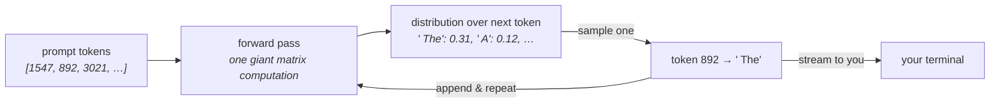
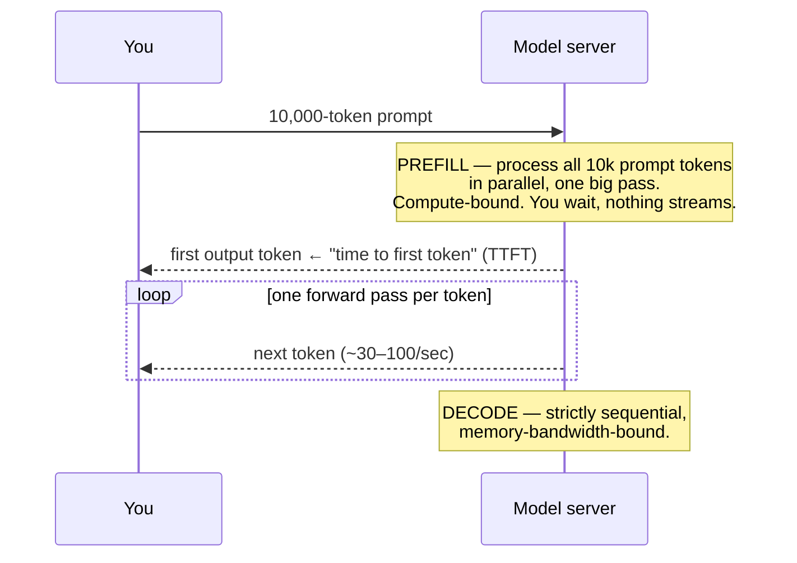

# 01 · Tokens, Transformers & Why Context Is Expensive

> What actually happens between hitting enter and the first streamed token — tokenization, prefill,
> decode — and why *everything* in this field (cost, latency, context limits, even the famous
> "how many r's in strawberry" failure) falls out of that pipeline. This is the mental model the
> entire track rests on.
> [← Part 0 · How LLMs Work](README.md) · next: 02 · Sampling

> **Predict first (2 min).** Write your guesses: (1) When you send a 10,000-word prompt, does the
> model read it word by word? (2) Why can a model that writes flawless code miscount the r's in
> "strawberry"? (3) You send a huge prompt and want a one-word answer — is the wait before the
> *first* token long or short, and why?

---

## The model is a next-token function

Strip away the chat UI and an LLM is one function, applied in a loop:

```
f(sequence of tokens so far) → probability distribution over the next token
```

That's it. It doesn't "look things up," doesn't run logic, doesn't know it's in a conversation.
One call to `f` is a **forward pass** through the network; it returns a score for *every token in
the vocabulary* (~50k–200k possible tokens), which becomes a probability distribution. One token
gets picked (how it's picked is [Chapter 02](README.md)), appended to the sequence, and `f` runs
again — until the model emits a stop token or hits your `max_tokens`.



Hold this loop in your head and half the field's folklore collapses into consequences:

- **"Hallucination" isn't a bug in a lookup — there is no lookup.** The model always does the same
  thing: emit the most plausible continuation. When the plausible continuation happens to be true,
  we call it knowledge; when it isn't, we call it hallucination. Same mechanism. This is *why*
  Part 3 grounds answers in retrieved documents instead of asking nicely for accuracy.
- **Output is priced and timed per token** because each output token is a *separate* forward pass.
- **The model can't "go back and revise"** within one response — the loop only appends. (Reasoning
  models spend extra tokens *thinking forward* instead.)

---

## Tokens: the unit of everything

The model never sees characters or words. A **tokenizer** (byte-pair encoding, BPE) splits text
into tokens — common chunks learned from data — and maps each to an integer ID. Everything
downstream (cost, latency, context limits, rate limits) is denominated in these.

Real tokenizations (Claude's tokenizer; exact splits vary by model, shapes don't):

| Text | Tokens (approx.) | Count | Note |
|---|---|---|---|
| `the` | `the` | 1 | common word = 1 token |
| `strawberry` | `str` · `aw` · `berry` | 3 | *the model never sees the letters* |
| `Divisions Inc. HVAC ticket` | `Div` · `isions` · ` Inc` · `.` · ` HV` · `AC` · ` ticket` | 7 | rare words fragment |
| `{"urgency": "high"}` | `{"` · `urgency` · `":` · ` "` · `high` · `"}` | 6 | JSON syntax costs real tokens |
| `2026-07-12T09:30:00Z` | ~9 tokens | 9 | timestamps are expensive |
| A 500-word email | — | ~650 | English ≈ **¾ word/token**, ~4 chars/token |

Now your prediction #2 answers itself: asked to count the r's in "strawberry," the model sees
`[str][aw][berry]` — three opaque IDs, no letters anywhere. Counting characters means recalling
spellings it was never directly shown. Meanwhile writing flawless code is *easy* for it — code is
just next-token prediction over patterns it's seen millions of times. **Weird failures at things
"a child can do" are usually tokenization artifacts, not intelligence gaps.** (Same root cause:
arithmetic on long numbers, rhyming, character-level wordplay.)

Engineering consequences you'll use every week:

- **~4 characters ≈ 1 token** in English prose (worse for code, JSON, other languages, IDs). Good
  enough for budget math; exact counts come free in every API response's `usage` field.
- **Verbose JSON schemas, long field names, and repeated boilerplate are money.** `"customer_reported_urgency_level"` costs ~6 tokens *every time it appears in every request*.
- **A "128k context window" is a token budget** shared by *everything*: system prompt + conversation
  history + retrieved documents + tool definitions + tool results + the output. Context is a
  budget you'll learn to defend token by token (Chapter 18).

---

## Prefill vs decode: where latency lives

Your prediction #3. Processing a request has two phases with *completely different* performance
characters — and knowing the split lets you read any latency problem:



- **Prefill** ingests the whole prompt in one parallel pass. Bigger prompt → longer prefill →
  longer **time to first token**. So yes: huge prompt + one-word answer = you wait for the first
  token, then it's instantly done.
- **Decode** generates output one token per forward pass, strictly sequentially. Output length
  linearly sets generation time — a 1,500-token answer at ~50 tok/s is **30 seconds** no matter
  how clever your infrastructure is.

The two levers this hands you immediately (both get full chapters):

| Symptom | Phase | Lever |
|---|---|---|
| Slow to *start* responding | prefill | shrink the prompt; **prompt caching** (Ch. 09) skips re-prefilling an unchanged prefix |
| Slow to *finish* | decode | ask for less output; **streaming** (Ch. 08) so users watch progress; smaller/faster model |

---

## Why long context is expensive: attention

Inside each forward pass, the mechanism that made transformers win is **attention**: every token's
representation is computed by looking at *every token before it*. That's the magic — token 8,000
can directly use token 12 ("the `customerId` defined at the top of the file") with nothing lost in
between. It's also the bill:

- **Prefill cost grows roughly with the *square* of prompt length** — every token attends to every
  earlier token. 10× the prompt ≈ up to 100× the attention work. (Providers optimize hard, but the
  shape survives.)
- **During decode, the model keeps a "KV cache"** — the attention state for everything so far — so
  each new token only computes *its own* attention against the cache instead of redoing the whole
  prompt. That cache is large and lives in scarce GPU memory, which is why long-context requests
  cost more and why providers can bill cached-prefix tokens ~10× cheaper (Ch. 09): the expensive
  part is *building* the state; reusing it is cheap.

This is the physics behind a rule you'll apply constantly: **"just stuff everything into the
context" is a real strategy with a real price** — in dollars (per request, forever), in TTFT, and
(Ch. 18) in degraded attention quality on very long contexts. RAG (Part 3), tool-based retrieval
(Part 4), and compaction (Ch. 18) all exist to spend that budget better.

---

## The cost model: worked example

The track's running project — the support-ticket assistant — at plausible Sonnet-class prices
(**$3 / MTok input, $15 / MTok output**; *always* re-check the live pricing page):

| Component | Tokens |
|---|---|
| System prompt (instructions + examples + tool defs) | 2,000 |
| Customer email | 650 |
| Output (JSON classification + draft reply) | 400 |

```
input:   2,650 tok × $3 / 1,000,000  = $0.00795
output:    400 tok × $15 / 1,000,000 = $0.00600
                          per ticket ≈ $0.014
× 100,000 tickets/month              ≈ $1,400/month
```

Three things this little table teaches, which senior people check *first* and juniors never check:

1. **Output tokens are ~5× the price of input** — and slower too (sequential decode). "Make the
   model brief" is a cost *and* latency optimization.
2. **The static 2,000-token system prompt is 75% of the input bill.** It's identical on every
   call — prompt caching (Ch. 09) cuts its cost ~90% and its prefill time with one design change.
3. **A per-request cost of "basically nothing" × volume is a real number.** At 100k/month this
   feature costs more than the intern. Now re-run the math with a 20-turn agent loop where each
   turn re-sends the growing conversation… (that cliff is Chapter 18's opening problem).

---

## Prove it (30–45 min, do today)

Every claim above is checkable against the live API. Don't believe; call.

1. **Token counts.** Send five texts (a sentence, a code snippet, a JSON blob, a timestamp-heavy
   log line, non-English text) and read `usage.input_tokens` from each response. Check the
   ~4-chars/token rule and find which text breaks it worst.
2. **The strawberry test.** Ask a small, non-reasoning model to count letters in 5 words. Then ask
   it to *first spell the word letter by letter, then count*. Explain, in tokenizer terms, why the
   second one works. (You just discovered why "think step by step" isn't a magic phrase — it
   changes what sequence the model conditions on.)
3. **Feel prefill vs decode.** Time two streamed requests: (a) ~8k-token prompt → one-word answer,
   (b) one-line prompt → ~800-token answer. Record TTFT and total time for each. Which phase
   dominated which?
4. **The one-sentence reconciliation** (the habit): *"I predicted X, the API showed Y, because Z."*

---

## Self-Check (close the doc, answer out loud)

1. Walk the full path from hitting enter to the first streamed token — tokenization, prefill,
   decode — and say which phase TTFT measures.
2. Why is prefill parallel but decode sequential? What does each mean for latency, and which lever
   fixes which?
3. Explain the strawberry failure to a PM in two sentences, without the word "dumb."
4. Your prompt is 12k tokens, output is 200. Where does the money go, where does the time go, and
   what's the single highest-leverage optimization?
5. Why does "the model hallucinated" and "the model answered correctly" describe the *same
   mechanism*? What follows for how you build trustworthy systems (hint: Part 2 and Part 3)?
6. A teammate proposes putting all 400 help-center articles (~300k tokens) in every prompt
   "since the context window fits it." Give the three-part case against — dollars, TTFT, attention
   quality — with rough numbers.
