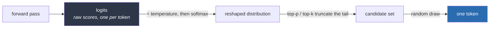

# 02 · Sampling: Temperature, Top-p & Why Outputs Vary

> The model hands you a *probability distribution*, not an answer. Turning that distribution into
> one token is **sampling** — and it's where determinism, "creativity," and half your reproducibility
> headaches come from. This chapter is why the same prompt gives different answers, what the knobs
> actually do, and why `temperature=0` still isn't a promise.
> [← Part 0 · How LLMs Work](README.md) · prev: 01 · Tokens · next: 03 · Embeddings

> **Predict first (2 min).** Write your guesses: (1) You set `temperature=0` and send the identical
> prompt twice. Same output, guaranteed? (2) What does temperature physically change about the
> numbers the model produced? (3) For extracting a JSON field from an email, what temperature do you
> want — and for brainstorming ad slogans?

---

## Where we left off: a distribution, not a token

Chapter 01's loop ended each forward pass with *a probability distribution over every token in the
vocabulary*. That's the model's entire output. Picking one token from that distribution is a
**separate step your settings control** — the model doesn't decide; the sampler does.

Concretely, after one forward pass on `"The support ticket is"` the model might produce:

| Token | Probability |
|---|---|
| ` about` | 0.42 |
| ` regarding` | 0.18 |
| ` a` | 0.15 |
| ` urgent` | 0.09 |
| ` closed` | 0.06 |
| …(50k more) | …tiny |

**Sampling** is the rule that turns this table into one choice. The two knobs you'll actually
touch — `temperature` and `top_p` — reshape or truncate this table before the pick.

---

## The raw numbers: logits → softmax → probabilities

Before probabilities there are **logits** — raw, unbounded scores, one per vocabulary token. A
function called **softmax** squashes them into a probability distribution (all positive, sums to
1). Temperature is a dial *inside* softmax:

```
probability(token) ∝ exp(logit / temperature)
```

- **`temperature = 1`** — use the distribution as the model produced it.
- **`temperature → 0`** — divide by a tiny number → the largest logit dominates completely →
  distribution collapses to "always pick the top token." This is **greedy decoding**.
- **`temperature > 1`** — flatten the distribution → unlikely tokens get a real shot → more
  surprising (and more error-prone) output.

Same logits as above, reshaped by temperature:

| Token | T = 0 (greedy) | T = 0.7 | T = 1.5 |
|---|---|---|---|
| ` about` | **1.00** | 0.55 | 0.30 |
| ` regarding` | 0.00 | 0.20 | 0.19 |
| ` a` | 0.00 | 0.15 | 0.17 |
| ` urgent` | 0.00 | 0.06 | 0.13 |
| ` closed` | 0.00 | 0.04 | 0.11 |

Answering prediction #2: **temperature doesn't change what the model "thinks"** — the logits are
fixed by the prompt. It changes *how sharply* you favor the model's top choice when you gamble.



## Top-p (nucleus) and top-k: truncating the tail

Temperature reshapes the *whole* distribution; the tail of 50,000 near-zero tokens still has a
combined non-trivial probability of producing garbage. **Top-p** and **top-k** cut the tail off
*before* sampling:

- **top-k = 20** — keep only the 20 highest-probability tokens, renormalize, sample from those.
- **top-p = 0.9** (nucleus) — keep the smallest set of top tokens whose probabilities *sum to
  0.9*, drop the rest. Adaptive: a confident distribution keeps 2 tokens, an uncertain one keeps 40.

In practice you usually tune **one** of temperature or top-p, not both. Temperature is the one you
reach for; leave top-p at its default unless you have a specific reason.

---

## Why `temperature = 0` still isn't deterministic

Prediction #1 — the one most people get wrong. `temperature = 0` makes the *sampling* step
deterministic (always take the top token). It does **not** make the *whole system* deterministic.
Sources of variation that survive `temperature = 0`:

1. **Floating-point non-associativity on GPUs.** `(a + b) + c ≠ a + (b + c)` in floating point.
   Massively parallel GPU math sums things in nondeterministic order, so two logits that are
   *nearly tied* can swap which is #1 between runs. One different token early cascades into a
   totally different continuation.
2. **Batching effects.** Your request is batched with others on the server; batch composition
   changes the numerics, hence occasionally the argmax.
3. **The model/infra changed under you.** Providers update model versions, quantization, and
   routing. "Same model name" ≠ "same weights forever."
4. **Any nonzero temperature at all** reintroduces genuine randomness (and there's no `seed`
   guarantee across most hosted APIs even when a seed param exists).

**The engineering takeaway — the one that matters for the whole track:** *treat every LLM call as
non-deterministic and design around pass **rates**, not passes.* This is precisely why you can't
"test" an LLM feature by running it once and eyeballing it (the trap Chapter 10's evals fix), and
why "it worked when I tried it" is not evidence.

---

## Choosing temperature: the practical table

Prediction #3, generalized. Match temperature to the *shape of the task*:

| Task | Temperature | Why |
|---|---|---|
| Extraction / classification (the ticket's `category`, `urgency`) | **0** | One correct answer exists; you want the model's single best guess, every time |
| Structured JSON output | **0** | Format must be exact; creativity is pure risk |
| Tool/function calling & agent decisions | **0** | You want the most reliable action choice, reproducibly |
| RAG answers grounded in docs | **0–0.3** | Mostly faithful, a touch of phrasing freedom |
| Summarization, rewriting | **0.3–0.7** | Some fluency latitude, still anchored to source |
| Brainstorming, marketing copy, naming | **0.7–1.0** | You *want* variety; you'll pick from several |
| "Give me 10 different options" | **0.8–1.0** + sample multiple | Diversity is the goal |

Rule of thumb: **default to 0 for anything with a right answer; raise it only when variety is the
feature, not the bug.** Most production agentic systems run at or near 0 — surprising to beginners
who assume "AI = creative."

> **A trap:** high temperature does *not* make the model smarter or more thorough — it makes it
> less predictable. If an answer is wrong at T=0, raising temperature just gives you *differently*
> wrong answers. Fix the prompt or the context, not the temperature.

---

## A real use of controlled randomness: self-consistency

Non-determinism isn't only a liability — it's a tool. **Self-consistency**: for a hard reasoning
question, sample N answers at moderate temperature (say T=0.7, N=5) and take the majority vote. The
*independent* errors tend to scatter while the correct answer clusters. You spend 5× the tokens to
buy accuracy — a real, measurable trade you'll evaluate in Part 2. (It also foreshadows why
multi-sample verification shows up all over agent design.)

---

## Prove it (30 min)

1. **Variance sweep.** Send the identical prompt (*"Name a color."* then something open-ended like
   *"Write a one-sentence product tagline for a coffee brand."*) 10 times each at T=0, 0.7, 1.3.
   Count distinct outputs at each setting. Chart it. You'll see T=0 nearly (not perfectly!)
   constant and T=1.3 all over the map.
2. **Catch non-determinism at T=0.** Run a *longer* T=0 generation (a 200-token answer to an
   ambiguous prompt) ~20 times. Look for the run(s) that diverge. When you find one, you've caught
   floating-point/batching non-determinism in the wild — note where the first differing token was.
3. **Temperature ≠ intelligence.** Take a question your small model gets *wrong* at T=0. Run it 10×
   at T=1.0. Confirm you get variety but not correctness. Write the one-sentence lesson.
4. **Reconcile:** *"I predicted X, the API showed Y, because Z."*

---

## Self-Check (close the doc, answer out loud)

1. The model's raw output isn't a token — what is it, and what step turns it into one?
2. What does temperature do to the logits, mechanically? Contrast T=0, T=0.7, T=1.5 on the same
   distribution.
3. Give two reasons `temperature=0` can still produce different outputs across identical requests.
   What's the design conclusion for how you test LLM features?
4. Difference between top-k and top-p, and why top-p is called "adaptive."
5. Pick temperatures for: extracting an invoice total; drafting 5 subject-line options; a
   tool-calling agent deciding which tool to use. Defend each in one phrase.
6. A teammate says "the agent picks the wrong tool sometimes, let's raise the temperature so it
   explores more." What's wrong with that reasoning, and what should they do instead?
