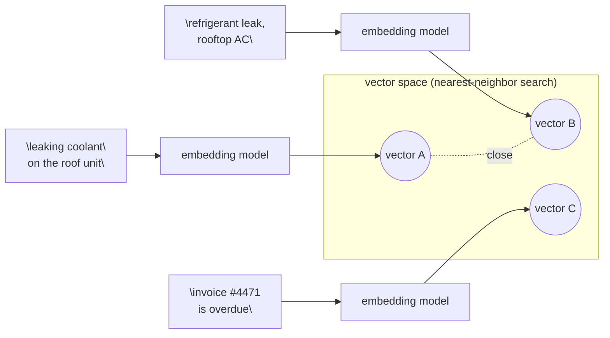

# 03 · Embeddings: Meaning as Vectors

> How text becomes a fixed-length list of numbers that captures *meaning*, why "distance" between
> two of those lists approximates "how related two ideas are," and where that trick quietly breaks
> (negation, exact IDs, antonyms) — the primitive every RAG and semantic-search system in Part 3
> is built on.
> [← Part 0 · How LLMs Work](README.md) · prev: 02 · Sampling · next: 04 · Context Windows, Pricing & the Cost Model

> **Predict first (2 min).** Write your guesses: (1) Are "I love this product" and "I hate this
> product" close together or far apart in embedding space? (2) Is the embedding model the same
> model that answers your chat prompts, or a different one? (3) If you embed `"order #48213"` and
> `"order #48214"`, are they close together or far apart?

---

## An embedding is text turned into a point in space

A chat model's forward pass (Chapter 01) produces a distribution over the *next token*. An
**embedding model** does something different: it consumes a whole piece of text and returns one
fixed-length vector of floats — a single point in a high-dimensional space, not a sequence of
anything.

```
embed("The HVAC unit on the third floor is leaking coolant.")
  → [0.0123, -0.0871, 0.0442, ..., 0.0038]   # e.g. 1536 numbers, always 1536
```

Every input — one word or ten pages — comes back as *the same length* vector (dimensionality is a
property of the model, not the input). That's the whole trick: two pieces of text that "mean similar
things" land at nearby points, and two that don't land far apart. Nothing is stored *about* the
text — the vector is a compressed geometric summary of it, positioned by everything the model saw
during training.



A and B, worded completely differently, land close together because they describe the same
situation. C lands far from both — different topic entirely. That's a nearest-neighbor search, and
it's the entire retrieval step of RAG (Chapter 12): embed the query, find the nearest stored
vectors, hand the matching text to the chat model.

---

## Embedding models are not chat models

This trips people up the first time: you do not send an embedding request to the same endpoint or
even necessarily the same provider as your chat completions. It's a different API call, a
different (usually much smaller and cheaper) model, and the response shape is just a vector, not
text:

```python
# Chat model: text in, text out, via messages.create()
response = client.messages.create(
    model="claude-sonnet-4-5",
    messages=[{"role": "user", "content": "Summarize this ticket."}],
)

# Embedding model: text in, a vector out — a different provider/endpoint
# (Anthropic does not currently serve first-party embeddings; common choices:
#  Voyage AI, OpenAI text-embedding-3, or an open-weight model run locally.)
response = voyage_client.embed(
    texts=["The HVAC unit on the third floor is leaking coolant."],
    model="voyage-3",
)
vector = response.embeddings[0]   # a list of ~1024 floats
```

**Why this matters engineering-wise:** an embedding call is stateless, cheap, and cacheable per
document — you embed each help-center article *once* at ingestion time (Chapter 12), not on every
query. Only the user's query gets embedded live. Mixing up "which model embedded this" is a real
bug: vectors from two different embedding models are **not comparable** — they don't share a
coordinate system, so cosine similarity between them is meaningless. If you switch embedding
models, you must re-embed your entire corpus.

---

## Cosine similarity: measuring "close" without caring about length

The standard way to compare two embedding vectors isn't Euclidean distance — it's **cosine
similarity**: the cosine of the angle between them, ignoring their magnitude. Two vectors pointing
the same direction score 1.0 (identical meaning), perpendicular vectors score 0.0 (unrelated), and
opposite directions score -1.0.

```
cosine_similarity(A, B) = (A · B) / (‖A‖ × ‖B‖)
```

Worked example with toy 2D vectors (real embeddings are hundreds to thousands of dimensions, but
the arithmetic is identical — this is exactly what a nearest-neighbor search does per dimension):

```
A = "leaking coolant"     = [0.80, 0.60]
B = "refrigerant leak"    = [0.75, 0.66]
C = "invoice overdue"     = [0.10, -0.99]

A · B = (0.80 × 0.75) + (0.60 × 0.66) = 0.60 + 0.396 = 0.996
‖A‖ = sqrt(0.80² + 0.60²) = sqrt(0.64 + 0.36) = sqrt(1.00) = 1.00
‖B‖ = sqrt(0.75² + 0.66²) = sqrt(0.5625 + 0.4356) = sqrt(0.9981) ≈ 0.999

cosine(A, B) = 0.996 / (1.00 × 0.999) ≈ 0.997   ← nearly identical direction

A · C = (0.80 × 0.10) + (0.60 × -0.99) = 0.08 - 0.594 = -0.514
‖C‖ = sqrt(0.10² + 0.99²) = sqrt(0.01 + 0.9801) ≈ 0.995

cosine(A, C) = -0.514 / (1.00 × 0.995) ≈ -0.517   ← pointing apart, unrelated
```

A and B (both about a coolant/refrigerant leak) score ~0.997 — near-parallel. A and C (leak vs.
invoice) score negative — pointing in different directions. This is the entire retrieval step in
one formula: embed the query, compute cosine similarity against every stored vector, return the
top-k highest scores.

**Why cosine, not raw distance?** Cosine similarity ignores vector *length*, only direction. A
short document and a long document discussing the same topic can still point the same direction
even if training gave the longer one a "bigger" vector — direction encodes meaning, magnitude often
just reflects text length or model quirks. That's also why embeddings are usually **normalized**
(scaled to length 1) before storage: once every vector has ‖v‖ = 1, cosine similarity collapses to
a plain dot product — much cheaper to compute at scale (Ch. HLD note below), with identical
results.

---

## Dimensionality: a budget, same as tokens

Embedding models emit a fixed dimensionality — common choices are 384, 768, 1024, 1536, or 3072
floats per vector. More dimensions capture finer-grained distinctions but cost more to store and
search:

| Dimensionality | Storage per vector (float32) | 1M documents |
|---|---|---|
| 384 | 1.5 KB | ~1.5 GB |
| 1536 | 6 KB | ~6 GB |
| 3072 | 12 KB | ~12 GB |

Some newer models (Matryoshka-style, e.g. OpenAI's `text-embedding-3`) let you *truncate* a large
vector to fewer dimensions and keep most of the quality — a direct cost/accuracy dial, same spirit
as choosing Haiku vs. Sonnet for a chat step. Pick the smallest dimensionality that clears your
retrieval-recall eval (Chapter 14) — this is a measured decision, not a default.

---

## Known failure modes — the reason Part 3 needs hybrid search

Embeddings approximate *topical* similarity from training data patterns. They are not logic, and
they fail in specific, predictable ways:

- **Negation is nearly invisible.** `"the printer is working"` and `"the printer is NOT working"`
  embed close together — both are about "printer" + "working," and the model has no reliable
  mechanism for "the word 'not' flips everything downstream of it" at the vector-similarity level.
  A support-ticket search for "AC not cooling" can retrieve articles about "AC cooling normally."
- **Exact identifiers look alike.** `"order #48213"` and `"order #48214"` differ by one character
  but embed almost identically — embeddings capture *semantic* pattern ("this is an order number"),
  not the specific digits. Ask it to distinguish two ticket IDs, two SKUs, two phone numbers by
  vector similarity alone, and it will not reliably. (Answers your prediction #3 — surprisingly
  close, not far apart.)
- **Antonyms cluster.** `"increase the budget"` and `"decrease the budget"` are both fluent
  sentences *about budgets*, so they land closer together than either does to an unrelated
  sentence — even though they mean opposite things.
- **Rare or made-up terms embed unreliably** — a coined internal product code with no training
  precedent gets placed based on surface tokens, not meaning, because there's no semantic pattern
  to draw on.

The fix used everywhere in production (Chapter 13) is **hybrid search**: combine vector similarity
(catches paraphrase and topical relevance) with **BM25 keyword/lexical search** (catches exact
strings — order numbers, error codes, negation words like "not" and "never") and fuse the two
rankings. Neither alone is enough; this is why "just use embeddings" is a rookie RAG mistake.

---

## Prove it (30–45 min, do today)

1. **Embed a small corpus.** Pick an embedding provider (Voyage AI, OpenAI, or a local
   `sentence-transformers` model if you want zero API cost) and embed ~20 sentences: mix support-
   ticket-style complaints, a few near-duplicates worded differently, a negated pair (`"the reset
   button works"` / `"the reset button does not work"`), and a numeric-ID pair (`"ticket #4471"` /
   `"ticket #4472"`).
2. **Build a nearest-neighbor search with numpy** — no vector DB needed yet:
   ```python
   import numpy as np

   vectors = np.array(embeddings)                      # shape (20, dim)
   norms = vectors / np.linalg.norm(vectors, axis=1, keepdims=True)

   def nearest(query_vec, k=3):
       q = query_vec / np.linalg.norm(query_vec)
       scores = norms @ q                                # cosine sim, since normalized
       top_k = np.argsort(-scores)[:k]
       return [(sentences[i], scores[i]) for i in top_k]
   ```
3. **Find the negation failure.** Query with `"the reset button works"` and check whether its own
   negated counterpart shows up in the top 3 with a suspiciously high score. It usually will.
4. **The one-sentence reconciliation:** *"I predicted X, the nearest-neighbor search showed Y,
   because Z."* — e.g. *"I predicted the negated sentence would score low, cosine similarity showed
   0.94, because embeddings encode topic overlap, not logical polarity."*

---

## Self-Check (close the doc, answer out loud)

1. What does an embedding model return, and how is that fundamentally different from what a chat
   model returns from `messages.create()`?
2. Walk through the cosine similarity formula on two 2D vectors by hand — what does a score near
   1.0, near 0.0, and negative each mean?
3. Why must you re-embed your entire corpus if you switch embedding models? What breaks if you
   don't?
4. Give two concrete embedding failure modes and, for each, name the search technique (from Ch. 13)
   that compensates.
5. A teammate says "let's use embeddings to find the ticket with exact ID #48213." Explain in two
   sentences why that's the wrong tool, and what to use instead.
6. How does dimensionality trade off against storage and search cost at 1M documents — and how
   would you decide the right dimensionality for a real system? (See [`../../HLD`](../../HLD) for
   vector-index scaling patterns — ANN indexes like HNSW, sharding, and recall/latency trade-offs
   at production scale.)
