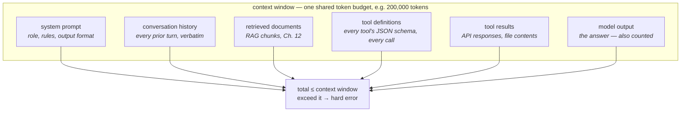

# 04 · Context Windows, Pricing & the Cost Model

> The context window isn't a text box — it's a shared token budget every part of your system
> competes for. This chapter builds the cost model you'll use for the rest of the track: what's in
> the budget, what each token costs, and the compounding math that turns "basically free per call"
> into a real line item — and, in an agent loop, into a cliff.
> [← Part 0 · How LLMs Work](README.md) · prev: 03 · Embeddings · next: [Part 1 · Engineering the API](../01-engineering-the-api/README.md)

> **Predict first (2 min).** Write your guesses: (1) A "200k-token context window" — is that 200k
> tokens of *input*, or input + output combined? (2) A support-ticket assistant handles 100,000
> tickets a month at a few thousand tokens each — is the monthly bill closer to $10, $1,000, or
> $100,000? (3) An agent loop re-sends the whole conversation history on every turn — does a
> 20-turn task cost roughly 20× one turn, or something worse?

---

## The context window is one shared budget, not a text box

"128k context window" sounds like a text field with a character limit. It's actually a **token
budget shared by everything the model sees or produces in one request** — there's no separate
allowance for "your instructions" vs. "the conversation" vs. "the answer." Every one of these draws
from the same pool:



Answering prediction #1: the window caps **input + output combined** (exact split rules vary by
provider — check current docs — but the safe mental model is "one shared pool"). Send a 195k-token
prompt against a 200k window and you have 5k tokens left for the entire answer, no matter how the
provider's cap is technically split. Every tool definition you register (Chapter 07) is billed as
input on *every single call*, even turns where the model doesn't use that tool — a agent with
fifteen tools pays for fifteen tool schemas every turn.

---

## Pricing: input and output are priced (and generated) differently

Recall from Chapter 01: input tokens are processed in one parallel prefill pass; output tokens are
generated one sequential forward pass each. Pricing follows the mechanism — output costs more per
token and takes longer per token:

| | Illustrative Sonnet-class price | *(always verify against the live pricing page — rates change)* |
|---|---|---|
| Input | $3.00 / MTok | 1 MTok = 1,000,000 tokens |
| Output | $15.00 / MTok | ~5× input, and sequential |

Cache-eligible input (Chapter 09) is billed differently again — roughly 10% of standard input cost
for a cache *hit*, with a small write premium on the first call. That's a Chapter 09 topic, but it
already tells you the biggest lever in this chapter: **the token you don't have to regenerate is
the cheapest token you'll ever buy.**

---

## Worked example: the support-ticket assistant at scale

Same running project, now at the volume the ROADMAP's Week 1 checkpoint asks you to estimate —
100,000 tickets/month:

| Component | Tokens | Why |
|---|---|---|
| System prompt (rules + few-shot examples + tool schemas) | 2,000 | static, identical every call |
| Customer email | 650 | varies per ticket |
| Retrieved help-center context (Part 3, once RAG lands) | 800 | top-3 chunks, ~250 tok each |
| Output (JSON classification + draft reply) | 400 | |

```
input per ticket:  2,000 + 650 + 800 = 3,450 tok
  3,450 × $3  / 1,000,000            = $0.01035
output per ticket:   400 tok
  400   × $15 / 1,000,000            = $0.00600
                          per ticket ≈ $0.01635

× 100,000 tickets/month              ≈ $1,635/month
```

Answering prediction #2: about **$1,600/month** — not $10 (too casual an estimate), not $100,000
(that's what happens if you 60× the input size or drop caching at 10× this volume, see below). This
is the "within 2×" estimate the Week 1 checkpoint asks for — the habit is doing this arithmetic
*before* you build, not after the invoice arrives.

Three things this table teaches that senior engineers check first:

1. **The static 2,000-token system prompt is repeated, unchanged, on every one of 100,000 calls.**
   That's 200M tokens/month of pure repetition — exactly what prompt caching (Ch. 09) exists to
   stop paying full price for.
2. **Output tokens dominate disproportionately to their count.** 400 output tokens cost as much as
   ~2,000 input tokens (5× rate). "Make replies concise" is a cost lever, not just a UX one.
   Structured JSON output (Ch. 06) — asking for a category code instead of a paragraph — is a
   pricing decision as much as an engineering one.
3. **A "basically free" $0.016/ticket is a real number at volume.** $1,600/month is one junior
   engineer's weekly cost, recurring forever, for one feature. This is the number you bring to a
   scoping conversation (Ch. 24) — not "it's cheap," but the actual monthly figure with the
   assumptions stated.

---

## The agent-loop cost cliff

Prediction #3, and the sharpest edge in this chapter. A single-turn call sends one prompt, gets one
answer. An **agent loop** (Chapter 15) works by re-sending the *entire growing conversation* —
every prior user turn, every model turn, every tool call and tool result — on **every single
model call**, because the API is stateless: the model has no memory between calls except what you
resend.

```
Turn 1:  send 3,450 tok  → respond 400 tok   (running total sent: 3,450)
Turn 2:  send 3,450 + 400 + (new turn ~500)  = 4,350 tok → respond 400
Turn 3:  send 4,350 + 400 + 500              = 5,250 tok → respond 400
...
Turn 20: send ~3,450 + 19 × (400 + 500)      ≈ 20,550 tok → respond 400
```

Sum the input tokens actually billed across all 20 turns (not just the last one) and you get
**triangular growth**, not linear: roughly `20 × 3,450 + 900 × (1+2+...+19)` — the history term
alone contributes tokens proportional to *n²*. A 20-turn agent task costs meaningfully more than
"20× a single turn" — closer to 8–10× that naive estimate once you sum every resend, before a
single dollar of that spend produced new information. This is exactly the quadratic-attention shape
from Chapter 01, now showing up in your bill instead of just your latency. It's the opening problem
Chapter 18 (context engineering: compaction, summarization, external memory) exists to solve — don't
let conversations grow unbounded; summarize old turns, evict tool results you no longer need,
externalize state to files instead of the transcript.

---

## Context rot: the quality tax on top of the dollar tax

Even under the token limit, model quality on very long contexts is not flat. **Context rot** (a
practical, not-precisely-defined term) describes measured accuracy degradation as relevant
information gets buried deeper in a long prompt or as the transcript accumulates stale, contradictory,
or irrelevant turns — the model still *attends* to everything (Ch. 01), but retrieval-from-context
gets noisier the more there is to sift, and old tool outputs or corrected mistakes linger in the
transcript competing for attention with the current, correct state. Two engineering consequences:

- **"The context window fits it" is not the same claim as "the model will use it well."** A
  400k-token dump of docs that technically fits is not equivalent to well-curated top-5 retrieval
  (Ch. 12–14) even when both fit under the limit.
- **Long agent runs need active pruning**, not just budget tracking — compaction (Ch. 18) is a
  quality fix as much as a cost fix.

---

## Rate limits: tokens-per-minute is an engineering constraint, not a suggestion

Separate from per-request pricing, providers cap **tokens per minute (TPM)** and **requests per
minute (RPM)** per API key/tier. This matters operationally:

- A batch job classifying 10,000 tickets can't just fire 10,000 concurrent requests — it will hit
  TPM/RPM limits and get `429`s (Chapter 08 covers the retry/backoff policy).
- Rate limits are usually tracked separately for input and output tokens, and separately per model.
- At scale, this is a capacity-planning input: if your TPM cap is 400,000 and your average request
  is 3,450 input + 400 output tokens, you can sustain roughly `400,000 / 3,850 ≈ 103` requests/minute
  *before* considering latency — a real ceiling on throughput, not just cost.

---

## Prove it (30–45 min, do today)

1. **Price three workloads from the live pricing page.** Look up current Sonnet-class (or whatever
   model you're using) input/output rates — don't reuse this chapter's illustrative numbers. Compute
   monthly cost for: (a) the ticket assistant above at 100k tickets/month, (b) the same assistant at
   1M tickets/month, (c) a 20-turn agent session run 500 times/month. Compare (a) scaled 10× against
   (b) computed directly — are they equal? (They should be, since per-ticket cost is volume-
   independent without caching — this checks your arithmetic, not a trick.)
2. **Verify against real usage fields.** Make one real API call and read the exact `usage` block
   (`input_tokens`, `output_tokens`, and cache-related fields if you enable caching). Multiply by
   the live per-token price and confirm it matches what you'd compute by hand.
3. **Build the projection.** Write a small script or spreadsheet: inputs = tickets/month, avg input
   tokens, avg output tokens, price/MTok in, price/MTok out; output = monthly cost. Chart cost vs.
   volume from 1k to 1M tickets/month. Add a second line for "with 90%-effective prompt caching on
   the static system-prompt portion" and see how far the two lines diverge.
4. **The one-sentence reconciliation:** *"I predicted X, the pricing math showed Y, because Z."*

---

## Self-Check (close the doc, answer out loud)

1. Name every component that shares the context-window token budget, and explain why a tool
   definition counts against it even on turns where that tool isn't called.
2. Walk the arithmetic for the 100k-ticket/month example from token counts to a monthly dollar
   figure, without looking. Which single component is the highest-leverage target for cost
   reduction, and why?
3. Why does an agent loop's total token cost grow faster than linearly with turn count? Sketch the
   shape (or the sum) that explains it.
4. What is "context rot," and why is it a distinct problem from simply running out of tokens?
5. A teammate wants to fire off 5,000 ticket-classification calls concurrently as fast as possible.
   What constraint will they hit first, and what's the fix?
6. You're asked "what will this cost at 100× current volume?" in a scoping meeting (Ch. 24). Walk
   through, live, what changes linearly, what changes with caching, and what changes with agent-loop
   turn count — and give an honest range, not a false-precision single number.
