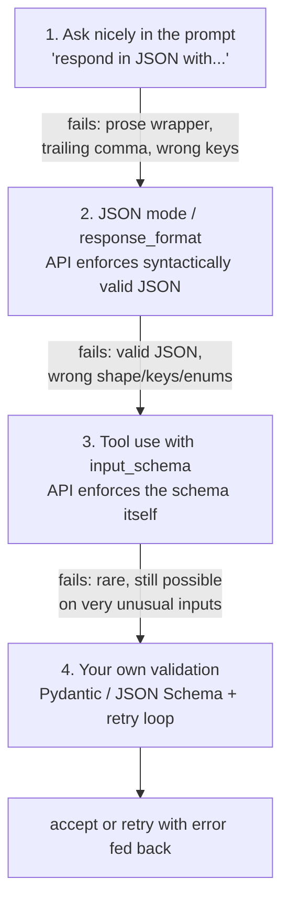

# 06 · Structured Output & Getting Reliable JSON

> Three ways to make a model return JSON, in order of how hard it is to break, and the one thing
> none of them buy you: correctness. This chapter covers the reliability hierarchy, using tool-use
> as a structured-output trick, validation-and-retry loops, and real request/response shapes.
> [← Part 1 · Engineering the API](README.md) · prev: [05 · Prompting as Engineering](05-prompting-as-engineering.md) · next: 07 · Tool Use

> **Predict first (2 min).** Write your guesses: (1) You ask a model to "respond in JSON" with no
> other help. What are the two distinct ways this can fail? (2) A response passes JSON.parse and
> matches your schema exactly — `urgency: "critical"` — can you now trust that this ticket really
> is critical? (3) Your JSON parse fails on 1 request in 200. Is the fix a better prompt, or
> something else?

---

## Structure is a shape guarantee, not a truth guarantee

Get this straight before anything else, because it's the mistake that causes the worst incidents
in this layer: making the model emit valid JSON and making the model emit *correct* JSON are two
completely different problems, solved by two completely different tools.

- **Shape** (is `urgency` one of four allowed strings, is `needs_human` a real boolean, does the
  object have all four keys) — this is what this chapter fixes, mechanically, with something
  stronger than a request.
- **Semantic correctness** (is `urgency` the *right* value for this ticket) — no amount of schema
  enforcement touches this. Only evals (Part 2) tell you whether the model's judgment is right.

A response that parses cleanly and validates against your Pydantic model can still classify a gas
leak as `"low"` urgency. Schema validation and evals are not substitutes for each other — you need
both, and conflating them is how "the JSON always parses now" gets mistaken for "the system
works."

## The reliability hierarchy

Four techniques, each strictly more reliable at guaranteeing *shape* than the one before it:



| Level | What it guarantees | What it doesn't |
|---|---|---|
| 1. Prompted JSON | Nothing — it's a request the model usually honors | Valid syntax, correct keys, correct enum values |
| 2. JSON mode | Syntactically parseable JSON (no stray prose, balanced braces) | Your specific keys, types, or enum values — it can emit valid JSON with the wrong shape entirely |
| 3. Tool use / function calling | The object matches your declared `input_schema` — required keys present, types match, enums constrained | Semantic correctness; also doesn't stop the model from putting a plausible-but-wrong value into a correctly-shaped field |
| 4. Your own validation + retry | Whatever your validator checks, including cross-field rules the schema language can't express (`needs_human` must be `true` if `urgency == "critical"`) | Nothing beyond what you coded — and it costs a retry round trip when it fires |

Level 1 fails constantly at scale — a model that's 98% reliable at "just emit JSON" still means 2
in 100 production requests need special-casing prose stripping, which is a worse problem than the
one you started with. Level 3 is the practical floor for anything shipped: **use tool-use as a
structured-output trick even when you have no tool to call.** Level 4 is not optional — schema
constraint reduces the failure surface, it doesn't eliminate cross-field logic or catastrophic
model confusion on an unusual input.

## Using tool-use as a structured-output trick

You don't need an actual side-effecting tool to use the tool-use mechanism. Define a "tool" whose
whole purpose is to *be the output shape* — the model is forced to call it with arguments matching
your `input_schema`, and you never execute anything; you just read the arguments back out.

Request:

```json
{
  "model": "claude-sonnet-4-5",
  "max_tokens": 500,
  "system": "You are a support-ticket triage assistant for Divisions Inc. ...",
  "tools": [
    {
      "name": "submit_triage",
      "description": "Submit the triage classification for this ticket. Always call this — never respond in plain text.",
      "input_schema": {
        "type": "object",
        "properties": {
          "category": {
            "type": "string",
            "enum": ["hvac", "plumbing", "electrical", "general_maintenance", "billing", "other"]
          },
          "urgency": {
            "type": "string",
            "enum": ["low", "medium", "high", "critical"]
          },
          "needs_human": {"type": "boolean"},
          "draft_reply": {"type": "string"}
        },
        "required": ["category", "urgency", "needs_human", "draft_reply"]
      }
    }
  ],
  "tool_choice": {"type": "tool", "name": "submit_triage"},
  "messages": [
    {"role": "user", "content": "Subject: urgent!!\n\nyour guy left the ac unit access panel open on the roof, birds are getting into the duct now, third time this happens"}
  ]
}
```

`tool_choice: {"type": "tool", "name": "submit_triage"}` forces this specific call rather than
letting the model choose to respond in plain text — critical for a structured-output-only use
case where there's exactly one "tool" and it's mandatory every time.

Response (trimmed):

```json
{
  "id": "msg_01Xyz...",
  "role": "assistant",
  "content": [
    {
      "type": "tool_use",
      "id": "toolu_01Abc...",
      "name": "submit_triage",
      "input": {
        "category": "hvac",
        "urgency": "medium",
        "needs_human": false,
        "draft_reply": "Thanks for reporting this — we'll dispatch a technician to secure the access panel and inspect the ductwork for debris from the recurring bird intrusion."
      }
    }
  ],
  "stop_reason": "tool_use",
  "usage": {"input_tokens": 612, "output_tokens": 94}
}
```

The API guarantees `input` matches the schema — `category` is one of your six strings, `urgency`
one of your four, `needs_human` a real JSON boolean, all four keys present. You read
`content[0].input` directly; no parsing prose, no regex for a stray "Here's the JSON:" preamble.
Chapter 07 covers the full tool-use loop for *actual* tools (where you execute something and send
a `tool_result` back); this is the same mechanism used as a pure output-shaping trick, with no
second turn.

## Validation and retry on top

Schema constraint from the API is necessary, not sufficient. Cross-field rules, business
invariants, and defense against the rare malformed response still need your own validation layer —
typically a Pydantic model (Python) or a JSON Schema validator, checked immediately after the call:

```python
from pydantic import BaseModel, field_validator
from enum import Enum

class Urgency(str, Enum):
    low = "low"; medium = "medium"; high = "high"; critical = "critical"

class Triage(BaseModel):
    category: str
    urgency: Urgency
    needs_human: bool
    draft_reply: str

    @field_validator("draft_reply")
    @classmethod
    def not_empty(cls, v):
        if len(v.strip()) < 10:
            raise ValueError("draft_reply too short to be useful")
        return v
```

```python
def get_triage(email: str, max_retries: int = 2) -> Triage:
    messages = [{"role": "user", "content": email}]
    for attempt in range(max_retries + 1):
        resp = client.messages.create(
            model="claude-sonnet-4-5", max_tokens=500, system=SYSTEM_PROMPT,
            tools=[SUBMIT_TRIAGE_TOOL], tool_choice={"type": "tool", "name": "submit_triage"},
            messages=messages,
        )
        raw = resp.content[0].input
        try:
            return Triage.model_validate(raw)
        except Exception as e:
            if attempt == max_retries:
                raise
            # feed the validation error back so the model can repair it
            messages += [
                {"role": "assistant", "content": resp.content},
                {"role": "user", "content": f"That call failed validation: {e}. Call submit_triage again, fixed."},
            ]
```

This is the standard **repair loop**: validate, and if it fails, hand the model the exact error
message and ask again in the same conversation (not a fresh prompt from scratch — the model
benefits from seeing what it produced and why it was rejected). Cap retries — two is typical; if
the model can't produce valid output in two extra tries, that's an eval-worthy failure to log and
route to a fallback (return `needs_human: true` and a generic reply), not an infinite loop.

## What tool-use schemas can't express — and where evals pick up

JSON Schema can pin down types, enums, required fields, string patterns. It cannot express "if
urgency is critical, needs_human must be true" (a cross-field rule — write it as a Pydantic
validator) or "the draft_reply must actually address what the customer asked" (a semantic
judgment — that's an LLM-as-judge eval, Chapter 11). Layer the three:

1. **Tool schema** — structural guarantee, enforced by the API, free.
2. **Your validator** — cross-field business rules, enforced by your code, cheap.
3. **Eval suite** — semantic correctness, enforced by test cases and judges, the actual product
   quality bar.

Shipping only layer 1 and calling the JSON problem "solved" is the single most common structured-
output mistake — it produces a system that never crashes on `.category` and confidently
misclassifies tickets all day.

---

## Build it

1. Take the ticket assistant from Chapter 05 and convert its output to the `submit_triage` tool
   shape above (`category`, `urgency`, `needs_human`, `draft_reply`), forced with `tool_choice`.
2. Add the Pydantic model and a retry loop (max 2 retries) that feeds validation errors back to
   the model as shown.
3. Baseline first: run 50 varied synthetic tickets through **prompted JSON only** (level 1 — ask
   for JSON in plain text, no tools) and record how many responses fail to `json.loads()` cleanly
   or fail your Pydantic validation.
4. Run the same 50 tickets through the tool-use + validation version and record the same failure
   rate.
5. Reconciliation: *"I predicted the invalid-output rate would drop from about X% to near 0% by
   switching to tool-use, the numbers showed Y, because tool-use makes the shape a hard API-side
   constraint instead of a request the model can ignore."* Report both numbers.

## Self-Check (close the doc, answer out loud)

1. Name the four levels of the reliability hierarchy in order and say, for each, one specific
   failure mode it does *not* protect against.
2. A response validates perfectly against your Pydantic schema. What have you learned about
   whether the classification is correct? What haven't you learned?
3. Walk through how `tool_choice: {"type": "tool", "name": "..."}` gets you structured output
   without ever executing a real tool.
4. What's the difference between a cross-field business rule and something JSON Schema can
   express natively — give one example of each from the ticket assistant.
5. Your retry loop is capped at 2. What should happen on the 3rd consecutive failure, and why is
   "retry forever" the wrong answer?
6. Interview-grade: a colleague says "we use function calling, so our JSON is guaranteed correct."
   What's wrong with that sentence, precisely?
