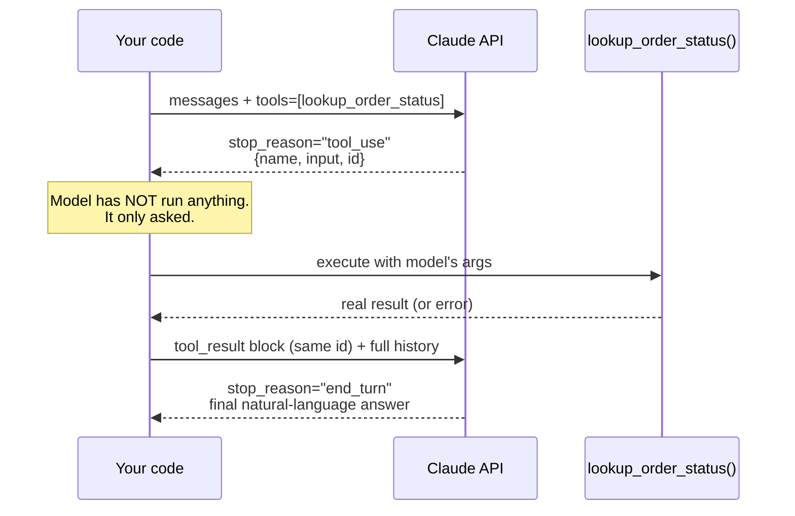

# 07 · Tool Use: The Primitive Under Everything Agentic

> The mechanism every "agent" in this track is built from: the model reads a JSON schema you wrote,
> decides it wants a tool, and hands you back arguments — it never executes anything. Master this
> round trip cold; Chapters 15–16 are this loop wrapped in a `while`.
> [← Part 1 · Engineering the API](README.md) · prev: 06 · Structured Output · next: 08 · Streaming, Errors & Retries

> **Predict first (2 min).** Write your guesses: (1) When the model "calls a tool," what process
> actually runs the code — the model's infrastructure, or yours? (2) If you give the model two
> tools it could plausibly use for the same request, what determines which one it picks? (3) Can a
> single API response ask for more than one tool call at once?

---

## Tool use is structured output with a contract you execute

Chapter 06 covered forcing the model into a JSON shape *you* consume. Tool use is the same trick
pointed outward: you describe a function, the model decides *whether* and *how* to call it, and
returns arguments shaped exactly like a JSON schema — but this time the consumer of that JSON is
**your code**, not a human reading a screen. That's the entire primitive. Every "agent" is just this
loop wrapped in a `while` condition:

```
you define tools → model emits tool_use (name + args) → your code executes → you send tool_result → model continues
```

The critical fact, worth stating baldly because it's the #1 misconception: **the model never runs
anything.** Anthropic's servers have no access to your database, your filesystem, or your HTTP
clients. A `tool_use` block is a *request* — structured exactly like a function call, but it's
inert data until your process picks it up, executes real code, and reports back what happened.



---

## Defining a tool: the schema IS the API

A tool definition has three parts, and all three are prompt engineering — the model reads them
like documentation, not like a compiler reads a signature:

```json
{
  "name": "lookup_order_status",
  "description": "Look up the current status of a facilities work order by its ticket ID. Returns the order's stage (received, scheduled, in_progress, completed), the assigned technician, and the ETA if scheduled. Use this whenever a customer asks 'where is my order' or 'when will someone arrive' — do not guess a status.",
  "input_schema": {
    "type": "object",
    "properties": {
      "ticket_id": {
        "type": "string",
        "description": "The work order ID, format WO-XXXXX (e.g. WO-48213). Extract this from the customer's message; ask the customer if not present."
      }
    },
    "required": ["ticket_id"]
  }
}
```

This is the interface the model programs against — no different in spirit from a well-documented
method signature you'd hand a junior engineer in a code review (see `../../LLD` on interface
design: the same rules apply — precise names, unambiguous parameters, documented edge cases). Three
things senior engineers get right here that juniors skip:

- **The `description` is doing the load-bearing work, not the `name`.** The model decides
  *whether* to call a tool almost entirely from the description. `lookup_order_status` with a thin
  one-line description gets called at the wrong times or skipped when it should fire. Tell it
  *when* to use the tool, not just what it does.
- **`input_schema` is a real JSON Schema** — `type`, `properties`, `required`, `enum`, nested
  objects, all supported. Constrain what you can: an `enum` on a `category` parameter is cheaper
  and more reliable than a free-text field you have to validate after the fact.
- **Field-level descriptions matter as much as the top-level one.** "Extract this from the
  customer's message" tells the model *where the value comes from* — without it, models sometimes
  invent plausible-looking IDs instead of asking.

---

## The round trip, with real payloads

**Request** — tools are declared once, alongside the conversation:

```json
{
  "model": "claude-sonnet-4-5",
  "max_tokens": 1024,
  "system": "You are a support assistant for Divisions Inc., a facilities maintenance company...",
  "tools": [ { "name": "lookup_order_status", "...": "..." } ],
  "messages": [
    { "role": "user", "content": "Hey, when's someone showing up for WO-48213? It's been 3 days." }
  ]
}
```

**Response 1** — the model stops to request a tool call. Note `stop_reason` and that `content` can
mix a text block with a `tool_use` block:

```json
{
  "id": "msg_01A...",
  "stop_reason": "tool_use",
  "content": [
    { "type": "text", "text": "Let me check on that for you." },
    {
      "type": "tool_use",
      "id": "toolu_01Xy9",
      "name": "lookup_order_status",
      "input": { "ticket_id": "WO-48213" }
    }
  ],
  "usage": { "input_tokens": 612, "output_tokens": 38 }
}
```

**Your code executes** `lookup_order_status("WO-48213")` against your real order system — a
database call, an internal REST API, whatever backs it. Say it returns
`{"stage": "scheduled", "technician": "assigned", "eta": "2026-07-13T09:00:00Z"}`.

**Your next request** appends the *entire* prior assistant turn, then a `user` message carrying a
`tool_result` block keyed to the same `id`:

```json
{
  "messages": [
    { "role": "user", "content": "Hey, when's someone showing up for WO-48213? It's been 3 days." },
    { "role": "assistant", "content": [
        { "type": "text", "text": "Let me check on that for you." },
        { "type": "tool_use", "id": "toolu_01Xy9", "name": "lookup_order_status", "input": { "ticket_id": "WO-48213" } }
    ]},
    { "role": "user", "content": [
        { "type": "tool_result", "tool_use_id": "toolu_01Xy9",
          "content": "{\"stage\":\"scheduled\",\"technician\":\"assigned\",\"eta\":\"2026-07-13T09:00:00Z\"}" }
    ]}
  ]
}
```

**Response 2** — now `stop_reason` is `end_turn`; the model has what it needs and writes the final
answer grounded in the tool's actual output, not a guess:

```json
{ "stop_reason": "end_turn",
  "content": [ { "type": "text", "text": "Good news — a technician is confirmed for WO-48213, arriving tomorrow (Jul 13) around 9am." } ] }
```

That's the whole primitive. Everything from here through Chapter 19 is orchestration around this
one exchange: more tools, more turns, a loop instead of two calls, other agents deciding when to
stop.

---

## Parallel tool calls and `tool_choice`

A single response's `content` array can hold *multiple* `tool_use` blocks — the model asking for
several tools at once (e.g., `lookup_order_status` *and* `check_technician_availability` in the same
turn, because nothing about the second call depends on the first). Your code should execute all of
them (concurrently if they're independent) and return one `tool_result` block per `tool_use_id`, all
in a single follow-up `user` message. This is a real latency lever — Chapter 08 covers why serial
round-trips are the thing to design against.

`tool_choice` controls how much freedom the model has to decide:

| `tool_choice` | Behavior | When to use |
|---|---|---|
| `{"type": "auto"}` (default) | Model decides whether to call a tool at all | General assistants — let it reason about need |
| `{"type": "any"}` | Model must call *some* tool, but picks which | You know a tool call is needed, unsure which |
| `{"type": "tool", "name": "X"}` | Model must call exactly tool `X` | Forcing structured output via a fake "tool" (Ch. 06), or a deterministic next step in a workflow |

Forcing `tool_choice` too aggressively defeats the point of an agentic system — if you already know
which function runs next, you don't need a model in the loop; that's a workflow (Ch. 19), not an
agent decision.

---

## Build it (45–60 min)

Extend the ticket assistant from Chapter 06 with a real tool round trip.

1. **Define `lookup_order_status`** as a stub Python/TS function returning a hardcoded dict keyed by
   a few fake ticket IDs (`WO-48213`, `WO-19004`, and one that doesn't exist — return a clear "not
   found" result, not an exception; the model reads errors too).
2. **Declare the tool** in your API call with a description that states *when* to call it, not just
   what it returns. Send five test messages: two that clearly need the lookup, two that don't (a
   general question about hours of operation), one ambiguous one.
3. **Handle both branches.** If `stop_reason == "tool_use"`, execute the stub, build the
   `tool_result` message, and send the follow-up request. If `stop_reason == "end_turn"` on the
   first call, the model answered without the tool — log that too.
4. **Log every content block** (text and tool_use) from every response, and the exact `tool_result`
   payload you send back, to a JSONL trace file. You'll reuse this trace-logging habit through the
   whole agent track (Ch. 20 makes it a production requirement).
5. **Break the description on purpose.** Strip it down to `"Looks up an order."` and re-run your
   five test messages — note any case where tool-choice behavior changes (wrong tool skipped/fired,
   ambiguous case decided differently). Restore the good description.
6. **Reconcile:** *"I predicted X, the API showed Y, because Z"* — specifically, which of your five
   messages you were wrong about before running it.

---

## Self-Check (close the doc, answer out loud)

1. Trace the full round trip from a user message to a final answer through a tool call — name every
   content-block type and which side (model vs. your code) produces each.
2. What actually executes the tool? What would happen if you never sent a `tool_result` back?
3. Why is the tool `description` closer to a prompt-engineering artifact than a docstring? Give an
   example of a description change that would change model behavior without touching the schema.
4. What's the difference between `tool_choice: "any"` and `tool_choice: {"type": "tool", "name": "X"}`,
   and when would forcing a specific tool actually be the wrong call?
5. A response comes back with two `tool_use` blocks in one turn. What must your `tool_result`
   follow-up contain, and can you execute the two tools concurrently?
6. A teammate says "the model looked up the order and told the customer it's delayed." What's
   imprecise about that sentence, and how would you correct it for a postmortem?
