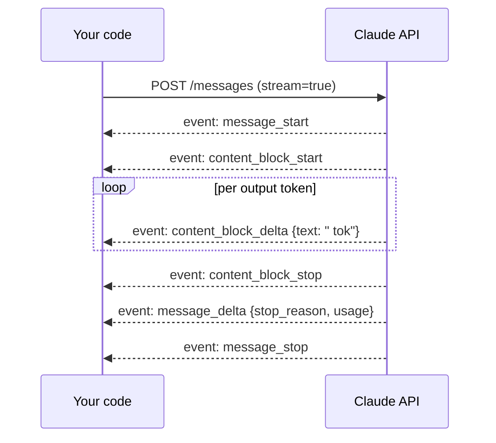
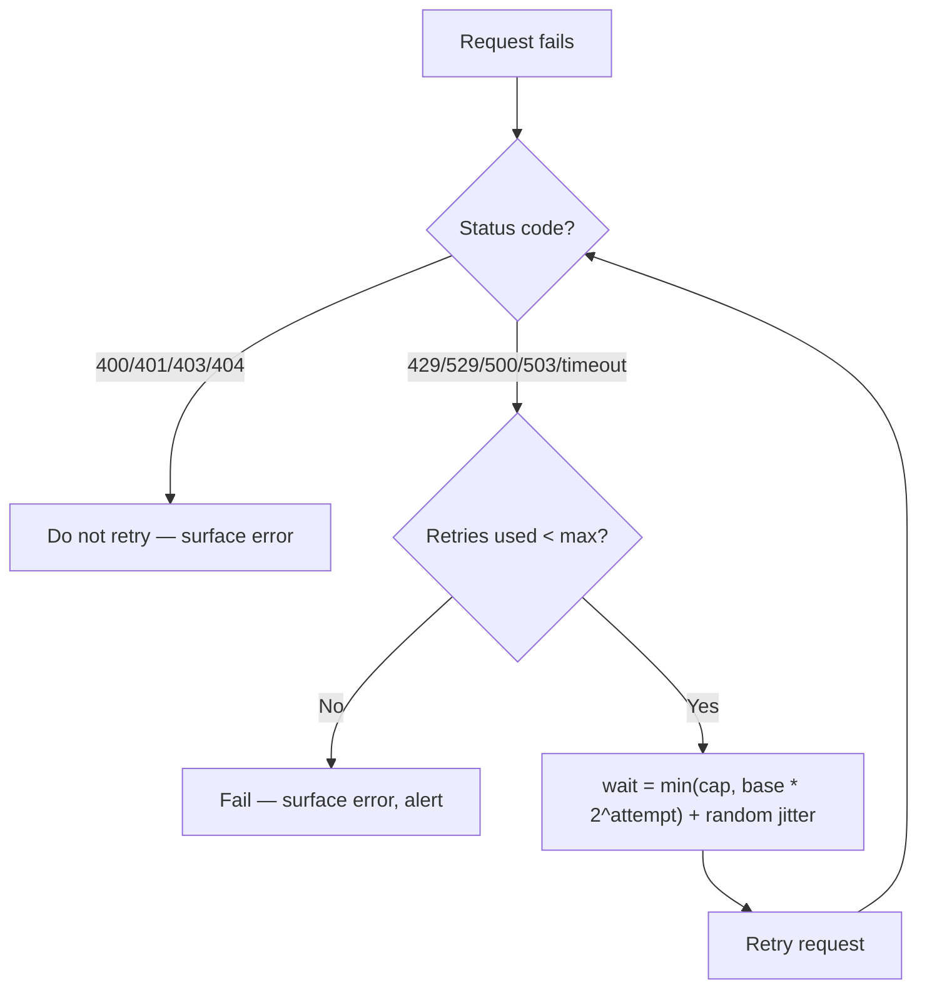

# 08 · Streaming, Errors, Retries & Timeouts

> Making the ticket assistant behave like production software instead of a notebook cell: stream
> tokens as they generate, classify failures correctly, and retry the ones that deserve it — without
> silently duplicating a side effect.
> [← Part 1 · Engineering the API](README.md) · prev: 07 · Tool Use · next: 09 · Caching, Batching & Budgets

> **Predict first (2 min).** Write your guesses: (1) Streaming doesn't make the model faster
> overall — so what latency number does it actually improve? (2) A request gets HTTP 429. Should
> you retry it immediately, and if not, why not? (3) A stream dies after 40 of an expected 400
> output tokens — what state are you now in, and what are your options?

---

## Streaming changes perceived latency, not total latency

Recall the prefill/decode split from Chapter 01: decode is strictly sequential, one forward pass
per output token. A non-streaming call makes you wait for *every* output token before you see any
of them — total time is TTFT + full decode time. Streaming (Server-Sent Events, SSE) sends each
token the instant it's generated, so the user sees output start at TTFT and watches it grow, instead
of staring at a spinner for the whole decode.

**The total wall-clock time to the last token is identical either way.** Streaming is purely a UX
and pipelining lever:

- A slow 30-second response *feels* fine if the first words appear in 400ms and keep coming.
- The same 30-second response *feels* broken with no output until second 30.
- Streaming also lets you start downstream work early — e.g., start speaking a TTS response, or
  start rendering a partial JSON field — before the full response lands.

Conceptual event types you'll see in the stream (check the SDK docs for exact field names — they
do shift):

| Event | Carries |
|---|---|
| `message_start` | empty message shell + initial `usage.input_tokens` |
| `content_block_start` | a new block begins (text, or a `tool_use` block's `name`/`id`) |
| `content_block_delta` | the actual incremental text, or partial JSON for a `tool_use` block's `input` |
| `content_block_stop` | that block is complete |
| `message_delta` | final `stop_reason` and cumulative output `usage` |
| `message_stop` | stream is done |

Note that a `tool_use` block's `input` streams as *partial JSON fragments* — don't try to parse
each delta as standalone JSON; buffer until `content_block_stop` and parse once.

---

## Error taxonomy: not all failures deserve the same response

Treating every non-2xx as "retry with the same backoff" is how you turn a transient blip into a
self-inflicted outage. Classify first:

| Status / condition | Meaning | Retry? |
|---|---|---|
| `400 Bad Request` | Your payload is malformed (bad schema, invalid params) | **No** — fix the request; retrying an identical malformed request fails identically |
| `401 / 403` | Auth problem | **No** — fix credentials, don't hammer the API |
| `404` | Resource doesn't exist (rare on this API) | **No** |
| `429 Too Many Requests` | You've hit a rate limit (RPM/TPM) | **Yes** — back off, the capacity exists, you're just over your current quota |
| `529 Overloaded` | Provider capacity issue, not yours | **Yes** — back off longer; this is not about your account |
| `500 / 503` | Transient server error | **Yes** |
| Network timeout / connection drop | Could be mid-prefill or mid-stream | **Depends** — see partial-output handling below |

The dividing line: **retry failures that are about capacity or transience; never retry failures
that are about correctness.** A `400` will be a `400` again in 100ms — the problem is in your code,
not the network. This is the same instinct as backend HTTP client design (`../../HLD` covers retry
budgets and circuit breakers generally) — an LLM API is just another downstream dependency with its
own failure modes layered on top of the usual ones.

---

## Retry policy: exponential backoff with jitter

Concrete defaults that work well against this API:

- **Base delay**: 1s, **cap**: ~30s, **max attempts**: 4–5.
- **Full jitter**: don't wait exactly `2^attempt` seconds — wait `random(0, 2^attempt)`. Without
  jitter, every client that got rate-limited in the same burst retries in lockstep and re-triggers
  the same 429 wall.
- **Respect `Retry-After`** if the response includes it — it's the provider telling you exactly how
  long, don't out-guess it with your own backoff math.
- **Most SDKs (including `anthropic`) retry 429/5xx/overloaded automatically with sane defaults** —
  know the default (`max_retries`, typically 2) and override it explicitly rather than silently
  relying on it; a production system should set this deliberately, not by accident.

---

## Idempotency: why retries are suddenly your problem again

A retried API call is safe *by itself* — you're re-asking the model the same question. The danger
is what your **harness** does around the call. If `lookup_order_status` or `escalate_to_human`
already ran once inside a tool loop, and you retry the whole turn after a transient network error,
did the tool run twice?

- **Read-only tools** (lookups, search): retrying is harmless, just wasteful.
- **Side-effecting tools** (send an email, open a ticket, issue a refund): retrying without
  protection **double-executes**. Give these tools an idempotency key derived from something stable
  (ticket ID + turn number) and have the underlying system dedupe on it — the same discipline you'd
  apply to any at-least-once message queue consumer (`../../HLD` idempotency patterns apply
  unchanged here; the LLM in front doesn't change the guarantee your backend must provide).
- Chapter 19's human-approval gates exist partly for this reason: irreversible actions get a queue,
  not a direct retry-prone call.

---

## Partial-output handling when a stream dies

A dropped connection at token 40 of 400 leaves you with: some valid partial text, no `stop_reason`,
and no `usage` totals (those arrive in the final `message_delta`/`message_stop` events you never
got). Three real options, in order of how often you'll actually use them:

1. **Discard and retry from scratch.** Simplest, correct for short-to-medium outputs where
   re-generating is cheap. Default choice for the ticket assistant's JSON classification calls.
2. **Discard and retry, but log the partial** for debugging — don't show a half-JSON-object to a
   user or feed it to a JSON parser expecting a complete document.
3. **Resume-style continuation** (send back the partial text and ask the model to continue from
   there) — works for long free-text generation, but risky for structured output: a JSON object
   split mid-string is not something you can safely "continue" without re-validating the whole
   thing. Prefer option 1 for anything schema-validated.

Whatever you choose, **never treat a partial stream as a successful response** — check for the
terminal event (`message_stop`) before trusting `usage` or committing a downstream side effect.

---

## Build it (45–60 min)

Harden the ticket assistant from Chapters 06–07 against real failure modes.

1. **Switch to streaming.** Call with `stream=true`, iterate the event stream, print each
   `content_block_delta` as it arrives, and measure TTFT (time to the first delta) vs. total time.
   Compare against a non-streamed call on the same prompt — confirm total time is roughly equal.
2. **Add a timeout.** Set an explicit client-level timeout (e.g. 20s) shorter than a deliberately
   slow request would take, and confirm you get a clean timeout exception, not a hang.
3. **Implement retry-with-backoff** by hand (don't just rely on SDK defaults — you want to see the
   mechanics): exponential base 1s, cap 30s, jitter, max 4 attempts, and **only** on
   429/529/5xx/timeout. Assert a `400` never retries.
4. **Simulate a 429.** Easiest path: monkeypatch/mock your HTTP client to return one fake 429 then
   succeed, and confirm your backoff logic sleeps before retrying and then completes. Log the
   attempt count and each computed wait time.
5. **Kill a stream mid-flight.** Start a streamed request expecting a long draft reply, and forcibly
   close the connection after ~5 chunks (e.g. cancel the underlying request). Confirm your code
   detects the incomplete stream (no `message_stop`), does *not* treat the partial text as final,
   and retries from scratch per your policy.
6. **Reconcile:** *"I predicted X, the API showed Y, because Z"* — specifically about whether TTFT
   or total time changed between streamed and non-streamed calls.

---

## Self-Check (close the doc, answer out loud)

1. What does streaming actually improve, and what does it *not* improve? Tie the answer back to
   prefill vs. decode from Chapter 01.
2. Name three streaming event types and what each one carries. Why can't you `json.loads()` a
   single `content_block_delta` for a streaming `tool_use` input?
3. Give the retry decision for a 400, a 429, and a 529 — and explain the mechanism-level reason
   they're different, not just "some errors are retryable."
4. Why does jitter matter in backoff? What specifically goes wrong with pure exponential backoff
   and no jitter under a shared rate-limit event?
5. A tool call that sends a real email gets retried after a timeout. What could go wrong, and what
   pattern prevents it?
6. Your stream dies at token 40 of an expected 400-token JSON response. Walk through why "just
   continue the stream" is riskier here than for free-text output, and what you'd do instead.
