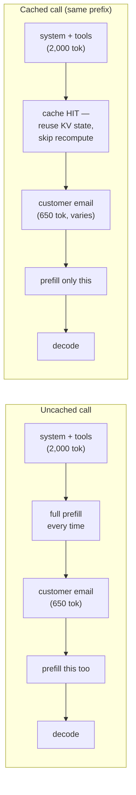

# 09 · Prompt Caching, Batching & the Latency/Cost Budget

> The highest-leverage, lowest-effort optimization in this whole track: reorder your prompt so the
> unchanging 2,000-token instruction block gets skipped on re-prefill instead of recomputed on
> every single call. Then decide, explicitly, what your feature is allowed to cost and how long it's
> allowed to take.
> [← Part 1 · Engineering the API](README.md) · prev: 08 · Streaming, Errors & Retries · next: [Part 2 · Evals](../02-evals/README.md)

> **Predict first (2 min).** Write your guesses: (1) Chapter 01 said prefill cost scales with the
> *square* of prompt length — if 75% of your prompt is byte-for-byte identical on every call, is
> there any way to avoid re-paying for it? (2) Roughly how much cheaper should a "cache read" be
> than a normal input token, if the point is to skip recomputing attention state? (3) If you need to
> classify 50,000 tickets overnight with no live user waiting, is the real-time API even the right
> tool?

---

## Caching skips prefill, not the request

Chapter 01 established that prefill is compute-bound and roughly quadratic in prompt length — the
model attends every prompt token to every earlier prompt token, once, before it emits the first
output token. **Prompt caching lets the provider skip redoing that work for the part of the prompt
that hasn't changed since the last call.** Concretely: if you send the same 2,000-token system
prompt + tool definitions on every request, and only the customer's email varies, the provider can
cache the attention state (the KV cache from Ch. 01) for that stable prefix and reuse it — instead
of recomputing attention across those 2,000 tokens from scratch every single time.

This only works for a **prefix**: content that appears in the *exact same position*, byte-for-byte,
at the start of the request. Content after the first point of difference cannot be cached, because
attention state depends on everything before it — change token 500 and every token after it has a
different context to attend over.



The mechanism has a TTL — roughly **5 minutes** of inactivity before the cache expires (check the
docs for the current number; it's tuned by the provider and can change). Under sustained traffic
(a support-ticket assistant handling requests continuously), the cache effectively never expires
because every call refreshes it.

---

## What it costs, and why it's ~10x cheaper

Providers price a cached prefix in three ways, distinguished in the response `usage` object:

| `usage` field | Meaning | Illustrative price (Sonnet-class — verify live pricing page) |
|---|---|---|
| `input_tokens` | Normal, uncached input tokens this call | $3 / MTok |
| `cache_creation_input_tokens` | Tokens written to cache *this call* (first call, or after TTL expiry) | ~$3.75 / MTok (small write premium) |
| `cache_read_input_tokens` | Tokens read from an existing cache hit | ~$0.30 / MTok (**~10x cheaper**) |

The 10x discount isn't arbitrary pricing — it reflects the actual mechanism: building the KV state
is the expensive quadratic-ish attention work; reusing an already-built KV state is comparatively
cheap, so the provider passes the savings through. This is the same asymmetry Chapter 01 flagged
when it said "the expensive part is *building* the state; reusing it is cheap."

---

## Reordering the prompt: stable-first layout

Caching only helps the prefix that's identical across calls, so prompt structure becomes an
explicit design decision, not an afterthought:

```
[ system prompt: role + instructions ]   ← identical every call
[ tool definitions ]                      ← identical every call
[ few-shot examples ]                     ← identical every call
──────────────── cache breakpoint ────────────────
[ conversation history / retrieved docs ] ← varies per call
[ current user turn: customer's email ]   ← varies per call
```

Anything that changes per-call — the customer's email, RAG-retrieved chunks, conversation
history — has to go *after* the stable block, never interleaved with it. A common mistake: putting
a per-request timestamp or a request ID inside the system prompt "for logging." That single varying
value breaks the entire prefix match and silently kills your cache hit rate for the whole 2,000
tokens behind it.

You mark where the cacheable prefix ends with a **cache breakpoint** — an explicit
`cache_control: {"type": "ephemeral"}` marker on the last content block you want cached (check SDK
docs for exact placement; it typically attaches to a block in `system` or `tools`). Everything up to
and including that marked block is eligible for caching; everything after is prefilled fresh.

---

## Worked cost math: the ticket assistant at 100k calls/month

Reusing Chapter 01's shape — 2,000-token static system+tools block, 650-token customer email,
400-token output — at the same illustrative Sonnet-class prices ($3/MTok in, $15/MTok out,
$0.30/MTok cached read, $3.75/MTok cache write; **always verify against the live pricing page**):

**Without caching** (every call re-prefills all 2,650 input tokens):

```
input:   2,650 tok × $3  / 1,000,000  = $0.00795
output:    400 tok × $15 / 1,000,000  = $0.00600
                            per ticket ≈ $0.01395
× 100,000 tickets/month                ≈ $1,395/month
```

**With caching** (2,000-token prefix cached; only the 650-token email is fresh input each call;
first call of each ~5-min window pays the cache-write premium, but at sustained volume the vast
majority of calls hit `cache_read`):

```
cache_read:  2,000 tok × $0.30 / 1,000,000 = $0.00060
fresh input:   650 tok × $3.00 / 1,000,000 = $0.00195
output:        400 tok × $15   / 1,000,000 = $0.00600
                                per ticket  ≈ $0.00855
× 100,000 tickets/month                     ≈ $855/month
```

That's a **~39% reduction in total monthly cost** from a prompt-layout change alone — no accuracy
tradeoff, no model downgrade. And the TTFT improvement is separate money: skipping prefill on 2,000
of 2,650 input tokens materially shortens the compute-bound phase, which is the phase users
perceive as "how long until it starts responding" (Ch. 08). Two independent wins from one
reordering decision — this is why it's usually the first optimization you make, not the last.

---

## Batch API: the other half of the budget

Not every call needs to be real-time. The Batch API accepts a large set of requests (thousands),
processes them asynchronously, and returns results within a window (commonly up to 24 hours) at a
**meaningfully lower price per token** (illustrative: ~50% off standard rates) — because the
provider can schedule the work against spare capacity instead of reserving low-latency headroom for
it.

| | Real-time (Messages API) | Batch API |
|---|---|---|
| Latency | Seconds, streamed | Minutes to ~24h |
| Price | Standard | Materially cheaper (~50% off, illustrative) |
| Use case | A customer waiting on a reply | Overnight reclassification of 50k historical tickets, bulk eval runs, backfills |
| Caching | Applies normally | Can combine with caching for the shared prefix too |

The decision rule: **if nothing on the other end of the response is a human waiting in real time,
route it through Batch.** Nightly eval runs (Ch. 10), bulk re-scoring after a prompt change, and
one-off migrations are Batch jobs, not 50,000 sequential real-time calls burning your rate limit and
your budget simultaneously.

---

## The latency/cost budget as an artifact

By this point in the track you have three independent levers — caching, streaming, batching — plus
model choice and prompt length. Treat "what does this feature cost and how fast must it respond" as
something you write down, not something you discover in a postmortem:

```
Ticket-assistant budget (v1):
  Target p95 TTFT:        < 1.5s   (streamed, cached prefix)
  Target total latency:   < 8s     (400-token draft reply)
  Target cost/ticket:      < $0.01
  Monthly volume:          100,000 tickets
  Monthly budget:          < $1,000
  Escalation path if breached: drop draft_reply generation to a smaller model (Ch. 22)
```

Writing this down before you ship forces the caching/batching/model-selection decisions to be
explicit engineering choices instead of whatever the first working prototype happened to cost. Every
later production chapter (Ch. 20, 22) reports against a budget like this one.

---

## Prove it (30–45 min)

1. **Structure the prompt for cache hits.** Take your Chapter 07 ticket assistant and move
   everything static (system instructions, tool definitions, few-shot examples) before a single
   `cache_control` breakpoint; the customer email stays after it.
2. **Fire it twice within the TTL window** with different customer emails but the identical static
   prefix. Read `usage.cache_creation_input_tokens` on the first call and
   `usage.cache_read_input_tokens` on the second — confirm the second call reads from cache instead
   of creating it.
3. **Break it on purpose.** Insert a per-call timestamp into the system prompt (before the
   breakpoint) and re-run — confirm the cache hit disappears (`cache_creation_input_tokens` fires
   again instead of `cache_read_input_tokens`). Remove it and confirm the hit returns.
4. **Measure TTFT delta.** Time the first (cache-miss) call and a later (cache-hit) call with
   streaming on; compare TTFT for each.
5. **Recompute the cost table above with your own measured token counts** for your actual system
   prompt (not the illustrative 2,000) and confirm your real cached-vs-uncached savings percentage.
6. **Reconcile:** *"I predicted X, the API showed Y, because Z"* — specifically about which
   `usage` field appeared on which call.

---

## Self-Check (close the doc, answer out loud)

1. What mechanism does prompt caching actually skip? Tie the answer explicitly to the prefill/KV
   cache explanation from Chapter 01 — don't just say "it's cheaper."
2. Why must cached content be a strict prefix? What happens to the cache if you change one token in
   the middle of the stable block?
3. Name the three `usage` fields relevant to caching and what each tells you happened.
4. Why does a per-request timestamp inside the system prompt silently destroy your cache hit rate,
   and where would you put a timestamp instead if you needed one logged?
5. Give the decision rule for real-time Messages API vs. Batch API, with one ticket-assistant
   example of each.
6. You inherit a service spending $3,000/month on Claude calls. Walk your triage order — which
   lever (caching, batching, model selection, prompt trimming) would you check first, and why that
   one before the others?
