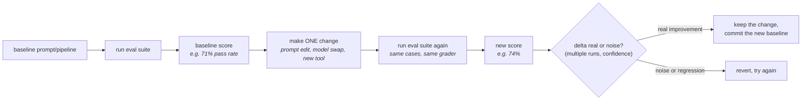

# 10 · Building an Eval Suite from Scratch

> Why "I tried it and it looks good" is professionally negligent for an LLM system, what the
> minimum viable eval actually is (not a research paper's benchmark — 20–50 cases and a runner),
> and how to know whether "74% vs 71%" is a real improvement or noise. This is the skill that gates
> every other part of the track: from here on, every change reports a score.
> [← Part 2 · Evals](README.md) · prev: [Part 1 · Engineering the API](../01-engineering-the-api/README.md) · next: 11 · LLM-as-Judge

> **Predict first (2 min).** Write your guesses: (1) You change a system prompt and the model's
> three test outputs all look better. How many cases would you need to run before you'd bet your
> job the prompt is actually better? (2) A public benchmark says Model X scores 91% on "customer
> support QA." Does that tell you anything about how it'll do on *your* ticket assistant? (3) The
> model scores 74% on Monday and 71% on Tuesday with the *same* prompt and the *same* test cases —
> did it get worse?

---

## Why "it looks good" is negligent, not just informal

Here's the failure mode every team hits once: an engineer tweaks a system prompt, pastes three test
emails into the API, reads the three replies, they look reasonable, and the change ships. Two weeks
later support escalations spike — the prompt regressed on refund requests, a slice the engineer
never tried.

This isn't a discipline problem, it's a **sampling problem**. Three anecdotes told you about three
points in a distribution you never characterized. LLM output is a random variable — the same
prompt at temperature > 0 (and even at 0, see [Ch. 02](../00-how-llms-work/02-sampling-temperature-top-p-and-why-outputs-vary.md))
produces a *distribution* of behaviors across your input space, not one fixed behavior. Reading a
few outputs and pronouncing them "good" is like shipping a backend change after running the app
once and clicking around — except here the nondeterminism is baked into the component itself, so
"clicking around" gives you even less signal than it would for deterministic code.

The fix isn't more careful reading. It's a **test set you run mechanically, every time, and score**.

---

## The minimum viable eval

You do not need a research-grade benchmark to start. You need:

- **20–50 cases** covering your actual task's realistic input distribution (not edge cases only —
  mostly the *normal* traffic, plus a deliberate slice of known-hard cases).
- **A pass/fail or numeric score per case**, computed by code wherever possible.
- **A runner** that executes all cases against the current prompt/model/pipeline and prints an
  aggregate pass rate — one command, no manual reading required.
- **A rule: run it on every change**, before merging, the way you'd run a test suite in CI.

That's it. This is deliberately small — the point is to have *something measurable running
continuously*, not to build the perfect benchmark before you ship anything. A 30-case suite you
actually run beats a 500-case suite that takes so long to run that nobody does.



This loop — baseline, change, re-run, compare — is the whole discipline. Everything else in this
chapter is detail in service of making the "delta real or noise?" step honest.

---

## Anatomy of an eval case

An eval case is data, not code — store it as JSON (or YAML) so it's diffable, versionable, and
readable by non-engineers reviewing coverage. For the running project (support-ticket assistant),
one case:

```json
{
  "id": "tk-014",
  "input": {
    "email_subject": "Water leaking from ceiling near unit 4B breakroom",
    "email_body": "Hi, we've got water actively dripping from the ceiling tile above the breakroom sink in unit 4B. It's been going for about 20 minutes and there's a bucket catching most of it but the tile looks like it's sagging. Can someone come out today?"
  },
  "expected": {
    "category": "plumbing",
    "urgency": "high",
    "needs_human": true
  },
  "metadata": {
    "slice": "property_damage_risk",
    "difficulty": "easy",
    "source": "synthetic",
    "notes": "active water damage should always escalate regardless of stated urgency words"
  }
}
```

Four parts, every time:

1. **`input`** — exactly what the system under test receives. Realistic, not toy — pull the actual
   fields your prompt consumes.
2. **`expected`** — either an exact value (`category`, `urgency`, `needs_human` — code-gradable) or
   a rubric for open-ended fields like `draft_reply` (judge-gradable, [Ch. 11](11-llm-as-judge-graders-and-knowing-when-to-distrust-them.md)).
3. **`metadata`** — not graded directly, but essential for **slicing**: `slice`, `difficulty`,
   `source`. This is what turns "74% overall" into "94% on easy cases, 31% on the
   `property_damage_risk` slice" — the number that actually tells you where to spend your next hour.
4. **An id** — so a failing case in a report links back to exactly one row you can inspect.

---

## The grader hierarchy

Not all fields can be graded the same way. Use the cheapest, most trustworthy grader that fits the
field — and only reach for the next tier when the previous one can't express the check:

| Tier | How it works | Use for | Trust level |
|---|---|---|---|
| **1. Exact match** | `actual == expected` | Enums: `category`, `urgency`, `needs_human` | Highest — deterministic, free, instant |
| **2. Code assertions** | Programmatic checks: regex, schema validation, ranges, business rules | "Is this valid JSON matching the schema?" "Does the reply contain the order number?" "Is the reply under 200 words?" | High — deterministic, cheap, catches structural failures exact-match can't express |
| **3. LLM-as-judge** | A second model call scores open-ended output against a rubric | `draft_reply` quality, tone, "did it address the customer's actual question" | Lower — probabilistic grader, needs its own validation ([Ch. 11](11-llm-as-judge-graders-and-knowing-when-to-distrust-them.md)) |

The order matters because it's an order of *decreasing trust and increasing cost*. Reach for tier 3
only for what tiers 1–2 genuinely cannot check — free-text quality. A common mistake is judge-grading
something that's actually exact-match-able (`urgency` is one of four strings; don't pay for an LLM
call to check that when `==` works and never lies to you).

For the ticket assistant, a case's full grading might mix tiers in one report row:

```json
{
  "case_id": "tk-014",
  "field_results": {
    "category":     { "tier": "exact_match", "pass": true },
    "urgency":      { "tier": "exact_match", "pass": true },
    "needs_human":  { "tier": "exact_match", "pass": true },
    "draft_reply_valid_json": { "tier": "code_assertion", "pass": true },
    "draft_reply_quality":    { "tier": "llm_judge", "score": 4, "pass": true, "reasoning": "Acknowledges urgency, asks no unnecessary questions, gives a concrete next step." }
  },
  "case_pass": true
}
```

---

## Eval vs regression suite vs public benchmark

These three get conflated constantly. They answer different questions:

| | Question it answers | Who maintains it | Changes how often |
|---|---|---|---|
| **Eval suite** | "Is this change to *my* system an improvement, on *my* task?" | You, continuously | Grows every time you find a new failure mode |
| **Regression suite** | "Did this change break something that used to work?" | You; often a subset of the eval suite marked "must never fail again" | Stable; append-only |
| **Public benchmark** (MMLU, GSM8K, a vendor's "support QA" leaderboard) | "How does this *model* compare to other models, on *someone else's* task distribution?" | A research org or vendor | Rarely, and not by you |

**Why a public benchmark tells you almost nothing about your task:** benchmark cases are written to
be broadly representative of *a category of tasks in general* — general customer support, general
reasoning. Your task has a specific input distribution (your customers' actual phrasing, your
category taxonomy, your escalation policy, your industry's jargon — HVAC tickets read nothing like
SaaS support tickets). A model that tops a leaderboard can still fail your `property_damage_risk`
slice because the benchmark never had that slice. Benchmarks are useful for *model selection among
options you haven't tried yet*; they are not a substitute for your own eval, ever. The moment you
have real (or synthetic-but-realistic) examples of your own task, your own eval suite outranks
every public number for decisions about your system.

---

## Statistical thinking: is 74% vs 71% real?

Answer to prediction #3: **not necessarily worse** — LLM output varies run to run even at
temperature 0 (different load-balanced replicas, minor numerical nondeterminism in batched
inference). A 3-point swing on a 40-case suite is **just over one case** (3% of 40 ≈ 1.2 cases).
One case flipping is well within noise.

Concretely: with a 40-case suite, one case is 2.5 percentage points. A "3-point improvement" could
be a single ambiguous case that happened to pass this run. Before you trust a delta:

1. **Run each configuration multiple times** (3–5 runs minimum) and look at the *range*, not a
   single number. If baseline ranges 68–74% and the new prompt ranges 70–76%, the overlap tells you
   the delta isn't established yet.
2. **Use more cases for finer distinctions.** 40 cases can reliably tell you 60% from 90%. It cannot
   reliably tell you 71% from 74% — you need a bigger suite (200+) or a much bigger effect size to
   trust small deltas.
3. **Prefer per-case diffs over aggregate deltas.** Don't just compare 71% → 74%; diff which
   *specific case IDs* flipped. If the same 3 hard cases flip back and forth across runs, that's
   noise. If 5 new cases in one slice started passing and nothing regressed, that's signal — even
   before you've done a formal significance test.
4. **When it matters (a real yes/no ship decision), do the arithmetic.** Treat each case as a
   Bernoulli trial; a rule of thumb is that the margin of error on a proportion from `n` cases is
   roughly `±1/√n` (as a fraction) — for n=40 that's about ±16 percentage points at the 95%
   confidence level for a single run, which is why 3-point deltas on 40 cases need repeated runs,
   not faith.

The senior habit: **report ranges from multiple runs, not single numbers**, and say "the delta
survived 5 runs each" before calling a prompt change an improvement.

---

## Slicing: where it actually breaks

An aggregate pass rate hides exactly the information you need. Always report by slice using the
`metadata.slice` field from each case:

| Slice | n | Pass rate | Notes |
|---|---|---|---|
| `routine_request` | 15 | 93% | Solid — 1 miscategorization |
| `ambiguous_category` | 8 | 63% | Weakest slice — model conflates `plumbing` vs `hvac` on mixed-symptom tickets |
| `property_damage_risk` | 6 | 100% | Escalation logic holds |
| `angry_customer_tone` | 6 | 67% | `urgency` sometimes under-called when tone is angry but content is routine |
| `non_english` | 5 | 40% | Known gap — flagged, not yet in scope for this sprint |
| **Overall** | **40** | **75%** | — |

Reading this table takes 20 seconds and tells you exactly where to spend the next hour:
`ambiguous_category` and `non_english`, not the parts already at 90%+. Without slicing, "75%
overall" is a number with nowhere to act on it — this is the single biggest reason evals get built
once and then ignored: an aggregate score is demoralizing and unhelpfully vague, while a slice
table is a to-do list.

---

## Build it (45–60 min): baseline the ticket assistant, then prove a real improvement

1. **Write 40 synthetic eval cases** for the ticket assistant from [Ch. 06](../01-engineering-the-api/06-structured-output-and-getting-reliable-json.md)'s
   schema (`category`, `urgency`, `draft_reply`, `needs_human`). Generate realistic facilities/ops
   emails — ask Claude to draft 40 varied tickets for you, then hand-write the `expected` block for
   each (don't let the model both generate the case *and* grade its own expectation). Cover at
   least these slices: `routine_request`, `ambiguous_category`, `property_damage_risk` /
   safety-critical, `angry_customer_tone`, and one deliberately hard slice you predict will fail.
   Store as one JSON file, one case per object, matching the shape above.
2. **Write a runner** (Python is fine, no framework needed): loop over cases, call the API with the
   current system prompt, grade `category`/`urgency`/`needs_human` with exact match, grade
   `draft_reply`'s JSON validity with a code assertion (parses, has required keys). Print a pass-rate
   table grouped by `metadata.slice`, plus the overall rate.
3. **Establish the baseline.** Run it 3 times against your current prompt. Record the range (e.g.
   "68–74%, one weak slice at 40%").
4. **Read two failing cases' traces** (full prompt + full response) before touching anything —
   confirm *why* they failed, don't guess.
5. **Make one targeted prompt change** addressing what you saw (e.g. add an explicit rule or a
   worked few-shot example for the slice that failed). Re-run 3 times.
6. **Prove the delta**: report the new range against the old range, and which specific case IDs
   flipped. If the ranges overlap, you haven't proven anything yet — either the change is genuinely
   marginal or you need more cases in that slice.
7. **The one-sentence reconciliation** (the track's habit): *"I predicted X, the eval showed Y,
   because Z."* — e.g. "I predicted the few-shot example would fix `ambiguous_category`; the eval
   showed it moved 63% → 88% on that slice across 3 runs with no regressions elsewhere; because the
   model was pattern-matching on the first symptom mentioned instead of weighing all of them, and
   the example demonstrated weighing all of them explicitly."

---

## Self-Check (close the doc, answer out loud)

1. Why is "I tried it and it looks good" specifically a *sampling* problem, not just a discipline
   problem? What does that imply about how many outputs you need to look at?
2. Name the four parts of an eval case and say which one is the one most teams skip — and what
   breaks downstream when they skip it.
3. Recite the grader hierarchy in order and give one field from the ticket assistant that belongs
   at each tier, with a one-sentence reason why it doesn't belong at the tier above or below it.
4. A teammate says "GPT/Claude scores 91% on a public support-QA benchmark, let's just trust it for
   our ticket assistant." What's your one-paragraph pushback?
5. Your suite has 40 cases and the score moved from 71% to 74% after a prompt change. What two
   things do you do *before* you believe the change helped?
6. Given a slice table where `non_english` sits at 40% and everything else is 90%+, what do you say
   in standup — and what do you *not* say (hint: don't quote the misleading 75% aggregate as "the"
   score)?
