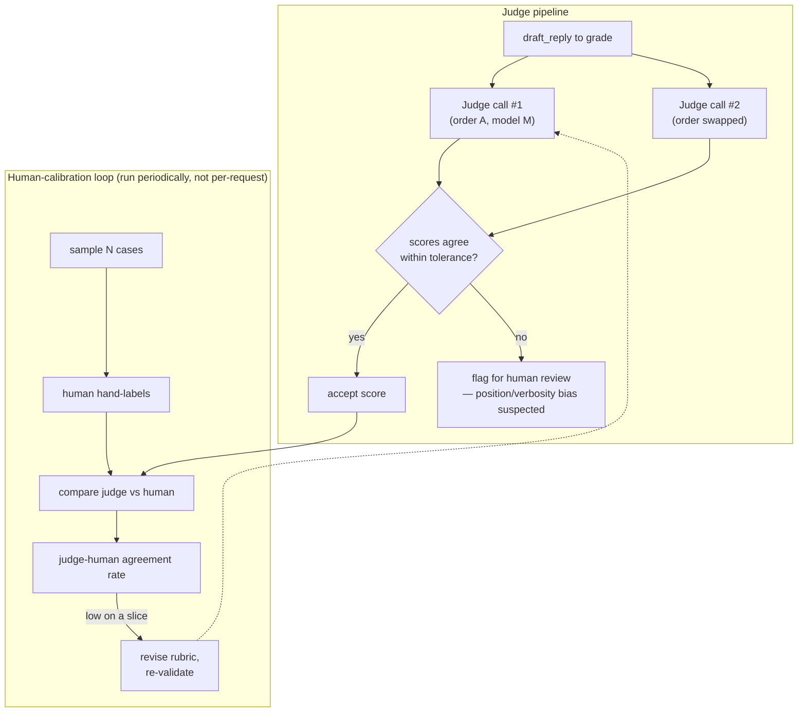

# 11 · LLM-as-Judge, Graders & Knowing When to Distrust Them

> `draft_reply` has no single correct string — you can't exact-match free text. This chapter covers
> when you're forced to use a model to grade a model, how to write a judge that's actually
> trustworthy (rubric, scale, reasoning-before-score), the classic biases that quietly corrupt
> judge scores, and how to validate a judge against your own human labels before you trust it.
> [← Part 2 · Evals](README.md) · prev: [10 · Building an Eval Suite from Scratch](10-building-an-eval-suite-from-scratch.md) · next: [Part 3 · RAG & Retrieval](../03-rag-and-retrieval/README.md)

> **Predict first (2 min).** Write your guesses: (1) You ask a judge model to output just a
> number, 1–5, for reply quality — no explanation. Is that score more or less reliable than asking
> it to explain its reasoning first and then give the number? (2) A judge compares two replies,
> "A" and "B," and picks a winner. If you swap which reply is labeled A and which is B and ask
> again, does the judge always pick the same *content* as the winner? (3) Your judge agrees with
> your own human grading 96% of the time on 20 hand-labeled cases. Is 96% agreement good enough to
> trust the judge on cases you'll never look at again?

---

## When you must use a judge

From [Ch. 10](10-building-an-eval-suite-from-scratch.md)'s grader hierarchy: exact match and code
assertions are strictly better than LLM-as-judge whenever they can express the check. But some
fields genuinely have no fixed correct answer — `category` is one of four strings, `draft_reply` is
open-ended natural language where "good" is a matter of degree, not equality.

For the ticket assistant, `draft_reply` needs to satisfy criteria no regex can check: *does it
sound appropriately empathetic for someone whose ceiling is leaking, without being saccharine? Does
it commit to something the company can actually deliver? Does it avoid promising a specific
technician arrival time nobody confirmed?* This is a judgment call about meaning and appropriateness
— exactly the kind of thing an LLM is good at approximating, and exactly the kind of thing you
cannot code-assert your way around.

**The rule: reach for LLM-as-judge only for the fields where tiers 1–2 are structurally incapable
of grading — not because writing a code assertion is more work.** If you can express the check as
code (word count, contains-a-phone-number, valid JSON), do that instead; it's cheaper, faster, and
never has its own bugs to debug.

---

## Writing a judge you can trust

A judge is just another model call, and it inherits every failure mode of a poorly-written prompt
([Ch. 05](../01-engineering-the-api/05-prompting-as-engineering.md)) plus a new one: silent,
overconfident wrongness that *looks* like ground truth because it comes out as a clean number.
Four design rules make the difference between a judge that's actually calibrated and one that's
theater:

1. **A concrete rubric, not "rate the quality 1–5."** Vague scales collapse to the judge's prior
   about what "good" sounds like — usually a preference for length and formal tone, not your actual
   requirements. Spell out what each point on the scale means for *your* task.
2. **Reasoning before score.** Force the judge to write out its analysis, then commit to a number
   — never the reverse. This is the same mechanism as the "spell it out before counting" trick from
   [Ch. 01](../00-how-llms-work/01-tokens-transformers-and-why-context-is-expensive.md): the model
   can only condition on tokens it already generated, so a score with no preceding reasoning is
   generated from pattern-matching alone, while a score after reasoning is conditioned on that
   reasoning.
3. **Pointwise vs pairwise, chosen deliberately.** Pointwise ("score this one reply 1–5 against the
   rubric") gives you an absolute number you can track over time and slice. Pairwise ("which of
   these two replies is better") is more reliable for *relative* judgments (models are generally
   better at comparison than absolute calibration) but doesn't give you a trend line — use it for
   A/B-ing two prompt versions head-to-head, use pointwise for your standing eval suite.
4. **A held-out calibration set.** Never tune your judge's rubric against the same cases you use to
   report your final score — you'll overfit the judge to like your current outputs specifically.

A real judge prompt for `draft_reply`:

```
You are grading a customer service reply for a facilities-maintenance ticket assistant.

CONTEXT
Customer email: {{email_body}}
Ticket category: {{category}}, urgency: {{urgency}}
Reply to grade: {{draft_reply}}

RUBRIC (score 1-5)
5 - Acknowledges the specific issue, sets a concrete and honest next step, matches urgency in tone,
    makes no unconfirmed commitments (no specific ETAs, no promises about parts/cost).
4 - Meets all of the above with one minor stylistic issue (slightly too formal/casual, mildly
    repetitive) but no factual or policy problems.
3 - Addresses the issue but is generic (could apply to almost any ticket) OR mismatches urgency
    (too casual for an emergency, too dramatic for routine maintenance).
2 - Makes an unconfirmed commitment (a specific time, a cost, a guarantee) OR misses part of what
    the customer actually asked.
1 - Ignores the customer's actual issue, is factually wrong about policy, or is unusable as a reply.

INSTRUCTIONS
1. First, write 2-4 sentences of reasoning: what does the reply get right, what (if anything) does
   it get wrong, referencing the rubric explicitly.
2. Then output a single line: SCORE: <1-5>

Do not skip the reasoning step. Do not let reply length influence your score.
```

Real judge output:

```json
{
  "case_id": "tk-014",
  "reasoning": "The reply acknowledges the active water leak specifically (references the breakroom and sagging tile), sets a concrete next step ('a technician will be dispatched today'), and matches the urgency of the situation without being alarmist. It does not commit to a specific arrival time or promise a cost. Minor issue: it repeats 'today' twice, slightly redundant but not a policy problem.",
  "score": 4,
  "pass": true
}
```

Note the shape: reasoning is a required field the judge must produce *before* `score`, and the
`pass` boolean is derived from a threshold you set (e.g. score ≥ 4 = pass) — don't let the judge
decide pass/fail directly, keep that threshold in your own code where it's visible and tunable.

---

## The classic judge biases

Judges are LLMs, and LLMs carry systematic priors that corrupt grading in predictable directions.
Know these three cold — they show up in almost every judge-graded eval:

| Bias | What happens | Why (mechanism) | Control |
|---|---|---|---|
| **Position bias** | In pairwise comparisons, the judge favors whichever answer appears *first* (or second) in the prompt, regardless of content | Attention and training data both encode positional patterns; nothing guarantees symmetry over an arbitrary A/B ordering | Run every pairwise comparison twice with the order swapped; only trust a verdict that agrees both ways |
| **Verbosity / length bias** | Longer answers score higher even when they're not more correct or more useful | The judge's training data correlates thoroughness with length; "sounds complete" pattern-matches to length | Add an explicit rubric line ("do not let length influence your score"); spot-check by comparing a short-correct vs long-padded pair |
| **Self-preference** | A model judges outputs from *its own family* more favorably than outputs from a different model | The judge's notion of "sounds right" is shaped by its own generation style | Use a different model (or model family) as judge than the one under test wherever possible; if you can't, weight this risk into how much you trust marginal scores |

These aren't hypothetical — they replicate reliably across judge setups, which is exactly why you
build controls into the harness rather than hoping a well-written rubric alone fixes them. The
rubric reduces *how much room* the bias has to operate in; swapping order, watching for length
correlation, and using a different model family are the actual controls.



---

## Validating the judge: judge-human agreement

A judge is a measurement instrument, and like any instrument you calibrate it against ground truth
before trusting its readings on cases you'll never personally check. The procedure:

1. **Hand-label a sample yourself.** Take 20 cases (ideally spanning your slices, weighted toward
   the ones you're least sure about) and score `draft_reply` against the exact same rubric you gave
   the judge, as a human. This is slow and is the point — you are the ground truth here.
2. **Run the judge on the same 20 cases.** Same rubric, same inputs.
3. **Compute agreement.** Not just raw match — report it at the resolution that matters:

| Metric | Value | What it tells you |
|---|---|---|
| Exact score match (same 1–5) | 13/20 = 65% | Strict — often lower than you'd like even for good judges |
| Within ±1 point | 19/20 = 95% | The number that usually matters for "is this reply acceptable" decisions |
| Pass/fail agreement (score ≥4 threshold) | 18/20 = 90% | The number that matters for your eval's aggregate pass rate |
| Cases where judge and human *disagreed on direction* (judge said pass, human said clear fail, or vice versa) | 1/20 | The number that should worry you most — direction errors, not off-by-one score noise |

Answer to prediction #3: **96% raw agreement is not automatically "good enough" — it depends
entirely on where the disagreement lives.** If the 4% disagreement is all off-by-one on borderline
3-vs-4 cases, that's fine, judges and humans wobble there too. If even one of those disagreements is
a *direction* flip — the judge passed a reply that clearly ignores the customer's actual question,
or failed a reply a human would call obviously fine — that's disqualifying for that slice until
fixed, because direction errors are exactly the errors that let bad output ship silently.

---

## When NOT to trust the judge

Three situations where you fall back to human review regardless of what the judge says:

- **Borderline cases near your pass/fail threshold.** A judge score of exactly 3 on a 1–5 scale with
  a pass-at-4 threshold is the least informative point on the scale — route anything within one
  point of the threshold to a human queue rather than trusting the automated call, at least until
  you've validated that slice specifically.
- **Safety-critical or policy-critical content.** Anything touching commitments the company must
  actually honor (cost quotes, legal language, safety escalation for property damage or injury
  risk) gets a human in the loop no matter how well-calibrated the judge tests on routine cases —
  the cost of a judge's rare direction-flip is asymmetric here (Ch. 21's "blast radius" framing
  applies to grading too, not just to agent actions).
- **Any slice you haven't calibrated.** Judge-human agreement measured on `routine_request` cases
  tells you nothing about the judge's reliability on `angry_customer_tone` or non-English input —
  agreement is a per-slice property, not a global one. Re-run the calibration whenever you add a
  new slice or change the rubric.

The judge is a cheap, scalable *approximation* of your own judgment, calibrated where you've
checked it and unproven everywhere else. Treat an un-calibrated judge score the way you'd treat an
unreviewed teammate's self-assessment: informative, not sufficient.

---

## Build it (45–60 min): grade, hand-label, measure agreement, fix a bias

1. **Take your 40-case suite from [Ch. 10](10-building-an-eval-suite-from-scratch.md).** Write the
   judge prompt above (adapt the rubric to your actual `draft_reply` requirements) and run it over
   all 40 `draft_reply` outputs. Record score + reasoning for each.
2. **Hand-label 20 of the 40 yourself**, blind to the judge's score (grade before you look at what
   the judge said, so you don't anchor on it). Use the identical rubric.
3. **Compute judge-human agreement**: exact match, within-±1, and pass/fail agreement at your
   threshold. Build the small table shown above with your real numbers.
4. **Find your own judge's worst disagreement** — the one case where judge and human diverge most.
   Read both the reasoning the judge gave and your own reasoning. Diagnose which bias (position,
   verbosity, self-preference, or something else — e.g. the judge missing your company's specific
   policy the way a generic rubric might) caused it.
5. **Fix it and re-measure.** If it's verbosity bias, add the explicit anti-length line and reword
   the rubric to reward *specificity* over length; if it's a missing policy detail, add it to the
   rubric explicitly. Re-run the judge on the same 20 hand-labeled cases and report the new
   agreement rate next to the old one.
6. **The one-sentence reconciliation**: *"I predicted X, the judge-human comparison showed Y,
   because Z."* — e.g. "I predicted reasoning-before-score would make the judge more reliable than
   score-only; the comparison showed pass/fail agreement rose from 80% to 95% across the same 20
   cases; because forcing the judge to name the specific rubric line it was applying stopped it from
   defaulting to a length-correlated gut score."

---

## Self-Check (close the doc, answer out loud)

1. Give one field from the ticket assistant that must be judge-graded and one that must never be —
   and say what tier-1/tier-2 grader you'd use instead for the second.
2. Why does forcing "reasoning before score" actually change the score's reliability, in terms of
   what the model conditions on token by token?
3. Name the three classic judge biases and, for each, name the concrete control you'd add to the
   harness (not "be careful," an actual mechanism).
4. Your judge and your hand labels agree 96% of the time on 20 cases, but the one disagreement is a
   direction flip on a property-damage ticket. Do you ship the judge as-is? Why or why not?
5. Explain the difference between pointwise and pairwise judging, and say which one you'd use to
   decide "should we roll back last week's prompt change" versus "should this eval suite have a
   standing quality score we track weekly."
6. A colleague proposes using the same model for both generating `draft_reply` and judging it, to
   save an API integration. What's the specific bias this risks, and what's your counter-proposal?
