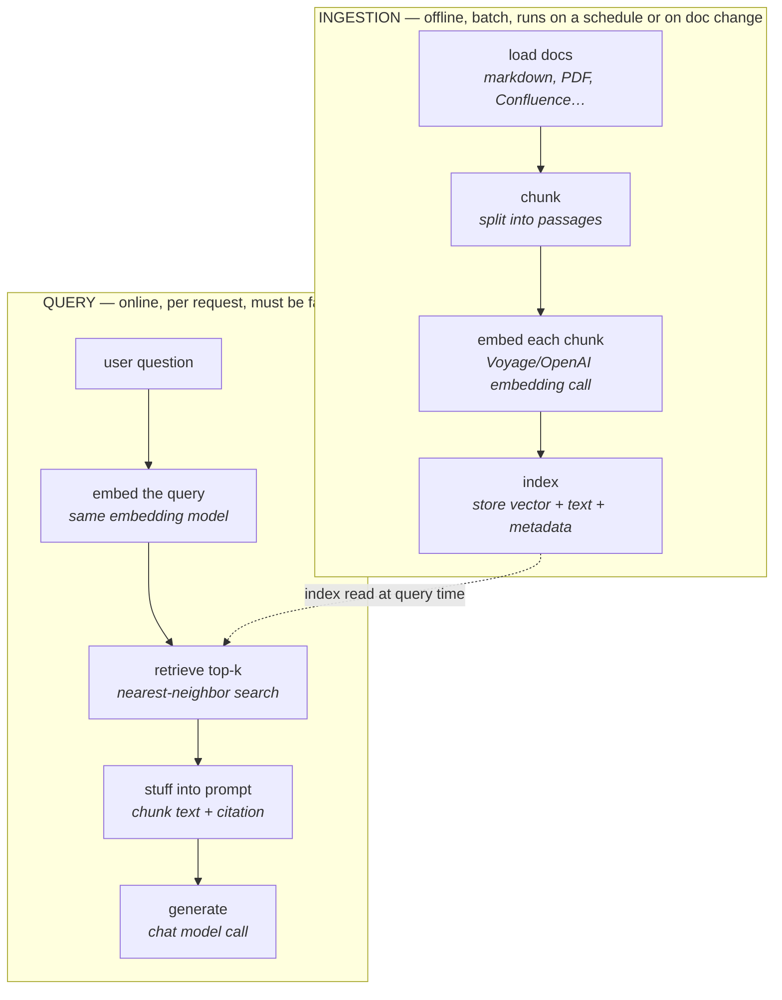

# 12 · The RAG Pipeline: Ingestion, Chunking, Indexing

> How a folder of help-center articles becomes something a model can answer from — the two-phase
> architecture every RAG system shares, and the chunking decisions you make once at ingestion time
> that are expensive to undo later.
> [← Part 3 · RAG & Retrieval](README.md) · next: 13 · Hybrid Search, Reranking & Filters

> **Predict first (2 min).** Write your guesses: (1) Claude's context window is huge — why not just
> paste all 30 help-center articles into every prompt instead of building a retrieval pipeline?
> (2) If you chunk a document into 100-token pieces vs 4,000-token pieces, which one is more likely
> to retrieve *precisely* the right passage, and which is more likely to give the model enough
> surrounding context to actually answer? (3) You re-embed your corpus with a new embedding model —
> do your existing chunk boundaries still matter, or do you have to redo everything?

---

## Why RAG when the context window is huge

Chapter 01 already gave you the physics: a "200k-token context window" is a token budget, and
prefill cost grows roughly quadratically with prompt length. Stuffing 30 help-center articles
(~40k tokens) into *every* ticket-assistant call is a real option — and a bad one, for four
compounding reasons:

| Reason | Mechanism |
|---|---|
| **Grounding, not just facts** | Chapter 01: hallucination and correct recall are the *same* mechanism (plausible next token). Retrieval doesn't fix the model — it changes what's plausible to generate by putting the right text directly in context. |
| **Cost** | 40k tokens × $3/MTok × every ticket = $0.12/ticket just in corpus tokens, whether or not the ticket needs it. At 100k tickets/month that's $12,000/month of mostly-wasted input. |
| **Freshness** | A policy changes today. Baked-into-context data is stale until you edit and redeploy the prompt. A retrieval index is stale only until you re-ingest — minutes, not a deploy. |
| **Access control** | Different customers, tenants, or support tiers see different subsets of docs. You cannot selectively "forget" part of a static system prompt per request; you *can* filter a retrieval query by tenant (Chapter 13). |

RAG's actual value proposition: **retrieve only the 2–5 passages relevant to *this* question**,
so the model reads maybe 1,500 tokens of *targeted* context instead of 40,000 tokens of everything,
and so an answer can be traced back to a specific source document — the trust and cost story at
once.

---

## The two-phase architecture

Every RAG system, regardless of vector DB or framework, is two pipelines that run at completely
different times and different frequencies:



Ingestion runs once per document (or on a schedule); query runs once per user request. This split
matters because it tells you where each decision lives and how expensive it is to change:

| Decision | Made at | Cost to change later |
|---|---|---|
| Chunk size, overlap, splitting strategy | Ingestion | **Expensive** — requires re-chunking and re-embedding the entire corpus |
| Embedding model | Ingestion | **Very expensive** — Chapter 03: vectors from different models aren't comparable, so switching means a full re-embed of every document |
| Metadata schema (doc type, tenant, date) | Ingestion | Expensive — retroactively tagging thousands of chunks is manual or re-run work |
| Top-k, prompt template, rerank on/off | Query | **Cheap** — a config value, changeable per request, no re-ingestion needed |

The rule that falls out: **anything upstream of the vector is a slow, expensive decision; anything
downstream is a fast, cheap one.** When in doubt, push tunables to query time and eval them
(Chapter 14) before locking in an ingestion-time choice you'll regret at 10,000 documents.

---

## Chunking: the decision that dominates everything downstream

A "chunk" is the unit you embed, store, and retrieve — never a whole document (too coarse for
precise retrieval, too expensive to embed and re-embed) and never a single sentence (too little
context to be useful once retrieved). Chunk size is a trade-off with failure modes on both ends:

**Too small (~100 tokens):**
- Retrieval gets *precise* — a 100-token chunk about "resetting the thermostat lockout" scores
  a sharp match for that exact query.
- But the retrieved chunk often lacks context to answer alone. `"Then press and hold for 5
  seconds."` — hold *what*? The antecedent is in the previous chunk, which didn't get retrieved.
- More chunks = more embedding calls and more rows in the index, but each is cheap.

**Too large (~4,000 tokens):**
- Each chunk carries plenty of context — a full procedure, start to finish.
- But it dilutes the embedding: a 4,000-token chunk covering five unrelated troubleshooting steps
  produces one vector that's an *average* of five topics, so it scores mediocre-relevant to all
  five queries and top-relevant to none. Precision drops.
- Fewer chunks, but each one, once retrieved, burns much more of the query-time token budget —
  retrieving 5 such chunks at top-k=5 could be 20,000 tokens for one answer.

**The mitigations, all applied at ingestion time:**

- **Overlap** (e.g. 15–20% of chunk size): each chunk repeats the tail of the previous one, so a
  boundary that splits mid-thought still leaves enough context on either side to stand alone.
- **Heading-aware splitting**: split on document structure (`##` headings, list boundaries) instead
  of a raw token count, so a chunk never cuts a numbered procedure in half. Markdown help-center
  articles make this cheap — split on headings first, then sub-split any section still over budget.
- **Contextual chunk headers**: prepend a short synthetic header to each chunk before embedding —
  `"[HVAC Troubleshooting > Thermostat Lockout Reset]"` — so the chunk carries its place in the
  document into the vector itself, and the model sees that lineage when the chunk is retrieved.

There's no universal right chunk size — it's an empirical question you answer with the
retrieval-recall eval in Chapter 14, not a rule of thumb. A reasonable starting point for
prose-heavy help-center content: **300–500 tokens, 15% overlap, split on headings first.**

---

## Vector DB choice: pgvector is the boring right answer, often

You do not need a dedicated vector database to ship RAG. The actual requirements are: store a
vector, store its associated text and metadata, and support approximate-nearest-neighbor search
at your scale. If you already run Postgres (most backend shops do — including anywhere running
Spring Data JPA), the `pgvector` extension gives you all three with zero new infrastructure:

```sql
CREATE EXTENSION vector;

CREATE TABLE help_center_chunks (
    id          bigserial PRIMARY KEY,
    article_id  text NOT NULL,
    tenant_id   text NOT NULL,        -- access control at retrieval time (Ch. 13)
    doc_type    text NOT NULL,
    chunk_text  text NOT NULL,
    embedding   vector(1024)          -- matches your embedding model's dimensionality
);

CREATE INDEX ON help_center_chunks
    USING hnsw (embedding vector_cosine_ops);

-- query time: nearest neighbors by cosine distance, filtered by tenant
SELECT chunk_text, article_id, 1 - (embedding <=> $1) AS similarity
FROM help_center_chunks
WHERE tenant_id = $2
ORDER BY embedding <=> $1
LIMIT 5;
```

Reach for a dedicated vector DB (Pinecone, Weaviate, Qdrant) when you're past ~10M vectors, need
multi-region replication of the index specifically, or need vector-native features (server-side
hybrid fusion, managed reranking) that `pgvector` doesn't do out of the box. Below that scale,
introducing a second datastore is usually paying operational complexity for a problem you don't
have yet — the same "boring technology wins" instinct that applies everywhere else in backend
engineering.

---

## Build it (45–60 min)

1. **Generate a corpus.** Ask Claude to generate ~30 short markdown help-center articles for a
   facilities/ops company (HVAC, plumbing, electrical, access badges, work-order status, billing).
   Give each a clear `# Title` and a few `##` sections — you need real heading structure to test
   heading-aware chunking. Save as `corpus/*.md`.
2. **Ingest with two chunking strategies.** Build a small ingestion script:
   - Strategy A: naive fixed-size, 200 tokens, no overlap, no heading awareness.
   - Strategy B: heading-aware, ~400 tokens per chunk, 15% overlap, contextual header prepended.
   Embed both sets (Voyage, OpenAI, or a local model — same one you used in Chapter 03) and load
   into `pgvector` or an in-memory numpy index, tagged with which strategy produced each row.
3. **Wire retrieval into the ticket assistant.** Add a retrieval step before the `draft_reply` call:
   embed the incoming ticket, fetch top-3 chunks, and require the model to cite which article
   (`article_id`) it drew from in the JSON output — add a `source_article` field to the schema
   from Chapter 06.
4. **Compare qualitatively.** Run 5 real ticket-style questions through both strategies. Note where
   Strategy A returns a fragment missing the antecedent step, and where Strategy B's larger chunk
   answers cleanly.
5. **The one-sentence reconciliation:** *"I predicted X, retrieval showed Y, because Z"* — e.g.
   *"I predicted the 200-token chunks would retrieve more precisely, the results showed comparable
   top-1 hits but worse answer completeness, because small chunks lost the antecedent context."*

---

## Self-Check (close the doc, answer out loud)

1. Draw the two-phase RAG pipeline from memory and label which side each of these lives on:
   chunk size, top-k, embedding model, prompt template.
2. Give the four-part case against "just paste all the docs in context" — cost, freshness, access
   control, and the fourth (grounding/hallucination) — each with a mechanism, not a vibe.
3. What breaks with 100-token chunks? What breaks with 4,000-token chunks? Name the two mitigations
   that address the small-chunk problem specifically.
4. Why is the embedding-model choice the most expensive ingestion-time decision to change later?
   (Tie back to Chapter 03.)
5. When is `pgvector` the right call, and what's the actual trigger to reach for a dedicated
   vector DB instead?
6. A teammate wants to change chunk size from 400 to 800 tokens "just to see." What has to happen
   before that change reaches production, and why can't it be a quick prompt edit?
